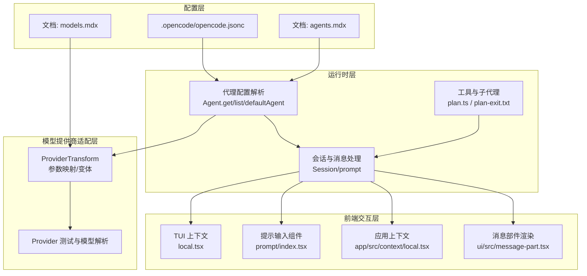
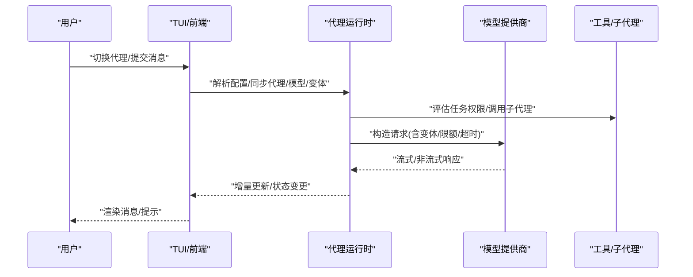
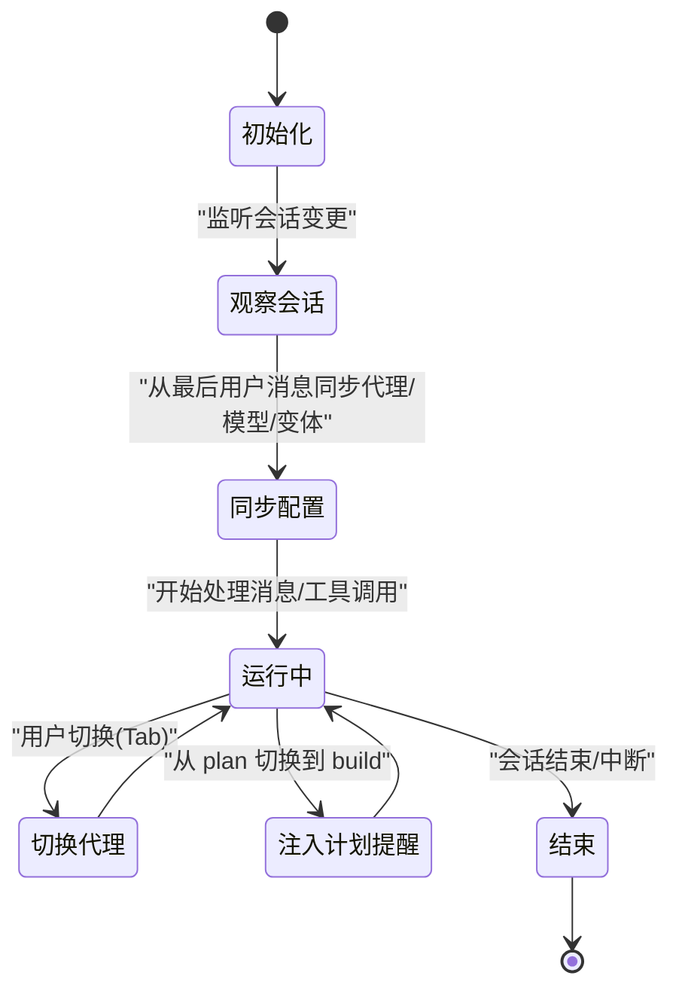
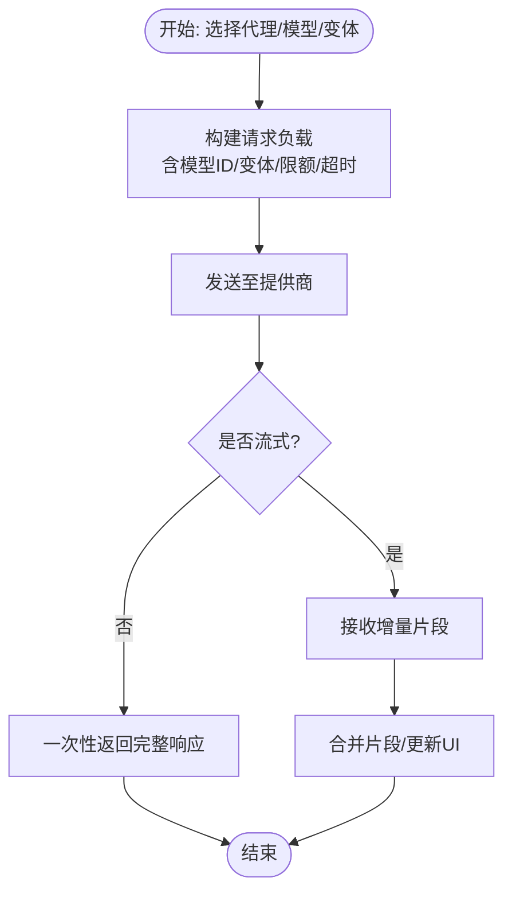
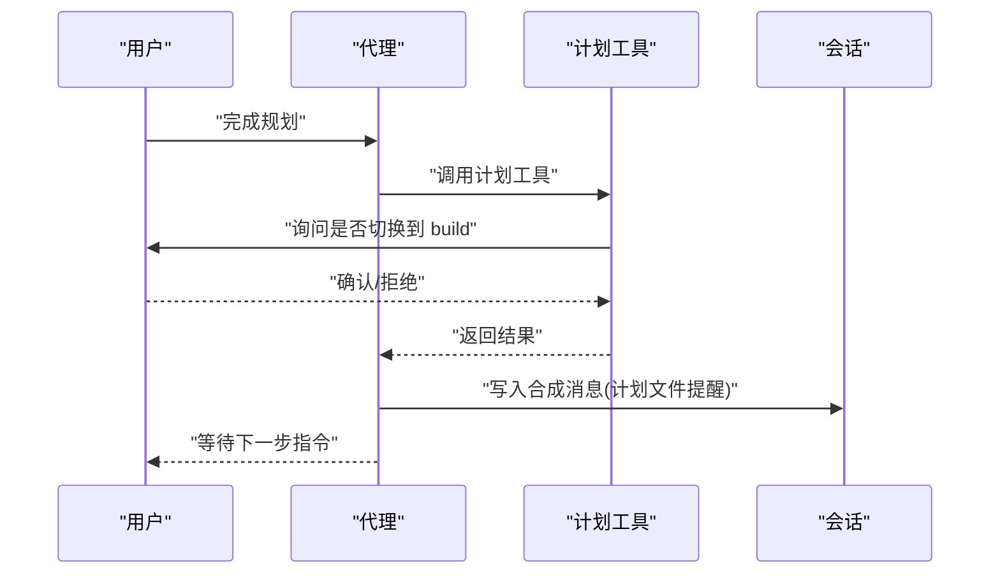
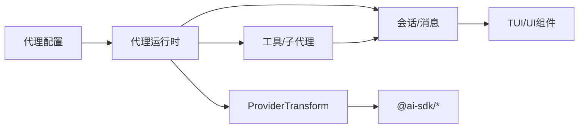

# AI代理系统

<cite>
**本文引用的文件**
- [README.md](file://README.md)
- [AGENTS.md](file://AGENTS.md)
- [.opencode/opencode.jsonc](file://.opencode/opencode.jsonc)
- [packages/opencode/src/agent/generate.txt](file://packages/opencode/src/agent/generate.txt)
- [packages/opencode/test/agent/agent.test.ts](file://packages/opencode/test/agent/agent.test.ts)
- [packages/opencode/test/provider/provider.test.ts](file://packages/opencode/test/provider/provider.test.ts)
- [packages/opencode/src/provider/transform.ts](file://packages/opencode/src/provider/transform.ts)
- [packages/opencode/src/tool/plan.ts](file://packages/opencode/src/tool/plan.ts)
- [packages/opencode/src/tool/plan-exit.txt](file://packages/opencode/src/tool/plan-exit.txt)
- [packages/opencode/src/session/prompt.ts](file://packages/opencode/src/session/prompt.ts)
- [packages/opencode/test/session/llm.test.ts](file://packages/opencode/test/session/llm.test.ts)
- [packages/opencode/src/cli/cmd/tui/context/local.tsx](file://packages/opencode/src/cli/cmd/tui/context/local.tsx)
- [packages/opencode/src/cli/cmd/tui/component/prompt/index.tsx](file://packages/opencode/src/cli/cmd/tui/component/prompt/index.tsx)
- [packages/app/src/context/local.tsx](file://packages/app/src/context/local.tsx)
- [packages/app/src/components/dialog-connect-provider.tsx](file://packages/app/src/components/dialog-connect-provider.tsx)
- [packages/ui/src/components/message-part.tsx](file://packages/ui/src/components/message-part.tsx)
- [packages/web/src/content/docs/de/agents.mdx](file://packages/web/src/content/docs/de/agents.mdx)
- [packages/web/src/content/docs/ru/keybinds.mdx](file://packages/web/src/content/docs/ru/keybinds.mdx)
- [packages/web/src/content/docs/ar/keybinds.mdx](file://packages/web/src/content/docs/ar/keybinds.mdx)
- [packages/web/src/content/docs/nb/models.mdx](file://packages/web/src/content/docs/nb/models.mdx)
- [packages/web/src/content/docs/it/ecosystem.mdx](file://packages/web/src/content/docs/it/ecosystem.mdx)
- [packages/strategy-front/src/data/global-data.ts](file://packages/strategy-front/src/data/global-data.ts)
- [packages/strategy-front/src/components/agent/agent-page.tsx](file://packages/strategy-front/src/components/agent/agent-page.tsx)
- [packages/strategy-service/internal/asset/workspace/skills/project-manager/SKILL.md](file://packages/strategy-service/internal/asset/workspace/skills/project-manager/SKILL.md)
</cite>

## 目录
1. [简介](#简介)
2. [项目结构](#项目结构)
3. [核心组件](#核心组件)
4. [架构总览](#架构总览)
5. [详细组件分析](#详细组件分析)
6. [依赖关系分析](#依赖关系分析)
7. [性能考量](#性能考量)
8. [故障排除指南](#故障排除指南)
9. [结论](#结论)
10. [附录](#附录)

## 简介
本文件系统性介绍 OpenCode 的 AI 代理系统，覆盖以下主题：
- 不同类型代理（build、plan、general）的功能特性、使用场景与配置方法
- 代理的创建、启动、停止与销毁流程
- 代理与 AI 模型提供商的集成方式、消息传递机制与状态管理
- 代理配置最佳实践、性能优化建议与故障排除
- 自定义代理开发的步骤与示例代码路径指引

OpenCode 提供两类内置主代理：build（默认全功能开发代理）、plan（只读分析与规划代理），以及一个用于复杂搜索与多步任务的 general 子代理。用户可通过配置文件对代理进行精细控制，并通过快捷键在终端界面中切换代理。

**章节来源**
- [README.md:100-114](file://README.md#L100-L114)

## 项目结构
OpenCode 的代理系统由“配置层”“运行时层”“前端交互层”“工具与子代理层”“模型提供商适配层”构成。核心要点如下：
- 配置层：通过 opencode.jsonc 与各包内的配置文件定义代理、权限、工具、格式化器、LSP、MCP 等
- 运行时层：代理生命周期管理、消息流处理、会话状态维护
- 前端交互层：TUI 中的代理选择、模型与变体切换、提交与清空等命令
- 工具与子代理层：计划工具、子代理（如 explore、summary 等）与任务权限控制
- 模型提供商适配层：统一转换与参数映射，支持多提供商与本地模型

**图表来源**
- [.opencode/opencode.jsonc:1-19](file://.opencode/opencode.jsonc#L1-L19)
- [packages/opencode/src/agent/generate.txt:1-13](file://packages/opencode/src/agent/generate.txt#L1-L13)
- [packages/opencode/src/session/prompt.ts:1362-1393](file://packages/opencode/src/session/prompt.ts#L1362-L1393)
- [packages/opencode/src/tool/plan.ts:31-76](file://packages/opencode/src/tool/plan.ts#L31-L76)
- [packages/opencode/src/cli/cmd/tui/context/local.tsx:32-74](file://packages/opencode/src/cli/cmd/tui/context/local.tsx#L32-L74)
- [packages/opencode/src/cli/cmd/tui/component/prompt/index.tsx:146-197](file://packages/opencode/src/cli/cmd/tui/component/prompt/index.tsx#L146-L197)
- [packages/app/src/context/local.tsx:370-421](file://packages/app/src/context/local.tsx#L370-L421)
- [packages/ui/src/components/message-part.tsx:1646-1680](file://packages/ui/src/components/message-part.tsx#L1646-L1680)
- [packages/opencode/src/provider/transform.ts:1-38](file://packages/opencode/src/provider/transform.ts#L1-L38)
- [packages/opencode/test/provider/provider.test.ts:260-517](file://packages/opencode/test/provider/provider.test.ts#L260-L517)

**章节来源**
- [.opencode/opencode.jsonc:1-19](file://.opencode/opencode.jsonc#L1-L19)
- [packages/opencode/src/agent/generate.txt:1-13](file://packages/opencode/src/agent/generate.txt#L1-L13)
- [packages/opencode/src/session/prompt.ts:1362-1393](file://packages/opencode/src/session/prompt.ts#L1362-L1393)
- [packages/opencode/src/tool/plan.ts:31-76](file://packages/opencode/src/tool/plan.ts#L31-L76)
- [packages/opencode/src/cli/cmd/tui/context/local.tsx:32-74](file://packages/opencode/src/cli/cmd/tui/context/local.tsx#L32-L74)
- [packages/opencode/src/cli/cmd/tui/component/prompt/index.tsx:146-197](file://packages/opencode/src/cli/cmd/tui/component/prompt/index.tsx#L146-L197)
- [packages/app/src/context/local.tsx:370-421](file://packages/app/src/context/local.tsx#L370-L421)
- [packages/ui/src/components/message-part.tsx:1646-1680](file://packages/ui/src/components/message-part.tsx#L1646-L1680)
- [packages/opencode/src/provider/transform.ts:1-38](file://packages/opencode/src/provider/transform.ts#L1-L38)
- [packages/opencode/test/provider/provider.test.ts:260-517](file://packages/opencode/test/provider/provider.test.ts#L260-L517)

## 核心组件
- 代理配置与发现
  - 代理列表、默认代理、禁用与隐藏策略、颜色与温度等属性均来自配置层
  - 测试覆盖了默认代理选择、禁用代理过滤、自定义代理覆盖原生属性等行为
- 会话与消息
  - 会话中记录代理名称、模型与变体，支持从上一条用户消息同步当前代理/模型/变体
  - 当从 plan 切换到 build 时，系统自动注入计划文件提醒
- 工具与子代理
  - 计划工具用于在完成规划后询问是否切换到 build 并执行
  - 子代理（如 explore、summary 等）可被直接调用，也可受任务权限控制
- 模型提供商适配
  - 统一将内部模型键映射到各 SDK 的 providerOptions，支持超时、分块超时、成本与限额等选项合并
- 前端交互
  - TUI 支持按 Tab 循环切换代理，支持清空提示、提交等命令
  - 应用上下文负责保存/恢复代理与模型选择，以及探测可用模型

**章节来源**
- [packages/opencode/test/agent/agent.test.ts:151-177](file://packages/opencode/test/agent/agent.test.ts#L151-L177)
- [packages/opencode/test/agent/agent.test.ts:567-689](file://packages/opencode/test/agent/agent.test.ts#L567-L689)
- [packages/opencode/src/session/prompt.ts:1362-1393](file://packages/opencode/src/session/prompt.ts#L1362-L1393)
- [packages/opencode/src/tool/plan.ts:31-76](file://packages/opencode/src/tool/plan.ts#L31-L76)
- [packages/opencode/src/cli/cmd/tui/context/local.tsx:32-74](file://packages/opencode/src/cli/cmd/tui/context/local.tsx#L32-L74)
- [packages/opencode/src/cli/cmd/tui/component/prompt/index.tsx:146-197](file://packages/opencode/src/cli/cmd/tui/component/prompt/index.tsx#L146-L197)
- [packages/app/src/context/local.tsx:370-421](file://packages/app/src/context/local.tsx#L370-L421)
- [packages/opencode/src/provider/transform.ts:1-38](file://packages/opencode/src/provider/transform.ts#L1-L38)
- [packages/opencode/test/provider/provider.test.ts:260-517](file://packages/opencode/test/provider/provider.test.ts#L260-L517)

## 架构总览
OpenCode 的代理系统采用“配置驱动 + 运行时编排 + 多前端入口”的架构。配置文件决定代理能力边界与行为，运行时负责消息流与状态迁移，前端提供交互入口，提供商适配层屏蔽多模型差异。

**图表来源**
- [packages/opencode/src/cli/cmd/tui/context/local.tsx:32-74](file://packages/opencode/src/cli/cmd/tui/context/local.tsx#L32-L74)
- [packages/opencode/src/cli/cmd/tui/component/prompt/index.tsx:146-197](file://packages/opencode/src/cli/cmd/tui/component/prompt/index.tsx#L146-L197)
- [packages/opencode/src/session/prompt.ts:1362-1393](file://packages/opencode/src/session/prompt.ts#L1362-L1393)
- [packages/opencode/src/provider/transform.ts:1-38](file://packages/opencode/src/provider/transform.ts#L1-L38)
- [packages/opencode/test/session/llm.test.ts:423-466](file://packages/opencode/test/session/llm.test.ts#L423-L466)

## 详细组件分析

### 代理类型与职责
- build 代理
  - 默认主代理，具备全权限（文件编辑、命令执行等），适合直接实现方案
  - 可通过配置覆盖模型、描述、温度、颜色等
- plan 代理
  - 只读代理，侧重分析与规划，禁止默认文件编辑，运行 bash 命令需授权
  - 适合探索未知代码库或制定实施计划
- general 子代理
  - 用于复杂搜索与多步任务，可通过消息中的 @general 调用
  - 作为通用工具在更复杂的任务中发挥作用

**章节来源**
- [README.md:100-114](file://README.md#L100-L114)
- [packages/opencode/test/agent/agent.test.ts:151-177](file://packages/opencode/test/agent/agent.test.ts#L151-L177)

### 代理生命周期与状态管理
- 创建与加载
  - 代理配置来源于配置文件与内置生成模板，测试验证了自定义代理覆盖原生属性的行为
- 启动与切换
  - TUI 支持按 Tab 在可见代理间循环切换；当会话变更时，系统从最后一条用户消息同步代理/模型/变体
- 停止与销毁
  - 会话结束或用户中断即停止；前端上下文负责清理模型探测与保存/恢复状态
- 状态迁移
  - 从 plan 切换到 build 时，系统自动注入计划文件提醒，确保后续实现有据可依

**图表来源**
- [packages/opencode/src/cli/cmd/tui/context/local.tsx:32-74](file://packages/opencode/src/cli/cmd/tui/context/local.tsx#L32-L74)
- [packages/opencode/src/cli/cmd/tui/component/prompt/index.tsx:146-197](file://packages/opencode/src/cli/cmd/tui/component/prompt/index.tsx#L146-L197)
- [packages/opencode/src/session/prompt.ts:1362-1393](file://packages/opencode/src/session/prompt.ts#L1362-L1393)
- [packages/app/src/context/local.tsx:370-421](file://packages/app/src/context/local.tsx#L370-L421)

**章节来源**
- [packages/opencode/src/cli/cmd/tui/context/local.tsx:32-74](file://packages/opencode/src/cli/cmd/tui/context/local.tsx#L32-L74)
- [packages/opencode/src/cli/cmd/tui/component/prompt/index.tsx:146-197](file://packages/opencode/src/cli/cmd/tui/component/prompt/index.tsx#L146-L197)
- [packages/opencode/src/session/prompt.ts:1362-1393](file://packages/opencode/src/session/prompt.ts#L1362-L1393)
- [packages/app/src/context/local.tsx:370-421](file://packages/app/src/context/local.tsx#L370-L421)

### 代理与模型提供商集成
- 参数映射与变体
  - 将内部模型键映射到各 SDK 的 providerOptions，支持超时、分块超时、成本与限额合并
- 请求构造与流式输出
  - 测试覆盖了向特定提供商发送消息 API 负载、推理强度、最大输出令牌等
- 权限与限额
  - Provider 层面支持为模型设置 cost、limit 等，测试验证了合并逻辑

**图表来源**
- [packages/opencode/src/provider/transform.ts:1-38](file://packages/opencode/src/provider/transform.ts#L1-L38)
- [packages/opencode/test/session/llm.test.ts:423-466](file://packages/opencode/test/session/llm.test.ts#L423-L466)
- [packages/opencode/test/provider/provider.test.ts:260-517](file://packages/opencode/test/provider/provider.test.ts#L260-L517)

**章节来源**
- [packages/opencode/src/provider/transform.ts:1-38](file://packages/opencode/src/provider/transform.ts#L1-L38)
- [packages/opencode/test/session/llm.test.ts:423-466](file://packages/opencode/test/session/llm.test.ts#L423-L466)
- [packages/opencode/test/provider/provider.test.ts:260-517](file://packages/opencode/test/provider/provider.test.ts#L260-L517)

### 消息传递机制与工具/子代理
- 计划工具
  - 完成规划后询问用户是否切换到 build 并执行；若拒绝则保持在 plan
- 子代理调用
  - 用户可通过 @ 语法直接调用子代理（如 general），即使任务权限可能限制自动调用
- 任务权限
  - 对子代理的调用规则按顺序匹配，最后一条匹配规则生效；deny 会使子代理从任务工具描述中移除

**图表来源**
- [packages/opencode/src/tool/plan.ts:31-76](file://packages/opencode/src/tool/plan.ts#L31-L76)
- [packages/opencode/src/tool/plan-exit.txt:1-13](file://packages/opencode/src/tool/plan-exit.txt#L1-L13)
- [packages/opencode/src/session/prompt.ts:1362-1393](file://packages/opencode/src/session/prompt.ts#L1362-L1393)

**章节来源**
- [packages/opencode/src/tool/plan.ts:31-76](file://packages/opencode/src/tool/plan.ts#L31-L76)
- [packages/opencode/src/tool/plan-exit.txt:1-13](file://packages/opencode/src/tool/plan-exit.txt#L1-L13)
- [packages/opencode/src/session/prompt.ts:1362-1393](file://packages/opencode/src/session/prompt.ts#L1362-L1393)

### 配置与最佳实践
- 代理配置
  - 使用 agent 字段定义 build、plan、general 等代理；可设置描述、模型、温度、颜色、禁用、提示文件等
  - 文档提供了禁用、提示文件、颜色、Top P 等配置示例
- 模型与变体
  - provider 下可为内置模型定义 variants，支持推理强度、文本冗长度、摘要策略等
- 权限与安全
  - 通过 permission 控制文件编辑、bash 执行、网络访问等；.opencode/opencode.jsonc 提供默认权限示例
- 前端交互
  - TUI 中通过 Tab 快捷键在代理间循环切换；支持清空提示、提交等命令

**章节来源**
- [packages/web/src/content/docs/de/agents.mdx:273-325](file://packages/web/src/content/docs/de/agents.mdx#L273-L325)
- [packages/web/src/content/docs/ru/keybinds.mdx:37-74](file://packages/web/src/content/docs/ru/keybinds.mdx#L37-L74)
- [packages/web/src/content/docs/ar/keybinds.mdx:37-74](file://packages/web/src/content/docs/ar/keybinds.mdx#L37-L74)
- [packages/web/src/content/docs/nb/models.mdx:90-130](file://packages/web/src/content/docs/nb/models.mdx#L90-L130)
- [.opencode/opencode.jsonc:8-18](file://.opencode/opencode.jsonc#L8-L18)

### 自定义代理开发步骤
- 步骤
  - 在配置文件中定义新代理，设置描述、模型、温度、颜色等
  - 如需只读或受限能力，调整权限（edit/bash/webfetch）与禁用项
  - 若涉及复杂任务，可结合工具与子代理（如 general）实现多步协作
  - 在前端通过 Tab 切换代理，或在消息中直接 @ 子代理触发
- 示例代码路径
  - 代理配置生成模板：[packages/opencode/src/agent/generate.txt:1-13](file://packages/opencode/src/agent/generate.txt#L1-L13)
  - 代理默认值与覆盖行为测试：[packages/opencode/test/agent/agent.test.ts:151-177](file://packages/opencode/test/agent/agent.test.ts#L151-L177)
  - 子代理调用与权限控制：[packages/opencode/src/tool/plan.ts:31-76](file://packages/opencode/src/tool/plan.ts#L31-L76)
  - 会话中注入计划提醒：[packages/opencode/src/session/prompt.ts:1362-1393](file://packages/opencode/src/session/prompt.ts#L1362-L1393)

**章节来源**
- [packages/opencode/src/agent/generate.txt:1-13](file://packages/opencode/src/agent/generate.txt#L1-L13)
- [packages/opencode/test/agent/agent.test.ts:151-177](file://packages/opencode/test/agent/agent.test.ts#L151-L177)
- [packages/opencode/src/tool/plan.ts:31-76](file://packages/opencode/src/tool/plan.ts#L31-L76)
- [packages/opencode/src/session/prompt.ts:1362-1393](file://packages/opencode/src/session/prompt.ts#L1362-L1393)

## 依赖关系分析
- 组件耦合
  - 代理配置与运行时紧密耦合，前端通过上下文同步代理/模型/变体
  - 工具与子代理依赖任务权限与会话状态
  - 提供商适配层向上游屏蔽多 SDK 的差异
- 外部依赖
  - ai-sdk 提供的 providerOptions 映射
  - 各大模型提供商的 SDK（OpenAI、Anthropic、Google、Bedrock 等）

**图表来源**
- [packages/opencode/src/provider/transform.ts:1-38](file://packages/opencode/src/provider/transform.ts#L1-L38)
- [packages/opencode/src/cli/cmd/tui/context/local.tsx:32-74](file://packages/opencode/src/cli/cmd/tui/context/local.tsx#L32-L74)
- [packages/ui/src/components/message-part.tsx:1646-1680](file://packages/ui/src/components/message-part.tsx#L1646-L1680)

**章节来源**
- [packages/opencode/src/provider/transform.ts:1-38](file://packages/opencode/src/provider/transform.ts#L1-L38)
- [packages/opencode/src/cli/cmd/tui/context/local.tsx:32-74](file://packages/opencode/src/cli/cmd/tui/context/local.tsx#L32-L74)
- [packages/ui/src/components/message-part.tsx:1646-1680](file://packages/ui/src/components/message-part.tsx#L1646-L1680)

## 性能考量
- 输出令牌上限与推理强度
  - 变体可控制推理强度与文本冗长度，从而影响响应质量与成本
- 流式响应与超时
  - 提供商层面对超时与分块超时进行配置，有助于提升交互流畅度
- 会话状态与增量更新
  - 增量片段合并与 UI 更新应避免重复渲染，减少前端压力

**章节来源**
- [packages/web/src/content/docs/nb/models.mdx:90-130](file://packages/web/src/content/docs/nb/models.mdx#L90-L130)
- [packages/opencode/test/session/llm.test.ts:423-466](file://packages/opencode/test/session/llm.test.ts#L423-L466)
- [packages/opencode/src/provider/transform.ts:1-38](file://packages/opencode/src/provider/transform.ts#L1-L38)

## 故障排除指南
- 默认代理不可用
  - 当默认代理指向子代理或隐藏代理，或所有主代理被禁用时，系统会抛出错误
- 代理未出现在列表
  - 禁用或隐藏的代理不会出现在可见列表中
- 模型不可用或超时
  - 检查提供商配置与环境变量，确认超时与分块超时设置合理
- 子代理无法自动调用
  - 任务权限可能将其标记为 deny；可通过 @ 语法直接调用

**章节来源**
- [packages/opencode/test/agent/agent.test.ts:567-689](file://packages/opencode/test/agent/agent.test.ts#L567-L689)
- [packages/opencode/test/provider/provider.test.ts:260-517](file://packages/opencode/test/provider/provider.test.ts#L260-L517)

## 结论
OpenCode 的 AI 代理系统以配置为中心，结合运行时编排与多前端入口，实现了灵活、可扩展且易用的代理生态。通过合理的代理类型划分、权限控制、工具与子代理协作，以及统一的提供商适配层，用户可以在终端环境中高效地进行开发、分析与协作。建议在实际使用中遵循配置最佳实践，关注性能与稳定性，并利用测试用例与文档快速定位问题。

## 附录
- 相关文档与生态
  - 代理与模型文档：[packages/web/src/content/docs/de/agents.mdx](file://packages/web/src/content/docs/de/agents.mdx)
  - 键位绑定（Tab 切换代理）：[packages/web/src/content/docs/ru/keybinds.mdx](file://packages/web/src/content/docs/ru/keybinds.mdx)、[packages/web/src/content/docs/ar/keybinds.mdx](file://packages/web/src/content/docs/ar/keybinds.mdx)
  - 生态与第三方集成参考：[packages/web/src/content/docs/it/ecosystem.mdx](file://packages/web/src/content/docs/it/ecosystem.mdx)
- 项目级代理页面与状态管理
  - 代理页面与统计：[packages/strategy-front/src/components/agent/agent-page.tsx](file://packages/strategy-front/src/components/agent/agent-page.tsx)
  - 全局数据与状态归一化：[packages/strategy-front/src/data/global-data.ts](file://packages/strategy-front/src/data/global-data.ts)
- 项目管理技能协议（与代理协作）
  - 项目管理技能说明：[packages/strategy-service/internal/asset/workspace/skills/project-manager/SKILL.md](file://packages/strategy-service/internal/asset/workspace/skills/project-manager/SKILL.md)