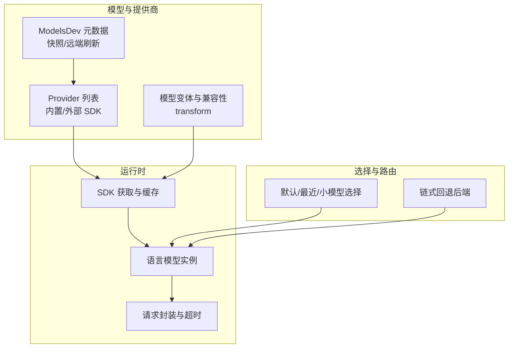
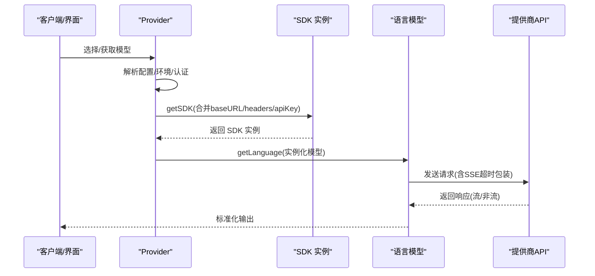
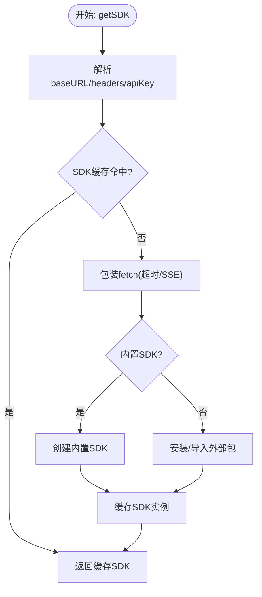
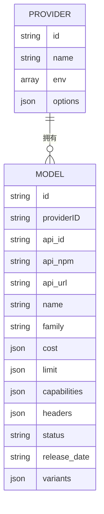
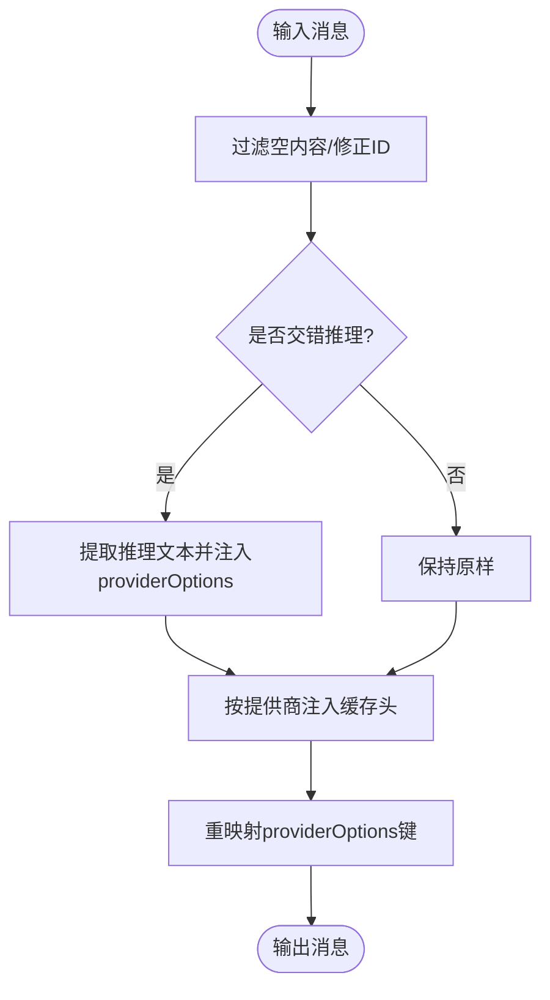
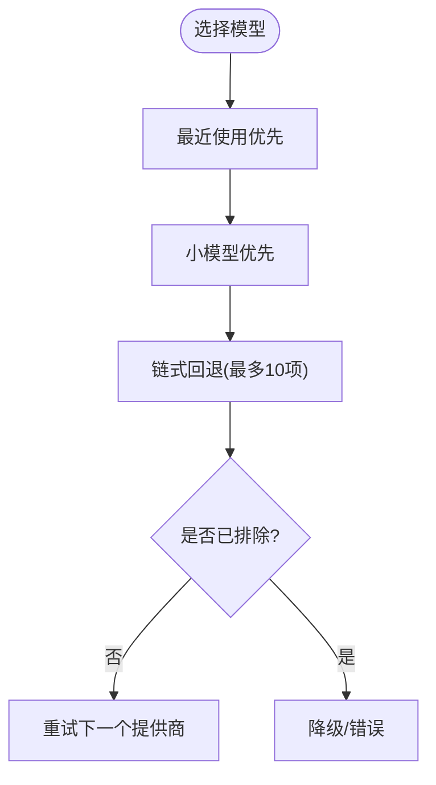
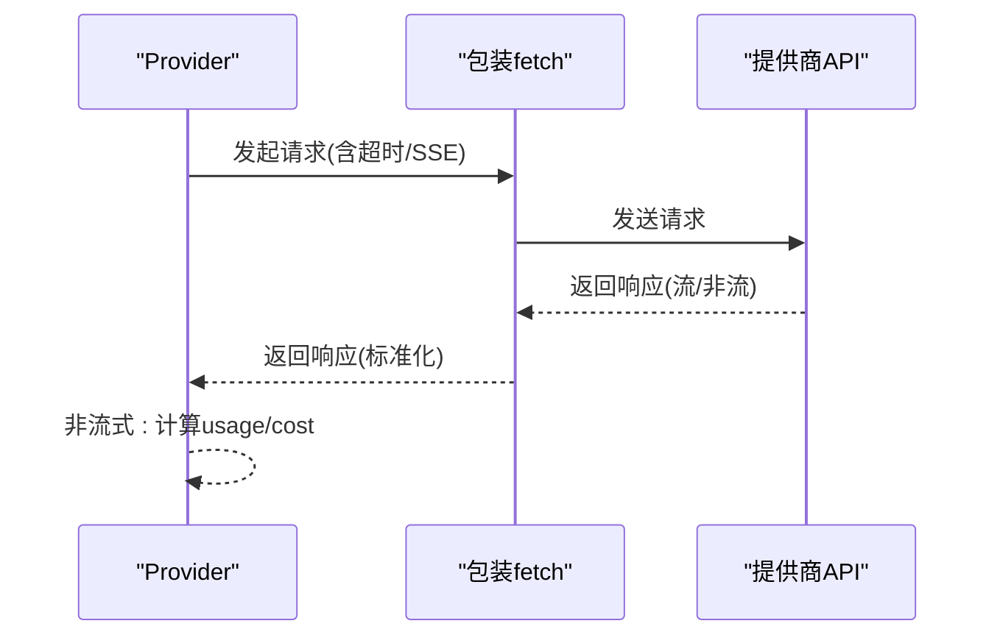
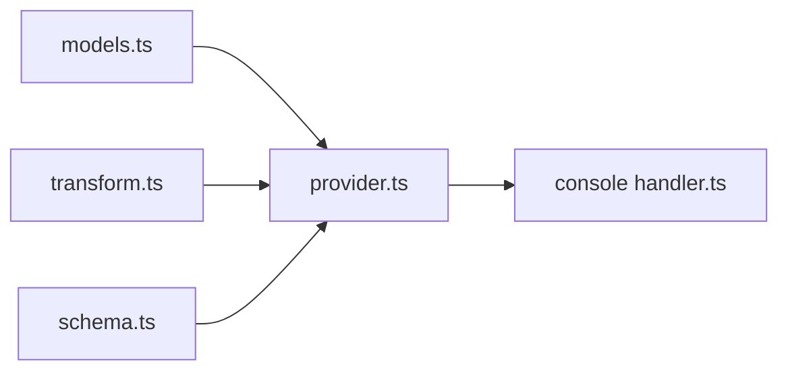

# 代理与模型集成

<cite>
**本文引用的文件**
- [provider.ts](file://packages/opencode/src/provider/provider.ts)
- [schema.ts](file://packages/opencode/src/provider/schema.ts)
- [transform.ts](file://packages/opencode/src/provider/transform.ts)
- [models.ts](file://packages/opencode/src/provider/models.ts)
- [provider.test.ts](file://packages/opencode/test/provider/provider.test.ts)
- [providers.mdx](file://packages/web/src/content/docs/providers.mdx)
- [handler.ts](file://packages/console/app/src/routes/zen/util/handler.ts)
- [decisionLog.md](file://memory-bank/decisionLog.md)
- [openai-compatible-chat-options.ts](file://packages/opencode/src/provider/sdk/copilot/chat/openai-compatible-chat-options.ts)
</cite>

## 目录
1. [简介](#简介)
2. [项目结构](#项目结构)
3. [核心组件](#核心组件)
4. [架构总览](#架构总览)
5. [详细组件分析](#详细组件分析)
6. [依赖关系分析](#依赖关系分析)
7. [性能考量](#性能考量)
8. [故障排查指南](#故障排查指南)
9. [结论](#结论)
10. [附录](#附录)

## 简介
本文件系统性阐述代理与多模型提供商的集成机制，覆盖 OpenRouter、OpenAI、Anthropic 等主流服务的接入方式；解释模型选择与切换策略、API 调用封装、请求路由与响应处理流程；给出模型版本管理、兼容性处理与 API 限制应对策略；并提供性能监控与成本控制建议。

## 项目结构
围绕模型集成的关键模块如下：
- 提供商注册与发现：统一注册内置与外部 SDK 包，按配置与环境变量动态启用
- 模型元数据与版本：基于 models.dev 快照与远端刷新，支持成本、上下文、输出限制与能力标注
- 请求封装与适配：统一 fetch 包装、SSE 超时控制、消息规范化与缓存头注入
- 选择与路由：按优先级、最近使用、白/黑名单与链式回退策略进行模型选择
- 兼容与变体：针对不同提供商的消息格式、工具调用 ID 规范、推理模式变体映射

图表来源
- [provider.ts:109-132](file://packages/opencode/src/provider/provider.ts#L109-L132)
- [models.ts:88-121](file://packages/opencode/src/provider/models.ts#L88-L121)
- [transform.ts:20-290](file://packages/opencode/src/provider/transform.ts#L20-L290)
- [handler.ts:183-221](file://packages/console/app/src/routes/zen/util/handler.ts#L183-L221)

章节来源
- [provider.ts:109-132](file://packages/opencode/src/provider/provider.ts#L109-L132)
- [models.ts:88-121](file://packages/opencode/src/provider/models.ts#L88-L121)
- [transform.ts:20-290](file://packages/opencode/src/provider/transform.ts#L20-L290)

## 核心组件
- Provider：统一管理提供商列表、模型元数据、SDK 初始化与语言模型实例缓存
- ModelsDev：内置/远端模型快照，提供成本、上下文、输出限制与能力字段
- ProviderTransform：消息规范化、缓存头注入、推理变体映射与提供商选项重映射
- Schema：ProviderID/ModelID 类型安全与品牌化标识
- Console Handler：后端重试与链式回退（excludeProviders、fallbackProvider）

章节来源
- [provider.ts:52-1544](file://packages/opencode/src/provider/provider.ts#L52-L1544)
- [models.ts:14-133](file://packages/opencode/src/provider/models.ts#L14-L133)
- [transform.ts:20-712](file://packages/opencode/src/provider/transform.ts#L20-L712)
- [schema.ts:1-39](file://packages/opencode/src/provider/schema.ts#L1-L39)
- [handler.ts:183-221](file://packages/console/app/src/routes/zen/util/handler.ts#L183-L221)

## 架构总览
代理通过 Provider 统一抽象各提供商 SDK，结合 ModelsDev 元数据与 ProviderTransform 的适配层，实现跨提供商的一致调用体验。请求经由 SDK 获取与缓存、语言模型实例化、fetch 包装与 SSE 超时控制，最终返回标准化响应。模型选择与路由支持默认、最近使用、小模型优先与链式回退。

图表来源
- [provider.ts:1223-1405](file://packages/opencode/src/provider/provider.ts#L1223-L1405)
- [transform.ts:252-290](file://packages/opencode/src/provider/transform.ts#L252-L290)

## 详细组件分析

### 1) 模型提供商注册与SDK初始化
- 内置提供商映射：统一注册 @openrouter/ai-sdk-provider、@ai-sdk/anthropic、@ai-sdk/openai 等
- 自定义加载器：为特定提供商注入 headers、模型选择函数、环境变量映射与选项合并
- SDK 缓存：以 providerID/npm/options 为键缓存 SDK 实例，避免重复初始化
- baseURL 与变量替换：支持 ${ENV_VAR} 与自定义变量加载器的字符串替换
- fetch 包装：统一注入超时信号、SSE 分块超时、Azure/OpenAI 特殊字段处理

图表来源
- [provider.ts:1223-1354](file://packages/opencode/src/provider/provider.ts#L1223-L1354)

章节来源
- [provider.ts:109-132](file://packages/opencode/src/provider/provider.ts#L109-L132)
- [provider.ts:1223-1354](file://packages/opencode/src/provider/provider.ts#L1223-L1354)

### 2) 模型元数据与版本管理
- 元数据来源：内置快照与远端刷新，支持 cost、limit、capabilities、headers、variants
- 版本与状态：status(alpha/beta/deprecated)、release_date、experimental 标记
- 配置覆盖：支持 config.provider.* 覆盖 npm/api/id/name/family 等字段
- 白/黑名单与禁用：enabled_providers/disabled_providers 与 provider.models.*.variants 过滤

图表来源
- [models.ts:18-82](file://packages/opencode/src/provider/models.ts#L18-L82)
- [provider.ts:673-757](file://packages/opencode/src/provider/provider.ts#L673-L757)

章节来源
- [models.ts:14-133](file://packages/opencode/src/provider/models.ts#L14-L133)
- [provider.ts:844-842](file://packages/opencode/src/provider/provider.ts#L844-L842)

### 3) 兼容性处理与消息适配
- 消息规范化：过滤空内容、修正工具调用ID、处理交错推理字段
- 缓存头注入：针对 Anthropic、OpenRouter、Bedrock、OpenAI-Compatible 注入缓存控制
- 推理变体映射：按提供商与模型类型映射 reasoningEffort/thinking/思考预算等
- 选项重映射：将存储的 providerID 键重映射为 SDK 期望的键（如 openai/anthropic/gateway）

图表来源
- [transform.ts:47-290](file://packages/opencode/src/provider/transform.ts#L47-L290)

章节来源
- [transform.ts:20-712](file://packages/opencode/src/provider/transform.ts#L20-L712)

### 4) 模型选择与路由策略
- 默认模型：优先最近使用，否则按 provider 内部排序规则
- 小模型优先：针对特定提供商的轻量模型优先级
- 链式回退：前端/后端维护最多10项的模型链，失败时自动排除当前提供商并重试
- 白/黑名单与禁用：通过配置精确控制可用模型集合

图表来源
- [provider.ts:1492-1517](file://packages/opencode/src/provider/provider.ts#L1492-L1517)
- [provider.ts:1422-1480](file://packages/opencode/src/provider/provider.ts#L1422-L1480)
- [decisionLog.md:316-333](file://memory-bank/decisionLog.md#L316-L333)
- [handler.ts:183-221](file://packages/console/app/src/routes/zen/util/handler.ts#L183-L221)

章节来源
- [provider.ts:1422-1517](file://packages/opencode/src/provider/provider.ts#L1422-L1517)
- [decisionLog.md:234-333](file://memory-bank/decisionLog.md#L234-L333)
- [handler.ts:183-221](file://packages/console/app/src/routes/zen/util/handler.ts#L183-L221)

### 5) API调用封装与响应处理
- 超时与分块：统一 fetch 包装，支持整体超时与 SSE 分块超时，超时自动中断
- Azure/OpenAI 特例：移除 codex 使用的内部 id 字段，避免存储问题
- 非流式响应：标准化 usage 与 cost 计算，清理敏感头部
- 404 降级：将 404 临时转为 400 以便框架正确处理

图表来源
- [provider.ts:1276-1321](file://packages/opencode/src/provider/provider.ts#L1276-L1321)
- [provider.ts:1313-1321](file://packages/opencode/src/provider/provider.ts#L1313-L1321)
- [handler.ts:217-221](file://packages/console/app/src/routes/zen/util/handler.ts#L217-L221)

章节来源
- [provider.ts:1276-1321](file://packages/opencode/src/provider/provider.ts#L1276-L1321)
- [handler.ts:183-221](file://packages/console/app/src/routes/zen/util/handler.ts#L183-L221)

### 6) 代码示例路径
- 定义自定义提供商与模型别名
  - [provider.test.ts:210-251](file://packages/opencode/test/provider/provider.test.ts#L210-L251)
- 合并配置与环境变量选项
  - [provider.test.ts:253-285](file://packages/opencode/test/provider/provider.test.ts#L253-L285)
- 获取模型与提供商信息
  - [provider.test.ts:287-307](file://packages/opencode/test/provider/provider.test.ts#L287-L307)
- 文档示例：Anthropic/Azure OpenAI/SAP AI Core/OpenRouter
  - [providers.mdx:302-1500](file://packages/web/src/content/docs/providers.mdx#L302-L1500)
  - [providers.mdx:1361-1425](file://packages/web/src/content/docs/providers.mdx#L1361-L1425)
  - [providers.mdx:1658-1714](file://packages/web/src/content/docs/providers.mdx#L1658-L1714)

章节来源
- [provider.test.ts:210-307](file://packages/opencode/test/provider/provider.test.ts#L210-L307)
- [providers.mdx:302-1714](file://packages/web/src/content/docs/providers.mdx#L302-L1714)

## 依赖关系分析
- Provider 依赖 ModelsDev 提供的模型快照与刷新机制
- ProviderTransform 依赖 Provider.Model 能力与提供商 npm 包标识
- Console Handler 依赖 Provider 选择结果与链式回退策略
- Schema 为 ProviderID/ModelID 提供类型安全

图表来源
- [models.ts:88-121](file://packages/opencode/src/provider/models.ts#L88-L121)
- [provider.ts:855-1146](file://packages/opencode/src/provider/provider.ts#L855-L1146)
- [transform.ts:20-290](file://packages/opencode/src/provider/transform.ts#L20-L290)
- [schema.ts:1-39](file://packages/opencode/src/provider/schema.ts#L1-L39)
- [handler.ts:183-221](file://packages/console/app/src/routes/zen/util/handler.ts#L183-L221)

章节来源
- [provider.ts:855-1146](file://packages/opencode/src/provider/provider.ts#L855-L1146)
- [models.ts:88-121](file://packages/opencode/src/provider/models.ts#L88-L121)
- [transform.ts:20-290](file://packages/opencode/src/provider/transform.ts#L20-L290)
- [schema.ts:1-39](file://packages/opencode/src/provider/schema.ts#L1-L39)
- [handler.ts:183-221](file://packages/console/app/src/routes/zen/util/handler.ts#L183-L221)

## 性能考量
- SDK 缓存：避免重复安装与初始化，显著降低冷启动延迟
- SSE 超时：分块超时防止长时间无数据导致的资源占用
- 最近使用优先：减少跨提供商切换带来的网络抖动
- 链式回退长度限制：控制重试次数与追踪复杂度
- 变体映射与选项重映射：减少运行时转换成本

## 故障排查指南
- 404 降级：若后端返回 404，框架会自动降级为 400，便于统一处理
- 排除当前提供商：链式回退时将当前提供商加入排除列表，避免循环重试
- 重试计数与上限：根据 retryCount 控制最大重试次数
- 仅保留必要头部：响应头清洗仅保留 content-type 与 cache-control

章节来源
- [handler.ts:183-221](file://packages/console/app/src/routes/zen/util/handler.ts#L183-L221)

## 结论
该集成体系通过 Provider 抽象、ModelsDev 元数据与 ProviderTransform 适配层，实现了对多提供商的统一接入与一致体验。配合链式回退、白/黑名单与最近使用优先策略，既能满足高可用性，又能兼顾性能与成本控制。未来可在以下方面持续优化：
- 更细粒度的成本与限速统计
- 动态权重的负载均衡策略
- 提供商健康度与延迟指标的可视化

## 附录
- OpenAI 兼容选项（如 reasoningEffort、textVerbosity、thinking_budget）
  - [openai-compatible-chat-options.ts:1-28](file://packages/opencode/src/provider/sdk/copilot/chat/openai-compatible-chat-options.ts#L1-L28)
- 模型文档与提供商接入指引
  - [providers.mdx:302-1714](file://packages/web/src/content/docs/providers.mdx#L302-L1714)