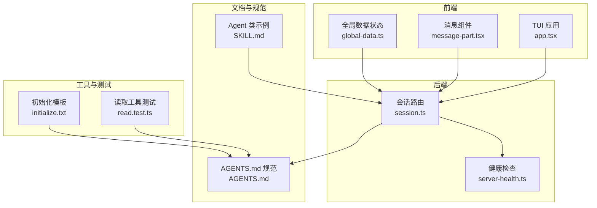
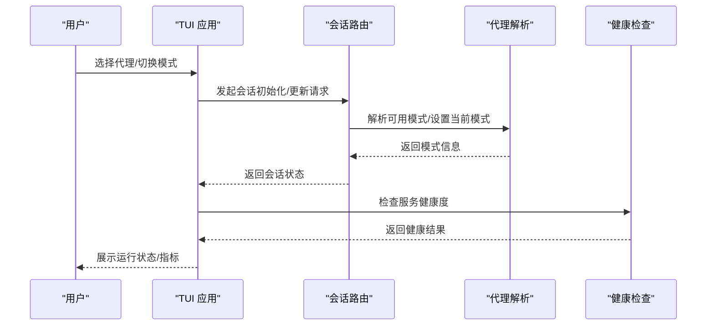
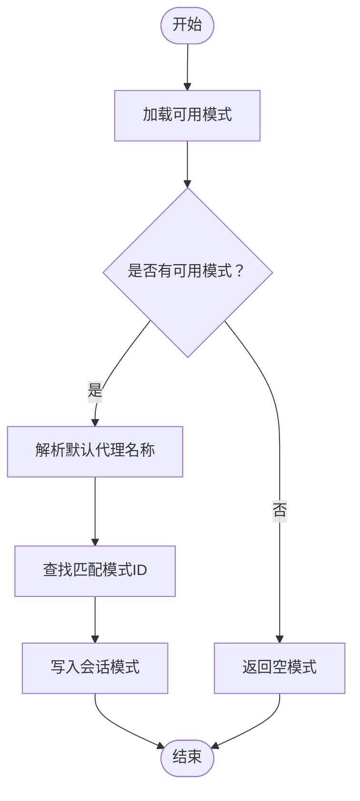
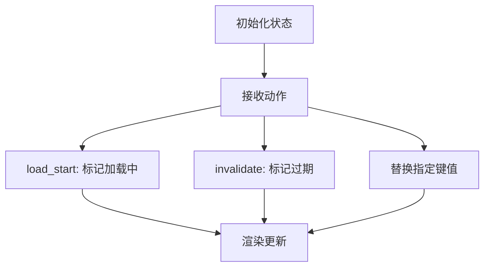
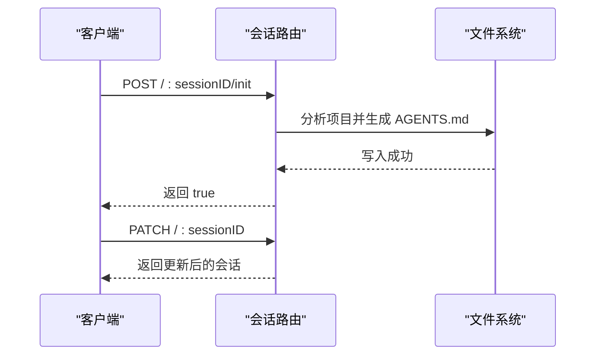
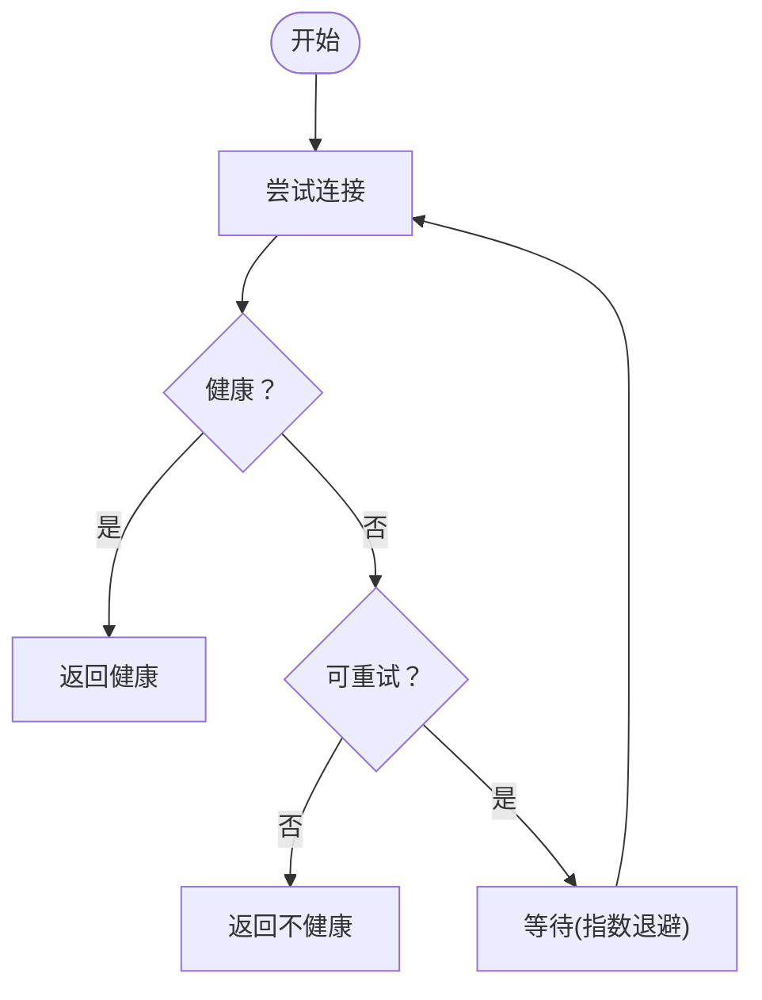
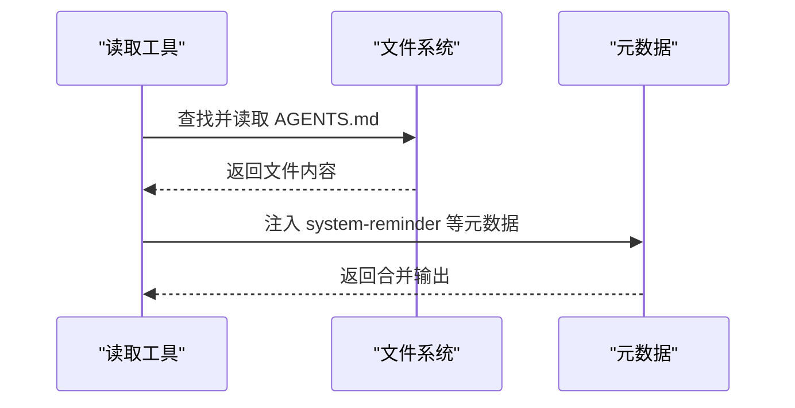
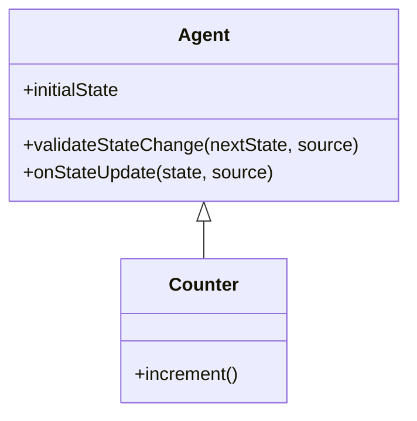
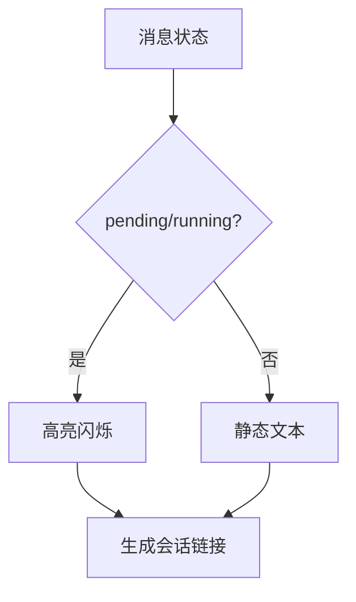
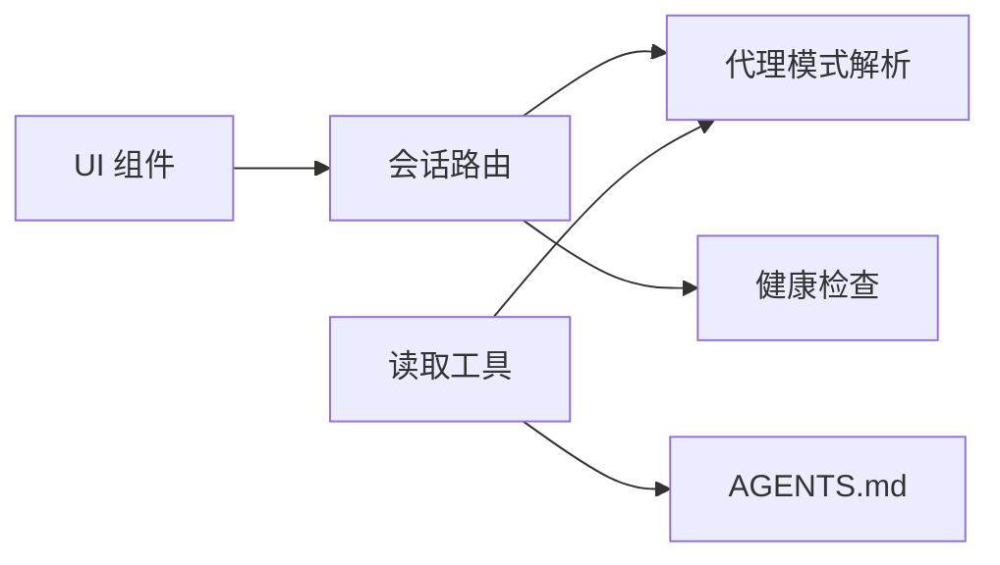

# 代理生命周期管理

<cite>
**本文引用的文件**
- [AGENTS.md](file://AGENTS.md)
- [agent.ts](file://packages/opencode/src/acp/agent.ts)
- [global-data.ts](file://packages/strategy-front/src/data/global-data.ts)
- [session.ts](file://packages/opencode/src/server/routes/session.ts)
- [read.test.ts](file://packages/opencode/test/tool/read.test.ts)
- [server-health.ts](file://packages/app/src/utils/server-health.ts)
- [sdk.mdx](file://packages/web/src/content/docs/sdk.mdx)
- [initialize.txt](file://packages/opencode/src/command/template/initialize.txt)
- [message-part.tsx](file://packages/ui/src/components/message-part.tsx)
- [app.tsx](file://packages/opencode/src/cli/cmd/tui/app.tsx)
- [SKILL.md](file://packages/opencode/test/fixture/skills/agents-sdk/SKILL.md)
</cite>

## 目录
1. [引言](#引言)
2. [项目结构](#项目结构)
3. [核心组件](#核心组件)
4. [架构总览](#架构总览)
5. [详细组件分析](#详细组件分析)
6. [依赖关系分析](#依赖关系分析)
7. [性能考量](#性能考量)
8. [故障排查指南](#故障排查指南)
9. [结论](#结论)
10. [附录](#附录)

## 引言
本文件系统性阐述本仓库中的AI代理生命周期管理机制，覆盖从创建、初始化、启动、运行、暂停、恢复到销毁的全链路。重点解释代理状态转换逻辑、事件触发机制与生命周期钩子函数，以及监控指标、健康检查与异常处理策略。同时给出资源管理、内存优化与并发控制的最佳实践，并通过代码片段路径指引读者定位实现细节。

## 项目结构
围绕代理生命周期的关键模块分布于多个包中：
- 前端与交互层：TUI命令面板、消息渲染组件、全局数据状态管理
- 后端服务层：会话路由、健康检查工具
- 工具与测试：读取工具对AGENTS.md的加载与元数据注入
- 文档与模板：AGENTS.md规范、初始化模板

**图表来源**
- [app.tsx:433-492](file://packages/opencode/src/cli/cmd/tui/app.tsx#L433-L492)
- [message-part.tsx:1646-1680](file://packages/ui/src/components/message-part.tsx#L1646-L1680)
- [global-data.ts:530-583](file://packages/strategy-front/src/data/global-data.ts#L530-L583)
- [session.ts:284-329](file://packages/opencode/src/server/routes/session.ts#L284-L329)
- [server-health.ts:59-73](file://packages/app/src/utils/server-health.ts#L59-L73)
- [read.test.ts:447-468](file://packages/opencode/test/tool/read.test.ts#L447-L468)
- [initialize.txt:1-10](file://packages/opencode/src/command/template/initialize.txt#L1-L10)
- [AGENTS.md:1-129](file://AGENTS.md#L1-L129)
- [SKILL.md:68-109](file://packages/opencode/test/fixture/skills/agents-sdk/SKILL.md#L68-L109)

**章节来源**
- [app.tsx:433-492](file://packages/opencode/src/cli/cmd/tui/app.tsx#L433-L492)
- [message-part.tsx:1646-1680](file://packages/ui/src/components/message-part.tsx#L1646-L1680)
- [global-data.ts:530-583](file://packages/strategy-front/src/data/global-data.ts#L530-L583)
- [session.ts:284-329](file://packages/opencode/src/server/routes/session.ts#L284-L329)
- [server-health.ts:59-73](file://packages/app/src/utils/server-health.ts#L59-L73)
- [read.test.ts:447-468](file://packages/opencode/test/tool/read.test.ts#L447-L468)
- [initialize.txt:1-10](file://packages/opencode/src/command/template/initialize.txt#L1-L10)
- [AGENTS.md:1-129](file://AGENTS.md#L1-L129)
- [SKILL.md:68-109](file://packages/opencode/test/fixture/skills/agents-sdk/SKILL.md#L68-L109)

## 核心组件
- 代理会话与模式解析：负责加载可用模式、解析当前模式、设置会话模式等
- 全局数据状态：统一管理代理、提供者、MCP、技能等全局状态与刷新机制
- 会话路由：提供会话初始化、fork、更新等REST接口
- 健康检查：封装HTTP健康检查与重试策略
- 读取工具测试：演示AGENTS.md的加载与元数据注入行为
- 初始化模板：指导生成AGENTS.md的模板内容
- AGENTS.md规范：定义代理配置与风格约束
- Agent类示例：展示生命周期钩子与状态变更

**章节来源**
- [agent.ts:1131-1157](file://packages/opencode/src/acp/agent.ts#L1131-L1157)
- [global-data.ts:118-181](file://packages/strategy-front/src/data/global-data.ts#L118-L181)
- [session.ts:284-329](file://packages/opencode/src/server/routes/session.ts#L284-L329)
- [server-health.ts:59-73](file://packages/app/src/utils/server-health.ts#L59-L73)
- [read.test.ts:447-468](file://packages/opencode/test/tool/read.test.ts#L447-L468)
- [initialize.txt:1-10](file://packages/opencode/src/command/template/initialize.txt#L1-L10)
- [AGENTS.md:1-129](file://AGENTS.md#L1-L129)
- [SKILL.md:68-109](file://packages/opencode/test/fixture/skills/agents-sdk/SKILL.md#L68-L109)

## 架构总览
代理生命周期贯穿前端交互、后端路由与工具链，形成“请求-解析-执行-反馈”的闭环。

**图表来源**
- [app.tsx:433-492](file://packages/opencode/src/cli/cmd/tui/app.tsx#L433-L492)
- [session.ts:284-329](file://packages/opencode/src/server/routes/session.ts#L284-L329)
- [agent.ts:1131-1157](file://packages/opencode/src/acp/agent.ts#L1131-L1157)
- [server-health.ts:59-73](file://packages/app/src/utils/server-health.ts#L59-L73)

## 详细组件分析

### 代理会话与模式解析
- 加载可用模式：从配置与SDK中获取可用模型变体与模式选项
- 解析当前模式：若未设置，依据默认代理名称选择首个可用模式并写回会话
- 设置会话模式：将解析后的模式ID写入会话管理器

**图表来源**
- [agent.ts:1131-1157](file://packages/opencode/src/acp/agent.ts#L1131-L1157)

**章节来源**
- [agent.ts:1131-1157](file://packages/opencode/src/acp/agent.ts#L1131-L1157)

### 全局数据状态与刷新
- 初始化状态：为代理、提供者、MCP、技能分别建立空项
- 动作分发：支持load_start/invalidate/替换等动作，驱动状态更新
- 列表过滤与排序：按名称排序，过滤子代理与隐藏项
- 刷新与失效：提供统一的refresh/invalidate接口

**图表来源**
- [global-data.ts:118-181](file://packages/strategy-front/src/data/global-data.ts#L118-L181)
- [global-data.ts:530-583](file://packages/strategy-front/src/data/global-data.ts#L530-L583)

**章节来源**
- [global-data.ts:118-181](file://packages/strategy-front/src/data/global-data.ts#L118-L181)
- [global-data.ts:530-583](file://packages/strategy-front/src/data/global-data.ts#L530-L583)

### 会话路由与生命周期操作
- 更新会话标题/归档状态：支持部分字段更新
- 初始化会话：分析应用并生成AGENTS.md
- fork会话：复制现有会话上下文

**图表来源**
- [session.ts:284-329](file://packages/opencode/src/server/routes/session.ts#L284-L329)

**章节来源**
- [session.ts:284-329](file://packages/opencode/src/server/routes/session.ts#L284-L329)

### 健康检查与异常处理
- 超时与中止：支持超时信号与AbortSignal
- 可重试错误：基于错误类型与消息正则判断是否可重试
- 指数退避重试：按次数递增延迟，避免雪崩

**图表来源**
- [server-health.ts:59-73](file://packages/app/src/utils/server-health.ts#L59-L73)

**章节来源**
- [server-health.ts:59-73](file://packages/app/src/utils/server-health.ts#L59-L73)

### AGENTS.md与读取工具集成
- 读取工具测试：验证从父目录加载AGENTS.md并将其内容注入元数据
- 初始化模板：指导生成包含构建/测试命令、风格规范等内容的AGENTS.md

**图表来源**
- [read.test.ts:447-468](file://packages/opencode/test/tool/read.test.ts#L447-L468)
- [initialize.txt:1-10](file://packages/opencode/src/command/template/initialize.txt#L1-L10)

**章节来源**
- [read.test.ts:447-468](file://packages/opencode/test/tool/read.test.ts#L447-L468)
- [initialize.txt:1-10](file://packages/opencode/src/command/template/initialize.txt#L1-L10)

### 生命周期钩子与状态变更
- Agent类示例：展示validateStateChange与onStateUpdate钩子
- 生命周期钩子职责：
  - validateStateChange：状态持久化前的同步校验，抛错可拒绝更新
  - onStateUpdate：状态持久化后的异步通知，非阻塞

**图表来源**
- [SKILL.md:68-109](file://packages/opencode/test/fixture/skills/agents-sdk/SKILL.md#L68-L109)

**章节来源**
- [SKILL.md:68-109](file://packages/opencode/test/fixture/skills/agents-sdk/SKILL.md#L68-L109)

### 监控指标与运行状态展示
- 消息组件：根据状态(pending/running)动态显示标题与链接
- 全局数据：提供统计卡片，展示运行时总数、全局自定义、主智能体、子智能体等

**图表来源**
- [message-part.tsx:1646-1680](file://packages/ui/src/components/message-part.tsx#L1646-L1680)
- [global-data.ts:137-162](file://packages/strategy-front/src/data/global-data.ts#L137-L162)

**章节来源**
- [message-part.tsx:1646-1680](file://packages/ui/src/components/message-part.tsx#L1646-L1680)
- [global-data.ts:137-162](file://packages/strategy-front/src/data/global-data.ts#L137-L162)

## 依赖关系分析
- 前端依赖后端路由进行会话管理
- 代理解析依赖SDK与会话管理器
- 健康检查独立于业务路由，提供通用能力
- 读取工具与AGENTS.md耦合，影响工具行为与元数据

**图表来源**
- [session.ts:284-329](file://packages/opencode/src/server/routes/session.ts#L284-L329)
- [agent.ts:1131-1157](file://packages/opencode/src/acp/agent.ts#L1131-L1157)
- [server-health.ts:59-73](file://packages/app/src/utils/server-health.ts#L59-L73)
- [read.test.ts:447-468](file://packages/opencode/test/tool/read.test.ts#L447-L468)

**章节来源**
- [session.ts:284-329](file://packages/opencode/src/server/routes/session.ts#L284-L329)
- [agent.ts:1131-1157](file://packages/opencode/src/acp/agent.ts#L1131-L1157)
- [server-health.ts:59-73](file://packages/app/src/utils/server-health.ts#L59-L73)
- [read.test.ts:447-468](file://packages/opencode/test/tool/read.test.ts#L447-L468)

## 性能考量
- 并发控制
  - 使用轻量状态更新与不可变数据结构，减少不必要的重渲染
  - 在全局数据状态中采用动作分发与惰性计算，降低渲染成本
- 内存优化
  - 仅在必要时加载AGENTS.md，避免重复读取
  - 对列表进行浅拷贝与就地排序，减少分配
- 健康检查
  - 合理设置超时与重试次数，避免长时间阻塞
  - 对网络类错误进行快速失败与指数退避

[本节为通用建议，无需特定文件引用]

## 故障排查指南
- 代理无法启动
  - 检查会话初始化是否成功生成AGENTS.md
  - 确认代理模式解析是否返回有效模式ID
- 健康检查失败
  - 关注错误类型与消息，确认是否属于可重试网络错误
  - 调整超时与重试参数
- 工具读取异常
  - 确认AGENTS.md路径与权限
  - 检查二进制检测与空字节处理逻辑

**章节来源**
- [session.ts:284-329](file://packages/opencode/src/server/routes/session.ts#L284-L329)
- [agent.ts:1131-1157](file://packages/opencode/src/acp/agent.ts#L1131-L1157)
- [server-health.ts:59-73](file://packages/app/src/utils/server-health.ts#L59-L73)
- [read.test.ts:447-468](file://packages/opencode/test/tool/read.test.ts#L447-L468)

## 结论
本仓库通过“前端交互—后端路由—工具链—规范文档”的协同，实现了代理生命周期的闭环管理。借助明确的状态解析、统一的健康检查与可扩展的生命周期钩子，系统在保证稳定性的同时提供了良好的可观测性与可维护性。建议在实际使用中遵循AGENTS.md规范与风格指南，结合健康检查与状态监控，确保代理在复杂场景下的可靠运行。

## 附录
- AGENTS.md规范要点
  - 风格与命名：单字母变量优先，避免显式类型标注
  - 控制流：优先早返回，避免else分支
  - 架构：保持单一职责，避免try/catch与any类型
- SDK健康检查方法
  - 提供global.health()用于查询服务健康与版本

**章节来源**
- [AGENTS.md:1-129](file://AGENTS.md#L1-L129)
- [sdk.mdx:195-245](file://packages/web/src/content/docs/sdk.mdx#L195-L245)