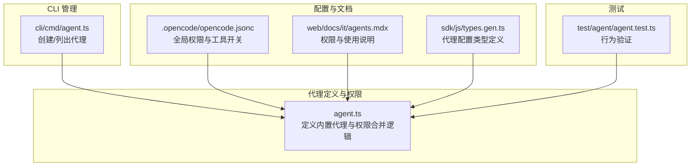
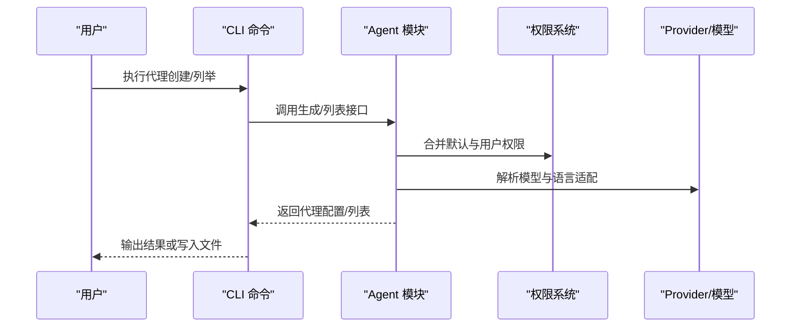
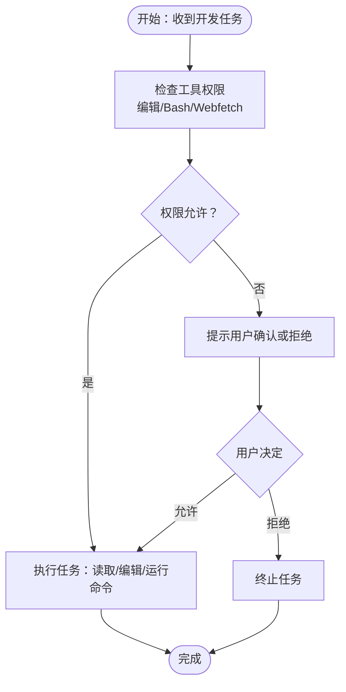
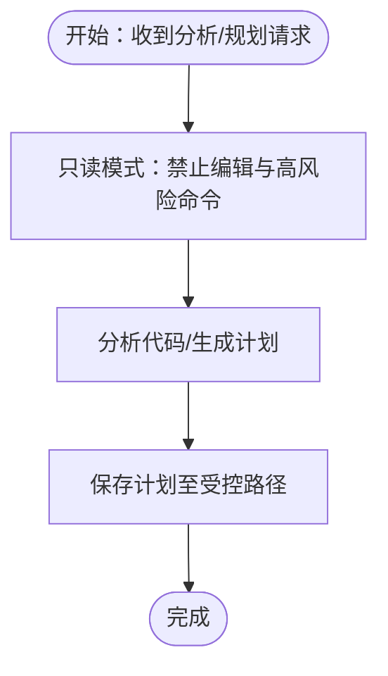
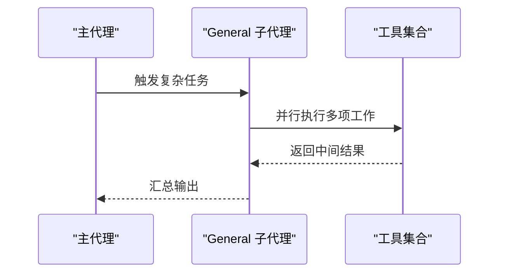
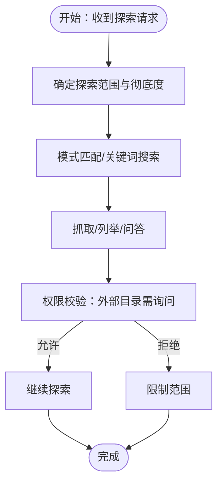
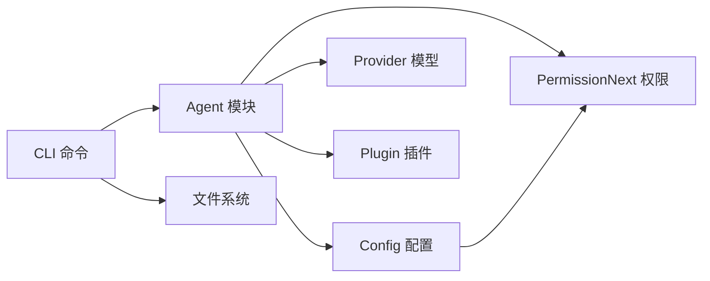

# 代理类型与功能

<cite>
**本文引用的文件**
- [README.md](file://README.md)
- [packages/opencode/src/agent/agent.ts](file://packages/opencode/src/agent/agent.ts)
- [packages/opencode/src/cli/cmd/agent.ts](file://packages/opencode/src/cli/cmd/agent.ts)
- [.opencode/opencode.jsonc](file://.opencode/opencode.jsonc)
- [packages/opencode/test/agent/agent.test.ts](file://packages/opencode/test/agent/agent.test.ts)
- [packages/web/src/content/docs/it/agents.mdx](file://packages/web/src/content/docs/it/agents.mdx)
- [packages/sdk/js/src/v2/gen/types.gen.ts](file://packages/sdk/js/src/v2/gen/types.gen.ts)
</cite>

## 目录
1. [简介](#简介)
2. [项目结构](#项目结构)
3. [核心组件](#核心组件)
4. [架构总览](#架构总览)
5. [详细组件分析](#详细组件分析)
6. [依赖关系分析](#依赖关系分析)
7. [性能考量](#性能考量)
8. [故障排查指南](#故障排查指南)
9. [结论](#结论)
10. [附录](#附录)

## 简介
本文件系统性介绍 OpenCode 中的 AI 代理体系，重点解析以下核心代理类型：Build Agent（默认开发代理）、Plan Agent（只读分析代理）、General Subagent（通用多步任务子代理）以及 Explore Subagent（快速探索子代理）。内容涵盖设计理念、职责边界、权限模型、配置参数、使用场景与最佳实践，并提供代理类型选择指南、性能特征对比与实际应用案例。

## 项目结构
OpenCode 的代理系统由“内置原生代理 + 可扩展自定义代理”构成，支持通过配置文件与命令行进行管理。核心文件包括：
- 代理定义与权限模型：packages/opencode/src/agent/agent.ts
- 代理创建与列表 CLI：packages/opencode/src/cli/cmd/agent.ts
- 全局配置示例：.opencode/opencode.jsonc
- 文档与类型定义：packages/web/src/content/docs/it/agents.mdx、packages/sdk/js/src/v2/gen/types.gen.ts
- 行为测试用例：packages/opencode/test/agent/agent.test.ts

图表来源
- [packages/opencode/src/agent/agent.ts:24-252](file://packages/opencode/src/agent/agent.ts#L24-L252)
- [packages/opencode/src/cli/cmd/agent.ts:31-250](file://packages/opencode/src/cli/cmd/agent.ts#L31-L250)
- [.opencode/opencode.jsonc:1-19](file://.opencode/opencode.jsonc#L1-L19)
- [packages/web/src/content/docs/it/agents.mdx:411-467](file://packages/web/src/content/docs/it/agents.mdx#L411-L467)
- [packages/sdk/js/src/v2/gen/types.gen.ts:1075-1131](file://packages/sdk/js/src/v2/gen/types.gen.ts#L1075-L1131)
- [packages/opencode/test/agent/agent.test.ts:1-690](file://packages/opencode/test/agent/agent.test.ts#L1-L690)

章节来源
- [packages/opencode/src/agent/agent.ts:24-252](file://packages/opencode/src/agent/agent.ts#L24-L252)
- [packages/opencode/src/cli/cmd/agent.ts:31-250](file://packages/opencode/src/cli/cmd/agent.ts#L31-L250)
- [.opencode/opencode.jsonc:1-19](file://.opencode/opencode.jsonc#L1-L19)
- [packages/web/src/content/docs/it/agents.mdx:411-467](file://packages/web/src/content/docs/it/agents.mdx#L411-L467)
- [packages/sdk/js/src/v2/gen/types.gen.ts:1075-1131](file://packages/sdk/js/src/v2/gen/types.gen.ts#L1075-L1131)
- [packages/opencode/test/agent/agent.test.ts:1-690](file://packages/opencode/test/agent/agent.test.ts#L1-L690)

## 核心组件
- 内置原生代理
  - build：默认主代理，具备全部工具权限，适用于日常开发工作流。
  - plan：只读分析代理，禁止编辑类工具，默认对文件修改与 Bash 命令采用“询问”策略，适合探索与规划。
  - general：通用子代理，用于复杂问题研究与多步骤任务执行，通常并行处理多个工作单元。
  - explore：快速探索子代理，专长于按模式查找文件、关键词搜索与代码问答；调用时可指定彻底度级别。
  - compaction/title/summary：隐藏主代理，用于特定内部流程或标题/摘要生成。
- 自定义代理
  - 通过配置文件或 CLI 创建，支持覆盖模型、描述、温度、Top-P、颜色、最大步数、权限与选项等。
- 权限系统
  - 默认权限集包含“外部目录访问需询问”“危险循环保护”等安全策略；用户可按全局或单个代理维度叠加/覆盖。
- 默认代理选择
  - 若未设置默认代理，则优先返回可用的主代理；若所有主代理被禁用则抛错。

章节来源
- [packages/opencode/src/agent/agent.ts:77-204](file://packages/opencode/src/agent/agent.ts#L77-L204)
- [packages/opencode/src/agent/agent.ts:267-282](file://packages/opencode/src/agent/agent.ts#L267-L282)
- [packages/opencode/test/agent/agent.test.ts:32-120](file://packages/opencode/test/agent/agent.test.ts#L32-L120)
- [packages/opencode/test/agent/agent.test.ts:567-690](file://packages/opencode/test/agent/agent.test.ts#L567-L690)

## 架构总览
OpenCode 代理系统以“配置驱动 + 权限合并 + 模型适配”的方式组织。代理定义文件（Markdown 或配置）与运行时状态结合，形成最终的代理信息对象；CLI 提供创建与列举能力；测试覆盖默认代理选择、权限合并与禁用行为。

图表来源
- [packages/opencode/src/cli/cmd/agent.ts:58-224](file://packages/opencode/src/cli/cmd/agent.ts#L58-L224)
- [packages/opencode/src/agent/agent.ts:254-341](file://packages/opencode/src/agent/agent.ts#L254-L341)

章节来源
- [packages/opencode/src/cli/cmd/agent.ts:31-250](file://packages/opencode/src/cli/cmd/agent.ts#L31-L250)
- [packages/opencode/src/agent/agent.ts:254-341](file://packages/opencode/src/agent/agent.ts#L254-L341)

## 详细组件分析

### Build Agent（默认开发代理）
- 设计理念
  - 面向开发工作流的“全工具”主代理，允许文件读写、编辑、系统命令与网络抓取等操作，适合需要直接改动代码库的任务。
- 职责边界
  - 默认允许编辑与 Bash；可通过权限系统限制特定命令或路径。
- 使用场景
  - 实现功能、修复缺陷、重构与批量修改。
- 最佳实践
  - 对高风险命令（如删除、覆盖）保留“询问”策略；在团队协作中建议开启审阅流程。
- 配置要点
  - 支持覆盖模型、温度、Top-P、颜色、最大步数、权限与自定义选项。
- 性能特征
  - 工具权限最广，适合一次性完成多步骤任务，但需注意权限控制带来的交互成本。

图表来源
- [packages/opencode/src/agent/agent.ts:77-92](file://packages/opencode/src/agent/agent.ts#L77-L92)
- [packages/opencode/test/agent/agent.test.ts:32-45](file://packages/opencode/test/agent/agent.test.ts#L32-L45)

章节来源
- [packages/opencode/src/agent/agent.ts:77-92](file://packages/opencode/src/agent/agent.ts#L77-L92)
- [packages/opencode/test/agent/agent.test.ts:32-45](file://packages/opencode/test/agent/agent.test.ts#L32-L45)

### Plan Agent（只读分析代理）
- 设计理念
  - 专注分析与规划，禁止编辑类工具，降低误操作风险；默认对文件修改与 Bash 采用“询问”策略。
- 职责边界
  - 仅允许只读分析与计划生成；特定路径（如计划存储）例外放行。
- 使用场景
  - 代码审查、变更影响评估、技术方案设计、探索未知代码库。
- 最佳实践
  - 在探索阶段先使用 Plan 生成计划，再切换到 Build 执行；避免直接在 Plan 上进行修改。
- 配置要点
  - 可调整计划存储路径权限与最大步数；适合在 CI/审阅流程中作为只读分析器。

图表来源
- [packages/opencode/src/agent/agent.ts:93-115](file://packages/opencode/src/agent/agent.ts#L93-L115)
- [packages/opencode/test/agent/agent.test.ts:47-60](file://packages/opencode/test/agent/agent.test.ts#L47-L60)

章节来源
- [packages/opencode/src/agent/agent.ts:93-115](file://packages/opencode/src/agent/agent.ts#L93-L115)
- [packages/opencode/test/agent/agent.test.ts:47-60](file://packages/opencode/test/agent/agent.test.ts#L47-L60)

### General Subagent（通用子代理）
- 设计理念
  - 通用型子代理，用于复杂问题研究与多步骤任务执行；默认禁用待办类工具，适合并行处理多个工作单元。
- 职责边界
  - 子代理角色，常被主代理调用；默认禁止待办工具，确保安全性。
- 使用场景
  - 复杂检索、跨模块调查、多步骤自动化任务编排。
- 最佳实践
  - 在消息中通过“@general”显式调用；合理设置最大步数与并发度。
- 配置要点
  - 可覆盖模型、温度、Top-P、颜色、最大步数与权限。

图表来源
- [packages/opencode/src/agent/agent.ts:116-130](file://packages/opencode/src/agent/agent.ts#L116-L130)
- [packages/opencode/test/agent/agent.test.ts:92-105](file://packages/opencode/test/agent/agent.test.ts#L92-L105)

章节来源
- [packages/opencode/src/agent/agent.ts:116-130](file://packages/opencode/src/agent/agent.ts#L116-L130)
- [packages/opencode/test/agent/agent.test.ts:92-105](file://packages/opencode/test/agent/agent.test.ts#L92-L105)

### Explore Subagent（快速探索子代理）
- 设计理念
  - 专长于快速探索代码库：按模式查找文件、关键词搜索、网络检索与问答；调用时可指定彻底度（快速/中等/非常彻底）。
- 职责边界
  - 默认禁止编辑与写入；允许搜索、列举、抓取与 Bash 等工具；对外部目录访问采用“询问”策略。
- 使用场景
  - 快速定位文件、理解模块职责、回答“如何工作？”等问题。
- 最佳实践
  - 明确彻底度与范围，避免过度扫描敏感目录；结合权限系统限制外部访问。
- 配置要点
  - 可覆盖模型、温度、Top-P、颜色、最大步数与权限；支持在 Markdown 代理文件中声明 frontmatter。

图表来源
- [packages/opencode/src/agent/agent.ts:131-157](file://packages/opencode/src/agent/agent.ts#L131-L157)
- [packages/opencode/test/agent/agent.test.ts:62-90](file://packages/opencode/test/agent/agent.test.ts#L62-L90)

章节来源
- [packages/opencode/src/agent/agent.ts:131-157](file://packages/opencode/src/agent/agent.ts#L131-L157)
- [packages/opencode/test/agent/agent.test.ts:62-90](file://packages/opencode/test/agent/agent.test.ts#L62-L90)

### 隐藏代理（title/summary/compaction）
- 设计理念
  - 专用于特定内部流程：标题生成、摘要生成与归并压缩等。
- 职责边界
  - 不参与主代理选择，仅在内部流程中使用。
- 使用场景
  - 自动化标题/摘要生成、会话归并与清理。
- 最佳实践
  - 通过配置启用/禁用；谨慎设置权限，避免暴露高风险工具。

章节来源
- [packages/opencode/src/agent/agent.ts:158-204](file://packages/opencode/src/agent/agent.ts#L158-L204)

## 依赖关系分析
- 组件耦合
  - Agent 模块依赖 Config、Provider、PermissionNext、Skill、Plugin 等模块；CLI 依赖 Agent 模块与文件系统。
- 权限链路
  - 默认权限 + 用户全局权限 + 单代理覆盖权限 → 最终生效权限。
- 外部依赖
  - 模型提供商适配（Provider），权限规则引擎（PermissionNext），插件系统（Plugin）。

图表来源
- [packages/opencode/src/agent/agent.ts:1-23](file://packages/opencode/src/agent/agent.ts#L1-L23)
- [packages/opencode/src/cli/cmd/agent.ts:1-14](file://packages/opencode/src/cli/cmd/agent.ts#L1-L14)

章节来源
- [packages/opencode/src/agent/agent.ts:1-23](file://packages/opencode/src/agent/agent.ts#L1-L23)
- [packages/opencode/src/cli/cmd/agent.ts:1-14](file://packages/opencode/src/cli/cmd/agent.ts#L1-L14)

## 性能考量
- 工具权限与交互成本
  - Plan 与 Explore 的“询问”策略可降低误操作风险，但可能增加交互轮次；Build 的全权限适合一次性完成任务。
- 最大步数与并发
  - General 适合并行多步任务；合理设置 steps/maxSteps 可避免长时间占用资源。
- 模型与流式响应
  - 在特定 Provider/OAuth 场景下支持流式对象生成，提升交互体验。

章节来源
- [packages/opencode/src/agent/agent.ts:284-341](file://packages/opencode/src/agent/agent.ts#L284-L341)
- [packages/opencode/test/agent/agent.test.ts:244-262](file://packages/opencode/test/agent/agent.test.ts#L244-L262)

## 故障排查指南
- 默认代理选择错误
  - 当 default_agent 指向子代理或隐藏代理时，defaultAgent 将抛出错误；请检查配置并确保指向可见主代理。
- 所有主代理被禁用
  - 若 build 与 plan 均被禁用，将无法选择默认主代理，需启用至少一个主代理。
- 权限冲突
  - 若全局或代理级权限将外部目录设为 deny，Explore/Build 仍可访问 Truncate.GLOB；如需严格限制，请显式 deny Truncate.GLOB。
- 工具权限覆盖
  - legacy tools 配置会被转换为权限规则；write/edit/patch/multiedit 统一映射到 edit 权限。

章节来源
- [packages/opencode/src/agent/agent.ts:267-282](file://packages/opencode/src/agent/agent.ts#L267-L282)
- [packages/opencode/test/agent/agent.test.ts:613-690](file://packages/opencode/test/agent/agent.test.ts#L613-L690)
- [packages/opencode/test/agent/agent.test.ts:465-529](file://packages/opencode/test/agent/agent.test.ts#L465-L529)
- [packages/opencode/test/agent/agent.test.ts:421-463](file://packages/opencode/test/agent/agent.test.ts#L421-L463)

## 结论
OpenCode 的代理体系以“主代理 + 子代理 + 权限系统 + 配置驱动”为核心，既满足日常开发的高效性，又兼顾安全与可控性。Build 适合执行类任务，Plan 适合只读分析，General 适合复杂多步任务，Explore 适合快速探索。通过合理的权限与配置，可在不同场景下取得最佳平衡。

## 附录

### 代理类型选择指南
- 需要直接修改代码：选择 Build
- 需要只读分析/规划：选择 Plan
- 需要复杂检索/多步骤任务：选择 General
- 需要快速探索代码库：选择 Explore
- 团队协作/审阅流程：优先 Plan，再用 Build 执行

章节来源
- [README.md:100-113](file://README.md#L100-L113)

### 配置参数说明（节选）
- 模型与推理
  - model：提供者/模型标识
  - variant：模型变体
  - temperature/top_p：采样参数
- 外观与行为
  - description：使用说明
  - mode：primary/subagent/all
  - hidden：是否隐藏
  - color：颜色主题
  - steps/maxSteps：最大迭代步数
- 权限
  - permission：工具权限配置（支持通配与精确命令）
  - tools（已废弃）：兼容旧配置
- 其他
  - options：自定义键值对
  - disable：禁用该代理

章节来源
- [packages/sdk/js/src/v2/gen/types.gen.ts:1075-1131](file://packages/sdk/js/src/v2/gen/types.gen.ts#L1075-L1131)
- [packages/opencode/src/cli/cmd/agent.ts:44-57](file://packages/opencode/src/cli/cmd/agent.ts#L44-L57)
- [packages/web/src/content/docs/it/agents.mdx:411-467](file://packages/web/src/content/docs/it/agents.mdx#L411-L467)

### 使用示例（路径指引）
- 创建代理（CLI）
  - 位置：packages/opencode/src/cli/cmd/agent.ts
  - 功能：交互式/非交互式创建代理，生成 Markdown 配置文件
- 列出代理（CLI）
  - 位置：packages/opencode/src/cli/cmd/agent.ts
  - 功能：打印可用代理与权限
- 设置默认代理
  - 位置：packages/opencode/test/agent/agent.test.ts
  - 示例：设置 default_agent 为 plan 或自定义代理
- 全局权限示例
  - 位置：.opencode/opencode.jsonc
  - 示例：禁止 edit 工具
- 子代理权限示例
  - 位置：packages/web/src/content/docs/it/agents.mdx
  - 示例：为 bash 指定允许/询问/拒绝策略

章节来源
- [packages/opencode/src/cli/cmd/agent.ts:58-224](file://packages/opencode/src/cli/cmd/agent.ts#L58-L224)
- [packages/opencode/test/agent/agent.test.ts:578-611](file://packages/opencode/test/agent/agent.test.ts#L578-L611)
- [.opencode/opencode.jsonc:8-12](file://.opencode/opencode.jsonc#L8-L12)
- [packages/web/src/content/docs/it/agents.mdx:419-467](file://packages/web/src/content/docs/it/agents.mdx#L419-L467)