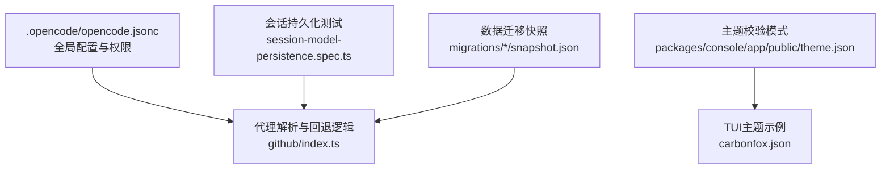
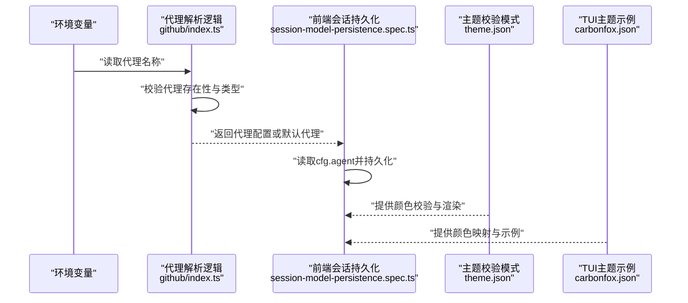
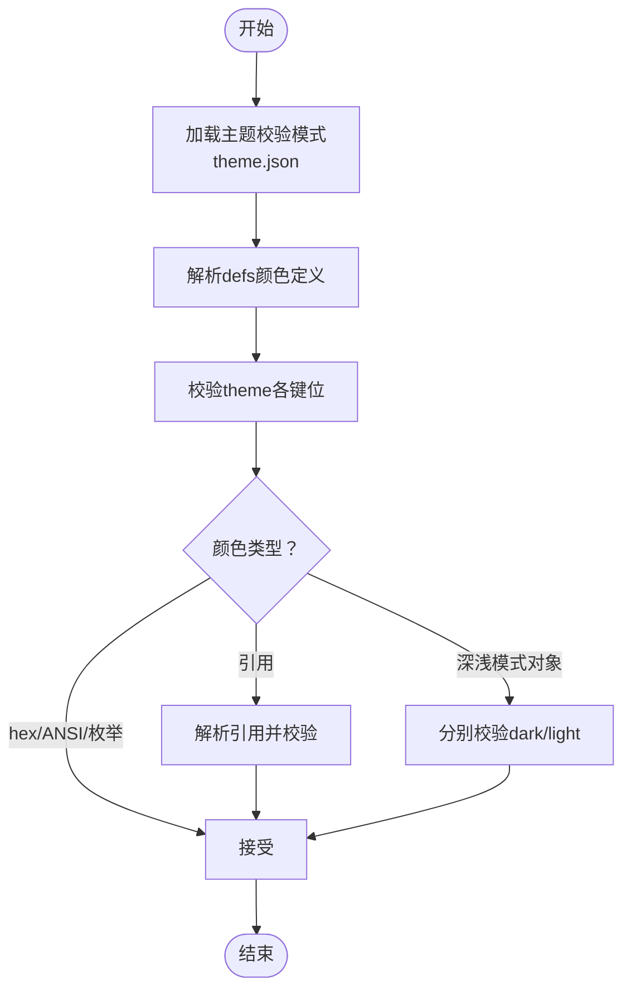
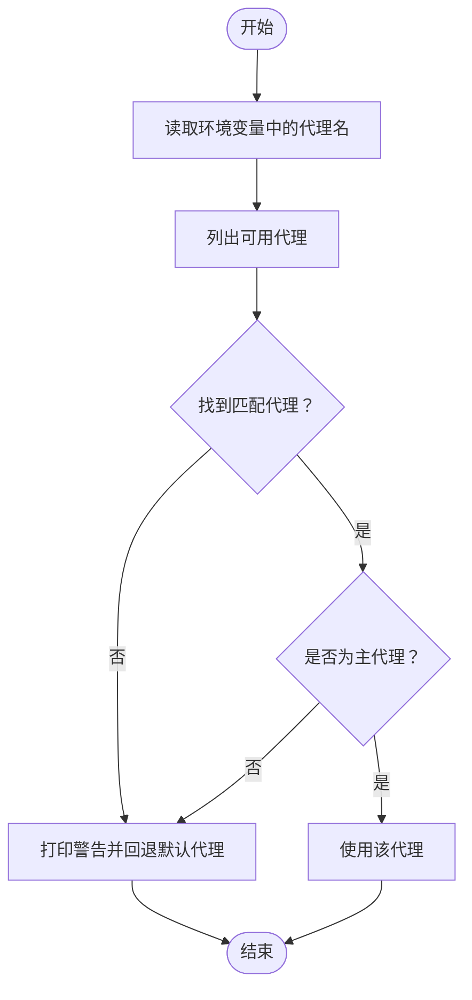
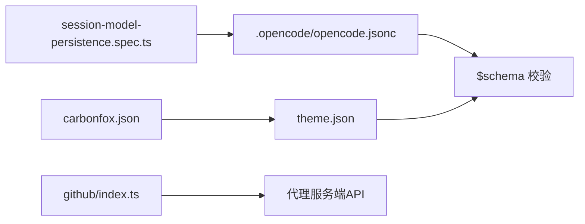

# 代理配置与参数

<cite>
**本文引用的文件**
- [.opencode/opencode.jsonc](file://.opencode/opencode.jsonc)
- [packages/console/app/public/theme.json](file://packages/console/app/public/theme.json)
- [packages/opencode/src/cli/cmd/tui/.../carbonfox.json](file://packages/opencode/src/cli/cmd/tui/context/theme/carbonfox.json)
- [github/index.ts](file://github/index.ts)
- [packages/app/e2e/session/session-model-persistence.spec.ts](file://packages/app/e2e/session/session-model-persistence.spec.ts)
- [packages/console/core/migrations/*/snapshot.json](file://packages/console/core/migrations/20251228182259_striped_forge/snapshot.json)
</cite>

## 目录
1. [引言](#引言)
2. [项目结构](#项目结构)
3. [核心组件](#核心组件)
4. [架构总览](#架构总览)
5. [详细组件分析](#详细组件分析)
6. [依赖关系分析](#依赖关系分析)
7. [性能考量](#性能考量)
8. [故障排查指南](#故障排查指南)
9. [结论](#结论)
10. [附录](#附录)

## 引言
本文件聚焦于AI代理的配置系统与参数管理，围绕以下目标展开：代理配置文件格式、默认参数、自定义选项；模型参数、行为参数、性能参数与安全参数的配置方法；配置验证机制、参数继承规则与动态更新能力；并提供配置模板、最佳实践与常见错误的解决方案及参数调优建议。本文所有技术细节均基于仓库中可验证的配置文件与实现位置进行说明。

## 项目结构
本仓库中与“代理配置”直接相关的关键位置包括：
- 全局配置文件：.opencode/opencode.jsonc（用于平台级配置与权限控制）
- 主题与UI配置：packages/console/app/public/theme.json（主题校验与颜色定义）
- TUI主题样例：packages/opencode/src/cli/cmd/tui/context/theme/carbonfox.json（主题示例）
- 代理解析与回退逻辑：github/index.ts（代理选择与回退）
- 会话持久化与代理选择：packages/app/e2e/session/session-model-persistence.spec.ts（代理参数在前端会话中的使用）
- 数据迁移快照中的“agent”字段：packages/console/core/migrations/*/snapshot.json（历史配置形态参考）

**图表来源**
- [.opencode/opencode.jsonc:1-19](file://.opencode/opencode.jsonc#L1-L19)
- [github/index.ts:592-619](file://github/index.ts#L592-L619)
- [packages/console/app/public/theme.json:1-183](file://packages/console/app/public/theme.json#L1-L183)
- [packages/opencode/src/cli/cmd/tui/context/theme/carbonfox.json:1-249](file://packages/opencode/src/cli/cmd/tui/context/theme/carbonfox.json#L1-L249)
- [packages/app/e2e/session/session-model-persistence.spec.ts:120-134](file://packages/app/e2e/session/session-model-persistence.spec.ts#L120-L134)
- [packages/console/core/migrations/20251228182259_striped_forge/snapshot.json:252](file://packages/console/core/migrations/20251228182259_striped_forge/snapshot.json#L252)

**章节来源**
- [.opencode/opencode.jsonc:1-19](file://.opencode/opencode.jsonc#L1-L19)
- [packages/console/app/public/theme.json:1-183](file://packages/console/app/public/theme.json#L1-L183)
- [packages/opencode/src/cli/cmd/tui/context/theme/carbonfox.json:1-249](file://packages/opencode/src/cli/cmd/tui/context/theme/carbonfox.json#L1-L249)
- [github/index.ts:592-619](file://github/index.ts#L592-L619)
- [packages/app/e2e/session/session-model-persistence.spec.ts:120-134](file://packages/app/e2e/session/session-model-persistence.spec.ts#L120-L134)
- [packages/console/core/migrations/20251228182259_striped_forge/snapshot.json:252](file://packages/console/core/migrations/20251228182259_striped_forge/snapshot.json#L252)

## 核心组件
- 全局配置与权限
  - 文件：.opencode/opencode.jsonc
  - 关键点：包含 provider、permission、mcp、tools 等顶层字段，用于平台级能力开关与权限约束
  - 验证：通过 $schema 指向 https://opencode.ai/config.json 进行外部校验
  - 示例路径：[全局配置文件:1-19](file://.opencode/opencode.jsonc#L1-L19)

- 主题与UI配置
  - 文件：packages/console/app/public/theme.json
  - 关键点：定义主题校验模式，支持 hex 颜色、ANSI 编码、颜色引用与深浅模式分离
  - 示例路径：[主题校验模式:1-183](file://packages/console/app/public/theme.json#L1-L183)

- TUI主题示例
  - 文件：packages/opencode/src/cli/cmd/tui/context/theme/carbonfox.json
  - 关键点：提供具体颜色定义与主题映射，展示如何在深浅模式下分别指定颜色
  - 示例路径：[TUI主题示例:1-249](file://packages/opencode/src/cli/cmd/tui/context/theme/carbonfox.json#L1-L249)

- 代理解析与回退
  - 文件：github/index.ts
  - 关键点：根据环境变量解析代理，若代理不存在或为子代理，则回退到默认代理
  - 示例路径：[代理解析与回退:592-619](file://github/index.ts#L592-L619)

- 会话持久化与代理参数
  - 文件：packages/app/e2e/session/session-model-persistence.spec.ts
  - 关键点：从配置对象中读取 agent 字段，用于会话模型持久化与UI交互
  - 示例路径：[代理参数读取:120-134](file://packages/app/e2e/session/session-model-persistence.spec.ts#L120-L134)

- 历史配置形态参考
  - 文件：packages/console/core/migrations/*/snapshot.json
  - 关键点：迁移快照中出现“agent”字段，可作为历史形态参考
  - 示例路径：[迁移快照中的agent字段](file://packages/console/core/migrations/20251228182259_striped_forge/snapshot.json#L252)

**章节来源**
- [.opencode/opencode.jsonc:1-19](file://.opencode/opencode.jsonc#L1-L19)
- [packages/console/app/public/theme.json:1-183](file://packages/console/app/public/theme.json#L1-L183)
- [packages/opencode/src/cli/cmd/tui/context/theme/carbonfox.json:1-249](file://packages/opencode/src/cli/cmd/tui/context/theme/carbonfox.json#L1-L249)
- [github/index.ts:592-619](file://github/index.ts#L592-L619)
- [packages/app/e2e/session/session-model-persistence.spec.ts:120-134](file://packages/app/e2e/session/session-model-persistence.spec.ts#L120-L134)
- [packages/console/core/migrations/20251228182259_striped_forge/snapshot.json:252](file://packages/console/core/migrations/20251228182259_striped_forge/snapshot.json#L252)

## 架构总览
下图展示了代理配置在系统中的关键流转：从全局配置文件到代理解析与回退，再到前端会话持久化与UI主题渲染。

**图表来源**
- [github/index.ts:592-619](file://github/index.ts#L592-L619)
- [packages/app/e2e/session/session-model-persistence.spec.ts:120-134](file://packages/app/e2e/session/session-model-persistence.spec.ts#L120-L134)
- [packages/console/app/public/theme.json:1-183](file://packages/console/app/public/theme.json#L1-L183)
- [packages/opencode/src/cli/cmd/tui/context/theme/carbonfox.json:1-249](file://packages/opencode/src/cli/cmd/tui/context/theme/carbonfox.json#L1-L249)

## 详细组件分析

### 全局配置与权限（opencode.jsonc）
- 配置文件格式
  - 顶层字段：provider、permission、mcp、tools
  - 使用 $schema 指向 https://opencode.ai/config.json 进行外部校验
- 默认参数与自定义选项
  - provider.opencode.options：空对象，表示默认提供者配置
  - permission.edit：对特定路径的编辑权限控制
  - mcp：空对象，表示默认MCP配置
  - tools.*：布尔开关，用于启用/禁用工具
- 安全参数
  - permission.edit 可用于限制对敏感路径的修改
- 配置验证
  - 通过 $schema 实现外部校验，确保字段与类型正确
- 动态更新
  - 当前文件为静态配置，动态更新需结合运行时加载策略与权限控制

**章节来源**
- [.opencode/opencode.jsonc:1-19](file://.opencode/opencode.jsonc#L1-L19)

### 主题与UI配置（theme.json 与 carbonfox.json）
- 主题校验模式
  - 支持颜色值类型：hex、ANSI 编码、枚举 "none"、颜色引用、深浅模式分离对象
  - 定义了丰富的 UI 组件颜色键位（如 primary、secondary、accent、text、background 等）
- TUI主题示例
  - 提供具体的颜色定义与深浅模式映射，便于在终端界面中复用
- 配置验证
  - theme.json 中的 JSON Schema 对颜色值与结构进行严格校验
- 参数继承与复用
  - 通过 defs 定义颜色常量，并在 theme 中引用，实现继承与复用

**图表来源**
- [packages/console/app/public/theme.json:1-183](file://packages/console/app/public/theme.json#L1-L183)
- [packages/opencode/src/cli/cmd/tui/context/theme/carbonfox.json:1-249](file://packages/opencode/src/cli/cmd/tui/context/theme/carbonfox.json#L1-L249)

**章节来源**
- [packages/console/app/public/theme.json:1-183](file://packages/console/app/public/theme.json#L1-L183)
- [packages/opencode/src/cli/cmd/tui/context/theme/carbonfox.json:1-249](file://packages/opencode/src/cli/cmd/tui/context/theme/carbonfox.json#L1-L249)

### 代理解析与回退（github/index.ts）
- 解析流程
  - 读取环境变量中的代理名称
  - 列出可用代理并查找匹配项
  - 若代理不存在或类型为子代理，则回退到默认代理
- 行为参数
  - 代理类型判断（主代理 vs 子代理）
  - 回退策略（打印警告并使用默认代理）
- 性能参数
  - 代理列表查询与过滤为O(n)，n为代理数量
- 安全参数
  - 仅允许主代理参与工作流，避免子代理误用

**图表来源**
- [github/index.ts:592-619](file://github/index.ts#L592-L619)

**章节来源**
- [github/index.ts:592-619](file://github/index.ts#L592-L619)

### 会话持久化与代理参数（session-model-persistence.spec.ts）
- 读取代理参数
  - 从 cfg.agent 中读取当前代理配置，用于会话持久化与UI交互
- 行为参数
  - 代理参数影响会话模型的选择与保存
- 性能参数
  - 代理参数读取为轻量操作，对性能影响可忽略
- 安全参数
  - 代理参数来源于受控配置源，避免注入风险

**章节来源**
- [packages/app/e2e/session/session-model-persistence.spec.ts:120-134](file://packages/app/e2e/session/session-model-persistence.spec.ts#L120-L134)

### 历史配置形态参考（migrations/*/snapshot.json）
- “agent”字段出现于多个迁移快照中，表明代理配置在系统演进过程中曾作为关键字段存在
- 参考价值
  - 了解历史形态，辅助新旧版本兼容与迁移策略制定

**章节来源**
- [packages/console/core/migrations/20251228182259_striped_forge/snapshot.json:252](file://packages/console/core/migrations/20251228182259_striped_forge/snapshot.json#L252)

## 依赖关系分析
- 配置文件依赖
  - .opencode/opencode.jsonc 依赖外部 schema 校验
  - theme.json 依赖 JSON Schema 进行结构与类型校验
- 运行时依赖
  - github/index.ts 依赖代理服务端API以解析代理
  - session-model-persistence.spec.ts 依赖前端配置对象
- 耦合与内聚
  - 配置文件与运行时逻辑松耦合，通过约定的键位与结构进行交互
  - 主题系统通过 defs 与引用实现高内聚的颜色管理

**图表来源**
- [.opencode/opencode.jsonc:1-19](file://.opencode/opencode.jsonc#L1-L19)
- [packages/console/app/public/theme.json:1-183](file://packages/console/app/public/theme.json#L1-L183)
- [github/index.ts:592-619](file://github/index.ts#L592-L619)
- [packages/app/e2e/session/session-model-persistence.spec.ts:120-134](file://packages/app/e2e/session/session-model-persistence.spec.ts#L120-L134)
- [packages/opencode/src/cli/cmd/tui/context/theme/carbonfox.json:1-249](file://packages/opencode/src/cli/cmd/tui/context/theme/carbonfox.json#L1-L249)

**章节来源**
- [.opencode/opencode.jsonc:1-19](file://.opencode/opencode.jsonc#L1-L19)
- [packages/console/app/public/theme.json:1-183](file://packages/console/app/public/theme.json#L1-L183)
- [github/index.ts:592-619](file://github/index.ts#L592-L619)
- [packages/app/e2e/session/session-model-persistence.spec.ts:120-134](file://packages/app/e2e/session/session-model-persistence.spec.ts#L120-L134)
- [packages/opencode/src/cli/cmd/tui/context/theme/carbonfox.json:1-249](file://packages/opencode/src/cli/cmd/tui/context/theme/carbonfox.json#L1-L249)

## 性能考量
- 代理解析
  - 列表查询与过滤为线性复杂度，建议在代理数量较大时引入缓存与增量更新
- 主题校验
  - JSON Schema 校验为O(n)（n为属性数），建议在构建阶段预校验，运行时采用快速路径
- 会话持久化
  - 代理参数读取为常量时间，对性能影响极小

## 故障排查指南
- 代理不存在或类型不正确
  - 现象：代理解析失败并回退默认代理
  - 排查：检查环境变量与代理列表，确认代理类型为主代理
  - 参考路径：[代理解析与回退:592-619](file://github/index.ts#L592-L619)
- 配置校验失败
  - 现象：主题或全局配置不符合JSON Schema
  - 排查：对照 theme.json 的校验规则修正颜色值与结构
  - 参考路径：[主题校验模式:1-183](file://packages/console/app/public/theme.json#L1-L183)
- 会话代理参数缺失
  - 现象：会话无法正确持久化代理配置
  - 排查：确认 cfg.agent 是否存在且结构正确
  - 参考路径：[代理参数读取:120-134](file://packages/app/e2e/session/session-model-persistence.spec.ts#L120-L134)

**章节来源**
- [github/index.ts:592-619](file://github/index.ts#L592-L619)
- [packages/console/app/public/theme.json:1-183](file://packages/console/app/public/theme.json#L1-L183)
- [packages/app/e2e/session/session-model-persistence.spec.ts:120-134](file://packages/app/e2e/session/session-model-persistence.spec.ts#L120-L134)

## 结论
本仓库的代理配置系统以“约定优于配置”为核心思想：通过全局配置文件与主题校验模式实现强约束与可维护性；通过代理解析逻辑保障运行时的健壮性；通过会话持久化与历史迁移记录支撑前后端协同与版本演进。建议在实际落地中结合动态加载与缓存策略，进一步提升性能与扩展性。

## 附录

### 配置模板
- 全局配置模板（opencode.jsonc）
  - 参考路径：[全局配置文件:1-19](file://.opencode/opencode.jsonc#L1-L19)
- 主题配置模板（theme.json）
  - 参考路径：[主题校验模式:1-183](file://packages/console/app/public/theme.json#L1-L183)
- TUI主题示例（carbonfox.json）
  - 参考路径：[TUI主题示例:1-249](file://packages/opencode/src/cli/cmd/tui/context/theme/carbonfox.json#L1-L249)

### 最佳实践
- 使用 $schema 进行外部校验，确保配置一致性
- 在 theme.json 中统一定义颜色常量并通过 defs 复用
- 代理解析应包含回退策略与日志提示
- 会话持久化前先校验代理参数结构

### 常见配置错误与解决方案
- 错误：代理名称不存在或类型为子代理
  - 解决：确认代理列表与类型，必要时回退默认代理
  - 参考路径：[代理解析与回退:592-619](file://github/index.ts#L592-L619)
- 错误：主题颜色值不符合规范
  - 解决：遵循 hex/ANSI/枚举/引用/深浅模式对象等规则
  - 参考路径：[主题校验模式:1-183](file://packages/console/app/public/theme.json#L1-L183)
- 错误：会话代理参数缺失
  - 解决：确保 cfg.agent 存在且结构完整
  - 参考路径：[代理参数读取:120-134](file://packages/app/e2e/session/session-model-persistence.spec.ts#L120-L134)