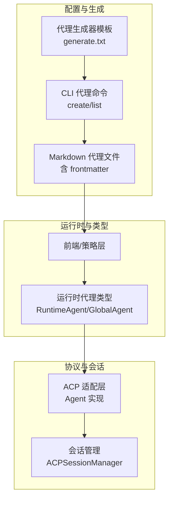
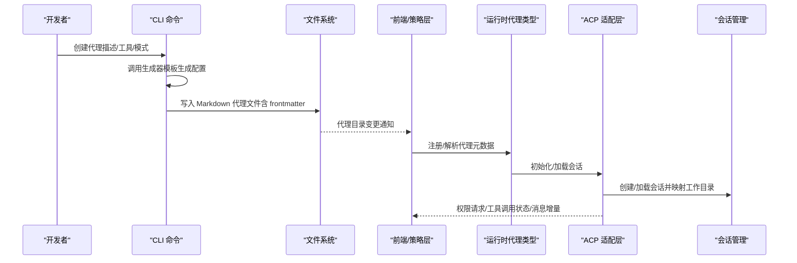
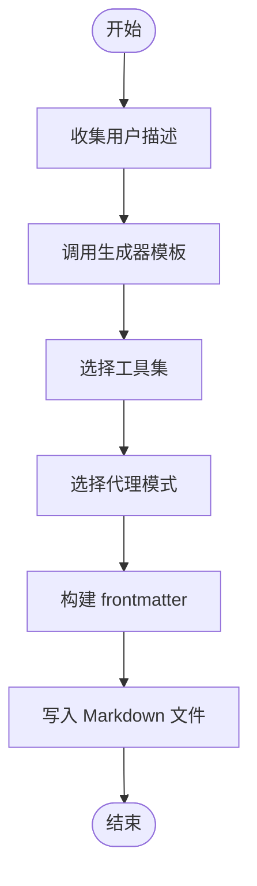
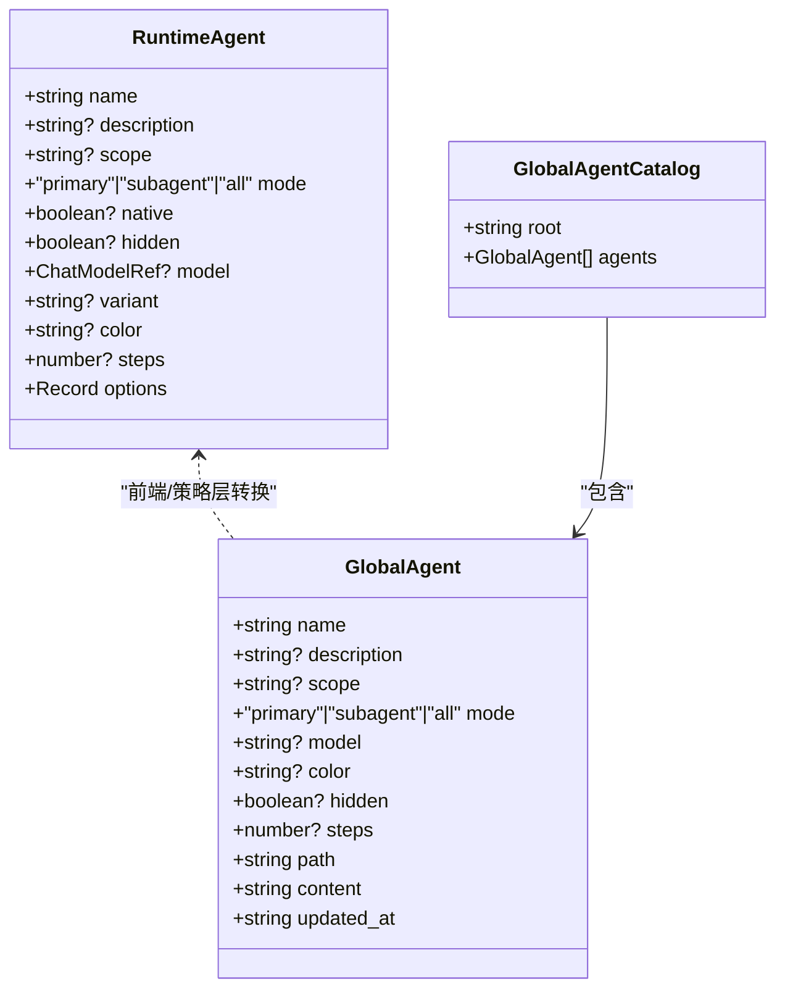
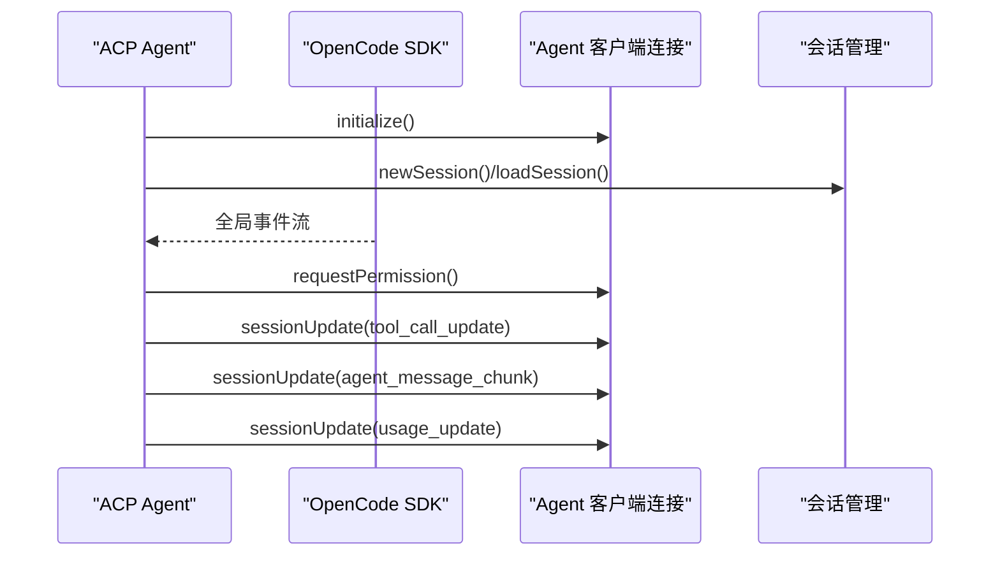
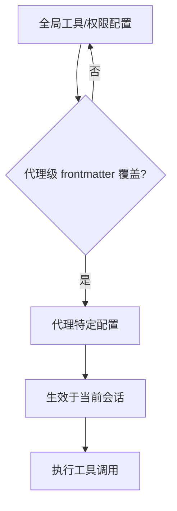
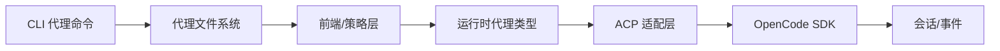

# 自定义代理开发

<cite>
**本文引用的文件**
- [AGENTS.md](file://AGENTS.md)
- [README.md](file://README.md)
- [packages/opencode/src/agent/generate.txt](file://packages/opencode/src/agent/generate.txt)
- [packages/opencode/src/cli/cmd/agent.ts](file://packages/opencode/src/cli/cmd/agent.ts)
- [packages/opencode/src/acp/agent.ts](file://packages/opencode/src/acp/agent.ts)
- [packages/opencode/src/acp/README.md](file://packages/opencode/src/acp/README.md)
- [packages/strategy-front/src/types/agent.ts](file://packages/strategy-front/src/types/agent.ts)
- [packages/web/src/content/docs/agents.mdx](file://packages/web/src/content/docs/agents.mdx)
- [packages/web/src/content/docs/de/agents.mdx](file://packages/web/src/content/docs/de/agents.mdx)
- [packages/web/src/content/docs/it/agents.mdx](file://packages/web/src/content/docs/it/agents.mdx)
- [packages/web/src/content/docs/nb/agents.mdx](file://packages/web/src/content/docs/nb/agents.mdx)
- [packages/web/src/content/docs/pl/agents.mdx](file://packages/web/src/content/docs/pl/agents.mdx)
- [packages/web/src/content/docs/ko/agents.mdx](file://packages/web/src/content/docs/ko/agents.mdx)
- [packages/web/src/content/docs/tr/agents.mdx](file://packages/web/src/content/docs/tr/agents.mdx)
</cite>

## 目录
1. [简介](#简介)
2. [项目结构](#项目结构)
3. [核心组件](#核心组件)
4. [架构总览](#架构总览)
5. [详细组件分析](#详细组件分析)
6. [依赖分析](#依赖分析)
7. [性能考虑](#性能考虑)
8. [故障排查指南](#故障排查指南)
9. [结论](#结论)
10. [附录](#附录)

## 简介
本指南面向希望在 OpenCode 平台上开发“自定义 AI 代理”的工程师与产品人员。文档从接口定义、继承关系与实现要求出发，系统阐述代理开发的核心模式、设计原则与架构约束；并提供编写步骤、测试方法与调试技巧，辅以多类型代理的实现思路与最佳实践，帮助你在不破坏系统稳定性的前提下，快速构建高可靠、可扩展、易维护的代理。

## 项目结构
OpenCode 的代理体系由“配置型代理文件”“CLI 生成器”“运行时代理类型”“ACP 协议适配层”等模块组成。核心要点如下：
- 配置型代理：以 Markdown 文件形式定义系统提示词、模式（主代理/子代理）、工具集与权限策略，位于用户或项目的代理目录。
- CLI 生成器：通过交互式向导或参数化方式生成代理配置文件，自动填充标识符、用途说明与系统提示词。
- 运行时代理类型：前端/策略层对代理的运行时形态进行抽象，用于注册、切换与可视化管理。
- ACP 协议适配层：实现 Agent Client Protocol，桥接 OpenCode 内核与外部客户端，负责会话生命周期、权限请求、工具调用状态上报与消息增量推送。

图示来源
- [packages/opencode/src/cli/cmd/agent.ts:31-226](file://packages/opencode/src/cli/cmd/agent.ts#L31-L226)
- [packages/opencode/src/agent/generate.txt:1-76](file://packages/opencode/src/agent/generate.txt#L1-L76)
- [packages/strategy-front/src/types/agent.ts:3-48](file://packages/strategy-front/src/types/agent.ts#L3-L48)
- [packages/opencode/src/acp/agent.ts:134-156](file://packages/opencode/src/acp/agent.ts#L134-L156)

章节来源
- [packages/opencode/src/cli/cmd/agent.ts:1-258](file://packages/opencode/src/cli/cmd/agent.ts#L1-L258)
- [packages/opencode/src/agent/generate.txt:1-76](file://packages/opencode/src/agent/generate.txt#L1-L76)
- [packages/strategy-front/src/types/agent.ts:1-48](file://packages/strategy-front/src/types/agent.ts#L1-L48)
- [packages/opencode/src/acp/README.md:1-63](file://packages/opencode/src/acp/README.md#L1-L63)

## 核心组件
- 代理生成器模板：定义生成系统提示词与标识符的结构化输入输出规范，确保生成的代理具备明确的触发条件、行为边界与输出格式预期。
- CLI 代理命令：提供交互式或非交互式创建代理的能力，支持选择工具集、设定模式（主/子/全），并写入标准 frontmatter。
- 运行时代理类型：抽象出运行态代理的字段集合，便于前端展示、切换与持久化。
- ACP 适配层：实现 ACP 协议接口，负责初始化、会话生命周期、权限请求、工具调用状态与消息增量推送。

章节来源
- [packages/opencode/src/agent/generate.txt:59-76](file://packages/opencode/src/agent/generate.txt#L59-L76)
- [packages/opencode/src/cli/cmd/agent.ts:17-29](file://packages/opencode/src/cli/cmd/agent.ts#L17-L29)
- [packages/strategy-front/src/types/agent.ts:3-29](file://packages/strategy-front/src/types/agent.ts#L3-L29)
- [packages/opencode/src/acp/agent.ts:134-156](file://packages/opencode/src/acp/agent.ts#L134-L156)

## 架构总览
下图展示了从“生成代理配置”到“运行时执行”的端到端流程，以及与 ACP 协议的对接关系。

图示来源
- [packages/opencode/src/cli/cmd/agent.ts:121-223](file://packages/opencode/src/cli/cmd/agent.ts#L121-L223)
- [packages/opencode/src/acp/agent.ts:520-602](file://packages/opencode/src/acp/agent.ts#L520-L602)
- [packages/strategy-front/src/types/agent.ts:3-29](file://packages/strategy-front/src/types/agent.ts#L3-L29)

## 详细组件分析

### 组件一：代理生成器与 CLI
- 设计目标：将自然语言需求转化为结构化的代理配置，保证系统提示词清晰、触发条件明确、输出格式可预期。
- 关键流程：
  - 输入：用户描述、可选模型。
  - 处理：调用生成器模板，产出标识符、用途说明与系统提示词。
  - 输出：写入 Markdown 文件，frontmatter 包含描述、模式与工具集。
- 工具选择：CLI 支持交互式与非交互式两种模式，工具集默认全开，可按需关闭。
- 最佳实践：
  - 在生成前明确“何时使用”与“如何触发”，避免泛化描述。
  - 使用简洁、可记忆的标识符，避免通用词。
  - 将“质量控制与自校验”纳入系统提示词，提升鲁棒性。

图示来源
- [packages/opencode/src/agent/generate.txt:27-64](file://packages/opencode/src/agent/generate.txt#L27-L64)
- [packages/opencode/src/cli/cmd/agent.ts:121-223](file://packages/opencode/src/cli/cmd/agent.ts#L121-L223)

章节来源
- [packages/opencode/src/agent/generate.txt:1-76](file://packages/opencode/src/agent/generate.txt#L1-L76)
- [packages/opencode/src/cli/cmd/agent.ts:17-29](file://packages/opencode/src/cli/cmd/agent.ts#L17-L29)
- [packages/opencode/src/cli/cmd/agent.ts:132-203](file://packages/opencode/src/cli/cmd/agent.ts#L132-L203)

### 组件二：运行时代理类型与前端集成
- 类型定义：运行时代理包含名称、描述、作用域、模式（主/子/全）、模型引用、变体、颜色、步骤数与选项等字段。
- 前端职责：根据代理类型渲染 UI、支持切换、权限与工具可见性控制。
- 全局代理目录：支持本地与项目级代理目录，便于团队共享与覆盖。

图示来源
- [packages/strategy-front/src/types/agent.ts:3-29](file://packages/strategy-front/src/types/agent.ts#L3-L29)

章节来源
- [packages/strategy-front/src/types/agent.ts:1-48](file://packages/strategy-front/src/types/agent.ts#L1-L48)

### 组件三：ACP 协议适配层（Agent 实现）
- 角色定位：实现 ACP Agent 接口，负责初始化、会话生命周期（新建/加载/恢复/派生）、权限请求、工具调用状态上报与消息增量推送。
- 关键能力：
  - 初始化：声明协议版本、能力清单与认证方式。
  - 会话：创建/加载/恢复/派生会话，回放历史消息，同步使用量信息。
  - 事件订阅：监听全局事件，处理权限请求、工具调用状态变化与消息增量。
  - 工具调用：根据工具类型上报 in_progress/completed/error，并在需要时发送 diff 或写文件。
- 错误处理：对鉴权缺失、SDK 查询失败等情况进行分类处理与错误转换。

图示来源
- [packages/opencode/src/acp/agent.ts:520-602](file://packages/opencode/src/acp/agent.ts#L520-L602)
- [packages/opencode/src/acp/agent.ts:184-518](file://packages/opencode/src/acp/agent.ts#L184-L518)

章节来源
- [packages/opencode/src/acp/agent.ts:134-156](file://packages/opencode/src/acp/agent.ts#L134-L156)
- [packages/opencode/src/acp/agent.ts:520-800](file://packages/opencode/src/acp/agent.ts#L520-L800)
- [packages/opencode/src/acp/README.md:1-63](file://packages/opencode/src/acp/README.md#L1-L63)

### 组件四：权限与工具配置
- 工具控制：通过 frontmatter 或全局配置启用/禁用具体工具（如 bash、read、write、edit、list、glob、grep、webfetch、task、todowrite、todoread）。
- 权限策略：针对 edit、bash、webfetch 等工具可配置为“询问/允许/拒绝”，支持通配符与精确命令匹配。
- 覆盖优先级：代理级配置覆盖全局默认配置，便于按场景精细化控制。

图示来源
- [packages/web/src/content/docs/agents.mdx:370-473](file://packages/web/src/content/docs/agents.mdx#L370-L473)
- [packages/web/src/content/docs/de/agents.mdx:352-403](file://packages/web/src/content/docs/de/agents.mdx#L352-L403)
- [packages/web/src/content/docs/it/agents.mdx:411-467](file://packages/web/src/content/docs/it/agents.mdx#L411-L467)
- [packages/web/src/content/docs/nb/agents.mdx:412-467](file://packages/web/src/content/docs/nb/agents.mdx#L412-L467)
- [packages/web/src/content/docs/pl/agents.mdx:16-35](file://packages/web/src/content/docs/pl/agents.mdx#L16-L35)
- [packages/web/src/content/docs/ko/agents.mdx:16-35](file://packages/web/src/content/docs/ko/agents.mdx#L16-L35)
- [packages/web/src/content/docs/tr/agents.mdx:16-35](file://packages/web/src/content/docs/tr/agents.mdx#L16-L35)

章节来源
- [packages/web/src/content/docs/agents.mdx:356-473](file://packages/web/src/content/docs/agents.mdx#L356-L473)
- [packages/web/src/content/docs/de/agents.mdx:349-403](file://packages/web/src/content/docs/de/agents.mdx#L349-L403)
- [packages/web/src/content/docs/it/agents.mdx:411-467](file://packages/web/src/content/docs/it/agents.mdx#L411-L467)
- [packages/web/src/content/docs/nb/agents.mdx:412-467](file://packages/web/src/content/docs/nb/agents.mdx#L412-L467)
- [packages/web/src/content/docs/pl/agents.mdx:16-35](file://packages/web/src/content/docs/pl/agents.mdx#L16-L35)
- [packages/web/src/content/docs/ko/agents.mdx:16-35](file://packages/web/src/content/docs/ko/agents.mdx#L16-L35)
- [packages/web/src/content/docs/tr/agents.mdx:16-35](file://packages/web/src/content/docs/tr/agents.mdx#L16-L35)

## 依赖分析
- 低耦合：CLI 仅负责生成配置，不直接参与运行时逻辑；ACP 层通过 SDK 访问会话与事件，保持与业务内核的解耦。
- 可观测性：ACP 层统一上报工具调用状态与消息增量，便于前端与外部客户端实时感知。
- 扩展点：通过 frontmatter 与全局配置扩展工具集与权限策略；通过 ACP 能力清单扩展客户端能力。

图示来源
- [packages/opencode/src/cli/cmd/agent.ts:1-258](file://packages/opencode/src/cli/cmd/agent.ts#L1-L258)
- [packages/opencode/src/acp/agent.ts:134-156](file://packages/opencode/src/acp/agent.ts#L134-L156)

章节来源
- [packages/opencode/src/cli/cmd/agent.ts:1-258](file://packages/opencode/src/cli/cmd/agent.ts#L1-L258)
- [packages/opencode/src/acp/agent.ts:134-156](file://packages/opencode/src/acp/agent.ts#L134-L156)

## 性能考虑
- 生成阶段：尽量在 CLI 层完成结构化输出，减少前端解析成本。
- 运行阶段：使用增量消息推送与工具状态上报，避免轮询带来的延迟与资源消耗。
- 会话复用：在加载/恢复/派生会话时，优先复用已有上下文，减少重复计算。
- 日志与监控：在 ACP 层对关键路径（权限请求、工具调用、消息增量）进行轻量级日志记录，便于定位性能瓶颈。

## 故障排查指南
- 生成失败：检查生成器模板输入是否满足约束（如标识符格式、用途说明、系统提示词结构）。
- 权限拒绝：确认代理 frontmatter 中的权限配置与工具集是否与实际调用一致；必要时调整为“询问”以便人工审批。
- 会话异常：检查会话创建/加载/恢复流程中的错误转换与重试策略；关注鉴权缺失与 SDK 查询失败的分支。
- ACP 客户端：确认客户端能力清单与协议版本兼容；验证权限请求回调与工具状态上报是否正确处理。

章节来源
- [packages/opencode/src/agent/generate.txt:59-76](file://packages/opencode/src/agent/generate.txt#L59-L76)
- [packages/opencode/src/acp/agent.ts:566-568](file://packages/opencode/src/acp/agent.ts#L566-L568)
- [packages/opencode/src/acp/agent.ts:76-124](file://packages/opencode/src/acp/agent.ts#L76-L124)

## 结论
通过“结构化生成 + 清晰类型 + 协议适配 + 权限与工具控制”的组合，OpenCode 提供了可扩展、可观测且易于维护的代理开发框架。遵循本文的设计原则与实现步骤，你可以快速构建从只读探索到全功能开发的多种代理，并在团队内形成一致的开发与运维实践。

## 附录
- 快速开始步骤
  1) 使用 CLI 生成代理配置：提供描述、选择工具集与模式，生成 Markdown 文件。
  2) 在 frontmatter 中补充描述、模式与工具集。
  3) 在前端/策略层注册并切换代理。
  4) 通过 ACP 适配层接入外部客户端，启用权限请求与工具调用状态上报。
  5) 基于权限与工具配置，逐步放开能力并进行灰度验证。
- 测试与调试建议
  - 测试：优先测试生成器模板输出与 CLI 写入流程；再测试前端注册与切换；最后测试 ACP 事件与工具调用。
  - 调试：在 ACP 层开启关键路径日志；使用“询问”权限策略观察交互链路；对工具调用状态与消息增量进行端到端验证。

章节来源
- [packages/opencode/src/cli/cmd/agent.ts:121-223](file://packages/opencode/src/cli/cmd/agent.ts#L121-L223)
- [packages/opencode/src/acp/agent.ts:184-518](file://packages/opencode/src/acp/agent.ts#L184-L518)
- [AGENTS.md:120-129](file://AGENTS.md#L120-L129)