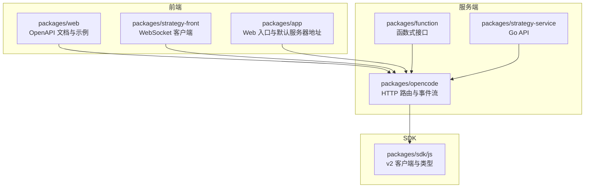
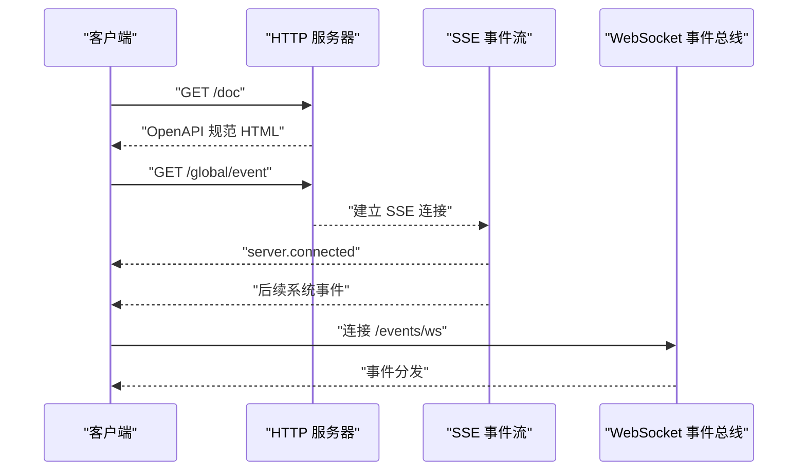
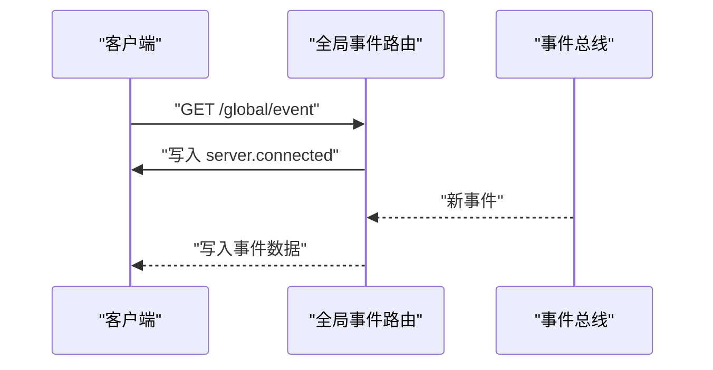
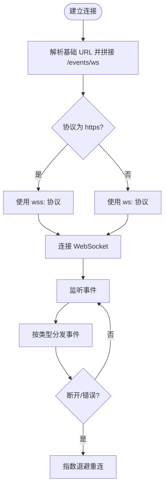
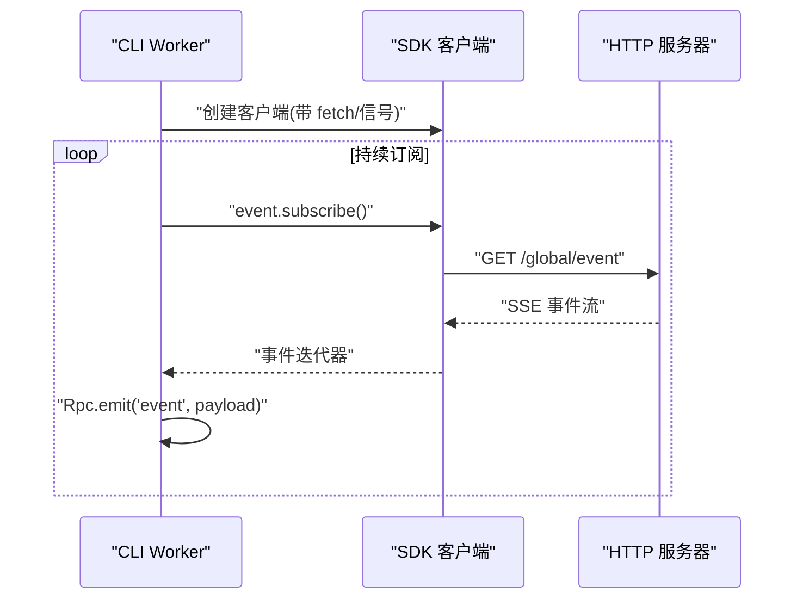
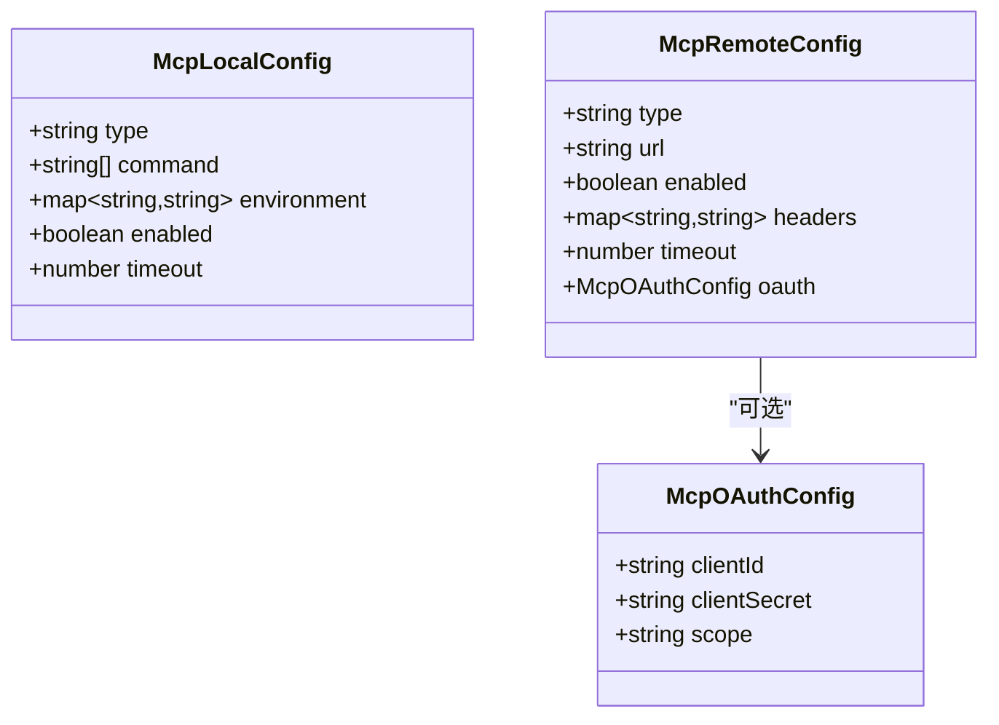
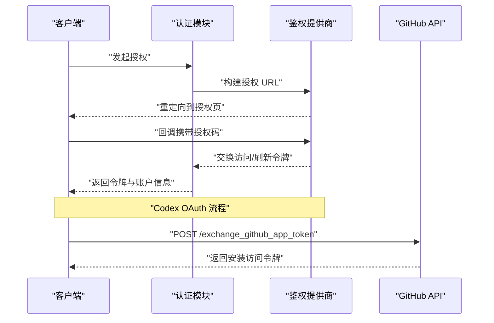
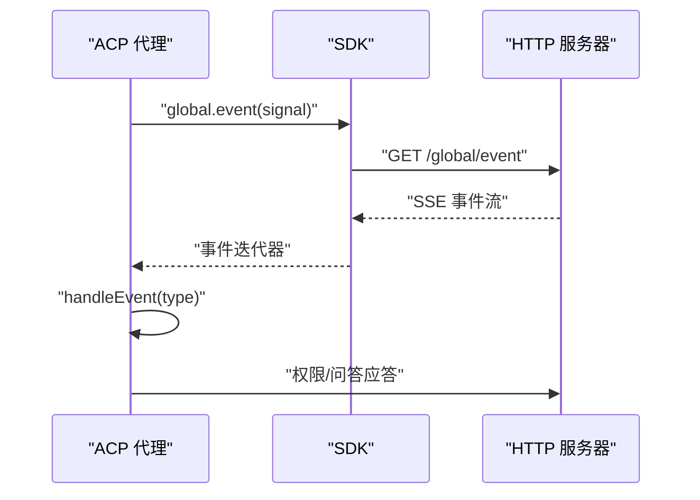
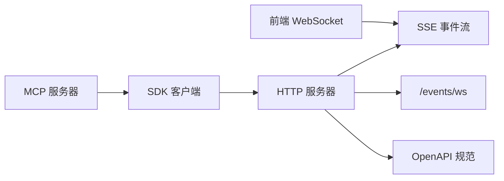

# API参考

<cite>
**本文档引用的文件**
- [README.md](file://README.md)
- [packages/web/src/content/docs/server.mdx](file://packages/web/src/content/docs/server.mdx)
- [packages/opencode/src/server/routes/global.ts](file://packages/opencode/src/server/routes/global.ts)
- [packages/function/src/api.ts](file://packages/function/src/api.ts)
- [packages/sdk/js/src/v2/gen/types.gen.ts](file://packages/sdk/js/src/v2/gen/types.gen.ts)
- [packages/sdk/js/package.json](file://packages/sdk/js/package.json)
- [packages/web/src/content/docs/zh-cn/mcp-servers.mdx](file://packages/web/src/content/docs/zh-cn/mcp-servers.mdx)
- [packages/opencode/src/plugin/codex.ts](file://packages/opencode/src/plugin/codex.ts)
- [packages/strategy-service/internal/web/opencode_api.go](file://packages/strategy-service/internal/web/opencode_api.go)
- [packages/opencode/test/mcp/headers.test.ts](file://packages/opencode/test/mcp/headers.test.ts)
- [packages/opencode/test/mcp/oauth-browser.test.ts](file://packages/opencode/test/mcp/oauth-browser.test.ts)
- [packages/opencode/test/mcp/oauth-auto-connect.test.ts](file://packages/opencode/test/mcp/oauth-auto-connect.test.ts)
- [packages/opencode/test/acp/event-subscription.test.ts](file://packages/opencode/test/acp/event-subscription.test.ts)
- [packages/opencode/src/acp/agent.ts](file://packages/opencode/src/acp/agent.ts)
- [packages/opencode/src/cli/cmd/tui/worker.ts](file://packages/opencode/src/cli/cmd/tui/worker.ts)
- [packages/strategy-front/src/lib/socket-bus.ts](file://packages/strategy-front/src/lib/socket-bus.ts)
- [packages/app/src/entry.tsx](file://packages/app/src/entry.tsx)
- [github/index.ts](file://github/index.ts)
- [patches/@standard-community%2Fstandard-openapi@0.2.9.patch](file://patches/@standard-community%2Fstandard-openapi@0.2.9.patch)
</cite>

## 目录
1. [简介](#简介)
2. [项目结构](#项目结构)
3. [核心组件](#核心组件)
4. [架构总览](#架构总览)
5. [详细组件分析](#详细组件分析)
6. [依赖关系分析](#依赖关系分析)
7. [性能考量](#性能考量)
8. [故障排查指南](#故障排查指南)
9. [结论](#结论)
10. [附录](#附录)

## 简介
本文件为 OpenCode 的完整 API 参考文档，覆盖以下主题：
- HTTP API 端点、请求/响应格式与认证机制
- WebSocket 实时通信与事件订阅（SSE）
- SDK 使用指南、客户端集成示例与最佳实践
- MCP（Model Context Protocol）服务器配置与协议规范
- API 版本管理、向后兼容性与迁移指南
- API 测试工具、模拟服务与调试方法

OpenCode 提供一个可独立运行的 HTTP 服务器，暴露 OpenAPI 3.1 规范，并生成 SDK 用于客户端集成；同时支持基于 Server-Sent Events 的全局事件流与 MCP 工具扩展。

章节来源
- [README.md:1-142](file://README.md#L1-L142)

## 项目结构
OpenCode 采用多包（monorepo）组织方式，核心与 API 相关的模块包括：
- packages/web：文档与前端入口，包含 OpenAPI 文档与前端示例
- packages/opencode：核心服务端路由、事件系统、MCP 集成与插件
- packages/function：部分后端函数接口（如 GitHub 令牌交换）
- packages/sdk/js：自动生成的 JS SDK（含 v2 客户端与类型）
- packages/strategy-service：Go 语言实现的策略服务 API
- packages/strategy-front：前端事件总线与 WebSocket 客户端
- patches：对 OpenAPI 导出流程的补丁

图表来源
- [packages/web/src/content/docs/server.mdx:1-288](file://packages/web/src/content/docs/server.mdx#L1-L288)
- [packages/opencode/src/server/routes/global.ts:39-84](file://packages/opencode/src/server/routes/global.ts#L39-L84)
- [packages/sdk/js/package.json:1-32](file://packages/sdk/js/package.json#L1-L32)

章节来源
- [packages/web/src/content/docs/server.mdx:1-288](file://packages/web/src/content/docs/server.mdx#L1-L288)
- [packages/sdk/js/package.json:1-32](file://packages/sdk/js/package.json#L1-L32)

## 核心组件
- HTTP 服务器与 OpenAPI 规范
  - 通过命令启动 HTTP 服务器，暴露 OpenAPI 3.1 规范页面与各业务端点
  - 支持基本认证（用户名/密码），适用于浏览器与 CLI 场景
- 全局事件与 SSE
  - 提供全局事件流，首条事件为连接确认，随后推送系统事件
- WebSocket 与前端事件总线
  - 前端通过 WebSocket 订阅事件，具备重连与退避策略
- SDK 与类型
  - 自动生成的 v2 客户端与事件类型，便于 TypeScript 客户端集成
- MCP 服务器
  - 支持本地与远程 MCP 服务器，可配置超时、请求头与 OAuth
- 认证与授权
  - 提供多种认证方式（Basic Auth、OAuth 等）

章节来源
- [packages/web/src/content/docs/server.mdx:37-44](file://packages/web/src/content/docs/server.mdx#L37-L44)
- [packages/opencode/src/server/routes/global.ts:42-84](file://packages/opencode/src/server/routes/global.ts#L42-L84)
- [packages/strategy-front/src/lib/socket-bus.ts:19-55](file://packages/strategy-front/src/lib/socket-bus.ts#L19-L55)
- [packages/sdk/js/src/v2/gen/types.gen.ts:1-200](file://packages/sdk/js/src/v2/gen/types.gen.ts#L1-L200)

## 架构总览
OpenCode 的服务端采用“HTTP + SSE + WebSocket”的组合：
- HTTP API：提供 OpenAPI 规范与 REST 端点
- SSE：全局事件流，客户端可订阅系统事件
- WebSocket：前端事件总线，负责事件分发与重连
- SDK：自动生成的 v2 客户端，封装 HTTP/SSE/WebSocket 调用

图表来源
- [packages/web/src/content/docs/server.mdx:72-81](file://packages/web/src/content/docs/server.mdx#L72-L81)
- [packages/opencode/src/server/routes/global.ts:42-84](file://packages/opencode/src/server/routes/global.ts#L42-L84)
- [packages/strategy-front/src/lib/socket-bus.ts:19-55](file://packages/strategy-front/src/lib/socket-bus.ts#L19-L55)

## 详细组件分析

### HTTP API 端点与认证
- 服务器启动与认证
  - 通过环境变量开启 Basic Auth，用户名默认为固定值，可覆盖
- OpenAPI 规范
  - 提供 /doc 页面展示 OpenAPI 3.1 规范，可用于生成客户端或查看类型
- 主要端点概览
  - 全局：健康检查、全局事件流
  - 项目：项目列表、当前项目
  - 路径与 VCS：当前路径、版本控制信息
  - 实例：销毁当前实例
  - 配置：读取/更新配置、列出提供方与默认模型
  - 提供方：列出提供方、认证方式、OAuth 授权与回调
  - 会话：创建/删除/更新、状态查询、fork/分享/摘要/回滚等
  - 消息：发送消息、异步发送、执行命令/Shell
  - 工具：实验性工具列表
  - LSP/格式化/MCP：状态查询、动态添加 MCP
  - 代理：列出可用代理
  - 日志：写入日志
  - TUI：驱动 TUI 控制台
  - 认证：设置提供方凭据
  - 事件：通用 SSE 事件流
  - 文档：返回 OpenAPI 规范

章节来源
- [packages/web/src/content/docs/server.mdx:13-44](file://packages/web/src/content/docs/server.mdx#L13-L44)
- [packages/web/src/content/docs/server.mdx:72-81](file://packages/web/src/content/docs/server.mdx#L72-L81)
- [packages/web/src/content/docs/server.mdx:84-288](file://packages/web/src/content/docs/server.mdx#L84-L288)

### 全局事件与 SSE
- SSE 端点
  - /global/event 返回 Server-Sent Events 流
  - 首次推送连接确认事件，随后推送系统事件
- 事件类型
  - 包含安装更新、项目更新、权限请求/回复、诊断、文件编辑等事件类型
- 客户端订阅
  - 前端与 CLI 均可通过 SDK 或原生 fetch 订阅事件流

图表来源
- [packages/opencode/src/server/routes/global.ts:42-84](file://packages/opencode/src/server/routes/global.ts#L42-L84)
- [packages/sdk/js/src/v2/gen/types.gen.ts:7-178](file://packages/sdk/js/src/v2/gen/types.gen.ts#L7-L178)

章节来源
- [packages/opencode/src/server/routes/global.ts:42-84](file://packages/opencode/src/server/routes/global.ts#L42-L84)
- [packages/sdk/js/src/v2/gen/types.gen.ts:7-178](file://packages/sdk/js/src/v2/gen/types.gen.ts#L7-L178)

### WebSocket 与前端事件总线
- WebSocket 端点
  - 前端通过 /events/ws 建立连接，自动根据协议切换 ws/wss
- 事件模型
  - 事件对象包含类型、负载与时间戳，支持通配符监听
- 重连与退避
  - 自动重连，指数退避，最大延迟上限
- 客户端使用
  - 前端应用在加载时解析默认服务器地址，构造 WebSocket URL 并订阅事件

图表来源
- [packages/strategy-front/src/lib/socket-bus.ts:19-55](file://packages/strategy-front/src/lib/socket-bus.ts#L19-L55)
- [packages/app/src/entry.tsx:100-126](file://packages/app/src/entry.tsx#L100-L126)

章节来源
- [packages/strategy-front/src/lib/socket-bus.ts:1-55](file://packages/strategy-front/src/lib/socket-bus.ts#L1-L55)
- [packages/app/src/entry.tsx:100-126](file://packages/app/src/entry.tsx#L100-L126)

### SDK 使用指南与客户端集成
- SDK 结构
  - v2 客户端导出、生成的客户端与类型
- 客户端初始化
  - 通过 baseUrl 初始化，支持自定义 fetch 与信号（用于取消）
- 事件订阅
  - SDK 提供事件流订阅，CLI 中通过 worker 持续拉取事件并通过 RPC 分发
- 类型与 OpenAPI
  - 生成类型包含事件、会话、消息、权限请求等丰富模型

图表来源
- [packages/opencode/src/cli/cmd/tui/worker.ts:47-91](file://packages/opencode/src/cli/cmd/tui/worker.ts#L47-L91)
- [packages/sdk/js/package.json:11-19](file://packages/sdk/js/package.json#L11-L19)
- [packages/sdk/js/src/v2/gen/types.gen.ts:1-200](file://packages/sdk/js/src/v2/gen/types.gen.ts#L1-L200)

章节来源
- [packages/sdk/js/package.json:1-32](file://packages/sdk/js/package.json#L1-L32)
- [packages/opencode/src/cli/cmd/tui/worker.ts:47-91](file://packages/opencode/src/cli/cmd/tui/worker.ts#L47-L91)
- [packages/sdk/js/src/v2/gen/types.gen.ts:1-200](file://packages/sdk/js/src/v2/gen/types.gen.ts#L1-L200)

### MCP（Model Context Protocol）服务器
- 配置与类型
  - 支持本地与远程 MCP 服务器，可配置命令、环境变量、启用开关、超时与请求头
  - OAuth 配置支持客户端 ID/密钥与作用域
- 动态添加
  - 通过 HTTP 端点动态注册 MCP 服务器并返回状态
- 认证与回调
  - 支持 OAuth 授权流程与浏览器打开失败回退
- 传输层与头部
  - 测试覆盖了传输层构造参数与请求初始化选项，确保头部与认证正确传递

图表来源
- [packages/sdk/js/src/v2/gen/types.gen.ts:1236-1292](file://packages/sdk/js/src/v2/gen/types.gen.ts#L1236-L1292)
- [packages/web/src/content/docs/zh-cn/mcp-servers.mdx:120-148](file://packages/web/src/content/docs/zh-cn/mcp-servers.mdx#L120-L148)

章节来源
- [packages/sdk/js/src/v2/gen/types.gen.ts:1236-1292](file://packages/sdk/js/src/v2/gen/types.gen.ts#L1236-L1292)
- [packages/web/src/content/docs/zh-cn/mcp-servers.mdx:1-451](file://packages/web/src/content/docs/zh-cn/mcp-servers.mdx#L1-L451)
- [packages/opencode/test/mcp/headers.test.ts:1-46](file://packages/opencode/test/mcp/headers.test.ts#L1-L46)
- [packages/opencode/test/mcp/oauth-browser.test.ts:1-126](file://packages/opencode/test/mcp/oauth-browser.test.ts#L1-L126)
- [packages/opencode/test/mcp/oauth-auto-connect.test.ts:1-40](file://packages/opencode/test/mcp/oauth-auto-connect.test.ts#L1-L40)

### 认证机制
- HTTP 基本认证
  - 通过环境变量启用，用户名/密码均可自定义
- OAuth（Codex）
  - 支持授权码流程、PKCE、设备授权回调与账户 ID 解析
- GitHub 应用令牌交换
  - 基于 OIDC/JWT 验证，换取仓库安装访问令牌

图表来源
- [packages/opencode/src/plugin/codex.ts:90-111](file://packages/opencode/src/plugin/codex.ts#L90-L111)
- [packages/function/src/api.ts:274-321](file://packages/function/src/api.ts#L274-L321)

章节来源
- [packages/web/src/content/docs/server.mdx:37-44](file://packages/web/src/content/docs/server.mdx#L37-L44)
- [packages/opencode/src/plugin/codex.ts:90-111](file://packages/opencode/src/plugin/codex.ts#L90-L111)
- [packages/function/src/api.ts:274-321](file://packages/function/src/api.ts#L274-L321)

### 事件订阅与 ACP（Agent Communication Protocol）
- ACP 代理事件订阅
  - 启动后持续订阅全局事件，处理权限请求、问答请求等
- 测试覆盖
  - 单测验证事件路由、会话消息与权限应答逻辑

图表来源
- [packages/opencode/src/acp/agent.ts:158-190](file://packages/opencode/src/acp/agent.ts#L158-L190)
- [packages/opencode/test/acp/event-subscription.test.ts:260-264](file://packages/opencode/test/acp/event-subscription.test.ts#L260-L264)

章节来源
- [packages/opencode/src/acp/agent.ts:158-190](file://packages/opencode/src/acp/agent.ts#L158-L190)
- [packages/opencode/test/acp/event-subscription.test.ts:260-264](file://packages/opencode/test/acp/event-subscription.test.ts#L260-L264)

### API 版本管理、向后兼容与迁移
- OpenAPI 规范
  - 服务器发布 OpenAPI 3.1 规范，便于生成客户端与类型校验
- 补丁与兼容
  - 对 OpenAPI 导出流程进行补丁，避免不支持的 $ref 形式导致类型丢失
- 迁移建议
  - 优先使用 /doc 页面与 SDK 类型进行契约约束
  - 保持对 SSE 事件类型的兼容，避免破坏性变更

章节来源
- [packages/web/src/content/docs/server.mdx:72-81](file://packages/web/src/content/docs/server.mdx#L72-L81)
- [patches/@standard-community%2Fstandard-openapi@0.2.9.patch:1-16](file://patches/@standard-community%2Fstandard-openapi@0.2.9.patch#L1-L16)

### API 测试工具、模拟服务与调试
- 测试覆盖
  - MCP 头部传递、OAuth 浏览器打开失败、自动重连等场景
- 模拟服务
  - 通过 mock 替换传输层与浏览器打开行为，验证异常路径
- 调试方法
  - 使用 /doc 查看契约，结合 SDK 事件订阅与前端 WebSocket 总线定位问题

章节来源
- [packages/opencode/test/mcp/headers.test.ts:1-46](file://packages/opencode/test/mcp/headers.test.ts#L1-L46)
- [packages/opencode/test/mcp/oauth-browser.test.ts:1-126](file://packages/opencode/test/mcp/oauth-browser.test.ts#L1-L126)
- [packages/opencode/test/mcp/oauth-auto-connect.test.ts:1-40](file://packages/opencode/test/mcp/oauth-auto-connect.test.ts#L1-L40)

## 依赖关系分析
- 组件耦合
  - 前端 WebSocket 依赖后端 SSE 事件流与 /events/ws
  - SDK 依赖 HTTP 服务器与 OpenAPI 规范
  - MCP 通过 HTTP 动态注册，传输层与认证由 SDK 与测试覆盖
- 外部依赖
  - OpenAPI 导出工具链与补丁
  - GitHub OIDC/JWT 验证与安装令牌交换

图表来源
- [packages/strategy-front/src/lib/socket-bus.ts:19-55](file://packages/strategy-front/src/lib/socket-bus.ts#L19-L55)
- [packages/opencode/src/server/routes/global.ts:42-84](file://packages/opencode/src/server/routes/global.ts#L42-L84)
- [packages/sdk/js/package.json:11-19](file://packages/sdk/js/package.json#L11-L19)

章节来源
- [packages/strategy-front/src/lib/socket-bus.ts:1-55](file://packages/strategy-front/src/lib/socket-bus.ts#L1-L55)
- [packages/opencode/src/server/routes/global.ts:42-84](file://packages/opencode/src/server/routes/global.ts#L42-L84)
- [packages/sdk/js/package.json:1-32](file://packages/sdk/js/package.json#L1-L32)

## 性能考量
- SSE 与 WebSocket
  - SSE 适合广播与低频事件，WebSocket 适合高频交互与双向通信
- 事件过滤
  - 前端仅订阅所需事件类型，减少带宽与 CPU 开销
- 重连策略
  - 指数退避避免雪崩效应，合理设置最大延迟
- MCP 请求超时
  - 合理设置超时阈值，避免阻塞主流程

## 故障排查指南
- 无法连接服务器
  - 检查 Basic Auth 配置与端口绑定
  - 确认 CORS 与 mDNS 设置
- 事件流无数据
  - 确认 /global/event 是否返回 server.connected
  - 检查客户端是否正确处理事件流
- WebSocket 断开重连
  - 查看前端日志与退避策略
  - 确认 /events/ws 协议切换
- MCP 认证失败
  - 检查 OAuth 配置与浏览器打开行为
  - 关注测试用例中的异常路径

章节来源
- [packages/web/src/content/docs/server.mdx:13-44](file://packages/web/src/content/docs/server.mdx#L13-L44)
- [packages/strategy-front/src/lib/socket-bus.ts:48-55](file://packages/strategy-front/src/lib/socket-bus.ts#L48-L55)
- [packages/opencode/test/mcp/oauth-browser.test.ts:108-126](file://packages/opencode/test/mcp/oauth-browser.test.ts#L108-L126)

## 结论
OpenCode 提供了完善的 HTTP API、SSE 事件流与 WebSocket 事件总线，配合自动生成的 SDK 与 MCP 扩展能力，能够满足从 CLI 到 Web 的多端集成需求。通过 OpenAPI 规范与类型约束，可有效保障前后端一致性与可维护性。

## 附录
- 常用端点速查
  - /global/health：健康检查
  - /global/event：全局事件流
  - /doc：OpenAPI 规范
  - /mcp：MCP 状态与动态添加
  - /event：通用事件流
- 最佳实践
  - 使用 SDK 与类型进行契约约束
  - 事件订阅时按需过滤类型
  - MCP 服务器谨慎启用，关注上下文消耗
  - 为 SSE/WebSocket 增加可观测性与告警