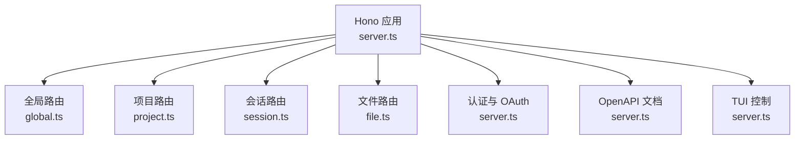
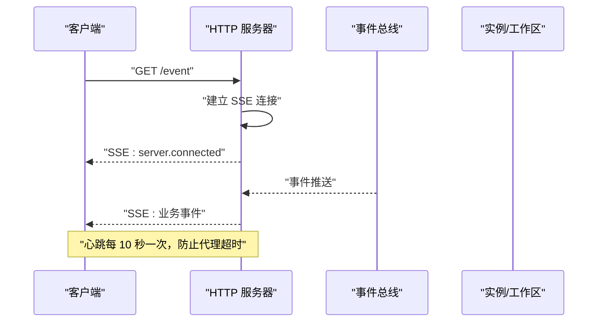
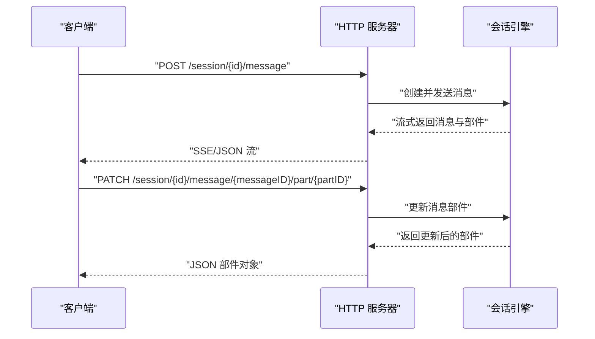
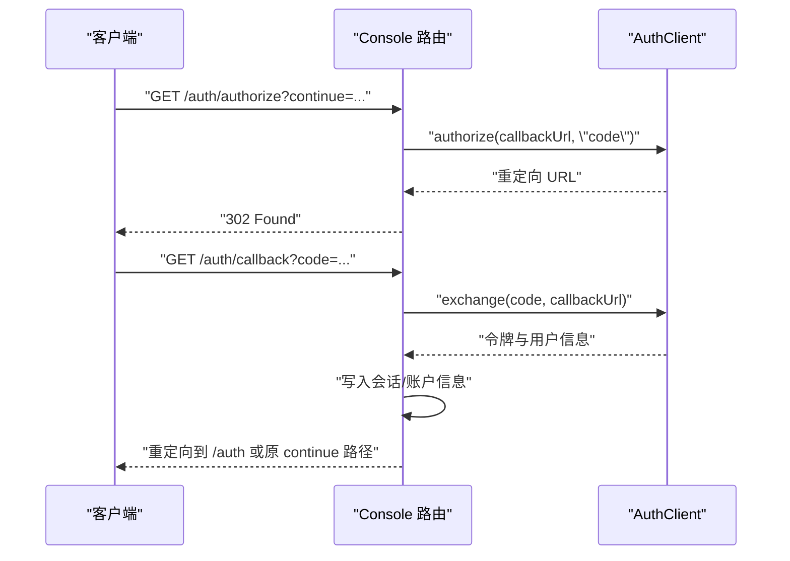
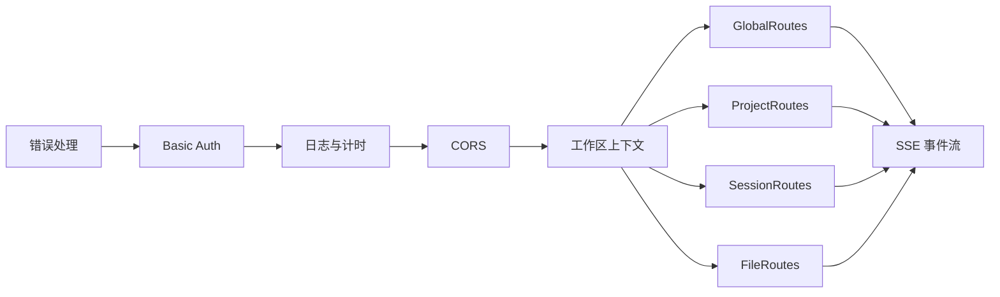

# HTTP API

<cite>
**本文引用的文件**
- [packages/opencode/src/server/server.ts](file://packages/opencode/src/server/server.ts)
- [packages/opencode/src/server/routes/global.ts](file://packages/opencode/src/server/routes/global.ts)
- [packages/opencode/src/server/routes/project.ts](file://packages/opencode/src/server/routes/project.ts)
- [packages/opencode/src/server/routes/session.ts](file://packages/opencode/src/server/routes/session.ts)
- [packages/opencode/src/server/routes/file.ts](file://packages/opencode/src/server/routes/file.ts)
- [packages/web/src/content/docs/server.mdx](file://packages/web/src/content/docs/server.mdx)
- [packages/web/src/content/docs/sdk.mdx](file://packages/web/src/content/docs/sdk.mdx)
- [packages/console/app/src/routes/auth/authorize.ts](file://packages/console/app/src/routes/auth/authorize.ts)
- [packages/console/app/src/routes/auth/[...callback].ts](file://packages/console/app/src/routes/auth/[...callback].ts)
- [packages/opencode/src/cli/cmd/providers.ts](file://packages/opencode/src/cli/cmd/providers.ts)
- [packages/opencode/src/cli/cmd/tui/component/dialog-provider.tsx](file://packages/opencode/src/cli/cmd/tui/component/dialog-provider.tsx)
- [packages/plugin/src/index.ts](file://packages/plugin/src/index.ts)
- [packages/web/src/content/docs/ar/mcp-servers.mdx](file://packages/web/src/content/docs/ar/mcp-servers.mdx)
- [packages/web/src/content/docs/ja/mcp-servers.mdx](file://packages/web/src/content/docs/ja/mcp-servers.mdx)
- [packages/web/src/content/docs/tr/mcp-servers.mdx](file://packages/web/src/content/docs/tr/mcp-servers.mdx)
- [packages/web/src/content/docs/zh-cn/server.mdx](file://packages/web/src/content/docs/zh-cn/server.mdx)
- [packages/web/src/content/docs/pl/server.mdx](file://packages/web/src/content/docs/pl/server.mdx)
- [packages/web/src/content/docs/fr/server.mdx](file://packages/web/src/content/docs/fr/server.mdx)
- [packages/web/src/content/docs/nb/server.mdx](file://packages/web/src/content/docs/nb/server.mdx)
- [packages/web/src/content/docs/da/config.mdx](file://packages/web/src/content/docs/da/config.mdx)
- [packages/web/src/content/docs/nb/config.mdx](file://packages/web/src/content/docs/nb/config.mdx)
- [packages/web/src/content/docs/th/mcp-servers.mdx](file://packages/web/src/content/docs/th/mcp-servers.mdx)
- [packages/web/src/content/docs/tr/mcp-servers.mdx](file://packages/web/src/content/docs/tr/mcp-servers.mdx)
- [packages/web/src/content/docs/zh-tw/server.mdx](file://packages/web/src/content/docs/zh-tw/server.mdx)
</cite>

## 目录
1. [简介](#简介)
2. [项目结构](#项目结构)
3. [核心组件](#核心组件)
4. [架构总览](#架构总览)
5. [详细组件分析](#详细组件分析)
6. [依赖关系分析](#依赖关系分析)
7. [性能考量](#性能考量)
8. [故障排查指南](#故障排查指南)
9. [结论](#结论)
10. [附录](#附录)

## 简介
本文件为 OpenCode HTTP API 的权威文档，覆盖所有 RESTful 端点的 URL 模式、HTTP 方法、请求与响应格式、认证机制、请求头要求、状态码含义、错误处理格式、速率限制与安全策略，并提供 curl 示例与 SDK 调用指引。OpenCode 提供一个基于 Hono 的 HTTP 服务器，暴露 OpenAPI 3.1 规范，支持会话管理、文件搜索、全局事件流、认证配置、TUI 控制等能力。

## 项目结构
OpenCode 的 HTTP API 主要由以下模块构成：
- 核心应用与路由注册：在服务启动时构建 Hono 应用并挂载各路由模块
- 全局路由：健康检查、全局事件流、全局配置读取与更新、全局实例释放
- 项目路由：项目列表、当前项目信息、Git 初始化、项目属性更新
- 会话路由：会话生命周期、消息分页与查询、消息与部件的增删改查、分享与摘要
- 文件路由：文本搜索、文件/目录查找、符号搜索、文件内容读取、文件状态
- 认证与 OAuth：设置/删除认证凭据、OAuth 授权与回调
- 文档与 SDK：OpenAPI 文档页面、SDK 客户端连接参数

图表来源
- [packages/opencode/src/server/server.ts:57-233](file://packages/opencode/src/server/server.ts#L57-L233)
- [packages/opencode/src/server/routes/global.ts:18-186](file://packages/opencode/src/server/routes/global.ts#L18-L186)
- [packages/opencode/src/server/routes/project.ts:12-119](file://packages/opencode/src/server/routes/project.ts#L12-L119)
- [packages/opencode/src/server/routes/session.ts:25-800](file://packages/opencode/src/server/routes/session.ts#L25-L800)
- [packages/opencode/src/server/routes/file.ts:10-198](file://packages/opencode/src/server/routes/file.ts#L10-L198)

章节来源
- [packages/opencode/src/server/server.ts:57-233](file://packages/opencode/src/server/server.ts#L57-L233)
- [packages/web/src/content/docs/server.mdx:84-288](file://packages/web/src/content/docs/server.mdx#L84-L288)

## 核心组件
- Hono 应用与中间件
  - 统一错误处理：NamedError 映射到 404/400/500；HTTPException 直接返回；未知错误统一为 500
  - Basic Auth：通过环境变量开启，用户名默认为固定值或可配置
  - CORS：白名单允许本地与特定域名访问
  - 请求日志与计时：对非 /log 路径记录请求与耗时
  - 工作区上下文：解析 workspace 与 directory 参数，注入工作区与实例上下文
- OpenAPI 文档：自动生成 OpenAPI 3.1 HTML 页面，便于生成客户端与调试

章节来源
- [packages/opencode/src/server/server.ts:60-129](file://packages/opencode/src/server/server.ts#L60-L129)
- [packages/opencode/src/server/server.ts:222-233](file://packages/opencode/src/server/server.ts#L222-L233)

## 架构总览
OpenCode 采用“TUI 与服务器分离”的架构，服务器暴露 HTTP API，客户端（TUI 或 SDK）通过 HTTP 与服务器交互。服务器还代理部分静态资源到前端站点以提供文档与 UI。

图表来源
- [packages/opencode/src/server/server.ts:500-556](file://packages/opencode/src/server/server.ts#L500-L556)

## 详细组件分析

### 全局接口（Global）
- 健康检查
  - 方法：GET
  - 路径：/global/health
  - 响应：布尔健康状态与版本号
- 全局事件流（SSE）
  - 方法：GET
  - 路径：/global/event
  - 响应：SSE 流，首包为连接事件，后续为系统级事件
- 全局配置
  - GET /global/config：获取全局配置
  - PATCH /global/config：更新全局配置
- 全局释放
  - POST /global/dispose：释放所有实例并广播释放事件

章节来源
- [packages/opencode/src/server/routes/global.ts:20-185](file://packages/opencode/src/server/routes/global.ts#L20-L185)
- [packages/web/src/content/docs/server.mdx:90-96](file://packages/web/src/content/docs/server.mdx#L90-L96)

### 项目接口（Project）
- 列出项目
  - 方法：GET
  - 路径：/project
  - 响应：项目数组
- 当前项目
  - 方法：GET
  - 路径：/project/current
  - 响应：当前项目信息
- 初始化 Git 仓库
  - 方法：POST
  - 路径：/project/git/init
  - 响应：刷新后的项目信息
- 更新项目
  - 方法：PATCH
  - 路径：/project/{projectID}
  - 请求体：项目属性（名称、图标、命令等）

章节来源
- [packages/opencode/src/server/routes/project.ts:14-118](file://packages/opencode/src/server/routes/project.ts#L14-L118)
- [packages/web/src/content/docs/server.mdx:99-105](file://packages/web/src/content/docs/server.mdx#L99-L105)

### 会话接口（Session）
- 列表与状态
  - GET /session：按条件筛选会话
  - GET /session/status：获取所有会话状态
- 详情与生命周期
  - GET /session/{id}：获取会话详情
  - DELETE /session/{id}：删除会话
  - PATCH /session/{id}：更新标题/归档时间
  - POST /session：创建会话
- 子会话与任务
  - GET /session/{id}/children：子会话列表
  - GET /session/{id}/todo：任务清单
- 初始化与摘要
  - POST /session/{id}/init：初始化分析并生成 AGENTS.md
  - POST /session/{id}/fork：从某消息点派生新会话
  - POST /session/{id}/abort：中止进行中的会话
  - POST /session/{id}/summarize：AI 压缩摘要
- 分享与取消分享
  - POST /session/{id}/share：生成分享链接
  - DELETE /session/{id}/share：取消分享
- 差异与消息
  - GET /session/{id}/diff：获取某消息导致的文件差异
  - GET /session/{id}/message：分页获取消息（支持游标）
  - GET /session/{id}/message/{messageID}：获取指定消息
  - POST /session/{id}/message：发送消息并流式返回结果
  - DELETE /session/{id}/message/{messageID}：删除消息
  - DELETE /session/{id}/message/{messageID}/part/{partID}：删除消息部件
  - PATCH /session/{id}/message/{messageID}/part/{partID}：更新消息部件
- 权限请求
  - POST /session/{id}/permissions/{permissionID}：对权限请求进行响应

图表来源
- [packages/opencode/src/server/routes/session.ts:781-800](file://packages/opencode/src/server/routes/session.ts#L781-L800)
- [packages/opencode/src/server/routes/session.ts:743-780](file://packages/opencode/src/server/routes/session.ts#L743-L780)

章节来源
- [packages/opencode/src/server/routes/session.ts:27-800](file://packages/opencode/src/server/routes/session.ts#L27-L800)
- [packages/web/src/content/docs/server.mdx:146-181](file://packages/web/src/content/docs/server.mdx#L146-L181)

### 文件接口（File）
- 文本搜索
  - 方法：GET
  - 路径：/find?pattern=<pat>
  - 响应：匹配项数组（路径、行号、偏移等）
- 文件/目录查找
  - 方法：GET
  - 路径：/find/file?query=<q>
  - 查询参数：type（file/directory）、directory（覆盖根目录）、limit（1–200）、dirs（兼容标志）
  - 响应：路径数组
- 符号搜索
  - 方法：GET
  - 路径：/find/symbol?query=<q>
  - 响应：符号数组（当前返回空）
- 列出与读取
  - GET /file?path=<path>：列出目录内容
  - GET /file/content?path=<path>：读取文件内容
- 文件状态
  - GET /file/status：获取 Git 状态

章节来源
- [packages/opencode/src/server/routes/file.ts:12-198](file://packages/opencode/src/server/routes/file.ts#L12-L198)
- [packages/web/src/content/docs/server.mdx:192-211](file://packages/web/src/content/docs/server.mdx#L192-L211)

### 认证与 OAuth
- 设置认证凭据
  - 方法：PUT
  - 路径：/auth/{providerID}
  - 请求体：符合提供商 schema 的凭据对象
  - 响应：布尔成功
- 删除认证凭据
  - 方法：DELETE
  - 路径：/auth/{providerID}
  - 响应：布尔成功
- OAuth 授权与回调
  - 授权入口：/provider/{id}/oauth/authorize
  - 回调入口：/provider/{id}/oauth/callback
  - CLI 与插件支持多种认证方式（API Key、OAuth），OAuth 支持动态客户端注册与令牌持久化

图表来源
- [packages/console/app/src/routes/auth/authorize.ts:4-10](file://packages/console/app/src/routes/auth/authorize.ts#L4-L10)
- [packages/console/app/src/routes/auth/[...callback].ts:8-46](file://packages/console/app/src/routes/auth/[...callback].ts#L8-L46)

章节来源
- [packages/opencode/src/server/server.ts:131-192](file://packages/opencode/src/server/server.ts#L131-L192)
- [packages/web/src/content/docs/server.mdx:267-272](file://packages/web/src/content/docs/server.mdx#L267-L272)
- [packages/console/app/src/routes/auth/authorize.ts:1-10](file://packages/console/app/src/routes/auth/authorize.ts#L1-L10)
- [packages/console/app/src/routes/auth/[...callback].ts:1-46](file://packages/console/app/src/routes/auth/[...callback].ts#L1-L46)
- [packages/opencode/src/cli/cmd/providers.ts:204-242](file://packages/opencode/src/cli/cmd/providers.ts#L204-L242)
- [packages/opencode/src/cli/cmd/tui/component/dialog-provider.tsx:44-75](file://packages/opencode/src/cli/cmd/tui/component/dialog-provider.tsx#L44-L75)
- [packages/plugin/src/index.ts:53-99](file://packages/plugin/src/index.ts#L53-L99)

### 事件与文档
- 服务器事件流（SSE）
  - 方法：GET
  - 路径：/event
  - 响应：SSE 流，首包为连接事件，随后为总线事件
- OpenAPI 文档
  - 方法：GET
  - 路径：/doc
  - 响应：HTML 页面，内嵌 OpenAPI 3.1 规范

章节来源
- [packages/opencode/src/server/server.ts:500-556](file://packages/opencode/src/server/server.ts#L500-L556)
- [packages/opencode/src/server/server.ts:222-233](file://packages/opencode/src/server/server.ts#L222-L233)
- [packages/web/src/content/docs/server.mdx:275-288](file://packages/web/src/content/docs/server.mdx#L275-L288)

### TUI 控制（实验性）
- 用于驱动 TUI 的控制接口（如打开对话框、提交提示、执行命令等）
- 该接口由 SDK 与 IDE 插件使用

章节来源
- [packages/web/src/content/docs/server.mdx:249-264](file://packages/web/src/content/docs/server.mdx#L249-L264)

## 依赖关系分析
- 中间件链路
  - 错误处理 → Basic Auth（可选）→ 日志与计时 → CORS → 工作区上下文注入 → 各路由模块
- 路由模块
  - GlobalRoutes、ProjectRoutes、SessionRoutes、FileRoutes 等均通过 lazy 惰性加载，减少启动开销
- 事件系统
  - /event 与 /global/event 使用 SSE，向客户端推送 Bus 事件，包含心跳保活

图表来源
- [packages/opencode/src/server/server.ts:60-129](file://packages/opencode/src/server/server.ts#L60-L129)
- [packages/opencode/src/server/server.ts:130-253](file://packages/opencode/src/server/server.ts#L130-L253)

章节来源
- [packages/opencode/src/server/server.ts:57-253](file://packages/opencode/src/server/server.ts#L57-L253)

## 性能考量
- SSE 心跳：为避免代理层超时，服务端每 10 秒发送一次心跳事件
- 游标分页：消息列表支持游标分页，返回 Link 与 X-Next-Cursor 头，便于客户端增量拉取
- 实例惰性加载：路由模块使用 lazy，仅在首次访问时初始化
- 日志与计时：对非 /log 路径记录请求与耗时，便于性能观测

章节来源
- [packages/opencode/src/server/server.ts:536-554](file://packages/opencode/src/server/server.ts#L536-L554)
- [packages/opencode/src/server/routes/session.ts:617-631](file://packages/opencode/src/server/routes/session.ts#L617-L631)
- [packages/opencode/src/server/server.ts:55-55](file://packages/opencode/src/server/server.ts#L55-L55)

## 故障排查指南
- 常见错误映射
  - NamedError.NotFoundError → 404
  - Provider.ModelNotFoundError → 400
  - Worktree* 相关错误 → 400
  - 其他 NamedError → 500
  - HTTPException → 直接返回异常响应
  - 未知错误 → 500（包含堆栈信息）
- 认证问题
  - 若启用 Basic Auth，需正确设置用户名与密码
  - OAuth 回调失败时，检查回调地址与授权码是否有效
- CORS 问题
  - 仅允许本地与特定域名访问，确保前端来源在白名单内
- 事件流断连
  - 检查代理层是否支持长连接与 SSE；服务端已发送心跳，仍可能被代理中断

章节来源
- [packages/opencode/src/server/server.ts:60-77](file://packages/opencode/src/server/server.ts#L60-L77)
- [packages/console/app/src/routes/auth/[...callback].ts:37-45](file://packages/console/app/src/routes/auth/[...callback].ts#L37-L45)

## 结论
OpenCode 的 HTTP API 以 Hono 构建，具备完善的 OpenAPI 文档、SSE 事件流、会话与文件管理能力，并提供灵活的认证与 OAuth 支持。通过中间件链路实现了统一的安全与可观测性策略。建议在生产环境中启用 Basic Auth、合理配置 CORS，并结合 SDK 与 curl 进行集成测试。

## 附录

### 认证机制与请求头
- Basic Auth（可选）
  - 环境变量：OPENCODE_SERVER_USERNAME、OPENCODE_SERVER_PASSWORD
  - 默认用户名：固定值（可配置）
- OAuth（远程 MCP 服务器）
  - 支持自动 OAuth 流程，包括动态客户端注册与令牌持久化
  - 可禁用 OAuth（针对 API Key 场景）
- 请求头
  - x-opencode-workspace：指定工作区 ID
  - x-opencode-directory：指定工作目录（可 URL 编码）
  - Accept：application/json
  - Content-Type：application/json（除静态资源外）

章节来源
- [packages/opencode/src/server/server.ts:82-86](file://packages/opencode/src/server/server.ts#L82-L86)
- [packages/opencode/src/server/server.ts:194-219](file://packages/opencode/src/server/server.ts#L194-L219)
- [packages/web/src/content/docs/da/config.mdx:185-202](file://packages/web/src/content/docs/da/config.mdx#L185-L202)
- [packages/web/src/content/docs/nb/config.mdx:183-204](file://packages/web/src/content/docs/nb/config.mdx#L183-L204)
- [packages/web/src/content/docs/ar/mcp-servers.mdx:258-287](file://packages/web/src/content/docs/ar/mcp-servers.mdx#L258-L287)
- [packages/web/src/content/docs/ja/mcp-servers.mdx:160-191](file://packages/web/src/content/docs/ja/mcp-servers.mdx#L160-L191)
- [packages/web/src/content/docs/tr/mcp-servers.mdx:258-287](file://packages/web/src/content/docs/tr/mcp-servers.mdx#L258-L287)
- [packages/web/src/content/docs/th/mcp-servers.mdx:242-271](file://packages/web/src/content/docs/th/mcp-servers.mdx#L242-L271)

### API 版本控制与 OpenAPI
- OpenAPI 版本：3.1.1
- 文档端点：/doc（HTML 页面）
- 版本号：服务端在健康检查中返回

章节来源
- [packages/opencode/src/server/server.ts:222-233](file://packages/opencode/src/server/server.ts#L222-L233)
- [packages/opencode/src/server/routes/global.ts:37-40](file://packages/opencode/src/server/routes/global.ts#L37-L40)

### 速率限制与安全
- 未内置速率限制中间件
- 建议在网关或反向代理层配置限流与防护
- 生产环境务必启用 Basic Auth 并限制 CORS 白名单

章节来源
- [packages/opencode/src/server/server.ts:82-86](file://packages/opencode/src/server/server.ts#L82-L86)
- [packages/opencode/src/server/server.ts:105-129](file://packages/opencode/src/server/server.ts#L105-L129)

### curl 示例与 SDK 调用
- 获取健康与版本
  - curl -s http://localhost:4096/global/health
- 订阅事件流
  - curl -N http://localhost:4096/event
- 设置认证凭据（示例）
  - curl -X PUT -H "Content-Type: application/json" -d '{...}' http://localhost:4096/auth/{providerID}
- 发送消息（会话）
  - curl -X POST -H "Content-Type: application/json" -d '{...}' http://localhost:4096/session/{id}/message
- SDK 客户端
  - 创建客户端并连接已有服务端
  - 通过 baseUrl 指定服务器地址

章节来源
- [packages/web/src/content/docs/server.mdx:283-288](file://packages/web/src/content/docs/server.mdx#L283-L288)
- [packages/web/src/content/docs/sdk.mdx:74-87](file://packages/web/src/content/docs/sdk.mdx#L74-L87)

### 常见使用场景与最佳实践
- 会话管理
  - 使用 /session 列表与筛选，结合 /session/{id}/message 分页获取历史
  - 对于长对话，使用 /session/{id}/summarize 生成压缩摘要
- 文件检索
  - 使用 /find 与 /find/file 快速定位代码与文件
  - 使用 /file/status 获取变更状态
- 事件驱动
  - 通过 /event 订阅实时事件，结合心跳维持连接
- 认证与 OAuth
  - 优先使用 OAuth（若可用），自动处理令牌存储
  - 对于 API Key 场景，禁用 OAuth 并通过 headers 注入

章节来源
- [packages/opencode/src/server/routes/session.ts:27-800](file://packages/opencode/src/server/routes/session.ts#L27-L800)
- [packages/opencode/src/server/routes/file.ts:12-198](file://packages/opencode/src/server/routes/file.ts#L12-L198)
- [packages/opencode/src/server/server.ts:500-556](file://packages/opencode/src/server/server.ts#L500-L556)
- [packages/web/src/content/docs/ar/mcp-servers.mdx:258-287](file://packages/web/src/content/docs/ar/mcp-servers.mdx#L258-L287)
- [packages/web/src/content/docs/ja/mcp-servers.mdx:160-191](file://packages/web/src/content/docs/ja/mcp-servers.mdx#L160-L191)
- [packages/web/src/content/docs/tr/mcp-servers.mdx:258-287](file://packages/web/src/content/docs/tr/mcp-servers.mdx#L258-L287)
- [packages/web/src/content/docs/th/mcp-servers.mdx:242-271](file://packages/web/src/content/docs/th/mcp-servers.mdx#L242-L271)