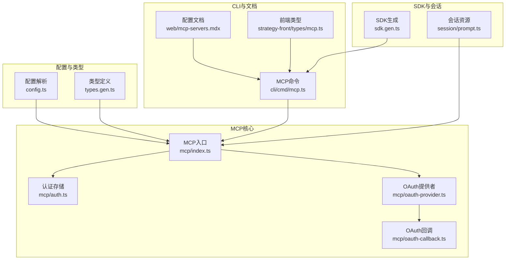
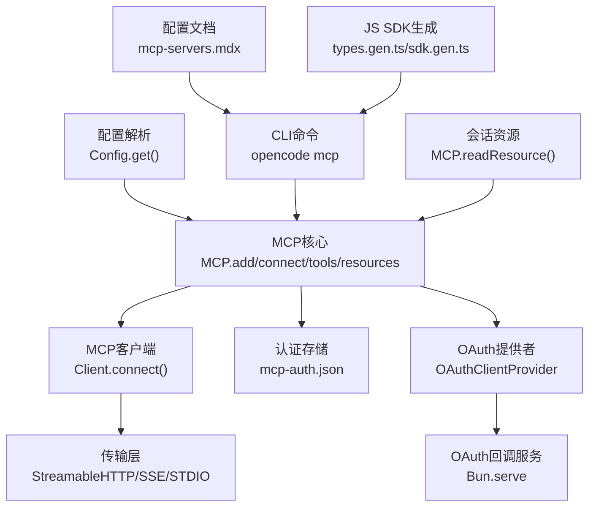
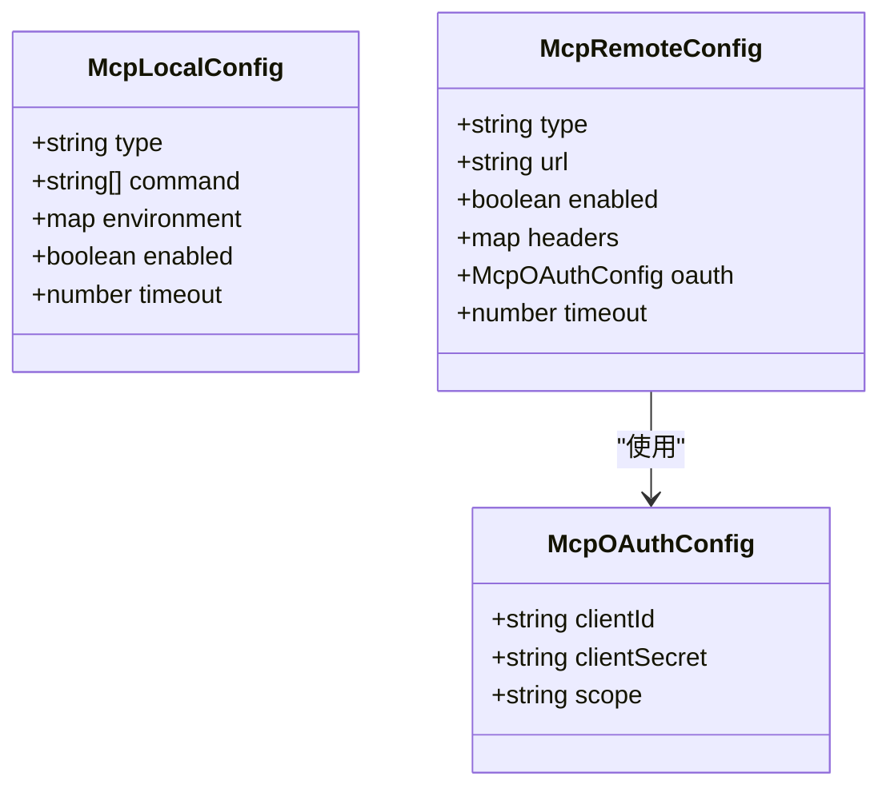
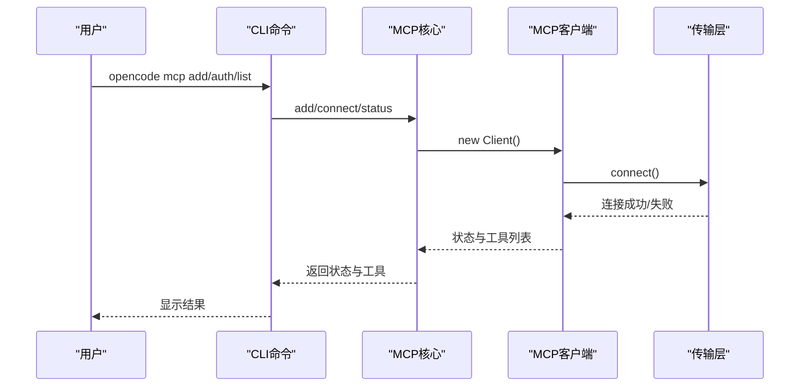
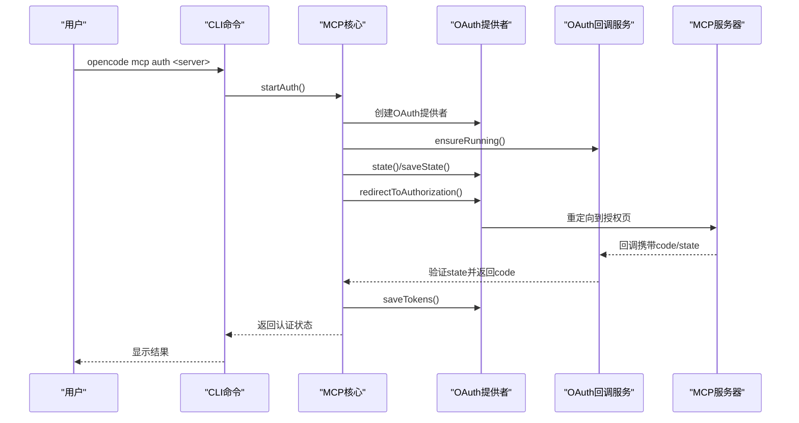
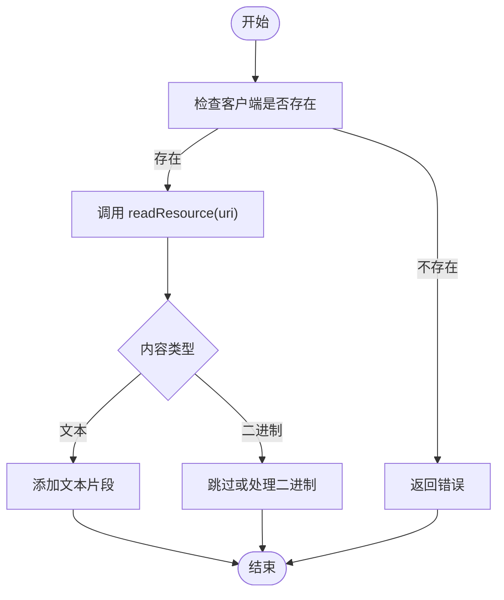
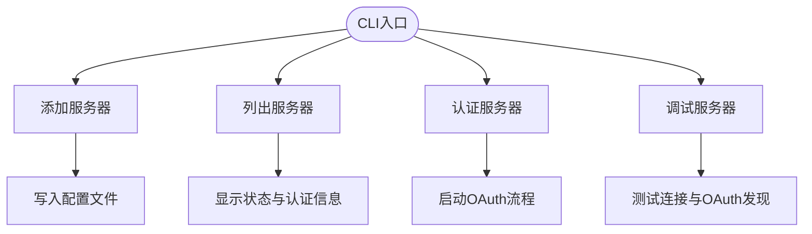
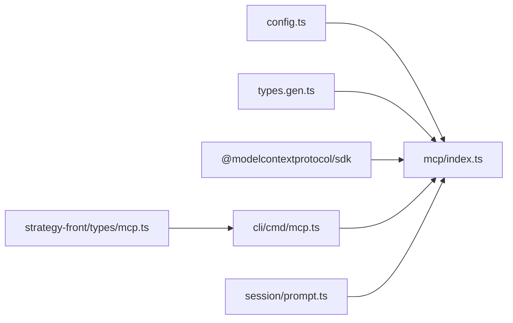

# MCP协议

<cite>
**本文档引用的文件**
- [packages/opencode/src/mcp/index.ts](file://packages/opencode/src/mcp/index.ts)
- [packages/opencode/src/mcp/auth.ts](file://packages/opencode/src/mcp/auth.ts)
- [packages/opencode/src/mcp/oauth-provider.ts](file://packages/opencode/src/mcp/oauth-provider.ts)
- [packages/opencode/src/mcp/oauth-callback.ts](file://packages/opencode/src/mcp/oauth-callback.ts)
- [packages/opencode/src/config/config.ts](file://packages/opencode/src/config/config.ts)
- [packages/opencode/src/cli/cmd/mcp.ts](file://packages/opencode/src/cli/cmd/mcp.ts)
- [packages/opencode/src/session/prompt.ts](file://packages/opencode/src/session/prompt.ts)
- [packages/web/src/content/docs/zh-cn/mcp-servers.mdx](file://packages/web/src/content/docs/zh-cn/mcp-servers.mdx)
- [packages/strategy-front/src/types/mcp.ts](file://packages/strategy-front/src/types/mcp.ts)
- [packages/sdk/js/src/v2/gen/types.gen.ts](file://packages/sdk/js/src/v2/gen/types.gen.ts)
- [packages/sdk/js/src/v2/gen/sdk.gen.ts](file://packages/sdk/js/src/v2/gen/sdk.gen.ts)
- [packages/strategy-service/internal/web/mcp_api.go](file://packages/strategy-service/internal/web/mcp_api.go)
- [packages/strategy-service/internal/web/mcp_api_test.go](file://packages/strategy-service/internal/web/mcp_api_test.go)
- [packages/opencode/test/mcp/headers.test.ts](file://packages/opencode/test/mcp/headers.test.ts)
- [packages/opencode/test/mcp/oauth-auto-connect.test.ts](file://packages/opencode/test/mcp/oauth-auto-connect.test.ts)
</cite>

## 目录
1. [简介](#简介)
2. [项目结构](#项目结构)
3. [核心组件](#核心组件)
4. [架构总览](#架构总览)
5. [详细组件分析](#详细组件分析)
6. [依赖关系分析](#依赖关系分析)
7. [性能考虑](#性能考虑)
8. [故障排除指南](#故障排除指南)
9. [结论](#结论)
10. [附录](#附录)

## 简介
本文件系统性阐述 OpenCode 的 MCP（Model Context Protocol）协议实现，涵盖服务器配置、协议规范与消息格式、工具发现与执行、上下文管理机制、客户端集成与连接协商、OAuth 认证流程、以及与 OpenCode 代理系统的集成方式与最佳实践。文档基于仓库中的实际实现进行分析，提供架构图、序列图与流程图，帮助开发者快速理解并正确使用 MCP。

## 项目结构
OpenCode 的 MCP 实现主要分布在以下模块：
- 配置与类型定义：负责解析与校验 MCP 配置，定义本地与远程服务器类型、OAuth 配置等
- MCP 核心逻辑：负责连接管理、工具发现、资源读取、通知处理与状态维护
- OAuth 支持：提供 OAuth 客户端能力、回调服务与令牌持久化
- CLI 管理：提供命令行工具用于添加、列出、认证、调试 MCP 服务器
- 文档与前端类型：提供配置文档与前端类型定义
- SDK 生成：生成 JS SDK 的类型与接口定义
- 会话与资源：在对话中读取 MCP 资源内容

**图表来源**
- [packages/opencode/src/config/config.ts:563-624](file://packages/opencode/src/config/config.ts#L563-L624)
- [packages/opencode/src/mcp/index.ts:1-120](file://packages/opencode/src/mcp/index.ts#L1-L120)
- [packages/opencode/src/mcp/auth.ts:1-131](file://packages/opencode/src/mcp/auth.ts#L1-L131)
- [packages/opencode/src/mcp/oauth-provider.ts:1-186](file://packages/opencode/src/mcp/oauth-provider.ts#L1-L186)
- [packages/opencode/src/mcp/oauth-callback.ts:1-193](file://packages/opencode/src/mcp/oauth-callback.ts#L1-L193)
- [packages/opencode/src/cli/cmd/mcp.ts:1-120](file://packages/opencode/src/cli/cmd/mcp.ts#L1-L120)
- [packages/web/src/content/docs/zh-cn/mcp-servers.mdx:1-120](file://packages/web/src/content/docs/zh-cn/mcp-servers.mdx#L1-L120)
- [packages/strategy-front/src/types/mcp.ts:1-71](file://packages/strategy-front/src/types/mcp.ts#L1-L71)
- [packages/sdk/js/src/v2/gen/sdk.gen.ts:3014-3091](file://packages/sdk/js/src/v2/gen/sdk.gen.ts#L3014-L3091)
- [packages/sdk/js/src/v2/gen/types.gen.ts:1236-1303](file://packages/sdk/js/src/v2/gen/types.gen.ts#L1236-L1303)
- [packages/opencode/src/session/prompt.ts:1001-1035](file://packages/opencode/src/session/prompt.ts#L1001-L1035)

**章节来源**
- [packages/opencode/src/config/config.ts:563-624](file://packages/opencode/src/config/config.ts#L563-L624)
- [packages/opencode/src/mcp/index.ts:1-120](file://packages/opencode/src/mcp/index.ts#L1-L120)
- [packages/opencode/src/mcp/auth.ts:1-131](file://packages/opencode/src/mcp/auth.ts#L1-L131)
- [packages/opencode/src/mcp/oauth-provider.ts:1-186](file://packages/opencode/src/mcp/oauth-provider.ts#L1-L186)
- [packages/opencode/src/mcp/oauth-callback.ts:1-193](file://packages/opencode/src/mcp/oauth-callback.ts#L1-L193)
- [packages/opencode/src/cli/cmd/mcp.ts:1-120](file://packages/opencode/src/cli/cmd/mcp.ts#L1-L120)
- [packages/web/src/content/docs/zh-cn/mcp-servers.mdx:1-120](file://packages/web/src/content/docs/zh-cn/mcp-servers.mdx#L1-L120)
- [packages/strategy-front/src/types/mcp.ts:1-71](file://packages/strategy-front/src/types/mcp.ts#L1-L71)
- [packages/sdk/js/src/v2/gen/sdk.gen.ts:3014-3091](file://packages/sdk/js/src/v2/gen/sdk.gen.ts#L3014-L3091)
- [packages/sdk/js/src/v2/gen/types.gen.ts:1236-1303](file://packages/sdk/js/src/v2/gen/types.gen.ts#L1236-L1303)
- [packages/opencode/src/session/prompt.ts:1001-1035](file://packages/opencode/src/session/prompt.ts#L1001-L1035)

## 核心组件
- 配置与类型系统：定义本地与远程 MCP 服务器配置、OAuth 配置、超时等字段，并提供严格的类型校验
- MCP 客户端管理：负责连接建立、工具列表发现、资源读取、通知监听与状态维护
- OAuth 认证链路：提供 OAuth 客户端元数据、令牌存储、动态客户端注册、回调服务与状态参数管理
- CLI 管理工具：提供添加、列出、认证、登出、调试 MCP 服务器的命令行接口
- 会话与资源：在对话中读取 MCP 资源内容，支持文本与二进制内容处理

**章节来源**
- [packages/opencode/src/config/config.ts:563-624](file://packages/opencode/src/config/config.ts#L563-L624)
- [packages/opencode/src/mcp/index.ts:119-148](file://packages/opencode/src/mcp/index.ts#L119-L148)
- [packages/opencode/src/mcp/auth.ts:1-131](file://packages/opencode/src/mcp/auth.ts#L1-L131)
- [packages/opencode/src/mcp/oauth-provider.ts:26-186](file://packages/opencode/src/mcp/oauth-provider.ts#L26-L186)
- [packages/opencode/src/mcp/oauth-callback.ts:54-193](file://packages/opencode/src/mcp/oauth-callback.ts#L54-L193)
- [packages/opencode/src/cli/cmd/mcp.ts:138-279](file://packages/opencode/src/cli/cmd/mcp.ts#L138-L279)
- [packages/opencode/src/session/prompt.ts:1001-1035](file://packages/opencode/src/session/prompt.ts#L1001-L1035)

## 架构总览
MCP 在 OpenCode 中的架构围绕“配置驱动 + SDK 客户端 + OAuth 认证 + CLI 管理”的模式构建。配置层负责解析与校验 MCP 服务器配置；MCP 核心负责与服务器建立连接、发现工具与资源、处理通知；OAuth 提供者与回调服务负责认证流程；CLI 提供运维与调试能力；会话层在对话中消费 MCP 资源。

**图表来源**
- [packages/opencode/src/config/config.ts:78-266](file://packages/opencode/src/config/config.ts#L78-L266)
- [packages/opencode/src/mcp/index.ts:328-537](file://packages/opencode/src/mcp/index.ts#L328-L537)
- [packages/opencode/src/mcp/oauth-provider.ts:26-186](file://packages/opencode/src/mcp/oauth-provider.ts#L26-L186)
- [packages/opencode/src/mcp/oauth-callback.ts:60-138](file://packages/opencode/src/mcp/oauth-callback.ts#L60-L138)
- [packages/opencode/src/cli/cmd/mcp.ts:53-65](file://packages/opencode/src/cli/cmd/mcp.ts#L53-L65)
- [packages/web/src/content/docs/zh-cn/mcp-servers.mdx:1-120](file://packages/web/src/content/docs/zh-cn/mcp-servers.mdx#L1-L120)
- [packages/sdk/js/src/v2/gen/types.gen.ts:1236-1303](file://packages/sdk/js/src/v2/gen/types.gen.ts#L1236-L1303)
- [packages/sdk/js/src/v2/gen/sdk.gen.ts:3014-3091](file://packages/sdk/js/src/v2/gen/sdk.gen.ts#L3014-L3091)
- [packages/opencode/src/session/prompt.ts:1001-1035](file://packages/opencode/src/session/prompt.ts#L1001-L1035)

## 详细组件分析

### 配置与类型系统
- 本地服务器配置：包含 type、command、environment、enabled、timeout 等字段，提供严格的类型校验与默认值约束
- 远程服务器配置：包含 type、url、enabled、headers、oauth、timeout 等字段，支持 OAuth 自动发现与预注册
- OAuth 配置：支持 clientId、clientSecret、scope，以及显式禁用 OAuth 的场景
- 类型定义：在 SDK 生成文件中提供 McpLocalConfig、McpRemoteConfig、McpOAuthConfig 等类型

**图表来源**
- [packages/sdk/js/src/v2/gen/types.gen.ts:1236-1303](file://packages/sdk/js/src/v2/gen/types.gen.ts#L1236-L1303)
- [packages/opencode/src/config/config.ts:563-624](file://packages/opencode/src/config/config.ts#L563-L624)

**章节来源**
- [packages/opencode/src/config/config.ts:563-624](file://packages/opencode/src/config/config.ts#L563-L624)
- [packages/sdk/js/src/v2/gen/types.gen.ts:1236-1303](file://packages/sdk/js/src/v2/gen/types.gen.ts#L1236-L1303)

### MCP 客户端管理与工具发现
- 连接建立：支持远程服务器的 StreamableHTTP 与 SSE 两种传输，以及本地服务器的 STDIO 传输
- 工具发现：通过 listTools 获取工具列表，转换为 AI SDK Tool 类型，支持超时控制
- 资源与提示：支持 listResources 与 getPrompt，用于资源读取与提示获取
- 状态管理：维护连接状态（connected/disabled/failed/needs_auth/needs_client_registration）

**图表来源**
- [packages/opencode/src/cli/cmd/mcp.ts:138-279](file://packages/opencode/src/cli/cmd/mcp.ts#L138-L279)
- [packages/opencode/src/mcp/index.ts:328-537](file://packages/opencode/src/mcp/index.ts#L328-L537)

**章节来源**
- [packages/opencode/src/mcp/index.ts:119-148](file://packages/opencode/src/mcp/index.ts#L119-L148)
- [packages/opencode/src/mcp/index.ts:609-649](file://packages/opencode/src/mcp/index.ts#L609-L649)
- [packages/opencode/src/mcp/index.ts:672-691](file://packages/opencode/src/mcp/index.ts#L672-L691)

### OAuth 认证与回调
- OAuth 提供者：实现 OAuthClientProvider 接口，支持客户端信息获取/保存、令牌获取/保存、状态参数管理、授权跳转
- 回调服务：在本地端口启动回调服务，接收授权码并验证 state 参数，支持超时与错误处理
- 认证存储：使用 mcp-auth.json 存储令牌、客户端信息、code_verifier、oauth_state，支持过期检查

**图表来源**
- [packages/opencode/src/mcp/index.ts:752-800](file://packages/opencode/src/mcp/index.ts#L752-L800)
- [packages/opencode/src/mcp/oauth-provider.ts:26-186](file://packages/opencode/src/mcp/oauth-provider.ts#L26-L186)
- [packages/opencode/src/mcp/oauth-callback.ts:60-151](file://packages/opencode/src/mcp/oauth-callback.ts#L60-L151)
- [packages/opencode/src/mcp/auth.ts:34-130](file://packages/opencode/src/mcp/auth.ts#L34-L130)

**章节来源**
- [packages/opencode/src/mcp/oauth-provider.ts:26-186](file://packages/opencode/src/mcp/oauth-provider.ts#L26-L186)
- [packages/opencode/src/mcp/oauth-callback.ts:54-193](file://packages/opencode/src/mcp/oauth-callback.ts#L54-L193)
- [packages/opencode/src/mcp/auth.ts:34-130](file://packages/opencode/src/mcp/auth.ts#L34-L130)

### 会话中的资源读取
- 在会话中通过 MCP.readResource 读取资源内容，支持文本与二进制内容处理
- 将资源内容注入到消息片段中，便于模型消费

**图表来源**
- [packages/opencode/src/session/prompt.ts:1001-1035](file://packages/opencode/src/session/prompt.ts#L1001-L1035)
- [packages/opencode/src/mcp/index.ts:721-746](file://packages/opencode/src/mcp/index.ts#L721-L746)

**章节来源**
- [packages/opencode/src/session/prompt.ts:1001-1035](file://packages/opencode/src/session/prompt.ts#L1001-L1035)
- [packages/opencode/src/mcp/index.ts:721-746](file://packages/opencode/src/mcp/index.ts#L721-L746)

### CLI 管理与调试
- 添加服务器：支持本地与远程服务器，自动写入配置文件
- 列表与状态：展示服务器状态与认证状态
- 认证：触发 OAuth 流程，支持浏览器自动打开与手动 URL 打开
- 调试：测试连接、OAuth 发现、状态检查

**图表来源**
- [packages/opencode/src/cli/cmd/mcp.ts:418-580](file://packages/opencode/src/cli/cmd/mcp.ts#L418-L580)
- [packages/opencode/src/cli/cmd/mcp.ts:67-136](file://packages/opencode/src/cli/cmd/mcp.ts#L67-L136)
- [packages/opencode/src/cli/cmd/mcp.ts:138-279](file://packages/opencode/src/cli/cmd/mcp.ts#L138-L279)
- [packages/opencode/src/cli/cmd/mcp.ts:582-755](file://packages/opencode/src/cli/cmd/mcp.ts#L582-L755)

**章节来源**
- [packages/opencode/src/cli/cmd/mcp.ts:418-580](file://packages/opencode/src/cli/cmd/mcp.ts#L418-L580)
- [packages/opencode/src/cli/cmd/mcp.ts:67-136](file://packages/opencode/src/cli/cmd/mcp.ts#L67-L136)
- [packages/opencode/src/cli/cmd/mcp.ts:138-279](file://packages/opencode/src/cli/cmd/mcp.ts#L138-L279)
- [packages/opencode/src/cli/cmd/mcp.ts:582-755](file://packages/opencode/src/cli/cmd/mcp.ts#L582-L755)

## 依赖关系分析
- 配置依赖：MCP 核心依赖配置解析模块提供的 McpLocal/McpRemote 类型与校验
- SDK 依赖：MCP 核心依赖 @modelcontextprotocol/sdk 的 Client、Transport 与认证模块
- CLI 依赖：CLI 命令依赖 MCP 核心与配置模块
- 前端类型：前端组件依赖 McpCfg、McpStatus 等类型定义
- 会话依赖：会话模块依赖 MCP 核心的资源读取能力

**图表来源**
- [packages/opencode/src/config/config.ts:563-624](file://packages/opencode/src/config/config.ts#L563-L624)
- [packages/opencode/src/mcp/index.ts:1-26](file://packages/opencode/src/mcp/index.ts#L1-L26)
- [packages/sdk/js/src/v2/gen/types.gen.ts:1236-1303](file://packages/sdk/js/src/v2/gen/types.gen.ts#L1236-L1303)
- [packages/opencode/src/cli/cmd/mcp.ts:1-17](file://packages/opencode/src/cli/cmd/mcp.ts#L1-L17)
- [packages/strategy-front/src/types/mcp.ts:1-71](file://packages/strategy-front/src/types/mcp.ts#L1-L71)
- [packages/opencode/src/session/prompt.ts:1001-1035](file://packages/opencode/src/session/prompt.ts#L1001-L1035)

**章节来源**
- [packages/opencode/src/config/config.ts:563-624](file://packages/opencode/src/config/config.ts#L563-L624)
- [packages/opencode/src/mcp/index.ts:1-26](file://packages/opencode/src/mcp/index.ts#L1-L26)
- [packages/sdk/js/src/v2/gen/types.gen.ts:1236-1303](file://packages/sdk/js/src/v2/gen/types.gen.ts#L1236-L1303)
- [packages/opencode/src/cli/cmd/mcp.ts:1-17](file://packages/opencode/src/cli/cmd/mcp.ts#L1-L17)
- [packages/strategy-front/src/types/mcp.ts:1-71](file://packages/strategy-front/src/types/mcp.ts#L1-L71)
- [packages/opencode/src/session/prompt.ts:1001-1035](file://packages/opencode/src/session/prompt.ts#L1001-L1035)

## 性能考虑
- 连接超时：默认超时时间为 30 秒，可通过配置覆盖；远程服务器默认超时为 5000ms
- 工具发现：工具列表获取与转换为 AI SDK Tool 的过程涉及网络与类型转换，建议合理设置超时
- 传输选择：StreamableHTTP 与 SSE 传输在连接失败时会回退到下一个传输，提高可用性
- 资源读取：资源内容可能较大，建议在会话中按需读取并缓存必要内容

[本节为通用指导，不直接分析具体文件]

## 故障排除指南
- 连接失败：检查服务器 URL、网络连通性、超时设置与传输类型
- OAuth 失败：确认服务器是否支持动态客户端注册、客户端凭据是否正确、回调端口是否被占用
- 认证状态异常：使用调试命令检查状态、令牌与客户端信息，必要时重新认证或登出
- 资源读取失败：确认资源 URI 是否正确、客户端是否存在、内容类型是否受支持

**章节来源**
- [packages/opencode/src/mcp/index.ts:382-448](file://packages/opencode/src/mcp/index.ts#L382-L448)
- [packages/opencode/src/mcp/oauth-callback.ts:140-151](file://packages/opencode/src/mcp/oauth-callback.ts#L140-L151)
- [packages/opencode/src/cli/cmd/mcp.ts:582-755](file://packages/opencode/src/cli/cmd/mcp.ts#L582-L755)
- [packages/opencode/test/mcp/headers.test.ts:50-99](file://packages/opencode/test/mcp/headers.test.ts#L50-L99)
- [packages/opencode/test/mcp/oauth-auto-connect.test.ts:104-140](file://packages/opencode/test/mcp/oauth-auto-connect.test.ts#L104-L140)

## 结论
OpenCode 的 MCP 实现通过配置驱动、SDK 客户端、OAuth 认证与 CLI 管理的协同，提供了完整的工具发现、执行与上下文管理能力。其设计强调安全性（OAuth 动态注册与令牌存储）、可维护性（严格的类型校验与状态管理）与易用性（CLI 与文档支持）。结合本文档的架构图、序列图与流程图，开发者可以快速理解并正确集成 MCP 服务器，提升 OpenCode 代理系统的功能扩展性与稳定性。

[本节为总结性内容，不直接分析具体文件]

## 附录

### MCP 服务器配置示例
- 本地服务器：通过 command 启动本地 MCP 服务器，支持环境变量与超时设置
- 远程服务器：通过 url 连接远程 MCP 服务器，支持 headers 与 OAuth 配置
- OAuth：支持自动发现与预注册，可显式禁用 OAuth

**章节来源**
- [packages/web/src/content/docs/zh-cn/mcp-servers.mdx:70-163](file://packages/web/src/content/docs/zh-cn/mcp-servers.mdx#L70-L163)
- [packages/opencode/src/config/config.ts:563-624](file://packages/opencode/src/config/config.ts#L563-L624)

### MCP 服务器部署与监控
- 部署：确保服务器支持 MCP 协议版本，正确配置 CORS 与认证
- 监控：关注连接状态、工具数量、资源访问频率与错误率，定期清理过期令牌

[本节为通用指导，不直接分析具体文件]

### 与 OpenCode 代理系统的集成最佳实践
- 合理配置 enabled 与 timeout，避免过多工具导致上下文膨胀
- 使用 CLI 管理服务器生命周期，定期检查认证状态
- 在会话中按需读取资源，避免不必要的网络开销

**章节来源**
- [packages/web/src/content/docs/zh-cn/mcp-servers.mdx:1-120](file://packages/web/src/content/docs/zh-cn/mcp-servers.mdx#L1-L120)
- [packages/opencode/src/cli/cmd/mcp.ts:67-136](file://packages/opencode/src/cli/cmd/mcp.ts#L67-L136)