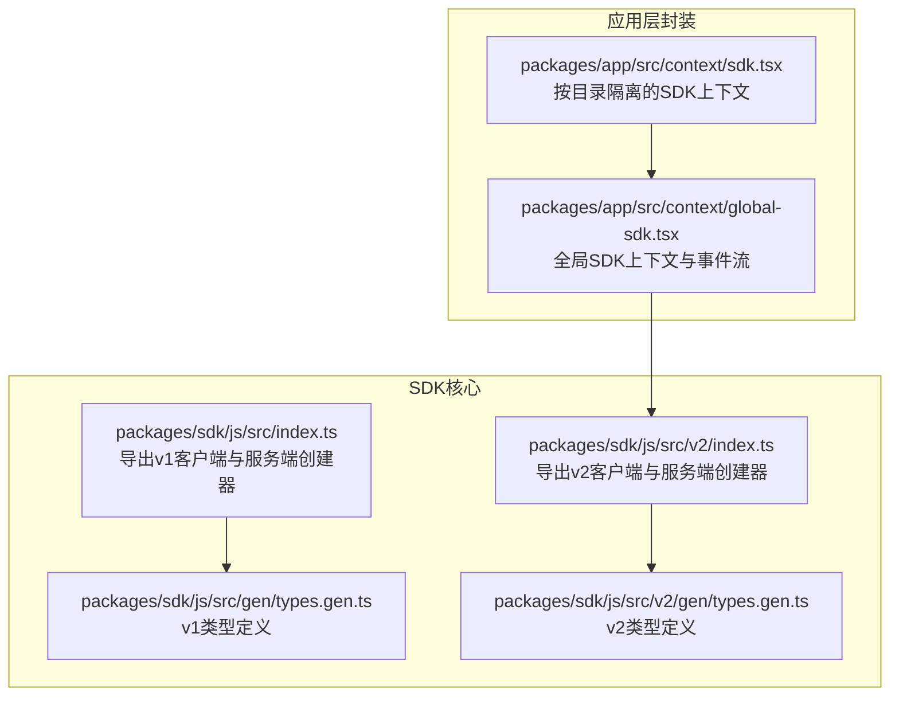
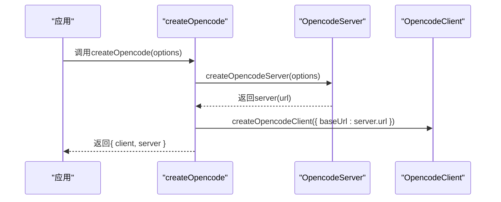
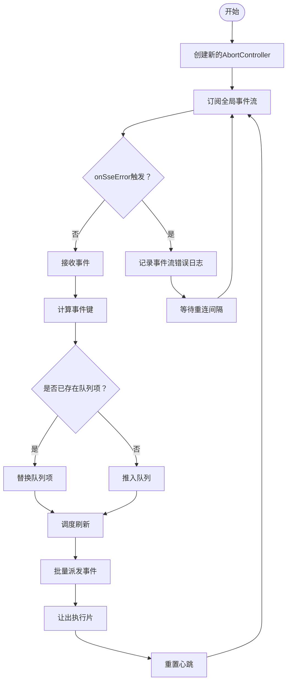
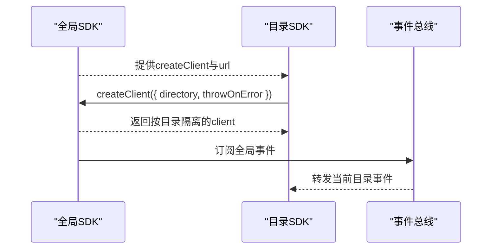
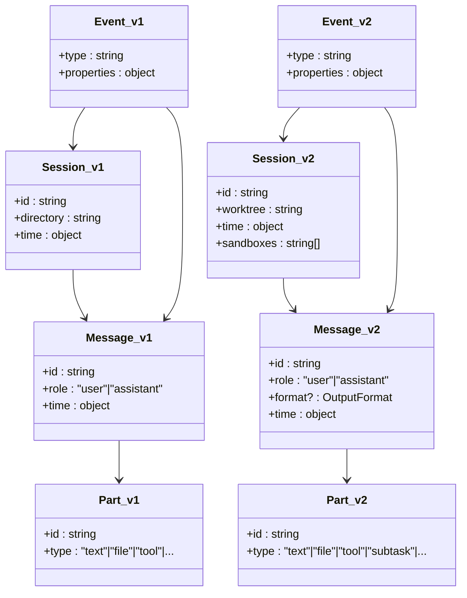
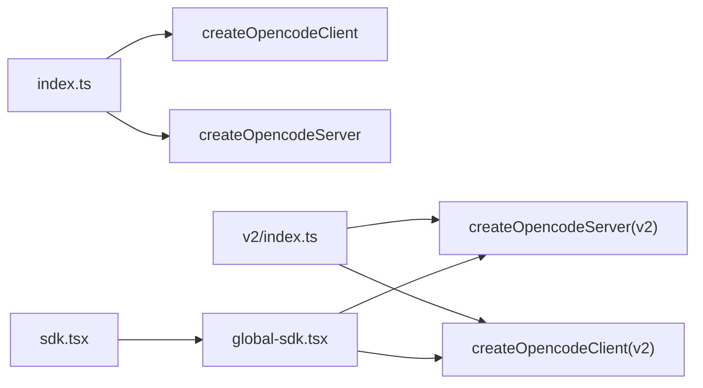

# SDK参考

<cite>
**本文引用的文件**
- [packages/sdk/js/src/index.ts](file://packages/sdk/js/src/index.ts)
- [packages/sdk/js/src/v2/index.ts](file://packages/sdk/js/src/v2/index.ts)
- [packages/sdk/js/src/gen/types.gen.ts](file://packages/sdk/js/src/gen/types.gen.ts)
- [packages/sdk/js/src/v2/gen/types.gen.ts](file://packages/sdk/js/src/v2/gen/types.gen.ts)
- [packages/app/src/context/global-sdk.tsx](file://packages/app/src/context/global-sdk.tsx)
- [packages/app/src/context/sdk.tsx](file://packages/app/src/context/sdk.tsx)
- [packages/web/src/content/docs/nb/sdk.mdx](file://packages/web/src/content/docs/nb/sdk.mdx)
- [packages/web/src/content/docs/fr/sdk.mdx](file://packages/web/src/content/docs/fr/sdk.mdx)
</cite>

## 目录
1. [简介](#简介)
2. [项目结构](#项目结构)
3. [核心组件](#核心组件)
4. [架构总览](#架构总览)
5. [详细组件分析](#详细组件分析)
6. [依赖关系分析](#依赖关系分析)
7. [性能考量](#性能考量)
8. [故障排查指南](#故障排查指南)
9. [结论](#结论)
10. [附录](#附录)

## 简介
本参考文档面向OpenCode SDK（JavaScript/TypeScript）使用者，覆盖安装、初始化与配置、基础使用模式、公共API方法、参数与返回类型、TypeScript类型定义与接口说明、泛型使用示例、Node.js与浏览器环境差异、错误处理与日志记录、完整集成示例、最佳实践与常见问题解答。SDK提供类型安全的客户端以与OpenCode服务端交互，并支持事件流订阅。

## 项目结构
OpenCode SDK位于packages/sdk/js中，提供v1与v2两套生成客户端与类型定义；同时在packages/app中提供基于上下文的全局SDK封装，便于在应用层统一管理事件流与客户端实例。

**图表来源**
- [packages/sdk/js/src/index.ts:1-22](file://packages/sdk/js/src/index.ts#L1-L22)
- [packages/sdk/js/src/v2/index.ts:1-22](file://packages/sdk/js/src/v2/index.ts#L1-L22)
- [packages/sdk/js/src/gen/types.gen.ts:1-120](file://packages/sdk/js/src/gen/types.gen.ts#L1-L120)
- [packages/sdk/js/src/v2/gen/types.gen.ts:1-120](file://packages/sdk/js/src/v2/gen/types.gen.ts#L1-L120)
- [packages/app/src/context/global-sdk.tsx:1-233](file://packages/app/src/context/global-sdk.tsx#L1-L233)
- [packages/app/src/context/sdk.tsx:1-50](file://packages/app/src/context/sdk.tsx#L1-L50)

**章节来源**
- [packages/sdk/js/src/index.ts:1-22](file://packages/sdk/js/src/index.ts#L1-L22)
- [packages/sdk/js/src/v2/index.ts:1-22](file://packages/sdk/js/src/v2/index.ts#L1-L22)
- [packages/app/src/context/global-sdk.tsx:1-233](file://packages/app/src/context/global-sdk.tsx#L1-L233)
- [packages/app/src/context/sdk.tsx:1-50](file://packages/app/src/context/sdk.tsx#L1-L50)

## 核心组件
- 创建器函数
  - v1：createOpencode(options?) → { client, server }
  - v2：createOpencode(options?) → { client, server }
- 客户端与服务端
  - 客户端：createOpencodeClient({ baseUrl, fetch?, parseAs?, responseStyle?, throwOnError? })
  - 服务端：createOpencodeServer({ hostname?, port?, signal?, timeout? })
- 类型系统
  - v1类型：会话、消息、部件、权限、事件等
  - v2类型：扩展了项目、问答、权限请求、输出格式等

**章节来源**
- [packages/sdk/js/src/index.ts:8-21](file://packages/sdk/js/src/index.ts#L8-L21)
- [packages/sdk/js/src/v2/index.ts:8-21](file://packages/sdk/js/src/v2/index.ts#L8-L21)
- [packages/web/src/content/docs/nb/sdk.mdx:16-45](file://packages/web/src/content/docs/nb/sdk.mdx#L16-L45)
- [packages/web/src/content/docs/fr/sdk.mdx:76-112](file://packages/web/src/content/docs/fr/sdk.mdx#L76-L112)

## 架构总览
SDK采用“服务端启动 + 客户端连接”的模式，v1与v2均遵循该模式。应用层通过全局上下文封装事件流（Server-Sent Events），实现事件聚合与去抖、心跳保活、断线重连与错误日志记录。

**图表来源**
- [packages/sdk/js/src/index.ts:8-21](file://packages/sdk/js/src/index.ts#L8-L21)
- [packages/sdk/js/src/v2/index.ts:8-21](file://packages/sdk/js/src/v2/index.ts#L8-L21)

## 详细组件分析

### 组件A：全局SDK上下文（事件流）
- 功能要点
  - 基于平台fetch或webview选择合适的HTTP实现
  - 启动事件流订阅，聚合同帧事件，去重delta更新
  - 心跳保活与可见性检测，异常时自动断开与重连
  - 错误日志记录，区分中断与非中断错误
- 关键行为
  - 事件键合并策略：按类型+标识符去重
  - 刷新周期与让出策略：避免UI阻塞
  - 断线重连延迟与心跳超时控制

**图表来源**
- [packages/app/src/context/global-sdk.tsx:124-191](file://packages/app/src/context/global-sdk.tsx#L124-L191)

**章节来源**
- [packages/app/src/context/global-sdk.tsx:1-233](file://packages/app/src/context/global-sdk.tsx#L1-L233)

### 组件B：按目录隔离的SDK上下文
- 功能要点
  - 基于全局SDK创建按目录隔离的客户端实例
  - 将全局事件映射到当前目录的事件总线上
  - 提供便捷的createClient方法复用全局配置

**图表来源**
- [packages/app/src/context/sdk.tsx:11-48](file://packages/app/src/context/sdk.tsx#L11-L48)

**章节来源**
- [packages/app/src/context/sdk.tsx:1-50](file://packages/app/src/context/sdk.tsx#L1-L50)

### 组件C：v1与v2类型系统对比
- v1类型重点：消息、部件、权限、事件、会话等
- v2类型重点：项目、问答、权限请求、输出格式、TUI命令扩展等
- 共同点：均提供统一的事件类型与消息模型，支持结构化输出与工具调用

**图表来源**
- [packages/sdk/js/src/gen/types.gen.ts:533-560](file://packages/sdk/js/src/gen/types.gen.ts#L533-L560)
- [packages/sdk/js/src/gen/types.gen.ts:112-143](file://packages/sdk/js/src/gen/types.gen.ts#L112-L143)
- [packages/sdk/js/src/gen/types.gen.ts:384-405](file://packages/sdk/js/src/gen/types.gen.ts#L384-L405)
- [packages/sdk/js/src/gen/types.gen.ts:704-737](file://packages/sdk/js/src/gen/types.gen.ts#L704-L737)
- [packages/sdk/js/src/v2/gen/types.gen.ts:21-43](file://packages/sdk/js/src/v2/gen/types.gen.ts#L21-L43)
- [packages/sdk/js/src/v2/gen/types.gen.ts:218-241](file://packages/sdk/js/src/v2/gen/types.gen.ts#L218-L241)
- [packages/sdk/js/src/v2/gen/types.gen.ts:611-624](file://packages/sdk/js/src/v2/gen/types.gen.ts#L611-L624)
- [packages/sdk/js/src/v2/gen/types.gen.ts:157-169](file://packages/sdk/js/src/v2/gen/types.gen.ts#L157-L169)

**章节来源**
- [packages/sdk/js/src/gen/types.gen.ts:1-800](file://packages/sdk/js/src/gen/types.gen.ts#L1-L800)
- [packages/sdk/js/src/v2/gen/types.gen.ts:1-800](file://packages/sdk/js/src/v2/gen/types.gen.ts#L1-L800)

## 依赖关系分析
- SDK入口导出客户端与服务端创建器，二者通过baseUrl关联
- 应用层上下文依赖平台fetch能力与服务器配置
- 事件流依赖AbortController与定时器机制

**图表来源**
- [packages/sdk/js/src/index.ts:4-21](file://packages/sdk/js/src/index.ts#L4-L21)
- [packages/sdk/js/src/v2/index.ts:4-21](file://packages/sdk/js/src/v2/index.ts#L4-L21)
- [packages/app/src/context/global-sdk.tsx:211-232](file://packages/app/src/context/global-sdk.tsx#L211-L232)
- [packages/app/src/context/sdk.tsx:14-22](file://packages/app/src/context/sdk.tsx#L14-L22)

**章节来源**
- [packages/sdk/js/src/index.ts:1-22](file://packages/sdk/js/src/index.ts#L1-L22)
- [packages/sdk/js/src/v2/index.ts:1-22](file://packages/sdk/js/src/v2/index.ts#L1-L22)
- [packages/app/src/context/global-sdk.tsx:1-233](file://packages/app/src/context/global-sdk.tsx#L1-L233)
- [packages/app/src/context/sdk.tsx:1-50](file://packages/app/src/context/sdk.tsx#L1-L50)

## 性能考量
- 事件聚合与去抖：同帧内批量派发，降低渲染压力
- 心跳保活：长时间无事件时主动中断，避免资源占用
- 可见性检测：页面不可见时减少事件处理频率
- 断线重连：指数退避与固定延迟结合，平衡恢复速度与资源消耗

[本节为通用指导，无需特定文件来源]

## 故障排查指南
- 事件流错误
  - 现象：控制台出现事件流错误日志
  - 排查：确认服务器URL协议与回环地址；检查平台fetch可用性
  - 处理：启用throwOnError捕获异常；必要时切换HTTP实现
- 中断与超时
  - 现象：事件流被AbortController中断
  - 排查：检查信号源与心跳超时设置
  - 处理：确保在组件卸载时正确清理；合理设置超时阈值
- 日志定位
  - 全局SDK上下文会区分中断与非中断错误并记录一次日志，便于快速定位

**章节来源**
- [packages/app/src/context/global-sdk.tsx:105-181](file://packages/app/src/context/global-sdk.tsx#L105-L181)

## 结论
OpenCode SDK提供类型安全且易于使用的客户端与服务端创建器，配合应用层上下文实现稳定的事件流订阅与管理。v2版本在类型体系上进一步完善，支持更多场景下的结构化输出与交互。建议在生产环境中启用throwOnError与合理的超时/重试策略，并结合上下文封装实现统一的错误处理与日志记录。

[本节为总结，无需特定文件来源]

## 附录

### 安装与初始化
- 安装
  - 使用包管理器安装SDK包
- 初始化
  - 在Node.js或浏览器环境中调用创建器函数，获取客户端与服务端实例
  - v1与v2均支持通过baseUrl连接同一服务端

**章节来源**
- [packages/web/src/content/docs/nb/sdk.mdx:16-45](file://packages/web/src/content/docs/nb/sdk.mdx#L16-L45)
- [packages/web/src/content/docs/fr/sdk.mdx:76-112](file://packages/web/src/content/docs/fr/sdk.mdx#L76-L112)

### API与类型概览
- v1类型
  - 会话、消息、部件、权限、事件等
- v2类型
  - 项目、问答、权限请求、输出格式、TUI命令扩展等
- 泛型使用
  - 客户端方法支持泛型约束响应类型，便于在编译期校验API契约

**章节来源**
- [packages/sdk/js/src/gen/types.gen.ts:1-800](file://packages/sdk/js/src/gen/types.gen.ts#L1-L800)
- [packages/sdk/js/src/v2/gen/types.gen.ts:1-800](file://packages/sdk/js/src/v2/gen/types.gen.ts#L1-L800)

### Node.js与浏览器差异
- 浏览器环境
  - 优先使用平台提供的fetch实现；若服务器为非本地回环HTTP，则可能切换到webview通道
- Node.js环境
  - 默认使用globalThis.fetch或自定义fetch实现

**章节来源**
- [packages/app/src/context/global-sdk.tsx:23-32](file://packages/app/src/context/global-sdk.tsx#L23-L32)

### 错误处理与日志
- 错误类型
  - 包含认证失败、未知错误、输出长度限制、消息中断、API错误等
- 日志策略
  - 事件流错误仅记录一次，避免重复刷屏
  - 支持throwOnError将错误抛出以便上层捕获

**章节来源**
- [packages/sdk/js/src/gen/types.gen.ts:70-110](file://packages/sdk/js/src/gen/types.gen.ts#L70-L110)
- [packages/sdk/js/src/v2/gen/types.gen.ts:243-302](file://packages/sdk/js/src/v2/gen/types.gen.ts#L243-L302)
- [packages/app/src/context/global-sdk.tsx:104-181](file://packages/app/src/context/global-sdk.tsx#L104-L181)

### 集成示例与最佳实践
- 示例路径
  - v1客户端创建与使用
  - v2客户端创建与使用
- 最佳实践
  - 在应用根部注入全局SDK上下文
  - 按目录隔离创建客户端实例
  - 启用throwOnError并在顶层统一处理
  - 合理设置心跳与重连策略

**章节来源**
- [packages/web/src/content/docs/nb/sdk.mdx:26-45](file://packages/web/src/content/docs/nb/sdk.mdx#L26-L45)
- [packages/web/src/content/docs/fr/sdk.mdx:76-112](file://packages/web/src/content/docs/fr/sdk.mdx#L76-L112)