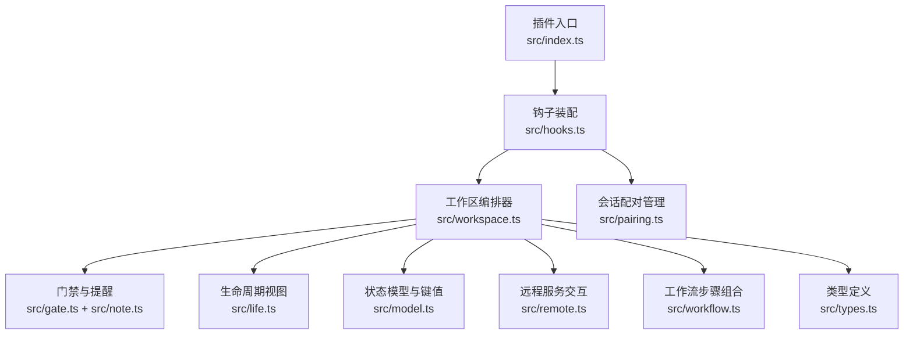
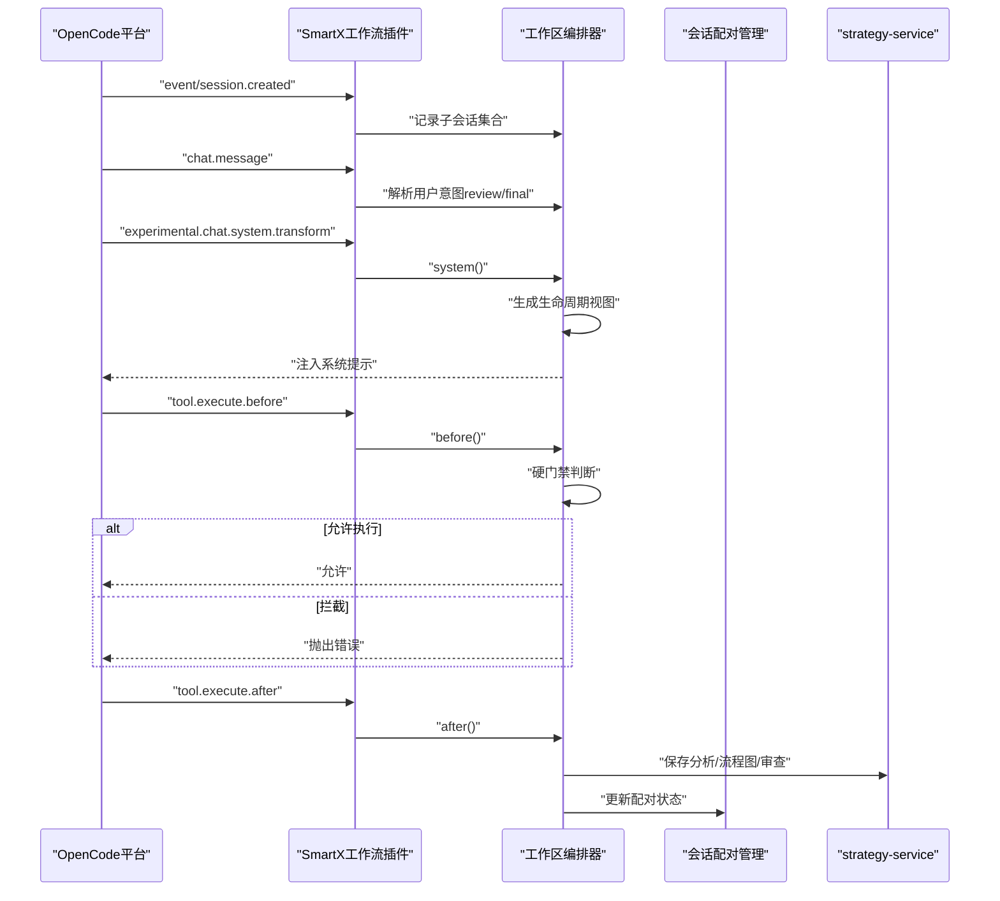
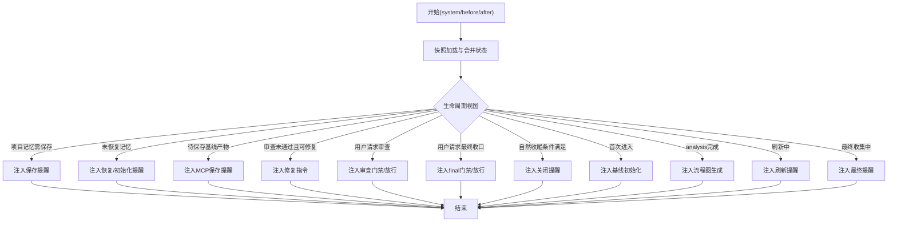
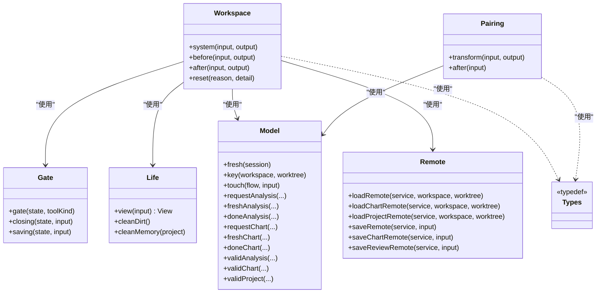

# SmartX工作流API

<cite>
**本文引用的文件**
- [packages/smartx-workflow/src/index.ts](file://packages/smartx-workflow/src/index.ts)
- [packages/smartx-workflow/src/hooks.ts](file://packages/smartx-workflow/src/hooks.ts)
- [packages/smartx-workflow/src/workspace.ts](file://packages/smartx-workflow/src/workspace.ts)
- [packages/smartx-workflow/src/pairing.ts](file://packages/smartx-workflow/src/pairing.ts)
- [packages/smartx-workflow/src/gate.ts](file://packages/smartx-workflow/src/gate.ts)
- [packages/smartx-workflow/src/life.ts](file://packages/smartx-workflow/src/life.ts)
- [packages/smartx-workflow/src/model.ts](file://packages/smartx-workflow/src/model.ts)
- [packages/smartx-workflow/src/types.ts](file://packages/smartx-workflow/src/types.ts)
- [packages/smartx-workflow/src/note.ts](file://packages/smartx-workflow/src/note.ts)
- [packages/smartx-workflow/src/remote.ts](file://packages/smartx-workflow/src/remote.ts)
- [packages/smartx-workflow/src/workflow.ts](file://packages/smartx-workflow/src/workflow.ts)
- [packages/smartx-workflow/TRIGGER_FLOW.md](file://packages/smartx-workflow/TRIGGER_FLOW.md)
</cite>

## 目录
1. [简介](#简介)
2. [项目结构](#项目结构)
3. [核心组件](#核心组件)
4. [架构总览](#架构总览)
5. [详细组件分析](#详细组件分析)
6. [依赖关系分析](#依赖关系分析)
7. [性能考虑](#性能考虑)
8. [故障排查指南](#故障排查指南)
9. [结论](#结论)
10. [附录](#附录)

## 简介
本文件面向SmartX工作流API的使用者与集成者，系统性阐述工作流定义、执行与管理的RESTful接口设计思想与实现机制。重点包括：
- 工作流模板与参数传递规范
- 状态模型与生命周期管理（启动、刷新、审查、调试、收口）
- 暂停/恢复/终止等控制能力
- 与OpenCode代理系统的协同机制与数据流转
- 错误码与异常处理策略
- 实际编排示例与性能优化建议

本说明以仓库中SmartX工作流插件为核心，结合其内部状态机、门禁控制、系统提示注入与远程服务交互，形成一套可落地的API与工作流编排框架。

## 项目结构
SmartX工作流位于packages/smartx-workflow，采用“插件入口 + 工作流编排 + 状态模型 + 门禁与提示 + 远程服务”的分层组织方式：
- 插件入口：导出Plugin接口，将工作流钩子暴露给OpenCode平台
- 工作流编排：按阶段注入系统提示、执行硬门禁、推进状态
- 状态模型：定义Analysis/Chart/Project/Pending/Dirt/Memory/Life/Mode等核心类型
- 门禁与提示：根据生命周期视图生成系统提示与拦截原因
- 远程服务：通过strategy-service提供的REST接口读写分析、流程图与审查结果

图表来源
- [packages/smartx-workflow/src/index.ts:1-10](file://packages/smartx-workflow/src/index.ts#L1-L10)
- [packages/smartx-workflow/src/hooks.ts:1-162](file://packages/smartx-workflow/src/hooks.ts#L1-L162)
- [packages/smartx-workflow/src/workspace.ts:1-762](file://packages/smartx-workflow/src/workspace.ts#L1-L762)
- [packages/smartx-workflow/src/pairing.ts:1-49](file://packages/smartx-workflow/src/pairing.ts#L1-L49)
- [packages/smartx-workflow/src/gate.ts:1-105](file://packages/smartx-workflow/src/gate.ts#L1-L105)
- [packages/smartx-workflow/src/life.ts:1-104](file://packages/smartx-workflow/src/life.ts#L1-L104)
- [packages/smartx-workflow/src/model.ts:1-122](file://packages/smartx-workflow/src/model.ts#L1-L122)
- [packages/smartx-workflow/src/remote.ts:1-110](file://packages/smartx-workflow/src/remote.ts#L1-L110)
- [packages/smartx-workflow/src/workflow.ts:1-18](file://packages/smartx-workflow/src/workflow.ts#L1-L18)
- [packages/smartx-workflow/src/types.ts:1-125](file://packages/smartx-workflow/src/types.ts#L1-L125)

章节来源
- [packages/smartx-workflow/src/index.ts:1-10](file://packages/smartx-workflow/src/index.ts#L1-L10)
- [packages/smartx-workflow/src/hooks.ts:1-162](file://packages/smartx-workflow/src/hooks.ts#L1-L162)

## 核心组件
- 插件入口与钩子装配：将工作流能力注册为OpenCode插件，桥接事件、聊天消息、系统提示变换与工具执行前后钩子
- 工作区编排器：统一管理workspace级状态推进、系统提示注入与硬门禁拦截
- 会话配对管理：确保smartx_start/logs与develop/debug成对出现，维持顺序一致性
- 生命周期视图：将analysis/chart/project/pending/memory/dirty等状态折叠为统一的生命周期视图
- 门禁与提示：根据不同阶段生成系统提示，或在不合规时抛出错误
- 远程服务交互：与strategy-service通过REST接口读写分析、流程图与审查结果

章节来源
- [packages/smartx-workflow/src/workspace.ts:148-761](file://packages/smartx-workflow/src/workspace.ts#L148-L761)
- [packages/smartx-workflow/src/pairing.ts:14-49](file://packages/smartx-workflow/src/pairing.ts#L14-L49)
- [packages/smartx-workflow/src/life.ts:58-103](file://packages/smartx-workflow/src/life.ts#L58-L103)
- [packages/smartx-workflow/src/gate.ts:5-67](file://packages/smartx-workflow/src/gate.ts#L5-L67)
- [packages/smartx-workflow/src/remote.ts:20-110](file://packages/smartx-workflow/src/remote.ts#L20-L110)

## 架构总览
SmartX工作流通过OpenCode插件机制接入，围绕workspace与session两个维度进行编排：
- workspace维度：管理基线（analysis+flowchart）、项目记忆、审查与调试队列、脏状态与基线模式
- session维度：管理配对计数（smartx_start/logs与develop/debug），保证顺序约束
- 系统提示注入：在experimental.chat.system.transform阶段按生命周期视图注入相应提示
- 硬门禁拦截：在tool.execute.before阶段根据当前状态与动作类型判断是否允许执行
- 远程服务：通过strategy-service的REST接口读写分析、流程图与审查结果

图表来源
- [packages/smartx-workflow/src/hooks.ts:92-161](file://packages/smartx-workflow/src/hooks.ts#L92-L161)
- [packages/smartx-workflow/src/workspace.ts:162-758](file://packages/smartx-workflow/src/workspace.ts#L162-L758)
- [packages/smartx-workflow/src/pairing.ts:17-46](file://packages/smartx-workflow/src/pairing.ts#L17-L46)
- [packages/smartx-workflow/src/remote.ts:20-50](file://packages/smartx-workflow/src/remote.ts#L20-L50)

## 详细组件分析

### 插件入口与钩子装配
- 插件入口导出SmartxWorkflow，内部调用build装配钩子
- build函数组装工作区编排器与会话配对管理，并注入日志写入、远程加载与保存回调
- 钩子覆盖event、chat.message、experimental.chat.system.transform、tool.execute.before、tool.execute.after五个入口

章节来源
- [packages/smartx-workflow/src/index.ts:4-9](file://packages/smartx-workflow/src/index.ts#L4-L9)
- [packages/smartx-workflow/src/hooks.ts:29-161](file://packages/smartx-workflow/src/hooks.ts#L29-L161)

### 工作区编排器（workspace）
- system阶段：按生命周期视图注入11类系统提示，覆盖项目记忆保存提醒、基线初始化、analysis/flowchart推进、审查与最终收口、自然收尾提醒等
- before阶段：执行硬门禁，拦截不合规动作；同时预写chart/analysis/review的启动状态
- after阶段：根据工具执行结果推进项目记忆、基线与审查/调试队列状态，落盘analysis/chart/review，触发debug队列

图表来源
- [packages/smartx-workflow/src/workspace.ts:162-384](file://packages/smartx-workflow/src/workspace.ts#L162-L384)

章节来源
- [packages/smartx-workflow/src/workspace.ts:148-761](file://packages/smartx-workflow/src/workspace.ts#L148-L761)

### 会话配对管理（pairing）
- transform阶段：当会话存在未完成的配对动作时，注入顺序提醒
- after阶段：根据工具执行结果更新配对计数（smartx_start/logs与develop/debug）

章节来源
- [packages/smartx-workflow/src/pairing.ts:14-49](file://packages/smartx-workflow/src/pairing.ts#L14-L49)

### 生命周期视图与门禁
- 生命周期视图将analysis/chart/project/pending/memory/dirty/baselineMode映射为idle/booting/ready/dirty/refreshing/finalizing
- 门禁根据当前生命周期与动作类型决定是否拦截，拦截时抛出错误并重置到合适起点

章节来源
- [packages/smartx-workflow/src/life.ts:58-103](file://packages/smartx-workflow/src/life.ts#L58-L103)
- [packages/smartx-workflow/src/gate.ts:5-67](file://packages/smartx-workflow/src/gate.ts#L5-L67)

### 状态模型与键值
- 定义Flow/Analysis/Chart/Project/Dirt/Mode/Life/Call/Save/SaveChart/SaveReview/Pending/Fix/Memory等类型
- 提供request/fresh/done等状态工厂方法，以及key/touch等工具函数

章节来源
- [packages/smartx-workflow/src/types.ts:1-125](file://packages/smartx-workflow/src/types.ts#L1-L125)
- [packages/smartx-workflow/src/model.ts:10-122](file://packages/smartx-workflow/src/model.ts#L10-L122)

### 系统提示与约束
- 提供note系列函数生成各阶段系统提示，覆盖基线初始化、analysis/flowchart/审查/修复/保存/关闭/最终收口等
- 对审查流程设定最多修复轮次限制

章节来源
- [packages/smartx-workflow/src/note.ts:5-229](file://packages/smartx-workflow/src/note.ts#L5-L229)

### 远程服务交互
- 提供load/save分析、流程图与审查结果的远程接口封装
- 通过strategy-service的REST端点进行读写

章节来源
- [packages/smartx-workflow/src/remote.ts:20-110](file://packages/smartx-workflow/src/remote.ts#L20-L110)

### 工作流步骤组合
- 提供step与flow工具，按顺序执行步骤，命中首个返回true的步骤即停止

章节来源
- [packages/smartx-workflow/src/workflow.ts:1-18](file://packages/smartx-workflow/src/workflow.ts#L1-L18)

## 依赖关系分析

图表来源
- [packages/smartx-workflow/src/workspace.ts:148-761](file://packages/smartx-workflow/src/workspace.ts#L148-L761)
- [packages/smartx-workflow/src/pairing.ts:14-49](file://packages/smartx-workflow/src/pairing.ts#L14-L49)
- [packages/smartx-workflow/src/gate.ts:5-67](file://packages/smartx-workflow/src/gate.ts#L5-L67)
- [packages/smartx-workflow/src/life.ts:58-103](file://packages/smartx-workflow/src/life.ts#L58-L103)
- [packages/smartx-workflow/src/model.ts:10-122](file://packages/smartx-workflow/src/model.ts#L10-L122)
- [packages/smartx-workflow/src/remote.ts:20-110](file://packages/smartx-workflow/src/remote.ts#L20-L110)
- [packages/smartx-workflow/src/types.ts:1-125](file://packages/smartx-workflow/src/types.ts#L1-L125)

## 性能考虑
- 异步流水线：系统提示注入与状态推进均采用异步流程，避免阻塞主流程
- 缓存与快照：优先使用内存缓存的analysis/chart/project，必要时才远程加载，减少网络往返
- 条件推进：仅在满足前置条件时推进到下一阶段，避免无效调用
- 门禁拦截：在before阶段尽早拦截不合规动作，降低无效执行成本
- 日志与可观测性：通过统一日志写入接口记录关键事件，便于追踪与优化

## 故障排查指南
常见错误与处理
- 项目记忆未恢复：在执行任何写入或实现类动作前，必须先恢复或初始化项目记忆
- 基线未完成：在未完成initial baseline前，禁止执行实现类动作
- 基线过期：工作区被写脏后，审查或进一步动作前必须刷新analysis与flowchart
- 审查未通过：根据审查结果进入修复轮次，最多3轮；超过限制后需人工介入
- 自然收尾：在工作区dirty且无挂起修复/审查/最终收口时，可触发自然收尾提醒

章节来源
- [packages/smartx-workflow/src/gate.ts:5-67](file://packages/smartx-workflow/src/gate.ts#L5-L67)
- [packages/smartx-workflow/src/note.ts:138-159](file://packages/smartx-workflow/src/note.ts#L138-L159)

## 结论
SmartX工作流API通过严格的生命周期视图、硬门禁与系统提示注入，实现了对workspace与session的精细化编排。配合strategy-service的REST接口，能够可靠地完成分析、流程图生成、审查、修复与调试的全链路管理。对于集成者而言，遵循本文档的工作流模板与参数规范，即可在OpenCode平台上安全高效地落地策略开发与管理工作流。

## 附录

### 触发时机与推进流程
- 插件加载后，按event/chat.message/experimental.chat.system.transform/tool.execute.before/tool.execute.after四个入口触发
- 根据session是否含parentID区分子会话，避免将主工作区门禁下放给子agent
- 在tool.execute.after后推进workspace状态，并更新session配对计数

章节来源
- [packages/smartx-workflow/TRIGGER_FLOW.md:1-74](file://packages/smartx-workflow/TRIGGER_FLOW.md#L1-L74)
- [packages/smartx-workflow/src/hooks.ts:92-161](file://packages/smartx-workflow/src/hooks.ts#L92-L161)

### 工作流模板与参数传递
- 基线初始化：先启动workspace-analyzer，再启动strategy-flowchart-generator
- 审查流程：先获取requirements，再启动strategy-reviewer，最后保存审查结果
- 修复流程：根据审查报告自行修复，最多3轮
- 保存流程：analysis/flowchart/review完成后，分别调用对应MCP保存工具

章节来源
- [packages/smartx-workflow/src/note.ts:46-135](file://packages/smartx-workflow/src/note.ts#L46-L135)
- [packages/smartx-workflow/src/note.ts:138-159](file://packages/smartx-workflow/src/note.ts#L138-L159)

### 状态查询与生命周期
- 状态类型：Analysis/Chart/Project/Pending/Dirt/Memory/Life/Mode
- 生命周期：idle → booting → ready → dirty → refreshing → finalizing
- 查询接口：通过strategy-service的REST端点读取analysis/flowchart/project-state

章节来源
- [packages/smartx-workflow/src/types.ts:1-125](file://packages/smartx-workflow/src/types.ts#L1-L125)
- [packages/smartx-workflow/src/life.ts:58-103](file://packages/smartx-workflow/src/life.ts#L58-L103)
- [packages/smartx-workflow/src/remote.ts:53-109](file://packages/smartx-workflow/src/remote.ts#L53-L109)

### RESTful接口定义（基于远程服务封装）
- 获取analysis快照
  - 方法：GET
  - 路径：/api/workbench/analysis
  - 查询参数：workspacePath, worktreePath
  - 响应：包含analysis数据的对象
- 保存analysis
  - 方法：POST
  - 路径：/api/workbench/analysis
  - 请求体：包含workspacePath、worktreePath、state、items、text
  - 响应：无（200表示成功）
- 获取flowchart快照
  - 方法：GET
  - 路径：/api/workbench/flowchart
  - 查询参数：workspacePath, worktreePath
  - 响应：包含flowchart数据的对象
- 保存flowchart
  - 方法：POST
  - 路径：/api/workbench/flowchart
  - 请求体：包含workspacePath、worktreePath、state、code、err
  - 响应：无（200表示成功）
- 获取project-state存在性
  - 方法：GET
  - 路径：/api/workbench/project-state
  - 查询参数：workspacePath, worktreePath
  - 响应：包含exists与updatedAt的对象
- 保存review
  - 方法：POST
  - 路径：/api/workbench/review
  - 请求体：包含workspacePath、worktreePath、state、summary、items、suggestions
  - 响应：无（200表示成功）

章节来源
- [packages/smartx-workflow/src/remote.ts:20-110](file://packages/smartx-workflow/src/remote.ts#L20-L110)

### 错误码与异常处理
- 通用HTTP错误：当远程服务返回非2xx状态时，抛出包含状态码的错误
- 业务错误：门禁拦截时抛出带明确原因的错误，提示正确的执行顺序
- 异常恢复：拦截后根据当前生命周期重置到合适起点（boot/refresh/final）

章节来源
- [packages/smartx-workflow/src/remote.ts:27-49](file://packages/smartx-workflow/src/remote.ts#L27-L49)
- [packages/smartx-workflow/src/gate.ts:5-67](file://packages/smartx-workflow/src/gate.ts#L5-L67)

### 集成模式与最佳实践
- 初始化基线：在首次进入workspace时，严格按“analysis→flowchart→保存→继续”的顺序执行
- 审查与修复：每次审查后必须保存，未通过则修复并复审，最多3轮
- 自然收尾：在工作区dirty且无挂起任务时，先刷新analysis与flowchart再收尾
- 顺序约束：确保smartx_start/logs与develop/debug成对出现，避免遗漏

章节来源
- [packages/smartx-workflow/src/note.ts:59-119](file://packages/smartx-workflow/src/note.ts#L59-L119)
- [packages/smartx-workflow/src/pairing.ts:17-46](file://packages/smartx-workflow/src/pairing.ts#L17-L46)