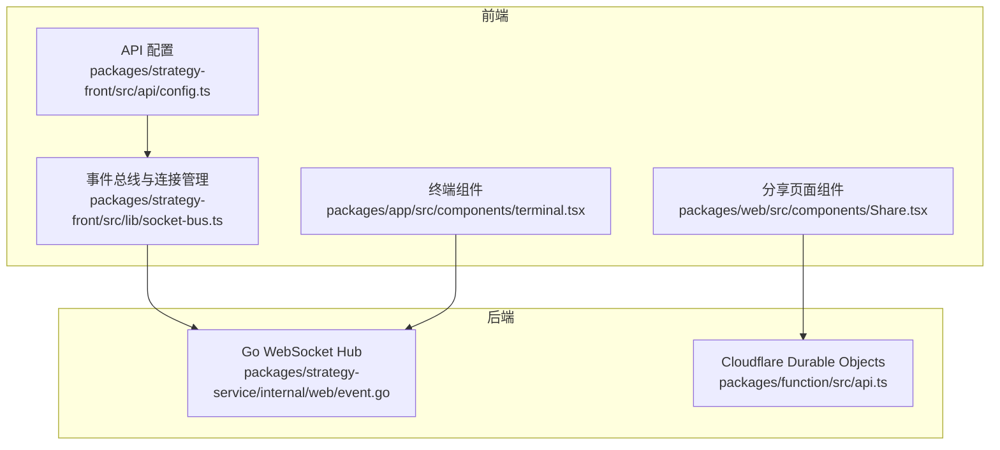
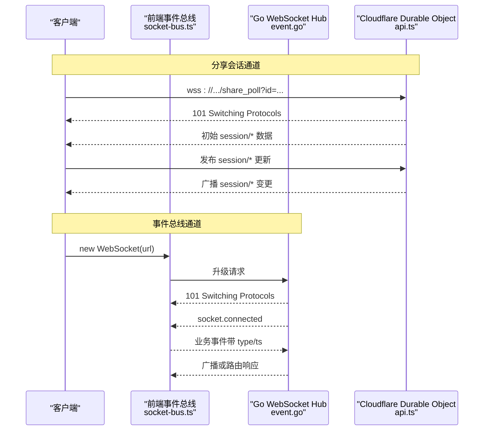
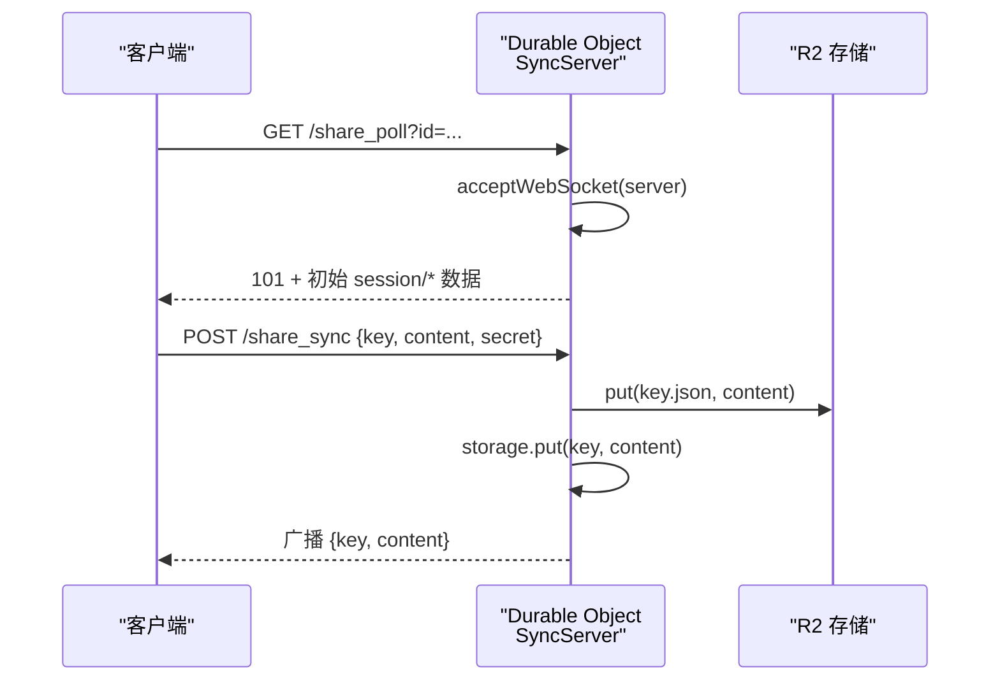
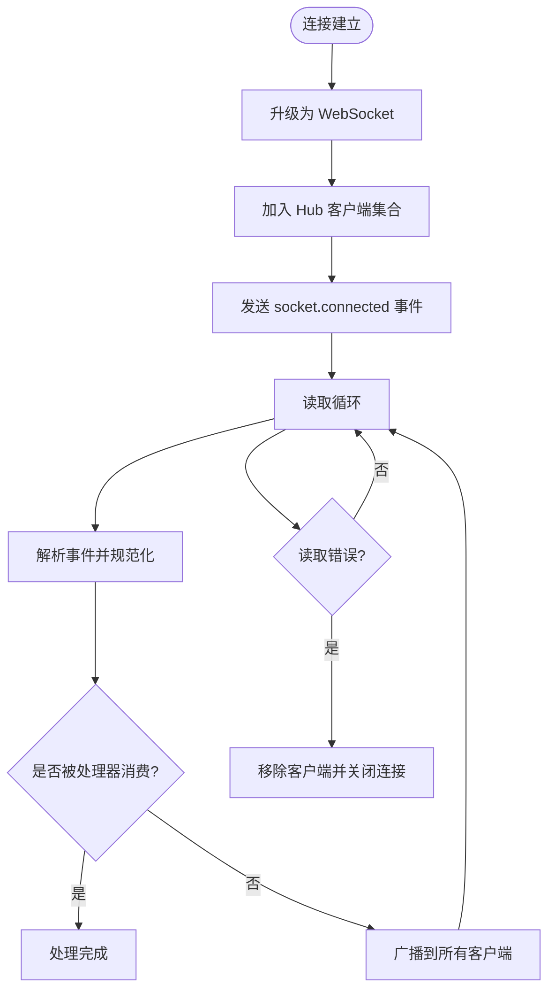
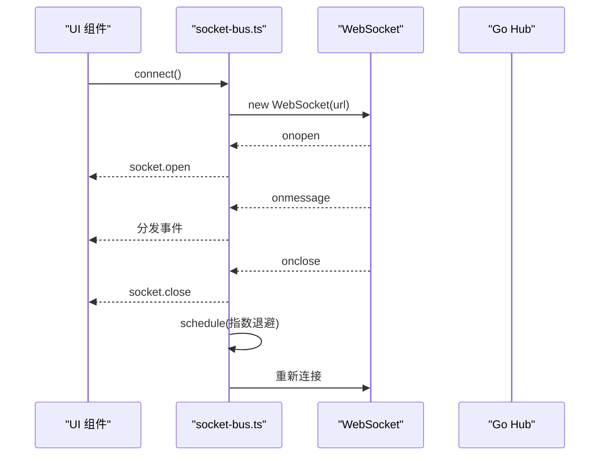
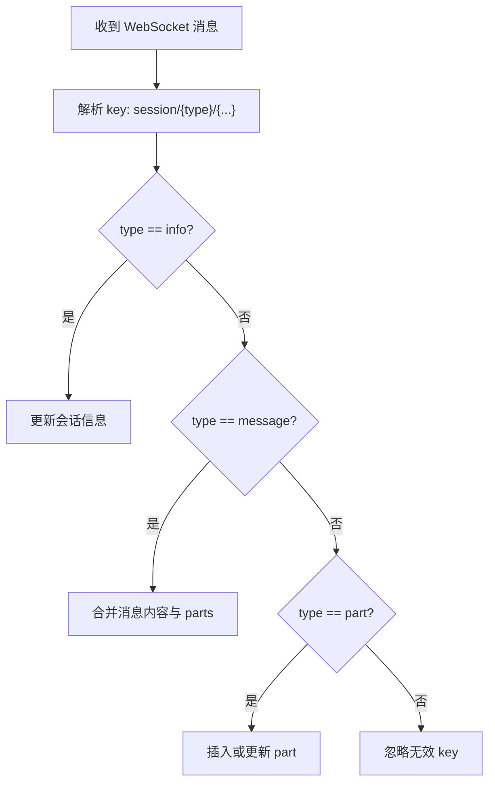
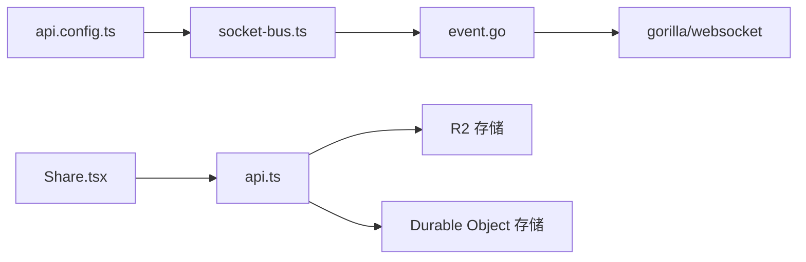

# WebSocket API

<cite>
**本文引用的文件**
- [packages/function/src/api.ts](file://packages/function/src/api.ts)
- [packages/strategy-front/src/lib/socket-bus.ts](file://packages/strategy-front/src/lib/socket-bus.ts)
- [packages/web/src/components/Share.tsx](file://packages/web/src/components/Share.tsx)
- [packages/app/src/components/terminal.tsx](file://packages/app/src/components/terminal.tsx)
- [packages/strategy-service/internal/web/event.go](file://packages/strategy-service/internal/web/event.go)
- [packages/opencode/src/share/share-next.ts](file://packages/opencode/src/share/share-next.ts)
- [packages/strategy-front/src/api/config.ts](file://packages/strategy-front/src/api/config.ts)
</cite>

## 目录
1. [简介](#简介)
2. [项目结构](#项目结构)
3. [核心组件](#核心组件)
4. [架构总览](#架构总览)
5. [详细组件分析](#详细组件分析)
6. [依赖关系分析](#依赖关系分析)
7. [性能考虑](#性能考虑)
8. [故障排查指南](#故障排查指南)
9. [结论](#结论)
10. [附录](#附录)

## 简介
本文件系统性梳理 OpenCode 的 WebSocket API 设计与实现，覆盖连接建立流程、握手协议、认证与授权、消息格式与事件模型、实时通信模式、连接管理与重连策略、心跳检测机制、会话管理与并发控制、以及调试与性能优化建议。文档面向不同技术背景的读者，既提供高层概览也包含代码级细节与可视化图示。

## 项目结构
OpenCode 的 WebSocket 能力由多处模块协同实现：
- 前端事件总线与连接管理：位于前端包中，负责 WebSocket 连接、事件分发与自动重连。
- 共享会话 WebSocket（Cloudflare Workers/Durable Objects）：用于分享会话的实时同步。
- Go 后端 WebSocket Hub：提供统一的 WebSocket 升级、读写循环、心跳与广播。
- 客户端渲染组件：在 Web/桌面等场景下消费 WebSocket 数据流并展示。

**图表来源**
- [packages/strategy-front/src/api/config.ts:1-8](file://packages/strategy-front/src/api/config.ts#L1-L8)
- [packages/strategy-front/src/lib/socket-bus.ts:1-125](file://packages/strategy-front/src/lib/socket-bus.ts#L1-L125)
- [packages/web/src/components/Share.tsx:1-654](file://packages/web/src/components/Share.tsx#L1-L654)
- [packages/app/src/components/terminal.tsx:530-604](file://packages/app/src/components/terminal.tsx#L530-L604)
- [packages/strategy-service/internal/web/event.go:1-211](file://packages/strategy-service/internal/web/event.go#L1-L211)
- [packages/function/src/api.ts:1-402](file://packages/function/src/api.ts#L1-L402)

**章节来源**
- [packages/strategy-front/src/api/config.ts:1-8](file://packages/strategy-front/src/api/config.ts#L1-L8)
- [packages/strategy-front/src/lib/socket-bus.ts:1-125](file://packages/strategy-front/src/lib/socket-bus.ts#L1-L125)
- [packages/web/src/components/Share.tsx:1-654](file://packages/web/src/components/Share.tsx#L1-L654)
- [packages/app/src/components/terminal.tsx:530-604](file://packages/app/src/components/terminal.tsx#L530-L604)
- [packages/strategy-service/internal/web/event.go:1-211](file://packages/strategy-service/internal/web/event.go#L1-L211)
- [packages/function/src/api.ts:1-402](file://packages/function/src/api.ts#L1-L402)

## 核心组件
- 事件总线与连接管理（前端）
  - 统一的 WebSocket URL 构造、连接状态管理、事件解析与分发、指数退避重连。
- 分享会话 WebSocket（Cloudflare Workers）
  - Durable Object 承载会话数据与订阅者列表；支持密钥校验、R2 存储、广播推送。
- Go WebSocket Hub
  - 升级握手、读写循环、心跳 Ping/Pong、广播与处理器路由。
- 客户端渲染组件
  - Web/桌面端对 WebSocket 消息进行解析、状态更新与 UI 渲染。

**章节来源**
- [packages/strategy-front/src/lib/socket-bus.ts:1-125](file://packages/strategy-front/src/lib/socket-bus.ts#L1-L125)
- [packages/function/src/api.ts:29-127](file://packages/function/src/api.ts#L29-L127)
- [packages/strategy-service/internal/web/event.go:1-211](file://packages/strategy-service/internal/web/event.go#L1-L211)
- [packages/web/src/components/Share.tsx:111-175](file://packages/web/src/components/Share.tsx#L111-L175)

## 架构总览
OpenCode 的 WebSocket 架构分为两条主线：
- 分享会话通道：通过 Cloudflare Workers 的 Durable Object 提供安全的会话共享，客户端以 wss:// 协议直连，服务端按会话维度广播增量数据。
- 事件总线通道：前端通过统一的 /events/ws 接入 Go WebSocket Hub，支持心跳、广播与事件路由。

**图表来源**
- [packages/function/src/api.ts:33-50](file://packages/function/src/api.ts#L33-L50)
- [packages/function/src/api.ts:177-187](file://packages/function/src/api.ts#L177-L187)
- [packages/strategy-service/internal/web/event.go:56-73](file://packages/strategy-service/internal/web/event.go#L56-L73)
- [packages/strategy-front/src/lib/socket-bus.ts:60-82](file://packages/strategy-front/src/lib/socket-bus.ts#L60-L82)

## 详细组件分析

### 1) 分享会话 WebSocket（Cloudflare Workers/Durable Objects）
- 连接建立
  - 服务端通过 acceptWebSocket 将 HTTP 升级为 WebSocket，并返回 101 Switching Protocols。
  - 初次连接会将当前会话下的所有 session/* 数据推送给新订阅者。
- 认证与授权
  - 通过会话短名与共享密钥进行访问控制；发布前需校验密钥一致性。
- 消息格式与事件类型
  - 客户端发送 JSON，包含 key 与 content 字段；服务端按 key 前缀区分会话信息、消息与部分片段。
- 实时通信模式
  - 服务端将变更写入 R2 与 Durable Object Storage，并向所有已连接客户端广播。
- 连接管理与重连
  - 前端组件在 onclose 时触发指数退避重连（固定逻辑在组件内实现）。
- 心跳检测
  - 当前实现未见显式心跳；如需可扩展为 Ping/Pong 或基于超时断开。

**图表来源**
- [packages/function/src/api.ts:33-50](file://packages/function/src/api.ts#L33-L50)
- [packages/function/src/api.ts:58-79](file://packages/function/src/api.ts#L58-L79)
- [packages/function/src/api.ts:163-176](file://packages/function/src/api.ts#L163-L176)

**章节来源**
- [packages/function/src/api.ts:29-127](file://packages/function/src/api.ts#L29-L127)
- [packages/function/src/api.ts:177-216](file://packages/function/src/api.ts#L177-L216)
- [packages/web/src/components/Share.tsx:111-175](file://packages/web/src/components/Share.tsx#L111-L175)

### 2) 事件总线 WebSocket（Go Hub）
- 连接建立与握手
  - 使用 gorilla/websocket 升级 HTTP 请求为 WebSocket，允许跨域来源。
- 心跳与保活
  - 写入周期性 Ping；读取侧设置读取上限与超时，并在收到 Pong 后刷新读取超时。
- 事件模型
  - 事件结构包含 id、type、payload、ts；服务端对空类型进行规范化处理。
- 广播与路由
  - 未被处理器消费的事件将被广播给所有客户端；处理器可选择消费或继续广播。
- 错误处理
  - 对异常关闭进行日志记录；对非法事件忽略并继续处理后续消息。

**图表来源**
- [packages/strategy-service/internal/web/event.go:56-73](file://packages/strategy-service/internal/web/event.go#L56-L73)
- [packages/strategy-service/internal/web/event.go:104-134](file://packages/strategy-service/internal/web/event.go#L104-L134)
- [packages/strategy-service/internal/web/event.go:163-194](file://packages/strategy-service/internal/web/event.go#L163-L194)

**章节来源**
- [packages/strategy-service/internal/web/event.go:16-211](file://packages/strategy-service/internal/web/event.go#L16-L211)

### 3) 前端事件总线与连接管理
- URL 构造与协议转换
  - 基于 API 配置动态拼接 /events/ws，并将 http 自动转为 wss。
- 事件模型
  - SocketEvent 包含 id、type、payload、ts；仅当 type 非空时才派发。
- 连接生命周期
  - onopen/onmessage/onclose/onerror；在 onclose 触发指数退避重连。
- 发送与订阅
  - emit 支持发送事件；on 注册事件监听器；ready 查询连接状态。

**图表来源**
- [packages/strategy-front/src/lib/socket-bus.ts:60-82](file://packages/strategy-front/src/lib/socket-bus.ts#L60-L82)
- [packages/strategy-front/src/lib/socket-bus.ts:101-124](file://packages/strategy-front/src/lib/socket-bus.ts#L101-L124)
- [packages/strategy-front/src/api/config.ts:1-8](file://packages/strategy-front/src/api/config.ts#L1-L8)

**章节来源**
- [packages/strategy-front/src/lib/socket-bus.ts:1-125](file://packages/strategy-front/src/lib/socket-bus.ts#L1-L125)
- [packages/strategy-front/src/api/config.ts:1-8](file://packages/strategy-front/src/api/config.ts#L1-L8)

### 4) 客户端渲染与消息解析
- 分享页面组件
  - 强制使用 wss；在 onmessage 中解析 key 路径，分别更新会话信息、消息与部分片段。
  - 在 onclose 时触发 2 秒重连；onerror 记录错误状态。
- 终端组件
  - 处理二进制控制帧与文本输出；异常关闭时触发重试；支持主动断开探测。

**图表来源**
- [packages/web/src/components/Share.tsx:119-147](file://packages/web/src/components/Share.tsx#L119-L147)

**章节来源**
- [packages/web/src/components/Share.tsx:111-175](file://packages/web/src/components/Share.tsx#L111-L175)
- [packages/app/src/components/terminal.tsx:530-604](file://packages/app/src/components/terminal.tsx#L530-L604)

### 5) 会话管理与权限验证
- 会话维度隔离
  - 分享会话通过 sessionID 限定 key 前缀，确保广播范围仅限当前会话。
- 权限与并发
  - 分享密钥用于访问控制；当前实现未见全局并发连接数限制；可在 Hub 层引入连接数配额与鉴权中间件。
- 企业集成
  - 分享接口支持组织级鉴权头（authorization/x-org-id），便于企业环境接入。

**章节来源**
- [packages/function/src/api.ts:58-65](file://packages/function/src/api.ts#L58-L65)
- [packages/opencode/src/share/share-next.ts:41-62](file://packages/opencode/src/share/share-next.ts#L41-L62)

## 依赖关系分析
- 前端依赖
  - socket-bus.ts 依赖 apiConfig 提供 baseURL；与 Go Hub 交互。
  - Share.tsx 依赖分享会话 API；与 Cloudflare DO 交互。
- 后端依赖
  - Go Hub 依赖 gorilla/websocket；事件处理器路由由上层注册。
  - Cloudflare DO 依赖 R2 与 Durable Object 存储；提供会话维度广播。

**图表来源**
- [packages/strategy-front/src/api/config.ts:1-8](file://packages/strategy-front/src/api/config.ts#L1-L8)
- [packages/strategy-front/src/lib/socket-bus.ts:1-125](file://packages/strategy-front/src/lib/socket-bus.ts#L1-L125)
- [packages/strategy-service/internal/web/event.go:13](file://packages/strategy-service/internal/web/event.go#L13)
- [packages/function/src/api.ts:1-13](file://packages/function/src/api.ts#L1-L13)

**章节来源**
- [packages/strategy-front/src/api/config.ts:1-8](file://packages/strategy-front/src/api/config.ts#L1-L8)
- [packages/strategy-service/internal/web/event.go:13](file://packages/strategy-service/internal/web/event.go#L13)
- [packages/function/src/api.ts:1-13](file://packages/function/src/api.ts#L1-L13)

## 性能考虑
- 读写超时与缓冲
  - Go Hub 设置读取上限与写入超时，避免内存膨胀；建议根据消息大小调优 socketSize 与 socketWrite。
- 心跳频率
  - Ping 周期可按网络状况调整，过短增加 CPU 开销，过长可能导致误判断开。
- 广播与队列
  - 分享会话广播需注意订阅者数量；建议在 DO 层限制单会话订阅者规模或引入分页拉取。
- 前端重连策略
  - 指数退避上限可配置，避免雪崩效应；建议结合网络状态与用户行为动态调整。

[本节为通用指导，不直接分析具体文件]

## 故障排查指南
- 连接失败
  - 检查 baseURL 与协议转换（http->wss）；确认 /events/ws 是否可达。
- 异常关闭
  - 查看 onerror/onclose 回调中的错误码；Go Hub 对异常关闭会记录日志。
- 心跳问题
  - 若出现频繁断开，检查 Ping/Pong 配置与网络质量；必要时缩短 socketPing。
- 分享会话不可见
  - 确认分享密钥正确；检查 sessionID 前缀匹配；查看初始数据拉取与广播日志。

**章节来源**
- [packages/strategy-front/src/lib/socket-bus.ts:74-82](file://packages/strategy-front/src/lib/socket-bus.ts#L74-L82)
- [packages/strategy-service/internal/web/event.go:112-123](file://packages/strategy-service/internal/web/event.go#L112-L123)
- [packages/web/src/components/Share.tsx:149-162](file://packages/web/src/components/Share.tsx#L149-L162)

## 结论
OpenCode 的 WebSocket 能力通过前后端协作实现了两类实时通路：分享会话通道与事件总线通道。前者以 Durable Objects 为核心，具备会话隔离与广播能力；后者以 Go Hub 为中心，提供心跳、广播与事件路由。整体设计清晰、扩展性强，建议在生产环境中完善鉴权、并发限制与心跳策略，并结合业务场景优化重连与广播策略。

[本节为总结性内容，不直接分析具体文件]

## 附录

### A. 消息格式与事件类型
- 通用事件结构
  - 字段：id、type、payload、ts；type 必须非空。
- 分享会话消息
  - key 采用 "session/{info|message|part}/{...}" 前缀；content 为对应实体数据。
- 事件总线事件
  - 由前端 emit 发送；Go Hub 规范化后广播或路由。

**章节来源**
- [packages/strategy-service/internal/web/event.go:23-28](file://packages/strategy-service/internal/web/event.go#L23-L28)
- [packages/function/src/api.ts:163-176](file://packages/function/src/api.ts#L163-L176)

### B. 客户端连接示例与错误处理
- 前端连接
  - 使用 socket-bus.ts 的 connect/emit/on/disconnect 方法管理连接与事件。
- 分享页面连接
  - 强制 wss；解析消息并更新本地 store；异常时记录错误并重连。
- 终端连接
  - 处理控制帧与输出；异常关闭触发重试。

**章节来源**
- [packages/strategy-front/src/lib/socket-bus.ts:84-124](file://packages/strategy-front/src/lib/socket-bus.ts#L84-L124)
- [packages/web/src/components/Share.tsx:111-175](file://packages/web/src/components/Share.tsx#L111-L175)
- [packages/app/src/components/terminal.tsx:530-604](file://packages/app/src/components/terminal.tsx#L530-L604)

### C. 会话管理与权限验证要点
- 会话隔离
  - 通过 sessionID 限定 key 前缀，避免跨会话广播。
- 权限与组织
  - 分享接口支持组织级鉴权头；可扩展为 JWT 校验与角色控制。
- 并发限制
  - 建议在 Hub 层引入连接数配额与速率限制，防止滥用。

**章节来源**
- [packages/function/src/api.ts:58-65](file://packages/function/src/api.ts#L58-L65)
- [packages/opencode/src/share/share-next.ts:41-62](file://packages/opencode/src/share/share-next.ts#L41-L62)