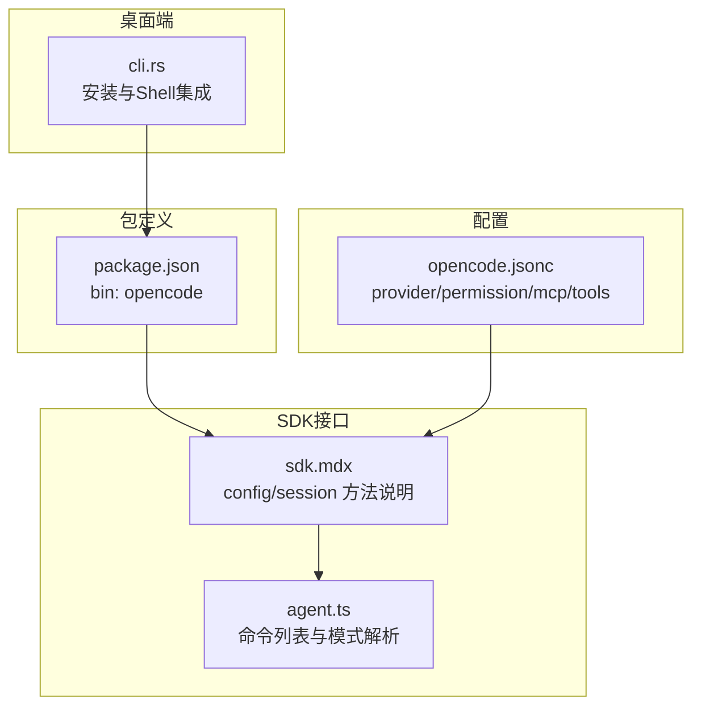
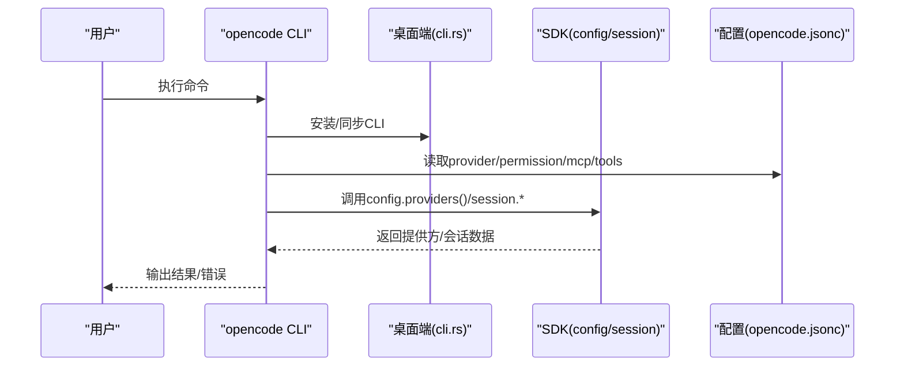
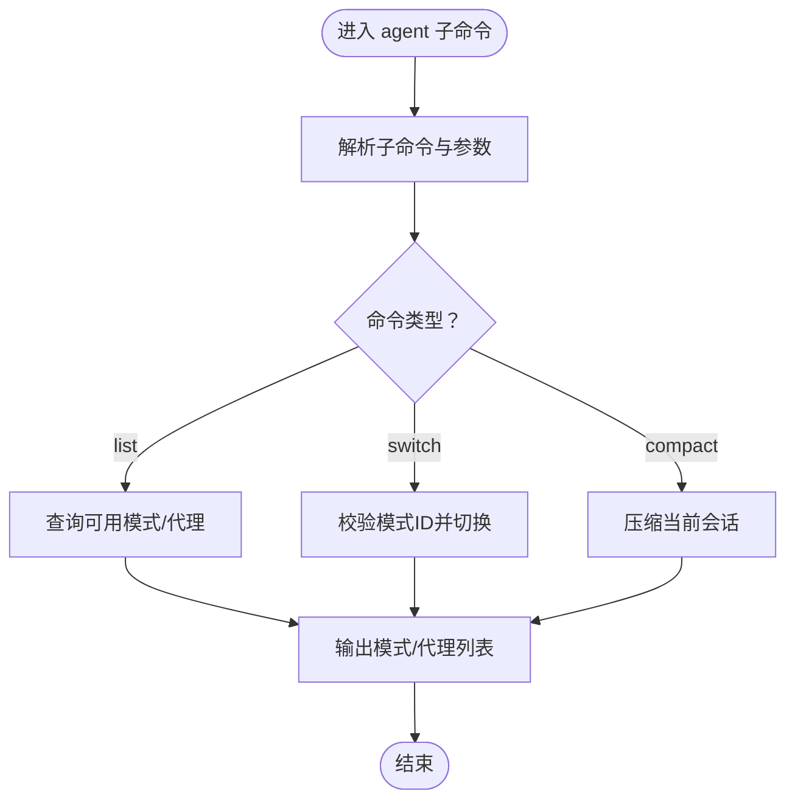
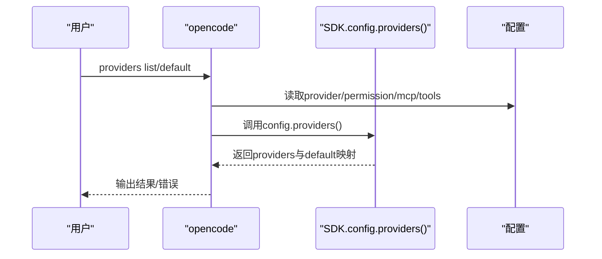
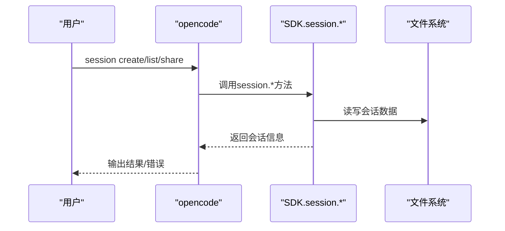
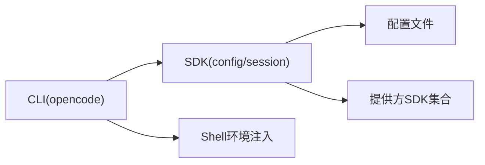

# CLI命令参考

<cite>
**本文档引用的文件**
- [opencode.jsonc](file://.opencode/opencode.jsonc)
- [package.json](file://packages/opencode/package.json)
- [agent.ts](file://packages/opencode/src/acp/agent.ts)
- [sdk.mdx](file://packages/web/src/content/docs/sdk.mdx)
- [cli.rs](file://packages/desktop/src-tauri/src/cli.rs)
</cite>

## 目录
1. [简介](#简介)
2. [项目结构](#项目结构)
3. [核心组件](#核心组件)
4. [架构总览](#架构总览)
5. [详细组件分析](#详细组件分析)
6. [依赖分析](#依赖分析)
7. [性能考虑](#性能考虑)
8. [故障排除指南](#故障排除指南)
9. [结论](#结论)
10. [附录](#附录)

## 简介
本参考文档面向使用 opencode CLI 的工程师与运维人员，系统性梳理命令行工具的可用命令、参数选项、执行流程、输出格式与错误处理方式，并提供高级用法、批量操作与自动化脚本编写建议。当前仓库中 CLI 的入口由桌面应用集成安装，核心命令通过 SDK 暴露，配置文件用于定义提供方与工具策略。

## 项目结构
与 CLI 命令直接相关的关键位置如下：
- 桌面端集成：在桌面应用中安装并同步 CLI，支持不同 Shell 的环境注入与超时控制。
- 包管理：opencode 包定义了二进制入口名称，便于系统级调用。
- 配置中心：.opencode/opencode.jsonc 提供 provider、permission、mcp、tools 等配置项，影响命令行为。
- SDK 文档：Web 文档中对 config、session 等方法有接口说明，可作为命令语义的参考来源。

**图表来源**
- [cli.rs:211-265](file://packages/desktop/src-tauri/src/cli.rs#L211-L265)
- [package.json:21-23](file://packages/opencode/package.json#L21-L23)
- [opencode.jsonc:1-19](file://.opencode/opencode.jsonc#L1-L19)
- [sdk.mdx:285-303](file://packages/web/src/content/docs/sdk.mdx#L285-L303)
- [agent.ts:1124-1193](file://packages/opencode/src/acp/agent.ts#L1124-L1193)

**章节来源**
- [package.json:21-23](file://packages/opencode/package.json#L21-L23)
- [opencode.jsonc:1-19](file://.opencode/opencode.jsonc#L1-L19)
- [sdk.mdx:285-303](file://packages/web/src/content/docs/sdk.mdx#L285-L303)
- [agent.ts:1124-1193](file://packages/opencode/src/acp/agent.ts#L1124-L1193)
- [cli.rs:211-265](file://packages/desktop/src-tauri/src/cli.rs#L211-L265)

## 核心组件
- CLI 入口与安装
  - 二进制入口名称为 opencode，可通过系统 PATH 调用。
  - 桌面端负责安装 CLI 并根据 Shell 注入环境变量，提供超时控制与进程管理能力。
- 配置系统
  - provider：定义可用提供方及默认模型映射。
  - permission：控制编辑、Bash、Web 访问等权限策略。
  - mcp：MCP（模型上下文协议）服务器配置。
  - tools：启用或禁用特定工具（如 GitHub triage/pr search）。
- SDK 接口
  - config.providers：列出提供方与默认模型。
  - session.*：会话相关方法（如 list），用于命令上下文与模式选择。

**章节来源**
- [package.json:21-23](file://packages/opencode/package.json#L21-L23)
- [opencode.jsonc:3-18](file://.opencode/opencode.jsonc#L3-L18)
- [sdk.mdx:285-303](file://packages/web/src/content/docs/sdk.mdx#L285-L303)
- [agent.ts:1124-1193](file://packages/opencode/src/acp/agent.ts#L1124-L1193)

## 架构总览
CLI 在桌面端被安装后，通过系统 PATH 调用；命令执行时读取配置文件，结合 SDK 查询可用命令与模式，最终完成会话与代理交互。

**图表来源**
- [cli.rs:211-265](file://packages/desktop/src-tauri/src/cli.rs#L211-L265)
- [opencode.jsonc:1-19](file://.opencode/opencode.jsonc#L1-L19)
- [sdk.mdx:285-303](file://packages/web/src/content/docs/sdk.mdx#L285-L303)

## 详细组件分析

### 命令组概览与职责
- agent
  - 职责：代理模式与可用模式解析，支持 compact 命令。
  - 关键点：从 SDK 获取命令列表，若无 compact 则动态注入。
- providers
  - 职责：列出可用提供方与默认模型，供会话与模式选择使用。
- session
  - 职责：会话生命周期管理（创建、分享、列表等），与命令组协同工作。
- config
  - 职责：读取与应用全局配置（provider、permission、mcp、tools）。

**章节来源**
- [agent.ts:1124-1193](file://packages/opencode/src/acp/agent.ts#L1124-L1193)
- [sdk.mdx:285-303](file://packages/web/src/content/docs/sdk.mdx#L285-L303)
- [opencode.jsonc:1-19](file://.opencode/opencode.jsonc#L1-L19)

### agent 命令组
- 语法
  - opencode agent list
  - opencode agent switch <模式ID>
  - opencode agent compact
- 参数
  - list：无参数，返回可用代理与模式列表。
  - switch：需提供有效模式ID。
  - compact：压缩当前会话内容。
- 使用示例
  - 查看可用模式：opencode agent list
  - 切换到指定模式：opencode agent switch <模式ID>
  - 压缩会话：opencode agent compact
- 常见场景
  - 快速切换代理模式以适配不同任务。
  - 在长会话后清理冗余内容，提升性能。
- 执行流程
  - 读取配置与SDK命令列表 → 解析可用模式 → 执行对应动作 → 返回状态。
- 输出格式
  - 列表类命令返回 JSON 或表格形式的模式/代理信息。
- 错误处理
  - 模式ID无效时提示错误并退出。
  - SDK 调用失败时返回错误码与原因。

**图表来源**
- [agent.ts:1124-1193](file://packages/opencode/src/acp/agent.ts#L1124-L1193)

**章节来源**
- [agent.ts:1124-1193](file://packages/opencode/src/acp/agent.ts#L1124-L1193)

### providers 命令组
- 语法
  - opencode providers list
  - opencode providers default <提供方ID>
- 参数
  - list：无参数，返回提供方清单与默认模型映射。
  - default：设置默认提供方，需提供有效提供方ID。
- 使用示例
  - 查看提供方：opencode providers list
  - 设置默认提供方：opencode providers default <提供方ID>
- 常见场景
  - 多提供方环境下快速切换默认模型。
  - 与会话模式联动，确保模型一致性。
- 执行流程
  - 读取配置 → 调用 SDK config.providers → 返回提供方与默认映射。
- 输出格式
  - JSON 结构，包含 providers 数组与 default 映射。
- 错误处理
  - 提供方ID不存在时返回错误。
  - SDK 返回异常时输出错误信息。

**图表来源**
- [sdk.mdx:285-303](file://packages/web/src/content/docs/sdk.mdx#L285-L303)
- [opencode.jsonc:1-19](file://.opencode/opencode.jsonc#L1-L19)

**章节来源**
- [sdk.mdx:285-303](file://packages/web/src/content/docs/sdk.mdx#L285-L303)
- [opencode.jsonc:1-19](file://.opencode/opencode.jsonc#L1-L19)

### session 命令组
- 语法
  - opencode session list
  - opencode session create
  - opencode session share <路径>
- 参数
  - list：无参数，返回会话列表。
  - create：无参数，创建新会话。
  - share：需提供会话路径或标识。
- 使用示例
  - 列出会话：opencode session list
  - 创建会话：opencode session create
  - 分享会话：opencode session share <路径>
- 常见场景
  - 团队协作共享会话。
  - 自动化脚本批量创建与分享会话。
- 执行流程
  - 读取配置 → 调用 SDK session.* → 返回会话元数据。
- 输出格式
  - JSON 结构，包含会话标识、时间戳、状态等字段。
- 错误处理
  - 会话路径无效或权限不足时返回错误。

**图表来源**
- [sdk.mdx:285-303](file://packages/web/src/content/docs/sdk.mdx#L285-L303)

**章节来源**
- [sdk.mdx:285-303](file://packages/web/src/content/docs/sdk.mdx#L285-L303)

### config 命令组
- 语法
  - opencode config get
  - opencode config set <键> <值>
- 参数
  - get：无参数，返回完整配置。
  - set：需提供键与值，支持 provider、permission、mcp、tools 等域。
- 使用示例
  - 查看配置：opencode config get
  - 设置工具开关：opencode config set tools.github-triage true
- 常见场景
  - CI/CD 中动态调整工具策略。
  - 本地开发环境按需启用/禁用 MCP 服务。
- 执行流程
  - 读取配置文件 → 应用变更 → 写回配置。
- 输出格式
  - JSON 结构，包含各配置域。
- 错误处理
  - 键名不合法或值类型不符时返回错误。

**章节来源**
- [opencode.jsonc:1-19](file://.opencode/opencode.jsonc#L1-L19)

## 依赖分析
- 组件耦合
  - CLI 依赖桌面端安装逻辑与 Shell 环境注入。
  - SDK 提供 config 与 session 能力，CLI 通过 SDK 查询命令与模式。
  - 配置文件影响 SDK 行为与命令可用性。
- 外部依赖
  - yargs 用于命令行参数解析。
  - 不同提供方 SDK（如 OpenAI、Anthropic 等）用于模型调用。
- 潜在循环
  - 当前结构为单向依赖（CLI → SDK → 配置），无明显循环。

**图表来源**
- [package.json:58-140](file://packages/opencode/package.json#L58-L140)
- [opencode.jsonc:1-19](file://.opencode/opencode.jsonc#L1-L19)

**章节来源**
- [package.json:58-140](file://packages/opencode/package.json#L58-L140)
- [opencode.jsonc:1-19](file://.opencode/opencode.jsonc#L1-L19)

## 性能考虑
- 命令缓存：在频繁查询提供方与会话时，建议缓存 SDK 返回结果，减少重复调用。
- 超时控制：桌面端提供超时机制，避免长时间阻塞导致 CLI 卡顿。
- 并发限制：批量操作时限制并发数，避免资源争用。
- 输出优化：仅输出必要字段，减少序列化开销。

## 故障排除指南
- 安装/同步失败
  - 现象：无法调用 opencode 或安装中断。
  - 排查：检查 PATH 与 Shell 配置，确认桌面端已成功安装 CLI。
  - 参考：安装与 Shell 注入逻辑。
- 参数错误
  - 现象：命令报错或返回空结果。
  - 排查：核对参数类型与取值范围，确保提供方ID、会话路径有效。
- 权限不足
  - 现象：无法访问某些功能或修改配置。
  - 排查：检查 permission 配置，确认 Bash/Web 访问策略。
- MCP 服务异常
  - 现象：MCP 相关命令失败。
  - 排查：检查 mcp 配置是否正确，服务是否可达。

**章节来源**
- [cli.rs:211-265](file://packages/desktop/src-tauri/src/cli.rs#L211-L265)
- [opencode.jsonc:8-18](file://.opencode/opencode.jsonc#L8-L18)

## 结论
本参考文档基于现有仓库中的 CLI 入口、配置与 SDK 文档，梳理了 agent、providers、session、config 等命令组的语法、参数、执行流程与错误处理。建议在实际使用中结合配置文件进行策略化管理，并通过 SDK 接口实现更丰富的自动化场景。

## 附录
- 常用命令速查
  - agent list/switch/compact
  - providers list/default
  - session list/create/share
  - config get/set
- 最佳实践
  - 将 CLI 调用封装为脚本，统一参数与错误处理。
  - 在 CI/CD 中使用 config set 动态调整工具策略。
  - 对高频查询结果进行缓存，降低延迟。
- 自动化脚本编写要点
  - 使用标准输出与错误输出分离日志。
  - 对外部依赖（如 MCP 服务）增加健康检查。
  - 对批量操作添加重试与限流策略。