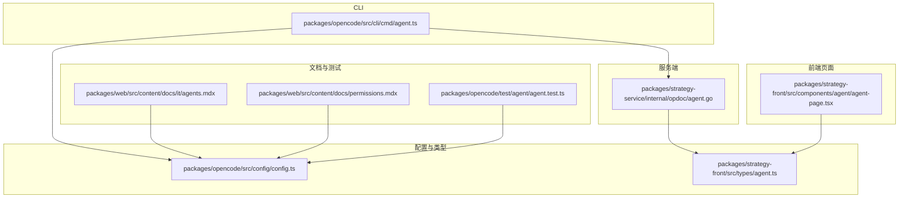
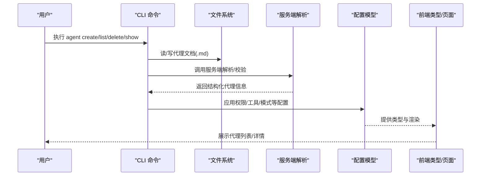

# 代理管理命令

<cite>
**本文引用的文件**
- [packages/opencode/src/cli/cmd/agent.ts](file://packages/opencode/src/cli/cmd/agent.ts)
- [packages/strategy-service/internal/opdoc/agent.go](file://packages/strategy-service/internal/opdoc/agent.go)
- [packages/opencode/src/config/config.ts](file://packages/opencode/src/config/config.ts)
- [packages/web/src/content/docs/it/agents.mdx](file://packages/web/src/content/docs/it/agents.mdx)
- [packages/web/src/content/docs/permissions.mdx](file://packages/web/src/content/docs/permissions.mdx)
- [packages/strategy-front/src/types/agent.ts](file://packages/strategy-front/src/types/agent.ts)
- [packages/strategy-front/src/components/agent/agent-page.tsx](file://packages/strategy-front/src/components/agent/agent-page.tsx)
- [packages/opencode/test/agent/agent.test.ts](file://packages/opencode/test/agent/agent.test.ts)
- [packages/smartx-workflow/src/data/agent.ts](file://packages/smartx-workflow/src/data/agent.ts)
- [packages/app/src/utils/agent.ts](file://packages/app/src/utils/agent.ts)
- [.opencode/opencode.jsonc](file://.opencode/opencode.jsonc)
</cite>

## 目录
1. [简介](#简介)
2. [项目结构](#项目结构)
3. [核心组件](#核心组件)
4. [架构总览](#架构总览)
5. [详细组件分析](#详细组件分析)
6. [依赖关系分析](#依赖关系分析)
7. [性能考量](#性能考量)
8. [故障排除指南](#故障排除指南)
9. [结论](#结论)
10. [附录](#附录)

## 简介
本文件系统性梳理代理（Agent）管理命令，覆盖 agent create、agent list、agent delete、agent show 等核心能力。文档面向不同技术背景的读者，既提供命令语法与参数说明，也给出最佳实践、配置模板、权限管理、生命周期管理、批量操作与故障排除建议。

## 项目结构
代理管理涉及 CLI 命令、服务端文档解析、前端类型与页面、配置模型与测试验证等多个模块。下图展示关键文件之间的关系：

图表来源
- [packages/opencode/src/cli/cmd/agent.ts:1-258](file://packages/opencode/src/cli/cmd/agent.ts#L1-L258)
- [packages/strategy-service/internal/opdoc/agent.go:1-212](file://packages/strategy-service/internal/opdoc/agent.go#L1-L212)
- [packages/opencode/src/config/config.ts:738-809](file://packages/opencode/src/config/config.ts#L738-L809)
- [packages/strategy-front/src/types/agent.ts:1-47](file://packages/strategy-front/src/types/agent.ts#L1-L47)
- [packages/strategy-front/src/components/agent/agent-page.tsx:1-45](file://packages/strategy-front/src/components/agent/agent-page.tsx#L1-L45)
- [packages/web/src/content/docs/it/agents.mdx:401-467](file://packages/web/src/content/docs/it/agents.mdx#L401-L467)
- [packages/web/src/content/docs/permissions.mdx:201-237](file://packages/web/src/content/docs/permissions.mdx#L201-L237)
- [packages/opencode/test/agent/agent.test.ts:193-247](file://packages/opencode/test/agent/agent.test.ts#L193-L247)

章节来源
- [packages/opencode/src/cli/cmd/agent.ts:1-258](file://packages/opencode/src/cli/cmd/agent.ts#L1-L258)
- [packages/strategy-service/internal/opdoc/agent.go:1-212](file://packages/strategy-service/internal/opdoc/agent.go#L1-L212)
- [packages/opencode/src/config/config.ts:738-809](file://packages/opencode/src/config/config.ts#L738-L809)
- [packages/strategy-front/src/types/agent.ts:1-47](file://packages/strategy-front/src/types/agent.ts#L1-L47)
- [packages/strategy-front/src/components/agent/agent-page.tsx:1-45](file://packages/strategy-front/src/components/agent/agent-page.tsx#L1-L45)
- [packages/web/src/content/docs/it/agents.mdx:401-467](file://packages/web/src/content/docs/it/agents.mdx#L401-L467)
- [packages/web/src/content/docs/permissions.mdx:201-237](file://packages/web/src/content/docs/permissions.mdx#L201-L237)
- [packages/opencode/test/agent/agent.test.ts:193-247](file://packages/opencode/test/agent/agent.test.ts#L193-L247)

## 核心组件
- CLI 代理命令：提供交互式与非交互式两种模式，支持创建、列出、删除、显示代理文档。
- 服务端代理文档解析：负责代理文档的读取、校验、序列化与持久化。
- 配置与类型：统一代理配置模型（含权限、工具、模式、步数等），并与前端类型保持一致。
- 权限与工具：通过权限策略控制工具访问范围，支持全局与按代理覆盖。
- 测试与文档：通过测试用例验证权限合并、默认值与兼容性；通过文档说明使用场景与最佳实践。

章节来源
- [packages/opencode/src/cli/cmd/agent.ts:31-257](file://packages/opencode/src/cli/cmd/agent.ts#L31-L257)
- [packages/strategy-service/internal/opdoc/agent.go:149-212](file://packages/strategy-service/internal/opdoc/agent.go#L149-L212)
- [packages/opencode/src/config/config.ts:738-809](file://packages/opencode/src/config/config.ts#L738-L809)
- [packages/web/src/content/docs/it/agents.mdx:411-467](file://packages/web/src/content/docs/it/agents.mdx#L411-L467)
- [packages/web/src/content/docs/permissions.mdx:201-237](file://packages/web/src/content/docs/permissions.mdx#L201-L237)

## 架构总览
下图展示从 CLI 到服务端再到前端的整体流程，以及权限与配置在各层的落地方式：

图表来源
- [packages/opencode/src/cli/cmd/agent.ts:31-257](file://packages/opencode/src/cli/cmd/agent.ts#L31-L257)
- [packages/strategy-service/internal/opdoc/agent.go:149-212](file://packages/strategy-service/internal/opdoc/agent.go#L149-L212)
- [packages/opencode/src/config/config.ts:738-809](file://packages/opencode/src/config/config.ts#L738-L809)
- [packages/strategy-front/src/types/agent.ts:1-47](file://packages/strategy-front/src/types/agent.ts#L1-L47)

## 详细组件分析

### 命令：agent create
- 功能：创建新的代理文档，支持交互式与非交互式模式。
- 语法要点
  - 支持位置选择：当前项目或全局配置目录。
  - 描述必填：用于生成系统提示词与标识符。
  - 工具选择：可选启用的工具集合，默认全部启用。
  - 模式选择：all/primary/subagent。
  - 模型指定：格式为 provider/model。
- 参数与标志
  - --path：目标目录路径（非交互时必须）
  - --description：代理用途描述（非交互时必须）
  - --mode：代理模式（all/primary/subagent）
  - --tools：逗号分隔的工具名列表（留空表示全部启用）
  - -m/--model：模型标识
- 使用场景
  - 快速生成代理模板并进行二次编辑
  - 在 CI 或自动化脚本中批量创建代理
- 最佳实践
  - 非交互模式下务必提供 --path、--description、--mode、--tools
  - 合理限制工具集，遵循最小权限原则
  - 明确代理模式，避免误用
- 参考实现路径
  - [packages/opencode/src/cli/cmd/agent.ts:31-226](file://packages/opencode/src/cli/cmd/agent.ts#L31-L226)

章节来源
- [packages/opencode/src/cli/cmd/agent.ts:31-226](file://packages/opencode/src/cli/cmd/agent.ts#L31-L226)

### 命令：agent list
- 功能：列出所有可用代理，按原生/自定义与名称排序。
- 输出要点
  - 显示代理名称与模式
  - 显示权限配置（JSON 格式）
- 使用场景
  - 查看当前环境中的代理清单
  - 定位特定代理的权限与模式
- 参考实现路径
  - [packages/opencode/src/cli/cmd/agent.ts:228-250](file://packages/opencode/src/cli/cmd/agent.ts#L228-L250)

章节来源
- [packages/opencode/src/cli/cmd/agent.ts:228-250](file://packages/opencode/src/cli/cmd/agent.ts#L228-L250)

### 命令：agent delete
- 功能：删除指定代理文档。
- 实现要点
  - 通过服务端解析模块定位代理文档路径
  - 删除对应 .md 文件
- 使用场景
  - 清理不再使用的代理
  - 回收测试或临时代理
- 参考实现路径
  - [packages/strategy-service/internal/opdoc/agent.go:184-187](file://packages/strategy-service/internal/opdoc/agent.go#L184-L187)

章节来源
- [packages/strategy-service/internal/opdoc/agent.go:184-187](file://packages/strategy-service/internal/opdoc/agent.go#L184-L187)

### 命令：agent show
- 功能：显示指定代理的详细信息（如权限、模式、工具等）。
- 实现要点
  - 通过服务端解析模块读取并解析代理文档
  - 校验与规范化字段（名称、模式、步数等）
- 使用场景
  - 审视代理配置与权限
  - 排查配置不生效的原因
- 参考实现路径
  - [packages/strategy-service/internal/opdoc/agent.go:114-147](file://packages/strategy-service/internal/opdoc/agent.go#L114-L147)

章节来源
- [packages/strategy-service/internal/opdoc/agent.go:114-147](file://packages/strategy-service/internal/opdoc/agent.go#L114-L147)

### 代理权限与工具配置
- 权限层级
  - 全局权限：适用于所有代理
  - 代理级权限：覆盖全局权限
- 工具与权限映射
  - 传统 tools 配置会被转换为 permission
  - 支持通配与精确匹配（如 git *、git commit *）
- 配置示例来源
  - [packages/web/src/content/docs/it/agents.mdx:411-467](file://packages/web/src/content/docs/it/agents.mdx#L411-L467)
  - [packages/web/src/content/docs/permissions.mdx:201-237](file://packages/web/src/content/docs/permissions.mdx#L201-L237)
  - [packages/opencode/src/config/config.ts:774-795](file://packages/opencode/src/config/config.ts#L774-L795)

章节来源
- [packages/web/src/content/docs/it/agents.mdx:411-467](file://packages/web/src/content/docs/it/agents.mdx#L411-L467)
- [packages/web/src/content/docs/permissions.mdx:201-237](file://packages/web/src/content/docs/permissions.mdx#L201-L237)
- [packages/opencode/src/config/config.ts:774-795](file://packages/opencode/src/config/config.ts#L774-L795)

### 代理配置模型与类型
- 关键字段
  - name、model、variant、prompt、description、temperature、top_p、mode、hidden、color、steps、options、permission、disable、tools
- 字段转换
  - tools → permission（兼容旧配置）
  - maxSteps → steps（兼容旧配置）
- 类型定义来源
  - [packages/strategy-front/src/types/agent.ts:1-47](file://packages/strategy-front/src/types/agent.ts#L1-L47)
  - [packages/smartx-workflow/src/data/agent.ts](file://packages/smartx-workflow/src/data/agent.ts)
  - [packages/app/src/utils/agent.ts:1-41](file://packages/app/src/utils/agent.ts#L1-L41)

章节来源
- [packages/strategy-front/src/types/agent.ts:1-47](file://packages/strategy-front/src/types/agent.ts#L1-L47)
- [packages/smartx-workflow/src/data/agent.ts](file://packages/smartx-workflow/src/data/agent.ts)
- [packages/app/src/utils/agent.ts:1-41](file://packages/app/src/utils/agent.ts#L1-L41)

### 代理生命周期与状态
- 生命周期阶段
  - 创建：生成文档与基础配置
  - 运行：加载到运行时，参与会话调度
  - 更新：修改权限、工具、模式等
  - 删除：移除文档
- 状态监控
  - 通过 agent list 查看代理模式与权限
  - 通过前端页面查看代理来源（内置/自定义）与更新时间
- 参考实现路径
  - [packages/strategy-front/src/components/agent/agent-page.tsx:16-45](file://packages/strategy-front/src/components/agent/agent-page.tsx#L16-L45)

章节来源
- [packages/strategy-front/src/components/agent/agent-page.tsx:16-45](file://packages/strategy-front/src/components/agent/agent-page.tsx#L16-L45)

### 批量代理操作
- 批量创建
  - 使用非交互模式配合脚本循环调用 agent create
  - 注意：需为每个代理提供唯一 --path、--description、--mode、--tools
- 批量删除
  - 通过服务端解析模块定位并删除多个代理文档
- 批量权限调整
  - 通过编辑代理文档的 frontmatter 或全局配置文件批量应用权限策略

章节来源
- [packages/opencode/src/cli/cmd/agent.ts:67-226](file://packages/opencode/src/cli/cmd/agent.ts#L67-L226)
- [packages/strategy-service/internal/opdoc/agent.go:174-187](file://packages/strategy-service/internal/opdoc/agent.go#L174-L187)

### 代理权限管理
- 权限策略
  - ask：执行前需要确认
  - allow：允许无条件执行
  - deny：禁用该工具
- 模式匹配
  - 支持通配符与精确匹配，便于精细化控制
- 配置优先级
  - 代理级覆盖全局级
- 参考实现路径
  - [packages/web/src/content/docs/it/agents.mdx:411-467](file://packages/web/src/content/docs/it/agents.mdx#L411-L467)
  - [packages/web/src/content/docs/permissions.mdx:201-237](file://packages/web/src/content/docs/permissions.mdx#L201-L237)
  - [packages/opencode/test/agent/agent.test.ts:199-242](file://packages/opencode/test/agent/agent.test.ts#L199-L242)

章节来源
- [packages/web/src/content/docs/it/agents.mdx:411-467](file://packages/web/src/content/docs/it/agents.mdx#L411-L467)
- [packages/web/src/content/docs/permissions.mdx:201-237](file://packages/web/src/content/docs/permissions.mdx#L201-L237)
- [packages/opencode/test/agent/agent.test.ts:199-242](file://packages/opencode/test/agent/agent.test.ts#L199-L242)

### 代理配置模板示例
- 全局配置模板
  - 参考：[.opencode/opencode.jsonc:1-19](file://.opencode/opencode.jsonc#L1-L19)
- 代理文档模板
  - 参考：[packages/strategy-front/src/components/agent/agent-page.tsx:16-28](file://packages/strategy-front/src/components/agent/agent-page.tsx#L16-L28)

章节来源
- [.opencode/opencode.jsonc:1-19](file://.opencode/opencode.jsonc#L1-L19)
- [packages/strategy-front/src/components/agent/agent-page.tsx:16-28](file://packages/strategy-front/src/components/agent/agent-page.tsx#L16-L28)

## 依赖关系分析
- CLI 依赖服务端解析模块以完成文件读写与校验
- 配置模型在多处被复用（CLI、服务端、前端）
- 权限与工具配置在配置层统一转换，保证一致性

图表来源
- [packages/opencode/src/cli/cmd/agent.ts:1-12](file://packages/opencode/src/cli/cmd/agent.ts#L1-L12)
- [packages/strategy-service/internal/opdoc/agent.go:1-12](file://packages/strategy-service/internal/opdoc/agent.go#L1-L12)
- [packages/opencode/src/config/config.ts:738-746](file://packages/opencode/src/config/config.ts#L738-L746)

章节来源
- [packages/opencode/src/cli/cmd/agent.ts:1-12](file://packages/opencode/src/cli/cmd/agent.ts#L1-L12)
- [packages/strategy-service/internal/opdoc/agent.go:1-12](file://packages/strategy-service/internal/opdoc/agent.go#L1-L12)
- [packages/opencode/src/config/config.ts:738-746](file://packages/opencode/src/config/config.ts#L738-L746)

## 性能考量
- 非交互模式下避免不必要的 I/O 与网络请求，直接输出路径或错误码
- 批量操作时尽量减少重复解析与序列化
- 权限评估采用快速匹配策略，优先使用精确匹配减少模糊匹配开销

## 故障排除指南
- 代理文件已存在
  - 现象：非交互模式下创建同名代理失败
  - 处理：更换 --path 或 --description，或先删除再创建
  - 参考：[packages/opencode/src/cli/cmd/agent.ts:206-213](file://packages/opencode/src/cli/cmd/agent.ts#L206-L213)
- 代理名称不合法
  - 现象：名称包含非法字符或仅数字
  - 处理：使用小写字母、数字、连字符与下划线的组合，且不能仅由数字组成
  - 参考：[packages/strategy-service/internal/opdoc/agent.go:49-59](file://packages/strategy-service/internal/opdoc/agent.go#L49-L59)
- 步数配置无效
  - 现象：steps 非正整数
  - 处理：设置为大于 0 的整数
  - 参考：[packages/strategy-service/internal/opdoc/agent.go:98-112](file://packages/strategy-service/internal/opdoc/agent.go#L98-L112)
- 权限未生效
  - 现象：代理权限与预期不符
  - 处理：检查全局与代理级权限覆盖关系，确认 frontmatter 与配置文件
  - 参考：[packages/opencode/test/agent/agent.test.ts:199-242](file://packages/opencode/test/agent/agent.test.ts#L199-L242)

章节来源
- [packages/opencode/src/cli/cmd/agent.ts:206-213](file://packages/opencode/src/cli/cmd/agent.ts#L206-L213)
- [packages/strategy-service/internal/opdoc/agent.go:49-59](file://packages/strategy-service/internal/opdoc/agent.go#L49-L59)
- [packages/strategy-service/internal/opdoc/agent.go:98-112](file://packages/strategy-service/internal/opdoc/agent.go#L98-L112)
- [packages/opencode/test/agent/agent.test.ts:199-242](file://packages/opencode/test/agent/agent.test.ts#L199-L242)

## 结论
本文系统梳理了代理管理命令的语法、参数、使用场景与最佳实践，并结合服务端解析、配置模型与前端类型，给出了权限管理、生命周期管理、批量操作与故障排除的实操指南。建议在生产环境中遵循最小权限原则，合理规划代理模式与工具集，并通过测试用例保障配置变更的稳定性。

## 附录
- 相关文档与测试
  - [packages/web/src/content/docs/it/agents.mdx:411-467](file://packages/web/src/content/docs/it/agents.mdx#L411-L467)
  - [packages/web/src/content/docs/permissions.mdx:201-237](file://packages/web/src/content/docs/permissions.mdx#L201-L237)
  - [packages/opencode/test/agent/agent.test.ts:193-247](file://packages/opencode/test/agent/agent.test.ts#L193-L247)
- 配置与类型参考
  - [packages/opencode/src/config/config.ts:738-809](file://packages/opencode/src/config/config.ts#L738-L809)
  - [packages/strategy-front/src/types/agent.ts:1-47](file://packages/strategy-front/src/types/agent.ts#L1-L47)
  - [packages/strategy-front/src/components/agent/agent-page.tsx:1-45](file://packages/strategy-front/src/components/agent/agent-page.tsx#L1-L45)