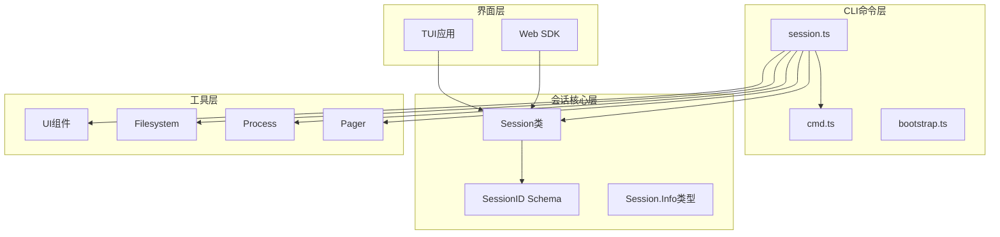
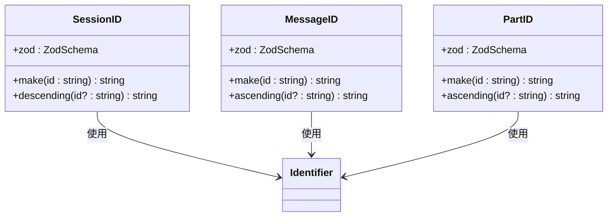
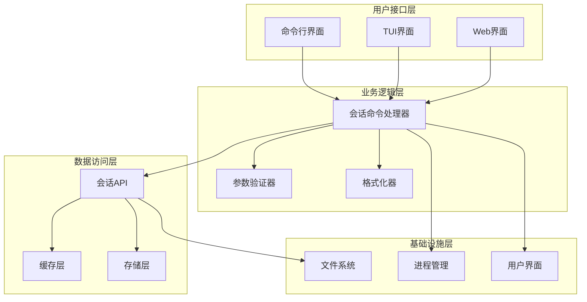
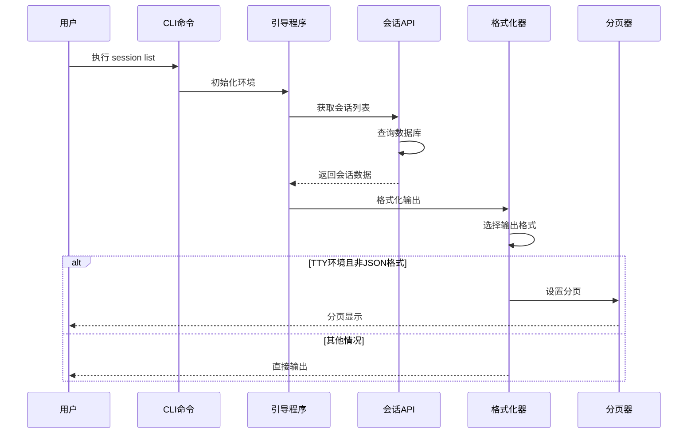
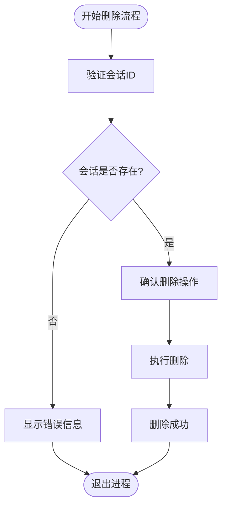
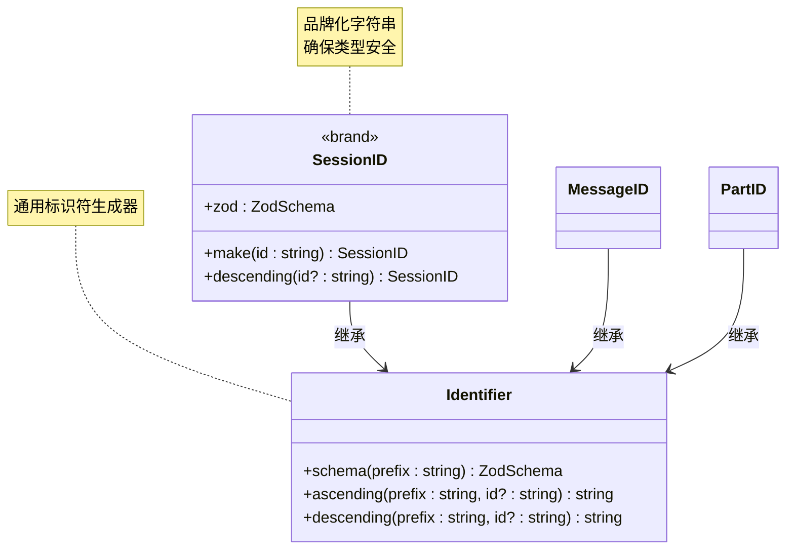
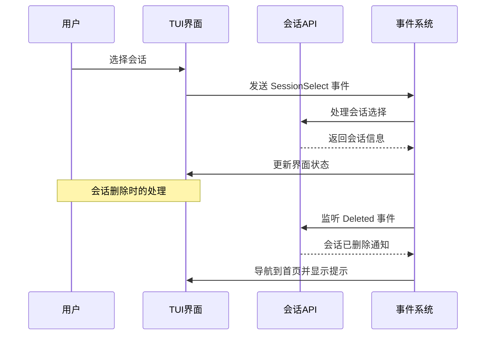
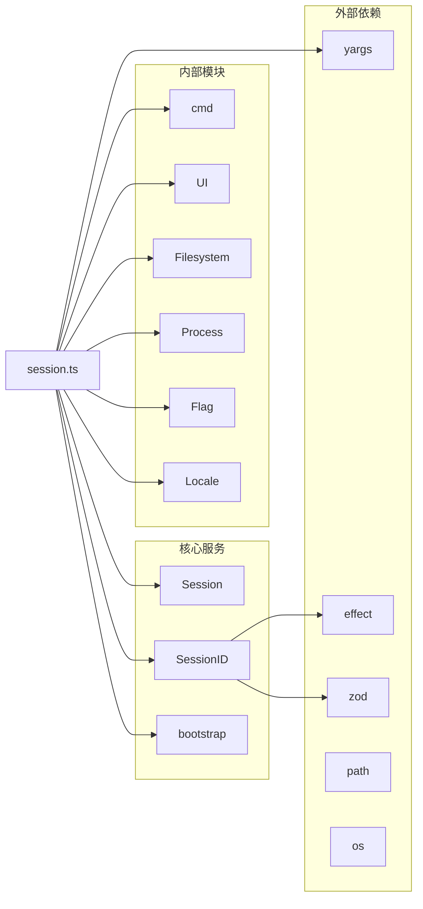

# 会话管理命令

<cite>
**本文档引用的文件**
- [session.ts](file://packages/opencode/src/cli/cmd/session.ts)
- [schema.ts](file://packages/opencode/src/session/schema.ts)
- [app.tsx](file://packages/opencode/src/cli/cmd/tui/app.tsx)
- [sdk.mdx](file://packages/web/src/content/docs/zh-cn/sdk.mdx)
</cite>

## 目录
1. [简介](#简介)
2. [项目结构](#项目结构)
3. [核心组件](#核心组件)
4. [架构概览](#架构概览)
5. [详细组件分析](#详细组件分析)
6. [依赖关系分析](#依赖关系分析)
7. [性能考虑](#性能考虑)
8. [故障排除指南](#故障排除指南)
9. [结论](#结论)

## 简介

会话管理命令是 OpenCode 平台中的核心功能模块，负责管理系统中所有会话的生命周期管理。该模块提供了完整的会话操作能力，包括会话的创建、查询、删除、导出和导入等功能。通过命令行界面和图形用户界面两种方式，用户可以高效地管理大量的会话数据。

会话管理命令基于统一的会话标识符系统和标准化的数据格式，确保了不同环境下的兼容性和一致性。该模块支持多种输出格式（表格和JSON），并集成了分页显示功能，为用户提供最佳的交互体验。

## 项目结构

会话管理命令在项目中的组织结构如下：

**图表来源**
- [session.ts:1-160](file://packages/opencode/src/cli/cmd/session.ts#L1-L160)
- [schema.ts:1-39](file://packages/opencode/src/session/schema.ts#L1-L39)

**章节来源**
- [session.ts:1-160](file://packages/opencode/src/cli/cmd/session.ts#L1-L160)
- [schema.ts:1-39](file://packages/opencode/src/session/schema.ts#L1-L39)

## 核心组件

### 会话命令主入口

会话管理命令的主入口定义在 `session.ts` 文件中，提供了完整的命令结构和参数配置。

主要特性：
- 支持子命令模式：list、delete 等
- 参数验证和错误处理
- 输出格式化支持
- 分页显示功能

### 会话ID标识符系统

会话ID采用品牌化字符串设计，确保类型安全和唯一性：

**图表来源**
- [schema.ts:7-39](file://packages/opencode/src/session/schema.ts#L7-L39)

**章节来源**
- [session.ts:42-47](file://packages/opencode/src/cli/cmd/session.ts#L42-L47)
- [schema.ts:1-39](file://packages/opencode/src/session/schema.ts#L1-L39)

## 架构概览

会话管理命令采用分层架构设计，确保各层职责清晰分离：

**图表来源**
- [session.ts:1-160](file://packages/opencode/src/cli/cmd/session.ts#L1-L160)

## 详细组件分析

### 会话列表命令 (session list)

会话列表命令提供会话的查询和展示功能：

**图表来源**
- [session.ts:74-128](file://packages/opencode/src/cli/cmd/session.ts#L74-L128)

主要功能特性：
- 支持限制返回数量（--max-count/-n）
- 支持输出格式选择（table/json）
- 自动分页显示（TTY环境）
- 本地化时间格式化
- 动态列宽计算

**章节来源**
- [session.ts:74-128](file://packages/opencode/src/cli/cmd/session.ts#L74-L128)

### 会话删除命令 (session delete)

会话删除命令提供安全的会话移除功能：

**图表来源**
- [session.ts:49-72](file://packages/opencode/src/cli/cmd/session.ts#L49-L72)

安全特性：
- 会话存在性检查
- 错误处理和用户反馈
- 进程退出码管理

**章节来源**
- [session.ts:49-72](file://packages/opencode/src/cli/cmd/session.ts#L49-L72)

### 会话ID生成和验证

会话ID系统采用品牌化设计，确保类型安全：

**图表来源**
- [schema.ts:7-14](file://packages/opencode/src/session/schema.ts#L7-L14)

**章节来源**
- [schema.ts:1-39](file://packages/opencode/src/session/schema.ts#L1-L39)

### TUI界面集成

TUI界面提供了会话管理的图形化操作：

**图表来源**
- [app.tsx:693-708](file://packages/opencode/src/cli/cmd/tui/app.tsx#L693-L708)

**章节来源**
- [app.tsx:681-731](file://packages/opencode/src/cli/cmd/tui/app.tsx#L681-L731)

## 依赖关系分析

会话管理命令的依赖关系图：

**图表来源**
- [session.ts:1-14](file://packages/opencode/src/cli/cmd/session.ts#L1-L14)

**章节来源**
- [session.ts:1-14](file://packages/opencode/src/cli/cmd/session.ts#L1-L14)

## 性能考虑

### 输出优化策略

1. **分页显示优化**
   - TTY环境自动启用分页器
   - 支持less/more等标准分页工具
   - Git Bash环境下的特殊处理

2. **内存使用优化**
   - 流式输出避免大对象内存占用
   - 条件加载减少不必要的资源消耗
   - 本地化字符串处理优化

3. **网络和I/O优化**
   - 批量查询减少数据库连接次数
   - 缓存机制提升重复查询性能
   - 异步处理避免阻塞主线程

### 可扩展性设计

- 模块化架构便于功能扩展
- 接口抽象支持多后端实现
- 配置驱动的输出格式支持
- 插件化的格式化器系统

## 故障排除指南

### 常见问题和解决方案

1. **会话不存在错误**
   - 现象：执行删除或查询时提示会话不存在
   - 解决方案：使用 `session list` 查看可用会话ID
   - 预防措施：在执行删除前先验证会话ID

2. **权限不足问题**
   - 现象：无法访问某些会话或执行删除操作
   - 解决方案：检查用户权限和会话所有权
   - 预防措施：使用适当的认证凭据

3. **输出格式问题**
   - 现象：JSON格式输出异常或表格显示错位
   - 解决方案：检查 --format 参数设置
   - 预防措施：根据需求选择合适的输出格式

4. **分页器问题**
   - 现象：分页显示不正常或无输出
   - 解决方案：检查less/more程序安装情况
   - 预防措施：确保终端环境配置正确

**章节来源**
- [session.ts:59-70](file://packages/opencode/src/cli/cmd/session.ts#L59-L70)

## 结论

会话管理命令提供了完整、高效、安全的会话生命周期管理功能。通过命令行和图形界面的双重支持，用户可以在不同场景下灵活地管理会话数据。

该模块的主要优势包括：
- **类型安全**：基于品牌化字符串的ID系统
- **用户体验**：直观的命令语法和丰富的输出选项
- **可靠性**：完善的错误处理和安全检查
- **可扩展性**：模块化设计支持未来功能扩展

建议的后续改进方向：
- 添加会话导出/导入功能
- 实现批量操作支持
- 增强会话模板和共享功能
- 优化性能和内存使用
- 扩展Web界面功能