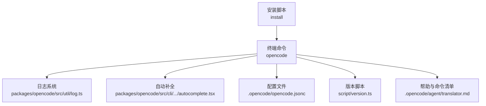
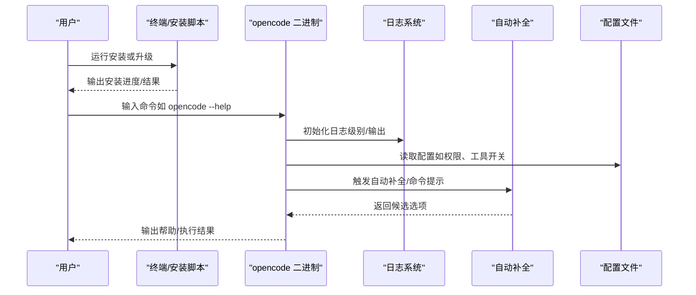
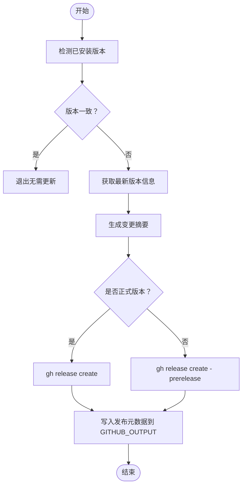
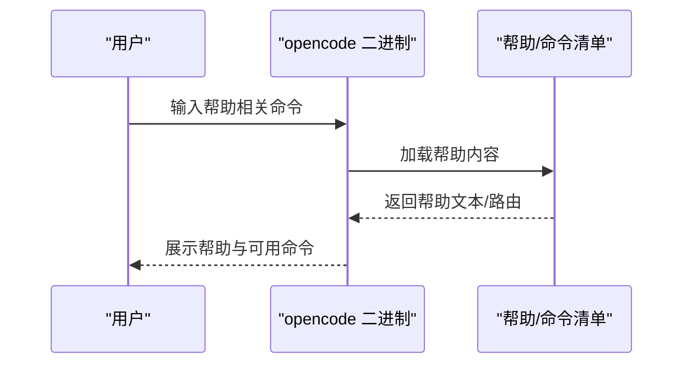
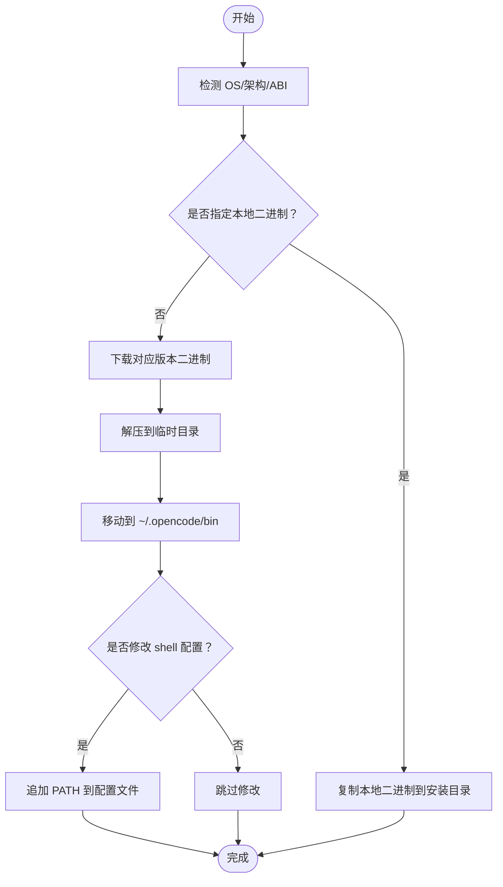
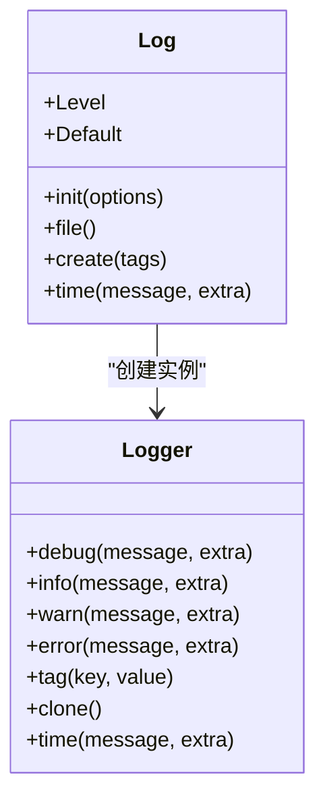
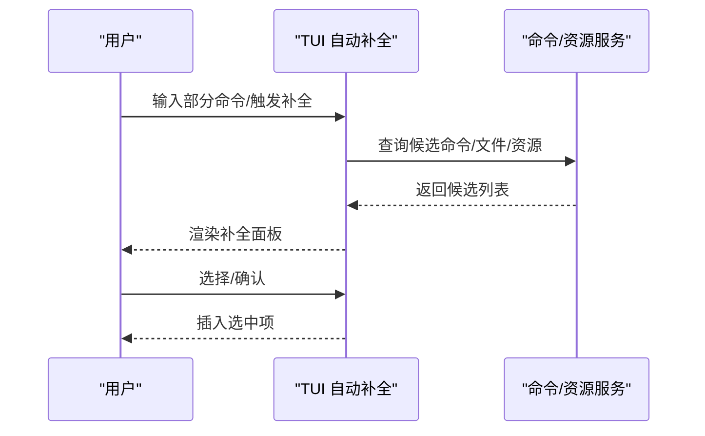
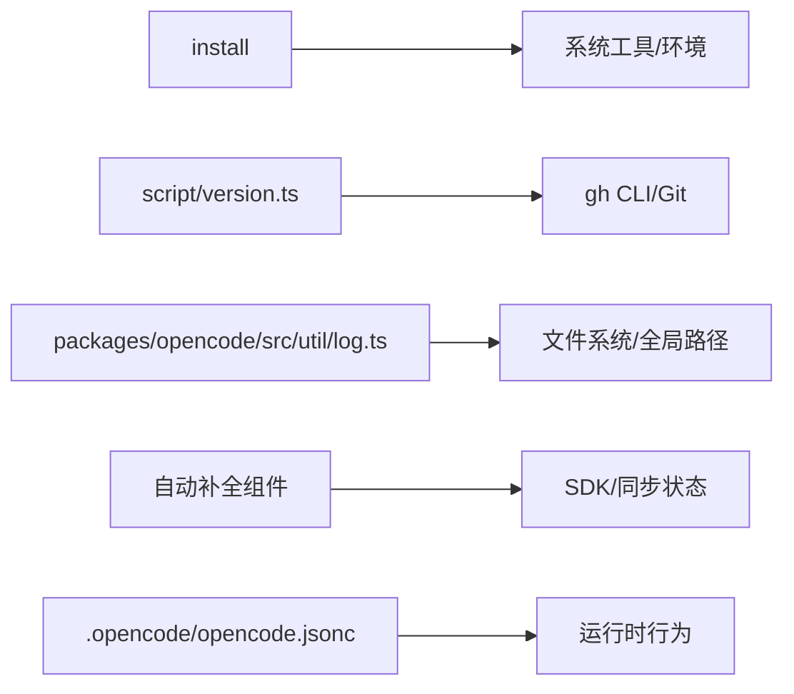

# 工具命令

<cite>
**本文引用的文件**
- [README.md](file://README.md)
- [install](file://install)
- [script/version.ts](file://script/version.ts)
- [.opencode/opencode.jsonc](file://.opencode/opencode.jsonc)
- [packages/opencode/src/util/log.ts](file://packages/opencode/src/util/log.ts)
- [packages/opencode/src/cli/cmd/tui/component/prompt/autocomplete.tsx](file://packages/opencode/src/cli/cmd/tui/component/prompt/autocomplete.tsx)
- [.opencode/agent/translator.md](file://.opencode/agent/translator.md)
</cite>

## 目录
1. [简介](#简介)
2. [项目结构](#项目结构)
3. [核心组件](#核心组件)
4. [架构总览](#架构总览)
5. [详细组件分析](#详细组件分析)
6. [依赖关系分析](#依赖关系分析)
7. [性能考虑](#性能考虑)
8. [故障排查指南](#故障排查指南)
9. [结论](#结论)
10. [附录](#附录)

## 简介
本文件面向“工具命令”的使用与运维，覆盖以下主题：
- 版本检查：如何查看当前版本、比较版本差异、在 CI 中发布新版本。
- 帮助系统：内置帮助命令与交互式帮助入口。
- 初始化向导：安装脚本与初始化流程。
- 健康检查：运行环境诊断、日志与错误定位。
- 终端集成：自动补全、别名设置、快捷键配置。
- 调试与诊断：日志级别、性能计时、系统诊断工具。

本指南以仓库中的安装脚本、版本脚本、日志模块与 TUI 自动补全组件为依据，结合配置文件与翻译器文档中的命令清单，形成可操作的使用说明与排障建议。

## 项目结构
围绕“工具命令”，本仓库的关键位置如下：
- 安装与升级：install（安装脚本）、README.md（安装说明）
- 版本管理：script/version.ts（版本号与发布流程）
- 配置与行为：.opencode/opencode.jsonc（默认配置示例）
- 日志与诊断：packages/opencode/src/util/log.ts（日志级别与输出）
- 终端交互：packages/opencode/src/cli/cmd/tui/component/prompt/autocomplete.tsx（自动补全与命令提示）
- 命令参考：.opencode/agent/translator.md（命令与参数清单）

图表来源
- [install](file://install)
- [script/version.ts](file://script/version.ts)
- [.opencode/opencode.jsonc](file://.opencode/opencode.jsonc)
- [packages/opencode/src/util/log.ts](file://packages/opencode/src/util/log.ts)
- [packages/opencode/src/cli/cmd/tui/component/prompt/autocomplete.tsx](file://packages/opencode/src/cli/cmd/tui/component/prompt/autocomplete.tsx)
- [.opencode/agent/translator.md](file://.opencode/agent/translator.md)

章节来源
- [README.md:46-100](file://README.md#L46-L100)
- [install:1-461](file://install#L1-L461)

## 核心组件
- 版本检查与发布
  - 使用安装脚本检测已安装版本；通过版本脚本在 CI 中生成发布信息。
- 帮助系统
  - 提供内置帮助命令与交互式帮助入口；命令清单见翻译器文档。
- 初始化向导
  - 安装脚本负责下载二进制、写入 PATH、处理 shell 配置文件。
- 健康检查
  - 日志系统支持不同级别输出与文件落盘；自动补全组件提供交互式命令提示。
- 终端集成
  - 自动补全支持命令与资源检索；可结合别名与快捷键提升效率。

章节来源
- [install:221-235](file://install#L221-L235)
- [script/version.ts:1-35](file://script/version.ts#L1-L35)
- [.opencode/agent/translator.md:483-534](file://.opencode/agent/translator.md#L483-L534)
- [packages/opencode/src/util/log.ts:1-182](file://packages/opencode/src/util/log.ts#L1-L182)
- [packages/opencode/src/cli/cmd/tui/component/prompt/autocomplete.tsx:31-356](file://packages/opencode/src/cli/cmd/tui/component/prompt/autocomplete.tsx#L31-L356)

## 架构总览
下图展示“工具命令”在终端中的典型调用路径：用户输入命令 → 安装脚本/二进制 → 日志系统 → 自动补全/命令解析 → 配置读取 → 执行与输出。

图表来源
- [install:327-359](file://install#L327-L359)
- [packages/opencode/src/util/log.ts:60-78](file://packages/opencode/src/util/log.ts#L60-L78)
- [packages/opencode/src/cli/cmd/tui/component/prompt/autocomplete.tsx:66-356](file://packages/opencode/src/cli/cmd/tui/component/prompt/autocomplete.tsx#L66-L356)
- [.opencode/opencode.jsonc:1-19](file://.opencode/opencode.jsonc#L1-L19)

## 详细组件分析

### 版本检查与发布
- 当前版本识别
  - 安装脚本会检测已安装版本并提示是否需要更新。
- 发布流程（CI 场景）
  - 版本脚本读取最新发行版，生成变更摘要，调用 gh CLI 创建预发布或正式发布，并回写发布元数据到环境变量。
- 实用建议
  - 在 CI 中使用版本脚本输出 release 与 tag，便于下游任务引用。
  - 本地开发可使用 --version 指定目标版本进行安装测试。

图表来源
- [install:221-235](file://install#L221-L235)
- [script/version.ts:7-32](file://script/version.ts#L7-L32)

章节来源
- [install:221-235](file://install#L221-L235)
- [script/version.ts:1-35](file://script/version.ts#L1-L35)

### 帮助系统
- 内置帮助
  - 支持 /help 路由与交互式帮助入口；命令清单与参数列表见翻译器文档。
- 快速上手
  - README 提供安装方式与基本使用提示，适合首次接触者快速入门。

图表来源
- [.opencode/agent/translator.md:420-481](file://.opencode/agent/translator.md#L420-L481)
- [README.md:46-100](file://README.md#L46-L100)

章节来源
- [.opencode/agent/translator.md:420-481](file://.opencode/agent/translator.md#L420-L481)
- [README.md:46-100](file://README.md#L46-L100)

### 初始化向导与安装
- 自动安装
  - 安装脚本根据操作系统与架构选择合适的二进制包，下载并解压至 ~/.opencode/bin，自动写入 PATH 并提示重启终端。
- 本地二进制安装
  - 支持 --binary 指定本地二进制文件进行安装。
- 版本指定
  - 支持 --version 指定安装特定版本，若版本不存在则报错并提示可用版本列表。

图表来源
- [install:68-205](file://install#L68-L205)
- [install:327-359](file://install#L327-L359)
- [install:362-439](file://install#L362-L439)

章节来源
- [install:1-461](file://install#L1-L461)

### 健康检查与诊断
- 日志系统
  - 支持 DEBUG/INFO/WARN/ERROR 四级日志；可选择控制台打印或文件落盘；提供时间计时能力用于性能观测。
- 常见问题定位
  - 通过调整日志级别快速定位问题；结合文件落盘定位异常堆栈。
- 自动补全辅助
  - TUI 自动补全组件提供命令与资源检索，减少误操作导致的错误。

图表来源
- [packages/opencode/src/util/log.ts:8-182](file://packages/opencode/src/util/log.ts#L8-L182)

章节来源
- [packages/opencode/src/util/log.ts:1-182](file://packages/opencode/src/util/log.ts#L1-L182)
- [packages/opencode/src/cli/cmd/tui/component/prompt/autocomplete.tsx:31-356](file://packages/opencode/src/cli/cmd/tui/component/prompt/autocomplete.tsx#L31-L356)

### 终端集成：自动补全、别名与快捷键
- 自动补全
  - 支持命令与资源检索，提供候选列表与描述信息，提升输入效率。
- 别名设置
  - 可在 shell 配置中添加别名（例如将常用命令简化），安装脚本会尝试自动写入 PATH。
- 快捷键配置
  - TUI 中可通过快捷键打开帮助、模型选择、会话管理等界面，提高交互效率。

图表来源
- [packages/opencode/src/cli/cmd/tui/component/prompt/autocomplete.tsx:66-356](file://packages/opencode/src/cli/cmd/tui/component/prompt/autocomplete.tsx#L66-L356)

章节来源
- [packages/opencode/src/cli/cmd/tui/component/prompt/autocomplete.tsx:31-356](file://packages/opencode/src/cli/cmd/tui/component/prompt/autocomplete.tsx#L31-L356)
- [install:362-439](file://install#L362-L439)

## 依赖关系分析
- 安装脚本依赖系统工具（curl、tar/unzip、uname、sed 等）与 shell 配置文件。
- 版本脚本依赖 gh CLI 与 Git 元信息。
- 日志系统依赖全局路径与文件系统。
- 自动补全组件依赖 SDK/同步状态与主题配置。
- 配置文件影响工具行为（如权限、工具开关）。

图表来源
- [install:1-461](file://install#L1-L461)
- [script/version.ts:1-35](file://script/version.ts#L1-L35)
- [packages/opencode/src/util/log.ts:1-182](file://packages/opencode/src/util/log.ts#L1-L182)
- [packages/opencode/src/cli/cmd/tui/component/prompt/autocomplete.tsx:31-356](file://packages/opencode/src/cli/cmd/tui/component/prompt/autocomplete.tsx#L31-L356)
- [.opencode/opencode.jsonc:1-19](file://.opencode/opencode.jsonc#L1-L19)

章节来源
- [install:1-461](file://install#L1-L461)
- [script/version.ts:1-35](file://script/version.ts#L1-L35)
- [packages/opencode/src/util/log.ts:1-182](file://packages/opencode/src/util/log.ts#L1-L182)
- [packages/opencode/src/cli/cmd/tui/component/prompt/autocomplete.tsx:31-356](file://packages/opencode/src/cli/cmd/tui/component/prompt/autocomplete.tsx#L31-L356)
- [.opencode/opencode.jsonc:1-19](file://.opencode/opencode.jsonc#L1-L19)

## 性能考虑
- 日志级别
  - 生产环境建议 INFO 或更高；调试阶段可临时降为 DEBUG 以获取更细粒度信息。
- 计时与采样
  - 使用日志计时能力对关键路径进行采样，避免在高频场景中过度输出。
- 自动补全
  - 合理利用候选数量与过滤策略，减少不必要的网络/文件系统查询。

## 故障排查指南
- 安装失败
  - 检查系统工具是否齐全（curl、tar/unzip）；确认架构匹配；必要时使用 --binary 指定本地二进制。
- 版本不一致
  - 使用安装脚本检测当前版本；若不一致，按提示升级或指定 --version。
- 命令不可用
  - 确认 PATH 是否包含 ~/.opencode/bin；若未自动写入，手动追加后重启终端。
- 日志问题
  - 查看日志文件路径；调整日志级别；关注 ERROR/WARN 级别输出定位异常。
- 自动补全无响应
  - 检查 TUI 状态与候选查询；确认 SDK/同步状态正常。

章节来源
- [install:221-235](file://install#L221-L235)
- [install:362-439](file://install#L362-L439)
- [packages/opencode/src/util/log.ts:52-78](file://packages/opencode/src/util/log.ts#L52-L78)
- [packages/opencode/src/cli/cmd/tui/component/prompt/autocomplete.tsx:31-356](file://packages/opencode/src/cli/cmd/tui/component/prompt/autocomplete.tsx#L31-L356)

## 结论
通过安装脚本、版本脚本、日志系统与自动补全组件的协同，工具命令提供了从安装部署到日常使用的完整闭环。建议在团队内统一别名与快捷键配置，结合日志级别与计时能力进行性能与稳定性治理，并在 CI 中使用版本脚本自动化发布流程。

## 附录
- 常用命令参考（摘自翻译器文档）
  - 版本：opencode --version
  - 帮助：/help、/command、/config、/log 等
  - 初始化：opencode /init（如存在）
  - 健康检查：/global/health（如存在）
  - 日志：/log（如存在）
- 环境变量与配置
  - OPENCODE_CONFIG、OPENCODE_CONFIG_DIR、OPENCODE_PORT 等可用于定制行为。
- 安装与升级
  - 使用 README 提供的安装方式；或使用 install 脚本进行升级与路径修正。

章节来源
- [.opencode/agent/translator.md:330-481](file://.opencode/agent/translator.md#L330-L481)
- [.opencode/agent/translator.md:536-632](file://.opencode/agent/translator.md#L536-L632)
- [README.md:46-100](file://README.md#L46-L100)