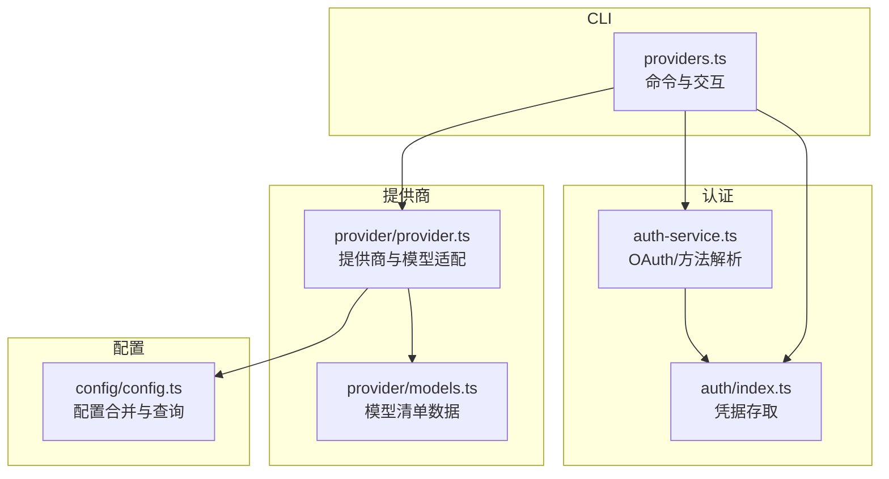
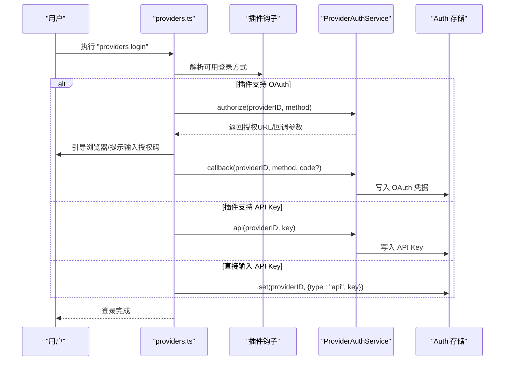
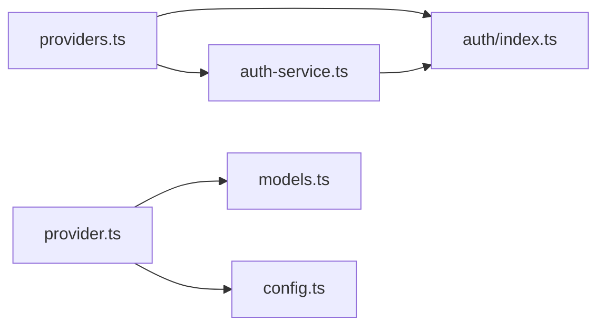

# 模型提供商命令

<cite>
**本文引用的文件**
- [packages/opencode/src/cli/cmd/providers.ts](file://packages/opencode/src/cli/cmd/providers.ts)
- [packages/opencode/src/provider/provider.ts](file://packages/opencode/src/provider/provider.ts)
- [packages/opencode/src/provider/models.ts](file://packages/opencode/src/provider/models.ts)
- [packages/opencode/src/provider/auth.ts](file://packages/opencode/src/provider/auth.ts)
- [packages/opencode/src/provider/auth-service.ts](file://packages/opencode/src/provider/auth-service.ts)
- [packages/opencode/src/auth/index.ts](file://packages/opencode/src/auth/index.ts)
- [packages/opencode/src/config/config.ts](file://packages/opencode/src/config/config.ts)
- [packages/web/src/content/docs/zh-cn/providers.mdx](file://packages/web/src/content/docs/zh-cn/providers.mdx)
- [packages/web/src/content/docs/it/server.mdx](file://packages/web/src/content/docs/it/server.mdx)
- [packages/web/src/content/docs/sdksdk.mdx](file://packages/web/src/content/docs/sdksdk.mdx)
- [packages/app/src/components/settings-providers.tsx](file://packages/app/src/components/settings-providers.tsx)
- [packages/app/src/components/dialog-custom-provider-form.ts](file://packages/app/src/components/dialog-custom-provider-form.ts)
- [packages/opencode/test/cli/plugin-auth-picker.test.ts](file://packages/opencode/test/cli/plugin-auth-picker.test.ts)
- [packages/opencode/test/provider/provider.test.ts](file://packages/opencode/test/provider/provider.test.ts)
</cite>

## 目录
1. [简介](#简介)
2. [项目结构](#项目结构)
3. [核心组件](#核心组件)
4. [架构总览](#架构总览)
5. [详细组件分析](#详细组件分析)
6. [依赖关系分析](#依赖关系分析)
7. [性能考量](#性能考量)
8. [故障排查指南](#故障排查指南)
9. [结论](#结论)
10. [附录](#附录)

## 简介
本文件系统性地阐述“模型提供商管理命令”，覆盖以下子命令与能力：
- providers list：列出已配置的提供商及凭据类型
- providers login：登录提供商（支持 OAuth 与 API Key）
- providers logout：移除指定提供商的凭据
- 以及与之配套的“配置认证信息、管理 API 密钥与访问凭据”的流程与最佳实践

同时，文档还涵盖：
- 支持的提供商列表与特性
- 配置验证与连接测试思路
- 多提供商配置、负载均衡与故障转移的高级用法示例
- 常见问题定位与排错方法

## 项目结构
围绕“模型提供商命令”的关键模块分布如下：
- CLI 层：解析命令、交互式提示、调用认证与配置服务
- 认证层：统一的凭据存储与 OAuth 流程封装
- 提供商层：内置与自定义提供商的加载、模型清单与运行时适配
- 配置层：合并多源配置（远程、全局、项目、企业托管等），并提供查询接口

图表来源
- [packages/opencode/src/cli/cmd/providers.ts:195-476](file://packages/opencode/src/cli/cmd/providers.ts#L195-L476)
- [packages/opencode/src/auth/index.ts:12-58](file://packages/opencode/src/auth/index.ts#L12-L58)
- [packages/opencode/src/provider/auth-service.ts:75-169](file://packages/opencode/src/provider/auth-service.ts#L75-L169)
- [packages/opencode/src/provider/provider.ts:109-132](file://packages/opencode/src/provider/provider.ts#L109-L132)
- [packages/opencode/src/provider/models.ts:88-122](file://packages/opencode/src/provider/models.ts#L88-L122)
- [packages/opencode/src/config/config.ts:78-266](file://packages/opencode/src/config/config.ts#L78-L266)

章节来源
- [packages/opencode/src/cli/cmd/providers.ts:195-476](file://packages/opencode/src/cli/cmd/providers.ts#L195-L476)
- [packages/opencode/src/provider/provider.ts:109-132](file://packages/opencode/src/provider/provider.ts#L109-L132)
- [packages/opencode/src/provider/models.ts:88-122](file://packages/opencode/src/provider/models.ts#L88-L122)
- [packages/opencode/src/auth/index.ts:12-58](file://packages/opencode/src/auth/index.ts#L12-L58)
- [packages/opencode/src/config/config.ts:78-266](file://packages/opencode/src/config/config.ts#L78-L266)

## 核心组件
- providers list
  - 功能：展示凭据与环境变量状态，便于核验配置
  - 关键路径：[providers.ts:204-248](file://packages/opencode/src/cli/cmd/providers.ts#L204-L248)
- providers login
  - 功能：选择提供商并执行登录（OAuth 或 API Key），支持插件扩展
  - 关键路径：[providers.ts:250-450](file://packages/opencode/src/cli/cmd/providers.ts#L250-L450)
- providers logout
  - 功能：移除指定提供商的凭据
  - 关键路径：[providers.ts:452-476](file://packages/opencode/src/cli/cmd/providers.ts#L452-L476)
- 认证服务
  - 功能：统一暴露 OAuth 方法、授权、回调与 API Key 设置
  - 关键路径：[auth.ts:12-58](file://packages/opencode/src/auth/index.ts#L12-L58)、[auth-service.ts:75-169](file://packages/opencode/src/provider/auth-service.ts#L75-L169)
- 提供商与模型
  - 功能：内置提供商映射、自定义加载器、模型清单与成本/能力字段
  - 关键路径：[provider.ts:109-132](file://packages/opencode/src/provider/provider.ts#L109-L132)、[models.ts:88-122](file://packages/opencode/src/provider/models.ts#L88-L122)
- 配置系统
  - 功能：多源配置合并、远程/企业托管优先级、白名单/黑名单与环境变量替换
  - 关键路径：[config.ts:78-266](file://packages/opencode/src/config/config.ts#L78-L266)

章节来源
- [packages/opencode/src/cli/cmd/providers.ts:204-476](file://packages/opencode/src/cli/cmd/providers.ts#L204-L476)
- [packages/opencode/src/auth/index.ts:12-58](file://packages/opencode/src/auth/index.ts#L12-L58)
- [packages/opencode/src/provider/auth-service.ts:75-169](file://packages/opencode/src/provider/auth-service.ts#L75-L169)
- [packages/opencode/src/provider/provider.ts:109-132](file://packages/opencode/src/provider/provider.ts#L109-L132)
- [packages/opencode/src/provider/models.ts:88-122](file://packages/opencode/src/provider/models.ts#L88-L122)
- [packages/opencode/src/config/config.ts:78-266](file://packages/opencode/src/config/config.ts#L78-L266)

## 架构总览
下图展示了“登录”流程在 CLI、认证服务与凭据存储之间的交互：

图表来源
- [packages/opencode/src/cli/cmd/providers.ts:19-166](file://packages/opencode/src/cli/cmd/providers.ts#L19-L166)
- [packages/opencode/src/provider/auth-service.ts:99-149](file://packages/opencode/src/provider/auth-service.ts#L99-L149)
- [packages/opencode/src/auth/index.ts:50-56](file://packages/opencode/src/auth/index.ts#L50-L56)

章节来源
- [packages/opencode/src/cli/cmd/providers.ts:19-166](file://packages/opencode/src/cli/cmd/providers.ts#L19-L166)
- [packages/opencode/src/provider/auth-service.ts:75-169](file://packages/opencode/src/provider/auth-service.ts#L75-L169)
- [packages/opencode/src/auth/index.ts:12-58](file://packages/opencode/src/auth/index.ts#L12-L58)

## 详细组件分析

### providers list：凭据与环境变量概览
- 行为要点
  - 列出所有已保存的提供商凭据及其类型（OAuth/API/Well-Known）
  - 展示哪些提供商的环境变量处于激活状态
- 关键实现
  - 读取凭据数据库与模型清单，遍历输出
  - 检查模型清单中声明的环境变量是否存在于进程环境中
- 典型用途
  - 快速核验凭据是否正确写入
  - 定位“凭据存在但未生效”的问题（环境变量未设置或拼写错误）

章节来源
- [packages/opencode/src/cli/cmd/providers.ts:204-248](file://packages/opencode/src/cli/cmd/providers.ts#L204-L248)

### providers login：登录提供商（OAuth 与 API Key）
- 交互流程
  - 若传入“well-known URL”，直接执行远端命令并写入“通用凭据”
  - 否则刷新模型清单，过滤启用/禁用列表，按优先级排序显示
  - 支持插件提供的登录方式（OAuth 或 API Key），若插件未处理，则回落到“API Key”输入
  - 特定提供商（如 Amazon Bedrock、Vercel、Cloudflare）会给出额外提示
- OAuth 流程
  - 插件返回授权 URL 与回调方式（自动等待或手动输入授权码）
  - 回调成功后写入 OAuth 凭据（access/refresh/expires 等）
- API Key 流程
  - 直接写入 API Key 到凭据存储
- 关键实现
  - 插件登录解析与处理：[providers.ts:19-166](file://packages/opencode/src/cli/cmd/providers.ts#L19-L166)
  - OAuth 方法与回调封装：[auth-service.ts:75-169](file://packages/opencode/src/provider/auth-service.ts#L75-L169)
  - 凭据存取接口：[auth.ts:12-58](file://packages/opencode/src/auth/index.ts#L12-L58)

章节来源
- [packages/opencode/src/cli/cmd/providers.ts:250-450](file://packages/opencode/src/cli/cmd/providers.ts#L250-L450)
- [packages/opencode/src/provider/auth-service.ts:75-169](file://packages/opencode/src/provider/auth-service.ts#L75-L169)
- [packages/opencode/src/auth/index.ts:12-58](file://packages/opencode/src/auth/index.ts#L12-L58)

### providers logout：移除凭据
- 行为要点
  - 列出当前已配置的提供商，选择目标后删除其凭据
- 关键实现
  - 读取全部凭据、选择提供商、调用删除接口
- 典型用途
  - 清理过期或错误的凭据，切换账户或测试新凭据

章节来源
- [packages/opencode/src/cli/cmd/providers.ts:452-476](file://packages/opencode/src/cli/cmd/providers.ts#L452-L476)
- [packages/opencode/src/auth/index.ts:54-56](file://packages/opencode/src/auth/index.ts#L54-L56)

### 认证服务与凭据存储
- 认证服务（ProviderAuthService）
  - 暴露方法：methods（列出提供商可用登录方式）、authorize（发起 OAuth 授权）、callback（完成回调）、api（直接设置 API Key）
  - 与插件钩子集成，动态发现登录方式
- 凭据存储（Auth）
  - 统一的 get/all/set/remove 接口，支持 OAuth、API Key、Well-Known 三种类型
- 关键实现
  - 服务接口与错误类型：[auth-service.ts:75-169](file://packages/opencode/src/provider/auth-service.ts#L75-L169)
  - 类型与存取接口：[auth.ts:12-58](file://packages/opencode/src/auth/index.ts#L12-L58)

章节来源
- [packages/opencode/src/provider/auth-service.ts:75-169](file://packages/opencode/src/provider/auth-service.ts#L75-L169)
- [packages/opencode/src/auth/index.ts:12-58](file://packages/opencode/src/auth/index.ts#L12-L58)

### 提供商与模型清单
- 内置提供商映射
  - 包含多家主流提供商（如 Anthropic、OpenAI、Google、Azure、OpenRouter、Vercel 等）
- 自定义加载器
  - 针对特定提供商（如 opencode、anthropic、azure、amazon-bedrock 等）注入选项、头部、模型选择策略
- 模型清单
  - 来源于 models.dev 的快照或在线拉取，包含模型能力、成本、限制、变体等元数据
- 关键实现
  - 内置映射与加载器：[provider.ts:109-132](file://packages/opencode/src/provider/provider.ts#L109-L132)、[provider.ts:147-671](file://packages/opencode/src/provider/provider.ts#L147-L671)
  - 模型清单数据结构与刷新：[models.ts:88-122](file://packages/opencode/src/provider/models.ts#L88-L122)

章节来源
- [packages/opencode/src/provider/provider.ts:109-132](file://packages/opencode/src/provider/provider.ts#L109-L132)
- [packages/opencode/src/provider/provider.ts:147-671](file://packages/opencode/src/provider/provider.ts#L147-L671)
- [packages/opencode/src/provider/models.ts:88-122](file://packages/opencode/src/provider/models.ts#L88-L122)

### 配置系统与多提供商高级用法
- 配置合并顺序（高优先级覆盖低优先级）
  - 远程 .well-known/opencode（组织默认）
  - 全局配置
  - 自定义配置路径
  - 项目配置
  - .opencode 目录
  - 内联配置
  - 企业托管配置（最高优先级）
- 白名单/黑名单与启用/禁用提供商
  - enabled_providers/disabled_providers 控制可用提供商集合
  - 单个提供商的 models 白/黑名单可进一步筛选模型
- 环境变量与占位符
  - 支持 {env:VAR} 语法引用环境变量
- 关键实现
  - 配置加载与合并：[config.ts:78-266](file://packages/opencode/src/config/config.ts#L78-L266)
  - 白/黑名单测试用例参考：[provider.test.ts:780-826](file://packages/opencode/test/provider/provider.test.ts#L780-L826)

章节来源
- [packages/opencode/src/config/config.ts:78-266](file://packages/opencode/src/config/config.ts#L78-L266)
- [packages/opencode/test/provider/provider.test.ts:780-826](file://packages/opencode/test/provider/provider.test.ts#L780-L826)

## 依赖关系分析
- CLI 依赖认证服务与凭据存储，用于执行登录/登出
- 认证服务依赖插件钩子，动态发现登录方式
- 提供商层依赖模型清单与配置系统，决定可用模型与运行时选项
- 配置系统负责多源合并与优先级控制

图表来源
- [packages/opencode/src/cli/cmd/providers.ts:195-476](file://packages/opencode/src/cli/cmd/providers.ts#L195-L476)
- [packages/opencode/src/auth/index.ts:12-58](file://packages/opencode/src/auth/index.ts#L12-L58)
- [packages/opencode/src/provider/auth-service.ts:75-169](file://packages/opencode/src/provider/auth-service.ts#L75-L169)
- [packages/opencode/src/provider/provider.ts:109-132](file://packages/opencode/src/provider/provider.ts#L109-L132)
- [packages/opencode/src/provider/models.ts:88-122](file://packages/opencode/src/provider/models.ts#L88-L122)
- [packages/opencode/src/config/config.ts:78-266](file://packages/opencode/src/config/config.ts#L78-L266)

章节来源
- [packages/opencode/src/cli/cmd/providers.ts:195-476](file://packages/opencode/src/cli/cmd/providers.ts#L195-L476)
- [packages/opencode/src/provider/provider.ts:109-132](file://packages/opencode/src/provider/provider.ts#L109-L132)
- [packages/opencode/src/provider/models.ts:88-122](file://packages/opencode/src/provider/models.ts#L88-L122)
- [packages/opencode/src/auth/index.ts:12-58](file://packages/opencode/src/auth/index.ts#L12-L58)
- [packages/opencode/src/config/config.ts:78-266](file://packages/opencode/src/config/config.ts#L78-L266)

## 性能考量
- 模型清单缓存与定时刷新
  - 本地缓存 models.json，启动时异步刷新，周期性后台更新，避免每次启动都拉取
- 凭据与配置的惰性加载
  - 配置状态采用惰性初始化，仅在首次访问时构建
- 插件钩子的按需解析
  - 仅在登录流程中解析可用方法，减少不必要的开销

章节来源
- [packages/opencode/src/provider/models.ts:88-132](file://packages/opencode/src/provider/models.ts#L88-L132)
- [packages/opencode/src/config/config.ts:78-90](file://packages/opencode/src/config/config.ts#L78-L90)

## 故障排查指南
- 常见问题与定位步骤
  - 凭据未生效
    - 使用 providers list 核验凭据是否存在且类型正确
    - 检查模型清单中声明的环境变量是否已在进程中设置
  - OAuth 登录失败
    - 确认插件是否正确返回授权 URL 与回调方式
    - 若为“手动授权码”，确保输入无误；若为“自动等待”，确认网络可达
  - API Key 无效
    - 确认 API Key 来源与提供商要求一致
    - 对于需要特殊头部或自定义 baseURL 的提供商，检查配置项
  - 特定提供商认证差异
    - Amazon Bedrock：优先级为 bearer token > AWS 凭证链；可通过环境变量或 opencode.json 配置
    - Vercel/Cloudflare：可使用平台提供的网关令牌或环境变量
- 参考实现与测试
  - 插件登录解析与过滤逻辑：[plugin-auth-picker.test.ts:49-89](file://packages/opencode/test/cli/plugin-auth-picker.test.ts#L49-L89)
  - 白/黑名单与启用/禁用配置影响：[provider.test.ts:780-826](file://packages/opencode/test/provider/provider.test.ts#L780-L826)

章节来源
- [packages/opencode/src/cli/cmd/providers.ts:250-450](file://packages/opencode/src/cli/cmd/providers.ts#L250-L450)
- [packages/opencode/test/cli/plugin-auth-picker.test.ts:49-89](file://packages/opencode/test/cli/plugin-auth-picker.test.ts#L49-L89)
- [packages/opencode/test/provider/provider.test.ts:780-826](file://packages/opencode/test/provider/provider.test.ts#L780-L826)

## 结论
- “模型提供商命令”提供了从“凭据管理”到“登录/登出”的完整闭环
- 通过认证服务与插件钩子，系统具备良好的扩展性，可对接多种登录方式
- 配置系统支持多源合并、白/黑名单与环境变量替换，满足复杂场景下的多提供商管理需求
- 建议在团队内规范凭据命名与环境变量管理，并结合白/黑名单策略控制模型可用性

## 附录

### 支持的提供商与特性（节选）
- 内置提供商映射（部分）
  - Anthropic、OpenAI、Google、Azure、OpenRouter、Vercel、Mistral、Groq、Cerebras、Cohere、TogetherAI、Perplexity、GitHub Copilot、GitLab、Cloudflare Workers AI、Cloudflare AI Gateway、SAP AI Core、Amazon Bedrock、Google Vertex、Google Vertex Anthropic 等
- 模型清单字段（节选）
  - 能力：温度调节、推理、附件、工具调用、输入/输出模态
  - 成本：输入/输出单价、缓存读写
  - 上下文/输出限制
  - 变体与实验性标记
- 参考实现
  - 内置映射与加载器：[provider.ts:109-132](file://packages/opencode/src/provider/provider.ts#L109-L132)、[provider.ts:147-671](file://packages/opencode/src/provider/provider.ts#L147-L671)
  - 模型清单数据结构：[models.ts:18-82](file://packages/opencode/src/provider/models.ts#L18-L82)

章节来源
- [packages/opencode/src/provider/provider.ts:109-132](file://packages/opencode/src/provider/provider.ts#L109-L132)
- [packages/opencode/src/provider/provider.ts:147-671](file://packages/opencode/src/provider/provider.ts#L147-L671)
- [packages/opencode/src/provider/models.ts:18-82](file://packages/opencode/src/provider/models.ts#L18-L82)

### 配置验证与连接测试思路
- 配置验证
  - 使用 {env:VAR} 引用环境变量，确保变量存在且拼写正确
  - 在 opencode.json 中声明提供商名称、npm 包、baseURL、API Key 与自定义 headers
  - 为模型设置 limit.context 与 limit.output，帮助系统评估上下文余量
- 连接测试
  - 通过 providers login 为指定提供商建立凭据
  - 使用 providers list 核验凭据类型与环境变量状态
  - 在应用界面或 SDK 中尝试发起一次轻量对话，观察是否能命中目标提供商

章节来源
- [packages/web/src/content/docs/zh-cn/providers.mdx:1864-1910](file://packages/web/src/content/docs/zh-cn/providers.mdx#L1864-L1910)
- [packages/web/src/content/docs/it/server.mdx:127-144](file://packages/web/src/content/docs/it/server.mdx#L127-L144)
- [packages/web/src/content/docs/sdksdk.mdx:285-303](file://packages/web/src/content/docs/sdksdk.mdx#L285-L303)

### 多提供商配置、负载均衡与故障转移（高级用法示例）
- 多提供商配置
  - 在 opencode.json 的 provider 节点下为不同提供商分别配置 options（如 baseURL、headers、超时、缓存键等）
  - 使用 enabled_providers 限定可用集合，避免逐一禁用
- 负载均衡与故障转移
  - 通过配置多个提供商实例（同一提供商的不同凭据或不同区域），在上层逻辑中轮询或按权重选择
  - 当某提供商出现错误或限流时，自动切换到备用提供商
- 模型白/黑名单
  - 在单个提供商内部，使用 models 白/黑名单精细化控制可用模型，以适配不同任务场景
- 参考实现
  - 白/黑名单与启用/禁用策略测试：[provider.test.ts:780-826](file://packages/opencode/test/provider/provider.test.ts#L780-L826)
  - 配置合并与优先级：[config.ts:78-266](file://packages/opencode/src/config/config.ts#L78-L266)

章节来源
- [packages/opencode/test/provider/provider.test.ts:780-826](file://packages/opencode/test/provider/provider.test.ts#L780-L826)
- [packages/opencode/src/config/config.ts:78-266](file://packages/opencode/src/config/config.ts#L78-L266)

### 应用界面中的提供商管理
- 设置面板
  - 提供“连接/断开/自定义提供商”的入口与状态展示
- 自定义提供商表单
  - 支持填写 providerID、显示名称、baseURL、API Key、模型与 headers 等
  - 输入校验与清理（去除多余空格、提取环境变量等）
- 参考实现
  - 设置面板组件：[settings-providers.tsx:118-145](file://packages/app/src/components/settings-providers.tsx#L118-L145)
  - 自定义表单校验逻辑：[dialog-custom-provider-form.ts:1-47](file://packages/app/src/components/dialog-custom-provider-form.ts#L1-L47)

章节来源
- [packages/app/src/components/settings-providers.tsx:118-145](file://packages/app/src/components/settings-providers.tsx#L118-L145)
- [packages/app/src/components/dialog-custom-provider-form.ts:1-47](file://packages/app/src/components/dialog-custom-provider-form.ts#L1-L47)