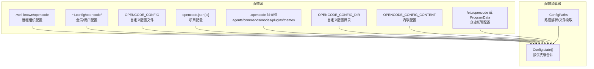
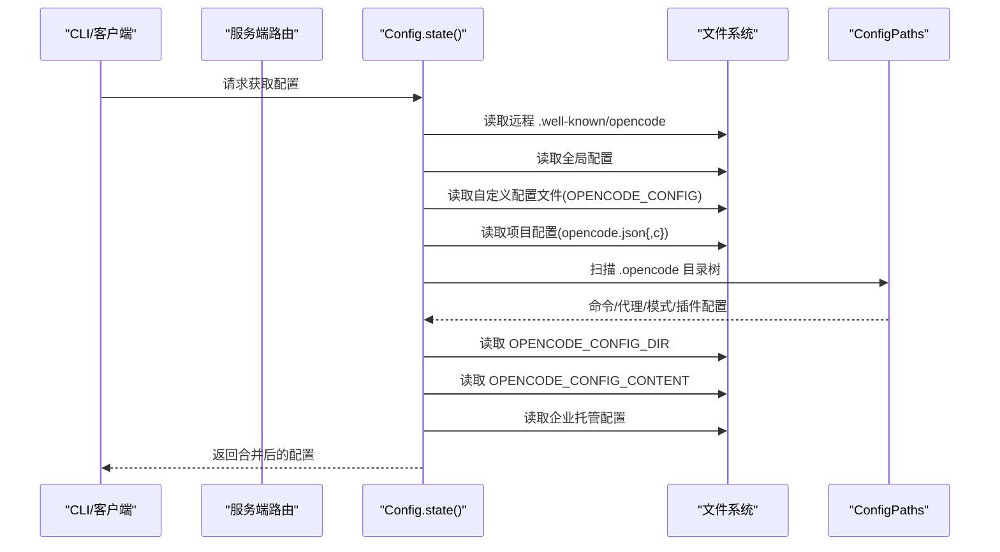
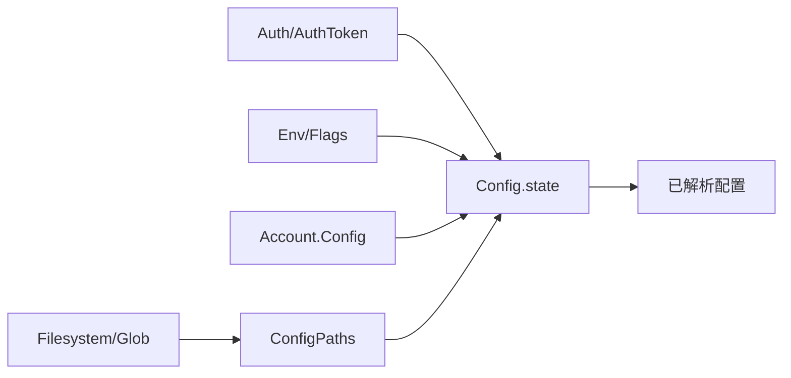

# 配置管理命令

<cite>
**本文引用的文件**
- [packages/opencode/src/config/config.ts](file://packages/opencode/src/config/config.ts)
- [packages/opencode/src/config/paths.ts](file://packages/opencode/src/config/paths.ts)
- [packages/opencode/src/cli/cmd/debug/config.ts](file://packages/opencode/src/cli/cmd/debug/config.ts)
- [packages/opencode/src/server/routes/config.ts](file://packages/opencode/src/server/routes/config.ts)
- [packages/opencode/test/config/config.test.ts](file://packages/opencode/test/config/config.test.ts)
- [.opencode/opencode.jsonc](file://.opencode/opencode.jsonc)
- [packages/web/src/content/docs/de/config.mdx](file://packages/web/src/content/docs/de/config.mdx)
- [packages/web/src/content/docs/fr/config.mdx](file://packages/web/src/content/docs/fr/config.mdx)
</cite>

## 目录
1. [简介](#简介)
2. [项目结构](#项目结构)
3. [核心组件](#核心组件)
4. [架构总览](#架构总览)
5. [详细组件分析](#详细组件分析)
6. [依赖关系分析](#依赖关系分析)
7. [性能考量](#性能考量)
8. [故障排查指南](#故障排查指南)
9. [结论](#结论)
10. [附录](#附录)

## 简介
本文件系统性阐述配置管理命令与机制，覆盖以下主题：
- 配置命令：config get、config set、config list、config reset 的使用方法与行为边界
- 配置层级：全局配置、用户配置、项目配置、企业托管配置、远程组织配置、自定义/内联配置的优先级与覆盖规则
- 配置文件位置与发现逻辑
- 配置项验证、默认值与兼容性处理
- 配置继承与合并策略（数组字段拼接、对象深度合并）
- 配置模板、迁移、备份与恢复实践建议

## 项目结构
与配置管理直接相关的代码与文档分布如下：
- 核心配置加载与合并：packages/opencode/src/config/config.ts
- 配置路径解析与文件读取：packages/opencode/src/config/paths.ts
- CLI 调试命令：packages/opencode/src/cli/cmd/debug/config.ts
- 服务端路由（REST API）：packages/opencode/src/server/routes/config.ts
- 测试用例（含托管配置覆盖）：packages/opencode/test/config/config.test.ts
- 默认配置示例：.opencode/opencode.jsonc
- 文档（多语言）：packages/web/src/content/docs/*/config.mdx

图表来源
- [packages/opencode/src/config/config.ts:78-266](file://packages/opencode/src/config/config.ts#L78-L266)
- [packages/opencode/src/config/paths.ts:11-43](file://packages/opencode/src/config/paths.ts#L11-L43)

章节来源
- [packages/opencode/src/config/config.ts:78-266](file://packages/opencode/src/config/config.ts#L78-L266)
- [packages/opencode/src/config/paths.ts:11-43](file://packages/opencode/src/config/paths.ts#L11-L43)

## 核心组件
- 配置加载器（Config.state）：负责按优先级顺序加载并合并所有配置源，最终输出“已解析配置”
- 配置路径工具（ConfigPaths）：负责查找项目配置文件、扫描 .opencode 目录树、执行变量替换与 JSONC 解析
- CLI 调试命令：提供 config 命令用于打印当前已解析配置
- 服务端路由：提供 REST API 以获取与更新配置
- 更新与写入：支持更新项目配置与全局配置，并进行 JSONC 编辑与回写

章节来源
- [packages/opencode/src/config/config.ts:78-266](file://packages/opencode/src/config/config.ts#L78-L266)
- [packages/opencode/src/config/config.ts:1336-1452](file://packages/opencode/src/config/config.ts#L1336-L1452)
- [packages/opencode/src/config/paths.ts:11-43](file://packages/opencode/src/config/paths.ts#L11-L43)
- [packages/opencode/src/cli/cmd/debug/config.ts:6-16](file://packages/opencode/src/cli/cmd/debug/config.ts#L6-L16)
- [packages/opencode/src/server/routes/config.ts:13-92](file://packages/opencode/src/server/routes/config.ts#L13-L92)

## 架构总览
配置加载遵循严格的优先级顺序，后加载的配置会覆盖先前的同名键值；企业托管配置具有最高优先级。

图表来源
- [packages/opencode/src/config/config.ts:78-266](file://packages/opencode/src/config/config.ts#L78-L266)
- [packages/opencode/src/config/paths.ts:11-43](file://packages/opencode/src/config/paths.ts#L11-L43)

章节来源
- [packages/opencode/src/config/config.ts:78-266](file://packages/opencode/src/config/config.ts#L78-L266)

## 详细组件分析

### 配置命令与使用方法
- config get
  - 用途：打印当前已解析配置（包含所有来源的合并结果）
  - CLI 使用：opencode config
  - 服务端使用：GET /config
- config set
  - 用途：更新项目配置或全局配置（通过服务端 PATCH /config 或更新本地文件）
  - 注意：仅对可写配置源生效（如项目目录下的 opencode.json{,c}）
- config list
  - 用途：列出可用的命令、代理、模式、插件等清单（由 .opencode 目录树提供）
  - 来源：Config.loadCommand/Agent/Mode/Plugin
- config reset
  - 用途：重置为默认状态（通常通过删除或回退到默认配置文件）
  - 实践：删除项目配置文件或恢复默认全局配置

章节来源
- [packages/opencode/src/cli/cmd/debug/config.ts:6-16](file://packages/opencode/src/cli/cmd/debug/config.ts#L6-L16)
- [packages/opencode/src/server/routes/config.ts:13-92](file://packages/opencode/src/server/routes/config.ts#L13-L92)
- [packages/opencode/src/config/config.ts:384-495](file://packages/opencode/src/config/config.ts#L384-L495)

### 配置优先级与覆盖规则
- 优先级顺序（从低到高）：
  1) 远程组织配置（.well-known/opencode）
  2) 全局/用户配置（~/.config/opencode/）
  3) 自定义配置文件（OPENCODE_CONFIG）
  4) 项目配置（opencode.json{,c}）
  5) .opencode 目录树（agents/commands/modes/plugins/themes）
  6) 自定义配置目录（OPENCODE_CONFIG_DIR）
  7) 内联配置（OPENCODE_CONFIG_CONTENT）
  8) 企业托管配置（/etc/opencode 或 ProgramData 下的 opencode.json{,c}，最高优先级）

- 合并策略：
  - 对象字段：深度合并
  - 数组字段：去重后拼接（如 plugin、instructions）
  - 兼容性处理：mode → agent 字段迁移、autoshare → share 映射、legacy tools → permission

- 企业托管配置特殊性：
  - 仅在企业部署场景启用，始终覆盖更高优先级的配置
  - 不安装依赖，避免权限问题

章节来源
- [packages/opencode/src/config/config.ts:78-266](file://packages/opencode/src/config/config.ts#L78-L266)
- [packages/opencode/test/config/config.test.ts:1188-1213](file://packages/opencode/test/config/config.test.ts#L1188-L1213)

### 配置文件位置与发现
- 全局/用户配置：
  - 路径：~/.config/opencode/ 下的 opencode.jsonc、opencode.json、config.json
  - 兼容旧格式 config（自动迁移）
- 项目配置：
  - 在项目根目录或向上查找最近的 .git 目录，定位 opencode.json{,c}
- .opencode 目录树：
  - 支持 .opencode/agents、.opencode/commands、.opencode/modes、.opencode/plugins、.opencode/themes
  - 支持 OPENCODE_CONFIG_DIR 指定自定义目录，其结构与 .opencode 相同
- 远程与内联配置：
  - 远程：.well-known/opencode
  - 内联：OPENCODE_CONFIG_CONTENT（运行时覆盖）

章节来源
- [packages/opencode/src/config/paths.ts:11-43](file://packages/opencode/src/config/paths.ts#L11-L43)
- [packages/opencode/src/config/config.ts:1233-1260](file://packages/opencode/src/config/config.ts#L1233-L1260)

### 配置项验证、默认值与兼容性
- 验证：
  - 使用 Zod Schema 对配置进行强类型校验
  - JSONC 解析错误与结构不合法将抛出错误
- 默认值：
  - 未指定时提供合理默认（如用户名、密钥绑定、布局等）
- 兼容性：
  - mode → agent 迁移
  - autoshare → share 映射
  - legacy tools → permission 规则转换
  - tui 键位废弃提示

章节来源
- [packages/opencode/src/config/config.ts:1039-1231](file://packages/opencode/src/config/config.ts#L1039-L1231)
- [packages/opencode/src/config/config.ts:216-242](file://packages/opencode/src/config/config.ts#L216-L242)

### 配置继承机制
- 继承链路：
  - 从远程组织默认 → 用户全局 → 自定义文件 → 项目 → .opencode 目录树 → 自定义目录 → 内联 → 企业托管
- 合并细节：
  - 对象字段深度合并
  - 数组字段去重后拼接（如插件列表）
  - 文件/环境变量占位符替换（{file:...}、{env:...}）

章节来源
- [packages/opencode/src/config/config.ts:67-76](file://packages/opencode/src/config/config.ts#L67-L76)
- [packages/opencode/src/config/paths.ts:84-141](file://packages/opencode/src/config/paths.ts#L84-L141)

### 配置模板与最佳实践
- 模板建议：
  - 使用 $schema 引用官方配置模式，便于编辑器校验与补全
  - 将项目配置纳入版本控制，确保团队一致性
  - 使用 OPENCODE_CONFIG_DIR 维护团队共享的命令、代理、模式与插件
- 默认示例参考：
  - .opencode/opencode.jsonc 提供了 provider、permission、mcp、tools 等字段的示例

章节来源
- [.opencode/opencode.jsonc:1-19](file://.opencode/opencode.jsonc#L1-L19)

### 配置迁移、备份与恢复
- 迁移：
  - 自动迁移旧格式（如 config.toml → opencode.json）
  - 字段迁移（mode → agent、autoshare → share）
- 备份：
  - 备份全局配置目录与项目配置文件
  - 记录 OPENCODE_CONFIG、OPENCODE_CONFIG_DIR、OPENCODE_CONFIG_CONTENT 的环境变量
- 恢复：
  - 恢复对应文件后，重新加载配置
  - 如需回滚，删除或改名目标配置文件，保留历史版本

章节来源
- [packages/opencode/src/config/config.ts:1233-1260](file://packages/opencode/src/config/config.ts#L1233-L1260)
- [packages/web/src/content/docs/de/config.mdx:107-144](file://packages/web/src/content/docs/de/config.mdx#L107-L144)
- [packages/web/src/content/docs/fr/config.mdx:42-57](file://packages/web/src/content/docs/fr/config.mdx#L42-L57)

## 依赖关系分析
- 组件耦合：
  - Config.state 依赖 Auth、Env、Account、LSPServer 等模块以获取远程配置与令牌
  - ConfigPaths 依赖 Filesystem、Glob、Flag 等工具进行路径解析与文件扫描
- 外部集成点：
  - 远程 .well-known/opencode
  - OPENCODE_CONSOLE_TOKEN（账户级配置）
  - 企业托管配置目录（系统级）

图表来源
- [packages/opencode/src/config/config.ts:78-204](file://packages/opencode/src/config/config.ts#L78-L204)
- [packages/opencode/src/config/paths.ts:11-43](file://packages/opencode/src/config/paths.ts#L11-L43)

章节来源
- [packages/opencode/src/config/config.ts:78-204](file://packages/opencode/src/config/config.ts#L78-L204)
- [packages/opencode/src/config/paths.ts:11-43](file://packages/opencode/src/config/paths.ts#L11-L43)

## 性能考量
- 加载顺序与缓存：
  - 配置状态惰性初始化，首次访问时完成加载与合并
  - 依赖安装与包管理采用锁机制，避免并发冲突
- I/O 优化：
  - 路径查找限制在工作树范围内，减少无关目录扫描
  - 仅在必要时安装依赖，避免重复安装
- 合并成本：
  - 深度合并与数组去重在大型配置中可能带来开销，建议精简配置与插件数量

章节来源
- [packages/opencode/src/config/config.ts:268-324](file://packages/opencode/src/config/config.ts#L268-L324)
- [packages/opencode/src/config/config.ts:335-368](file://packages/opencode/src/config/config.ts#L335-L368)

## 故障排查指南
- 常见问题与定位：
  - JSONC 解析错误：检查语法与占位符是否正确
  - 文件不存在：确认 OPENCODE_CONFIG/OPENCODE_CONFIG_DIR 是否指向有效路径
  - 权限不足：企业托管配置目录通常需要管理员权限
  - 字段不合法：根据 Zod 报错修正配置结构
- 排查步骤：
  - 使用 config get 查看最终配置
  - 检查各配置源是否存在与可读
  - 关注合并日志与警告（如 tui 键位废弃提示）
- 相关测试参考：
  - 托管配置覆盖项目配置的行为可通过测试用例验证

章节来源
- [packages/opencode/src/config/paths.ts:144-173](file://packages/opencode/src/config/paths.ts#L144-L173)
- [packages/opencode/src/config/config.ts:1325-1325](file://packages/opencode/src/config/config.ts#L1325-L1325)
- [packages/opencode/test/config/config.test.ts:1188-1213](file://packages/opencode/test/config/config.test.ts#L1188-L1213)

## 结论
配置管理通过明确的优先级与严谨的合并策略，实现了从远程组织默认到企业托管的全链路覆盖。借助 CLI 与服务端 API，用户可以便捷地查询、更新与维护配置。建议在团队内统一配置模板与迁移流程，结合备份与恢复策略，确保配置的稳定性与可追溯性。

## 附录

### 配置命令速查
- config get：打印已解析配置
- config set：更新项目或全局配置（通过 PATCH /config 或修改本地文件）
- config list：列出命令/代理/模式/插件清单
- config reset：删除或回退到默认配置文件

章节来源
- [packages/opencode/src/cli/cmd/debug/config.ts:6-16](file://packages/opencode/src/cli/cmd/debug/config.ts#L6-L16)
- [packages/opencode/src/server/routes/config.ts:13-92](file://packages/opencode/src/server/routes/config.ts#L13-L92)
- [packages/opencode/src/config/config.ts:384-495](file://packages/opencode/src/config/config.ts#L384-L495)