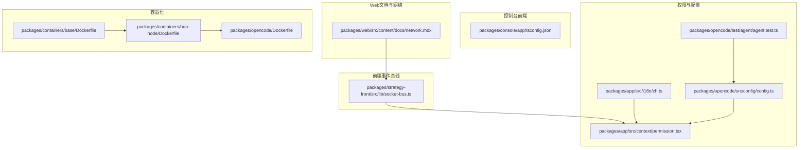
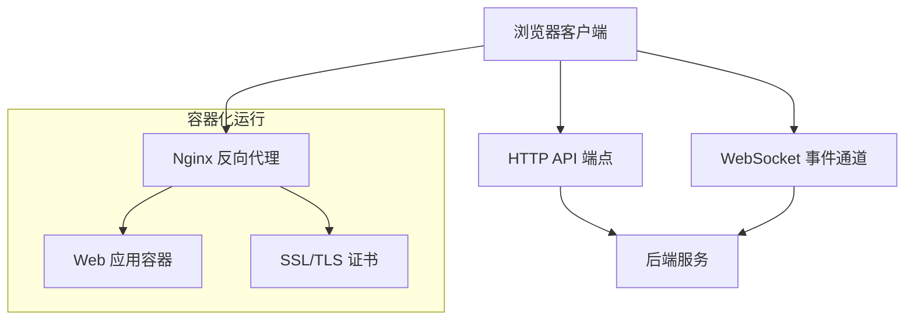
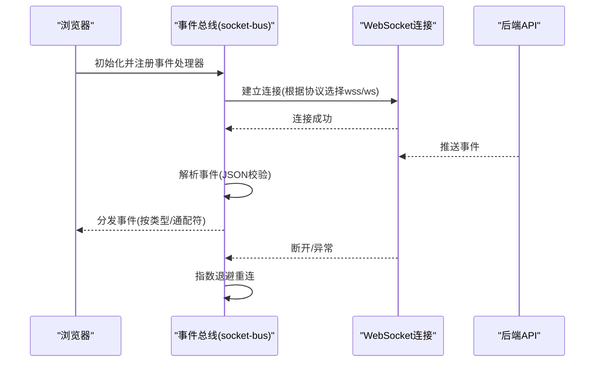
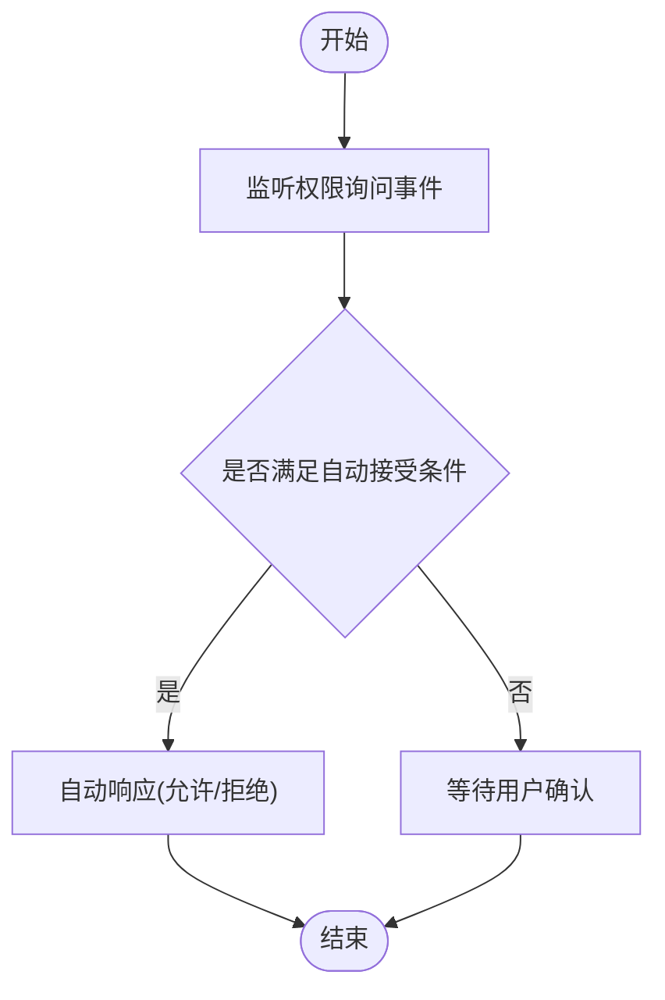
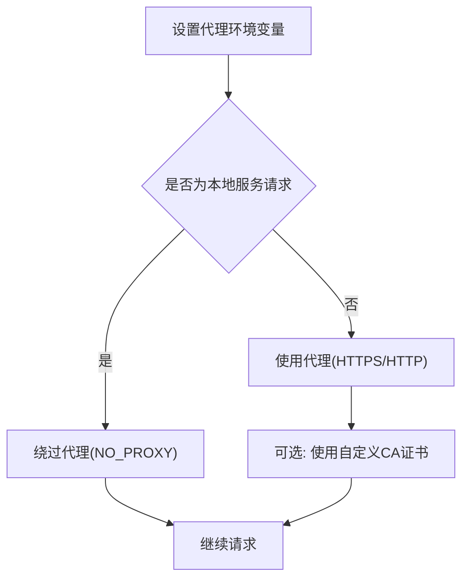
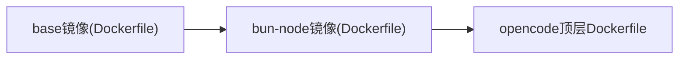
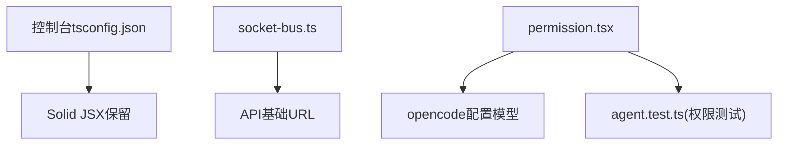

# Web界面

<cite>
**本文引用的文件**
- [README.md](file://README.md)
- [packages/web/src/content/docs/network.mdx](file://packages/web/src/content/docs/network.mdx)
- [packages/web/src/content/docs/pl/network.mdx](file://packages/web/src/content/docs/pl/network.mdx)
- [packages/web/src/content/docs/fr/network.mdx](file://packages/web/src/content/docs/fr/network.mdx)
- [packages/web/src/content/docs/bs/network.mdx](file://packages/web/src/content/docs/bs/network.mdx)
- [packages/web/src/content/docs/nb/network.mdx](file://packages/web/src/content/docs/nb/network.mdx)
- [packages/web/src/content/docs/da/network.mdx](file://packages/web/src/content/docs/da/network.mdx)
- [packages/web/src/content/docs/it/network.mdx](file://packages/web/src/content/docs/it/network.mdx)
- [packages/web/src/content/docs/es/network.mdx](file://packages/web/src/content/docs/es/network.mdx)
- [packages/web/src/content/docs/tr/network.mdx](file://packages/web/src/content/docs/tr/network.mdx)
- [packages/strategy-front/src/lib/socket-bus.ts](file://packages/strategy-front/src/lib/socket-bus.ts)
- [packages/console/app/tsconfig.json](file://packages/console/app/tsconfig.json)
- [packages/app/src/i18n/zh.ts](file://packages/app/src/i18n/zh.ts)
- [packages/app/src/context/permission.tsx](file://packages/app/src/context/permission.tsx)
- [packages/opencode/src/config/config.ts](file://packages/opencode/src/config/config.ts)
- [packages/opencode/test/agent/agent.test.ts](file://packages/opencode/test/agent/agent.test.ts)
- [packages/containers/base/Dockerfile](file://packages/containers/base/Dockerfile)
- [packages/containers/bun-node/Dockerfile](file://packages/containers/bun-node/Dockerfile)
- [packages/opencode/Dockerfile](file://packages/opencode/Dockerfile)
</cite>

## 目录
1. [简介](#简介)
2. [项目结构](#项目结构)
3. [核心组件](#核心组件)
4. [架构总览](#架构总览)
5. [详细组件分析](#详细组件分析)
6. [依赖关系分析](#依赖关系分析)
7. [性能考虑](#性能考虑)
8. [故障排查指南](#故障排查指南)
9. [结论](#结论)
10. [附录](#附录)

## 简介
本文件面向OpenCode Web界面的部署与配置，覆盖以下主题：
- Next.js前端应用的构建与部署流程（含静态生成与服务端渲染）
- Docker容器化部署方案（含Nginx反向代理与SSL证书）
- 认证集成、用户管理与权限控制
- 响应式设计、浏览器兼容性与性能优化
- CDN部署、负载均衡与高可用架构
- Web界面与后端API的通信协议与错误处理机制

## 项目结构
仓库采用多包工作区组织，Web相关能力主要分布在以下位置：
- packages/web：Web文档与网络配置相关内容
- packages/strategy-front：前端Socket事件总线与WebSocket连接逻辑
- packages/console：控制台应用（Solid+Vite），体现前端工程化配置
- packages/app：桌面应用上下文与权限交互示例
- packages/opencode：核心配置与权限模型
- packages/containers：基础容器镜像与打包Dockerfile
- packages/opencode/Dockerfile：顶层容器化入口

**图表来源**
- [packages/web/src/content/docs/network.mdx:1-57](file://packages/web/src/content/docs/network.mdx#L1-L57)
- [packages/strategy-front/src/lib/socket-bus.ts:1-55](file://packages/strategy-front/src/lib/socket-bus.ts#L1-L55)
- [packages/console/app/tsconfig.json:1-21](file://packages/console/app/tsconfig.json#L1-L21)
- [packages/app/src/i18n/zh.ts:762-787](file://packages/app/src/i18n/zh.ts#L762-L787)
- [packages/app/src/context/permission.tsx:152-196](file://packages/app/src/context/permission.tsx#L152-L196)
- [packages/opencode/src/config/config.ts:738-779](file://packages/opencode/src/config/config.ts#L738-L779)
- [packages/opencode/test/agent/agent.test.ts:193-247](file://packages/opencode/test/agent/agent.test.ts#L193-L247)
- [packages/containers/base/Dockerfile:1-19](file://packages/containers/base/Dockerfile#L1-L19)
- [packages/containers/bun-node/Dockerfile:1-25](file://packages/containers/bun-node/Dockerfile#L1-L25)
- [packages/opencode/Dockerfile](file://packages/opencode/Dockerfile)

**章节来源**
- [README.md:1-142](file://README.md#L1-L142)
- [packages/web/src/content/docs/network.mdx:1-57](file://packages/web/src/content/docs/network.mdx#L1-L57)
- [packages/strategy-front/src/lib/socket-bus.ts:1-55](file://packages/strategy-front/src/lib/socket-bus.ts#L1-L55)
- [packages/console/app/tsconfig.json:1-21](file://packages/console/app/tsconfig.json#L1-L21)
- [packages/app/src/i18n/zh.ts:762-787](file://packages/app/src/i18n/zh.ts#L762-L787)
- [packages/app/src/context/permission.tsx:152-196](file://packages/app/src/context/permission.tsx#L152-L196)
- [packages/opencode/src/config/config.ts:738-779](file://packages/opencode/src/config/config.ts#L738-L779)
- [packages/opencode/test/agent/agent.test.ts:193-247](file://packages/opencode/test/agent/agent.test.ts#L193-L247)
- [packages/containers/base/Dockerfile:1-19](file://packages/containers/base/Dockerfile#L1-L19)
- [packages/containers/bun-node/Dockerfile:1-25](file://packages/containers/bun-node/Dockerfile#L1-L25)
- [packages/opencode/Dockerfile](file://packages/opencode/Dockerfile)

## 核心组件
- 事件总线与WebSocket通信：前端通过WebSocket订阅后端事件流，自动重连与事件分发
- 权限系统：基于配置的权限策略，支持全局与按目录/会话的自动接受与询问
- 网络与代理：支持标准代理环境变量与自定义CA证书，保障企业网络合规
- 容器化与构建：基于Ubuntu基础镜像与Node/Bun工具链，提供可复用的容器化构建流程

**章节来源**
- [packages/strategy-front/src/lib/socket-bus.ts:1-55](file://packages/strategy-front/src/lib/socket-bus.ts#L1-L55)
- [packages/app/src/context/permission.tsx:152-196](file://packages/app/src/context/permission.tsx#L152-L196)
- [packages/web/src/content/docs/network.mdx:1-57](file://packages/web/src/content/docs/network.mdx#L1-L57)
- [packages/containers/base/Dockerfile:1-19](file://packages/containers/base/Dockerfile#L1-L19)
- [packages/containers/bun-node/Dockerfile:1-25](file://packages/containers/bun-node/Dockerfile#L1-L25)

## 架构总览
下图展示Web界面与后端的典型交互：前端通过HTTP API与WebSocket事件通道与后端通信；容器层提供统一的构建与运行环境。

**图表来源**
- [packages/strategy-front/src/lib/socket-bus.ts:1-55](file://packages/strategy-front/src/lib/socket-bus.ts#L1-L55)
- [packages/web/src/content/docs/network.mdx:1-57](file://packages/web/src/content/docs/network.mdx#L1-L57)

## 详细组件分析

### 组件A：事件总线与WebSocket通信
- 功能要点
  - 自动推断事件端点URL，根据协议切换ws/wss
  - 事件解析与校验，支持通配符处理器
  - 指数退避重连与活跃状态管理
- 关键行为
  - 连接建立后注册事件处理器
  - 收到事件后按类型分发给订阅者
  - 异常时进行指数退避重连

**图表来源**
- [packages/strategy-front/src/lib/socket-bus.ts:1-55](file://packages/strategy-front/src/lib/socket-bus.ts#L1-L55)

**章节来源**
- [packages/strategy-front/src/lib/socket-bus.ts:1-55](file://packages/strategy-front/src/lib/socket-bus.ts#L1-L55)

### 组件B：权限控制与自动接受
- 功能要点
  - 全局与按目录的自动接受策略
  - 会话级权限询问事件监听
  - 自动响应与手动确认的混合模式
- 关键行为
  - 监听权限询问事件，按策略自动响应
  - 支持启用/禁用目录级自动接受
  - 列举目录权限并批量自动响应

**图表来源**
- [packages/app/src/context/permission.tsx:152-196](file://packages/app/src/context/permission.tsx#L152-L196)

**章节来源**
- [packages/app/src/i18n/zh.ts:762-787](file://packages/app/src/i18n/zh.ts#L762-L787)
- [packages/app/src/context/permission.tsx:152-196](file://packages/app/src/context/permission.tsx#L152-L196)
- [packages/opencode/src/config/config.ts:738-779](file://packages/opencode/src/config/config.ts#L738-L779)
- [packages/opencode/test/agent/agent.test.ts:193-247](file://packages/opencode/test/agent/agent.test.ts#L193-L247)

### 组件C：网络与代理配置
- 功能要点
  - 支持HTTPS/HTTP代理与NO_PROXY绕过本地服务
  - 支持自定义CA证书(NODE_EXTRA_CA_CERTS)
  - 面向企业网络的代理认证与安全建议
- 关键行为
  - 代理环境变量透传至进程
  - 本地服务必须绕过代理以避免路由环

**图表来源**
- [packages/web/src/content/docs/network.mdx:1-57](file://packages/web/src/content/docs/network.mdx#L1-L57)

**章节来源**
- [packages/web/src/content/docs/network.mdx:1-57](file://packages/web/src/content/docs/network.mdx#L1-L57)
- [packages/web/src/content/docs/pl/network.mdx:1-57](file://packages/web/src/content/docs/pl/network.mdx#L1-L57)
- [packages/web/src/content/docs/fr/network.mdx:1-57](file://packages/web/src/content/docs/fr/network.mdx#L1-L57)
- [packages/web/src/content/docs/bs/network.mdx:1-51](file://packages/web/src/content/docs/bs/network.mdx#L1-L51)
- [packages/web/src/content/docs/nb/network.mdx:1-57](file://packages/web/src/content/docs/nb/network.mdx#L1-L57)
- [packages/web/src/content/docs/da/network.mdx:1-57](file://packages/web/src/content/docs/da/network.mdx#L1-L57)
- [packages/web/src/content/docs/it/network.mdx:1-57](file://packages/web/src/content/docs/it/network.mdx#L1-L57)
- [packages/web/src/content/docs/es/network.mdx:1-57](file://packages/web/src/content/docs/es/network.mdx#L1-L57)
- [packages/web/src/content/docs/tr/network.mdx:1-57](file://packages/web/src/content/docs/tr/network.mdx#L1-L57)

### 组件D：容器化与构建
- 功能要点
  - Ubuntu基础镜像安装常用工具链
  - Node与Bun工具链安装与环境准备
  - 顶层Dockerfile作为容器化入口
- 关键行为
  - 多阶段构建与最小化镜像体积
  - SHELL与ENV配置保证可复现性

**图表来源**
- [packages/containers/base/Dockerfile:1-19](file://packages/containers/base/Dockerfile#L1-L19)
- [packages/containers/bun-node/Dockerfile:1-25](file://packages/containers/bun-node/Dockerfile#L1-L25)
- [packages/opencode/Dockerfile](file://packages/opencode/Dockerfile)

**章节来源**
- [packages/containers/base/Dockerfile:1-19](file://packages/containers/base/Dockerfile#L1-L19)
- [packages/containers/bun-node/Dockerfile:1-25](file://packages/containers/bun-node/Dockerfile#L1-L25)
- [packages/opencode/Dockerfile](file://packages/opencode/Dockerfile)

## 依赖关系分析
- 前端工程化：控制台应用采用ESNext模块与bundler解析，JSX保留并使用Solid生态
- 事件依赖：前端事件总线依赖API配置中的基础URL，动态拼接事件端点
- 权限依赖：权限策略由配置文件驱动，测试用例验证合并与覆盖规则

**图表来源**
- [packages/console/app/tsconfig.json:1-21](file://packages/console/app/tsconfig.json#L1-L21)
- [packages/strategy-front/src/lib/socket-bus.ts:1-55](file://packages/strategy-front/src/lib/socket-bus.ts#L1-L55)
- [packages/app/src/context/permission.tsx:152-196](file://packages/app/src/context/permission.tsx#L152-L196)
- [packages/opencode/src/config/config.ts:738-779](file://packages/opencode/src/config/config.ts#L738-L779)
- [packages/opencode/test/agent/agent.test.ts:193-247](file://packages/opencode/test/agent/agent.test.ts#L193-L247)

**章节来源**
- [packages/console/app/tsconfig.json:1-21](file://packages/console/app/tsconfig.json#L1-L21)
- [packages/strategy-front/src/lib/socket-bus.ts:1-55](file://packages/strategy-front/src/lib/socket-bus.ts#L1-L55)
- [packages/app/src/context/permission.tsx:152-196](file://packages/app/src/context/permission.tsx#L152-L196)
- [packages/opencode/src/config/config.ts:738-779](file://packages/opencode/src/config/config.ts#L738-L779)
- [packages/opencode/test/agent/agent.test.ts:193-247](file://packages/opencode/test/agent/agent.test.ts#L193-L247)

## 性能考虑
- 资源加载与缓存
  - 合理利用浏览器缓存与CDN加速静态资源
  - 对关键路径资源启用压缩与预加载
- 渲染性能
  - 控制台应用采用Solid+Vite，关注组件粒度与懒加载
  - WebSocket事件分发避免阻塞主线程
- 网络性能
  - 代理与证书配置减少TLS握手失败与重试
  - 本地服务绕过代理降低延迟与环路风险

[本节为通用指导，不直接分析具体文件]

## 故障排查指南
- 代理与证书问题
  - 确认HTTPS_PROXY/HTTP_PROXY/NO_PROXY设置正确
  - 本地服务必须加入NO_PROXY，避免路由环
  - 自定义CA证书通过NODE_EXTRA_CA_CERTS注入
- WebSocket连接问题
  - 检查事件端点URL协议(ws/wss)与后端一致性
  - 观察指数退避重连日志，定位网络抖动
- 权限与自动接受
  - 检查全局与目录级自动接受开关
  - 确认权限询问事件监听是否生效
  - 验证权限策略合并与覆盖规则

**章节来源**
- [packages/web/src/content/docs/network.mdx:1-57](file://packages/web/src/content/docs/network.mdx#L1-L57)
- [packages/strategy-front/src/lib/socket-bus.ts:1-55](file://packages/strategy-front/src/lib/socket-bus.ts#L1-L55)
- [packages/app/src/context/permission.tsx:152-196](file://packages/app/src/context/permission.tsx#L152-L196)

## 结论
本文从部署与配置角度梳理了OpenCode Web界面的关键能力：事件总线与WebSocket通信、权限控制、网络代理与证书、容器化构建，并提供了与后端API交互的实践建议。结合CDN、负载均衡与高可用架构，可在生产环境中实现稳定、安全与高性能的Web体验。

[本节为总结性内容，不直接分析具体文件]

## 附录

### A. Next.js前端构建与部署（流程说明）
- 静态站点生成与服务端渲染
  - 在多包工作区中，控制台应用采用Solid+Vite，适合SSR与静态导出场景
  - 建议在CI中执行构建并输出静态产物，配合CDN分发
- 环境变量与运行时配置
  - 通过环境变量注入API基础URL与功能开关
  - 代理与证书配置在容器内通过环境变量传递

**章节来源**
- [packages/console/app/tsconfig.json:1-21](file://packages/console/app/tsconfig.json#L1-L21)

### B. Docker容器化部署方案
- 基础镜像与工具链
  - 使用Ubuntu基础镜像安装常用工具
  - 安装指定版本的Node与Bun，启用corepack
- 容器入口
  - 顶层Dockerfile作为应用入口，组合基础与工具链镜像
- Nginx反向代理与SSL
  - 在容器外部署Nginx，配置SSL证书与上游转发
  - 将WebSocket升级透明转发至后端

**章节来源**
- [packages/containers/base/Dockerfile:1-19](file://packages/containers/base/Dockerfile#L1-L19)
- [packages/containers/bun-node/Dockerfile:1-25](file://packages/containers/bun-node/Dockerfile#L1-L25)
- [packages/opencode/Dockerfile](file://packages/opencode/Dockerfile)

### C. 认证集成、用户管理与权限控制
- 认证集成
  - 前端通过HTTP API与后端认证服务对接，WebSocket事件通道复用同一认证上下文
- 用户管理
  - 通过后端API进行用户生命周期管理（创建、更新、删除）
- 权限控制
  - 基于配置的权限策略，支持全局、按目录与按会话的自动接受与询问
  - 测试用例验证权限合并与覆盖规则

**章节来源**
- [packages/strategy-front/src/lib/socket-bus.ts:1-55](file://packages/strategy-front/src/lib/socket-bus.ts#L1-L55)
- [packages/app/src/i18n/zh.ts:762-787](file://packages/app/src/i18n/zh.ts#L762-L787)
- [packages/app/src/context/permission.tsx:152-196](file://packages/app/src/context/permission.tsx#L152-L196)
- [packages/opencode/src/config/config.ts:738-779](file://packages/opencode/src/config/config.ts#L738-L779)
- [packages/opencode/test/agent/agent.test.ts:193-247](file://packages/opencode/test/agent/agent.test.ts#L193-L247)

### D. 响应式设计与浏览器兼容性
- 响应式设计
  - 采用现代CSS与媒体查询适配多终端
- 浏览器兼容性
  - 控制台应用使用ESNext与bundler解析，需在目标环境中进行兼容性测试
  - WebSocket与事件总线在主流浏览器中具备良好支持

**章节来源**
- [packages/console/app/tsconfig.json:1-21](file://packages/console/app/tsconfig.json#L1-L21)

### E. CDN部署、负载均衡与高可用
- CDN
  - 将静态资源与构建产物托管至CDN，提升全球访问速度
- 负载均衡
  - 前端通过Nginx反向代理分发至多个后端实例
- 高可用
  - 多副本部署与健康检查，结合自动扩缩容策略

[本节为通用指导，不直接分析具体文件]

### F. Web界面与后端API通信协议与错误处理
- 通信协议
  - HTTP API用于数据与状态获取；WebSocket用于事件推送
- 错误处理
  - WebSocket连接异常时进行指数退避重连
  - 代理与证书配置减少连接失败率

**章节来源**
- [packages/strategy-front/src/lib/socket-bus.ts:1-55](file://packages/strategy-front/src/lib/socket-bus.ts#L1-L55)
- [packages/web/src/content/docs/network.mdx:1-57](file://packages/web/src/content/docs/network.mdx#L1-L57)