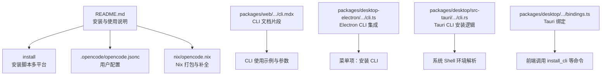
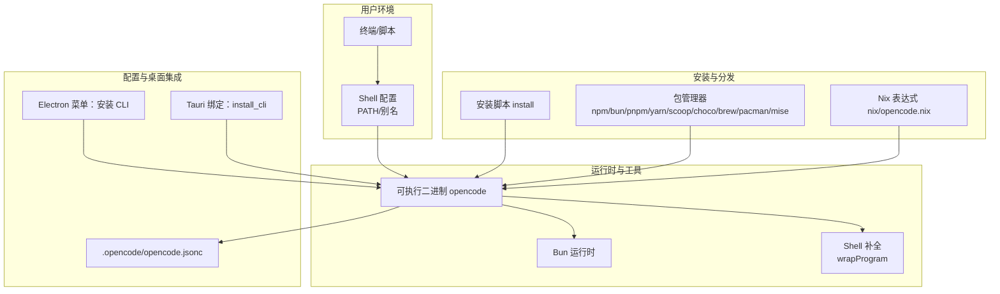
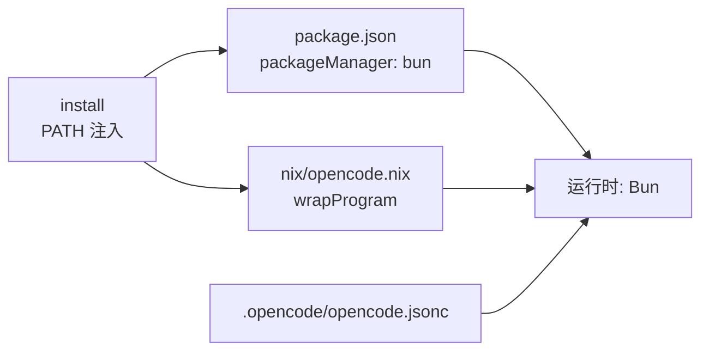
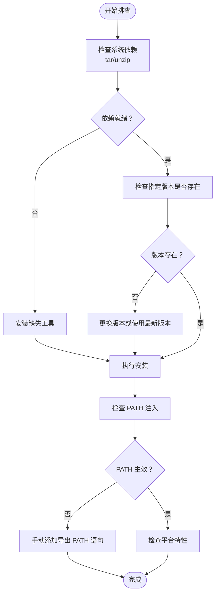

# 命令行工具

<cite>
**本文引用的文件**
- [README.md](file://README.md)
- [install（安装脚本）](file://install)
- [.opencode\opencode.jsonc](file://.opencode/opencode.jsonc)
- [nix\opencode.nix](file://nix/opencode.nix)
- [packages\web\src\content\docs\zh\cli.mdx](file://packages/web/src/content/docs/zh/cli.mdx)
- [packages\desktop-electron\src\main\cli.ts](file://packages/desktop-electron/src/main/cli.ts)
- [packages\desktop-electron\src\main\menu.ts](file://packages/desktop-electron/src/main/menu.ts)
- [packages\desktop\src-tauri\src\cli.rs](file://packages/desktop/src-tauri/src/cli.rs)
- [packages\desktop\src-tauri\src\windows.rs](file://packages/desktop/src-tauri/src/windows.rs)
- [packages\desktop\src\bindings.ts](file://packages/desktop/src/bindings.ts)
- [package.json](file://package.json)
</cite>

## 目录
1. [简介](#简介)
2. [项目结构](#项目结构)
3. [核心组件](#核心组件)
4. [架构总览](#架构总览)
5. [详细组件分析](#详细组件分析)
6. [依赖分析](#依赖分析)
7. [性能考虑](#性能考虑)
8. [故障排查指南](#故障排查指南)
9. [结论](#结论)
10. [附录](#附录)

## 简介
本指南面向希望在多平台上使用 OpenCode 命令行工具（CLI）的用户与开发者，覆盖以下主题：
- Node.js 与运行时要求（含 Bun、Nix）
- 包管理器安装与全局/本地安装方式
- 不同操作系统的环境变量、PATH 设置与 Shell 别名
- 命令行参数、配置文件与环境变量优先级
- 脚本执行、函数调用与自动化工作流示例
- 调试模式、日志输出与错误诊断
- 与桌面应用、CI/CD 的集成方式

## 项目结构
OpenCode 仓库采用 monorepo 结构，CLI 工具由独立的安装脚本与 Nix 打包支持，并通过文档与配置文件提供跨平台使用指导。

图表来源
- [README.md:46-98](file://README.md#L46-L98)
- [install:1-461](file://install#L1-L461)
- [.opencode\opencode.jsonc:1-19](file://.opencode/opencode.jsonc#L1-L19)
- [nix\opencode.nix:1-98](file://nix/opencode.nix#L1-L98)
- [packages\web\src\content\docs\zh\cli.mdx:1-38](file://packages/web/src/content/docs/zh/cli.mdx#L1-L38)
- [packages\desktop-electron\src\main\cli.ts:242-279](file://packages/desktop-electron/src/main/cli.ts#L242-L279)
- [packages\desktop-electron\src\main\menu.ts:14-46](file://packages/desktop-electron/src/main/menu.ts#L14-L46)
- [packages\desktop\src-tauri\src\cli.rs:211-265](file://packages/desktop/src-tauri/src/cli.rs#L211-L265)
- [packages\desktop\src\bindings.ts:1-19](file://packages/desktop/src/bindings.ts#L1-L19)

章节来源
- [README.md:46-98](file://README.md#L46-L98)
- [install:1-461](file://install#L1-L461)
- [.opencode\opencode.jsonc:1-19](file://.opencode/opencode.jsonc#L1-L19)
- [nix\opencode.nix:1-98](file://nix/opencode.nix#L1-L98)
- [packages\web\src\content\docs\zh\cli.mdx:1-38](file://packages/web/src/content/docs/zh/cli.mdx#L1-L38)
- [packages\desktop-electron\src\main\cli.ts:242-279](file://packages/desktop-electron/src/main/cli.ts#L242-L279)
- [packages\desktop-electron\src\main\menu.ts:14-46](file://packages/desktop-electron/src/main/menu.ts#L14-L46)
- [packages\desktop\src-tauri\src\cli.rs:211-265](file://packages/desktop/src-tauri/src/cli.rs#L211-L265)
- [packages\desktop\src\bindings.ts:1-19](file://packages/desktop/src/bindings.ts#L1-L19)

## 核心组件
- 安装脚本：提供跨平台自动检测、下载、解压与 PATH 注入能力；支持从本地二进制安装与 GitHub Releases 指定版本安装。
- Nix 打包：生成单文件可执行程序，注入补全与辅助工具路径，便于在非传统发行版中部署。
- 用户配置：.opencode/opencode.jsonc 提供 provider、权限、工具等配置入口。
- 文档片段：CLI 使用示例与参数说明，便于快速上手。
- 桌面应用集成：Electron/Tauri 提供“安装 CLI”菜单与命令绑定，简化用户在桌面端一键安装与调用。

章节来源
- [install:1-461](file://install#L1-L461)
- [nix\opencode.nix:1-98](file://nix/opencode.nix#L1-L98)
- [.opencode\opencode.jsonc:1-19](file://.opencode/opencode.jsonc#L1-L19)
- [packages\web\src\content\docs\zh\cli.mdx:1-38](file://packages/web/src/content/docs/zh/cli.mdx#L1-L38)
- [packages\desktop-electron\src\main\menu.ts:14-46](file://packages/desktop-electron/src/main/menu.ts#L14-L46)
- [packages\desktop\src-tauri\src\cli.rs:211-265](file://packages/desktop/src-tauri/src/cli.rs#L211-L265)

## 架构总览
下图展示 CLI 在不同平台与工具链中的位置关系与交互：

图表来源
- [README.md:46-98](file://README.md#L46-L98)
- [install:1-461](file://install#L1-L461)
- [nix\opencode.nix:1-98](file://nix/opencode.nix#L1-L98)
- [.opencode\opencode.jsonc:1-19](file://.opencode/opencode.jsonc#L1-L19)
- [packages\desktop-electron\src\main\menu.ts:14-46](file://packages/desktop-electron/src/main/menu.ts#L14-L46)
- [packages\desktop\src-tauri\src\cli.rs:211-265](file://packages/desktop/src-tauri/src/cli.rs#L211-L265)

## 详细组件分析

### 安装脚本（install）
- 多平台检测：自动识别操作系统与 CPU 架构，必要时转换为内部目标组合（如 x64→arm64 在 Rosetta 下）。
- 发行版适配：Linux 自动判断是否基于 musl（Alpine 或 ldd 输出），Windows/Linux 分别检查 tar/unzip 可用性。
- 版本选择：默认拉取最新发布版本，或通过 --version 指定版本；校验 GitHub Release 是否存在。
- 安装路径优先级：OPENCODE_INSTALL_DIR → XDG_BIN_DIR → $HOME/bin → 默认 $HOME/.opencode/bin。
- PATH 注入：根据当前 Shell 类型写入对应配置文件（fish/zsh/bash 等），或提示手动添加。
- CI 集成：在 GitHub Actions 中自动写入 GITHUB_PATH。
- 本地二进制：支持 --binary 从本地路径复制到安装目录。

章节来源
- [install:10-66](file://install#L10-L66)
- [install:68-110](file://install#L68-L110)
- [install:117-167](file://install#L117-L167)
- [install:183-204](file://install#L183-L204)
- [install:327-359](file://install#L327-L359)
- [install:362-439](file://install#L362-L439)
- [install:441-444](file://install#L441-L444)
- [README.md:85-98](file://README.md#L85-L98)

### Nix 打包（nix/opencode.nix）
- 构建阶段：在 packages/opencode 内部执行构建脚本，生成单文件可执行产物。
- 运行时注入：wrapProgram 将 ripgrep、sysctl 等工具加入 PATH，确保运行时可用。
- 补全生成：通过 opencode completion 生成 Bash/Zsh 补全并安装。
- 环境变量：设置 MODELS_DEV_API_JSON、OPENCODE_DISABLE_MODELS_FETCH、OPENCODE_VERSION、OPENCODE_CHANNEL 等。
- 安装与校验：安装二进制与 schema.json，启用版本检查钩子。

章节来源
- [nix\opencode.nix:15-89](file://nix/opencode.nix#L15-L89)

### 用户配置（.opencode/opencode.jsonc）
- provider：定义默认模型提供商与选项。
- permission：对特定路径或文件的编辑权限控制。
- mcp：MCP 相关配置入口。
- tools：开关类工具（如 GitHub triage/pr-search）。

章节来源
- [.opencode\opencode.jsonc:1-19](file://.opencode/opencode.jsonc#L1-L19)

### CLI 文档片段（packages/web/.../cli.mdx）
- 默认行为：无参数时启动 TUI。
- 常用命令：run 等子命令用于程序化交互。
- 参数示例：包含会话控制、模型选择、代理切换等常用标志位。

章节来源
- [packages\web\src\content\docs\zh\cli.mdx:1-38](file://packages/web/src/content/docs/zh/cli.mdx#L1-L38)

### 桌面应用集成（Electron/Tauri）
- Electron：菜单项“安装 CLI”触发安装流程，便于用户一键完成安装。
- Tauri：提供 install_cli 命令与 shell 环境解析、WSL 路径转换、显示后端设置等能力，前端通过 bindings.ts 调用。

章节来源
- [packages\desktop-electron\src\main\menu.ts:14-46](file://packages/desktop-electron/src/main/menu.ts#L14-L46)
- [packages\desktop-electron\src\main\cli.ts:242-279](file://packages/desktop-electron/src/main/cli.ts#L242-L279)
- [packages\desktop\src-tauri\src\cli.rs:211-265](file://packages/desktop/src-tauri/src/cli.rs#L211-L265)
- [packages\desktop\src-tauri\src\windows.rs:1-49](file://packages/desktop/src-tauri/src/windows.rs#L1-L49)
- [packages\desktop\src\bindings.ts:1-19](file://packages/desktop/src/bindings.ts#L1-L19)

## 依赖分析
- 运行时与工具链
  - Bun：作为 packageManager 与运行时，提供高性能执行与打包能力。
  - Nix：提供可复现构建与运行时依赖注入。
  - Shell 补全：通过 wrapProgram 注入外部工具 PATH，增强功能可用性。
- 平台差异
  - macOS：Rosetta 场景下自动调整架构目标。
  - Linux：musl 发行版检测与 baseline CPU 要求处理。
  - Windows：PowerShell 检测 CPU 特性以决定是否需要 baseline 构建。
- 配置与环境
  - OPENCODE_INSTALL_DIR、XDG_BIN_DIR、HOME/bin 作为安装路径优先级。
  - GitHub Actions：GITHUB_PATH 注入安装目录。
  - Nix：通过环境变量与 wrapProgram 控制运行时行为。

图表来源
- [package.json:7](file://package.json#L7)
- [nix\opencode.nix:51-69](file://nix/opencode.nix#L51-L69)
- [install:362-439](file://install#L362-L439)
- [.opencode\opencode.jsonc:1-19](file://.opencode/opencode.jsonc#L1-L19)

章节来源
- [package.json:7](file://package.json#L7)
- [nix\opencode.nix:51-69](file://nix/opencode.nix#L51-L69)
- [install:362-439](file://install#L362-L439)
- [.opencode\opencode.jsonc:1-19](file://.opencode/opencode.jsonc#L1-L19)

## 性能考虑
- 架构优化：在不满足 AVX2 的 x64 平台上自动选择 baseline 构建，避免运行时指令集不兼容导致的崩溃。
- 发行版适配：musl 环境下选择 musl 构建，减少动态链接开销。
- 下载进度：安装脚本提供自绘进度条，改善大文件下载体验。
- 运行时注入：Nix 通过 wrapProgram 将常用工具（如 ripgrep、sysctl）直接加入 PATH，减少额外查找时间。

章节来源
- [install:130-158](file://install#L130-L158)
- [install:248-265](file://install#L248-L265)
- [nix\opencode.nix:57-66](file://nix/opencode.nix#L57-L66)

## 故障排查指南
- 安装失败
  - 检查系统依赖：Linux 需要 tar，其他系统需要 unzip；若缺失则安装相应工具。
  - 指定版本不存在：使用 --version 指定版本前先确认 GitHub Releases 是否存在。
  - 权限问题：确保安装目录可写，或使用 sudo（不推荐）。
- PATH 未生效
  - 安装脚本会尝试写入 Shell 配置文件；若未生效，按提示手动添加导出 PATH 的语句。
  - 在 CI 环境（如 GitHub Actions）中，确认 GITHUB_PATH 已被正确注入。
- 平台特性不匹配
  - macOS Rosetta：安装脚本会自动将 x64 目标转换为 arm64。
  - Linux CPU：若无 AVX2，安装脚本会自动选择 baseline 构建。
  - Windows：通过 PowerShell 检测 CPU 特性，必要时选择 baseline 构建。
- 桌面应用无法安装 CLI
  - Electron 菜单项“安装 CLI”应触发安装流程；若失败，检查菜单回调与安装脚本输出。
  - Tauri 环境：确认 shell 环境解析与 WSL 路径转换逻辑正常。

图表来源
- [install:171-181](file://install#L171-L181)
- [install:197-204](file://install#L197-L204)
- [install:362-439](file://install#L362-L439)
- [install:80-100](file://install#L80-L100)
- [install:130-158](file://install#L130-L158)
- [install:146-157](file://install#L146-L157)

章节来源
- [install:171-181](file://install#L171-L181)
- [install:197-204](file://install#L197-L204)
- [install:362-439](file://install#L362-L439)
- [install:80-100](file://install#L80-L100)
- [install:130-158](file://install#L130-L158)
- [install:146-157](file://install#L146-L157)

## 结论
OpenCode CLI 提供了完善的跨平台安装与使用方案：通过安装脚本与包管理器满足不同用户需求，通过 Nix 实现可复现构建与运行时注入，通过用户配置与桌面应用集成提升易用性与可维护性。遵循本文档的安装、配置与排障建议，可在各类环境中稳定运行并融入自动化工作流。

## 附录

### 跨平台安装与使用要点
- 包管理器安装：支持 npm/bun/pnpm/yarn/scoop/choco/brew/pacman/mise 等。
- 全局/本地安装：优先使用包管理器进行全局安装；在受限环境下可使用本地二进制安装。
- 环境变量与 PATH：
  - 安装路径优先级：OPENCODE_INSTALL_DIR > XDG_BIN_DIR > $HOME/bin > $HOME/.opencode/bin
  - CI 环境：GitHub Actions 会自动写入 GITHUB_PATH
- Shell 别名：可为 opencode 创建别名以缩短输入（例如在 zsh/bash 中添加 alias）。

章节来源
- [README.md:46-98](file://README.md#L46-L98)
- [install:362-439](file://install#L362-L439)
- [install:441-444](file://install#L441-L444)

### 命令行参数与配置优先级
- CLI 参数：参考 CLI 文档片段中的参数列表与示例。
- 配置文件：.opencode/opencode.jsonc 提供 provider、权限、工具等配置。
- 环境变量：Nix 打包时注入的环境变量影响运行时行为；安装脚本注入 PATH。
- 优先级建议：命令行参数 > 环境变量 > 配置文件 > 默认值。

章节来源
- [packages\web\src\content\docs\zh\cli.mdx:1-38](file://packages/web/src/content/docs/zh/cli.mdx#L1-L38)
- [.opencode\opencode.jsonc:1-19](file://.opencode/opencode.jsonc#L1-L19)
- [nix\opencode.nix:36-39](file://nix/opencode.nix#L36-L39)

### 脚本执行、函数调用与自动化工作流
- 脚本执行：在 CI/CD 中使用安装脚本或包管理器安装 CLI 后直接调用。
- 函数调用：桌面应用通过 Tauri 绑定调用 install_cli 等命令，实现“安装 CLI”的一键化。
- 自动化工作流：结合 GitHub Actions 的 GITHUB_PATH 注入，确保后续步骤可直接使用 opencode。

章节来源
- [install:441-444](file://install#L441-L444)
- [packages\desktop\src\bindings.ts:1-19](file://packages/desktop/src/bindings.ts#L1-L19)
- [packages\desktop-electron\src\main\menu.ts:14-46](file://packages/desktop-electron/src/main/menu.ts#L14-L46)

### 调试模式、日志输出与错误诊断
- 安装脚本：提供详细输出与进度条，便于定位网络与权限问题。
- Nix 打包：启用版本检查钩子，确保安装产物可用。
- 桌面应用：通过菜单项与命令绑定触发安装与初始化，便于在 GUI 环境中调试。

章节来源
- [install:248-265](file://install#L248-L265)
- [nix\opencode.nix:82-84](file://nix/opencode.nix#L82-L84)
- [packages\desktop-electron\src\main\menu.ts:14-46](file://packages/desktop-electron/src/main/menu.ts#L14-L46)