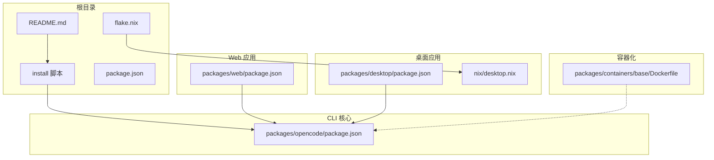
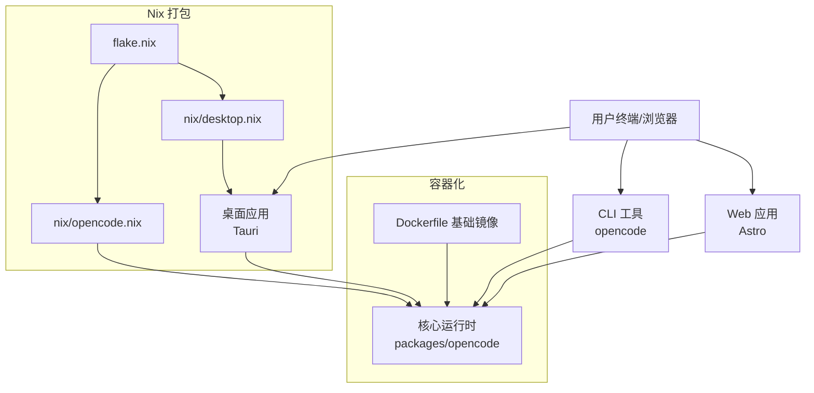
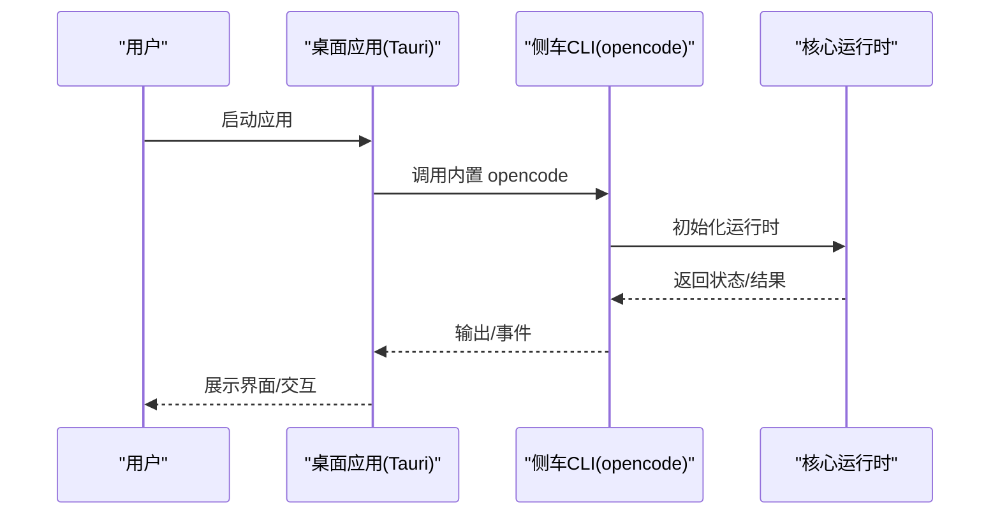
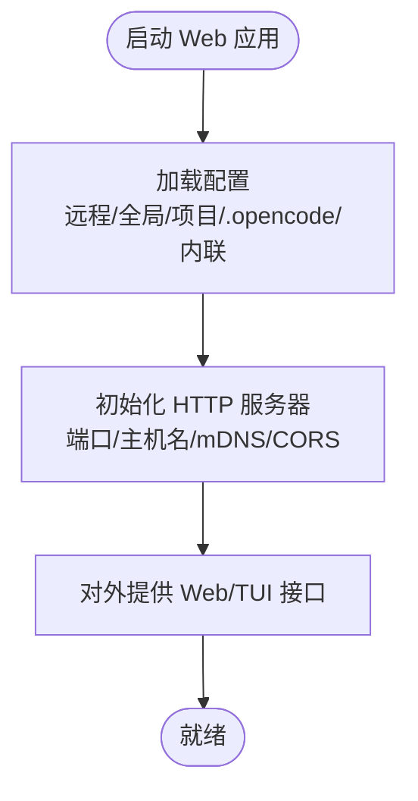
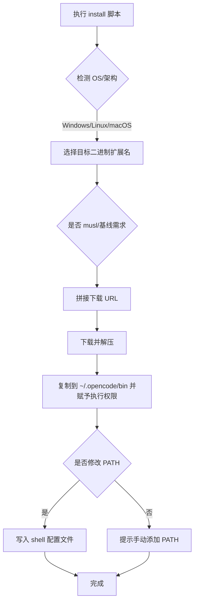
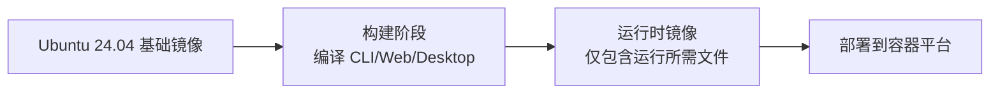
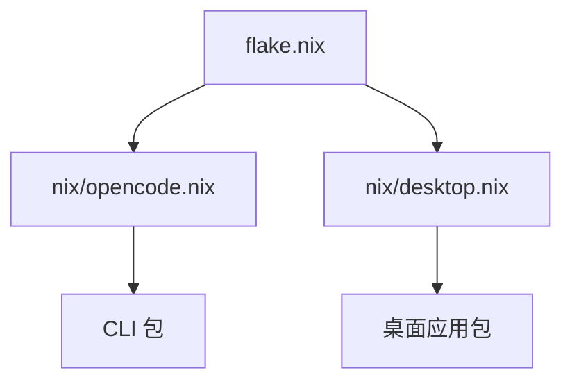
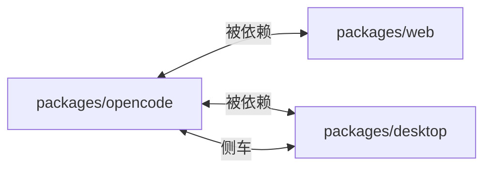

# 多平台部署

<cite>
**本文引用的文件**
- [README.md](file://README.md)
- [install](file://install)
- [package.json](file://package.json)
- [flake.nix](file://flake.nix)
- [nix/opencode.nix](file://nix/opencode.nix)
- [nix/desktop.nix](file://nix/desktop.nix)
- [packages/desktop/package.json](file://packages/desktop/package.json)
- [packages/web/package.json](file://packages/web/package.json)
- [packages/opencode/package.json](file://packages/opencode/package.json)
- [packages/web/src/content/docs/config.mdx](file://packages/web/src/content/docs/config.mdx)
- [packages/web/src/content/docs/providers.mdx](file://packages/web/src/content/docs/providers.mdx)
- [packages/containers/base/Dockerfile](file://packages/containers/base/Dockerfile)
</cite>

## 目录
1. [简介](#简介)
2. [项目结构](#项目结构)
3. [核心组件](#核心组件)
4. [架构总览](#架构总览)
5. [详细组件分析](#详细组件分析)
6. [依赖关系分析](#依赖关系分析)
7. [性能考虑](#性能考虑)
8. [故障排除指南](#故障排除指南)
9. [结论](#结论)
10. [附录](#附录)

## 简介
本文件面向需要在多平台上部署与使用 OpenCode 的用户与运维工程师，覆盖以下主题：
- 桌面应用（Windows、macOS、Linux）的安装、配置与使用
- Web 界面的部署、配置与维护（含 Docker 容器化）
- 命令行工具的跨平台使用与环境配置
- 平台特定的性能优化、安全配置与故障排除
- 多平台同步、数据共享与一致性保障机制

## 项目结构
OpenCode 采用 Monorepo 结构，核心包与平台相关实现分布如下：
- packages/opencode：CLI 与核心运行时
- packages/web：Web 端应用（Astro）
- packages/desktop：桌面端应用（Tauri）
- packages/containers：容器化基础镜像与构建脚本
- nix：Nix 包装与开发环境
- 根目录 install 脚本：跨平台安装器
- 根目录 README：安装与使用指引

图表来源
- [README.md:46-83](file://README.md#L46-L83)
- [install:1-461](file://install#L1-L461)
- [package.json:1-118](file://package.json#L1-L118)
- [nix/desktop.nix:1-101](file://nix/desktop.nix#L1-L101)
- [packages/opencode/package.json:1-146](file://packages/opencode/package.json#L1-L146)
- [packages/web/package.json:1-44](file://packages/web/package.json#L1-L44)
- [packages/desktop/package.json:1-45](file://packages/desktop/package.json#L1-L45)
- [packages/containers/base/Dockerfile:1-19](file://packages/containers/base/Dockerfile#L1-L19)

章节来源
- [README.md:46-83](file://README.md#L46-L83)
- [package.json:1-118](file://package.json#L1-L118)
- [nix/desktop.nix:1-101](file://nix/desktop.nix#L1-L101)

## 核心组件
- 命令行工具（CLI）：提供统一的运行入口，支持服务器模式、TUI、Web 访问等能力。安装器会根据平台选择合适的二进制并写入 PATH。
- 桌面应用：基于 Tauri 构建，内嵌 CLI 可执行文件，提供原生体验。
- Web 应用：基于 Astro，可本地开发或部署到 Cloudflare Workers 等平台。
- 配置系统：支持远程组织默认、全局、自定义路径、项目级、.opencode 目录与内联配置的合并与优先级。
- 容器化：提供 Ubuntu 基础镜像与构建脚本，便于 CI/CD 与云上部署。

章节来源
- [README.md:46-83](file://README.md#L46-L83)
- [packages/opencode/package.json:21-23](file://packages/opencode/package.json#L21-L23)
- [packages/web/package.json:6-13](file://packages/web/package.json#L6-L13)
- [packages/desktop/package.json:7-14](file://packages/desktop/package.json#L7-L14)
- [packages/web/src/content/docs/config.mdx:42-58](file://packages/web/src/content/docs/config.mdx#L42-L58)

## 架构总览
下图展示 OpenCode 在不同平台上的部署形态与交互关系：

图表来源
- [packages/opencode/package.json:1-146](file://packages/opencode/package.json#L1-L146)
- [packages/web/package.json:1-44](file://packages/web/package.json#L1-L44)
- [packages/desktop/package.json:1-45](file://packages/desktop/package.json#L1-L45)
- [packages/containers/base/Dockerfile:1-19](file://packages/containers/base/Dockerfile#L1-L19)
- [nix/opencode.nix:1-98](file://nix/opencode.nix#L1-L98)
- [nix/desktop.nix:1-101](file://nix/desktop.nix#L1-L101)
- [flake.nix:1-77](file://flake.nix#L1-L77)

## 详细组件分析

### 桌面应用（Windows/macOS/Linux）
- 安装方式
  - 官方发布页与 opencode.ai 下载页面提供各平台安装包。
  - macOS（Homebrew）、Windows（Scoop）等包管理器可用。
- 运行机制
  - 桌面应用通过 Tauri 构建，内置侧车程序（sidecar）为 CLI 可执行文件。
  - Linux 平台需满足 GTK/WebKit 等运行时依赖；Nix 打包已处理依赖注入。
- 使用建议
  - 首次启动后建议检查配置文件位置与权限，确保 ~/.config/opencode 存在且可写。
  - 如需网络访问，请确认防火墙与代理设置。

图表来源
- [packages/desktop/package.json:15-35](file://packages/desktop/package.json#L15-L35)
- [nix/desktop.nix:74-76](file://nix/desktop.nix#L74-L76)

章节来源
- [README.md:67-83](file://README.md#L67-L83)
- [packages/desktop/package.json:1-45](file://packages/desktop/package.json#L1-L45)
- [nix/desktop.nix:1-101](file://nix/desktop.nix#L1-L101)

### Web 界面（Astro + Cloudflare Workers）
- 开发与预览
  - 支持本地开发与远程 API 模式（通过环境变量切换）。
- 部署
  - 可部署至 Cloudflare Workers 或静态托管平台。
- 配置
  - 通过 server 选项控制监听地址、端口、mDNS 服务发现与 CORS。
  - 支持远程组织默认配置（.well-known/opencode）与本地合并。

图表来源
- [packages/web/package.json:6-13](file://packages/web/package.json#L6-L13)
- [packages/web/src/content/docs/config.mdx:185-211](file://packages/web/src/content/docs/config.mdx#L185-L211)

章节来源
- [packages/web/package.json:1-44](file://packages/web/package.json#L1-L44)
- [packages/web/src/content/docs/config.mdx:1-693](file://packages/web/src/content/docs/config.mdx#L1-L693)

### 命令行工具（跨平台）
- 安装
  - 提供一键安装脚本，自动识别操作系统与架构，下载对应二进制并写入 PATH。
  - 支持从本地二进制安装、指定版本、不修改 shell 配置等选项。
- 运行
  - 通过 opencode 命令调用核心运行时，支持子命令与参数。
- 环境变量与配置
  - 支持 OPENCODE_CONFIG、OPENCODE_CONFIG_DIR、OPENCODE_TUI_CONFIG 等环境变量。
  - 配置文件支持 JSON/JSONC，按优先级合并。

图表来源
- [install:79-168](file://install#L79-L168)
- [install:327-346](file://install#L327-L346)
- [install:362-439](file://install#L362-L439)

章节来源
- [README.md:46-62](file://README.md#L46-L62)
- [install:1-461](file://install#L1-L461)
- [packages/web/src/content/docs/config.mdx:123-149](file://packages/web/src/content/docs/config.mdx#L123-L149)

### 容器化部署（Docker）
- 基础镜像
  - 提供 Ubuntu 24.04 基础镜像，包含编译与常用工具链。
- 使用建议
  - 在 CI/CD 中使用该基础镜像进行构建与测试。
  - 将 CLI 可执行文件与应用打包为最终镜像，暴露必要端口并配置健康检查。

图表来源
- [packages/containers/base/Dockerfile:1-19](file://packages/containers/base/Dockerfile#L1-L19)

章节来源
- [packages/containers/base/Dockerfile:1-19](file://packages/containers/base/Dockerfile#L1-L19)

### Nix 打包与开发环境
- flake.nix
  - 定义多系统开发 Shell，包含 bun、nodejs、pkg-config、openssl、git 等。
  - 提供 overlay，将 CLI 与桌面应用以包形式输出。
- nix/opencode.nix
  - 构建 CLI 单文件分发，安装 schema 与补全。
- nix/desktop.nix
  - 基于 Rust 平台构建桌面应用，Linux 平台注入 GTK/WebKit 等依赖。

图表来源
- [flake.nix:1-77](file://flake.nix#L1-L77)
- [nix/opencode.nix:1-98](file://nix/opencode.nix#L1-L98)
- [nix/desktop.nix:1-101](file://nix/desktop.nix#L1-L101)

章节来源
- [flake.nix:1-77](file://flake.nix#L1-L77)
- [nix/opencode.nix:1-98](file://nix/opencode.nix#L1-L98)
- [nix/desktop.nix:1-101](file://nix/desktop.nix#L1-L101)

## 依赖关系分析
- 组件耦合
  - Web 与桌面应用均依赖 CLI 核心运行时。
  - 桌面应用通过侧车程序复用 CLI，降低重复实现。
- 外部依赖
  - Web 应用依赖 Astro、Cloudflare 平台能力。
  - 桌面应用依赖 Tauri 插件生态与系统运行时。
  - Nix 打包依赖各平台包集合与工具链。

图表来源
- [packages/opencode/package.json:1-146](file://packages/opencode/package.json#L1-L146)
- [packages/web/package.json:1-44](file://packages/web/package.json#L1-L44)
- [packages/desktop/package.json:1-45](file://packages/desktop/package.json#L1-L45)

章节来源
- [packages/opencode/package.json:1-146](file://packages/opencode/package.json#L1-L146)
- [packages/web/package.json:1-44](file://packages/web/package.json#L1-L44)
- [packages/desktop/package.json:1-45](file://packages/desktop/package.json#L1-L45)

## 性能考虑
- CPU/指令集优化
  - 安装器会检测 x64 平台 AVX2 支持，必要时选择“baseline”变体以保证兼容性。
  - macOS Intel 上若检测到 Rosetta，会强制使用 arm64 变体以获得更佳性能。
- Linux 发行版差异
  - Alpine 或 musl 系统会选用 musl 变体二进制，提升兼容性。
- 缓存与超时
  - 配置中可设置请求超时与分块超时，避免长时间无响应。
- 文件监控与压缩
  - watcher.ignore 可减少无关目录的监控开销；compaction 控制上下文压缩策略。

章节来源
- [install:130-158](file://install#L130-L158)
- [install:117-128](file://install#L117-L128)
- [packages/web/src/content/docs/config.mdx:490-507](file://packages/web/src/content/docs/config.mdx#L490-L507)
- [packages/web/src/content/docs/config.mdx:510-524](file://packages/web/src/content/docs/config.mdx#L510-L524)

## 故障排除指南
- 安装失败
  - 检查系统架构与二进制匹配（如 x64/ARM64），确认 musl 或 glibc 环境。
  - 确认 tar/unzip 可用（Linux 使用 tar，其他平台使用 unzip）。
- PATH 未生效
  - 安装器会尝试写入 shell 配置文件；若未修改，按提示手动添加 ~/.opencode/bin 到 PATH。
- 权限与工具
  - 桌面应用在 Linux 需要 GTK/WebKit 等运行时；Nix 打包已注入依赖。
  - 配置中可通过 permission 控制工具授权策略，避免误操作。
- 网络与代理
  - Web 服务可通过 server.cors 允许特定来源；mDNS 用于局域网发现。
  - 云厂商模型服务（如 Bedrock）可通过 endpoint 或 baseURL 自定义端点。

章节来源
- [install:171-181](file://install#L171-L181)
- [install:362-439](file://install#L362-L439)
- [nix/desktop.nix:50-64](file://nix/desktop.nix#L50-L64)
- [packages/web/src/content/docs/config.mdx:470-486](file://packages/web/src/content/docs/config.mdx#L470-L486)
- [packages/web/src/content/docs/providers.mdx:171-254](file://packages/web/src/content/docs/providers.mdx#L171-L254)

## 结论
OpenCode 提供了统一的 CLI 核心与多平台前端（Web/桌面），配合灵活的配置系统与容器化/Nix 打包能力，能够满足从个人开发者到企业团队的多样化部署需求。通过合理配置 PATH、环境变量与服务端参数，并结合平台特性进行性能与安全优化，可在多平台上稳定运行并保持一致的用户体验。

## 附录

### 平台安装与配置速查
- Windows/macOS/Linux
  - 使用包管理器或官方安装脚本安装 CLI。
  - 桌面应用通过 Tauri 运行，Linux 需系统运行时。
- Web
  - 使用 Astro 开发，支持 Cloudflare Workers 部署。
- Docker
  - 基于 Ubuntu 24.04 基础镜像进行构建与运行。
- Nix
  - 使用 flake 提供开发环境与打包输出。

章节来源
- [README.md:46-83](file://README.md#L46-L83)
- [packages/web/package.json:6-13](file://packages/web/package.json#L6-L13)
- [packages/containers/base/Dockerfile:1-19](file://packages/containers/base/Dockerfile#L1-L19)
- [flake.nix:21-31](file://flake.nix#L21-L31)