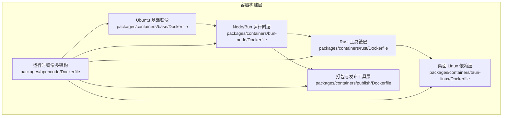
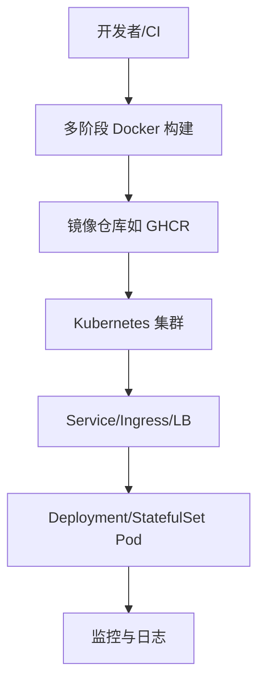
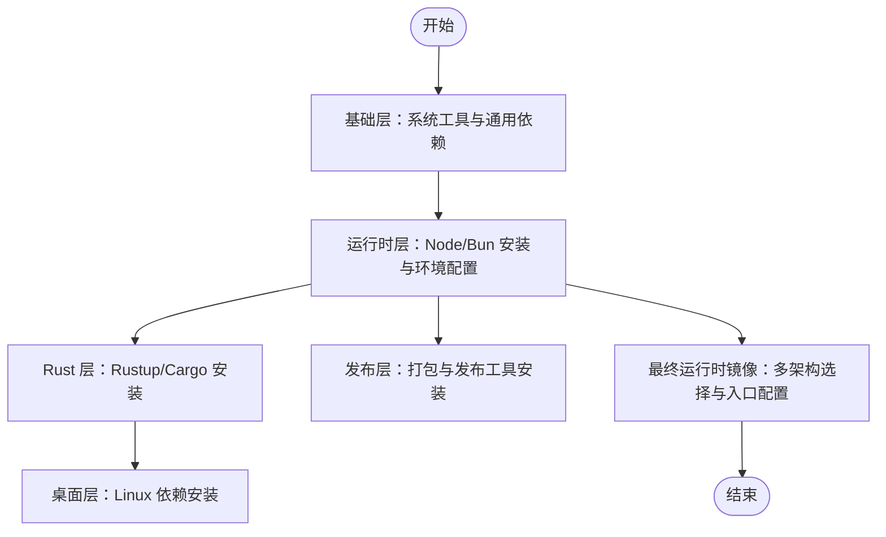
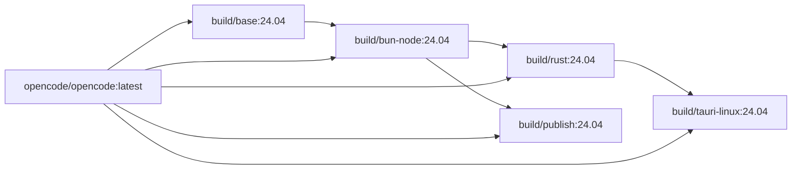

# 容器化部署

<cite>
**本文引用的文件**
- [packages/containers/base/Dockerfile](file://packages/containers/base/Dockerfile)
- [packages/containers/bun-node/Dockerfile](file://packages/containers/bun-node/Dockerfile)
- [packages/containers/publish/Dockerfile](file://packages/containers/publish/Dockerfile)
- [packages/containers/rust/Dockerfile](file://packages/containers/rust/Dockerfile)
- [packages/containers/tauri-linux/Dockerfile](file://packages/containers/tauri-linux/Dockerfile)
- [packages/opencode/Dockerfile](file://packages/opencode/Dockerfile)
- [packages/opencode/src/provider/provider.ts](file://packages/opencode/src/provider/provider.ts)
- [packages/opencode/test/mcp/headers.test.ts](file://packages/opencode/test/mcp/headers.test.ts)
- [packages/console/app/src/i18n/en.ts](file://packages/console/app/src/i18n/en.ts)
- [packages/console/app/src/routes/zen/util/handler.ts](file://packages/console/app/src/routes/zen/util/handler.ts)
- [packages/app/src/pages/layout.tsx](file://packages/app/src/pages/layout.tsx)
- [packages/strategy-front/pnpm-lock.yaml](file://packages/strategy-front/pnpm-lock.yaml)
- [packages/desktop/src-tauri/Cargo.lock](file://packages/desktop/src-tauri/Cargo.lock)
- [packages/strategy-service/Taskfile.yml](file://packages/strategy-service/Taskfile.yml)
- [github/action.yml](file://github/action.yml)
- [README.md](file://README.md)
</cite>

## 目录
1. [简介](#简介)
2. [项目结构](#项目结构)
3. [核心组件](#核心组件)
4. [架构总览](#架构总览)
5. [详细组件分析](#详细组件分析)
6. [依赖关系分析](#依赖关系分析)
7. [性能考量](#性能考量)
8. [故障排查指南](#故障排查指南)
9. [结论](#结论)
10. [附录](#附录)

## 简介
本指南面向在企业与云原生环境中部署 OpenCode 的工程团队，系统阐述容器镜像构建（含多阶段与体积优化）、Kubernetes 部署清单与 Helm Chart 配置、服务发现与负载均衡、安全与网络策略、存储卷、监控与日志、健康检查以及版本管理、滚动更新与回滚策略。文档基于仓库中现有的容器构建脚本与相关配置进行说明，并提供可落地的实施建议。

## 项目结构
OpenCode 在 packages/containers 下维护了多类基础镜像与构建链路，覆盖 Ubuntu 基础、Node/Bun 运行时、Rust 工具链以及 Tauri 桌面应用的 Linux 构建环境；同时在 packages/opencode 提供了最终运行镜像的多架构入口。整体采用分层与多阶段构建，以实现最小化镜像体积与可复现性。

图表来源
- [packages/containers/base/Dockerfile:1-19](file://packages/containers/base/Dockerfile#L1-L19)
- [packages/containers/bun-node/Dockerfile:1-25](file://packages/containers/bun-node/Dockerfile#L1-L25)
- [packages/containers/rust/Dockerfile:1-14](file://packages/containers/rust/Dockerfile#L1-L14)
- [packages/containers/tauri-linux/Dockerfile:1-13](file://packages/containers/tauri-linux/Dockerfile#L1-L13)
- [packages/containers/publish/Dockerfile:1-11](file://packages/containers/publish/Dockerfile#L1-L11)
- [packages/opencode/Dockerfile:1-19](file://packages/opencode/Dockerfile#L1-L19)

章节来源
- [packages/containers/base/Dockerfile:1-19](file://packages/containers/base/Dockerfile#L1-L19)
- [packages/containers/bun-node/Dockerfile:1-25](file://packages/containers/bun-node/Dockerfile#L1-L25)
- [packages/containers/rust/Dockerfile:1-14](file://packages/containers/rust/Dockerfile#L1-L14)
- [packages/containers/tauri-linux/Dockerfile:1-13](file://packages/containers/tauri-linux/Dockerfile#L1-L13)
- [packages/containers/publish/Dockerfile:1-11](file://packages/containers/publish/Dockerfile#L1-L11)
- [packages/opencode/Dockerfile:1-19](file://packages/opencode/Dockerfile#L1-L19)

## 核心组件
- 多阶段构建与分层
  - 基础层：安装系统工具与通用依赖，减少后续层的体积与变更频率。
  - 运行时层：安装 Node/Bun，设置 PATH 与运行环境变量，确保可执行能力。
  - Rust 层：安装 Rustup 与 Cargo，便于构建二进制或桌面应用。
  - 桌面层：为 Tauri 应用准备 Linux 依赖包。
  - 发布层：安装打包与发布工具（如 docker.io），用于 CI/CD 场景。
  - 运行时镜像：多架构选择（amd64/arm64），通过 TARGETARCH 选择对应构建阶段，最终以 opencode 可执行文件作为入口。
- 镜像体积优化
  - 使用 Alpine 作为最终运行时基础镜像，结合 musl 链接与裁剪工具，显著降低体积。
  - 合理利用多阶段构建，仅在最终镜像保留必要二进制与运行时依赖。
  - 清理包管理器缓存与临时文件，避免冗余层。
- 版本与可复现性
  - 明确指定 Node/Bun/Rust 版本参数，确保不同环境一致。
  - 使用 ARG 注入版本信息，便于在 CI 中替换与追踪。

章节来源
- [packages/containers/base/Dockerfile:1-19](file://packages/containers/base/Dockerfile#L1-L19)
- [packages/containers/bun-node/Dockerfile:1-25](file://packages/containers/bun-node/Dockerfile#L1-L25)
- [packages/containers/rust/Dockerfile:1-14](file://packages/containers/rust/Dockerfile#L1-L14)
- [packages/containers/tauri-linux/Dockerfile:1-13](file://packages/containers/tauri-linux/Dockerfile#L1-L13)
- [packages/containers/publish/Dockerfile:1-11](file://packages/containers/publish/Dockerfile#L1-L11)
- [packages/opencode/Dockerfile:1-19](file://packages/opencode/Dockerfile#L1-L19)

## 架构总览
下图展示从源码到容器镜像再到 Kubernetes 集群的端到端流程。该图为概念性示意，帮助理解容器化部署的整体思路。

## 详细组件分析

### 组件 A：多阶段构建与镜像体积优化
- 分层设计
  - 基础层：安装系统工具与通用依赖，保持最小化。
  - 运行时层：安装 Node/Bun 并启用 Corepack，确保包管理器可用。
  - Rust 层：安装 Rustup 与 Cargo，支持后续二进制构建。
  - 桌面层：安装 Tauri 所需 Linux 依赖。
  - 发布层：安装 docker.io 等打包工具，便于 CI/CD。
  - 运行时镜像：使用 Alpine 作为最终基础镜像，按 TARGETARCH 选择对应二进制，禁用运行时转译缓存以适配临时容器。
- 优化要点
  - 使用 --no-install-recommends 减少依赖体积。
  - 在安装后立即清理包管理器缓存。
  - 将大型工具链（如 Rust）放在独立层，避免频繁重建。
  - 最终镜像仅保留运行所需二进制与共享库。

图表来源
- [packages/containers/base/Dockerfile:1-19](file://packages/containers/base/Dockerfile#L1-L19)
- [packages/containers/bun-node/Dockerfile:1-25](file://packages/containers/bun-node/Dockerfile#L1-L25)
- [packages/containers/rust/Dockerfile:1-14](file://packages/containers/rust/Dockerfile#L1-L14)
- [packages/containers/tauri-linux/Dockerfile:1-13](file://packages/containers/tauri-linux/Dockerfile#L1-L13)
- [packages/containers/publish/Dockerfile:1-11](file://packages/containers/publish/Dockerfile#L1-L11)
- [packages/opencode/Dockerfile:1-19](file://packages/opencode/Dockerfile#L1-L19)

章节来源
- [packages/containers/base/Dockerfile:1-19](file://packages/containers/base/Dockerfile#L1-L19)
- [packages/containers/bun-node/Dockerfile:1-25](file://packages/containers/bun-node/Dockerfile#L1-L25)
- [packages/containers/rust/Dockerfile:1-14](file://packages/containers/rust/Dockerfile#L1-L14)
- [packages/containers/tauri-linux/Dockerfile:1-13](file://packages/containers/tauri-linux/Dockerfile#L1-L13)
- [packages/containers/publish/Dockerfile:1-11](file://packages/containers/publish/Dockerfile#L1-L11)
- [packages/opencode/Dockerfile:1-19](file://packages/opencode/Dockerfile#L1-L19)

### 组件 B：Kubernetes 部署清单与 Helm Chart 配置
- Deployment/StatefulSet
  - 使用 Deployment 管理无状态服务，StatefulSet 管理有状态数据（如数据库）。
  - 设置副本数、资源请求与限制，启用滚动更新策略。
- Service/Ingress/LB
  - ClusterIP/NodePort/LoadBalancer 三种 Service 类型按需选择。
  - 使用 Ingress 控制器暴露对外访问，配置 TLS 与路径路由。
- ConfigMap/Secret
  - 将配置与密钥分离，通过挂载方式注入容器。
- 存储卷
  - PersistentVolumeClaim 用于需要持久化的数据目录。
  - EmptyDir/ConfigMap/Secret 等用于临时或只读配置。
- 资源与策略
  - LimitRange/ResourceQuota 控制命名空间资源上限。
  - PodSecurity/NetworkPolicy 实施安全基线与网络隔离。

说明：本节为通用实践指导，未直接分析具体文件，故不附加“章节来源”。

### 组件 C：服务发现与负载均衡
- 服务发现
  - 通过 Kubernetes Service 的 DNS 名称实现服务间发现。
  - 结合 Headless Service 支持 Pod 直接访问。
- 负载均衡
  - Service 层面对内负载均衡。
  - Ingress/NLB/Cloud LB 对外流量分发，配合健康检查与超时配置。

说明：本节为通用实践指导，未直接分析具体文件，故不附加“章节来源”。

### 组件 D：安全策略、网络策略与存储卷
- 安全策略
  - 使用 PodSecurity 标准（如 baseline/restricted）约束容器权限。
  - 限制特权模式与主机命名空间访问，启用非 root 用户运行。
  - Secret 管理与最小权限原则，避免硬编码敏感信息。
- 网络策略
  - 默认拒绝入站/出站流量，仅放行必要的端口与服务。
  - 使用命名空间隔离与细粒度规则控制服务间通信。
- 存储卷
  - 为日志与数据目录配置 PVC，设置合适的 StorageClass 与回收策略。
  - 使用 ReadOnlyMany/ReadWriteOnce 等访问模式满足业务需求。

说明：本节为通用实践指导，未直接分析具体文件，故不附加“章节来源”。

### 组件 E：监控、日志聚合与健康检查
- 健康检查
  - livenessProbe/readinessProbe 探针基于 HTTP 或 TCP 检查。
  - 合理设置初始延迟、探针间隔与超时时间，避免误杀。
- 日志
  - 将日志输出到 stdout/stderr，由节点或 Sidecar 收集。
  - 使用 Fluent Bit/Fluentd/Vector 等聚合至集中式日志系统。
- 监控
  - Prometheus Exporter 暴露指标，Prometheus 抓取。
  - Grafana 展示仪表盘，告警集成 Alertmanager。

说明：本节为通用实践指导，未直接分析具体文件，故不附加“章节来源”。

### 组件 F：版本管理、滚动更新与回滚策略
- 版本管理
  - 镜像标签采用语义化版本（如 v1.2.3）或短哈希（CI 自动生成）。
  - Helm Chart 使用 appVersion 与 version 字段区分应用与 Chart 版本。
- 滚动更新
  - Deployment 设置 maxUnavailable 与 maxSurge，保证更新期间的服务连续性。
- 回滚
  - 使用 kubectl rollout undo 或 Helm rollback 快速回退至上一版本。
  - 预留金丝雀/蓝绿发布策略以降低风险。

说明：本节为通用实践指导，未直接分析具体文件，故不附加“章节来源”。

## 依赖关系分析
OpenCode 的容器构建链路呈现清晰的层次依赖，最终运行镜像依赖于各中间层提供的工具与运行时。下图展示镜像之间的继承关系与构建顺序。

图表来源
- [packages/containers/bun-node/Dockerfile:1-2](file://packages/containers/bun-node/Dockerfile#L1-L2)
- [packages/containers/rust/Dockerfile:1-2](file://packages/containers/rust/Dockerfile#L1-L2)
- [packages/containers/tauri-linux/Dockerfile:1-2](file://packages/containers/tauri-linux/Dockerfile#L1-L2)
- [packages/containers/publish/Dockerfile:1-2](file://packages/containers/publish/Dockerfile#L1-L2)
- [packages/opencode/Dockerfile:1-2](file://packages/opencode/Dockerfile#L1-L2)

章节来源
- [packages/containers/bun-node/Dockerfile:1-2](file://packages/containers/bun-node/Dockerfile#L1-L2)
- [packages/containers/rust/Dockerfile:1-2](file://packages/containers/rust/Dockerfile#L1-L2)
- [packages/containers/tauri-linux/Dockerfile:1-2](file://packages/containers/tauri-linux/Dockerfile#L1-L2)
- [packages/containers/publish/Dockerfile:1-2](file://packages/containers/publish/Dockerfile#L1-L2)
- [packages/opencode/Dockerfile:1-2](file://packages/opencode/Dockerfile#L1-L2)

## 性能考量
- 镜像体积
  - 使用 Alpine 与多阶段构建，减少最终镜像体积，缩短拉取时间。
  - 合理合并 RUN 指令与清理缓存，避免产生额外层。
- 启动与运行时
  - 禁用运行时转译缓存以适应临时容器场景，减少 I/O 开销。
  - 选择静态链接（musl）与精简依赖，提升启动速度。
- 资源与并发
  - 合理设置 CPU/内存请求与限制，避免资源争抢。
  - 通过水平扩展与亲和性调度提升稳定性与吞吐。

说明：本节提供一般性建议，未直接分析具体文件，故不附加“章节来源”。

## 故障排查指南
- 构建失败
  - 检查网络代理与镜像仓库可达性，确认 ARG 版本号有效。
  - 查看上一层构建是否成功，定位具体失败阶段。
- 镜像过大
  - 确认是否遗漏清理缓存与临时文件。
  - 检查是否将开发依赖误放入最终镜像。
- 运行异常
  - 查看容器日志与事件，确认健康检查与探针配置合理。
  - 核对挂载卷权限与路径，确保应用可读写。
- 安全问题
  - 确认未使用特权模式运行，Secret 是否正确挂载。
  - 检查 NetworkPolicy 是否阻断必要流量。

章节来源
- [packages/opencode/Dockerfile:3-6](file://packages/opencode/Dockerfile#L3-L6)
- [packages/containers/base/Dockerfile:18-19](file://packages/containers/base/Dockerfile#L18-L19)
- [packages/containers/bun-node/Dockerfile:9-10](file://packages/containers/bun-node/Dockerfile#L9-L10)

## 结论
通过分层与多阶段构建，OpenCode 的容器镜像实现了良好的可复现性与体积控制。结合 Kubernetes 的标准部署实践与企业级安全、网络与存储策略，可实现稳定、可观测且可演进的生产级部署。建议在 CI 中固化版本与校验步骤，在生产中采用滚动更新与回滚机制，配合监控与日志体系，持续优化交付质量与运维效率。

## 附录
- 相关文件索引
  - [packages/containers/base/Dockerfile](file://packages/containers/base/Dockerfile)
  - [packages/containers/bun-node/Dockerfile](file://packages/containers/bun-node/Dockerfile)
  - [packages/containers/rust/Dockerfile](file://packages/containers/rust/Dockerfile)
  - [packages/containers/tauri-linux/Dockerfile](file://packages/containers/tauri-linux/Dockerfile)
  - [packages/containers/publish/Dockerfile](file://packages/containers/publish/Dockerfile)
  - [packages/opencode/Dockerfile](file://packages/opencode/Dockerfile)
  - [packages/opencode/src/provider/provider.ts](file://packages/opencode/src/provider/provider.ts)
  - [packages/opencode/test/mcp/headers.test.ts](file://packages/opencode/test/mcp/headers.test.ts)
  - [packages/console/app/src/i18n/en.ts](file://packages/console/app/src/i18n/en.ts)
  - [packages/console/app/src/routes/zen/util/handler.ts](file://packages/console/app/src/routes/zen/util/handler.ts)
  - [packages/app/src/pages/layout.tsx](file://packages/app/src/pages/layout.tsx)
  - [packages/strategy-front/pnpm-lock.yaml](file://packages/strategy-front/pnpm-lock.yaml)
  - [packages/desktop/src-tauri/Cargo.lock](file://packages/desktop/src-tauri/Cargo.lock)
  - [packages/strategy-service/Taskfile.yml](file://packages/strategy-service/Taskfile.yml)
  - [github/action.yml](file://github/action.yml)
  - [README.md](file://README.md)