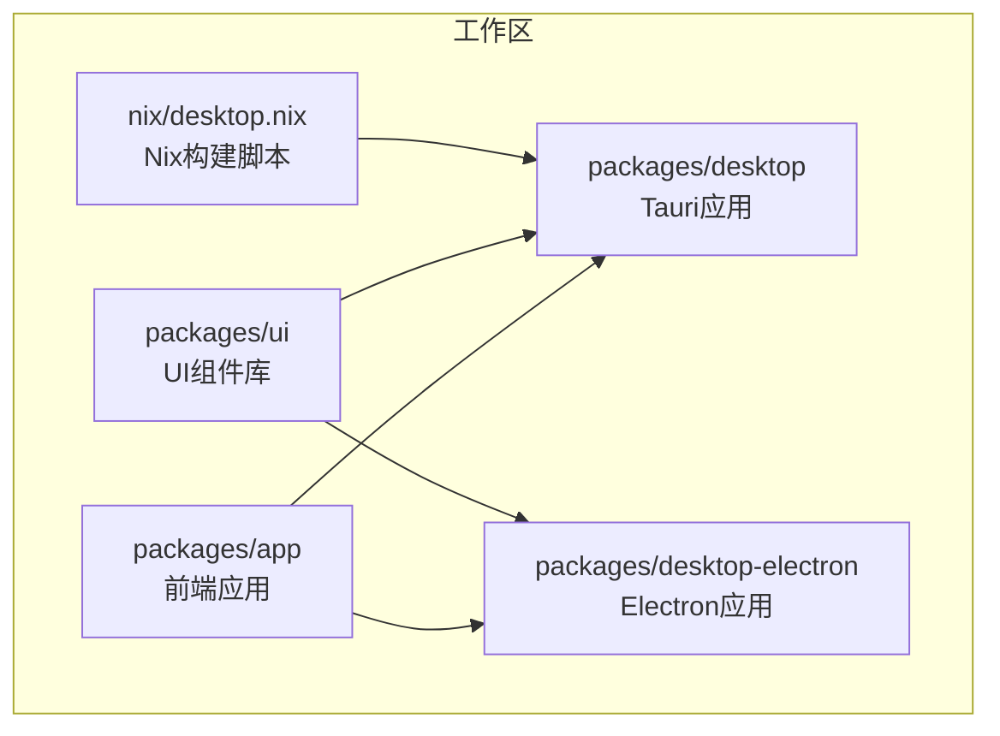
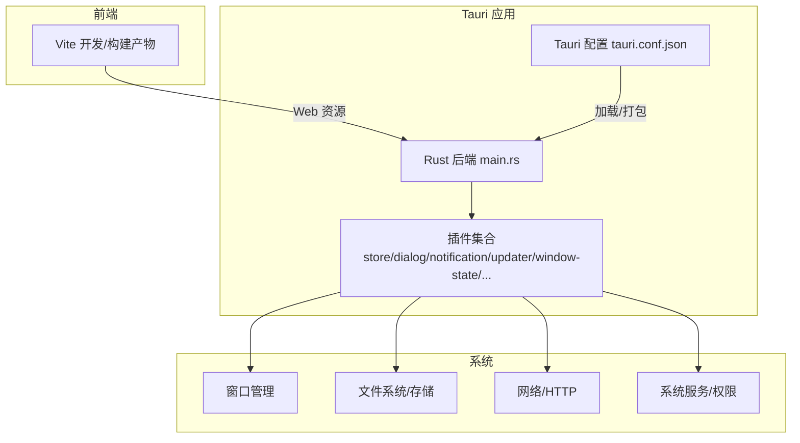
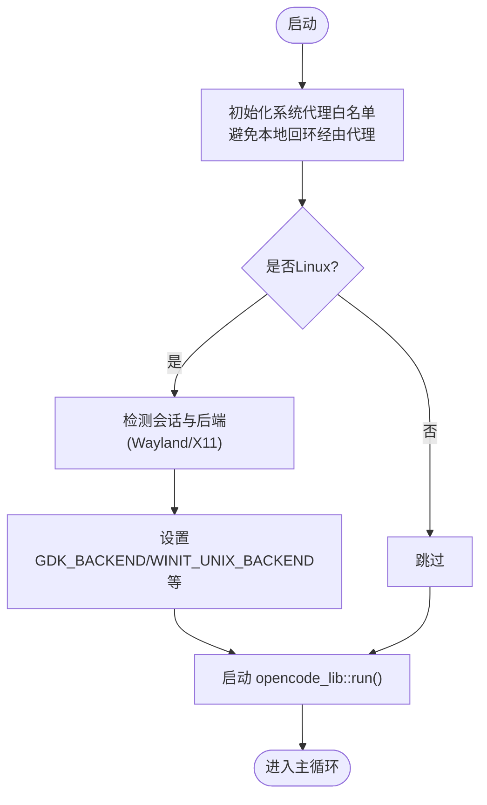
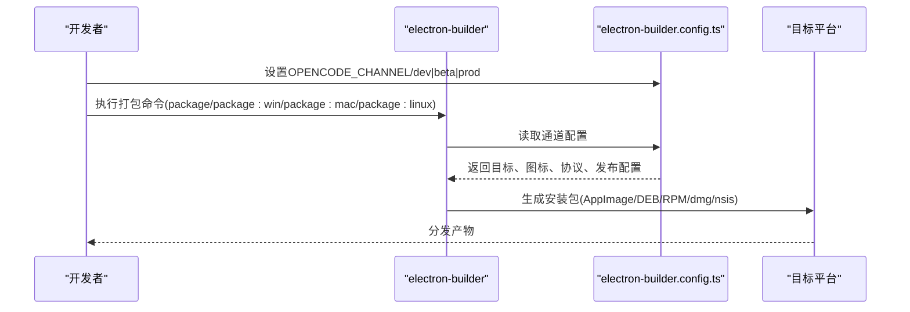
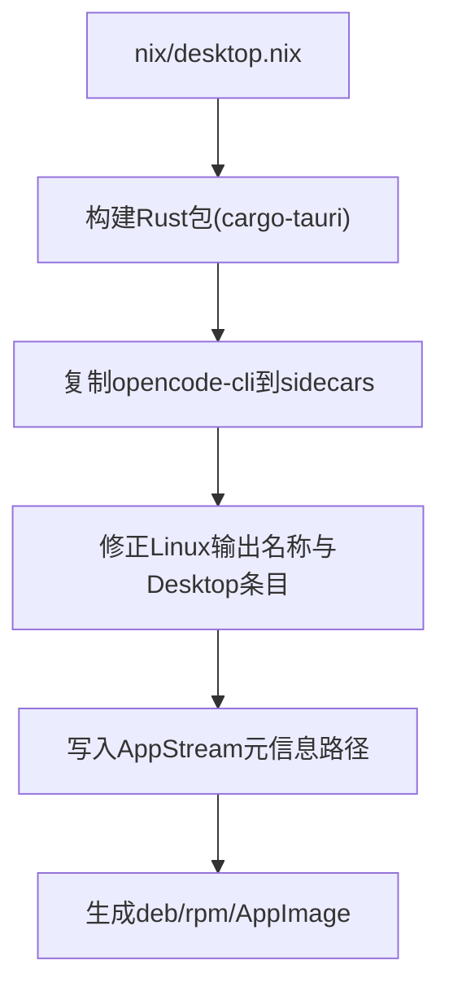
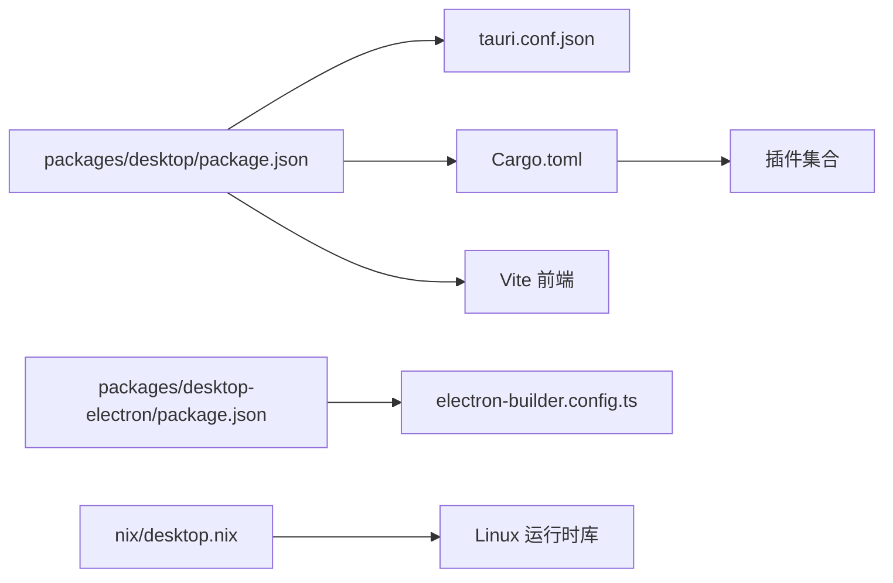

# 桌面应用

<cite>
**本文引用的文件**
- [packages/desktop/package.json](file://packages/desktop/package.json)
- [packages/desktop/src-tauri/tauri.conf.json](file://packages/desktop/src-tauri/tauri.conf.json)
- [packages/desktop/src-tauri/tauri.prod.conf.json](file://packages/desktop/src-tauri/tauri.prod.conf.json)
- [packages/desktop/src-tauri/Cargo.toml](file://packages/desktop/src-tauri/Cargo.toml)
- [packages/desktop/src-tauri/build.rs](file://packages/desktop/src-tauri/build.rs)
- [packages/desktop/src-tauri/entitlements.plist](file://packages/desktop/src-tauri/entitlements.plist)
- [packages/desktop/src-tauri/src/main.rs](file://packages/desktop/src-tauri/src/main.rs)
- [packages/desktop-electron/package.json](file://packages/desktop-electron/package.json)
- [packages/desktop-electron/electron-builder.config.ts](file://packages/desktop-electron/electron-builder.config.ts)
- [nix/desktop.nix](file://nix/desktop.nix)
</cite>

## 目录
1. [简介](#简介)
2. [项目结构](#项目结构)
3. [核心组件](#核心组件)
4. [架构总览](#架构总览)
5. [详细组件分析](#详细组件分析)
6. [依赖关系分析](#依赖关系分析)
7. [性能考虑](#性能考虑)
8. [故障排除指南](#故障排除指南)
9. [结论](#结论)
10. [附录](#附录)

## 简介
本文件面向OpenCode桌面应用的部署与使用，重点覆盖以下方面：
- Tauri桌面应用在Windows、macOS与Linux平台的打包与分发流程
- Electron版本的实现差异与兼容性要求
- 首次启动配置、权限与系统集成选项
- 应用图标、菜单栏、托盘等界面元素的配置方法
- 数据存储位置、备份恢复与更新机制
- 平台特定的性能优化建议与常见问题解决方案

## 项目结构
OpenCode采用多包工作区组织，桌面应用相关的核心目录如下：
- packages/desktop：基于Tauri 2的原生桌面应用（Rust后端 + 前端）
- packages/desktop-electron：基于Electron的替代实现（Node/Electron生态）
- nix/desktop.nix：Nix构建脚本，用于在Linux环境下构建与打包

**章节来源**
- [packages/desktop/package.json:1-45](file://packages/desktop/package.json#L1-L45)
- [packages/desktop-electron/package.json:1-54](file://packages/desktop-electron/package.json#L1-L54)
- [nix/desktop.nix:1-101](file://nix/desktop.nix#L1-L101)

## 核心组件
- Tauri应用（packages/desktop）：使用Rust作为后端，SolidJS作为前端，通过Tauri CLI与插件体系实现系统级能力（剪贴板、对话框、通知、窗口状态、HTTP、进程、存储、更新器、深链等）。
- Electron应用（packages/desktop-electron）：使用Electron + electron-builder进行跨平台打包，支持macOS签名与公证、Windows NSIS安装器、Linux AppImage/DEB/RPM。
- Nix构建（nix/desktop.nix）：在Linux环境下统一构建依赖与运行时，处理GTK/WebKit等系统库，并将CLI侧车程序嵌入。

**章节来源**
- [packages/desktop/src-tauri/Cargo.toml:1-76](file://packages/desktop/src-tauri/Cargo.toml#L1-L76)
- [packages/desktop/src-tauri/tauri.conf.json:1-63](file://packages/desktop/src-tauri/tauri.conf.json#L1-L63)
- [packages/desktop-electron/electron-builder.config.ts:1-98](file://packages/desktop-electron/electron-builder.config.ts#L1-L98)
- [nix/desktop.nix:1-101](file://nix/desktop.nix#L1-L101)

## 架构总览
下图展示了Tauri桌面应用的典型运行时架构：前端通过Vite开发服务器或构建产物运行；Tauri后端负责系统集成与原生能力调用；打包阶段生成各平台安装包与元数据。

**图表来源**
- [packages/desktop/src-tauri/src/main.rs:42-79](file://packages/desktop/src-tauri/src/main.rs#L42-L79)
- [packages/desktop/src-tauri/tauri.conf.json:13-61](file://packages/desktop/src-tauri/tauri.conf.json#L13-L61)
- [packages/desktop/src-tauri/Cargo.toml:20-48](file://packages/desktop/src-tauri/Cargo.toml#L20-L48)

**章节来源**
- [packages/desktop/src-tauri/src/main.rs:1-79](file://packages/desktop/src-tauri/src/main.rs#L1-L79)
- [packages/desktop/src-tauri/tauri.conf.json:1-63](file://packages/desktop/src-tauri/tauri.conf.json#L1-L63)
- [packages/desktop/src-tauri/Cargo.toml:1-76](file://packages/desktop/src-tauri/Cargo.toml#L1-L76)

## 详细组件分析

### Tauri 应用（Windows/macOS/Linux）
- 打包目标与图标
  - 支持targets：deb、rpm、dmg、nsis、app，满足主流发行渠道
  - 图标资源位于icons/dev与icons/prod，区分开发与生产环境
  - Windows NSIS安装器可配置头部与侧边图片
  - macOS entitlements启用JIT与音频输入等能力
- 更新机制
  - 生产配置启用updater工件生成，指定公钥与发布端点
- 深链与协议
  - 注册opencode协议，便于系统内唤起
- 插件能力
  - store、dialog、notification、window-state、http、process、opener、clipboard-manager、updater、single-instance、os等
- Linux显示后端优化
  - 运行时根据会话环境选择X11/Wayland，设置GDK_BACKEND等环境变量以提升兼容性

**图表来源**
- [packages/desktop/src-tauri/src/main.rs:42-79](file://packages/desktop/src-tauri/src/main.rs#L42-L79)

**章节来源**
- [packages/desktop/src-tauri/tauri.conf.json:26-61](file://packages/desktop/src-tauri/tauri.conf.json#L26-L61)
- [packages/desktop/src-tauri/tauri.prod.conf.json:1-39](file://packages/desktop/src-tauri/tauri.prod.conf.json#L1-L39)
- [packages/desktop/src-tauri/entitlements.plist:1-19](file://packages/desktop/src-tauri/entitlements.plist#L1-L19)
- [packages/desktop/src-tauri/src/main.rs:5-40](file://packages/desktop/src-tauri/src/main.rs#L5-L40)

### Electron 应用（Windows/macOS/Linux）
- 打包与分发
  - 使用electron-builder，按通道(dev/beta/prod)输出不同产品名与应用ID
  - macOS启用hardened runtime与notarization，配置entitlements
  - Windows使用NSIS安装器，允许自定义安装路径
  - Linux支持AppImage、deb、rpm，配置图标与分类
- 协议与侧车程序
  - 注册opencode协议，安装时复制opencode-cli到安装目录
  - 通过extraResources注入native模块与Swift构建产物
- 更新与发布
  - 通过GitHub发布通道配置自动更新（beta/prod）

**图表来源**
- [packages/desktop-electron/electron-builder.config.ts:3-98](file://packages/desktop-electron/electron-builder.config.ts#L3-L98)

**章节来源**
- [packages/desktop-electron/electron-builder.config.ts:1-98](file://packages/desktop-electron/electron-builder.config.ts#L1-L98)
- [packages/desktop-electron/package.json:12-24](file://packages/desktop-electron/package.json#L12-L24)

### Nix 构建（Linux）
- 构建环境
  - 统一构建Rust与Node/Bun工具链，处理cargo-tauri钩子
  - Linux运行时依赖GTK4、WebKit、GStreamer等系统库
- 产物与元信息
  - 将CLI侧车程序复制到sidecars目录
  - Linux输出重命名与Desktop条目修正，确保可执行名称与Desktop文件一致
  - DEB元信息文件映射到/usr/share/metainfo路径

**图表来源**
- [nix/desktop.nix:26-101](file://nix/desktop.nix#L26-L101)

**章节来源**
- [nix/desktop.nix:1-101](file://nix/desktop.nix#L1-L101)

## 依赖关系分析
- Tauri应用依赖
  - Rust后端通过Cargo.toml声明tauri与各类插件依赖
  - 前端通过Vite构建，Tauri配置指定devUrl与构建前命令
- Electron应用依赖
  - electron-builder负责打包，electron-updater用于更新
  - 通过extraResources注入native模块与CLI侧车
- Nix构建依赖
  - 通过wrapGAppsHook4、GTK/WebKit/GStreamer等系统库保证Linux运行时

**图表来源**
- [packages/desktop/package.json:7-14](file://packages/desktop/package.json#L7-L14)
- [packages/desktop/src-tauri/tauri.conf.json:7-12](file://packages/desktop/src-tauri/tauri.conf.json#L7-L12)
- [packages/desktop/src-tauri/Cargo.toml:20-48](file://packages/desktop/src-tauri/Cargo.toml#L20-L48)
- [packages/desktop-electron/package.json:25-41](file://packages/desktop-electron/package.json#L25-L41)
- [packages/desktop-electron/electron-builder.config.ts:9-60](file://packages/desktop-electron/electron-builder.config.ts#L9-L60)
- [nix/desktop.nix:39-64](file://nix/desktop.nix#L39-L64)

**章节来源**
- [packages/desktop/package.json:1-45](file://packages/desktop/package.json#L1-L45)
- [packages/desktop/src-tauri/Cargo.toml:1-76](file://packages/desktop/src-tauri/Cargo.toml#L1-L76)
- [packages/desktop-electron/package.json:1-54](file://packages/desktop-electron/package.json#L1-L54)
- [nix/desktop.nix:1-101](file://nix/desktop.nix#L1-L101)

## 性能考虑
- Linux显示后端选择
  - 在启动早期根据会话环境选择Wayland或X11，有助于减少渲染抖动与提高兼容性
- 代理绕过本地回环
  - 初始化NO_PROXY/ no_proxy，避免本地服务被代理影响
- 包体积与压缩
  - RPM配置中关闭压缩以降低CPU开销，适合CI环境
- 系统库与运行时
  - Nix构建统一管理系统库版本，避免运行时缺失导致的二次拉取与失败

**章节来源**
- [packages/desktop/src-tauri/src/main.rs:5-40](file://packages/desktop/src-tauri/src/main.rs#L5-L40)
- [packages/desktop/src-tauri/tauri.prod.conf.json:25-29](file://packages/desktop/src-tauri/tauri.prod.conf.json#L25-L29)
- [nix/desktop.nix:50-64](file://nix/desktop.nix#L50-L64)

## 故障排除指南
- macOS启动黑屏或白屏
  - 检查entitlements.plist中的JIT与音频输入权限是否启用
  - 确认Hardened Runtime与Notarization配置正确
- Linux窗口无法显示或渲染异常
  - 确认GDK_BACKEND/WINIT_UNIX_BACKEND环境变量已正确设置
  - 检查WebKit DMABUF相关环境变量是否按需禁用
- Windows安装器静默失败
  - 检查NSIS安装器图标与头部/侧边图片路径
  - 确认安装目录权限与杀软拦截
- 更新失败或无法触发
  - 确认生产配置中的updater公钥与发布端点有效
  - 检查GitHub发布通道与latest.json格式
- Electron侧车程序不可用
  - 确认extraResources已正确复制opencode-cli与native模块
  - 检查通道配置是否匹配当前发布仓库

**章节来源**
- [packages/desktop/src-tauri/entitlements.plist:1-19](file://packages/desktop/src-tauri/entitlements.plist#L1-L19)
- [packages/desktop/src-tauri/src/main.rs:5-40](file://packages/desktop/src-tauri/src/main.rs#L5-L40)
- [packages/desktop/src-tauri/tauri.prod.conf.json:32-37](file://packages/desktop/src-tauri/tauri.prod.conf.json#L32-L37)
- [packages/desktop-electron/electron-builder.config.ts:15-27](file://packages/desktop-electron/electron-builder.config.ts#L15-L27)

## 结论
OpenCode桌面应用提供了两套实现方案：Tauri原生方案与Electron方案。前者强调轻量与原生能力，后者强调生态与易用性。通过完善的打包配置与平台特定优化，可在Windows、macOS与Linux上稳定交付。建议根据团队技术栈与分发策略选择合适方案，并结合本文提供的配置与排障建议完成部署与维护。

## 附录

### 首次启动配置与系统集成
- 首次启动
  - Tauri：通过Vite dev或build产物启动，遵循tauri.conf.json中的devUrl与构建前命令
  - Electron：通过electron-vite dev启动，随后使用electron-builder打包
- 权限与系统集成
  - macOS：entitlements.plist启用JIT与音频输入；可配置Deep Link协议
  - Linux：通过环境变量选择显示后端；确保系统库可用
  - Windows：NSIS安装器支持自定义安装路径与图标

**章节来源**
- [packages/desktop/src-tauri/tauri.conf.json:7-12](file://packages/desktop/src-tauri/tauri.conf.json#L7-L12)
- [packages/desktop/src-tauri/entitlements.plist:1-19](file://packages/desktop/src-tauri/entitlements.plist#L1-L19)
- [packages/desktop/src-tauri/src/main.rs:5-40](file://packages/desktop/src-tauri/src/main.rs#L5-L40)
- [packages/desktop-electron/electron-builder.config.ts:45-59](file://packages/desktop-electron/electron-builder.config.ts#L45-L59)

### 图标、菜单栏与托盘
- 图标
  - Tauri：icons/dev与icons/prod目录分别对应开发/生产图标
  - Electron：resources/icons目录用于各平台图标
- 菜单栏与托盘
  - Tauri：可通过window-state与系统托盘插件实现最小化到托盘与状态管理
  - Electron：通过主进程与BrowserWindow实现菜单与托盘逻辑

**章节来源**
- [packages/desktop/src-tauri/tauri.conf.json:27-33](file://packages/desktop/src-tauri/tauri.conf.json#L27-L33)
- [packages/desktop-electron/electron-builder.config.ts:28-40](file://packages/desktop-electron/electron-builder.config.ts#L28-L40)

### 数据存储、备份与恢复
- 存储位置
  - Tauri：使用store插件持久化键值对；具体路径由系统决定
  - Electron：使用electron-store持久化；可结合系统目录进行迁移
- 备份与恢复
  - 建议定期导出store内容与用户配置文件
  - 提供导入向导以恢复历史版本数据

**章节来源**
- [packages/desktop/src-tauri/Cargo.toml:28](file://packages/desktop/src-tauri/Cargo.toml#L28)
- [packages/desktop-electron/package.json:35](file://packages/desktop-electron/package.json#L35)

### 更新机制
- Tauri
  - 生产配置启用updater工件生成，配置公钥与发布端点
- Electron
  - 通过electron-updater与GitHub发布通道实现自动更新

**章节来源**
- [packages/desktop/src-tauri/tauri.prod.conf.json:32-37](file://packages/desktop/src-tauri/tauri.prod.conf.json#L32-L37)
- [packages/desktop-electron/package.json:36](file://packages/desktop-electron/package.json#L36)