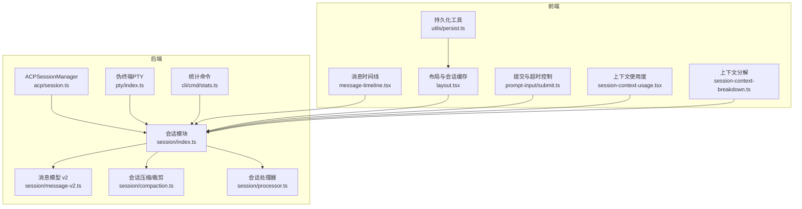
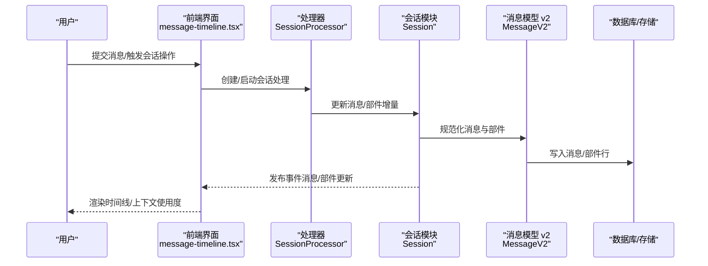
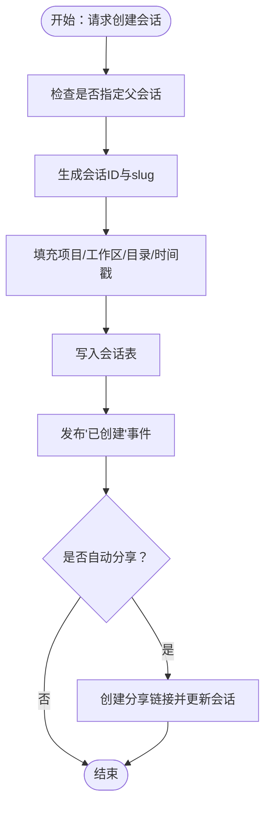
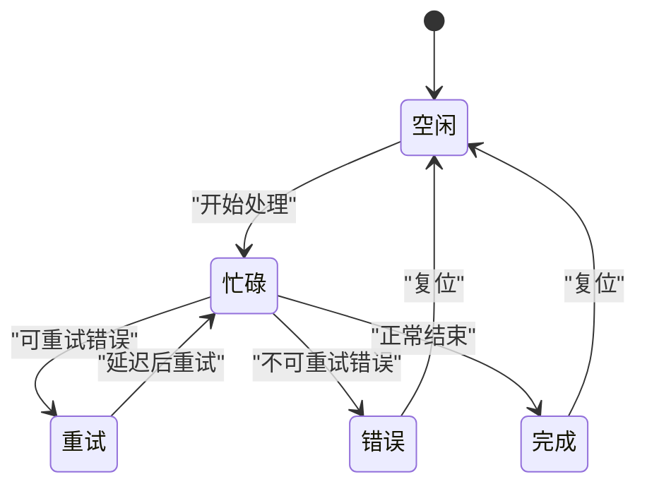
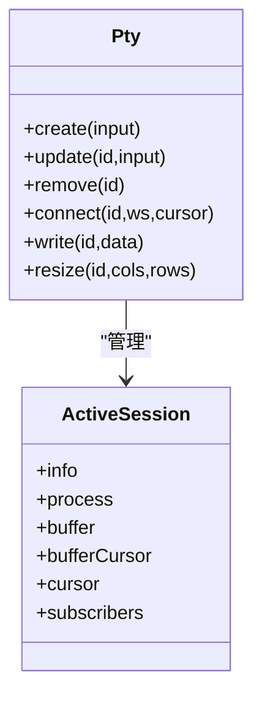
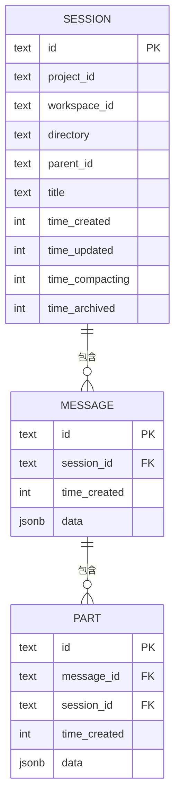
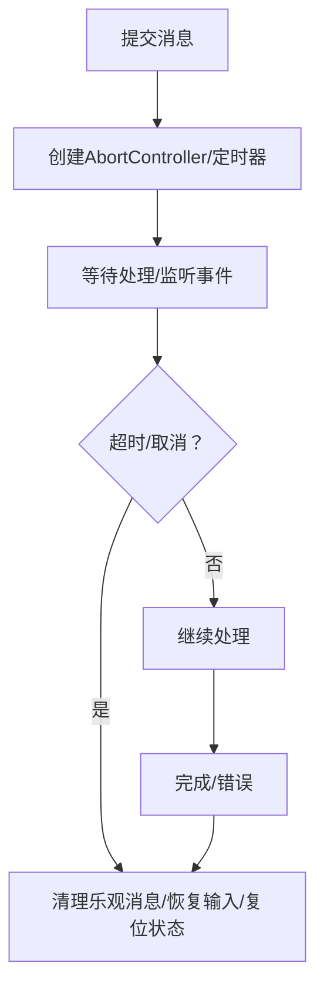
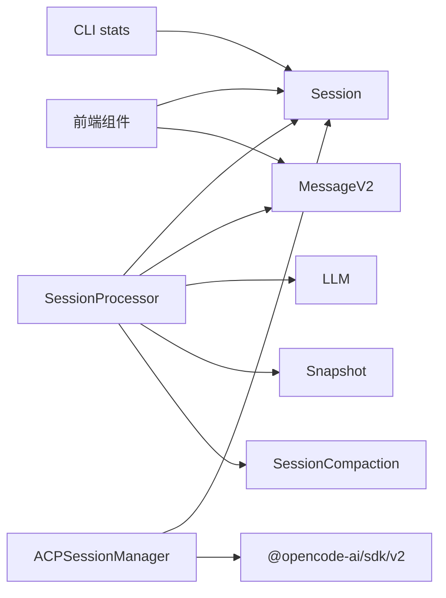

# 会话生命周期管理

<cite>
**本文档引用的文件**
- [packages/opencode/src/session/index.ts](file://packages/opencode/src/session/index.ts)
- [packages/opencode/src/session/message-v2.ts](file://packages/opencode/src/session/message-v2.ts)
- [packages/opencode/src/session/compaction.ts](file://packages/opencode/src/session/compaction.ts)
- [packages/opencode/src/session/processor.ts](file://packages/opencode/src/session/processor.ts)
- [packages/opencode/src/session/schema.ts](file://packages/opencode/src/session/schema.ts)
- [packages/opencode/src/acp/session.ts](file://packages/opencode/src/acp/session.ts)
- [packages/opencode/src/pty/index.ts](file://packages/opencode/src/pty/index.ts)
- [packages/opencode/src/cli/cmd/stats.ts](file://packages/opencode/src/cli/cmd/stats.ts)
- [packages/app/src/pages/session/message-timeline.tsx](file://packages/app/src/pages/session/message-timeline.tsx)
- [packages/app/src/context/layout.tsx](file://packages/app/src/context/layout.tsx)
- [packages/app/src/components/prompt-input/submit.ts](file://packages/app/src/components/prompt-input/submit.ts)
- [packages/app/src/components/session/session-context-breakdown.ts](file://packages/app/src/components/session/session-context-breakdown.ts)
- [packages/app/src/components/session-context-usage.tsx](file://packages/app/src/components/session-context-usage.tsx)
- [packages/app/src/context/global-sync/event-reducer.test.ts](file://packages/app/src/context/global-sync/event-reducer.test.ts)
- [packages/app/src/utils/persist.ts](file://packages/app/src/utils/persist.ts)
- [packages/opencode/src/storage/json-migration.ts](file://packages/opencode/src/storage/json-migration.ts)
- [packages/opencode/migration/20260303231226_add_workspace_fields/snapshot.json](file://packages/opencode/migration/20260303231226_add_workspace_fields/snapshot.json)
- [packages/opencode/migration/20260309230000_move_org_to_state/snapshot.json](file://packages/opencode/migration/20260309230000_move_org_to_state/snapshot.json)
- [packages/opencode/migration/20260312043431_session_message_cursor/snapshot.json](file://packages/opencode/migration/20260312043431_session_message_cursor/snapshot.json)
</cite>

## 目录
1. [引言](#引言)
2. [项目结构](#项目结构)
3. [核心组件](#核心组件)
4. [架构总览](#架构总览)
5. [详细组件分析](#详细组件分析)
6. [依赖关系分析](#依赖关系分析)
7. [性能考量](#性能考量)
8. [故障排查指南](#故障排查指南)
9. [结论](#结论)
10. [附录](#附录)

## 引言
本文件系统性阐述 OpenCode 中“会话”的完整生命周期管理，覆盖从创建、初始化、运行期维护、持久化与恢复、到超时与清理、以及监控与性能统计等全链路能力。文档同时解释会话状态转换、资源分配与回收、跨会话通信与共享、冲突解决策略，并通过可视化图示帮助读者快速把握关键流程。

## 项目结构
OpenCode 的会话管理由后端会话模块与前端会话界面共同组成：
- 后端会话模块：负责会话的创建、消息与部件（parts）的持久化、压缩与裁剪、处理器（LLM 流式处理）与状态机、统计与指标导出等。
- 前端会话界面：负责会话列表、消息时间线渲染、上下文使用度展示、提示词与输入提交、会话状态与事件的订阅与更新等。

图表来源
- [packages/opencode/src/session/index.ts:36-800](file://packages/opencode/src/session/index.ts#L36-L800)
- [packages/opencode/src/session/message-v2.ts:20-989](file://packages/opencode/src/session/message-v2.ts#L20-L989)
- [packages/opencode/src/session/compaction.ts:19-330](file://packages/opencode/src/session/compaction.ts#L19-L330)
- [packages/opencode/src/session/processor.ts:20-431](file://packages/opencode/src/session/processor.ts#L20-L431)
- [packages/opencode/src/acp/session.ts:8-117](file://packages/opencode/src/acp/session.ts#L8-L117)
- [packages/opencode/src/pty/index.ts:12-318](file://packages/opencode/src/pty/index.ts#L12-L318)
- [packages/opencode/src/cli/cmd/stats.ts:95-411](file://packages/opencode/src/cli/cmd/stats.ts#L95-L411)
- [packages/app/src/pages/session/message-timeline.tsx:106-350](file://packages/app/src/pages/session/message-timeline.tsx#L106-L350)
- [packages/app/src/context/layout.tsx:234-323](file://packages/app/src/context/layout.tsx#L234-L323)
- [packages/app/src/components/prompt-input/submit.ts:502-541](file://packages/app/src/components/prompt-input/submit.ts#L502-L541)
- [packages/app/src/components/session/session-context-breakdown.ts:30-81](file://packages/app/src/components/session/session-context-breakdown.ts#L30-L81)
- [packages/app/src/components/session-context-usage.tsx:31-80](file://packages/app/src/components/session-context-usage.tsx#L31-L80)
- [packages/app/src/utils/persist.ts:317-402](file://packages/app/src/utils/persist.ts#L317-L402)

章节来源
- [packages/opencode/src/session/index.ts:36-800](file://packages/opencode/src/session/index.ts#L36-L800)
- [packages/opencode/src/session/message-v2.ts:20-989](file://packages/opencode/src/session/message-v2.ts#L20-L989)
- [packages/opencode/src/session/compaction.ts:19-330](file://packages/opencode/src/session/compaction.ts#L19-L330)
- [packages/opencode/src/session/processor.ts:20-431](file://packages/opencode/src/session/processor.ts#L20-L431)
- [packages/opencode/src/acp/session.ts:8-117](file://packages/opencode/src/acp/session.ts#L8-L117)
- [packages/opencode/src/pty/index.ts:12-318](file://packages/opencode/src/pty/index.ts#L12-L318)
- [packages/opencode/src/cli/cmd/stats.ts:95-411](file://packages/opencode/src/cli/cmd/stats.ts#L95-L411)
- [packages/app/src/pages/session/message-timeline.tsx:106-350](file://packages/app/src/pages/session/message-timeline.tsx#L106-L350)
- [packages/app/src/context/layout.tsx:234-323](file://packages/app/src/context/layout.tsx#L234-L323)
- [packages/app/src/components/prompt-input/submit.ts:502-541](file://packages/app/src/components/prompt-input/submit.ts#L502-L541)
- [packages/app/src/components/session/session-context-breakdown.ts:30-81](file://packages/app/src/components/session/session-context-breakdown.ts#L30-L81)
- [packages/app/src/components/session-context-usage.tsx:31-80](file://packages/app/src/components/session-context-usage.tsx#L31-L80)
- [packages/app/src/utils/persist.ts:317-402](file://packages/app/src/utils/persist.ts#L317-L402)

## 核心组件
- 会话核心（Session）：提供会话创建、查询、标题设置、归档、权限与回退信息设置、消息与部件的增删改查、差异快照读取、全局/工作区会话列表等能力。
- 消息模型 v2（MessageV2）：定义用户/助手消息、文本/推理/文件/工具/子任务/补丁/快照等部件类型，支持流式增量更新、错误类型、媒体处理与模型消息转换。
- 会话处理器（SessionProcessor）：封装 LLM 流式处理，记录推理/文本/工具调用的增量变化，处理阻塞、重试、完成与失败场景，并在需要时触发压缩。
- 会话压缩/裁剪（SessionCompaction）：根据模型上下文限制判断是否溢出，进行裁剪与压缩，必要时注入继续对话的消息。
- ACPSessionManager：面向 ACP 协议的会话状态管理器，负责创建/加载会话、模型与变体设置、模式切换等。
- 伪终端（PTY）：为终端会话提供进程生命周期管理、缓冲区与订阅者管理、连接/断开与数据转发。
- 统计命令（CLI stats）：聚合会话消息、令牌与成本统计，按天/模型/工具维度输出报告。

章节来源
- [packages/opencode/src/session/index.ts:36-800](file://packages/opencode/src/session/index.ts#L36-L800)
- [packages/opencode/src/session/message-v2.ts:20-989](file://packages/opencode/src/session/message-v2.ts#L20-L989)
- [packages/opencode/src/session/processor.ts:20-431](file://packages/opencode/src/session/processor.ts#L20-L431)
- [packages/opencode/src/session/compaction.ts:19-330](file://packages/opencode/src/session/compaction.ts#L19-L330)
- [packages/opencode/src/acp/session.ts:8-117](file://packages/opencode/src/acp/session.ts#L8-L117)
- [packages/opencode/src/pty/index.ts:12-318](file://packages/opencode/src/pty/index.ts#L12-L318)
- [packages/opencode/src/cli/cmd/stats.ts:95-411](file://packages/opencode/src/cli/cmd/stats.ts#L95-L411)

## 架构总览
下图展示了从用户交互到后端处理、再到持久化与前端渲染的整体流程。

图表来源
- [packages/app/src/pages/session/message-timeline.tsx:106-350](file://packages/app/src/pages/session/message-timeline.tsx#L106-L350)
- [packages/opencode/src/session/processor.ts:46-431](file://packages/opencode/src/session/processor.ts#L46-L431)
- [packages/opencode/src/session/index.ts:686-776](file://packages/opencode/src/session/index.ts#L686-L776)
- [packages/opencode/src/session/message-v2.ts:451-489](file://packages/opencode/src/session/message-v2.ts#L451-L489)

## 详细组件分析

### 会话创建与初始化
- 创建流程
  - 通过会话模块创建新会话，生成唯一标识、slug、版本、项目/工作区绑定、目录与默认标题，写入数据库并发布“已创建”事件。
  - 若未指定父会话且满足条件，自动触发分享创建。
- 初始化参数与配置
  - 支持传入父会话ID、标题、权限规则、工作区ID等；内部使用实例目录与项目信息填充。
  - 配置项影响行为：如自动分享开关、压缩策略、裁剪策略等。

图表来源
- [packages/opencode/src/session/index.ts:297-338](file://packages/opencode/src/session/index.ts#L297-L338)
- [packages/opencode/src/session/index.ts:353-367](file://packages/opencode/src/session/index.ts#L353-L367)

章节来源
- [packages/opencode/src/session/index.ts:297-338](file://packages/opencode/src/session/index.ts#L297-L338)
- [packages/opencode/src/session/index.ts:353-367](file://packages/opencode/src/session/index.ts#L353-L367)

### 会话状态转换与运行时维护
- 状态机与事件
  - 处理器在流式处理过程中设置会话状态为“忙碌”，遇到错误进入“重试/空闲”，工具调用期间记录“运行中/完成/错误”等状态。
  - 会话模块发布“更新/删除/差异/错误”等事件，前端订阅并驱动 UI 更新。
- 运行时维护
  - 处理器对推理/文本/工具调用分别维护增量部件，自动清理未完成的工具调用。
  - 当检测到上下文溢出时，触发压缩流程并注入继续消息。

图表来源
- [packages/opencode/src/session/processor.ts:60-387](file://packages/opencode/src/session/processor.ts#L60-L387)
- [packages/opencode/src/session/index.ts:184-217](file://packages/opencode/src/session/index.ts#L184-L217)

章节来源
- [packages/opencode/src/session/processor.ts:46-431](file://packages/opencode/src/session/processor.ts#L46-L431)
- [packages/opencode/src/session/index.ts:184-217](file://packages/opencode/src/session/index.ts#L184-L217)

### 资源分配与内存管理
- 缓冲与订阅
  - 伪终端会话维护进程句柄、缓冲区与订阅者集合，按上限截断缓冲并维护游标，连接/断开时清理订阅者。
- 内存使用与上下文分解
  - 前端提供上下文分解与使用度组件，按系统/用户/助手/工具/其他维度统计令牌占比，辅助观察内存与上下文占用。

图表来源
- [packages/opencode/src/pty/index.ts:84-110](file://packages/opencode/src/pty/index.ts#L84-L110)
- [packages/opencode/src/pty/index.ts:120-238](file://packages/opencode/src/pty/index.ts#L120-L238)
- [packages/opencode/src/pty/index.ts:254-316](file://packages/opencode/src/pty/index.ts#L254-L316)

章节来源
- [packages/opencode/src/pty/index.ts:120-238](file://packages/opencode/src/pty/index.ts#L120-L238)
- [packages/app/src/components/session/session-context-breakdown.ts:30-81](file://packages/app/src/components/session/session-context-breakdown.ts#L30-L81)
- [packages/app/src/components/session-context-usage.tsx:31-80](file://packages/app/src/components/session-context-usage.tsx#L31-L80)

### 持久化存储、恢复与数据同步
- 存储结构
  - 会话、消息、部件三张表，支持按项目/工作区/目录/根会话筛选，支持游标分页与全文检索。
- 数据迁移
  - JSON 迁移脚本扫描消息与部件文件，批量插入数据库，确保会话 ID 关联正确。
- 前端持久化
  - 本地持久化工具支持桌面平台与传统浏览器存储，提供键空间与前缀隔离、迁移与兼容逻辑。

图表来源
- [packages/opencode/migration/20260303231226_add_workspace_fields/snapshot.json:607-775](file://packages/opencode/migration/20260303231226_add_workspace_fields/snapshot.json#L607-L775)
- [packages/opencode/migration/20260309230000_move_org_to_state/snapshot.json:715-774](file://packages/opencode/migration/20260309230000_move_org_to_state/snapshot.json#L715-L774)
- [packages/opencode/migration/20260312043431_session_message_cursor/snapshot.json:715-774](file://packages/opencode/migration/20260312043431_session_message_cursor/snapshot.json#L715-L774)

章节来源
- [packages/opencode/src/storage/json-migration.ts:255-294](file://packages/opencode/src/storage/json-migration.ts#L255-L294)
- [packages/app/src/utils/persist.ts:317-402](file://packages/app/src/utils/persist.ts#L317-L402)

### 会话超时、自动清理与手动终止
- 超时与取消
  - 提交流程中设置 AbortController 与定时器，超时或取消时清理乐观消息与输入状态，恢复 UI。
- 自动清理
  - 前端布局层维护会话使用计数与最大键数，定期修剪不活跃会话视图与状态键，释放内存。
- 手动终止
  - 通过处理器的 AbortSignal 主动中断流式处理，清理未完成工具调用并复位状态。

图表来源
- [packages/app/src/components/prompt-input/submit.ts:502-541](file://packages/app/src/components/prompt-input/submit.ts#L502-L541)
- [packages/app/src/context/layout.tsx:295-320](file://packages/app/src/context/layout.tsx#L295-L320)
- [packages/opencode/src/session/processor.ts:354-425](file://packages/opencode/src/session/processor.ts#L354-L425)

章节来源
- [packages/app/src/components/prompt-input/submit.ts:502-541](file://packages/app/src/components/prompt-input/submit.ts#L502-L541)
- [packages/app/src/context/layout.tsx:295-320](file://packages/app/src/context/layout.tsx#L295-L320)
- [packages/opencode/src/session/processor.ts:354-425](file://packages/opencode/src/session/processor.ts#L354-L425)

### 会话间通信、资源共享与冲突解决
- 事件总线
  - 会话与消息事件通过总线发布，前端事件处理器统一应用到全局状态，实现跨会话的数据一致性与缓存清理。
- 共享与权限
  - 会话可被分享，分享链接写入会话表；权限规则可设置在会话上，用于工具调用与危险动作的授权决策。
- 冲突解决
  - 工具调用阻塞时，处理器触发权限询问；重复循环检测触发“永动机”确认；错误时进入重试或停止流程。

章节来源
- [packages/opencode/src/session/index.ts:184-217](file://packages/opencode/src/session/index.ts#L184-L217)
- [packages/app/src/context/global-sync/event-reducer.test.ts:146-222](file://packages/app/src/context/global-sync/event-reducer.test.ts#L146-L222)
- [packages/opencode/src/session/processor.ts:164-177](file://packages/opencode/src/session/processor.ts#L164-L177)

## 依赖关系分析
- 组件耦合
  - SessionProcessor 依赖 Session、MessageV2、LLM、Snapshot、SessionCompaction 等模块，形成清晰的处理流水线。
  - ACPSessionManager 依赖 OpencodeClient 与 ACP 协议，负责外部会话生命周期与模型/变体管理。
  - 前端组件通过订阅事件与持久化工具与后端保持解耦。
- 外部依赖
  - 数据库访问、事件总线、存储抽象、CLI 统计命令等。

图表来源
- [packages/opencode/src/session/processor.ts:27-431](file://packages/opencode/src/session/processor.ts#L27-L431)
- [packages/opencode/src/acp/session.ts:20-117](file://packages/opencode/src/acp/session.ts#L20-L117)
- [packages/opencode/src/cli/cmd/stats.ts:90-93](file://packages/opencode/src/cli/cmd/stats.ts#L90-L93)

章节来源
- [packages/opencode/src/session/processor.ts:27-431](file://packages/opencode/src/session/processor.ts#L27-L431)
- [packages/opencode/src/acp/session.ts:20-117](file://packages/opencode/src/acp/session.ts#L20-L117)
- [packages/opencode/src/cli/cmd/stats.ts:90-93](file://packages/opencode/src/cli/cmd/stats.ts#L90-L93)

## 性能考量
- 上下文压缩与裁剪
  - 根据模型上下文限制与保留量计算可用额度，当达到阈值时触发压缩或裁剪，减少无效工具输出以降低历史负担。
- 统计与指标
  - CLI 统计命令按会话聚合令牌、成本、工具与模型使用，支持按天/项目过滤，便于性能评估与成本控制。
- 前端渲染优化
  - 时间线采用分阶段渲染与懒挂载策略，避免大量消息导致首屏阻塞。

章节来源
- [packages/opencode/src/session/compaction.ts:33-100](file://packages/opencode/src/session/compaction.ts#L33-L100)
- [packages/opencode/src/cli/cmd/stats.ts:95-307](file://packages/opencode/src/cli/cmd/stats.ts#L95-L307)
- [packages/app/src/pages/session/message-timeline.tsx:112-141](file://packages/app/src/pages/session/message-timeline.tsx#L112-L141)

## 故障排查指南
- 常见错误类型
  - 认证/鉴权错误、输出长度限制、结构化输出重试、API 错误、上下文溢出、中止/取消等。
- 处理策略
  - 对可重试错误进行指数退避重试；上下文溢出触发压缩；工具调用阻塞时弹出权限确认；未完成工具调用在结束时统一标记为错误。
- 前端状态
  - 提交流程中出现异常时清理乐观消息与输入，恢复 UI 并复位会话状态；布局层定期修剪不活跃会话以释放内存。

章节来源
- [packages/opencode/src/session/message-v2.ts:25-56](file://packages/opencode/src/session/message-v2.ts#L25-L56)
- [packages/opencode/src/session/processor.ts:354-425](file://packages/opencode/src/session/processor.ts#L354-L425)
- [packages/app/src/components/prompt-input/submit.ts:502-541](file://packages/app/src/components/prompt-input/submit.ts#L502-L541)
- [packages/app/src/context/layout.tsx:295-320](file://packages/app/src/context/layout.tsx#L295-L320)

## 结论
OpenCode 的会话生命周期管理以“事件驱动+模块化处理”为核心，从前端交互到后端持久化与流式处理形成闭环。通过完善的事件总线、消息模型、压缩与裁剪、统计与监控，以及前端渲染优化与内存管理策略，实现了高可用、可观测、可扩展的会话体验。建议在生产环境中结合 CLI 统计与前端上下文使用度组件持续观察性能与成本表现，并根据业务需求调整压缩/裁剪策略与权限规则。

## 附录
- 会话 Schema
  - 使用品牌化标识符（SessionID/MessageID/PartID），保证跨模块一致的类型安全与序列化约定。

章节来源
- [packages/opencode/src/session/schema.ts:7-39](file://packages/opencode/src/session/schema.ts#L7-L39)