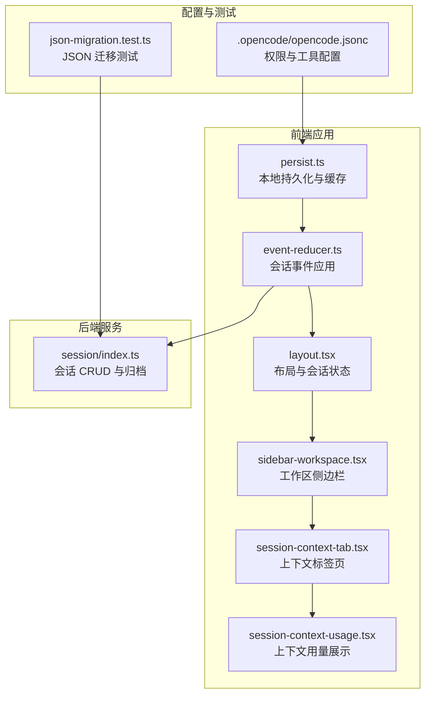
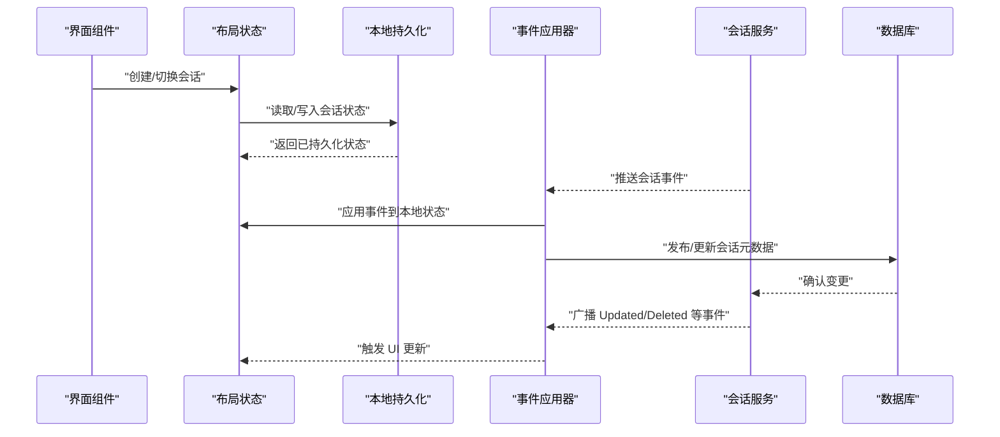
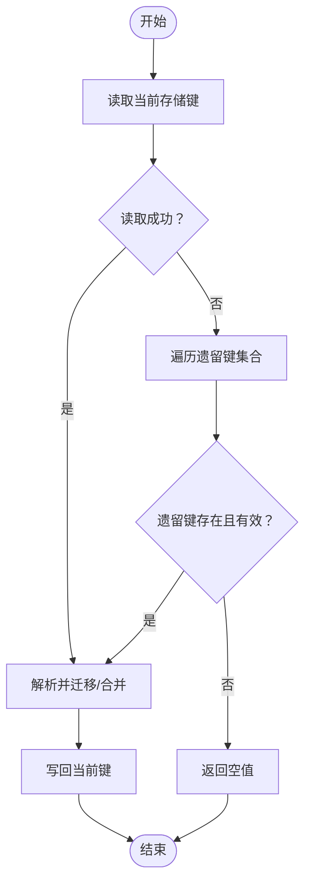
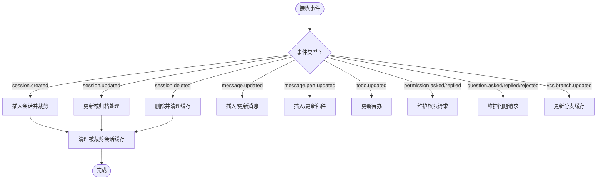
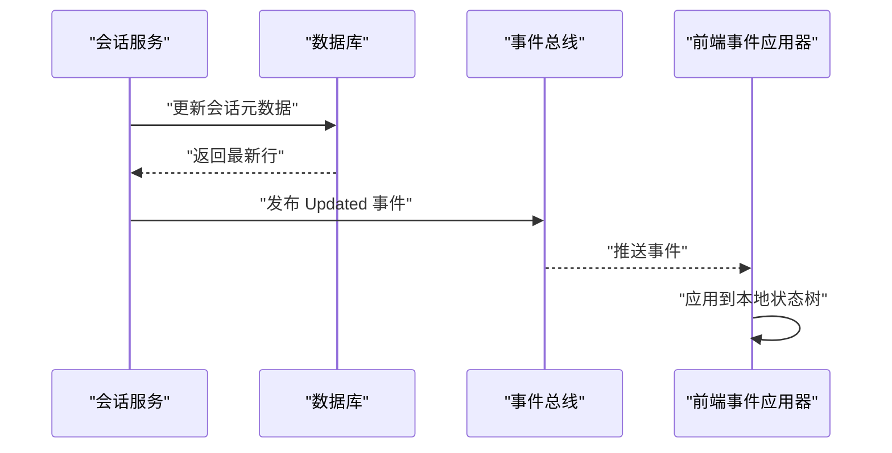
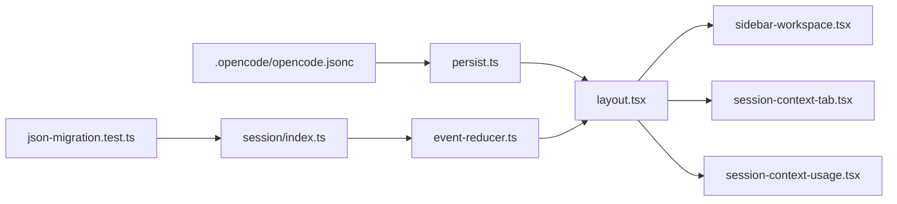

# 存储与会话管理

<cite>
**本文引用的文件**
- [README.md](file://README.md)
- [.opencode/opencode.jsonc](file://.opencode/opencode.jsonc)
- [.opencode/env.d.ts](file://.opencode/env.d.ts)
- [packages/app/src/utils/persist.ts](file://packages/app/src/utils/persist.ts)
- [packages/app/src/context/global-sync/event-reducer.ts](file://packages/app/src/context/global-sync/event-reducer.ts)
- [packages/app/src/context/global-sync/event-reducer.test.ts](file://packages/app/src/context/global-sync/event-reducer.test.ts)
- [packages/app/src/context/layout.tsx](file://packages/app/src/context/layout.tsx)
- [packages/app/src/pages/layout/sidebar-workspace.tsx](file://packages/app/src/pages/layout/sidebar-workspace.tsx)
- [packages/app/src/components/session/session-context-tab.tsx](file://packages/app/src/components/session/session-context-tab.tsx)
- [packages/app/src/components/session-context-usage.tsx](file://packages/app/src/components/session-context-usage.tsx)
- [packages/opencode/src/session/index.ts](file://packages/opencode/src/session/index.ts)
- [packages/opencode/test/storage/json-migration.test.ts](file://packages/opencode/test/storage/json-migration.test.ts)
- [packages/opencode/src/cli/.../dialog-workspace-list.tsx](file://packages/opencode/src/cli/.../dialog-workspace-list.tsx)
- [packages/app/e2e/projects/workspace-new-session.spec.ts](file://packages/app/e2e/projects/workspace-new-session.spec.ts)
</cite>

## 目录
1. [简介](#简介)
2. [项目结构](#项目结构)
3. [核心组件](#核心组件)
4. [架构总览](#架构总览)
5. [组件详解](#组件详解)
6. [依赖关系分析](#依赖关系分析)
7. [性能考量](#性能考量)
8. [故障排查指南](#故障排查指南)
9. [结论](#结论)
10. [附录](#附录)

## 简介
本文件系统性梳理 OpenCode 的存储系统与会话管理机制，覆盖数据存储架构、文件组织结构与数据格式；会话的创建、维护、持久化与清理流程；数据迁移、备份恢复与版本兼容策略；并发访问控制与数据安全；以及在多用户环境下的数据隔离与权限控制。文档同时提供配置定制、监控指标与故障诊断方法。

## 项目结构
OpenCode 采用多包（monorepo）结构，存储与会话管理主要分布在前端应用包与后端服务包中：
- 前端应用层：负责本地持久化、会话事件处理、UI 展示与交互。
- 后端服务层：负责会话元数据、消息、权限等的数据库操作与事件发布。
- 配置与工具：通过统一的配置文件与工具函数实现跨平台与版本兼容。

图表来源
- [packages/app/src/utils/persist.ts:1-465](file://packages/app/src/utils/persist.ts#L1-L465)
- [packages/app/src/context/global-sync/event-reducer.ts:1-357](file://packages/app/src/context/global-sync/event-reducer.ts#L1-L357)
- [packages/app/src/context/layout.tsx:234-279](file://packages/app/src/context/layout.tsx#L234-L279)
- [packages/app/src/pages/layout/sidebar-workspace.tsx:319-502](file://packages/app/src/pages/layout/sidebar-workspace.tsx#L319-L502)
- [packages/app/src/components/session/session-context-tab.tsx:145-192](file://packages/app/src/components/session/session-context-tab.tsx#L145-L192)
- [packages/app/src/components/session-context-usage.tsx:31-80](file://packages/app/src/components/session-context-usage.tsx#L31-L80)
- [packages/opencode/src/session/index.ts:249-483](file://packages/opencode/src/session/index.ts#L249-L483)
- [.opencode/opencode.jsonc:1-19](file://.opencode/opencode.jsonc#L1-L19)
- [packages/opencode/test/storage/json-migration.test.ts:569-849](file://packages/opencode/test/storage/json-migration.test.ts#L569-L849)

章节来源
- [README.md:1-142](file://README.md#L1-L142)
- [.opencode/opencode.jsonc:1-19](file://.opencode/opencode.jsonc#L1-L19)

## 核心组件
- 本地持久化与缓存（persist.ts）
  - 提供全局、工作区、会话级存储目标，支持桌面端与浏览器端不同存储后端。
  - 内置缓存与配额回收策略，保障大体量数据的读写性能与稳定性。
  - 支持版本迁移与遗留键回退，确保升级过程的数据兼容。
- 会话事件应用（event-reducer.ts）
  - 将来自服务器的会话事件（创建、更新、删除、归档、消息变更等）应用到本地状态树。
  - 自动清理过期会话的缓存，维持内存占用可控。
- 会话生命周期与元数据（session/index.ts）
  - 提供会话创建、触摸更新、归档、权限设置、撤销信息等操作，并通过事件总线广播变更。
- 布局与会话状态（layout.tsx）
  - 维护会话状态键集合、会话标签页与视图状态，定义会话状态清理策略。
- 工作区与会话 UI（sidebar-workspace.tsx、session-context-tab.tsx、session-context-usage.tsx）
  - 展示会话列表、上下文用量与成本估算，驱动会话交互体验。
- 配置与权限（.opencode/opencode.jsonc）
  - 定义默认权限规则、工具开关与迁移策略。
- 数据迁移与兼容（json-migration.test.ts）
  - 验证从旧版 JSON 结构迁移到数据库的正确性与健壮性。

章节来源
- [packages/app/src/utils/persist.ts:1-465](file://packages/app/src/utils/persist.ts#L1-L465)
- [packages/app/src/context/global-sync/event-reducer.ts:1-357](file://packages/app/src/context/global-sync/event-reducer.ts#L1-L357)
- [packages/opencode/src/session/index.ts:249-483](file://packages/opencode/src/session/index.ts#L249-L483)
- [packages/app/src/context/layout.tsx:234-279](file://packages/app/src/context/layout.tsx#L234-L279)
- [packages/app/src/pages/layout/sidebar-workspace.tsx:319-502](file://packages/app/src/pages/layout/sidebar-workspace.tsx#L319-L502)
- [packages/app/src/components/session/session-context-tab.tsx:145-192](file://packages/app/src/components/session/session-context-tab.tsx#L145-L192)
- [packages/app/src/components/session-context-usage.tsx:31-80](file://packages/app/src/components/session-context-usage.tsx#L31-L80)
- [.opencode/opencode.jsonc:1-19](file://.opencode/opencode.jsonc#L1-L19)
- [packages/opencode/test/storage/json-migration.test.ts:569-849](file://packages/opencode/test/storage/json-migration.test.ts#L569-L849)

## 架构总览
OpenCode 的存储与会话管理由“前端持久化层 + 事件应用层 + 后端服务层”构成，形成“事件驱动 + 持久化”的闭环。

图表来源
- [packages/app/src/context/layout.tsx:234-279](file://packages/app/src/context/layout.tsx#L234-L279)
- [packages/app/src/utils/persist.ts:337-465](file://packages/app/src/utils/persist.ts#L337-L465)
- [packages/app/src/context/global-sync/event-reducer.ts:86-357](file://packages/app/src/context/global-sync/event-reducer.ts#L86-L357)
- [packages/opencode/src/session/index.ts:249-483](file://packages/opencode/src/session/index.ts#L249-L483)

## 组件详解

### 本地持久化与缓存（persist.ts）
- 存储目标与命名
  - 全局存储：使用固定键名，适用于跨会话共享的偏好设置。
  - 工作区存储：按工作区路径生成唯一键，避免多工程间冲突。
  - 会话存储：在工作区键下进一步细分会话作用域，保证会话数据隔离。
- 缓存与配额回收
  - LRU 式内存缓存，限制最大条目数与字节总量，超出阈值自动裁剪。
  - 写入失败时尝试删除单键重试，仍失败则按大小排序逐出最占空间项，再尝试写入。
- 版本迁移与遗留键
  - 读取当前键失败时尝试读取遗留键集合，进行规范化与合并后迁移至新键。
  - 支持自定义迁移函数，确保字段演进与默认值合并。
- 平台适配
  - 浏览器端：直接使用 localStorage 或带前缀的命名空间存储。
  - 桌面端：可注入自定义存储实现，统一接口以适配不同平台。

图表来源
- [packages/app/src/utils/persist.ts:361-449](file://packages/app/src/utils/persist.ts#L361-L449)

章节来源
- [packages/app/src/utils/persist.ts:1-465](file://packages/app/src/utils/persist.ts#L1-L465)

### 会话事件应用（event-reducer.ts）
- 事件类型与处理
  - 创建/更新/删除/归档会话：维护会话列表与根会话总数，必要时裁剪过量会话。
  - 消息与消息部件：按消息 ID 与部件 ID 插入/更新/删除，支持增量拼接。
  - 待办、权限请求、问题请求：按会话维度维护列表，支持增删与去重。
  - VCS 分支更新：同步分支信息，必要时更新缓存。
- 清理策略
  - 归档或删除会话时，清理对应会话的消息、部件、差异、待办、权限、问题与状态缓存。
  - 对于被裁剪掉的会话，统一清理其缓存，防止内存泄漏。

图表来源
- [packages/app/src/context/global-sync/event-reducer.ts:86-357](file://packages/app/src/context/global-sync/event-reducer.ts#L86-L357)

章节来源
- [packages/app/src/context/global-sync/event-reducer.ts:1-357](file://packages/app/src/context/global-sync/event-reducer.ts#L1-L357)
- [packages/app/src/context/global-sync/event-reducer.test.ts:146-222](file://packages/app/src/context/global-sync/event-reducer.test.ts#L146-L222)

### 会话生命周期与元数据（session/index.ts）
- 关键能力
  - 触摸更新：延长会话活跃时间，保持会话热度。
  - 归档设置：标记会话归档时间，影响会话列表与清理策略。
  - 权限设置：为会话配置规则集，影响后续权限请求处理。
  - 撤销信息：记录会话的回滚摘要（新增/删除/文件数），便于审计与恢复。
- 事件发布
  - 所有更新均通过事件总线广播，确保前端订阅者及时刷新。

图表来源
- [packages/opencode/src/session/index.ts:249-483](file://packages/opencode/src/session/index.ts#L249-L483)
- [packages/app/src/context/global-sync/event-reducer.ts:86-357](file://packages/app/src/context/global-sync/event-reducer.ts#L86-L357)

章节来源
- [packages/opencode/src/session/index.ts:249-483](file://packages/opencode/src/session/index.ts#L249-L483)

### 布局与会话状态（layout.tsx）
- 会话状态键管理
  - 定义常用会话状态键（如 prompt、terminal、file-view）及其遗留键与版本号。
  - 提供清理过期键的策略，避免状态膨胀。
- 会话标签页与视图
  - 维护每个会话的标签页与视图状态，支持移动端与桌面端差异化布局。

章节来源
- [packages/app/src/context/layout.tsx:234-279](file://packages/app/src/context/layout.tsx#L234-L279)

### 工作区与会话 UI（sidebar-workspace.tsx、session-context-tab.tsx、session-context-usage.tsx）
- 工作区侧边栏
  - 展示工作区下的会话列表，支持懒加载与分页，提升大工程场景下的渲染性能。
- 上下文标签页与用量
  - 计算并展示会话上下文的用量与成本，辅助用户评估资源消耗。
  - 提供展开/收起上下文面板的能力，优化界面布局。

章节来源
- [packages/app/src/pages/layout/sidebar-workspace.tsx:319-502](file://packages/app/src/pages/layout/sidebar-workspace.tsx#L319-L502)
- [packages/app/src/components/session/session-context-tab.tsx:145-192](file://packages/app/src/components/session/session-context-tab.tsx#L145-L192)
- [packages/app/src/components/session-context-usage.tsx:31-80](file://packages/app/src/components/session-context-usage.tsx#L31-L80)

### 配置与权限（.opencode/opencode.jsonc）
- 默认权限
  - 通过规则集限制特定路径的操作（例如禁止对迁移脚本进行编辑）。
- 工具开关
  - 控制是否启用某些工具（如 GitHub triage、PR 搜索）。
- 迁移与 MCP
  - 预留迁移与 MCP 配置入口，便于扩展。

章节来源
- [.opencode/opencode.jsonc:1-19](file://.opencode/opencode.jsonc#L1-L19)

### 数据迁移与版本兼容（json-migration.test.ts）
- 迁移范围
  - 项目、会话、消息、部件、待办、权限、分享等实体的迁移。
- 兼容策略
  - 对孤儿/损坏文件进行容错处理，尽量恢复有效数据。
  - 统计迁移结果与错误，便于审计与修复。
- 测试验证
  - 通过端到端测试覆盖多种边界情况，确保迁移稳健性。

章节来源
- [packages/opencode/test/storage/json-migration.test.ts:569-849](file://packages/opencode/test/storage/json-migration.test.ts#L569-L849)

## 依赖关系分析
- 前端持久化依赖平台抽象（浏览器/桌面），通过统一接口适配。
- 事件应用器依赖 SDK 类型定义与二分搜索工具，确保高效更新。
- 会话服务依赖数据库与事件总线，保证数据一致性与实时性。
- UI 组件依赖布局状态与事件应用器，形成“状态 -> 事件 -> 视图”的单向数据流。

图表来源
- [packages/app/src/utils/persist.ts:1-465](file://packages/app/src/utils/persist.ts#L1-L465)
- [packages/app/src/context/layout.tsx:234-279](file://packages/app/src/context/layout.tsx#L234-L279)
- [packages/app/src/context/global-sync/event-reducer.ts:1-357](file://packages/app/src/context/global-sync/event-reducer.ts#L1-L357)
- [packages/app/src/pages/layout/sidebar-workspace.tsx:319-502](file://packages/app/src/pages/layout/sidebar-workspace.tsx#L319-L502)
- [packages/app/src/components/session/session-context-tab.tsx:145-192](file://packages/app/src/components/session/session-context-tab.tsx#L145-L192)
- [packages/app/src/components/session-context-usage.tsx:31-80](file://packages/app/src/components/session-context-usage.tsx#L31-L80)
- [packages/opencode/src/session/index.ts:249-483](file://packages/opencode/src/session/index.ts#L249-L483)
- [.opencode/opencode.jsonc:1-19](file://.opencode/opencode.jsonc#L1-L19)
- [packages/opencode/test/storage/json-migration.test.ts:569-849](file://packages/opencode/test/storage/json-migration.test.ts#L569-L849)

## 性能考量
- 本地缓存
  - 通过 LRU 缓存与字节总量限制，降低频繁读写带来的性能损耗。
- 写入容错
  - 失败时先删除再写入，若仍失败则按大小排序逐出最占空间项，再尝试写入，提高成功率。
- 事件裁剪
  - 对会话列表进行裁剪，避免无限增长导致内存压力。
- 懒加载与分页
  - 工作区侧边栏支持分页加载，减少初始渲染负担。
- 成本估算
  - 上下文用量与成本估算帮助用户感知资源消耗，避免过度使用。

章节来源
- [packages/app/src/utils/persist.ts:22-154](file://packages/app/src/utils/persist.ts#L22-L154)
- [packages/app/src/context/global-sync/event-reducer.ts:102-143](file://packages/app/src/context/global-sync/event-reducer.ts#L102-L143)
- [packages/app/src/pages/layout/sidebar-workspace.tsx:477-480](file://packages/app/src/pages/layout/sidebar-workspace.tsx#L477-L480)
- [packages/app/src/components/session-context-usage.tsx:53-57](file://packages/app/src/components/session-context-usage.tsx#L53-L57)

## 故障排查指南
- 本地存储异常
  - 症状：读取/写入失败、容量超限。
  - 排查：检查配额错误识别与回收逻辑，确认缓存裁剪是否生效。
  - 处理：清理遗留键、删除无效项、降低缓存阈值。
- 会话状态不一致
  - 症状：会话列表异常、消息缺失或重复。
  - 排查：核对事件应用器对创建/更新/删除/归档的处理逻辑，确认裁剪与缓存清理是否执行。
  - 处理：强制刷新、重载会话数据、检查事件广播链路。
- 迁移失败或数据丢失
  - 症状：旧版 JSON 无法迁移、部分实体缺失。
  - 排查：查看迁移统计与错误日志，定位损坏文件与孤儿项。
  - 处理：修复损坏文件、补齐缺失字段、重新运行迁移。
- 权限与工具配置问题
  - 症状：编辑受限、工具不可用。
  - 排查：检查配置文件中的权限规则与工具开关。
  - 处理：调整规则集与开关，确保与实际需求匹配。

章节来源
- [packages/app/src/utils/persist.ts:76-154](file://packages/app/src/utils/persist.ts#L76-L154)
- [packages/app/src/context/global-sync/event-reducer.ts:43-84](file://packages/app/src/context/global-sync/event-reducer.ts#L43-L84)
- [packages/opencode/test/storage/json-migration.test.ts:826-849](file://packages/opencode/test/storage/json-migration.test.ts#L826-L849)
- [.opencode/opencode.jsonc:8-18](file://.opencode/opencode.jsonc#L8-L18)

## 结论
OpenCode 的存储与会话管理通过“事件驱动 + 本地持久化 + 数据库协同”的方式，实现了高性能、可扩展且具备强容错能力的会话生命周期管理。其缓存与配额回收策略、事件裁剪与清理机制、以及完善的迁移与兼容方案，共同保障了在复杂工程与多用户场景下的稳定运行。

## 附录
- 会话创建流程（E2E 验证）
  - 通过工作区新建会话，断言 URL 中包含会话 ID，验证会话目录归属正确。
- CLI 工作区选择
  - 在 CLI 中打开工作区列表对话框，选择工作区后触发同步，验证会话可用性。

章节来源
- [packages/app/e2e/projects/workspace-new-session.spec.ts:37-109](file://packages/app/e2e/projects/workspace-new-session.spec.ts#L37-L109)
- [packages/opencode/src/cli/.../dialog-workspace-list.tsx:254-300](file://packages/opencode/src/cli/.../dialog-workspace-list.tsx#L254-L300)