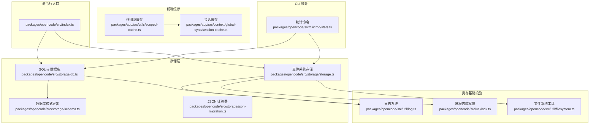
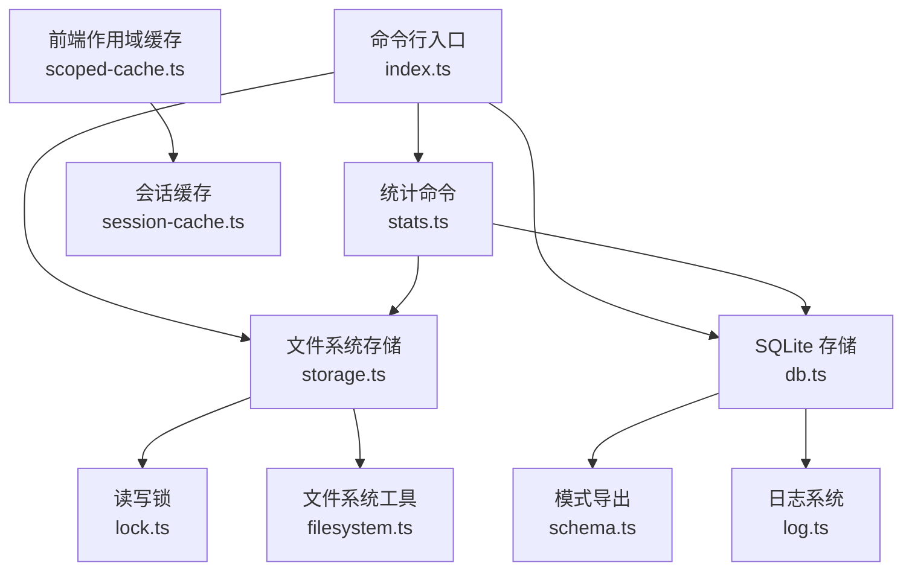
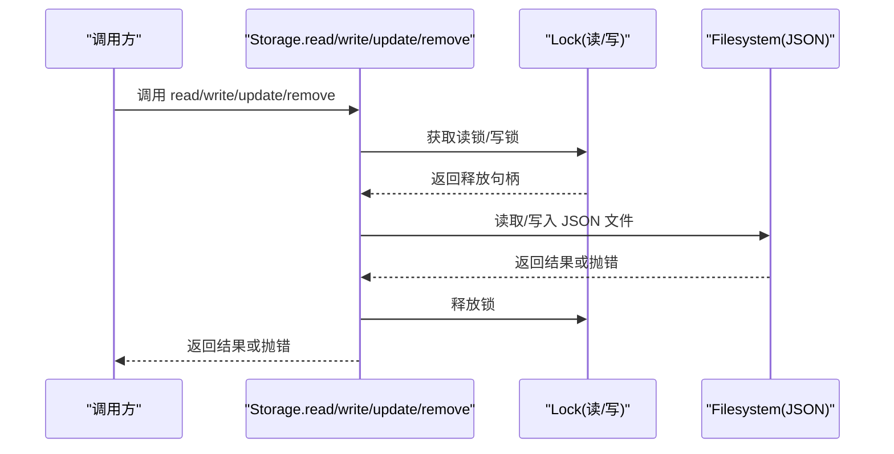
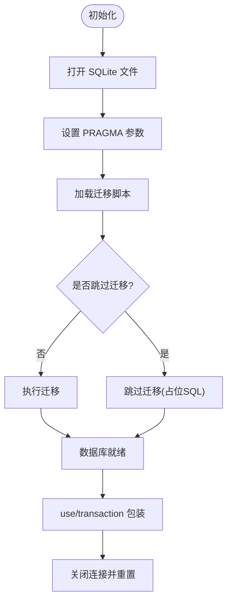
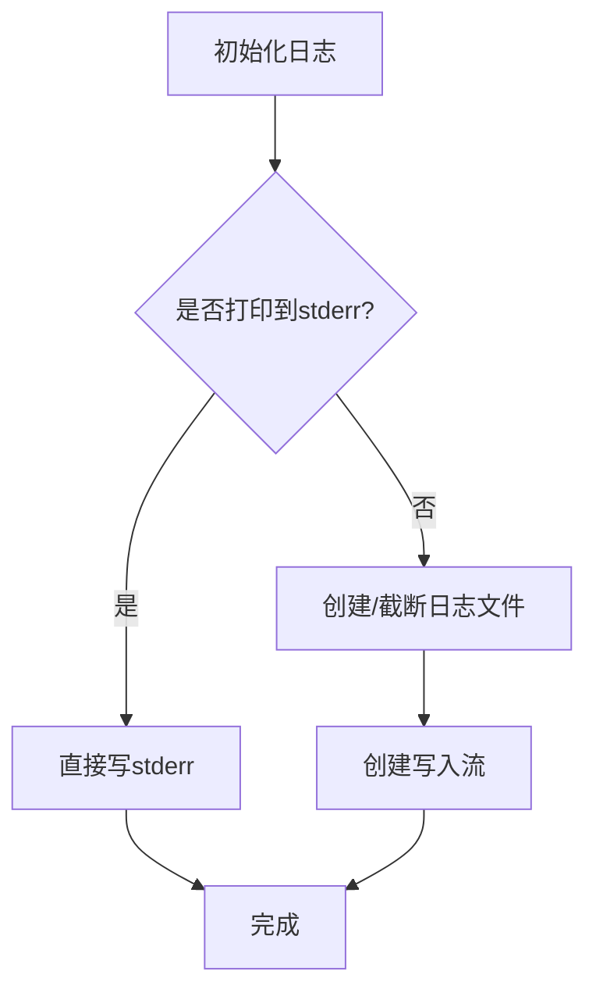
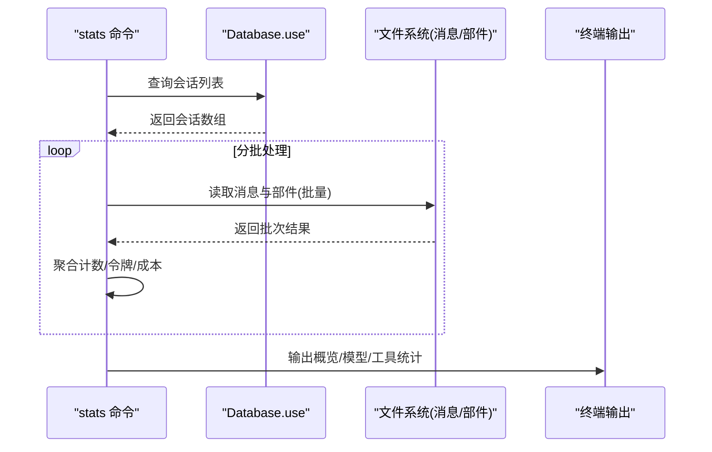
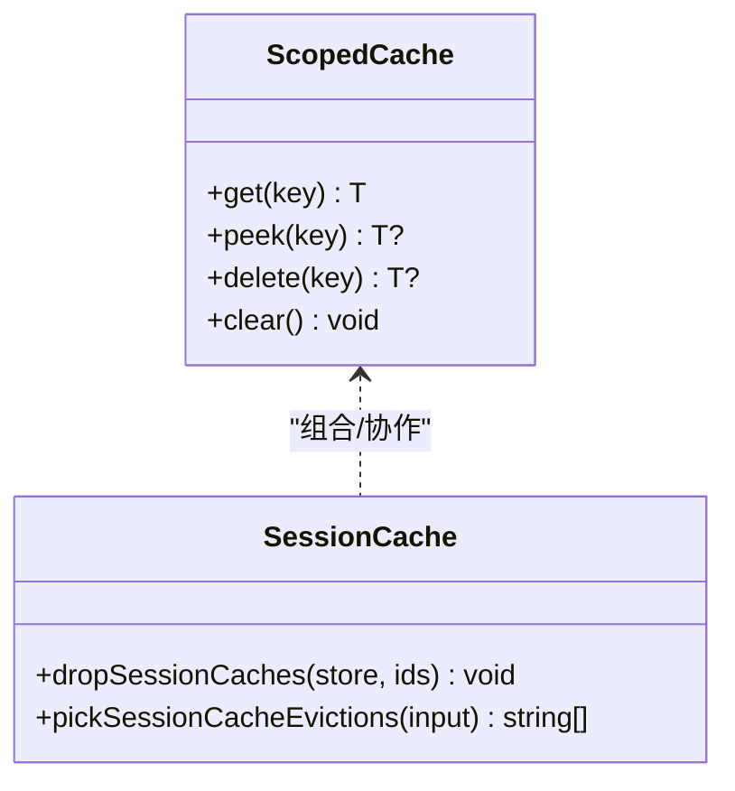
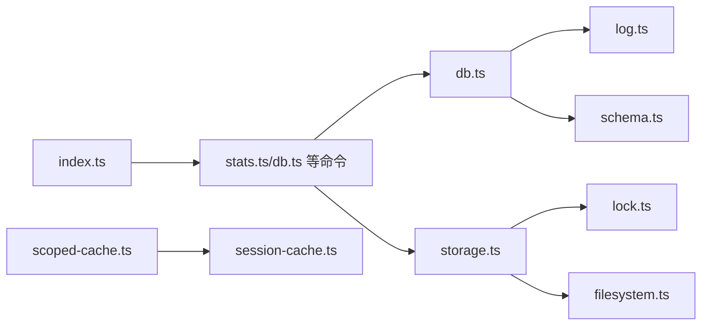
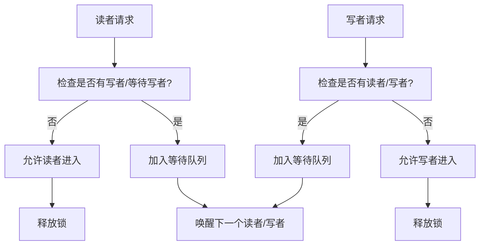

# 性能优化与监控

<cite>
**本文引用的文件**
- [packages/opencode/src/index.ts](file://packages/opencode/src/index.ts)
- [packages/opencode/src/storage/storage.ts](file://packages/opencode/src/storage/storage.ts)
- [packages/opencode/src/storage/db.ts](file://packages/opencode/src/storage/db.ts)
- [packages/opencode/src/storage/schema.ts](file://packages/opencode/src/storage/schema.ts)
- [packages/opencode/src/storage/json-migration.ts](file://packages/opencode/src/storage/json-migration.ts)
- [packages/opencode/src/util/log.ts](file://packages/opencode/src/util/log.ts)
- [packages/opencode/src/util/lock.ts](file://packages/opencode/src/util/lock.ts)
- [packages/opencode/src/util/filesystem.ts](file://packages/opencode/src/util/filesystem.ts)
- [packages/opencode/src/cli/cmd/stats.ts](file://packages/opencode/src/cli/cmd/stats.ts)
- [packages/app/src/utils/scoped-cache.ts](file://packages/app/src/utils/scoped-cache.ts)
- [packages/app/src/context/global-sync/session-cache.ts](file://packages/app/src/context/global-sync/session-cache.ts)
</cite>

## 目录
1. [简介](#简介)
2. [项目结构](#项目结构)
3. [核心组件](#核心组件)
4. [架构总览](#架构总览)
5. [详细组件分析](#详细组件分析)
6. [依赖关系分析](#依赖关系分析)
7. [性能考量](#性能考量)
8. [故障排查指南](#故障排查指南)
9. [结论](#结论)
10. [附录](#附录)

## 简介
本文件围绕 OpenCode 存储系统的性能优化策略与监控体系展开，重点覆盖以下方面：
- 存储性能瓶颈识别、查询优化与索引调优方法
- 并发访问控制、锁机制与资源竞争解决方案
- 缓存策略设计、内存管理与磁盘 I/O 优化技术
- 性能监控指标、日志分析与故障诊断工具
- 性能基准测试、压力测试与容量规划方法
- 分布式存储、负载均衡与高可用性配置建议

## 项目结构
OpenCode 的存储层由“文件系统存储”和“SQLite 数据库存储”两部分组成，并通过 CLI 命令提供统计与迁移能力；前端应用侧提供会话级缓存与作用域缓存策略以提升交互性能。

**图表来源**
- [packages/opencode/src/index.ts:1-214](file://packages/opencode/src/index.ts#L1-L214)
- [packages/opencode/src/storage/storage.ts:1-218](file://packages/opencode/src/storage/storage.ts#L1-L218)
- [packages/opencode/src/storage/db.ts:1-172](file://packages/opencode/src/storage/db.ts#L1-L172)
- [packages/opencode/src/storage/schema.ts:1-6](file://packages/opencode/src/storage/schema.ts#L1-L6)
- [packages/opencode/src/storage/json-migration.ts](file://packages/opencode/src/storage/json-migration.ts)
- [packages/opencode/src/util/log.ts:1-183](file://packages/opencode/src/util/log.ts#L1-L183)
- [packages/opencode/src/util/lock.ts:1-99](file://packages/opencode/src/util/lock.ts#L1-L99)
- [packages/opencode/src/util/filesystem.ts:1-204](file://packages/opencode/src/util/filesystem.ts#L1-L204)
- [packages/opencode/src/cli/cmd/stats.ts:1-411](file://packages/opencode/src/cli/cmd/stats.ts#L1-L411)
- [packages/app/src/utils/scoped-cache.ts:1-105](file://packages/app/src/utils/scoped-cache.ts#L1-L105)
- [packages/app/src/context/global-sync/session-cache.ts:1-63](file://packages/app/src/context/global-sync/session-cache.ts#L1-L63)

**章节来源**
- [packages/opencode/src/index.ts:1-214](file://packages/opencode/src/index.ts#L1-L214)
- [packages/opencode/src/storage/storage.ts:1-218](file://packages/opencode/src/storage/storage.ts#L1-L218)
- [packages/opencode/src/storage/db.ts:1-172](file://packages/opencode/src/storage/db.ts#L1-L172)
- [packages/opencode/src/util/log.ts:1-183](file://packages/opencode/src/util/log.ts#L1-L183)
- [packages/opencode/src/util/lock.ts:1-99](file://packages/opencode/src/util/lock.ts#L1-L99)
- [packages/opencode/src/util/filesystem.ts:1-204](file://packages/opencode/src/util/filesystem.ts#L1-L204)
- [packages/opencode/src/cli/cmd/stats.ts:1-411](file://packages/opencode/src/cli/cmd/stats.ts#L1-L411)
- [packages/app/src/utils/scoped-cache.ts:1-105](file://packages/app/src/utils/scoped-cache.ts#L1-L105)
- [packages/app/src/context/global-sync/session-cache.ts:1-63](file://packages/app/src/context/global-sync/session-cache.ts#L1-L63)

## 核心组件
- 文件系统存储：提供基于 JSON 文件的键空间读写、更新与删除，内置进程内读写锁保障并发安全，并对不存在资源进行统一错误包装。
- SQLite 数据库存储：使用 Bun 的 SQLite 实现，启用 WAL 模式、调整同步级别与缓存大小等参数，支持事务封装与上下文注入。
- 日志系统：统一的日志初始化、级别过滤、时间戳与耗时统计、滚动清理与流式落盘。
- 并发锁：轻量级读写锁，优先写以避免饥饿，支持读者/写者排队与自动清理空锁。
- 文件系统工具：提供路径解析、大小查询、流式写入、MIME 类型推断等，支撑存储与迁移流程。
- 统计命令：聚合会话、消息、令牌与成本数据，输出概览、模型与工具使用统计。
- 前端缓存：作用域缓存（LRU+TTL）与会话缓存（按会话维度的键空间清理与容量限制）。

**章节来源**
- [packages/opencode/src/storage/storage.ts:162-191](file://packages/opencode/src/storage/storage.ts#L162-L191)
- [packages/opencode/src/storage/db.ts:83-117](file://packages/opencode/src/storage/db.ts#L83-L117)
- [packages/opencode/src/util/log.ts:60-78](file://packages/opencode/src/util/log.ts#L60-L78)
- [packages/opencode/src/util/lock.ts:47-97](file://packages/opencode/src/util/lock.ts#L47-L97)
- [packages/opencode/src/util/filesystem.ts:54-96](file://packages/opencode/src/util/filesystem.ts#L54-L96)
- [packages/opencode/src/cli/cmd/stats.ts:95-307](file://packages/opencode/src/cli/cmd/stats.ts#L95-L307)
- [packages/app/src/utils/scoped-cache.ts:13-89](file://packages/app/src/utils/scoped-cache.ts#L13-L89)
- [packages/app/src/context/global-sync/session-cache.ts:23-41](file://packages/app/src/context/global-sync/session-cache.ts#L23-L41)

## 架构总览
OpenCode 的存储体系采用“文件 JSON + SQLite”的混合持久化方案：
- 文件系统存储用于会话、消息、部件等实体的 JSON 文件化存储，具备强一致与可移植特性。
- SQLite 存储用于结构化数据与复杂查询场景，通过事务与 WAL 提升并发与可靠性。
- CLI 提供统计与迁移命令，驱动数据聚合与版本演进。
- 前端在客户端侧引入作用域缓存与会话缓存，降低网络与计算开销。

**图表来源**
- [packages/opencode/src/index.ts:126-147](file://packages/opencode/src/index.ts#L126-L147)
- [packages/opencode/src/storage/storage.ts:162-191](file://packages/opencode/src/storage/storage.ts#L162-L191)
- [packages/opencode/src/storage/db.ts:30-48](file://packages/opencode/src/storage/db.ts#L30-L48)
- [packages/opencode/src/storage/schema.ts:1-6](file://packages/opencode/src/storage/schema.ts#L1-L6)
- [packages/opencode/src/util/lock.ts:1-10](file://packages/opencode/src/util/lock.ts#L1-L10)
- [packages/opencode/src/util/filesystem.ts:1-8](file://packages/opencode/src/util/filesystem.ts#L1-L8)
- [packages/opencode/src/util/log.ts:1-10](file://packages/opencode/src/util/log.ts#L1-L10)
- [packages/opencode/src/cli/cmd/stats.ts:49-84](file://packages/opencode/src/cli/cmd/stats.ts#L49-L84)
- [packages/app/src/utils/scoped-cache.ts:1-6](file://packages/app/src/utils/scoped-cache.ts#L1-L6)
- [packages/app/src/context/global-sync/session-cache.ts:1-21](file://packages/app/src/context/global-sync/session-cache.ts#L1-L21)

## 详细组件分析

### 文件系统存储与并发控制
- 读取：通过读锁保护 JSON 文件读取，避免并发写入导致的数据损坏。
- 写入/更新：通过写锁保护 JSON 文件写入，先读取再修改后回写，保证原子性。
- 错误处理：对 ENOENT 统一转换为“未找到”错误类型，便于上层处理。
- 列表扫描：基于通配符扫描目录树，返回排序后的键路径列表。

**图表来源**
- [packages/opencode/src/storage/storage.ts:162-191](file://packages/opencode/src/storage/storage.ts#L162-L191)
- [packages/opencode/src/util/lock.ts:47-97](file://packages/opencode/src/util/lock.ts#L47-L97)
- [packages/opencode/src/util/filesystem.ts:37-77](file://packages/opencode/src/util/filesystem.ts#L37-L77)

**章节来源**
- [packages/opencode/src/storage/storage.ts:162-202](file://packages/opencode/src/storage/storage.ts#L162-L202)
- [packages/opencode/src/util/lock.ts:1-99](file://packages/opencode/src/util/lock.ts#L1-L99)
- [packages/opencode/src/util/filesystem.ts:1-204](file://packages/opencode/src/util/filesystem.ts#L1-L204)

### SQLite 存储与事务封装
- 初始化：打开数据库、设置 PRAGMA（WAL、同步、超时、缓存、外键、checkpoint），加载迁移脚本并执行。
- 事务：提供 use/transaction 封装，自动在上下文中注入当前事务或创建新事务，支持副作用回调。
- 关闭：显式关闭底层连接并重置懒加载状态。

**图表来源**
- [packages/opencode/src/storage/db.ts:83-117](file://packages/opencode/src/storage/db.ts#L83-L117)
- [packages/opencode/src/storage/db.ts:134-170](file://packages/opencode/src/storage/db.ts#L134-L170)

**章节来源**
- [packages/opencode/src/storage/db.ts:1-172](file://packages/opencode/src/storage/db.ts#L1-L172)

### 日志系统与监控
- 初始化：根据运行环境选择日志文件名与输出方式，支持打印到标准错误或写入文件。
- 清理：保留最近若干个日志文件，定期清理旧文件。
- 计时：提供 time 接口记录开始/结束与耗时，便于性能观测。
- 级别：DEBUG/INFO/WARN/ERROR 四档，按优先级过滤。

**图表来源**
- [packages/opencode/src/util/log.ts:60-78](file://packages/opencode/src/util/log.ts#L60-L78)
- [packages/opencode/src/util/log.ts:80-90](file://packages/opencode/src/util/log.ts#L80-L90)
- [packages/opencode/src/util/log.ts:157-173](file://packages/opencode/src/util/log.ts#L157-L173)

**章节来源**
- [packages/opencode/src/util/log.ts:1-183](file://packages/opencode/src/util/log.ts#L1-L183)

### 统计命令与性能指标
- 数据源：从 SQLite 会话表读取会话信息，逐批拉取消息与部件，聚合令牌、成本与工具/模型使用情况。
- 批处理：分批并发处理会话，避免一次性加载过多数据。
- 指标：总会话数、消息数、日期范围、成本/日、平均/中位令牌数、模型与工具使用排行。

**图表来源**
- [packages/opencode/src/cli/cmd/stats.ts:90-93](file://packages/opencode/src/cli/cmd/stats.ts#L90-L93)
- [packages/opencode/src/cli/cmd/stats.ts:165-280](file://packages/opencode/src/cli/cmd/stats.ts#L165-L280)
- [packages/opencode/src/cli/cmd/stats.ts:309-401](file://packages/opencode/src/cli/cmd/stats.ts#L309-L401)

**章节来源**
- [packages/opencode/src/cli/cmd/stats.ts:1-411](file://packages/opencode/src/cli/cmd/stats.ts#L1-L411)

### 前端缓存策略
- 作用域缓存：支持最大条目数与 TTL，过期清理与逐出回调，提供 get/peek/delete/clear。
- 会话缓存：按会话 ID 维度维护多个键空间（状态、差异、待办、消息、部件、权限、问题），支持容量限制与失效策略。

**图表来源**
- [packages/app/src/utils/scoped-cache.ts:13-89](file://packages/app/src/utils/scoped-cache.ts#L13-L89)
- [packages/app/src/context/global-sync/session-cache.ts:23-62](file://packages/app/src/context/global-sync/session-cache.ts#L23-L62)

**章节来源**
- [packages/app/src/utils/scoped-cache.ts:1-105](file://packages/app/src/utils/scoped-cache.ts#L1-L105)
- [packages/app/src/context/global-sync/session-cache.ts:1-63](file://packages/app/src/context/global-sync/session-cache.ts#L1-L63)

## 依赖关系分析
- 入口与命令：index.ts 注册大量子命令，其中 stats 与 db 命令直接依赖存储模块。
- 存储依赖：文件系统存储依赖锁与文件系统工具；SQLite 存储依赖日志与 schema 导出。
- 前端缓存：与应用上下文耦合，服务于会话渲染与交互。

**图表来源**
- [packages/opencode/src/index.ts:126-147](file://packages/opencode/src/index.ts#L126-L147)
- [packages/opencode/src/cli/cmd/stats.ts:49-84](file://packages/opencode/src/cli/cmd/stats.ts#L49-L84)
- [packages/opencode/src/storage/storage.ts:162-191](file://packages/opencode/src/storage/storage.ts#L162-L191)
- [packages/opencode/src/storage/db.ts:30-48](file://packages/opencode/src/storage/db.ts#L30-L48)
- [packages/opencode/src/util/log.ts:1-10](file://packages/opencode/src/util/log.ts#L1-L10)
- [packages/opencode/src/util/filesystem.ts:1-8](file://packages/opencode/src/util/filesystem.ts#L1-L8)
- [packages/opencode/src/util/lock.ts:1-10](file://packages/opencode/src/util/lock.ts#L1-L10)
- [packages/opencode/src/storage/schema.ts:1-6](file://packages/opencode/src/storage/schema.ts#L1-L6)
- [packages/app/src/utils/scoped-cache.ts:1-6](file://packages/app/src/utils/scoped-cache.ts#L1-L6)
- [packages/app/src/context/global-sync/session-cache.ts:1-21](file://packages/app/src/context/global-sync/session-cache.ts#L1-L21)

**章节来源**
- [packages/opencode/src/index.ts:126-147](file://packages/opencode/src/index.ts#L126-L147)
- [packages/opencode/src/cli/cmd/stats.ts:49-84](file://packages/opencode/src/cli/cmd/stats.ts#L49-L84)
- [packages/opencode/src/storage/storage.ts:162-191](file://packages/opencode/src/storage/storage.ts#L162-L191)
- [packages/opencode/src/storage/db.ts:30-48](file://packages/opencode/src/storage/db.ts#L30-L48)
- [packages/opencode/src/util/log.ts:1-183](file://packages/opencode/src/util/log.ts#L1-L183)
- [packages/opencode/src/util/filesystem.ts:1-204](file://packages/opencode/src/util/filesystem.ts#L1-L204)
- [packages/opencode/src/util/lock.ts:1-99](file://packages/opencode/src/util/lock.ts#L1-L99)
- [packages/opencode/src/storage/schema.ts:1-6](file://packages/opencode/src/storage/schema.ts#L1-L6)
- [packages/app/src/utils/scoped-cache.ts:1-105](file://packages/app/src/utils/scoped-cache.ts#L1-L105)
- [packages/app/src/context/global-sync/session-cache.ts:1-63](file://packages/app/src/context/global-sync/session-cache.ts#L1-L63)

## 性能考量

### 存储性能瓶颈识别
- 文件系统存储
  - 瓶颈点：频繁小文件读写、锁竞争、磁盘寻道与同步开销。
  - 识别手段：统计命令中的大集合处理与批处理策略，结合日志计时定位慢点。
- SQLite 存储
  - 瓶颈点：写放大、WAL checkpoint、busy_timeout、缓存命中率。
  - 识别手段：PRAGMA 参数与事务使用情况，观察锁等待与忙等待事件。

**章节来源**
- [packages/opencode/src/cli/cmd/stats.ts:151-153](file://packages/opencode/src/cli/cmd/stats.ts#L151-L153)
- [packages/opencode/src/storage/db.ts:89-94](file://packages/opencode/src/storage/db.ts#L89-L94)

### 查询优化与索引调优
- SQLite 查询优化
  - 使用事务包裹批量写入，减少 WAL checkpoint 频率。
  - 合理使用 LIMIT/OFFSET 或游标分页，避免全表扫描。
  - 在高频过滤字段上建立索引（如会话表的项目 ID、时间戳等）。
- 文件系统查询优化
  - 使用 Glob 扫描时限定目录层级，避免深层递归。
  - 对于大文件读取，优先使用流式接口减少内存占用。

**章节来源**
- [packages/opencode/src/storage/db.ts:156-170](file://packages/opencode/src/storage/db.ts#L156-L170)
- [packages/opencode/src/util/filesystem.ts:79-96](file://packages/opencode/src/util/filesystem.ts#L79-L96)

### 并发访问控制与锁机制
- 进程内读写锁
  - 读多写少场景下允许多读者并发，写者独占，优先写以避免饥饿。
  - 自动清理无等待者且无活动读者/写者的锁实例。
- 文件系统并发
  - 所有 JSON 读写均通过锁保护，避免竞态条件。
- SQLite 并发
  - WAL 模式提升并发读写；合理设置 busy_timeout 与 cache_size。

**图表来源**
- [packages/opencode/src/util/lock.ts:24-45](file://packages/opencode/src/util/lock.ts#L24-L45)
- [packages/opencode/src/util/lock.ts:47-97](file://packages/opencode/src/util/lock.ts#L47-L97)

**章节来源**
- [packages/opencode/src/util/lock.ts:1-99](file://packages/opencode/src/util/lock.ts#L1-L99)
- [packages/opencode/src/storage/storage.ts:166-180](file://packages/opencode/src/storage/storage.ts#L166-L180)

### 缓存策略设计与内存管理
- 作用域缓存
  - LRU 逐出与 TTL 过期双重保障，避免无限增长。
  - 支持自定义过期回调，便于释放外部资源。
- 会话缓存
  - 按会话维度清理，避免跨会话污染。
  - 通过容量上限与保留集合控制内存占用。

**章节来源**
- [packages/app/src/utils/scoped-cache.ts:13-89](file://packages/app/src/utils/scoped-cache.ts#L13-L89)
- [packages/app/src/context/global-sync/session-cache.ts:23-62](file://packages/app/src/context/global-sync/session-cache.ts#L23-L62)

### 磁盘 I/O 优化
- 文件系统工具
  - 流式写入与管道传输，降低内存峰值。
  - 自动创建目录与权限设置，减少异常分支。
- JSON 迁移器
  - 批量插入与 PRAGMA 调优（如 synchronous OFF、temp_store MEMORY）加速导入。

**章节来源**
- [packages/opencode/src/util/filesystem.ts:79-96](file://packages/opencode/src/util/filesystem.ts#L79-L96)
- [packages/opencode/src/storage/json-migration.ts](file://packages/opencode/src/storage/json-migration.ts)

### 性能监控指标与日志分析
- 指标
  - 会话/消息总数、成本/日、平均/中位令牌数、模型与工具使用排行。
- 日志
  - 使用 time 接口记录关键操作耗时，结合服务标签定位热点。
  - 按级别过滤输出，生产环境默认 INFO，本地 DEBUG。

**章节来源**
- [packages/opencode/src/cli/cmd/stats.ts:126-149](file://packages/opencode/src/cli/cmd/stats.ts#L126-L149)
- [packages/opencode/src/util/log.ts:157-173](file://packages/opencode/src/util/log.ts#L157-L173)

### 故障诊断工具
- 统计命令：聚合分析，快速定位异常模型/工具与异常时段。
- 日志：统一格式与滚动清理，便于问题复盘。
- 异常处理：未捕获异常与拒绝事件统一记录，辅助根因分析。

**章节来源**
- [packages/opencode/src/index.ts:38-48](file://packages/opencode/src/index.ts#L38-L48)
- [packages/opencode/src/util/log.ts:92-97](file://packages/opencode/src/util/log.ts#L92-L97)

### 基准测试、压力测试与容量规划
- 基准测试
  - 使用统计命令对不同窗口期与项目过滤进行对比，评估成本与令牌增长趋势。
- 压力测试
  - 模拟高并发读写：增加读者/写者并发数，观察锁等待与吞吐变化。
- 容量规划
  - 结合会话数量、消息规模与文件大小估算磁盘与内存需求；根据缓存命中率调整 TTL 与容量。

**章节来源**
- [packages/opencode/src/cli/cmd/stats.ts:54-69](file://packages/opencode/src/cli/cmd/stats.ts#L54-L69)
- [packages/app/src/utils/scoped-cache.ts:21-33](file://packages/app/src/utils/scoped-cache.ts#L21-L33)

### 分布式存储、负载均衡与高可用
- 当前实现为单机存储（文件系统 + SQLite），未见分布式/集群配置。
- 建议
  - 文件系统：使用共享存储（NFS/SMB）或对象存储网关，配合锁服务实现跨节点一致性。
  - SQLite：采用只读副本与 WAL 归档，结合数据库代理实现读写分离。
  - 监控：在 CLI 中扩展指标上报，结合日志系统实现链路追踪。

**章节来源**
- [packages/opencode/src/storage/storage.ts:162-191](file://packages/opencode/src/storage/storage.ts#L162-L191)
- [packages/opencode/src/storage/db.ts:89-94](file://packages/opencode/src/storage/db.ts#L89-L94)

## 故障排查指南
- 未找到资源
  - 文件系统存储对 ENOENT 统一转为“未找到”错误，便于上层判断。
- 未捕获异常
  - 全局监听 unhandledRejection 与 uncaughtException，记录错误与堆栈。
- 日志定位
  - 使用 time 接口标记关键阶段，结合服务标签与文件滚动清理定位问题。

**章节来源**
- [packages/opencode/src/storage/storage.ts:193-202](file://packages/opencode/src/storage/storage.ts#L193-L202)
- [packages/opencode/src/index.ts:38-48](file://packages/opencode/src/index.ts#L38-L48)
- [packages/opencode/src/util/log.ts:157-173](file://packages/opencode/src/util/log.ts#L157-L173)

## 结论
OpenCode 的存储体系在单机环境下通过文件系统与 SQLite 的协同实现了高可靠与可观测性。并发层面采用进程内读写锁与 WAL 模式，前端引入作用域与会话缓存以优化用户体验。建议在扩展至多节点部署时，结合共享存储与数据库代理实现读写分离与高可用，并持续通过统计命令与日志系统完善性能监控与容量规划。

## 附录
- 命令注册与入口
  - 入口文件注册所有子命令，包括运行、生成、调试、统计、数据库等。
- 迁移与版本演进
  - 文件系统迁移器负责从旧版 JSON 结构迁移到新结构，支持进度回调与批处理。

**章节来源**
- [packages/opencode/src/index.ts:126-151](file://packages/opencode/src/index.ts#L126-L151)
- [packages/opencode/src/storage/json-migration.ts](file://packages/opencode/src/storage/json-migration.ts)