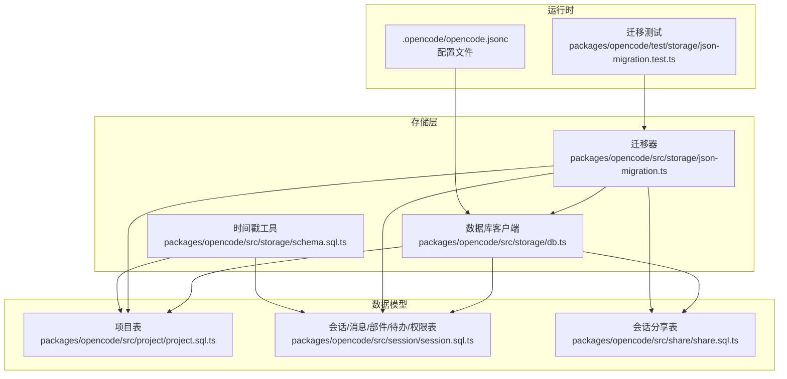
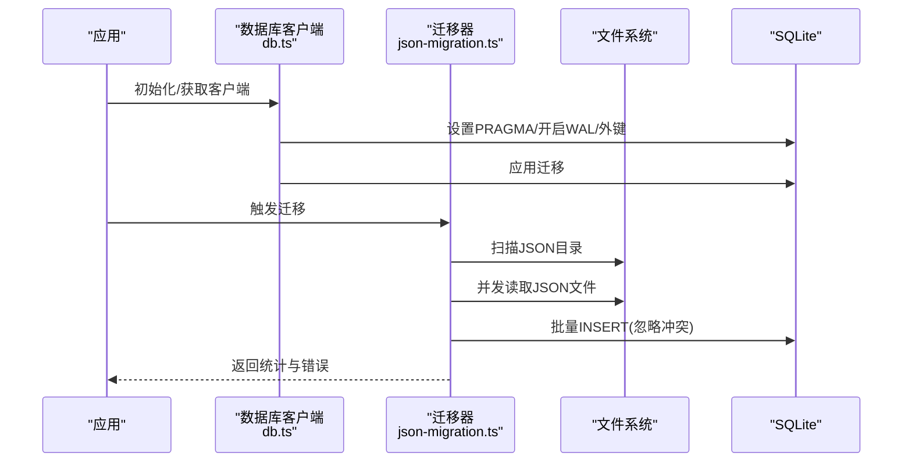
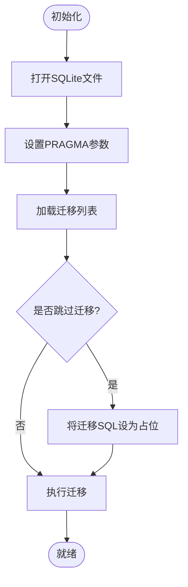
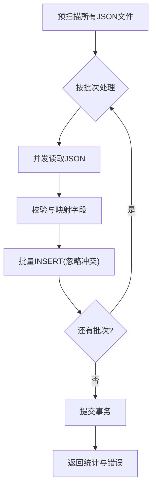
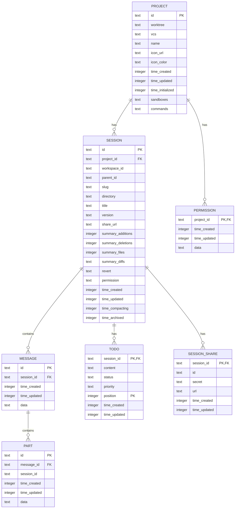
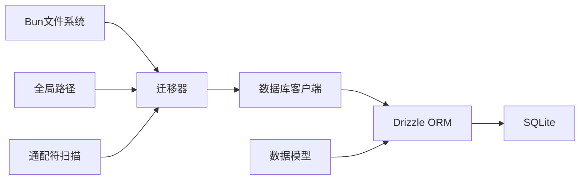

# 数据存储架构

<cite>
**本文引用的文件**
- [packages/opencode/src/storage/db.ts](file://packages/opencode/src/storage/db.ts)
- [packages/opencode/src/storage/json-migration.ts](file://packages/opencode/src/storage/json-migration.ts)
- [packages/opencode/src/storage/schema.sql.ts](file://packages/opencode/src/storage/schema.sql.ts)
- [packages/opencode/src/project/project.sql.ts](file://packages/opencode/src/project/project.sql.ts)
- [packages/opencode/src/session/session.sql.ts](file://packages/opencode/src/session/session.sql.ts)
- [packages/opencode/src/share/share.sql.ts](file://packages/opencode/src/share/share.sql.ts)
- [packages/opencode/test/storage/json-migration.test.ts](file://packages/opencode/test/storage/json-migration.test.ts)
- [.opencode/opencode.jsonc](file://.opencode/opencode.jsonc)
</cite>

## 目录
1. [简介](#简介)
2. [项目结构](#项目结构)
3. [核心组件](#核心组件)
4. [架构总览](#架构总览)
5. [详细组件分析](#详细组件分析)
6. [依赖关系分析](#依赖关系分析)
7. [性能考量](#性能考量)
8. [故障排查指南](#故障排查指南)
9. [结论](#结论)
10. [附录](#附录)

## 简介
本文件系统性阐述 OpenCode 的数据存储架构设计，涵盖整体架构、数据模型与文件组织、SQLite 使用方式与迁移策略、JSON 文件存储机制与序列化流程、存储路径与权限管理、磁盘空间优化、性能基准与查询优化、以及数据完整性、事务与并发控制机制。文档面向不同技术背景读者，既提供高层概览也包含深入的技术细节与可视化图示。

## 项目结构
OpenCode 的存储子系统主要由以下部分组成：
- SQLite 客户端与迁移：负责数据库连接、迁移应用与事务封装
- 数据模型定义：基于 Drizzle ORM 的 SQLite 表结构与索引
- JSON 迁移器：从旧版 JSON 文件目录迁移到 SQLite
- 共享与时间戳工具：会话分享表与统一时间戳字段
- 配置与测试：全局配置与迁移行为验证

图表来源
- [packages/opencode/src/storage/db.ts:1-172](file://packages/opencode/src/storage/db.ts#L1-L172)
- [packages/opencode/src/storage/json-migration.ts:1-426](file://packages/opencode/src/storage/json-migration.ts#L1-L426)
- [packages/opencode/src/storage/schema.sql.ts:1-11](file://packages/opencode/src/storage/schema.sql.ts#L1-L11)
- [packages/opencode/src/project/project.sql.ts:1-17](file://packages/opencode/src/project/project.sql.ts#L1-L17)
- [packages/opencode/src/session/session.sql.ts:1-104](file://packages/opencode/src/session/session.sql.ts#L1-L104)
- [packages/opencode/src/share/share.sql.ts:1-13](file://packages/opencode/src/share/share.sql.ts#L1-L13)
- [.opencode/opencode.jsonc:1-19](file://.opencode/opencode.jsonc#L1-L19)
- [packages/opencode/test/storage/json-migration.test.ts:64-676](file://packages/opencode/test/storage/json-migration.test.ts#L64-L676)

章节来源
- [packages/opencode/src/storage/db.ts:1-172](file://packages/opencode/src/storage/db.ts#L1-L172)
- [packages/opencode/src/storage/json-migration.ts:1-426](file://packages/opencode/src/storage/json-migration.ts#L1-L426)
- [packages/opencode/src/storage/schema.sql.ts:1-11](file://packages/opencode/src/storage/schema.sql.ts#L1-L11)
- [packages/opencode/src/project/project.sql.ts:1-17](file://packages/opencode/src/project/project.sql.ts#L1-L17)
- [packages/opencode/src/session/session.sql.ts:1-104](file://packages/opencode/src/session/session.sql.ts#L1-L104)
- [packages/opencode/src/share/share.sql.ts:1-13](file://packages/opencode/src/share/share.sql.ts#L1-L13)
- [.opencode/opencode.jsonc:1-19](file://.opencode/opencode.jsonc#L1-L19)
- [packages/opencode/test/storage/json-migration.test.ts:64-676](file://packages/opencode/test/storage/json-migration.test.ts#L64-L676)

## 核心组件
- 数据库客户端与迁移
  - 负责打开 SQLite 文件、设置 PRAGMA、应用迁移、提供事务上下文
  - 支持按渠道命名数据库文件，避免多环境冲突
- JSON 迁移器
  - 扫描旧版 JSON 存储目录，批量读取并写入 SQLite
  - 采用 WAL 模式、批量插入、冲突忽略等策略提升性能
- 数据模型
  - 项目、会话、消息、部件、待办、权限、会话分享等表
  - 统一时间戳字段与 JSON 字段类型，支持复杂对象持久化
- 时间戳工具
  - 提供创建/更新时间字段默认值与更新回调

章节来源
- [packages/opencode/src/storage/db.ts:30-172](file://packages/opencode/src/storage/db.ts#L30-L172)
- [packages/opencode/src/storage/json-migration.ts:26-426](file://packages/opencode/src/storage/json-migration.ts#L26-L426)
- [packages/opencode/src/storage/schema.sql.ts:3-11](file://packages/opencode/src/storage/schema.sql.ts#L3-L11)
- [packages/opencode/src/project/project.sql.ts:5-16](file://packages/opencode/src/project/project.sql.ts#L5-L16)
- [packages/opencode/src/session/session.sql.ts:14-104](file://packages/opencode/src/session/session.sql.ts#L14-L104)
- [packages/opencode/src/share/share.sql.ts:5-13](file://packages/opencode/src/share/share.sql.ts#L5-L13)

## 架构总览
OpenCode 的存储架构采用“SQLite + JSON 迁移”的混合方案：
- 运行时使用 SQLite 作为主存储，Drizzle ORM 提供类型安全访问
- 历史数据通过 JSON 迁移器从本地 JSON 目录导入到 SQLite
- 通过 PRAGMA 优化与批量写入策略保证性能
- 通过外键约束与索引保障数据一致性与查询效率

图表来源
- [packages/opencode/src/storage/db.ts:83-117](file://packages/opencode/src/storage/db.ts#L83-L117)
- [packages/opencode/src/storage/json-migration.ts:108-147](file://packages/opencode/src/storage/json-migration.ts#L108-L147)
- [packages/opencode/src/storage/json-migration.ts:149-403](file://packages/opencode/src/storage/json-migration.ts#L149-L403)

## 详细组件分析

### 数据库客户端与迁移（db.ts）
- 数据库路径
  - 根据安装渠道动态生成文件名，避免多环境冲突
  - 默认路径位于全局数据目录下
- PRAGMA 优化
  - WAL 日志模式、NORMAL 同步级别、忙碌超时、缓存大小、外键启用
  - 预先触发一次被动检查点以清理历史日志
- 迁移机制
  - 自动扫描迁移目录或使用打包内嵌迁移
  - 可选跳过迁移（用于测试或特殊场景）
- 事务封装
  - 提供 use/transaction 上下文，自动注入/创建事务
  - 支持延迟副作用执行

图表来源
- [packages/opencode/src/storage/db.ts:83-117](file://packages/opencode/src/storage/db.ts#L83-L117)
- [packages/opencode/src/storage/db.ts:156-171](file://packages/opencode/src/storage/db.ts#L156-L171)

章节来源
- [packages/opencode/src/storage/db.ts:31-37](file://packages/opencode/src/storage/db.ts#L31-L37)
- [packages/opencode/src/storage/db.ts:89-94](file://packages/opencode/src/storage/db.ts#L89-L94)
- [packages/opencode/src/storage/db.ts:103-114](file://packages/opencode/src/storage/db.ts#L103-L114)
- [packages/opencode/src/storage/db.ts:134-171](file://packages/opencode/src/storage/db.ts#L134-L171)

### JSON 迁移器（json-migration.ts）
- 存储目录与扫描
  - 从全局数据目录下的 storage 子目录扫描各实体 JSON 文件
  - 并发扫描多个目录，减少 I/O 等待
- 并发读取与批处理
  - Promise.allSettled 并发读取，失败项记录错误但不中断
  - 批大小固定，批量插入并忽略冲突
- ID 来源策略
  - 强制使用文件名作为实体 ID，忽略 JSON 内容中的 id 字段
  - 避免历史迁移导致的目录变更后 ID 不一致问题
- 外键与孤儿处理
  - 严格校验外键存在性（如会话必须对应已存在的项目）
  - 记录孤儿数量并跳过无效条目
- 性能优化
  - 开启 WAL、关闭同步、增大缓存、内存临时存储
  - 单事务批量提交，减少事务开销
  - 预扫描文件列表，避免重复 glob 操作

图表来源
- [packages/opencode/src/storage/json-migration.ts:108-147](file://packages/opencode/src/storage/json-migration.ts#L108-L147)
- [packages/opencode/src/storage/json-migration.ts:149-403](file://packages/opencode/src/storage/json-migration.ts#L149-L403)

章节来源
- [packages/opencode/src/storage/json-migration.ts:26-41](file://packages/opencode/src/storage/json-migration.ts#L26-L41)
- [packages/opencode/src/storage/json-migration.ts:48-52](file://packages/opencode/src/storage/json-migration.ts#L48-L52)
- [packages/opencode/src/storage/json-migration.ts:78-95](file://packages/opencode/src/storage/json-migration.ts#L78-L95)
- [packages/opencode/src/storage/json-migration.ts:152-180](file://packages/opencode/src/storage/json-migration.ts#L152-L180)
- [packages/opencode/src/storage/json-migration.ts:183-230](file://packages/opencode/src/storage/json-migration.ts#L183-L230)
- [packages/opencode/src/storage/json-migration.ts:403-424](file://packages/opencode/src/storage/json-migration.ts#L403-L424)

### 数据模型设计（表结构与索引）
- 通用时间戳
  - 统一提供创建/更新时间字段，默认值与更新回调
- 项目表（project）
  - 主键：项目 ID
  - JSON 字段：沙箱列表、命令配置
  - 时间字段：创建/更新/初始化
- 会话表（session）
  - 外键：关联项目
  - JSON 字段：差异摘要、回滚信息、权限规则
  - 索引：项目、工作区、父会话
- 消息表（message）
  - 外键：关联会话
  - JSON 字段：消息体数据
  - 索引：会话+时间+ID
- 部件表（part）
  - 外键：关联消息
  - JSON 字段：部件数据
  - 索引：消息+ID、会话
- 待办表（todo）
  - 复合主键：会话+位置
  - 索引：会话
- 权限表（permission）
  - 主键：项目 ID
  - JSON 字段：权限规则集
- 会话分享表（session_share）
  - 主键：会话 ID
  - 外键：级联删除

图表来源
- [packages/opencode/src/storage/schema.sql.ts:3-11](file://packages/opencode/src/storage/schema.sql.ts#L3-L11)
- [packages/opencode/src/project/project.sql.ts:5-16](file://packages/opencode/src/project/project.sql.ts#L5-L16)
- [packages/opencode/src/session/session.sql.ts:14-104](file://packages/opencode/src/session/session.sql.ts#L14-L104)
- [packages/opencode/src/share/share.sql.ts:5-13](file://packages/opencode/src/share/share.sql.ts#L5-L13)

章节来源
- [packages/opencode/src/storage/schema.sql.ts:3-11](file://packages/opencode/src/storage/schema.sql.ts#L3-L11)
- [packages/opencode/src/project/project.sql.ts:5-16](file://packages/opencode/src/project/project.sql.ts#L5-L16)
- [packages/opencode/src/session/session.sql.ts:14-104](file://packages/opencode/src/session/session.sql.ts#L14-L104)
- [packages/opencode/src/share/share.sql.ts:5-13](file://packages/opencode/src/share/share.sql.ts#L5-L13)

### JSON 文件存储机制与序列化
- 文件组织
  - 项目：project/<id>.json
  - 会话：session/<project>/<id>.json
  - 消息：message/<session>/<id>.json
  - 部件：part/<message>/<id>.json
  - 待办：todo/<session>.json（数组）
  - 权限：permission/<project>.json
  - 分享：session_share/<session>.json
- 序列化与反序列化
  - 使用 Bun 的文件 API 读写 JSON
  - 迁移器中对 JSON 进行并发读取与字段映射
- ID 来源
  - 强制使用文件名作为实体 ID，确保目录变更后的稳定性
- 错误处理
  - 单文件读取失败不影响整体迁移
  - 记录错误详情以便诊断

章节来源
- [packages/opencode/src/storage/json-migration.ts:68-74](file://packages/opencode/src/storage/json-migration.ts#L68-L74)
- [packages/opencode/src/storage/json-migration.ts:152-180](file://packages/opencode/src/storage/json-migration.ts#L152-L180)
- [packages/opencode/src/storage/json-migration.ts:183-230](file://packages/opencode/src/storage/json-migration.ts#L183-L230)
- [packages/opencode/test/storage/json-migration.test.ts:111-132](file://packages/opencode/test/storage/json-migration.test.ts#L111-L132)

### 存储路径配置、文件权限与磁盘优化
- 存储路径
  - SQLite 文件位于全局数据目录，按渠道命名避免冲突
- 文件权限
  - 通过操作系统文件权限控制访问；建议仅当前用户可读写
- 磁盘空间优化
  - WAL 模式减少写放大
  - 临时存储内存，降低磁盘临时文件
  - 批量写入减少事务次数
  - 迁移完成后可清理旧 JSON 目录释放空间

章节来源
- [packages/opencode/src/storage/db.ts:31-37](file://packages/opencode/src/storage/db.ts#L31-L37)
- [packages/opencode/src/storage/db.ts:89-94](file://packages/opencode/src/storage/db.ts#L89-L94)
- [packages/opencode/src/storage/json-migration.ts:48-52](file://packages/opencode/src/storage/json-migration.ts#L48-L52)

### 性能基准与查询优化
- 基准测试建议
  - 使用迁移器内置计时统计评估整体耗时
  - 针对大体量数据分批处理，监控错误率
- 查询优化
  - 利用现有索引：会话项目索引、消息会话+时间+ID复合索引、部件会话索引、待办会话索引
  - 优先使用外键关联查询，避免全表扫描
  - 对频繁查询字段建立合适索引，平衡写入成本

章节来源
- [packages/opencode/src/session/session.sql.ts:39-58](file://packages/opencode/src/session/session.sql.ts#L39-L58)
- [packages/opencode/src/session/session.sql.ts:72-76](file://packages/opencode/src/session/session.sql.ts#L72-L76)
- [packages/opencode/src/session/session.sql.ts:91-95](file://packages/opencode/src/session/session.sql.ts#L91-L95)

### 数据完整性、事务与并发控制
- 完整性
  - 外键约束：会话/消息/部件/待办/权限均受外键保护
  - 级联删除：会话删除时自动清理消息/部件
- 事务
  - 迁移器在单事务中批量提交，保证原子性
  - 数据库客户端提供事务上下文，支持嵌套事务
- 并发控制
  - WAL 模式提升并发读写能力
  - 忙碌超时避免长时间阻塞

章节来源
- [packages/opencode/src/session/session.sql.ts:21](file://packages/opencode/src/session/session.sql.ts#L21)
- [packages/opencode/src/session/session.sql.ts:53](file://packages/opencode/src/session/session.sql.ts#L53)
- [packages/opencode/src/session/session.sql.ts:68](file://packages/opencode/src/session/session.sql.ts#L68)
- [packages/opencode/src/session/session.sql.ts:84](file://packages/opencode/src/session/session.sql.ts#L84)
- [packages/opencode/src/storage/json-migration.ts:149](file://packages/opencode/src/storage/json-migration.ts#L149)
- [packages/opencode/src/storage/db.ts:89-94](file://packages/opencode/src/storage/db.ts#L89-L94)

## 依赖关系分析
- 组件耦合
  - 迁移器依赖数据库客户端、全局路径、文件系统与通配符扫描
  - 数据模型独立于迁移器，通过 Drizzle ORM 与数据库交互
- 外部依赖
  - Bun: SQLite、文件系统、通配符扫描
  - Drizzle ORM: 类型安全与迁移工具
- 潜在循环依赖
  - 未发现直接循环依赖；模块职责清晰

图表来源
- [packages/opencode/src/storage/json-migration.ts:8-11](file://packages/opencode/src/storage/json-migration.ts#L8-L11)
- [packages/opencode/src/storage/db.ts:1-5](file://packages/opencode/src/storage/db.ts#L1-L5)
- [packages/opencode/src/session/session.sql.ts:1-9](file://packages/opencode/src/session/session.sql.ts#L1-L9)

章节来源
- [packages/opencode/src/storage/json-migration.ts:1-12](file://packages/opencode/src/storage/json-migration.ts#L1-L12)
- [packages/opencode/src/storage/db.ts:1-5](file://packages/opencode/src/storage/db.ts#L1-L5)
- [packages/opencode/src/session/session.sql.ts:1-9](file://packages/opencode/src/session/session.sql.ts#L1-L9)

## 性能考量
- 迁移阶段
  - 并发读取与批量插入显著提升吞吐
  - 忽略冲突避免重复写入带来的额外开销
- 运行阶段
  - WAL 模式与缓存调优提升并发与响应
  - 合理索引减少查询时间
- 建议
  - 在高负载场景下适当调整缓存大小与批大小
  - 定期检查迁移错误日志，修复异常 JSON

[本节为通用性能指导，无需特定文件引用]

## 故障排查指南
- 迁移失败或错误过多
  - 检查 JSON 文件格式与必需字段
  - 关注孤儿条目与外键缺失提示
- 数据不一致
  - 确认外键约束与级联删除生效
  - 核对 ID 来源策略（以文件名为准）
- 性能问题
  - 检查 PRAGMA 设置与批大小
  - 监控 WAL 日志增长与检查点频率

章节来源
- [packages/opencode/src/storage/json-migration.ts:29-41](file://packages/opencode/src/storage/json-migration.ts#L29-L41)
- [packages/opencode/src/storage/json-migration.ts:285-287](file://packages/opencode/src/storage/json-migration.ts#L285-L287)
- [packages/opencode/test/storage/json-migration.test.ts:640-649](file://packages/opencode/test/storage/json-migration.test.ts#L640-L649)

## 结论
OpenCode 的存储架构以 SQLite 为核心，结合 JSON 迁移器实现平滑的历史数据过渡。通过合理的 PRAGMA 优化、批量写入与索引策略，在保证数据完整性的同时兼顾了性能与可维护性。建议在生产环境中持续关注迁移日志、定期进行 WAL 清理，并根据业务规模调整缓存与批处理参数。

[本节为总结性内容，无需特定文件引用]

## 附录
- 配置参考
  - 全局配置文件用于项目权限与工具开关等设置
- 测试参考
  - 迁移测试覆盖项目、会话、消息、部件、待办、权限与分享等场景

章节来源
- [.opencode/opencode.jsonc:1-19](file://.opencode/opencode.jsonc#L1-L19)
- [packages/opencode/test/storage/json-migration.test.ts:97-132](file://packages/opencode/test/storage/json-migration.test.ts#L97-L132)
- [packages/opencode/test/storage/json-migration.test.ts:233-231](file://packages/opencode/test/storage/json-migration.test.ts#L233-L231)
- [packages/opencode/test/storage/json-migration.test.ts:651-676](file://packages/opencode/test/storage/json-migration.test.ts#L651-L676)