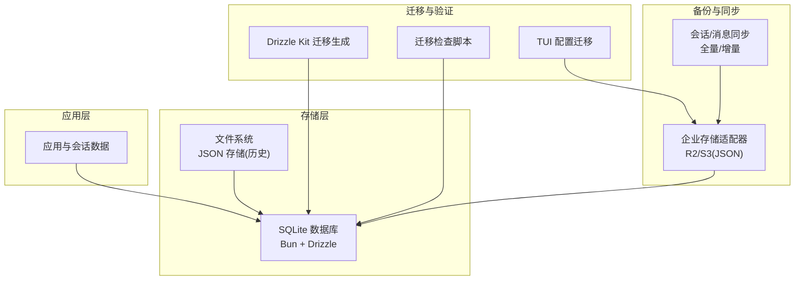
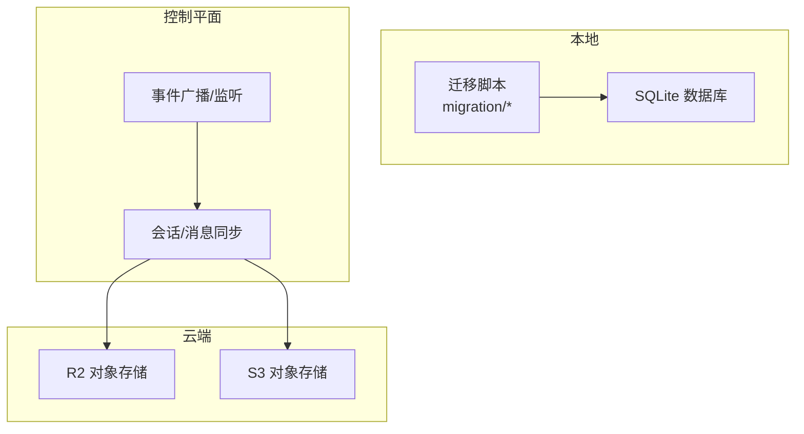
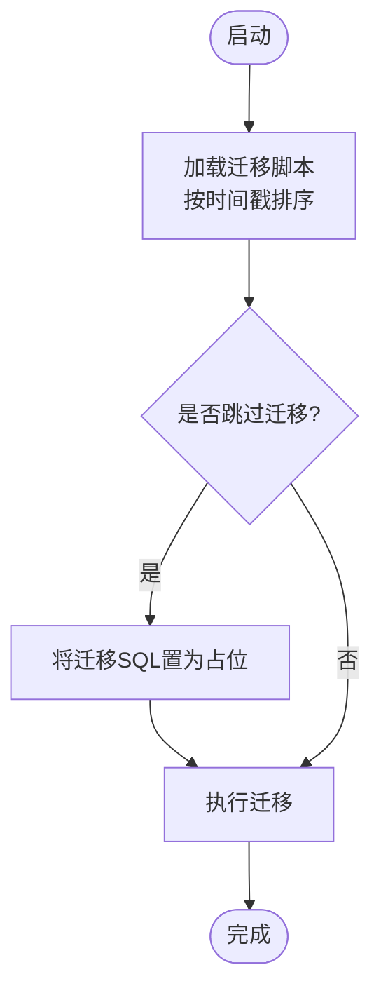
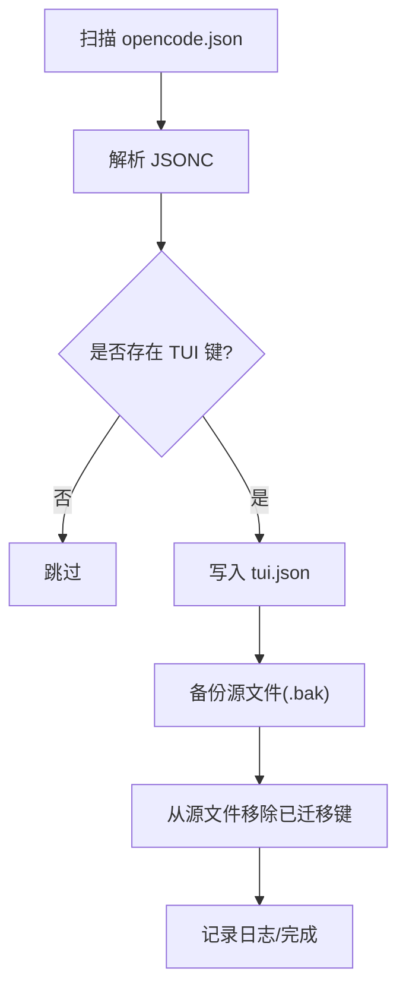
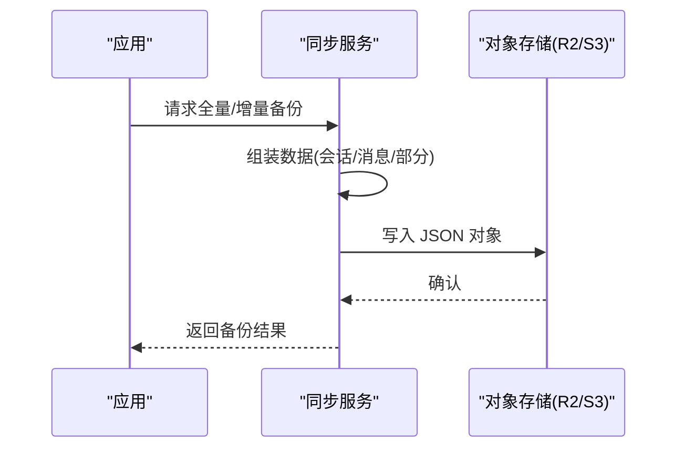
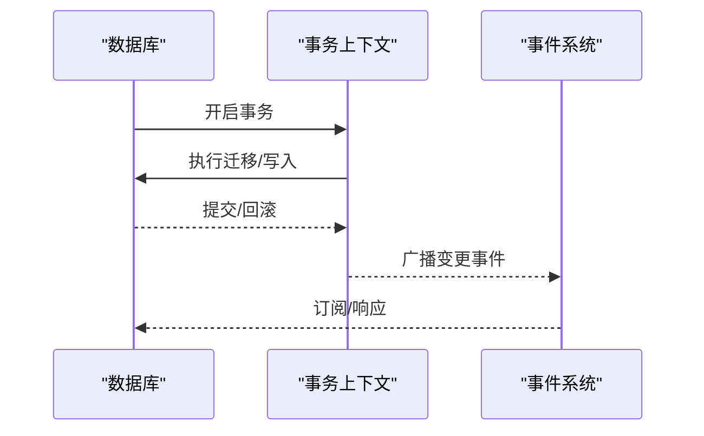
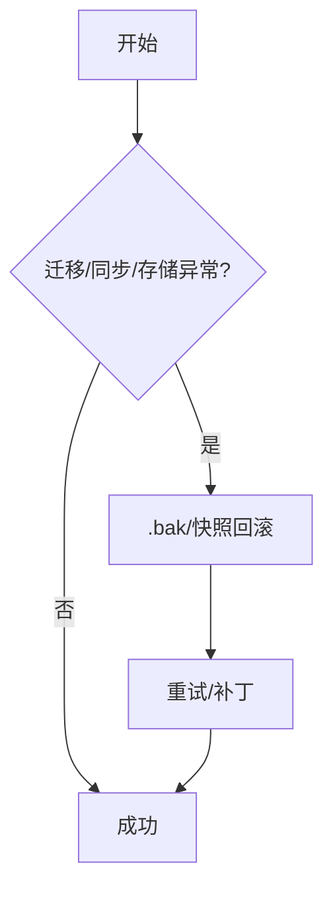
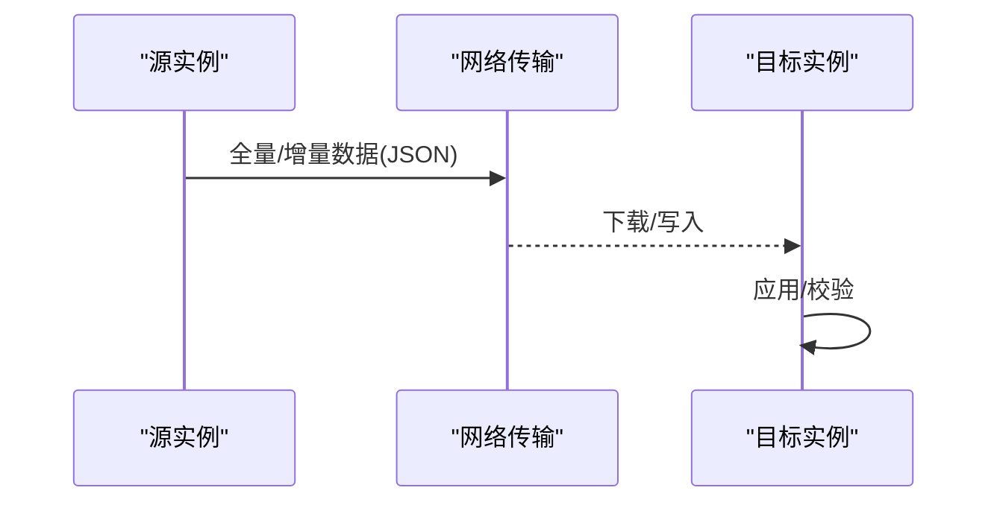
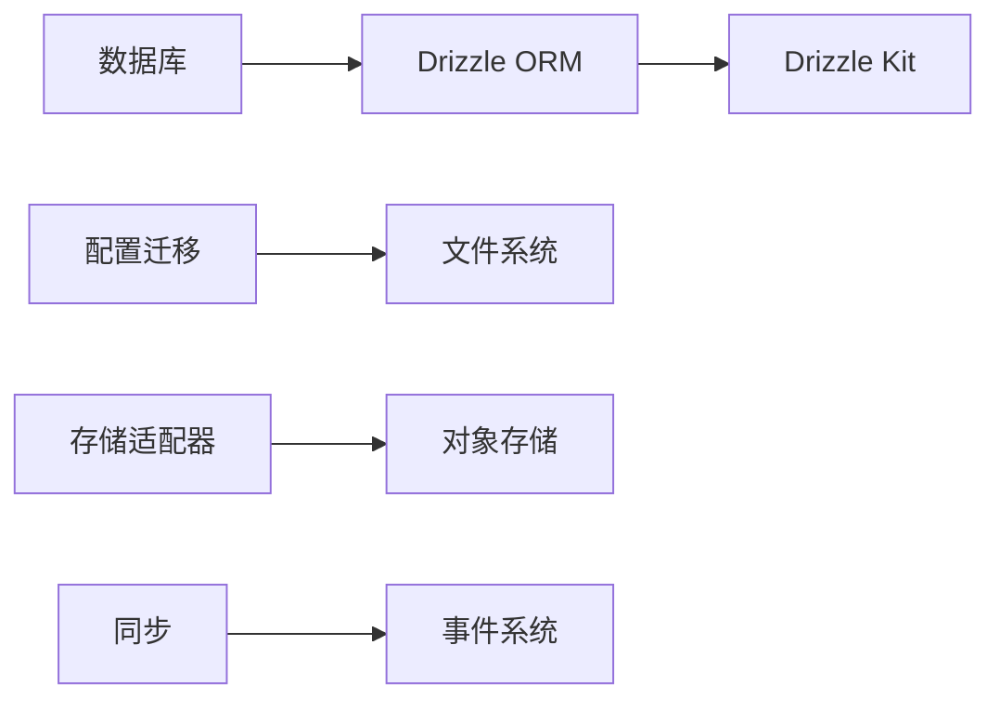

# 数据迁移与备份

<cite>
**本文引用的文件**
- [packages/opencode/src/storage/db.ts](file://packages/opencode/src/storage/db.ts)
- [packages/opencode/src/storage/json-migration.ts](file://packages/opencode/src/storage/json-migration.ts)
- [packages/opencode/script/check-migrations.ts](file://packages/opencode/script/check-migrations.ts)
- [packages/opencode/drizzle.config.ts](file://packages/opencode/drizzle.config.ts)
- [packages/opencode/AGENTS.md](file://packages/opencode/AGENTS.md)
- [packages/opencode/test/storage/json-migration.test.ts](file://packages/opencode/test/storage/json-migration.test.ts)
- [packages/opencode/src/config/migrate-tui-config.ts](file://packages/opencode/src/config/migrate-tui-config.ts)
- [packages/opencode/src/share/share-next.ts](file://packages/opencode/src/share/share-next.ts)
- [packages/enterprise/src/core/storage.ts](file://packages/enterprise/src/core/storage.ts)
- [infra/enterprise.ts](file://infra/enterprise.ts)
- [packages/opencode/test/control-plane/workspace-sync.test.ts](file://packages/opencode/test/control-plane/workspace-sync.test.ts)
- [packages/strategy-service/internal/summary/store.go](file://packages/strategy-service/internal/summary/store.go)
- [packages/strategy-service/internal/web/event.go](file://packages/strategy-service/internal/web/event.go)
</cite>

## 目录
1. [引言](#引言)
2. [项目结构](#项目结构)
3. [核心组件](#核心组件)
4. [架构总览](#架构总览)
5. [详细组件分析](#详细组件分析)
6. [依赖关系分析](#依赖关系分析)
7. [性能考量](#性能考量)
8. [故障排查指南](#故障排查指南)
9. [结论](#结论)
10. [附录](#附录)

## 引言
本文件系统性梳理 OpenCode 的数据迁移与备份恢复机制，覆盖版本升级时的数据库迁移策略、迁移脚本与回滚方案；备份策略设计（全量与增量）、备份文件格式、压缩与加密现状与建议；数据一致性保障、迁移验证与错误恢复流程；以及自动化备份配置、定时任务与通知机制；并说明跨平台数据迁移、网络传输与同步策略。

## 项目结构
围绕数据迁移与备份的关键模块分布如下：
- 数据库与迁移：SQLite（Bun）+ Drizzle ORM + Drizzle Kit
- 配置迁移：TUI 配置从 opencode.json 迁移到独立 tui.json
- 备份与存储：企业版 R2/S3 适配器，JSON 序列化存储
- 同步与一致性：会话与消息的全量/增量同步流程
- 测试与验证：迁移测试、同步行为测试

**图表来源**
- [packages/opencode/src/storage/db.ts:30-117](file://packages/opencode/src/storage/db.ts#L30-L117)
- [packages/opencode/drizzle.config.ts:1-10](file://packages/opencode/drizzle.config.ts#L1-L10)
- [packages/opencode/script/check-migrations.ts:1-17](file://packages/opencode/script/check-migrations.ts#L1-L17)
- [packages/opencode/src/config/migrate-tui-config.ts:39-88](file://packages/opencode/src/config/migrate-tui-config.ts#L39-L88)
- [packages/enterprise/src/core/storage.ts:1-130](file://packages/enterprise/src/core/storage.ts#L1-L130)
- [packages/opencode/src/share/share-next.ts:253-287](file://packages/opencode/src/share/share-next.ts#L253-L287)

**章节来源**
- [packages/opencode/src/storage/db.ts:30-117](file://packages/opencode/src/storage/db.ts#L30-L117)
- [packages/opencode/drizzle.config.ts:1-10](file://packages/opencode/drizzle.config.ts#L1-L10)
- [packages/opencode/script/check-migrations.ts:1-17](file://packages/opencode/script/check-migrations.ts#L1-L17)
- [packages/opencode/src/config/migrate-tui-config.ts:39-88](file://packages/opencode/src/config/migrate-tui-config.ts#L39-L88)
- [packages/enterprise/src/core/storage.ts:1-130](file://packages/enterprise/src/core/storage.ts#L1-L130)
- [packages/opencode/src/share/share-next.ts:253-287](file://packages/opencode/src/share/share-next.ts#L253-L287)

## 核心组件
- 数据库与迁移
  - 使用 SQLite（Bun）与 Drizzle ORM，启动时自动加载迁移并应用。
  - 迁移脚本由 Drizzle Kit 生成，输出到 migration 目录，按时间戳排序执行。
  - 提供迁移检查脚本，防止 schema drift。
- 配置迁移
  - 将 TUI 相关键从 opencode.json 迁移到独立的 tui.json，并备份源文件。
- 备份与存储
  - 企业版通过 R2/S3 适配器进行对象存储，键名采用层级路径 + .json 后缀。
  - 会话/消息支持全量同步与增量同步，用于跨实例/跨环境的数据一致性。
- 同步与一致性
  - 会话同步包含 session、message、part、session_diff、model 等多类数据。
  - 通过事件广播与 SSE 通道保障实时性与一致性。

**章节来源**
- [packages/opencode/src/storage/db.ts:30-117](file://packages/opencode/src/storage/db.ts#L30-L117)
- [packages/opencode/drizzle.config.ts:1-10](file://packages/opencode/drizzle.config.ts#L1-L10)
- [packages/opencode/script/check-migrations.ts:1-17](file://packages/opencode/script/check-migrations.ts#L1-L17)
- [packages/opencode/src/config/migrate-tui-config.ts:39-88](file://packages/opencode/src/config/migrate-tui-config.ts#L39-L88)
- [packages/enterprise/src/core/storage.ts:1-130](file://packages/enterprise/src/core/storage.ts#L1-L130)
- [packages/opencode/src/share/share-next.ts:253-287](file://packages/opencode/src/share/share-next.ts#L253-L287)

## 架构总览
OpenCode 的数据层由本地 SQLite 数据库与云端对象存储共同组成。迁移与验证通过 Drizzle Kit 与检查脚本保障；配置迁移通过独立工具完成；备份与同步通过企业存储适配器与会话同步机制实现。

**图表来源**
- [packages/opencode/src/storage/db.ts:98-114](file://packages/opencode/src/storage/db.ts#L98-L114)
- [packages/enterprise/src/core/storage.ts:66-91](file://packages/enterprise/src/core/storage.ts#L66-L91)
- [packages/opencode/src/share/share-next.ts:253-287](file://packages/opencode/src/share/share-next.ts#L253-L287)
- [packages/strategy-service/internal/web/event.go:120-182](file://packages/strategy-service/internal/web/event.go#L120-L182)

## 详细组件分析

### 数据库迁移与回滚策略
- 迁移生成与应用
  - 使用 Drizzle Kit 生成迁移脚本，输出到 migration 目录，按时间戳排序执行。
  - 应用迁移时可选择跳过（开发场景），或在生产中严格按顺序执行。
- 迁移验证
  - 提供迁移检查脚本，对比 schema 与迁移，若不一致则报错并提示生成迁移。
- 回滚方案
  - 当前实现未内置自动回滚脚本；建议在迁移前进行备份与快照，必要时通过版本回退与手动 SQL 恢复。
- 迁移测试
  - 单测中通过内存 SQLite 与迁移目录加载，验证迁移后 schema 正确性。

**图表来源**
- [packages/opencode/src/storage/db.ts:98-114](file://packages/opencode/src/storage/db.ts#L98-L114)
- [packages/opencode/script/check-migrations.ts:1-17](file://packages/opencode/script/check-migrations.ts#L1-L17)
- [packages/opencode/test/storage/json-migration.test.ts:77-95](file://packages/opencode/test/storage/json-migration.test.ts#L77-L95)

**章节来源**
- [packages/opencode/src/storage/db.ts:98-114](file://packages/opencode/src/storage/db.ts#L98-L114)
- [packages/opencode/script/check-migrations.ts:1-17](file://packages/opencode/script/check-migrations.ts#L1-L17)
- [packages/opencode/test/storage/json-migration.test.ts:77-95](file://packages/opencode/test/storage/json-migration.test.ts#L77-L95)

### 配置迁移（TUI）
- 目标
  - 将主题、按键绑定、TUI 相关配置从 opencode.json 迁移到独立的 tui.json。
- 流程
  - 读取源文件，解析 JSONC，提取相关键，写入 tui.json 并备份源文件。
  - 成功后从源文件中移除已迁移的键。
- 备份
  - 迁移前写入 .tui-migration.bak，便于回滚。

**图表来源**
- [packages/opencode/src/config/migrate-tui-config.ts:39-88](file://packages/opencode/src/config/migrate-tui-config.ts#L39-L88)
- [packages/opencode/src/config/migrate-tui-config.ts:102-135](file://packages/opencode/src/config/migrate-tui-config.ts#L102-L135)

**章节来源**
- [packages/opencode/src/config/migrate-tui-config.ts:39-88](file://packages/opencode/src/config/migrate-tui-config.ts#L39-L88)
- [packages/opencode/src/config/migrate-tui-config.ts:102-135](file://packages/opencode/src/config/migrate-tui-config.ts#L102-L135)

### 备份策略与实现
- 备份介质与格式
  - 企业版通过 R2/S3 适配器进行对象存储，键名为层级路径 + .json 后缀，值为 JSON 文本。
- 备份类型
  - 全量备份：将业务数据序列化为 JSON 并写入对象存储。
  - 增量备份：通过会话/消息同步接口，按需推送差异数据。
- 备份流程（概念示意）

**图表来源**
- [packages/enterprise/src/core/storage.ts:1-130](file://packages/enterprise/src/core/storage.ts#L1-L130)
- [packages/opencode/src/share/share-next.ts:253-287](file://packages/opencode/src/share/share-next.ts#L253-L287)

**章节来源**
- [packages/enterprise/src/core/storage.ts:1-130](file://packages/enterprise/src/core/storage.ts#L1-L130)
- [packages/opencode/src/share/share-next.ts:253-287](file://packages/opencode/src/share/share-next.ts#L253-L287)

### 数据一致性与迁移验证
- 一致性保障
  - 事务封装：数据库事务与上下文作用域，确保回调内的一致性。
  - 同步事件：通过事件广播与 SSE 通道，保证跨实例状态一致。
- 迁移验证
  - 迁移检查脚本：发现 schema drift 即刻停止并提示生成迁移。
  - 单元测试：在内存数据库中应用迁移，验证表结构与约束。

**图表来源**
- [packages/opencode/src/storage/db.ts:129-171](file://packages/opencode/src/storage/db.ts#L129-L171)
- [packages/strategy-service/internal/web/event.go:120-182](file://packages/strategy-service/internal/web/event.go#L120-L182)

**章节来源**
- [packages/opencode/src/storage/db.ts:129-171](file://packages/opencode/src/storage/db.ts#L129-L171)
- [packages/strategy-service/internal/web/event.go:120-182](file://packages/strategy-service/internal/web/event.go#L120-L182)

### 错误恢复与回滚
- 迁移失败
  - 通过迁移检查脚本提前发现异常；必要时回滚至备份的 .tui-migration.bak 或数据库快照。
- 同步失败
  - 会话同步包含全量与增量两种路径，失败时可重试或回放差异。
- 存储异常
  - 对象存储读写失败时抛出错误，需检查凭证与桶权限。

**图表来源**
- [packages/opencode/src/config/migrate-tui-config.ts:102-135](file://packages/opencode/src/config/migrate-tui-config.ts#L102-L135)
- [packages/enterprise/src/core/storage.ts:15-38](file://packages/enterprise/src/core/storage.ts#L15-L38)

**章节来源**
- [packages/opencode/src/config/migrate-tui-config.ts:102-135](file://packages/opencode/src/config/migrate-tui-config.ts#L102-L135)
- [packages/enterprise/src/core/storage.ts:15-38](file://packages/enterprise/src/core/storage.ts#L15-L38)

### 自动化备份配置、定时任务与通知
- 自动化备份
  - 企业版通过 R2/S3 适配器实现对象存储，可结合外部调度器（如 GitHub Actions）定期触发备份任务。
- 定时任务
  - 项目内提供调度器注册与执行示例，可用于周期性任务编排。
- 通知机制
  - 前端与桌面端具备通知与声音提醒能力，可用于迁移/备份任务的状态反馈。

**章节来源**
- [packages/enterprise/src/core/storage.ts:1-130](file://packages/enterprise/src/core/storage.ts#L1-L130)
- [packages/opencode/test/scheduler.test.ts:45-73](file://packages/opencode/test/scheduler.test.ts#L45-L73)
- [packages/app/src/pages/layout.tsx:485-526](file://packages/app/src/pages/layout.tsx#L485-L526)
- [packages/desktop/src/index.tsx:311-355](file://packages/desktop/src/index.tsx#L311-L355)

### 跨平台数据迁移、网络传输与同步
- 跨平台
  - 数据库层使用 SQLite，具备跨平台兼容性；配置迁移工具可在不同平台执行。
- 网络传输
  - 企业版通过 R2/S3 适配器进行网络传输，键名采用层级路径，值为 JSON。
- 同步策略
  - 会话同步支持全量与增量，包含会话、消息、部分、差异与模型等数据类型，确保跨实例一致性。

**图表来源**
- [packages/opencode/src/share/share-next.ts:253-287](file://packages/opencode/src/share/share-next.ts#L253-L287)
- [packages/enterprise/src/core/storage.ts:1-130](file://packages/enterprise/src/core/storage.ts#L1-L130)

**章节来源**
- [packages/opencode/src/share/share-next.ts:253-287](file://packages/opencode/src/share/share-next.ts#L253-L287)
- [packages/enterprise/src/core/storage.ts:1-130](file://packages/enterprise/src/core/storage.ts#L1-L130)

## 依赖关系分析
- 数据库依赖
  - Bun SQLite + Drizzle ORM，迁移由 Drizzle Kit 生成。
- 配置依赖
  - JSONC 解析与编辑，文件系统读写。
- 存储依赖
  - R2/S3 适配器，AWS 客户端封装。
- 同步依赖
  - 事件广播与 SSE，会话/消息数据模型。

**图表来源**
- [packages/opencode/src/storage/db.ts:1-172](file://packages/opencode/src/storage/db.ts#L1-L172)
- [packages/opencode/drizzle.config.ts:1-10](file://packages/opencode/drizzle.config.ts#L1-L10)
- [packages/opencode/src/config/migrate-tui-config.ts:1-156](file://packages/opencode/src/config/migrate-tui-config.ts#L1-L156)
- [packages/enterprise/src/core/storage.ts:1-130](file://packages/enterprise/src/core/storage.ts#L1-L130)
- [packages/strategy-service/internal/web/event.go:120-182](file://packages/strategy-service/internal/web/event.go#L120-L182)

**章节来源**
- [packages/opencode/src/storage/db.ts:1-172](file://packages/opencode/src/storage/db.ts#L1-L172)
- [packages/opencode/drizzle.config.ts:1-10](file://packages/opencode/drizzle.config.ts#L1-L10)
- [packages/opencode/src/config/migrate-tui-config.ts:1-156](file://packages/opencode/src/config/migrate-tui-config.ts#L1-L156)
- [packages/enterprise/src/core/storage.ts:1-130](file://packages/enterprise/src/core/storage.ts#L1-L130)
- [packages/strategy-service/internal/web/event.go:120-182](file://packages/strategy-service/internal/web/event.go#L120-L182)

## 性能考量
- SQLite 参数
  - 启用 WAL 模式、设置同步级别、超时与缓存大小，有助于提升并发与稳定性。
- 迁移性能
  - 迁移脚本按时间戳排序执行，避免重复与冲突；开发模式可跳过迁移以加速迭代。
- 存储性能
  - 对象存储采用 JSON 文本，适合中小规模数据；大体量建议分片与压缩。

**章节来源**
- [packages/opencode/src/storage/db.ts:89-94](file://packages/opencode/src/storage/db.ts#L89-L94)
- [packages/opencode/src/storage/db.ts:108-114](file://packages/opencode/src/storage/db.ts#L108-L114)
- [packages/enterprise/src/core/storage.ts:15-31](file://packages/enterprise/src/core/storage.ts#L15-L31)

## 故障排查指南
- 迁移失败
  - 使用迁移检查脚本定位 schema drift；查看日志与错误码，必要时回滚 .bak 快照。
- 配置迁移失败
  - 检查源文件解析错误与目标文件写入权限；确认 .bak 是否成功创建。
- 存储异常
  - 校验环境变量（R2/S3 凭证、桶名、区域）；确认网络连通性与权限。
- 同步异常
  - 查看事件广播与 SSE 连接状态；核对会话/消息数据完整性。

**章节来源**
- [packages/opencode/script/check-migrations.ts:1-17](file://packages/opencode/script/check-migrations.ts#L1-L17)
- [packages/opencode/src/config/migrate-tui-config.ts:102-135](file://packages/opencode/src/config/migrate-tui-config.ts#L102-L135)
- [packages/enterprise/src/core/storage.ts:15-38](file://packages/enterprise/src/core/storage.ts#L15-L38)
- [packages/strategy-service/internal/web/event.go:120-182](file://packages/strategy-service/internal/web/event.go#L120-L182)

## 结论
OpenCode 的数据迁移与备份体系以 SQLite 为核心，配合 Drizzle Kit 的迁移机制与企业版对象存储适配器，实现了从本地到云端的可靠数据管理。配置迁移工具保障了用户配置的平滑演进；同步机制与事件系统确保了跨实例一致性。建议在生产环境中强化备份与回滚策略，完善自动化与监控告警，持续提升可用性与可维护性。

## 附录
- 迁移命令与规范
  - 迁移生成与输出规范参见项目指南与 Drizzle 配置。
- 测试参考
  - 迁移测试与同步测试提供了验证思路与边界条件。

**章节来源**
- [packages/opencode/AGENTS.md:1-40](file://packages/opencode/AGENTS.md#L1-L40)
- [packages/opencode/drizzle.config.ts:1-10](file://packages/opencode/drizzle.config.ts#L1-L10)
- [packages/opencode/test/storage/json-migration.test.ts:77-95](file://packages/opencode/test/storage/json-migration.test.ts#L77-L95)
- [packages/opencode/test/control-plane/workspace-sync.test.ts:82-99](file://packages/opencode/test/control-plane/workspace-sync.test.ts#L82-L99)