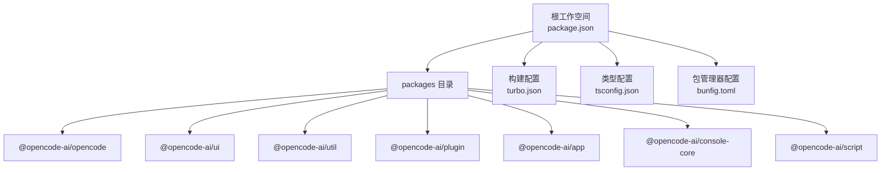
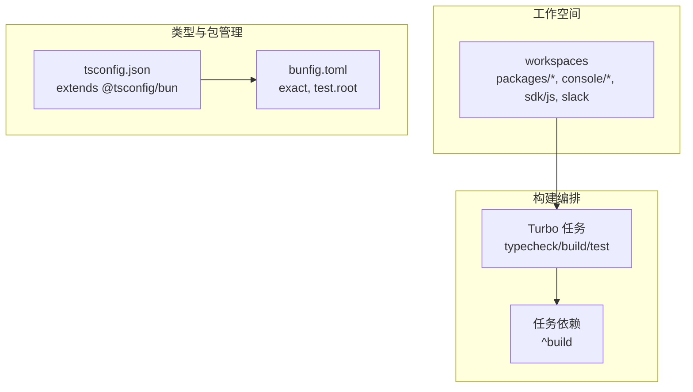
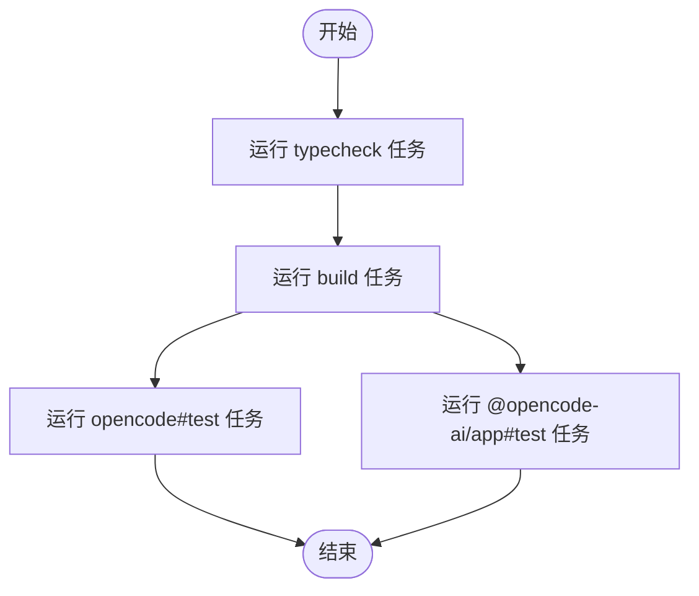
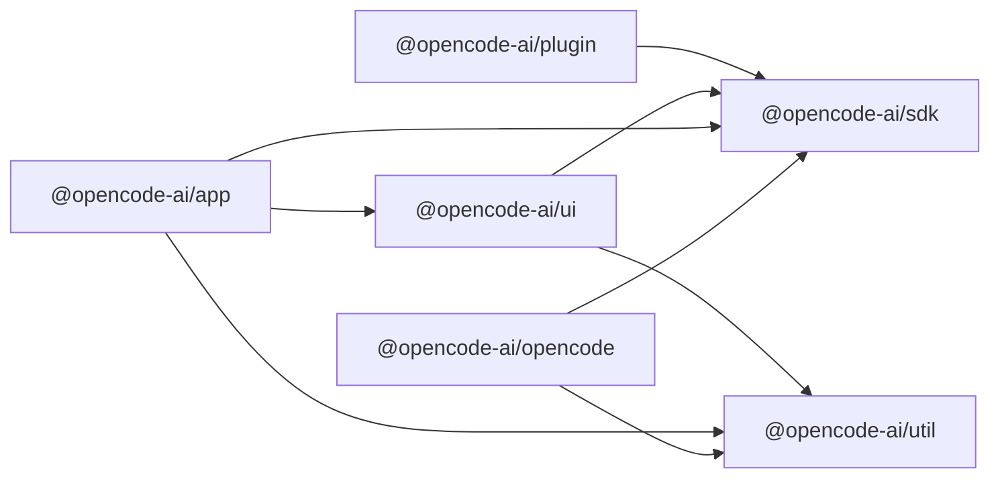
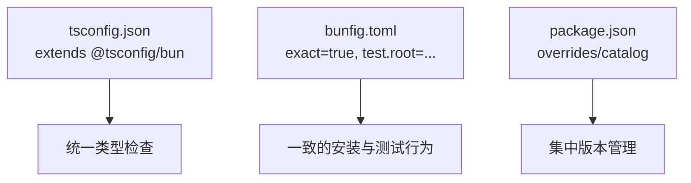
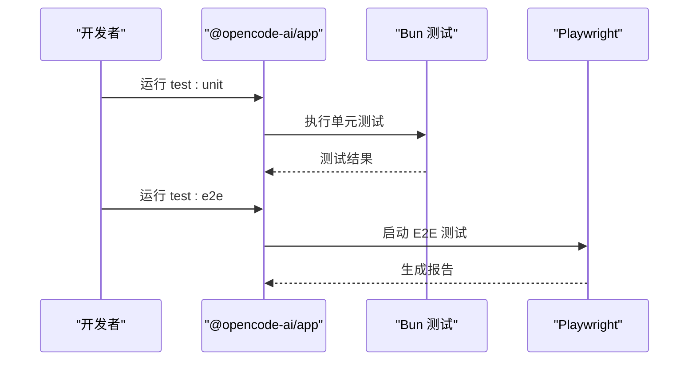
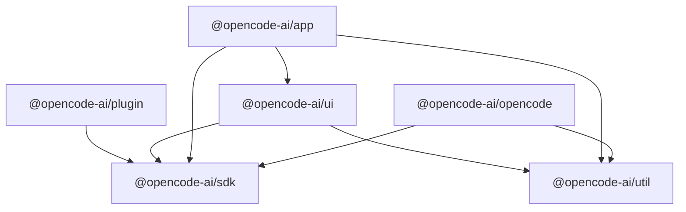

# Monorepo结构

<cite>
**本文引用的文件**
- [turbo.json](file://turbo.json)
- [package.json](file://package.json)
- [bunfig.toml](file://bunfig.toml)
- [tsconfig.json](file://tsconfig.json)
- [packages/opencode/package.json](file://packages/opencode/package.json)
- [packages/ui/package.json](file://packages/ui/package.json)
- [packages/util/package.json](file://packages/util/package.json)
- [packages/plugin/package.json](file://packages/plugin/package.json)
- [packages/app/package.json](file://packages/app/package.json)
- [packages/console/core/package.json](file://packages/console/core/package.json)
- [packages/script/package.json](file://packages/script/package.json)
</cite>

## 目录
1. [引言](#引言)
2. [项目结构](#项目结构)
3. [核心组件](#核心组件)
4. [架构总览](#架构总览)
5. [详细组件分析](#详细组件分析)
6. [依赖分析](#依赖分析)
7. [性能考虑](#性能考虑)
8. [故障排除指南](#故障排除指南)
9. [结论](#结论)
10. [附录](#附录)

## 引言
本文件系统性阐述 OpenCode 的 Monorepo 架构与组织方式，重点覆盖以下方面：
- packages 目录下各包的功能定位与相互关系
- Turbo 构建系统配置、任务依赖与并行构建策略
- 包之间的依赖关系、版本管理与发布策略
- 工作空间配置、包导出与模块解析规则
- 包开发最佳实践：共享依赖、工具链配置与测试策略
- 新包添加流程、命名约定与目录结构规范

## 项目结构
OpenCode 采用以工作空间为中心的 Monorepo 组织方式，根目录通过统一的包管理器与工具链进行管理，并在 packages 下按功能域划分子包。整体结构遵循“按领域分层”的原则，便于复用与维护。

图表来源
- [package.json:21-27](file://package.json#L21-L27)
- [turbo.json:1-21](file://turbo.json#L1-L21)
- [tsconfig.json:1-6](file://tsconfig.json#L1-L6)
- [bunfig.toml:1-7](file://bunfig.toml#L1-L7)

章节来源
- [package.json:21-27](file://package.json#L21-L27)
- [turbo.json:1-21](file://turbo.json#L1-L21)
- [tsconfig.json:1-6](file://tsconfig.json#L1-L6)
- [bunfig.toml:1-7](file://bunfig.toml#L1-L7)

## 核心组件
本节对关键包进行概览式说明，聚焦其职责边界、导出与依赖关系，为后续深入分析打基础。

- opencode 包（CLI/工具集）
  - 职责：提供 CLI 命令与通用工具脚本，支持类型检查、测试、构建与数据库工具等。
  - 导出：通过 exports 字段暴露内部模块，便于被其他包引用。
  - 依赖：广泛使用 AI SDK 提供商、AWS SDK、Hono 生态、Zod 等生态库。
  - 参考路径：[packages/opencode/package.json:25-27](file://packages/opencode/package.json#L25-L27)

- ui 包（UI 组件与主题）
  - 职责：提供可复用的 UI 组件、主题、样式与国际化资源，统一前端视觉与交互体验。
  - 导出：多入口导出，涵盖组件、Hooks、上下文、主题、图标类型与静态资源。
  - 依赖：SolidJS、Kobalte、TailwindCSS、Shiki、Marked 等。
  - 参考路径：[packages/ui/package.json:6-25](file://packages/ui/package.json#L6-L25)

- util 包（通用工具）
  - 职责：提供跨包通用工具函数与类型定义，保持最小化与高内聚。
  - 导出：通配符导出 src 下的模块，便于按需引入。
  - 依赖：Zod（用于校验）。
  - 参考路径：[packages/util/package.json:7-9](file://packages/util/package.json#L7-L9)

- plugin 包（插件框架）
  - 职责：定义插件接口与工具方法，作为扩展点支撑生态能力。
  - 导出：主入口与工具子入口，便于外部调用。
  - 依赖：SDK 与 Zod。
  - 参考路径：[packages/plugin/package.json:11-14](file://packages/plugin/package.json#L11-L14)

- app 包（应用入口）
  - 职责：Web 应用入口与开发服务器，集成 Vite、Playwright、HappyDOM 等。
  - 导出：应用入口、Vite 配置与样式入口。
  - 依赖：UI、SDK、Util、TailwindCSS、SolidJS 生态等。
  - 参考路径：[packages/app/package.json:6-10](file://packages/app/package.json#L6-L10)

- console-core 包（控制台核心）
  - 职责：控制台后端核心逻辑，包含数据库模型、资源与运维脚本。
  - 导出：按文件与通配符导出源码，便于按模块使用。
  - 依赖：AWS STS、Drizzle ORM、Stripe、Ulid、Zod 等。
  - 参考路径：[packages/console/core/package.json:21-24](file://packages/console/core/package.json#L21-L24)

- script 包（脚本工具）
  - 职责：提供版本、发布、统计等脚本工具，支撑自动化流程。
  - 导出：主入口。
  - 依赖：SemVer。
  - 参考路径：[packages/script/package.json:12-14](file://packages/script/package.json#L12-L14)

章节来源
- [packages/opencode/package.json:25-27](file://packages/opencode/package.json#L25-L27)
- [packages/ui/package.json:6-25](file://packages/ui/package.json#L6-L25)
- [packages/util/package.json:7-9](file://packages/util/package.json#L7-L9)
- [packages/plugin/package.json:11-14](file://packages/plugin/package.json#L11-L14)
- [packages/app/package.json:6-10](file://packages/app/package.json#L6-L10)
- [packages/console/core/package.json:21-24](file://packages/console/core/package.json#L21-L24)
- [packages/script/package.json:12-14](file://packages/script/package.json#L12-L14)

## 架构总览
OpenCode 的 Monorepo 采用“工作空间 + 构建编排 + 类型与包管理”三位一体的设计：
- 工作空间：通过根 package.json 的 workspaces 字段声明所有子包，实现统一安装与跨包依赖解析。
- 构建编排：通过 Turbo 定义任务与依赖，实现增量构建与并行执行。
- 类型与包管理：通过 tsconfig.json 与 bunfig.toml 统一类型配置与包管理行为。

图表来源
- [package.json:21-27](file://package.json#L21-L27)
- [turbo.json:5-19](file://turbo.json#L5-L19)
- [tsconfig.json:1-6](file://tsconfig.json#L1-L6)
- [bunfig.toml:1-7](file://bunfig.toml#L1-L7)

章节来源
- [package.json:21-27](file://package.json#L21-L27)
- [turbo.json:5-19](file://turbo.json#L5-L19)
- [tsconfig.json:1-6](file://tsconfig.json#L1-L6)
- [bunfig.toml:1-7](file://bunfig.toml#L1-L7)

## 详细组件分析

### 构建与任务编排（Turbo）
- 全局环境变量：通过 globalEnv 与 globalPassThroughEnv 控制 CI 与共享开关。
- 任务定义：
  - typecheck：全局类型检查任务。
  - build：构建任务，输出到 dist。
  - 测试任务（opencode#test、@opencode-ai/app#test）：均依赖 ^build，确保先构建再测试。
- 并行策略：Turbo 默认按拓扑排序并行执行无依赖的任务；通过 dependsOn 明确任务间顺序。

图表来源
- [turbo.json:5-19](file://turbo.json#L5-L19)

章节来源
- [turbo.json:1-21](file://turbo.json#L1-L21)

### 包导出与模块解析
- 统一命名空间：所有包均采用 @opencode-ai/<name> 命名，便于在工作空间内解析与发布。
- 导出字段：多数包通过 exports 暴露多入口，如 UI 包导出组件、Hooks、主题、图标与资源；opencode 与 util 采用通配符导出 src 下模块。
- 解析规则：Bun/PNPM 等包管理器在解析 workspace:* 时，会根据包的 exports 字段选择合适的入口；未显式声明的入口可能无法被正确解析。

图表来源
- [packages/opencode/package.json:94-95](file://packages/opencode/package.json#L94-L95)
- [packages/app/package.json:42-44](file://packages/app/package.json#L42-L44)
- [packages/ui/package.json:46-47](file://packages/ui/package.json#L46-L47)
- [packages/plugin/package.json:18-19](file://packages/plugin/package.json#L18-L19)

章节来源
- [packages/opencode/package.json:25-27](file://packages/opencode/package.json#L25-L27)
- [packages/ui/package.json:6-25](file://packages/ui/package.json#L6-L25)
- [packages/util/package.json:7-9](file://packages/util/package.json#L7-L9)
- [packages/plugin/package.json:11-14](file://packages/plugin/package.json#L11-L14)
- [packages/app/package.json:6-10](file://packages/app/package.json#L6-L10)

### 类型与包管理配置
- tsconfig.json：继承 @tsconfig/bun 的默认配置，保证类型检查一致性。
- bunfig.toml：启用 exact 安装模式，避免版本漂移；设置测试根目录防止从根目录误跑测试。
- catalog 机制：通过 package.json 的 overrides 与 catalog 字段集中管理依赖版本，减少重复与冲突。

图表来源
- [tsconfig.json:1-6](file://tsconfig.json#L1-L6)
- [bunfig.toml:1-7](file://bunfig.toml#L1-L7)
- [package.json:109-116](file://package.json#L109-L116)

章节来源
- [tsconfig.json:1-6](file://tsconfig.json#L1-L6)
- [bunfig.toml:1-7](file://bunfig.toml#L1-L7)
- [package.json:109-116](file://package.json#L109-L116)

### 测试策略与工具链
- 单元测试：Bun 测试驱动，app 包通过 Playwright 进行 E2E 测试，支持 UI 模式与报告生成。
- 类型检查：各包通过 tsgo 或 tsc 执行类型检查，确保类型安全。
- 开发体验：Vite 作为开发服务器，配合 SolidJS 生态与 TailwindCSS 实现快速迭代。

图表来源
- [packages/app/package.json:17-24](file://packages/app/package.json#L17-L24)

章节来源
- [packages/app/package.json:17-24](file://packages/app/package.json#L17-L24)

## 依赖分析
- 版本与发布策略
  - 版本号：各包 version 字段统一为 1.2.26，便于在 monorepo 内部保持一致性。
  - 发布策略：通过根 package.json 的 dependencies 中的 workspace:* 引用，确保本地联调；发布时由上层流程统一管理版本与发布。
- 依赖关系图

图表来源
- [packages/opencode/package.json:94-95](file://packages/opencode/package.json#L94-L95)
- [packages/app/package.json:42-44](file://packages/app/package.json#L42-L44)
- [packages/ui/package.json:46-47](file://packages/ui/package.json#L46-L47)
- [packages/plugin/package.json:18-19](file://packages/plugin/package.json#L18-L19)

章节来源
- [packages/opencode/package.json:3-4](file://packages/opencode/package.json#L3-L4)
- [packages/ui/package.json:3-4](file://packages/ui/package.json#L3-L4)
- [packages/util/package.json:3-4](file://packages/util/package.json#L3-L4)
- [packages/plugin/package.json:3-4](file://packages/plugin/package.json#L3-L4)
- [packages/app/package.json:3-4](file://packages/app/package.json#L3-L4)
- [packages/console/core/package.json:3-4](file://packages/console/core/package.json#L3-L4)
- [packages/script/package.json:3-4](file://packages/script/package.json#L3-L4)

## 性能考虑
- 并行构建：Turbo 按拓扑并行执行任务，建议合理拆分任务与依赖，避免不必要的串行。
- 增量构建：利用 Turbo 的缓存与输出目录（如 dist）提升重复构建速度。
- 类型检查：将 typecheck 作为独立任务，避免在每次构建中重复执行，缩短反馈周期。
- 包管理：使用 exact 安装与 catalog 集中版本管理，降低锁文件膨胀与冲突风险。

## 故障排除指南
- 从根目录运行测试失败
  - 现象：根 package.json 中 test 脚本直接退出，提示不要从根运行测试。
  - 原因：bunfig.toml 将测试根目录设置为特定路径，防止误运行。
  - 处理：切换到具体包目录执行测试或使用 Turbo 任务。
  - 参考路径：[package.json:19-19](file://package.json#L19-L19)，[bunfig.toml:4-6](file://bunfig.toml#L4-L6)
- 任务依赖导致构建卡住
  - 现象：测试任务等待构建完成。
  - 原因：turbo.json 中测试任务依赖 ^build。
  - 处理：确认上游包已成功构建，或调整 dependsOn 以减少耦合。
  - 参考路径：[turbo.json:11-18](file://turbo.json#L11-L18)
- 导入路径不生效
  - 现象：从其他包导入模块报错。
  - 原因：未在目标包的 exports 中声明对应入口。
  - 处理：在 package.json 的 exports 中补充相应入口。
  - 参考路径：[packages/ui/package.json:6-25](file://packages/ui/package.json#L6-L25)，[packages/util/package.json:7-9](file://packages/util/package.json#L7-L9)

章节来源
- [package.json:19-19](file://package.json#L19-L19)
- [bunfig.toml:4-6](file://bunfig.toml#L4-L6)
- [turbo.json:11-18](file://turbo.json#L11-L18)
- [packages/ui/package.json:6-25](file://packages/ui/package.json#L6-L25)
- [packages/util/package.json:7-9](file://packages/util/package.json#L7-L9)

## 结论
OpenCode 的 Monorepo 以清晰的工作空间划分、统一的类型与包管理配置为基础，借助 Turbo 实现高效并行构建与明确的任务依赖。通过标准化的包导出与命名约定，实现了跨包复用与模块化演进。建议在新增包时严格遵循命名与导出规范，并结合 Turbo 任务与 catalog 版本管理，持续优化构建性能与发布效率。

## 附录

### 新包添加流程与规范
- 目录与命名
  - 在 packages 下创建新包目录，命名采用 @opencode-ai/<name>，与现有包保持一致。
  - 若为多模块包，建议在 package.json 中通过 exports 暴露子入口。
- 工作空间声明
  - 在根 package.json 的 workspaces 中添加新包路径，确保被纳入工作空间管理。
- 导出与模块解析
  - 在 package.json 中定义 exports 字段，明确主入口与其他子入口，便于其他包引用。
- 依赖与版本
  - 优先使用 catalog 中的版本，减少重复声明；跨包依赖使用 workspace:*。
- 构建与测试
  - 为新包添加 typecheck、build、test 等脚本，并在 Turbo 中按需配置任务依赖。
- 发布策略
  - 版本号与现有包保持一致；发布前确保类型检查与测试通过。

章节来源
- [package.json:21-27](file://package.json#L21-L27)
- [turbo.json:5-19](file://turbo.json#L5-L19)
- [packages/ui/package.json:6-25](file://packages/ui/package.json#L6-L25)
- [packages/util/package.json:7-9](file://packages/util/package.json#L7-L9)