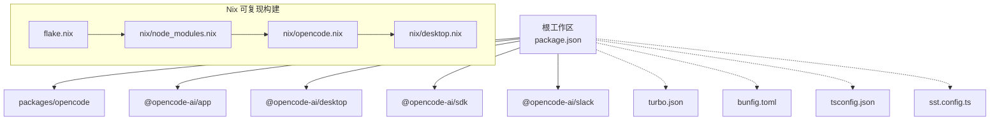
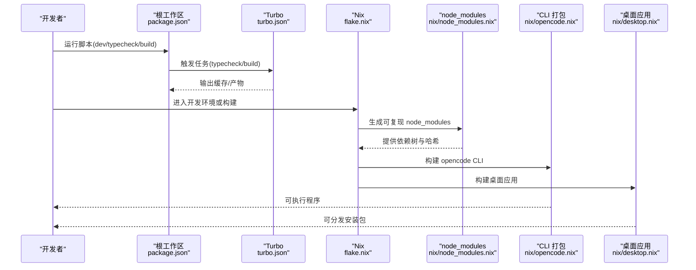
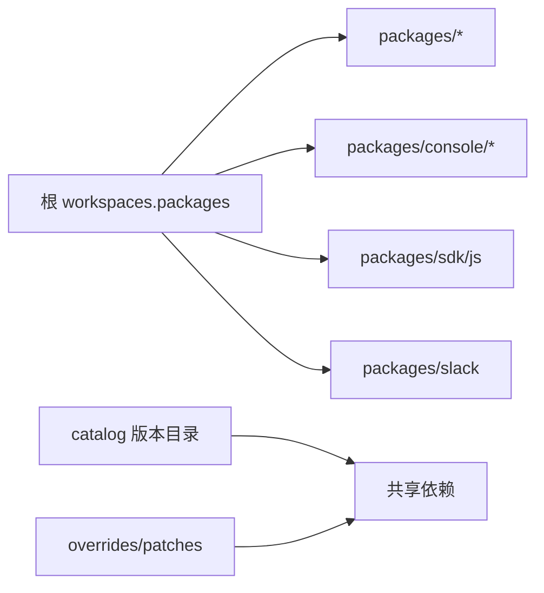
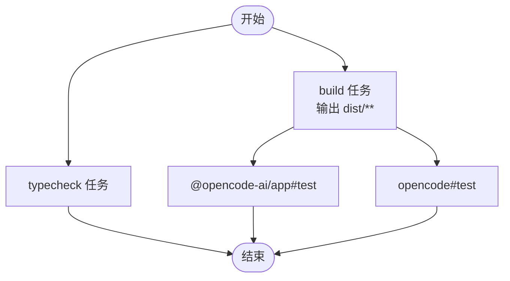
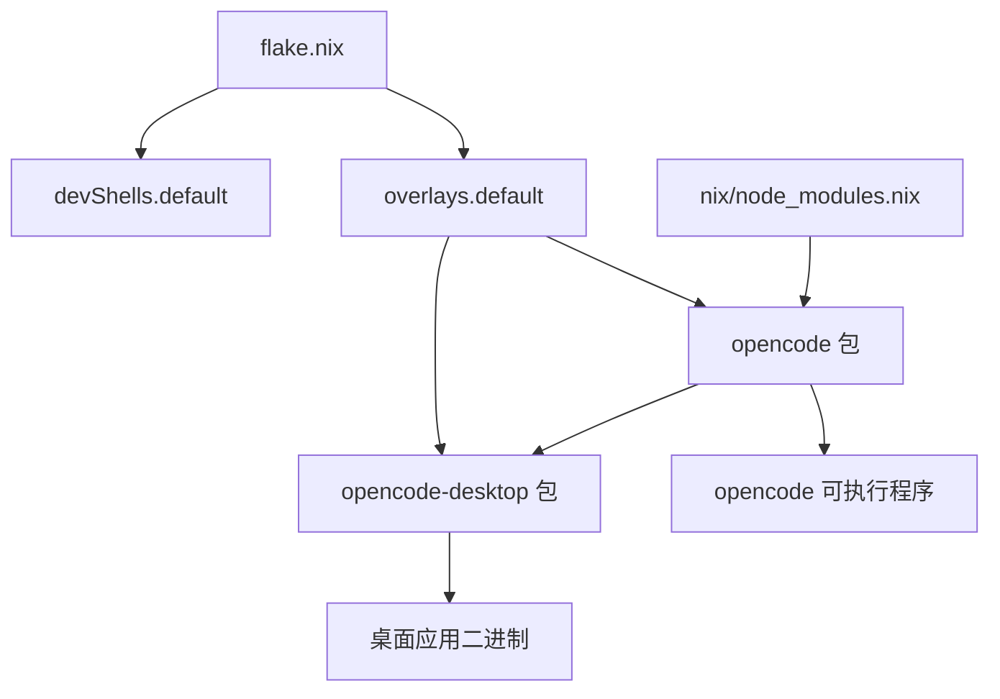
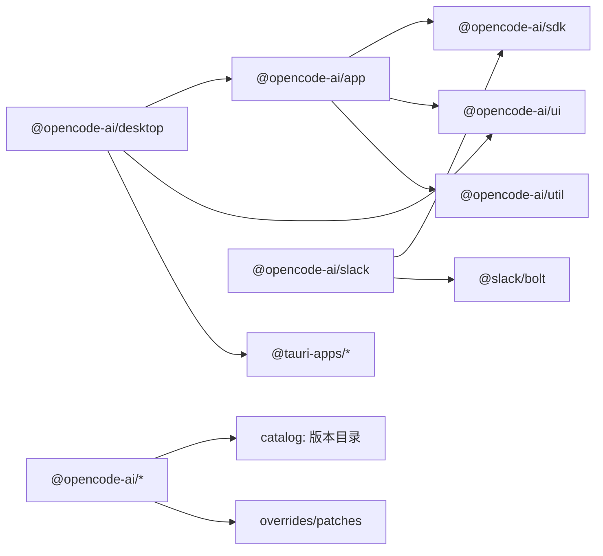
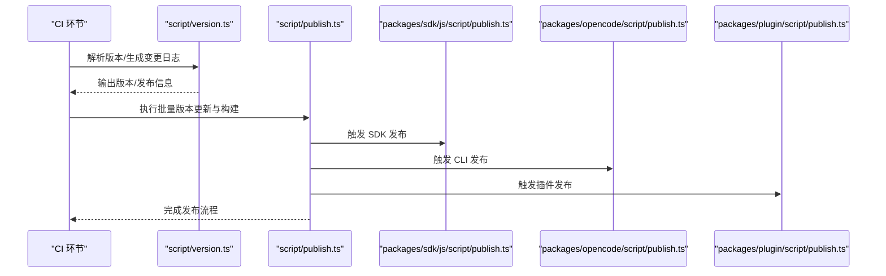
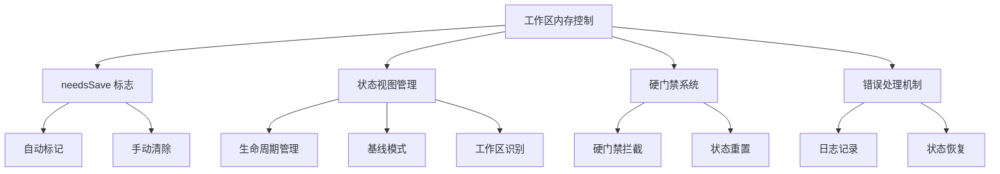
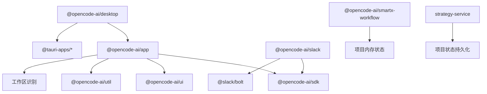

# 工作空间配置

<cite>
**本文引用的文件**
- [package.json](file://package.json)
- [turbo.json](file://turbo.json)
- [flake.nix](file://flake.nix)
- [nix/opencode.nix](file://nix/opencode.nix)
- [nix/node_modules.nix](file://nix/node_modules.nix)
- [nix/desktop.nix](file://nix/desktop.nix)
- [packages/opencode/package.json](file://packages/opencode/package.json)
- [packages/app/package.json](file://packages/app/package.json)
- [packages/desktop/package.json](file://packages/desktop/package.json)
- [packages/sdk/js/package.json](file://packages/sdk/js/package.json)
- [packages/slack/package.json](file://packages/slack/package.json)
- [script/version.ts](file://script/version.ts)
- [script/publish.ts](file://script/publish.ts)
- [bunfig.toml](file://bunfig.toml)
- [tsconfig.json](file://tsconfig.json)
- [sst.config.ts](file://sst.config.ts)
- [packages/smartx-workflow/src/types.ts](file://packages/smartx-workflow/src/types.ts)
- [packages/smartx-workflow/src/gate.ts](file://packages/smartx-workflow/src/gate.ts)
- [packages/smartx-workflow/src/life.ts](file://packages/smartx-workflow/src/life.ts)
- [packages/smartx-workflow/src/workspace.ts](file://packages/smartx-workflow/src/workspace.ts)
- [packages/smartx-workflow/test/analysis.test.ts](file://packages/smartx-workflow/test/analysis.test.ts)
- [packages/app/src/pages/layout/helpers.ts](file://packages/app/src/pages/layout/helpers.ts)
</cite>

## 更新摘要
**变更内容**
- 新增项目内存保存控制机制，引入 needsSave 标志确保工作区状态一致性
- 增强状态跟踪和生命周期管理，完善工作区识别逻辑
- 改进错误处理机制，提供更健壮的系统保护
- 优化工作区基线状态管理，确保项目记忆的正确保存和恢复

## 目录
1. [简介](#简介)
2. [项目结构](#项目结构)
3. [核心组件](#核心组件)
4. [架构总览](#架构总览)
5. [详细组件分析](#详细组件分析)
6. [依赖分析](#依赖分析)
7. [性能考虑](#性能考虑)
8. [故障排查指南](#故障排查指南)
9. [结论](#结论)
10. [附录](#附录)

## 简介
本文件系统性说明 OpenCode Monorepo 的工作空间配置与工程化实践，涵盖以下方面：
- package.json 中 workspaces 配置：packages 数组的路径规则、嵌套工作空间结构与 catalog 共享依赖管理
- Turbo 构建系统：任务定义、依赖关系与缓存策略
- Nix 包管理器：环境隔离、可复现构建与桌面应用打包
- 工作空间脚本：版本发布、批量更新与 CI/CD 集成
- 包间依赖声明、版本管理与共享依赖配置
- **新增**：项目内存保存控制机制，包括 needsSave 标志、增强的状态跟踪和生命周期管理

## 项目结构
OpenCode 采用多包 monorepo 结构，根目录通过 workspaces 声明多个子包，同时在 Nix 层提供可复现的开发与构建环境。

**更新** 新增工作区内存保存控制机制，通过 needsSave 标志确保项目状态的一致性和完整性。

图表来源
- [package.json:21-27](file://package.json#L21-L27)
- [turbo.json:1-21](file://turbo.json#L1-L21)
- [flake.nix:1-77](file://flake.nix#L1-L77)
- [nix/node_modules.nix:1-85](file://nix/node_modules.nix#L1-L85)
- [nix/opencode.nix:1-98](file://nix/opencode.nix#L1-L98)
- [nix/desktop.nix:1-101](file://nix/desktop.nix#L1-L101)

章节来源
- [package.json:1-118](file://package.json#L1-L118)
- [turbo.json:1-21](file://turbo.json#L1-L21)
- [flake.nix:1-77](file://flake.nix#L1-L77)

## 核心组件
- 工作空间与共享依赖
  - workspaces.packages 定义了顶层与嵌套包集合，支持通配符与特定子目录，确保包发现与链接正确。
  - workspaces.catalog 提供统一的依赖版本"目录"，通过 catalog: 引用，实现版本集中管理与一致性。
  - overrides 与 patchedDependencies 在根层统一覆盖与补丁，保证关键库的兼容性与安全性。
- 构建与类型检查
  - 根层脚本通过 Turbo 统一调度 typecheck，各包内也提供独立的 typecheck 脚本以满足局部需求。
  - Turbo 任务定义包含 build、test 等，明确输出目录与依赖链，提升缓存命中率。
- Nix 环境与可复现构建
  - flake.nix 暴露 devShells、overlays 与 packages，提供跨平台开发环境与打包产物。
  - nix/node_modules.nix 通过锁定与过滤安装策略生成可复现的 node_modules，并导出哈希用于缓存校验。
  - nix/opencode.nix 与 nix/desktop.nix 将 CLI 与桌面应用打包为可执行程序，集成系统依赖与运行时环境。
- 脚本与发布流程
  - script/version.ts 与 script/publish.ts 协同完成版本号解析、变更日志生成、批量版本更新与发布操作。
  - 根层脚本提供 dev、build、typecheck 等常用命令，便于快速启动与验证。
- **新增**：项目内存保存控制机制
  - 通过 needsSave 标志跟踪项目状态变化，确保在适当的时机保存工作成果
  - 增强的状态跟踪系统提供更精确的工作区生命周期管理
  - 改进的错误处理机制提供更健壮的系统保护和状态恢复能力

**更新** 新增项目内存保存控制机制，通过 needsSave 标志确保工作区状态一致性。

章节来源
- [package.json:8-118](file://package.json#L8-L118)
- [turbo.json:5-20](file://turbo.json#L5-L20)
- [nix/opencode.nix:15-98](file://nix/opencode.nix#L15-L98)
- [nix/node_modules.nix:21-85](file://nix/node_modules.nix#L21-L85)
- [nix/desktop.nix:26-101](file://nix/desktop.nix#L26-L101)
- [script/version.ts:1-35](file://script/version.ts#L1-L35)
- [script/publish.ts:1-87](file://script/publish.ts#L1-L87)

## 架构总览
下图展示从工作空间到构建与发布的整体流程，以及 Nix 在其中的角色。

**更新** 新增工作区内存保存控制流程，确保项目状态的正确保存和恢复。

图表来源
- [package.json:8-20](file://package.json#L8-L20)
- [turbo.json:5-20](file://turbo.json#L5-L20)
- [flake.nix:21-74](file://flake.nix#L21-L74)
- [nix/node_modules.nix:48-70](file://nix/node_modules.nix#L48-L70)
- [nix/opencode.nix:41-69](file://nix/opencode.nix#L41-L69)
- [nix/desktop.nix:26-91](file://nix/desktop.nix#L26-L91)

## 详细组件分析

### 工作空间与包结构
- workspaces.packages
  - packages/*：顶层包集合，如 @opencode-ai/app、@opencode-ai/desktop、@opencode-ai/sdk、@opencode-ai/slack 等。
  - packages/console/*：控制台相关嵌套工作空间，用于扩展与隔离功能模块。
  - packages/sdk/js：SDK 子包，提供多版本导出与构建脚本。
  - packages/slack：Slack 集成包，依赖 SDK 并引入第三方聊天框架。
- 嵌套工作空间
  - 通过子目录声明实现功能域隔离，便于按需安装与增量构建。
- catalog 共享依赖
  - 通过 catalog: 引用统一版本，减少重复与冲突；overrides 与 patchedDependencies 在根层统一处理。

**更新** 新增工作区内存保存控制机制，通过 needsSave 标志确保项目状态的一致性。

图表来源
- [package.json:21-72](file://package.json#L21-L72)

章节来源
- [package.json:21-72](file://package.json#L21-L72)
- [packages/app/package.json:1-74](file://packages/app/package.json#L1-L74)
- [packages/desktop/package.json:1-45](file://packages/desktop/package.json#L1-L45)
- [packages/sdk/js/package.json:1-32](file://packages/sdk/js/package.json#L1-L32)
- [packages/slack/package.json:1-20](file://packages/slack/package.json#L1-L20)

### Turbo 构建系统与任务依赖
- 全局环境变量
  - globalEnv/globalPassThroughEnv 控制 CI 与共享开关等全局变量透传，确保任务在一致环境中运行。
- 任务定义
  - typecheck：类型检查任务，无依赖，适合快速验证。
  - build：定义输出目录 dist/**，作为其他任务的输入基础。
  - 测试任务（如 @opencode-ai/app#test、opencode#test）依赖 ^build，确保先构建再测试，提升稳定性。
- 依赖关系
  - 通过 dependsOn 声明拓扑顺序，避免并行冲突；输出目录用于缓存判定，提高效率。

**更新** 新增工作区内存保存控制机制，通过 needsSave 标志确保项目状态的一致性。

图表来源
- [turbo.json:3-19](file://turbo.json#L3-L19)

章节来源
- [turbo.json:1-21](file://turbo.json#L1-L21)

### Nix 包管理器与环境隔离
- 开发环境
  - flake.nix 提供 devShells，默认 shell 包含 bun、nodejs、pkg-config、openssl、git 等工具，便于本地开发。
- 可复现 node_modules
  - nix/node_modules.nix 通过锁定与过滤安装策略，仅安装 opencode 与 desktop 相关依赖，减少无关包影响。
  - 使用哈希校验与输出缓存，确保不同机器与 CI 环境的一致性。
- CLI 与桌面应用打包
  - nix/opencode.nix 将 node_modules 复制到构建树，执行 CLI 构建与 schema 导出，并设置运行时环境变量。
  - nix/desktop.nix 基于 opencode 包，结合 Rust 生态与 Tauri，构建桌面应用，处理 Linux/GTK 等平台差异。
- 叠加与封装
  - flake.nix 的 overlays 将 opencode 与 desktop 封装为可安装包，便于系统集成与分发。

**更新** 新增工作区内存保存控制机制，通过 needsSave 标志确保项目状态的一致性。

图表来源
- [flake.nix:21-74](file://flake.nix#L21-L74)
- [nix/node_modules.nix:48-70](file://nix/node_modules.nix#L48-L70)
- [nix/opencode.nix:41-69](file://nix/opencode.nix#L41-L69)
- [nix/desktop.nix:26-91](file://nix/desktop.nix#L26-L91)

章节来源
- [flake.nix:1-77](file://flake.nix#L1-L77)
- [nix/node_modules.nix:1-85](file://nix/node_modules.nix#L1-L85)
- [nix/opencode.nix:1-98](file://nix/opencode.nix#L1-L98)
- [nix/desktop.nix:1-101](file://nix/desktop.nix#L1-L101)

### 包间依赖与版本管理
- workspace:* 依赖
  - 各包通过 workspace:* 引用同一 monorepo 内的其他包，确保本地联调与版本同步。
- 共享依赖与版本目录
  - 通过 catalog: 引用统一版本，减少重复与漂移；overrides 与 patchedDependencies 在根层统一处理。
- 类型与工具链
  - tsconfig.json 继承 @tsconfig/bun，确保 TypeScript 编译选项一致。
  - bunfig.toml 设置安装精确版本与测试根目录，避免误触发根层测试。

**更新** 新增工作区内存保存控制机制，通过 needsSave 标志确保项目状态的一致性。

图表来源
- [packages/app/package.json:40-72](file://packages/app/package.json#L40-L72)
- [packages/desktop/package.json:15-35](file://packages/desktop/package.json#L15-L35)
- [packages/slack/package.json:10-18](file://packages/slack/package.json#L10-L18)
- [package.json:73-112](file://package.json#L73-L112)
- [tsconfig.json:1-6](file://tsconfig.json#L1-L6)
- [bunfig.toml:1-7](file://bunfig.toml#L1-L7)

章节来源
- [packages/app/package.json:1-74](file://packages/app/package.json#L1-L74)
- [packages/desktop/package.json:1-45](file://packages/desktop/package.json#L1-L45)
- [packages/sdk/js/package.json:1-32](file://packages/sdk/js/package.json#L1-L32)
- [packages/slack/package.json:1-20](file://packages/slack/package.json#L1-L20)
- [package.json:73-112](file://package.json#L73-L112)
- [tsconfig.json:1-6](file://tsconfig.json#L1-L6)
- [bunfig.toml:1-7](file://bunfig.toml#L1-L7)

### 发布与版本管理脚本
- 版本脚本
  - script/version.ts 解析当前版本，生成变更日志并创建 GitHub Draft Release，输出关键元数据供 CI 使用。
- 发布脚本
  - script/publish.ts 扫描所有 package.json，统一替换版本号，更新扩展配置文件，执行安装与 SDK 构建，随后依次导入各包的发布逻辑，并在需要时推动分支与标签。
- 最佳实践
  - 在 CI 中使用 GITHUB_OUTPUT 输出变量，便于后续步骤消费。
  - 使用 glob 递归扫描与正则替换，确保版本一致性。
  - 分阶段导入各包发布逻辑，避免相互干扰。

**更新** 新增工作区内存保存控制机制，通过 needsSave 标志确保项目状态的一致性。

图表来源
- [script/version.ts:1-35](file://script/version.ts#L1-L35)
- [script/publish.ts:37-87](file://script/publish.ts#L37-L87)

章节来源
- [script/version.ts:1-35](file://script/version.ts#L1-L35)
- [script/publish.ts:1-87](file://script/publish.ts#L1-L87)

### 工作区内存保存控制机制

**新增** OpenCode 引入了先进的项目内存保存控制机制，通过 needsSave 标志确保工作区状态的一致性和完整性。

#### needsSave 标志系统
- **状态跟踪**：通过 Memory 类型定义 needsSave 布尔标志，跟踪项目状态的变化
- **自动标记**：当工作区发生写入操作时，系统自动将 needsSave 标记为 true
- **手动控制**：通过 save_project_state 工具调用清除 needsSave 标志

#### 生命周期管理增强
- **状态视图**：通过 stateView 函数将 analysis、chart、project、pending、dirtyState、projectMemory 等状态折叠成统一的生命周期视图
- **基线模式**：支持 boot、refresh、final 三种基线模式，对应不同的忙碌态和空闲态
- **工作区识别**：通过 workspaceKey 函数规范化工作区路径，支持 POSIX 和 Windows 驱动器根路径

#### 错误处理机制改进
- **硬门禁系统**：通过 gate 函数根据生命周期视图和动作类型判断是否需要硬性拦截
- **状态恢复**：当检测到工作区状态不一致时，自动重置到合适的基线起点
- **日志记录**：详细的系统日志记录，便于调试和审计

**更新** 新增工作区内存保存控制机制，通过 needsSave 标志确保项目状态的一致性。

图表来源
- [packages/smartx-workflow/src/types.ts:120-125](file://packages/smartx-workflow/src/types.ts#L120-L125)
- [packages/smartx-workflow/src/gate.ts:5-70](file://packages/smartx-workflow/src/gate.ts#L5-L70)
- [packages/smartx-workflow/src/life.ts:58-103](file://packages/smartx-workflow/src/life.ts#L58-L103)
- [packages/smartx-workflow/src/workspace.ts:169-178](file://packages/smartx-workflow/src/workspace.ts#L169-L178)

章节来源
- [packages/smartx-workflow/src/types.ts:120-125](file://packages/smartx-workflow/src/types.ts#L120-L125)
- [packages/smartx-workflow/src/gate.ts:5-70](file://packages/smartx-workflow/src/gate.ts#L5-L70)
- [packages/smartx-workflow/src/life.ts:58-103](file://packages/smartx-workflow/src/life.ts#L58-L103)
- [packages/smartx-workflow/src/workspace.ts:169-178](file://packages/smartx-workflow/src/workspace.ts#L169-L178)
- [packages/smartx-workflow/test/analysis.test.ts:960-1011](file://packages/smartx-workflow/test/analysis.test.ts#L960-L1011)
- [packages/app/src/pages/layout/helpers.ts:4-9](file://packages/app/src/pages/layout/helpers.ts#L4-L9)

## 依赖分析
- 包间耦合
  - @opencode-ai/app 依赖 @opencode-ai/sdk、@opencode-ai/ui、@opencode-ai/util，形成前端应用与工具层的清晰边界。
  - @opencode-ai/desktop 依赖 @opencode-ai/app 与 UI 组件，同时引入 Tauri 插件生态，承担桌面端能力。
  - @opencode-ai/slack 依赖 @opencode-ai/sdk 与 @slack/bolt，聚焦聊天平台集成。
- 共享依赖与版本控制
  - 通过 catalog: 统一版本，避免重复与漂移；overrides 与 patchedDependencies 在根层集中处理。
- 构建与测试依赖
  - 各包在 devDependencies 中声明类型与工具链，确保类型安全与构建一致性。
- **新增**：工作区内存保存控制依赖
  - smartx-workflow 包依赖于项目内存状态管理，确保工作区状态的一致性
  - app 包通过 workspaceKey 函数提供工作区识别功能
  - strategy-service 包提供项目状态的持久化存储

**更新** 新增工作区内存保存控制机制，通过 needsSave 标志确保项目状态的一致性。

**更新** 新增工作区内存保存控制机制，通过 needsSave 标志确保项目状态的一致性。

图表来源
- [packages/app/package.json:40-72](file://packages/app/package.json#L40-L72)
- [packages/desktop/package.json:15-35](file://packages/desktop/package.json#L15-L35)
- [packages/slack/package.json:10-18](file://packages/slack/package.json#L10-L18)
- [package.json:73-112](file://package.json#L73-L112)

章节来源
- [packages/app/package.json:1-74](file://packages/app/package.json#L1-L74)
- [packages/desktop/package.json:1-45](file://packages/desktop/package.json#L1-L45)
- [packages/slack/package.json:1-20](file://packages/slack/package.json#L1-L20)
- [package.json:73-112](file://package.json#L73-L112)

## 性能考虑
- Turbo 缓存与增量构建
  - 明确的输出目录与依赖链有助于缓存命中；建议在新增任务时补充输出目录，避免误判。
- Nix 可复现与分发
  - 使用哈希校验与固定源码集，确保不同环境一致；对大型依赖可考虑缓存层优化。
- 包安装与过滤
  - nix/node_modules.nix 通过过滤策略减少无关包安装，缩短构建时间；保持过滤列表与实际使用一致。
- **新增**：工作区内存保存控制性能优化
  - needsSave 标志的使用减少了不必要的状态检查和保存操作
  - 增强的状态跟踪系统提高了工作区状态查询的效率
  - 改进的错误处理机制减少了系统崩溃和状态不一致的风险

**更新** 新增工作区内存保存控制机制，通过 needsSave 标志确保项目状态的一致性。

## 故障排查指南
- 类型检查失败
  - 使用根层脚本触发 Turbo 类型检查，定位问题包后进入对应包执行独立类型检查。
- 构建失败
  - 检查 Turbo 任务输出目录是否正确；确认依赖链是否完整。
- Nix 构建异常
  - 校验 node_modules 哈希与源码集；确认平台目标与系统依赖齐全。
- 发布流程中断
  - 查看版本脚本输出与 GitHub Draft Release；确认 CI 变量与仓库权限。
- **新增**：工作区内存保存控制故障排查
  - 检查 needsSave 标志是否正确设置和清除
  - 验证项目状态保存和恢复流程的完整性
  - 确认硬门禁系统是否正确拦截了不适当的操作
  - 检查工作区识别逻辑是否正确处理了各种路径格式

**更新** 新增工作区内存保存控制机制，通过 needsSave 标志确保项目状态的一致性。

章节来源
- [turbo.json:5-20](file://turbo.json#L5-L20)
- [nix/node_modules.nix:74-76](file://nix/node_modules.nix#L74-L76)
- [script/version.ts:30-32](file://script/version.ts#L30-L32)

## 结论
OpenCode 通过 workspaces、Turbo 与 Nix 的组合，实现了高内聚、低耦合且可复现的多包工程体系。catalog 共享依赖与 overrides/patches 统一版本与修复，结合 Nix 的环境隔离与桌面打包，为开发、测试与发布提供了稳定可靠的基础设施。

**更新** 新增的工作区内存保存控制机制进一步增强了系统的可靠性和一致性，通过 needsSave 标志确保项目状态的正确保存和恢复，改进的错误处理机制提供了更健壮的系统保护。

遵循本文的最佳实践，可在保证一致性的同时显著提升团队协作效率与交付质量。

## 附录
- 相关配置参考
  - TypeScript 配置：继承 @tsconfig/bun，确保编译选项一致。
  - 构建工具链：Bun、Vite、Tauri、Turbo、Nix。
  - 云平台：SST 配置用于基础设施即代码与托管服务集成。
- **新增**：工作区内存保存控制配置
  - needsSave 标志的使用场景和最佳实践
  - 状态跟踪和生命周期管理的配置选项
  - 错误处理机制的配置和调试方法

**更新** 新增工作区内存保存控制机制，通过 needsSave 标志确保项目状态的一致性。

章节来源
- [tsconfig.json:1-6](file://tsconfig.json#L1-L6)
- [sst.config.ts:1-24](file://sst.config.ts#L1-L24)