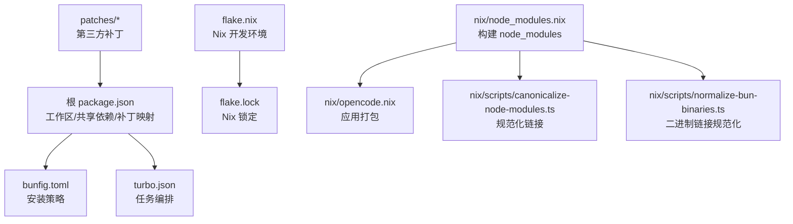
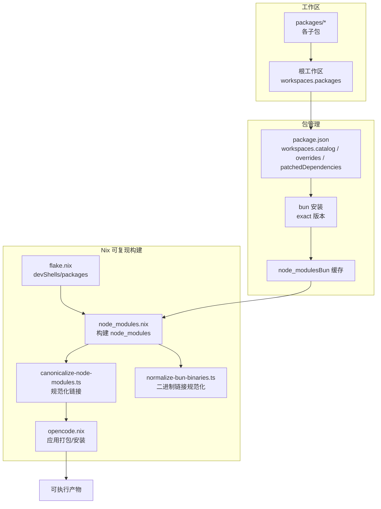
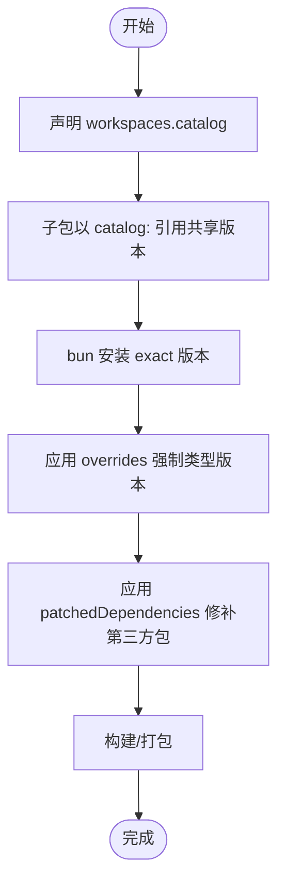
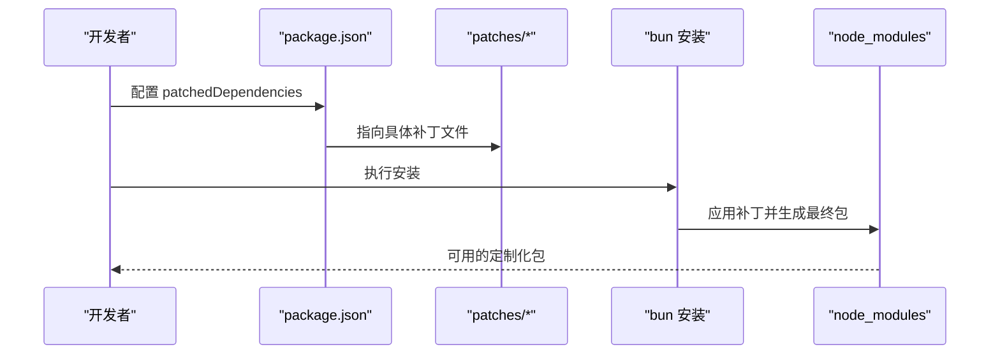
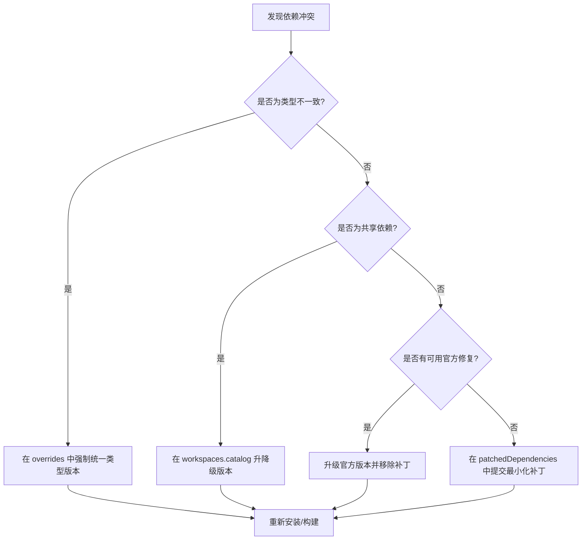
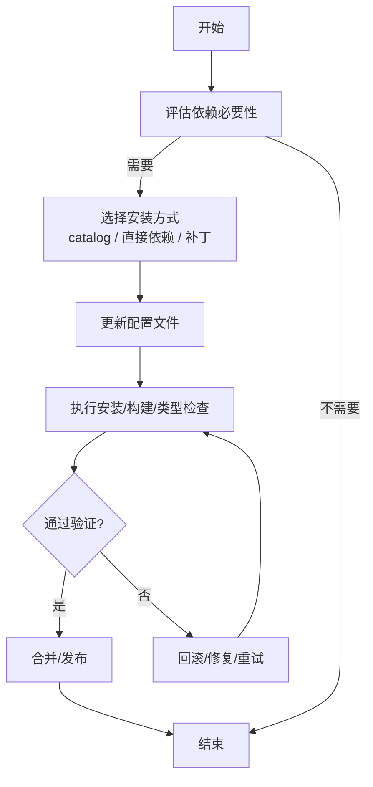
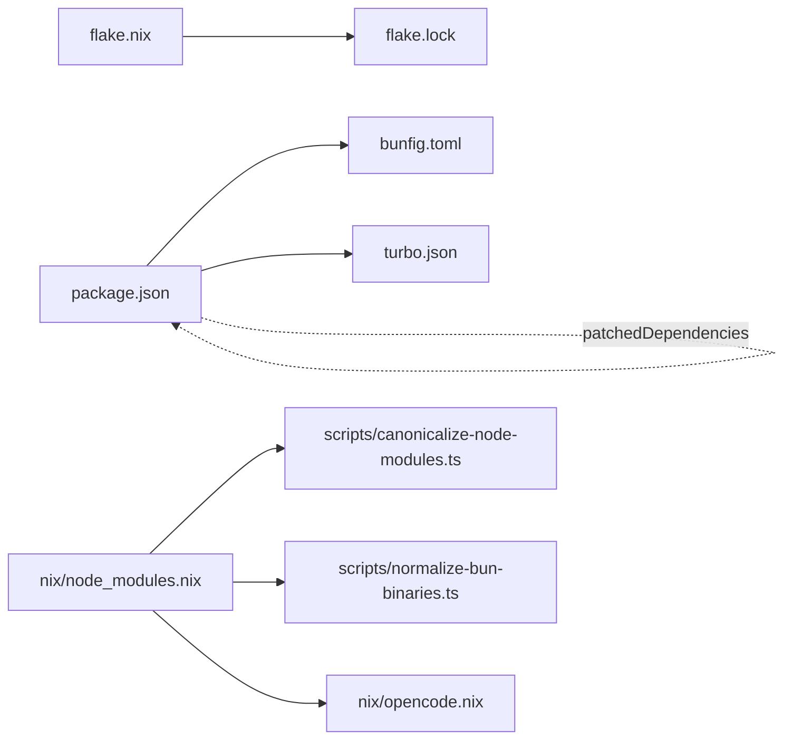

# 依赖管理

<cite>
**本文引用的文件**
- [package.json](file://package.json)
- [bunfig.toml](file://bunfig.toml)
- [turbo.json](file://turbo.json)
- [flake.nix](file://flake.nix)
- [flake.lock](file://flake.lock)
- [node_modules.nix](file://nix/node_modules.nix)
- [opencode.nix](file://nix/opencode.nix)
- [@openrouter%2Fai-sdk-provider@1.5.4.patch](file://patches/@openrouter%2Fai-sdk-provider@1.5.4.patch)
- [@standard-community%2Fstandard-openapi@0.2.9.patch](file://patches/@standard-community%2Fstandard-openapi@0.2.9.patch)
- [canonicalize-node-modules.ts](file://nix/scripts/canonicalize-node-modules.ts)
- [normalize-bun-binaries.ts](file://nix/scripts/normalize-bun-binaries.ts)
</cite>

## 目录
1. [引言](#引言)
2. [项目结构](#项目结构)
3. [核心组件](#核心组件)
4. [架构总览](#架构总览)
5. [详细组件分析](#详细组件分析)
6. [依赖关系分析](#依赖关系分析)
7. [性能考量](#性能考量)
8. [故障排查指南](#故障排查指南)
9. [结论](#结论)
10. [附录](#附录)

## 引言
本文件系统性阐述 OpenCode 的依赖管理体系与版本控制策略，覆盖工作空间依赖、共享依赖与第三方依赖的管理方式；解释 Patches 机制及其对第三方包的定制化修改；说明依赖冲突解决、版本锁定与升级策略；并给出依赖安全扫描、许可证管理与供应链安全的最佳实践，以及新依赖添加与废弃依赖清理的标准操作流程。

## 项目结构
OpenCode 采用多包工作区（monorepo）组织，根级使用 Bun 作为包管理器与运行时，结合 Nix 提供可复现的构建环境与依赖锁定。关键配置文件如下：
- 根级 package.json：定义工作区、共享依赖目录（catalog）、开发依赖、类型覆盖与补丁映射等
- bunfig.toml：安装行为（如精确版本）与测试根路径等
- turbo.json：缓存与任务编排（如 typecheck、build）
- flake.nix/flake.lock：Nix 开发环境与依赖锁定
- nix/*.nix：可复现构建 node_modules、规范化二进制链接等
- patches/*：对第三方发布包进行定制化修补

**图示来源**
- [package.json](file://package.json)
- [bunfig.toml](file://bunfig.toml)
- [turbo.json](file://turbo.json)
- [flake.nix](file://flake.nix)
- [flake.lock](file://flake.lock)
- [node_modules.nix](file://nix/node_modules.nix)
- [opencode.nix](file://nix/opencode.nix)
- [canonicalize-node-modules.ts](file://nix/scripts/canonicalize-node-modules.ts)
- [normalize-bun-binaries.ts](file://nix/scripts/normalize-bun-binaries.ts)

**章节来源**
- [package.json](file://package.json)
- [bunfig.toml](file://bunfig.toml)
- [turbo.json](file://turbo.json)
- [flake.nix](file://flake.nix)
- [flake.lock](file://flake.lock)

## 核心组件
- 工作区与共享依赖（Catalog）
  - 根 package.json 的 workspaces.catalog 定义了跨包共享的依赖版本，便于统一升级与一致性约束
  - 通过 catalog: 前缀引用共享版本，减少重复声明与漂移
- 依赖覆盖（Overrides）
  - overrides 字段用于对特定包（如 @types/bun、@types/node）强制使用 catalog 版本，避免类型不一致
- 补丁（Patched Dependencies）
  - patchedDependencies 映射第三方包与其补丁文件路径，实现对发布包的最小化定制
- 安装策略
  - bunfig.toml 设置 exact = true，确保安装精确版本，降低运行时差异
- 构建与缓存
  - turbo.json 定义 typecheck、build 等任务的依赖与输出，提升增量构建效率

**章节来源**
- [package.json](file://package.json)
- [bunfig.toml](file://bunfig.toml)
- [turbo.json](file://turbo.json)

## 架构总览
下图展示了从工作区到构建与运行的整体依赖流：

**图示来源**
- [package.json](file://package.json)
- [node_modules.nix](file://nix/node_modules.nix)
- [opencode.nix](file://nix/opencode.nix)
- [canonicalize-node-modules.ts](file://nix/scripts/canonicalize-node-modules.ts)
- [normalize-bun-binaries.ts](file://nix/scripts/normalize-bun-binaries.ts)
- [flake.nix](file://flake.nix)

## 详细组件分析

### 工作空间依赖、共享依赖与第三方依赖
- 工作空间依赖
  - 通过 workspaces.packages 声明所有子包，使各包间可通过 workspace:* 引用彼此，避免重复安装与版本漂移
- 共享依赖（Catalog）
  - workspaces.catalog 统一声明常用依赖版本，子包以 catalog: 前缀引用，确保全仓库一致
- 第三方依赖
  - 通过 dependencies/devDependencies 声明外部包，配合 overrides 与 patchedDependencies 实现覆盖与定制

**图示来源**
- [package.json](file://package.json)
- [bunfig.toml](file://bunfig.toml)

**章节来源**
- [package.json](file://package.json)
- [bunfig.toml](file://bunfig.toml)

### Patches 机制：作用与使用场景
- 作用
  - 对第三方发布包进行最小化、可追踪的定制，避免 fork 或本地复制源码
- 使用场景
  - 修复第三方包中的缺陷（如 JSON Schema 处理逻辑）
  - 扩展功能（如为推理结果注入 providerMetadata）
- 文件与映射
  - patches/* 下存放具体补丁文件
  - package.json 的 patchedDependencies 将包名与补丁路径关联
- 示例
  - 对 @standard-community/standard-openapi 的 JSON Schema 转换逻辑进行修正
  - 对 @openrouter/ai-sdk-provider 注入推理元数据字段

**图示来源**
- [package.json](file://package.json)
- [@standard-community%2Fstandard-openapi@0.2.9.patch](file://patches/@standard-community%2Fstandard-openapi@0.2.9.patch)
- [@openrouter%2Fai-sdk-provider@1.5.4.patch](file://patches/@openrouter%2Fai-sdk-provider@1.5.4.patch)

**章节来源**
- [package.json](file://package.json)
- [@standard-community%2Fstandard-openapi@0.2.9.patch](file://patches/@standard-community%2Fstandard-openapi@0.2.9.patch)
- [@openrouter%2Fai-sdk-provider@1.5.4.patch](file://patches/@openrouter%2Fai-sdk-provider@1.5.4.patch)

### 依赖冲突解决、版本锁定与升级策略
- 冲突解决
  - 通过 overrides 强制类型版本，避免不同包引入的类型不兼容
  - 通过 catalog 统一版本，减少多版本并存导致的冲突
- 版本锁定
  - Bun 安装 exact=true，确保每次安装精确版本
  - Nix 层面通过 node_modules.nix 的输出哈希锁定，保证可复现构建
- 升级策略
  - 优先在 workspaces.catalog 中调整版本，批量影响所有子包
  - 对第三方包使用 patchedDependencies 逐步迁移至官方修复版本

**图示来源**
- [package.json](file://package.json)
- [bunfig.toml](file://bunfig.toml)
- [node_modules.nix](file://nix/node_modules.nix)

**章节来源**
- [package.json](file://package.json)
- [bunfig.toml](file://bunfig.toml)
- [node_modules.nix](file://nix/node_modules.nix)

### 依赖安全扫描、许可证管理与供应链安全
- 安全扫描
  - 在 CI 中集成安全扫描工具，对 node_modules 进行漏洞检测
  - 结合 Nix 构建的不可变性，减少供应链污染风险
- 许可证管理
  - 在根 package.json 中声明许可证信息，确保合规
  - 对第三方包的许可证进行审查与记录，建立清单
- 供应链安全
  - 使用 exact 安装与 Nix 输出哈希锁定，降低中间环节篡改风险
  - 对 trustedDependencies 进行白名单管理，限制高风险二进制

**章节来源**
- [package.json](file://package.json)

### 新依赖添加流程与废弃依赖清理标准操作
- 添加新依赖（以 catalog 为例）
  1) 在 workspaces.catalog 中声明版本
  2) 在目标子包中以 catalog: 前缀引用
  3) 执行安装并验证
  4) 如需类型，通过 overrides 强制类型版本
- 添加第三方补丁
  1) 在 patches/* 创建补丁文件
  2) 在 patchedDependencies 中映射包名与补丁路径
  3) 执行安装并验证
- 清理废弃依赖
  1) 在子包中移除引用
  2) 在 workspaces.catalog 中移除条目（如不再被任何包使用）
  3) 在 overrides 与 patchedDependencies 中清理相关项
  4) 执行安装并运行类型检查与构建

**图示来源**
- [package.json](file://package.json)
- [bunfig.toml](file://bunfig.toml)

**章节来源**
- [package.json](file://package.json)
- [bunfig.toml](file://bunfig.toml)

## 依赖关系分析
- 包管理器与锁
  - Bun 管理工作区内包与第三方依赖，bunfig.toml 精确安装策略
  - flake.nix/flake.lock 管理 Nix 输入与锁定
- Nix 构建管线
  - node_modules.nix 负责构建 node_modules 并输出哈希锁定
  - canonicalize-node-modules.ts 与 normalize-bun-binaries.ts 规范化链接与二进制入口，提升可移植性
- 任务编排
  - turbo.json 定义任务依赖与输出，加速增量构建

**图示来源**
- [package.json](file://package.json)
- [bunfig.toml](file://bunfig.toml)
- [turbo.json](file://turbo.json)
- [flake.nix](file://flake.nix)
- [flake.lock](file://flake.lock)
- [node_modules.nix](file://nix/node_modules.nix)
- [opencode.nix](file://nix/opencode.nix)
- [canonicalize-node-modules.ts](file://nix/scripts/canonicalize-node-modules.ts)
- [normalize-bun-binaries.ts](file://nix/scripts/normalize-bun-binaries.ts)

**章节来源**
- [package.json](file://package.json)
- [bunfig.toml](file://bunfig.toml)
- [turbo.json](file://turbo.json)
- [flake.nix](file://flake.nix)
- [flake.lock](file://flake.lock)
- [node_modules.nix](file://nix/node_modules.nix)
- [opencode.nix](file://nix/opencode.nix)
- [canonicalize-node-modules.ts](file://nix/scripts/canonicalize-node-modules.ts)
- [normalize-bun-binaries.ts](file://nix/scripts/normalize-bun-binaries.ts)

## 性能考量
- 安装与缓存
  - exact 安装减少运行时差异，提升稳定性
  - turbo 的任务依赖与输出缓存提升增量构建效率
- Nix 可复现性
  - 输出哈希锁定避免重复构建，提高可预测性
- 二进制与链接规范化
  - canonicalize 与 normalize 降低跨平台差异带来的额外开销

**章节来源**
- [bunfig.toml](file://bunfig.toml)
- [turbo.json](file://turbo.json)
- [node_modules.nix](file://nix/node_modules.nix)
- [canonicalize-node-modules.ts](file://nix/scripts/canonicalize-node-modules.ts)
- [normalize-bun-binaries.ts](file://nix/scripts/normalize-bun-binaries.ts)

## 故障排查指南
- 安装失败
  - 检查 patchedDependencies 是否指向有效补丁文件
  - 确认 overrides 与 catalog 版本兼容
- 类型不一致
  - 使用 overrides 强制统一类型版本
  - 在 workspaces.catalog 中核对共享版本
- Nix 构建异常
  - 检查 node_modules.nix 的输出哈希是否与 flake.lock 一致
  - 运行 canonicalize 与 normalize 脚本以修复链接
- 二进制不可用
  - 确认 normalize-bun-binaries.ts 已正确生成 .bin 符号链接

**章节来源**
- [package.json](file://package.json)
- [node_modules.nix](file://nix/node_modules.nix)
- [canonicalize-node-modules.ts](file://nix/scripts/canonicalize-node-modules.ts)
- [normalize-bun-binaries.ts](file://nix/scripts/normalize-bun-binaries.ts)

## 结论
OpenCode 的依赖管理以 Bun 为核心，结合 Nix 的可复现构建与严格的版本锁定策略，辅以 workspaces.catalog、overrides 与 patchedDependencies，形成从工作区到第三方包的完整治理闭环。通过补丁机制实现最小化定制，通过安全扫描与许可证管理强化供应链安全，通过标准化流程保障新增与清理的可控性与可追溯性。

## 附录
- 关键配置要点速览
  - workspaces.catalog：统一共享依赖版本
  - overrides：强制类型版本
  - patchedDependencies：第三方包补丁映射
  - exact 安装：精确版本锁定
  - Nix 输出哈希：可复现构建