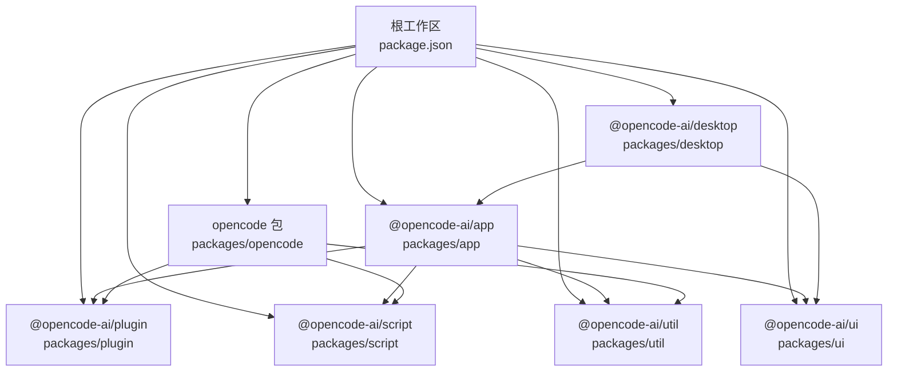
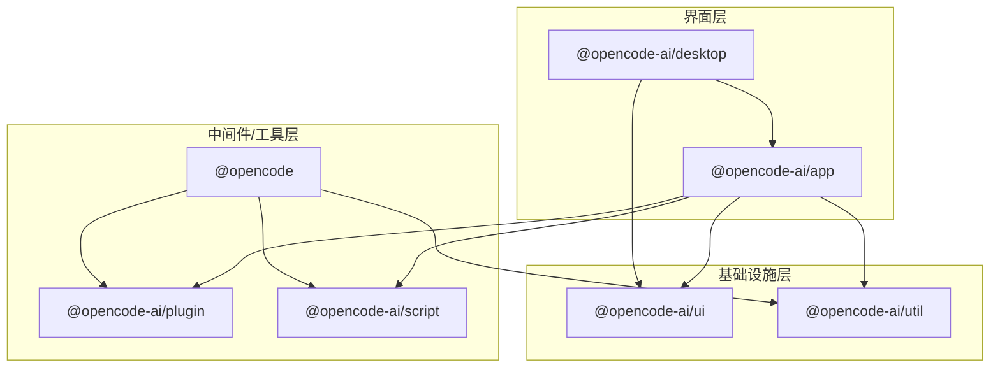
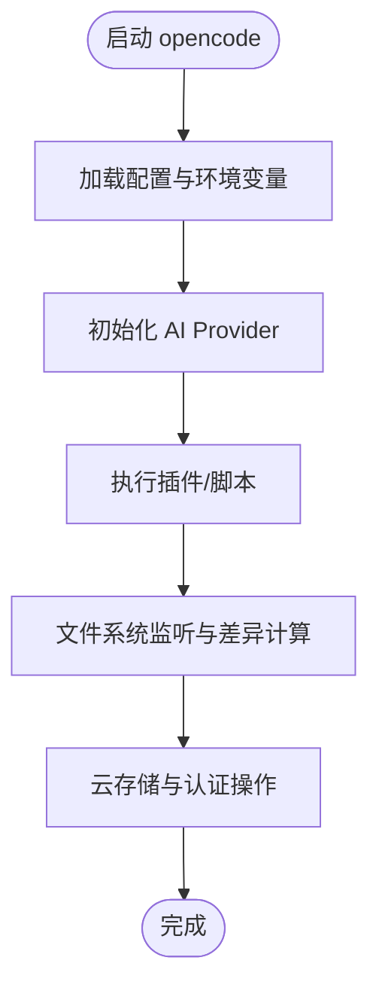
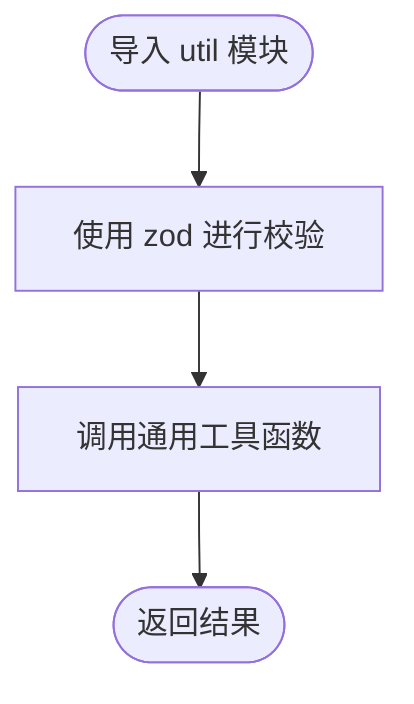
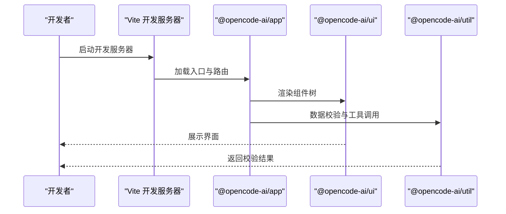
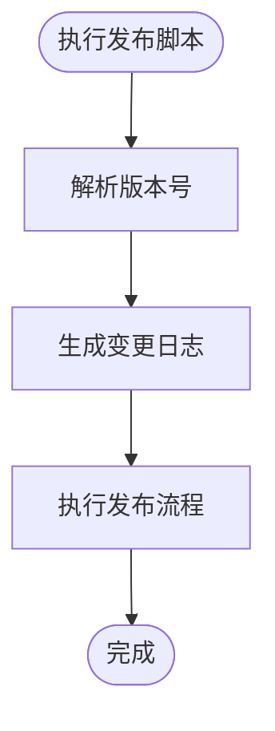
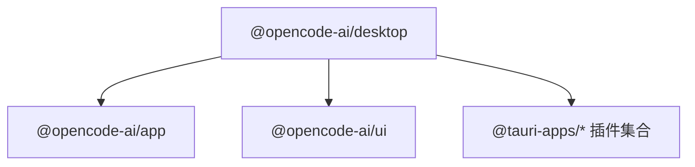
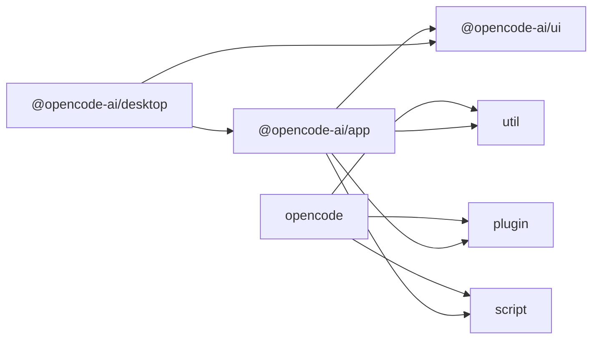

# 包组织结构

<cite>
**本文引用的文件**
- [package.json](file://package.json)
- [turbo.json](file://turbo.json)
- [packages/opencode/package.json](file://packages/opencode/package.json)
- [packages/ui/package.json](file://packages/ui/package.json)
- [packages/util/package.json](file://packages/util/package.json)
- [packages/app/package.json](file://packages/app/package.json)
- [packages/plugin/package.json](file://packages/plugin/package.json)
- [packages/script/package.json](file://packages/script/package.json)
- [packages/desktop/package.json](file://packages/desktop/package.json)
</cite>

## 目录
1. [简介](#简介)
2. [项目结构](#项目结构)
3. [核心组件](#核心组件)
4. [架构总览](#架构总览)
5. [详细组件分析](#详细组件分析)
6. [依赖分析](#依赖分析)
7. [性能考虑](#性能考虑)
8. [故障排除指南](#故障排除指南)
9. [结论](#结论)
10. [附录](#附录)

## 简介
本文件系统性梳理 OpenCode 项目在 packages 目录下的包组织结构与功能划分，重点阐述核心包（opencode、ui、util 等）的职责边界、功能定位与使用场景；解释包之间的依赖关系与通信机制；给出包开发的命名约定、目录结构规范与模块导出策略，并提供新包创建流程、包发布与版本管理的最佳实践。

## 项目结构
OpenCode 采用 monorepo 结构，根目录通过工作区配置统一管理多个子包。packages 目录下包含前端应用、桌面端、UI 组件库、工具库、插件体系、脚本工具、SDK、文档与企业级扩展等模块。根 package.json 的 workspaces 字段声明了受管包范围，turbo.json 提供构建与类型检查任务的流水线配置。



图表来源
- [package.json:21-27](file://package.json#L21-L27)
- [turbo.json:5-19](file://turbo.json#L5-L19)
- [packages/app/package.json:6-10](file://packages/app/package.json#L6-L10)
- [packages/opencode/package.json:25-27](file://packages/opencode/package.json#L25-L27)
- [packages/ui/package.json:6-25](file://packages/ui/package.json#L6-L25)
- [packages/util/package.json:7-9](file://packages/util/package.json#L7-L9)
- [packages/plugin/package.json:11-14](file://packages/plugin/package.json#L11-L14)
- [packages/script/package.json:12-14](file://packages/script/package.json#L12-L14)
- [packages/desktop/package.json:15-35](file://packages/desktop/package.json#L15-L35)

章节来源
- [package.json:21-27](file://package.json#L21-L27)
- [turbo.json:5-19](file://turbo.json#L5-L19)

## 核心组件
本节聚焦核心包的职责边界、功能定位与使用场景：

- opencode 包
  - 职责边界：作为 CLI 与核心能力载体，提供命令行入口、AI 服务集成、工作流编排与工具链协调。其 exports 配置允许按需导出模块，便于被上层应用或工具消费。
  - 功能定位：CLI 工具、AI Provider 集成、脚本与插件运行时、内部工具集。
  - 使用场景：本地开发调试、自动化脚本执行、跨平台工具链调用。
  - 关键特性：多 AI Provider 支持、云存储与认证集成、事件与日志处理、文件系统监听与差异计算。

- ui 包
  - 职责边界：提供可复用的 UI 组件、主题系统、国际化资源与样式导出，形成统一的视觉与交互语言。
  - 功能定位：组件库、主题上下文、图标类型定义、样式与字体资源。
  - 使用场景：Web 应用与桌面端界面构建、跨平台一致的用户体验。
  - 关键特性：Solid 生态集成、Tailwind 扩展、数学公式渲染、语法高亮与文档渲染。

- util 包
  - 职责边界：提供通用工具函数与数据校验（基于 zod），作为各包的“基础设施”。
  - 功能定位：数据校验、类型辅助、通用算法与工具方法。
  - 使用场景：所有需要数据校验与通用逻辑的模块。
  - 关键特性：轻量、纯函数式、与 zod 协同。

- app 包
  - 职责边界：前端应用入口与页面编排，整合 UI、SDK、工具与测试框架。
  - 功能定位：Vite 开发服务器、单元与端到端测试、路由与状态管理。
  - 使用场景：Web 前端开发与预览、本地调试与质量保障。
  - 关键特性：Solid Router、I18n、媒体与 WebSocket 原语、Tailwind 样式。

- plugin 包
  - 职责边界：定义插件接口与工具抽象，为外部扩展提供稳定契约。
  - 功能定位：插件索引导出、工具类型定义。
  - 使用场景：扩展生态、第三方工具接入。
  - 关键特性：与 SDK 协作、Zod 类型约束。

- script 包
  - 职责边界：提供版本管理、变更日志生成、发布与统计脚本等运维工具。
  - 功能定位：版本号解析与比较、变更记录生成、发布流程支持。
  - 使用场景：CI/CD 流水线、自动化发布。
  - 关键特性：语义化版本（semver）集成。

- desktop 包
  - 职责边界：桌面端应用（Tauri）的前端层，封装系统能力与窗口状态。
  - 功能定位：系统插件集成（剪贴板、对话框、HTTP、窗口状态等）、与 Web 应用共享 UI。
  - 使用场景：跨平台桌面应用开发与分发。
  - 关键特性：与 @opencode-ai/app 共享组件与主题。

章节来源
- [packages/opencode/package.json:1-146](file://packages/opencode/package.json#L1-L146)
- [packages/ui/package.json:1-74](file://packages/ui/package.json#L1-L74)
- [packages/util/package.json:1-21](file://packages/util/package.json#L1-L21)
- [packages/app/package.json:1-74](file://packages/app/package.json#L1-L74)
- [packages/plugin/package.json:1-29](file://packages/plugin/package.json#L1-L29)
- [packages/script/package.json:1-16](file://packages/script/package.json#L1-L16)
- [packages/desktop/package.json:1-45](file://packages/desktop/package.json#L1-L45)

## 架构总览
从整体上看，OpenCode 的包组织遵循“上层应用 + 中间件工具 + 基础设施”的分层设计。app 与 desktop 作为用户界面层，依赖 ui 与 util；opencode 作为核心工具层，向下对接 plugin 与 script，并向上为上层应用提供能力；sdk 与各业务包（如 slack、smartx-workflow）作为扩展层存在。



图表来源
- [packages/app/package.json:40-72](file://packages/app/package.json#L40-L72)
- [packages/desktop/package.json:15-35](file://packages/desktop/package.json#L15-L35)
- [packages/opencode/package.json:58-141](file://packages/opencode/package.json#L58-L141)
- [packages/plugin/package.json:18-21](file://packages/plugin/package.json#L18-L21)
- [packages/script/package.json:5-7](file://packages/script/package.json#L5-L7)
- [packages/ui/package.json:44-72](file://packages/ui/package.json#L44-L72)
- [packages/util/package.json:13-15](file://packages/util/package.json#L13-L15)

## 详细组件分析

### opencode 包
- 设计理念：以 CLI 与工具集为核心，提供统一的命令行入口与能力编排，向下连接插件与脚本，向上为应用与桌面端提供能力。
- 架构作用：集中管理 AI Provider、云存储与认证、事件与日志、文件系统监听与差异计算等。
- 模块导出策略：通过通配符导出 src 下的模块，便于按需引入。
- 依赖关系：依赖 plugin、script、util，以及大量 AI 与云服务 SDK。



图表来源
- [packages/opencode/package.json:25-27](file://packages/opencode/package.json#L25-L27)
- [packages/opencode/package.json:58-141](file://packages/opencode/package.json#L58-L141)

章节来源
- [packages/opencode/package.json:1-146](file://packages/opencode/package.json#L1-L146)

### ui 包
- 设计理念：以 Solid 为基础，提供可组合的 UI 组件与主题系统，强调可访问性与一致性。
- 架构作用：为 app 与 desktop 提供统一的视觉与交互基础，内置 Tailwind、图标与国际化资源。
- 模块导出策略：按组件、hooks、context、theme、样式与资源进行细粒度导出，便于按需引入。
- 依赖关系：依赖 sdk、util 与大量生态库（如 @kobalte/core、marked、shiki 等）。

```mermaid
classDiagram
class UIExports {
"+组件导出"
"+Hooks 导出"
"+Context 导出"
"+Theme 导出"
"+样式与资源导出"
}
class Dependencies {
"@opencode-ai/sdk"
"@opencode-ai/util"
"Solid 生态"
"Tailwind/Motion"
}
UIExports --> Dependencies : "依赖"
```

图表来源
- [packages/ui/package.json:6-25](file://packages/ui/package.json#L6-L25)
- [packages/ui/package.json:44-72](file://packages/ui/package.json#L44-L72)

章节来源
- [packages/ui/package.json:1-74](file://packages/ui/package.json#L1-L74)

### util 包
- 设计理念：提供最小可用的工具集与数据校验能力，避免在业务层重复实现。
- 架构作用：为各包提供类型安全的数据校验与通用工具函数。
- 模块导出策略：通配符导出 src 下的工具模块，保持简单清晰。
- 依赖关系：主要依赖 zod，用于类型推断与运行时校验。



图表来源
- [packages/util/package.json:7-9](file://packages/util/package.json#L7-L9)
- [packages/util/package.json:13-15](file://packages/util/package.json#L13-L15)

章节来源
- [packages/util/package.json:1-21](file://packages/util/package.json#L1-L21)

### app 包
- 设计理念：以 Vite 为开发与构建工具，结合 Solid Router 与 I18n，提供完整的前端开发体验。
- 架构作用：作为 Web 应用入口，整合 UI、SDK、工具与测试框架。
- 模块导出策略：导出入口、Vite 插件与样式文件，便于上层应用快速接入。
- 依赖关系：依赖 ui、util、plugin、script 以及大量生态库。



图表来源
- [packages/app/package.json:6-10](file://packages/app/package.json#L6-L10)
- [packages/app/package.json:40-72](file://packages/app/package.json#L40-L72)
- [packages/ui/package.json:44-72](file://packages/ui/package.json#L44-L72)
- [packages/util/package.json:13-15](file://packages/util/package.json#L13-L15)

章节来源
- [packages/app/package.json:1-74](file://packages/app/package.json#L1-L74)

### plugin 包
- 设计理念：通过明确的导出点（如工具）定义插件生态的契约，降低耦合。
- 架构作用：为扩展提供稳定的接口与类型定义。
- 模块导出策略：导出插件入口与工具模块，便于外部消费。
- 依赖关系：依赖 sdk 与 zod，确保类型安全与协议一致性。

```mermaid
classDiagram
class PluginIndex {
"+导出插件入口"
"+导出工具模块"
}
class SDK {
"+提供 SDK 接口"
}
PluginIndex --> SDK : "依赖"
```

图表来源
- [packages/plugin/package.json:11-14](file://packages/plugin/package.json#L11-L14)
- [packages/plugin/package.json:18-21](file://packages/plugin/package.json#L18-L21)

章节来源
- [packages/plugin/package.json:1-29](file://packages/plugin/package.json#L1-L29)

### script 包
- 设计理念：提供版本管理、变更日志与发布相关的脚本工具，支撑 CI/CD 自动化。
- 架构作用：为版本控制与发布流程提供标准化工具。
- 模块导出策略：导出脚本入口，便于在其他包中复用。
- 依赖关系：依赖 semver，确保版本解析与比较的准确性。



图表来源
- [packages/script/package.json:12-14](file://packages/script/package.json#L12-L14)
- [packages/script/package.json:5-7](file://packages/script/package.json#L5-L7)

章节来源
- [packages/script/package.json:1-16](file://packages/script/package.json#L1-L16)

### desktop 包
- 设计理念：基于 Tauri 的桌面端应用，复用 Web 应用的 UI 与逻辑，扩展系统能力。
- 架构作用：封装系统插件（剪贴板、对话框、HTTP、窗口状态等），并与 Web 应用共享 UI。
- 模块导出策略：导出入口与相关脚本，便于开发与构建。
- 依赖关系：依赖 app、ui 与大量 Tauri 插件。



图表来源
- [packages/desktop/package.json:15-35](file://packages/desktop/package.json#L15-L35)

章节来源
- [packages/desktop/package.json:1-45](file://packages/desktop/package.json#L1-L45)

## 依赖分析
- 工作区与任务编排
  - 根 package.json 的 workspaces 定义了受管包范围，确保各包在 monorepo 内部相互引用。
  - turbo.json 定义了 typecheck、build 等任务的依赖关系与输出目录，保证构建顺序与缓存命中。
- 包间依赖
  - app 依赖 ui、util、plugin、script，体现“界面层”对“基础设施层”的依赖。
  - opencode 依赖 plugin、script、util，体现“工具层”对“基础设施层”的依赖。
  - desktop 依赖 app、ui，体现桌面端对 Web 应用的复用。
- 外部依赖
  - opencode 依赖大量 AI Provider 与云服务 SDK，体现其作为“工具中枢”的定位。
  - ui 依赖 Solid 生态与 Tailwind/Motion，体现其作为“组件库”的定位。
  - util 依赖 zod，体现其作为“基础设施”的定位。



图表来源
- [package.json:21-27](file://package.json#L21-L27)
- [turbo.json:5-19](file://turbo.json#L5-L19)
- [packages/opencode/package.json:58-141](file://packages/opencode/package.json#L58-L141)
- [packages/app/package.json:40-72](file://packages/app/package.json#L40-L72)
- [packages/desktop/package.json:15-35](file://packages/desktop/package.json#L15-L35)

章节来源
- [package.json:21-27](file://package.json#L21-L27)
- [turbo.json:5-19](file://turbo.json#L5-L19)

## 性能考虑
- 构建与缓存
  - 利用 turbo 的任务依赖与输出目录配置，减少重复构建，提升开发效率。
- 模块导出与按需加载
  - ui 与 app 采用细粒度导出策略，有助于 Tree Shaking 与按需加载，降低首屏体积。
- 依赖精简
  - 将通用逻辑下沉至 util，避免重复实现；将 UI 逻辑下沉至 ui，避免重复渲染与样式冲突。
- 文件系统监听
  - opencode 对文件系统进行监听与差异计算，建议在大型项目中合理设置监听范围与忽略规则，避免不必要的 IO 压力。

## 故障排除指南
- 类型检查失败
  - 确认各包的 typecheck 脚本是否正确执行；检查 turbo.json 中的任务依赖是否完整。
- 构建产物缺失
  - 检查各包的 exports 与 files 字段，确保构建产物被正确打包与导出。
- 版本不一致
  - 使用 script 包提供的版本管理工具，确保各包版本同步；在 CI 中强制执行版本校验。
- 桌面端插件问题
  - 检查 Tauri 插件的版本与权限配置；确认与 app/ui 的兼容性。

章节来源
- [turbo.json:5-19](file://turbo.json#L5-L19)
- [packages/script/package.json:12-14](file://packages/script/package.json#L12-L14)
- [packages/desktop/package.json:15-35](file://packages/desktop/package.json#L15-L35)

## 结论
OpenCode 的包组织以“界面层（app/desktop）—工具层（opencode）—基础设施层（ui/util）”的分层设计为核心，配合细粒度的模块导出与严格的版本管理，实现了高内聚、低耦合与可扩展的架构。通过统一的工作区与任务编排，项目在开发效率、构建稳定性与发布自动化方面具备良好基础。

## 附录

### 包开发命名约定
- 包名前缀：统一使用 @opencode-ai/ 前缀，区分官方包与第三方依赖。
- 包名风格：采用 kebab-case，如 @opencode-ai/ui、@opencode-ai/util。
- 子包命名：与功能相关，如 @opencode-ai/plugin、@opencode-ai/script。

### 目录结构规范
- 源码目录：src 目录存放 TypeScript 源码，按功能模块拆分。
- 资源目录：assets、i18n、styles 等资源按类别组织，便于维护。
- 构建产物：dist 目录存放编译后的产物，遵循各包的导出策略。

### 模块导出策略
- 细粒度导出：ui 包按组件、hooks、context、theme、样式与资源分别导出，便于按需引入。
- 通配符导出：util 与 opencode 采用通配符导出 src 下的模块，保持简单清晰。
- 入口导出：app 与 desktop 导出入口、Vite 插件与样式文件，便于快速接入。

### 新包创建流程
- 初始化：创建包目录与 package.json，设置 name、version、type、license 等字段。
- 规划导出：根据功能选择细粒度导出或通配符导出，明确入口与资源导出路径。
- 添加依赖：在 dependencies 或 devDependencies 中声明所需依赖，必要时使用 workspace:* 引用内部包。
- 编写脚本：添加 typecheck、build、dev 等常用脚本，确保与根工作区一致。
- 注册工作区：在根 package.json 的 workspaces 中加入新包路径，确保被纳入管理。

### 包发布与版本管理最佳实践
- 版本同步：使用 script 包中的版本管理工具，确保各包版本一致。
- 变更日志：自动生成变更日志，记录重大改动与破坏性更新。
- 发布流程：在 CI 中执行类型检查、构建与测试，通过后再进行发布。
- 语义化版本：遵循 semver 规范，明确主/次/补丁版本的变更范围。