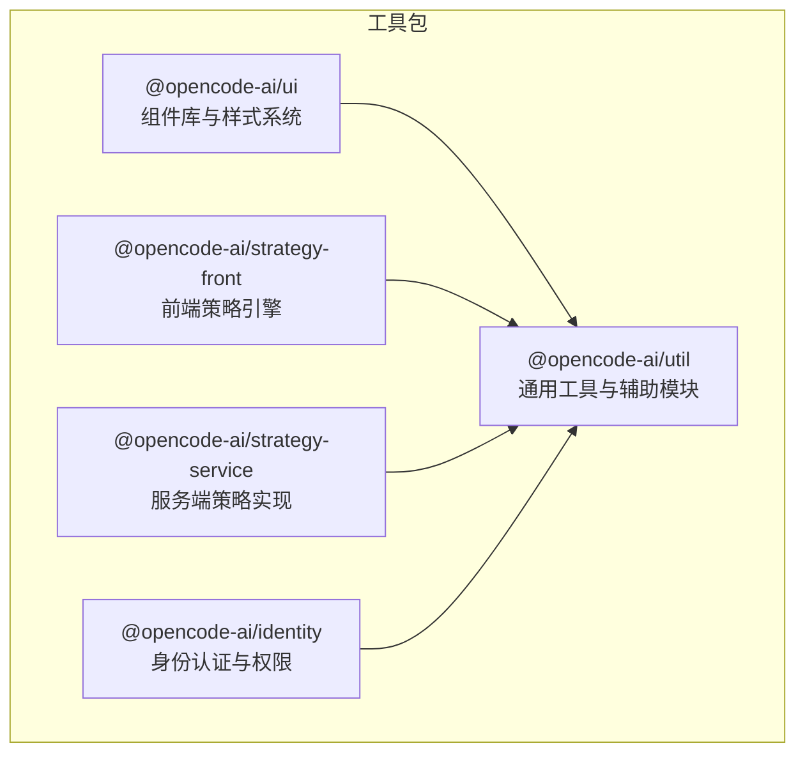
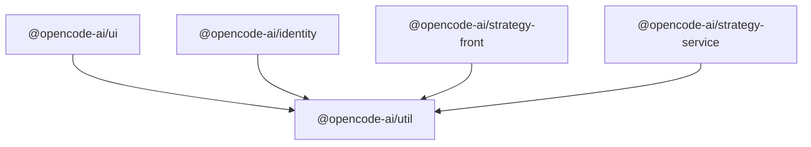
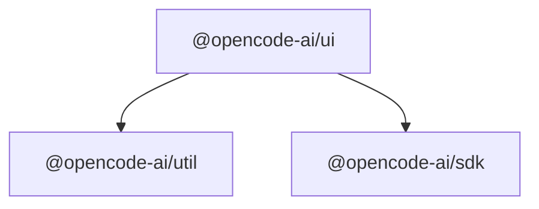
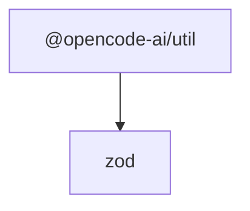
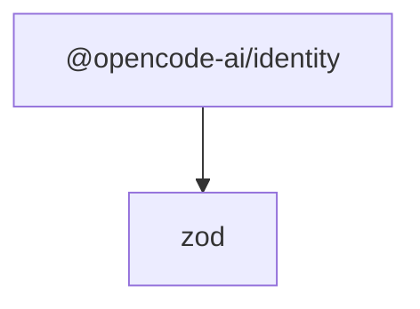
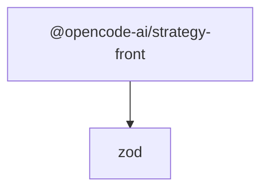

# 工具包

<cite>
**本文引用的文件**
- [packages/ui/package.json](file://packages/ui/package.json)
- [packages/util/package.json](file://packages/util/package.json)
- [packages/strategy-front/package.json](file://packages/strategy-front/package.json)
- [packages/strategy-service/package.json](file://packages/strategy-service/package.json)
- [packages/identity/package.json](file://packages/identity/package.json)
</cite>

## 目录
1. [简介](#简介)
2. [项目结构](#项目结构)
3. [核心组件](#核心组件)
4. [架构总览](#架构总览)
5. [详细组件分析](#详细组件分析)
6. [依赖分析](#依赖分析)
7. [性能考虑](#性能考虑)
8. [故障排查指南](#故障排查指南)
9. [结论](#结论)
10. [附录](#附录)

## 简介
本文件系统性梳理 OpenCode 项目中的工具包集合，重点覆盖以下五个工具包：
- ui 包：用户界面组件库与样式系统
- util 包：通用工具函数与辅助模块
- identity 包：身份认证与权限管理
- strategy-front 包：前端策略引擎
- strategy-service 包：服务端策略实现

这些工具包通过清晰的职责划分与模块化设计，为上层应用提供可复用的组件、一致的样式体系、安全的身份控制与灵活的策略执行能力，支撑核心业务功能的快速迭代与稳定运行。

## 项目结构
工具包采用按功能域分包的组织方式，每个包独立维护其导出接口、依赖与构建脚本。下图展示本次文档涉及的五个工具包在工作区中的位置与关系概览：

**图表来源**
- [packages/ui/package.json:1-74](file://packages/ui/package.json#L1-L74)
- [packages/util/package.json:1-21](file://packages/util/package.json#L1-L21)
- [packages/strategy-front/package.json:1-59](file://packages/strategy-front/package.json#L1-L59)
- [packages/strategy-service/package.json:1-59](file://packages/strategy-service/package.json#L1-L59)
- [packages/identity/package.json:1-59](file://packages/identity/package.json#L1-L59)

**章节来源**
- [packages/ui/package.json:1-74](file://packages/ui/package.json#L1-L74)
- [packages/util/package.json:1-21](file://packages/util/package.json#L1-L21)
- [packages/strategy-front/package.json:1-59](file://packages/strategy-front/package.json#L1-L59)
- [packages/strategy-service/package.json:1-59](file://packages/strategy-service/package.json#L1-L59)
- [packages/identity/package.json:1-59](file://packages/identity/package.json#L1-L59)

## 核心组件
- ui 包：提供组件库、主题系统、图标类型定义、国际化资源与样式导出，支持 Tailwind 集成与字体/音频资源访问。
- util 包：提供通用工具函数与辅助模块，作为各工具包的公共基础。
- identity 包：提供身份认证与权限管理相关能力，面向多端统一接入。
- strategy-front 包：提供前端侧策略执行引擎，包含编辑器、状态管理、路由与可视化组件等。
- strategy-service 包：提供服务端侧策略执行能力，面向后端集成与扩展。

以上组件通过明确的导出路径与依赖声明，形成“基础工具（util）—上层能力（ui/identity/strategy-*）”的分层架构。

**章节来源**
- [packages/ui/package.json:6-25](file://packages/ui/package.json#L6-L25)
- [packages/util/package.json:7-9](file://packages/util/package.json#L7-L9)
- [packages/strategy-front/package.json:13-34](file://packages/strategy-front/package.json#L13-L34)
- [packages/strategy-service/package.json:13-34](file://packages/strategy-service/package.json#L13-L34)
- [packages/identity/package.json:13-34](file://packages/identity/package.json#L13-L34)

## 架构总览
下图展示五个工具包之间的依赖关系与交互方向，强调 util 作为公共基础，ui/identity/strategy-* 基于 util 提供各自领域的工具与能力。

**图表来源**
- [packages/ui/package.json:47](file://packages/ui/package.json#L47)
- [packages/util/package.json:13-15](file://packages/util/package.json#L13-L15)
- [packages/strategy-front/package.json:13-34](file://packages/strategy-front/package.json#L13-L34)
- [packages/strategy-service/package.json:13-34](file://packages/strategy-service/package.json#L13-L34)
- [packages/identity/package.json:13-34](file://packages/identity/package.json#L13-L34)

## 详细组件分析

### ui 包：用户界面组件库与样式系统
- 导出结构
  - 组件导出：通过通配符导出组件目录，便于按需引入。
  - 国际化资源：提供 i18n 资源导出，支持多语言。
  - Pierre 工具：提供 prieer 相关导出，便于文本/差异处理等场景。
  - Hooks 与 Context：提供通用 hooks 与上下文导出，便于组件间共享状态。
  - 样式系统：提供全局样式与 Tailwind 扩展样式导出。
  - 主题系统：提供主题定义与上下文导出，支持主题切换与定制。
  - 图标类型：提供 provider-icons、file-type、app-icons 的类型定义，确保图标使用的一致性。
  - 资源导出：提供字体与音频资源的访问路径。
- 依赖关系
  - 依赖 util 包与 SDK 包，作为通用工具与 SDK 能力的基础。
  - 依赖大量 UI/渲染/多媒体相关库，支撑组件库的丰富能力。
- 使用建议
  - 在上层应用中优先通过导出路径引入组件与样式，避免直接引用内部实现细节。
  - 结合主题系统与 Tailwind 扩展，统一风格与交互体验。

**图表来源**
- [packages/ui/package.json:6-25](file://packages/ui/package.json#L6-L25)
- [packages/ui/package.json:47](file://packages/ui/package.json#L47)

**章节来源**
- [packages/ui/package.json:6-25](file://packages/ui/package.json#L6-L25)
- [packages/ui/package.json:44-72](file://packages/ui/package.json#L44-L72)

### util 包：通用工具函数与辅助模块
- 导出结构
  - 通用工具：通过通配符导出 src 下的工具模块，便于按需引入。
- 依赖关系
  - 依赖 zod，用于数据校验与类型约束。
- 使用建议
  - 将跨领域通用逻辑收敛到 util，减少重复实现。
  - 保持工具函数纯函数特性，便于测试与复用。

**图表来源**
- [packages/util/package.json:7-9](file://packages/util/package.json#L7-L9)
- [packages/util/package.json:13-15](file://packages/util/package.json#L13-L15)

**章节来源**
- [packages/util/package.json:7-9](file://packages/util/package.json#L7-L9)
- [packages/util/package.json:13-15](file://packages/util/package.json#L13-L15)

### identity 包：身份认证与权限管理
- 导出结构
  - 依赖声明：包含前端/后端常用依赖，适配多端身份与权限需求。
- 依赖关系
  - 依赖 zod 等库，用于数据校验与类型约束。
- 使用建议
  - 将认证与权限逻辑抽象为可插拔模块，便于在不同环境复用。
  - 与 ui 包的主题与国际化能力结合，提供一致的用户体验。

**图表来源**
- [packages/identity/package.json:13-34](file://packages/identity/package.json#L13-L34)
- [packages/identity/package.json:13-15](file://packages/identity/package.json#L13-L15)

**章节来源**
- [packages/identity/package.json:13-34](file://packages/identity/package.json#L13-L34)
- [packages/identity/package.json:13-15](file://packages/identity/package.json#L13-L15)

### strategy-front 包：前端策略引擎
- 导出结构
  - 依赖声明：包含 React 生态、编辑器、状态管理、路由与可视化等依赖，支撑前端策略执行。
- 依赖关系
  - 依赖 zod 等库，用于数据校验与类型约束。
- 使用建议
  - 将策略规则以可配置的方式注入前端引擎，降低硬编码成本。
  - 结合 Monaco 编辑器与可视化组件，提升策略编写与调试效率。

**图表来源**
- [packages/strategy-front/package.json:13-34](file://packages/strategy-front/package.json#L13-L34)
- [packages/strategy-front/package.json:13-15](file://packages/strategy-front/package.json#L13-L15)

**章节来源**
- [packages/strategy-front/package.json:13-34](file://packages/strategy-front/package.json#L13-L34)
- [packages/strategy-front/package.json:13-15](file://packages/strategy-front/package.json#L13-L15)

### strategy-service 包：服务端策略实现
- 导出结构
  - 依赖声明：包含服务端常用依赖，适配策略规则的后端执行与扩展。
- 依赖关系
  - 依赖 zod 等库，用于数据校验与类型约束。
- 使用建议
  - 将策略规则与执行逻辑解耦，便于在服务端进行集中治理与审计。
  - 与 identity 包结合，确保策略执行的权限一致性。

**图表来源**
- [packages/strategy-service/package.json:13-34](file://packages/strategy-service/package.json#L13-L34)
- [packages/strategy-service/package.json:13-15](file://packages/strategy-service/package.json#L13-L15)

**章节来源**
- [packages/strategy-service/package.json:13-34](file://packages/strategy-service/package.json#L13-L34)
- [packages/strategy-service/package.json:13-15](file://packages/strategy-service/package.json#L13-L15)

## 依赖分析
- 分层依赖
  - util 作为公共基础，被 ui、identity、strategy-front、strategy-service 共同依赖。
  - ui 依赖 util 与 sdk，形成“通用工具—UI 能力—SDK 接入”的链路。
  - identity、strategy-* 依赖 util，形成“通用工具—领域能力”的链路。
- 外部依赖
  - 各包均依赖 zod 进行数据校验与类型约束，保证输入输出的一致性与安全性。
  - ui 包引入大量 UI/渲染/多媒体相关依赖，支撑组件库的丰富能力。
  - strategy-front 包引入 React 生态与编辑器相关依赖，支撑前端策略执行。

**图表来源**
- [packages/ui/package.json:47](file://packages/ui/package.json#L47)
- [packages/util/package.json:13-15](file://packages/util/package.json#L13-L15)
- [packages/strategy-front/package.json:13-34](file://packages/strategy-front/package.json#L13-L34)
- [packages/strategy-service/package.json:13-34](file://packages/strategy-service/package.json#L13-L34)
- [packages/identity/package.json:13-34](file://packages/identity/package.json#L13-L34)

**章节来源**
- [packages/ui/package.json:44-72](file://packages/ui/package.json#L44-L72)
- [packages/util/package.json:13-15](file://packages/util/package.json#L13-L15)
- [packages/strategy-front/package.json:13-34](file://packages/strategy-front/package.json#L13-L34)
- [packages/strategy-service/package.json:13-34](file://packages/strategy-service/package.json#L13-L34)
- [packages/identity/package.json:13-34](file://packages/identity/package.json#L13-L34)

## 性能考虑
- 按需导入：ui 包通过通配符导出组件，建议在上层应用中按需引入组件与样式，避免全量打包导致体积膨胀。
- 样式优化：ui 包提供 Tailwind 扩展样式导出，建议结合工具链进行样式裁剪与摇树优化。
- 数据校验：util 与各包依赖 zod，建议在输入输出处进行严格的数据校验，减少无效计算与异常分支。
- 前端策略：strategy-front 包引入编辑器与可视化组件，建议对策略规则进行缓存与增量更新，降低渲染压力。

## 故障排查指南
- 导出路径问题
  - 若出现无法解析的导出路径，检查各包的 exports 字段是否与实际目录结构一致。
- 依赖缺失
  - 若出现运行时或编译期的依赖错误，确认各包的 dependencies 是否完整，尤其是 util 对 zod 的依赖。
- 样式冲突
  - 若出现样式不生效或冲突，检查 ui 包的样式导出与 Tailwind 配置，确保样式加载顺序正确。
- 权限与认证
  - 若出现身份认证失败或权限异常，检查 identity 包的依赖与配置，确保与后端接口一致。

**章节来源**
- [packages/ui/package.json:6-25](file://packages/ui/package.json#L6-L25)
- [packages/util/package.json:13-15](file://packages/util/package.json#L13-L15)
- [packages/identity/package.json:13-34](file://packages/identity/package.json#L13-L34)

## 结论
OpenCode 的工具包集合通过清晰的分层与职责划分，为上层应用提供了可复用的组件、一致的样式体系、安全的身份控制与灵活的策略执行能力。ui 包负责界面与样式，util 包提供通用工具，identity 包负责身份与权限，strategy-front 与 strategy-service 分别负责前端与服务端策略执行。它们共同构成 OpenCode 的基础设施，支撑核心功能的稳定与高效运行。

## 附录
- 集成指南
  - 在上层应用中，优先通过各包的导出路径引入所需模块，避免直接引用内部实现。
  - 在需要统一风格与主题时，结合 ui 包的主题系统与 Tailwind 扩展。
  - 在需要跨领域复用逻辑时，将通用能力沉淀到 util 包。
  - 在需要身份与权限控制时，结合 identity 包的能力，并与策略引擎协同使用。
  - 在需要前端策略执行时，使用 strategy-front 包；在需要服务端策略执行时，使用 strategy-service 包。