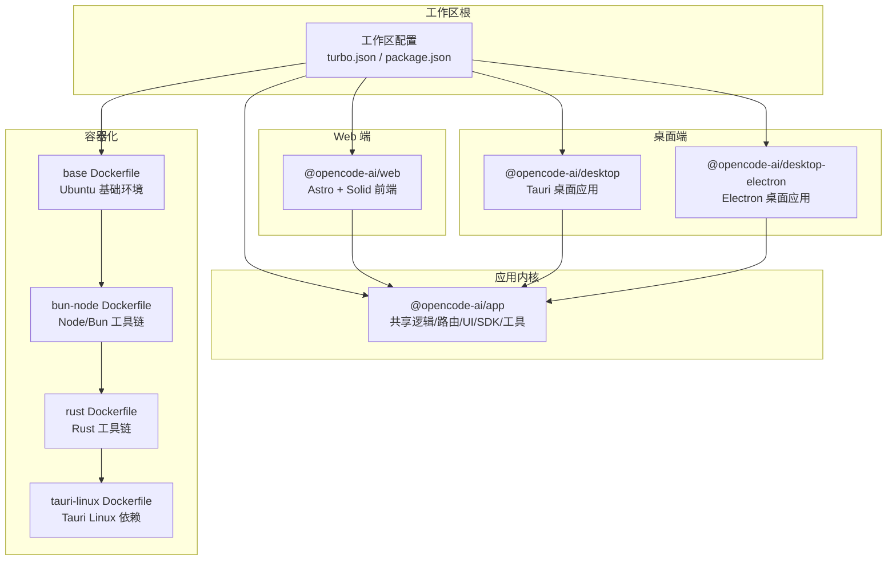
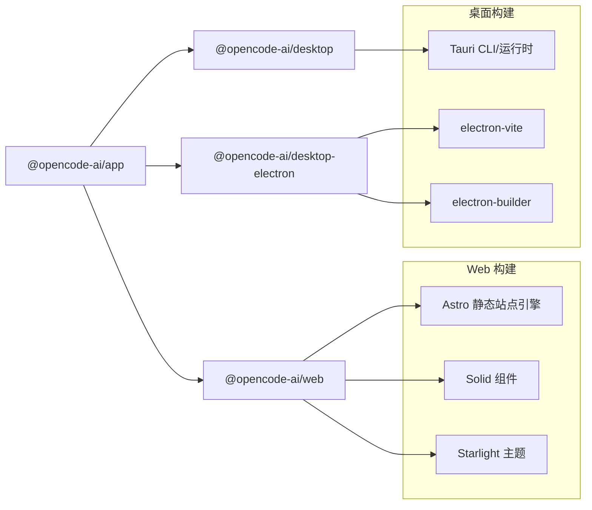
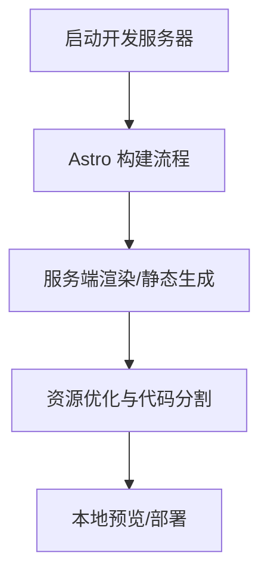
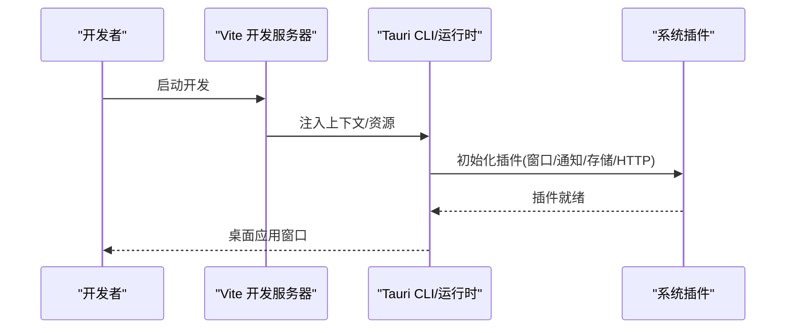
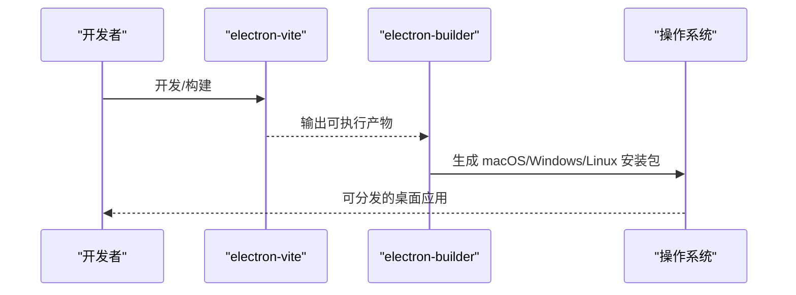
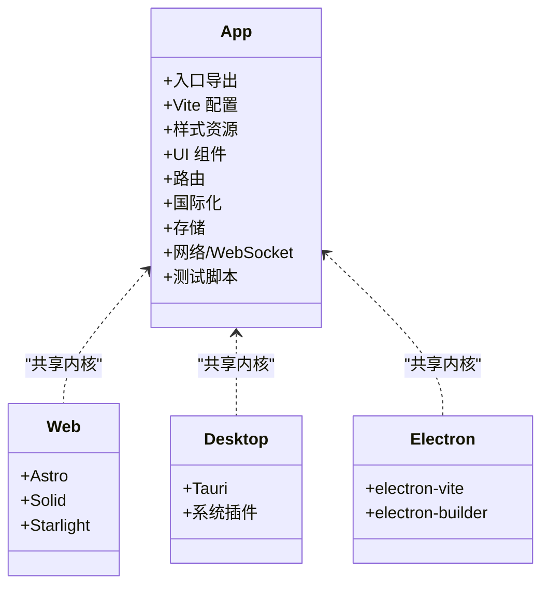
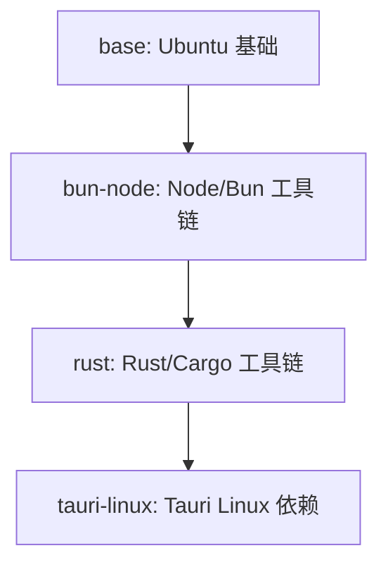
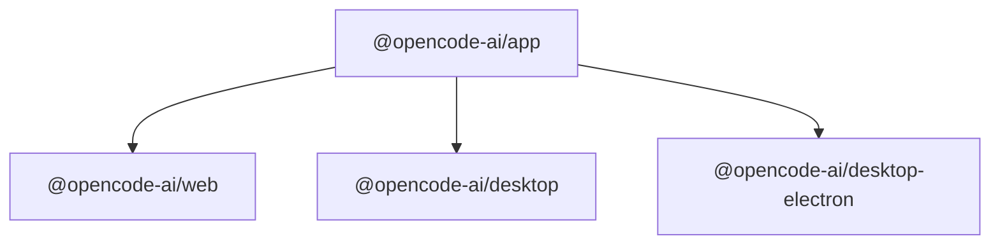

# 平台包

<cite>
**本文引用的文件**
- [packages/web/package.json](file://packages/web/package.json)
- [packages/web/tsconfig.json](file://packages/web/tsconfig.json)
- [packages/desktop/package.json](file://packages/desktop/package.json)
- [packages/desktop/tsconfig.json](file://packages/desktop/tsconfig.json)
- [packages/desktop-electron/package.json](file://packages/desktop-electron/package.json)
- [packages/desktop-electron/tsconfig.json](file://packages/desktop-electron/tsconfig.json)
- [packages/app/package.json](file://packages/app/package.json)
- [packages/app/tsconfig.json](file://packages/app/tsconfig.json)
- [packages/containers/base/Dockerfile](file://packages/containers/base/Dockerfile)
- [packages/containers/bun-node/Dockerfile](file://packages/containers/bun-node/Dockerfile)
- [packages/containers/rust/Dockerfile](file://packages/containers/rust/Dockerfile)
- [packages/containers/tauri-linux/Dockerfile](file://packages/containers/tauri-linux/Dockerfile)
</cite>

## 目录
1. [简介](#简介)
2. [项目结构](#项目结构)
3. [核心组件](#核心组件)
4. [架构总览](#架构总览)
5. [详细组件分析](#详细组件分析)
6. [依赖分析](#依赖分析)
7. [性能考虑](#性能考虑)
8. [故障排查指南](#故障排查指南)
9. [结论](#结论)
10. [附录](#附录)

## 简介
本文件系统性梳理 OpenCode 的多平台部署包结构，聚焦以下平台包：
- web 包：基于 Astro + Solid 的 Web 前端界面与静态站点能力
- desktop 包：基于 Tauri 的桌面应用基础框架
- desktop-electron 包：基于 Electron 的桌面应用集成方案
- app 包：应用程序入口与通用配置（共享 UI、SDK、工具库）
- containers 包：容器化构建与运行的基础镜像层

文档将解释各平台包的差异化设计、技术选型与部署策略，并给出跨平台开发最佳实践、性能优化建议与平台适配指南。

## 项目结构
OpenCode 采用多包工作区组织方式，核心平台包位于 packages 目录下，每个包独立管理其脚本、依赖与类型配置。整体结构围绕“共享应用内核（app）+ 多端打包（web/desktop/desktop-electron）+ 容器化（containers）”展开。

图表来源
- [packages/web/package.json:1-44](file://packages/web/package.json#L1-L44)
- [packages/desktop/package.json:1-45](file://packages/desktop/package.json#L1-L45)
- [packages/desktop-electron/package.json:1-54](file://packages/desktop-electron/package.json#L1-L54)
- [packages/app/package.json:1-74](file://packages/app/package.json#L1-L74)
- [packages/containers/base/Dockerfile:1-19](file://packages/containers/base/Dockerfile#L1-L19)
- [packages/containers/bun-node/Dockerfile:1-25](file://packages/containers/bun-node/Dockerfile#L1-L25)
- [packages/containers/rust/Dockerfile:1-14](file://packages/containers/rust/Dockerfile#L1-L14)
- [packages/containers/tauri-linux/Dockerfile:1-13](file://packages/containers/tauri-linux/Dockerfile#L1-L13)

章节来源
- [packages/web/package.json:1-44](file://packages/web/package.json#L1-L44)
- [packages/desktop/package.json:1-45](file://packages/desktop/package.json#L1-L45)
- [packages/desktop-electron/package.json:1-54](file://packages/desktop-electron/package.json#L1-L54)
- [packages/app/package.json:1-74](file://packages/app/package.json#L1-L74)
- [packages/containers/base/Dockerfile:1-19](file://packages/containers/base/Dockerfile#L1-L19)
- [packages/containers/bun-node/Dockerfile:1-25](file://packages/containers/bun-node/Dockerfile#L1-L25)
- [packages/containers/rust/Dockerfile:1-14](file://packages/containers/rust/Dockerfile#L1-L14)
- [packages/containers/tauri-linux/Dockerfile:1-13](file://packages/containers/tauri-linux/Dockerfile#L1-L13)

## 核心组件
- app 包：作为所有平台包的共享内核，提供统一的 UI 组件、路由、国际化、存储、网络与工具集，同时导出入口、Vite 配置与样式资源，便于在不同平台复用。
- web 包：以 Astro 为静态站点引擎，结合 Solid 组件与 Starlight 文档主题，构建可部署到 Cloudflare Workers 或静态托管的 Web 应用。
- desktop 包：基于 Tauri，使用 Vite 开发，通过大量 Tauri 插件实现剪贴板、对话框、通知、窗口状态、HTTP、更新等系统级能力。
- desktop-electron 包：基于 Electron，使用 electron-vite 构建，配合 electron-builder 进行多平台打包，内置日志、存储、更新与窗口状态管理。
- containers 包：分层构建 Docker 镜像，从 Ubuntu 基础开始，逐步叠加 Node/Bun、Rust 工具链与 Tauri 所需 Linux 依赖，支撑 CI/CD 与生产部署。

章节来源
- [packages/app/package.json:1-74](file://packages/app/package.json#L1-L74)
- [packages/web/package.json:1-44](file://packages/web/package.json#L1-L44)
- [packages/desktop/package.json:1-45](file://packages/desktop/package.json#L1-L45)
- [packages/desktop-electron/package.json:1-54](file://packages/desktop-electron/package.json#L1-L54)
- [packages/containers/base/Dockerfile:1-19](file://packages/containers/base/Dockerfile#L1-L19)
- [packages/containers/bun-node/Dockerfile:1-25](file://packages/containers/bun-node/Dockerfile#L1-L25)
- [packages/containers/rust/Dockerfile:1-14](file://packages/containers/rust/Dockerfile#L1-L14)
- [packages/containers/tauri-linux/Dockerfile:1-13](file://packages/containers/tauri-linux/Dockerfile#L1-L13)

## 架构总览
下图展示各平台包之间的依赖关系与数据流：

图表来源
- [packages/web/package.json:1-44](file://packages/web/package.json#L1-L44)
- [packages/desktop/package.json:1-45](file://packages/desktop/package.json#L1-L45)
- [packages/desktop-electron/package.json:1-54](file://packages/desktop-electron/package.json#L1-L54)
- [packages/app/package.json:1-74](file://packages/app/package.json#L1-L74)

## 详细组件分析

### Web 包：Web 界面实现与前端架构
- 技术栈与特性
  - 静态站点引擎：Astro，支持服务端渲染与静态输出，适合文档站点与内容型页面
  - 视图框架：Solid + JSX，强调响应式与细粒度更新
  - 文档与主题：Starlight 文档主题，Markdown 渲染与语法高亮
  - 部署目标：Cloudflare Workers 或静态托管
- 关键配置
  - TypeScript 配置启用 JSX 保留与 Solid 导入源
  - 脚本命令：开发、构建、预览与 Astro CLI
- 适用场景
  - 文档站、营销页、知识库、轻量交互页面
- 性能与体验
  - 静态输出减少运行时开销；Solid 的细粒度响应提升交互性能
  - 通过 Astro 的按需渲染与内容分发网络（CDN）优化加载速度

图表来源
- [packages/web/package.json:6-12](file://packages/web/package.json#L6-L12)
- [packages/web/tsconfig.json:1-10](file://packages/web/tsconfig.json#L1-L10)

章节来源
- [packages/web/package.json:1-44](file://packages/web/package.json#L1-L44)
- [packages/web/tsconfig.json:1-10](file://packages/web/tsconfig.json#L1-L10)

### Desktop 包：Tauri 桌面应用基础框架
- 技术栈与特性
  - 运行时：Tauri v2，提供安全的系统调用与原生窗口
  - 插件生态：剪贴板、深链、对话框、系统打开、通知、进程、Shell、HTTP、窗口状态、更新、存储等
  - 开发工具：Vite + TypeScript，热重载与快速迭代
- 关键配置
  - TypeScript 配置启用 JSX 保留与 Solid 导入源
  - 与 app 包建立引用关系，确保类型与构建一致性
- 适用场景
  - 跨平台桌面应用、工具类客户端、需要系统级能力的本地应用
- 性能与体验
  - 原生窗口与插件直连系统，延迟低；通过窗口状态与存储插件优化用户体验

图表来源
- [packages/desktop/package.json:7-13](file://packages/desktop/package.json#L7-L13)
- [packages/desktop/tsconfig.json:1-23](file://packages/desktop/tsconfig.json#L1-L23)

章节来源
- [packages/desktop/package.json:1-45](file://packages/desktop/package.json#L1-L45)
- [packages/desktop/tsconfig.json:1-23](file://packages/desktop/tsconfig.json#L1-L23)

### Desktop-Electron 包：Electron 集成方案
- 技术栈与特性
  - 构建工具：electron-vite，支持快速开发与打包
  - 打包工具：electron-builder，支持 macOS、Windows、Linux 三端产物
  - 运行时能力：electron-log 日志、electron-store 存储、electron-updater 更新、electron-window-state 窗口状态
  - 路由与视图：Solid + Router，保持与 app 包一致的 UI 与逻辑
- 关键配置
  - TypeScript 配置启用 Node/Electron 类型，确保主进程与渲染进程类型安全
  - 脚本命令覆盖开发、构建、预览与多平台打包
- 适用场景
  - 需要 Electron 生态兼容性的桌面应用、复杂窗口管理与自动更新需求
- 性能与体验
  - electron-vite 提升开发体验；electron-builder 生成原生安装包；窗口状态与存储提升稳定性

图表来源
- [packages/desktop-electron/package.json:12-24](file://packages/desktop-electron/package.json#L12-L24)
- [packages/desktop-electron/tsconfig.json:1-24](file://packages/desktop-electron/tsconfig.json#L1-L24)

章节来源
- [packages/desktop-electron/package.json:1-54](file://packages/desktop-electron/package.json#L1-L54)
- [packages/desktop-electron/tsconfig.json:1-24](file://packages/desktop-electron/tsconfig.json#L1-L24)

### App 包：应用程序入口与配置
- 统一内核
  - 导出入口、Vite 配置与样式资源，供 web/desktop/desktop-electron 复用
  - 提供 UI 组件、路由、国际化、存储、WebSocket、媒体、事件总线等通用能力
  - 依赖 SDK、UI、工具库，形成稳定的业务与交互基座
- 测试与开发
  - 单元测试与端到端测试脚本，支持本地与 CI 环境
  - Vite 开发服务器，支持热重载与预览
- 适用场景
  - 作为所有平台包的共享内核，避免重复实现相同功能

图表来源
- [packages/app/package.json:6-10](file://packages/app/package.json#L6-L10)
- [packages/app/package.json:40-72](file://packages/app/package.json#L40-L72)
- [packages/web/package.json:1-44](file://packages/web/package.json#L1-L44)
- [packages/desktop/package.json:1-45](file://packages/desktop/package.json#L1-L45)
- [packages/desktop-electron/package.json:1-54](file://packages/desktop-electron/package.json#L1-L54)

章节来源
- [packages/app/package.json:1-74](file://packages/app/package.json#L1-L74)
- [packages/app/tsconfig.json:1-27](file://packages/app/tsconfig.json#L1-L27)

### Containers 包：容器化部署支持
- 分层镜像
  - base：Ubuntu 基础系统与常用工具
  - bun-node：安装 Node 与 Bun，启用 Corepack
  - rust：安装 Rust 工具链与 Cargo
  - tauri-linux：安装 Tauri 所需 Linux 库与依赖
- 适用场景
  - CI/CD 构建流水线、生产镜像基座、多架构支持
- 部署策略
  - 使用 ARG 注入版本参数，便于在不同环境复用
  - 通过分层减少重复安装，缩短构建时间

图表来源
- [packages/containers/base/Dockerfile:1-19](file://packages/containers/base/Dockerfile#L1-L19)
- [packages/containers/bun-node/Dockerfile:1-25](file://packages/containers/bun-node/Dockerfile#L1-L25)
- [packages/containers/rust/Dockerfile:1-14](file://packages/containers/rust/Dockerfile#L1-L14)
- [packages/containers/tauri-linux/Dockerfile:1-13](file://packages/containers/tauri-linux/Dockerfile#L1-L13)

章节来源
- [packages/containers/base/Dockerfile:1-19](file://packages/containers/base/Dockerfile#L1-L19)
- [packages/containers/bun-node/Dockerfile:1-25](file://packages/containers/bun-node/Dockerfile#L1-L25)
- [packages/containers/rust/Dockerfile:1-14](file://packages/containers/rust/Dockerfile#L1-L14)
- [packages/containers/tauri-linux/Dockerfile:1-13](file://packages/containers/tauri-linux/Dockerfile#L1-L13)

## 依赖分析
- 内部依赖
  - web/desktop/desktop-electron 均依赖 app 包，确保 UI、路由、国际化与通用能力的一致性
  - desktop 与 desktop-electron 通过各自运行时（Tauri vs Electron）提供系统级能力
- 外部依赖
  - web：Astro、Solid、Starlight、Cloudflare 部署相关插件
  - desktop：Tauri 生态插件集合，覆盖系统交互与窗口管理
  - desktop-electron：electron-vite、electron-builder、electron-* 生态
  - containers：分层 Docker 镜像，按需叠加 Node/Bun、Rust、Linux 依赖

图表来源
- [packages/app/package.json:1-74](file://packages/app/package.json#L1-L74)
- [packages/web/package.json:1-44](file://packages/web/package.json#L1-L44)
- [packages/desktop/package.json:1-45](file://packages/desktop/package.json#L1-L45)
- [packages/desktop-electron/package.json:1-54](file://packages/desktop-electron/package.json#L1-L54)

章节来源
- [packages/app/package.json:1-74](file://packages/app/package.json#L1-L74)
- [packages/web/package.json:1-44](file://packages/web/package.json#L1-L44)
- [packages/desktop/package.json:1-45](file://packages/desktop/package.json#L1-L45)
- [packages/desktop-electron/package.json:1-54](file://packages/desktop-electron/package.json#L1-L54)

## 性能考虑
- Web 端
  - 利用 Astro 的静态生成与 CDN 缓存降低首屏与二次访问延迟
  - Solid 的细粒度响应与按需渲染减少不必要的重绘
- 桌面端（Tauri）
  - 通过窗口状态与存储插件持久化用户偏好，减少重复初始化
  - 系统级插件直接调用，避免额外中间层带来的性能损耗
- 桌面端（Electron）
  - electron-vite 提升开发与构建效率；electron-builder 生成原生安装包，利于分发与更新
  - 合理拆分主进程与渲染进程职责，避免阻塞 UI
- 容器化
  - 分层镜像减少重复安装，缩短构建时间；使用 ARG 参数控制版本，便于缓存命中

## 故障排查指南
- TypeScript 配置问题
  - 确认 tsconfig 中启用 JSX 保留与 Solid 导入源，避免类型或编译错误
- 开发服务器无法启动
  - 检查各包脚本命令是否正确；确认端口未被占用；验证环境变量（如远程 API 地址）
- Tauri 插件初始化失败
  - 确认 CLI 版本与插件版本匹配；检查权限与沙箱设置
- Electron 打包失败
  - 检查 electron-builder 配置与签名设置；确认平台依赖已安装
- 容器构建异常
  - 检查分层顺序与 ARG 参数；确认网络与缓存可用

章节来源
- [packages/web/tsconfig.json:1-10](file://packages/web/tsconfig.json#L1-L10)
- [packages/desktop/tsconfig.json:1-23](file://packages/desktop/tsconfig.json#L1-L23)
- [packages/desktop-electron/tsconfig.json:1-24](file://packages/desktop-electron/tsconfig.json#L1-L24)
- [packages/web/package.json:6-12](file://packages/web/package.json#L6-L12)
- [packages/desktop/package.json:7-13](file://packages/desktop/package.json#L7-L13)
- [packages/desktop-electron/package.json:12-24](file://packages/desktop-electron/package.json#L12-L24)

## 结论
OpenCode 的多平台包体系以 app 为核心，通过 web、desktop、desktop-electron 实现跨平台交付，再以 containers 提供容器化基座。该架构在保证一致性的同时，针对不同平台提供了最优的技术选型与部署策略。遵循本文的最佳实践与适配指南，可在多端实现高质量、高性能与易维护的交付。

## 附录
- 跨平台开发最佳实践
  - 将共享逻辑集中在 app 包，避免重复实现
  - 在 web/desktop/desktop-electron 中仅处理平台差异与系统集成
  - 使用统一的类型配置与脚本命令，确保开发体验一致
- 性能优化建议
  - Web：静态生成 + CDN + 代码分割
  - 桌面：原生插件直连 + 窗口状态持久化
  - Electron：主/渲染进程解耦 + 合理的自动更新策略
  - 容器：分层镜像 + 缓存优化 + 版本参数化
- 平台适配指南
  - Web：优先静态站点与文档主题；注意 SEO 与可访问性
  - Tauri：充分利用系统插件；关注权限与沙箱限制
  - Electron：关注打包体积与启动时间；完善更新与日志机制
  - 容器：按需引入依赖，最小化镜像体积