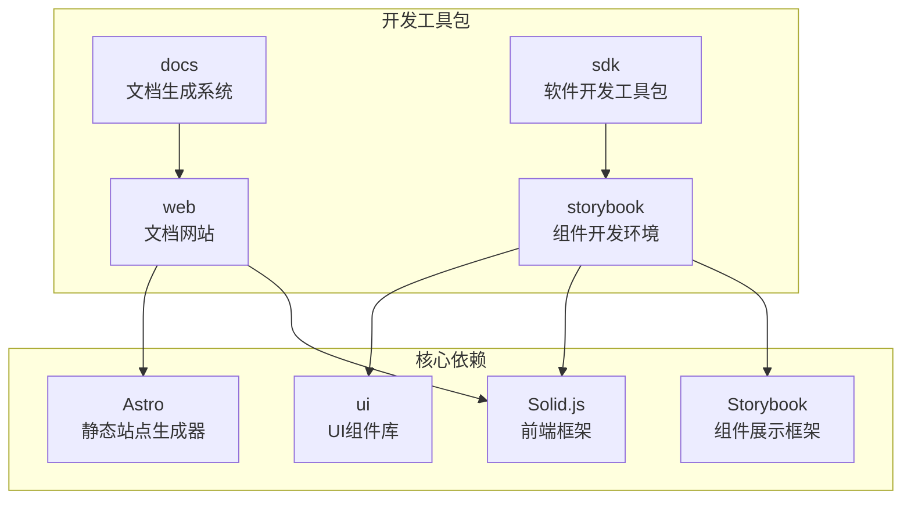
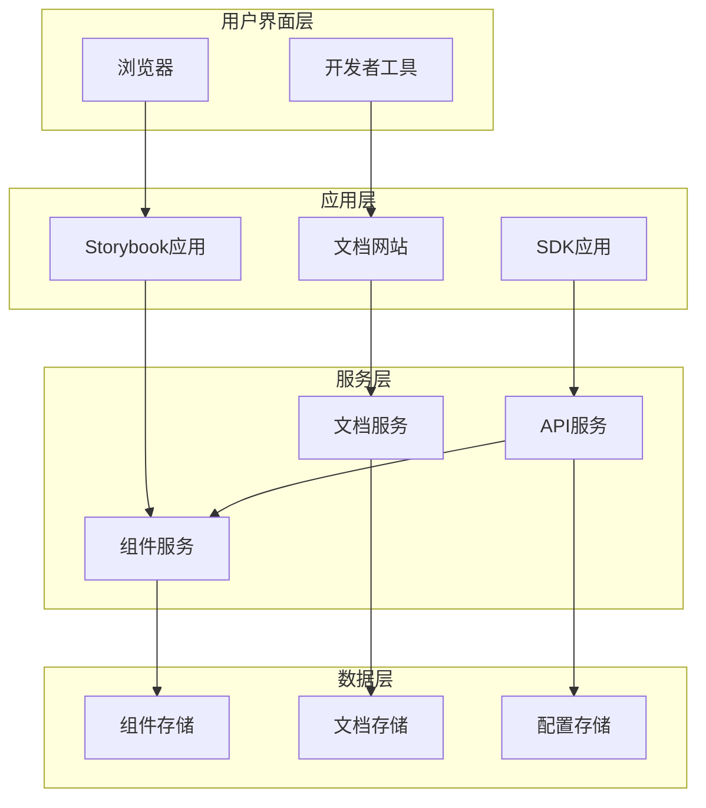
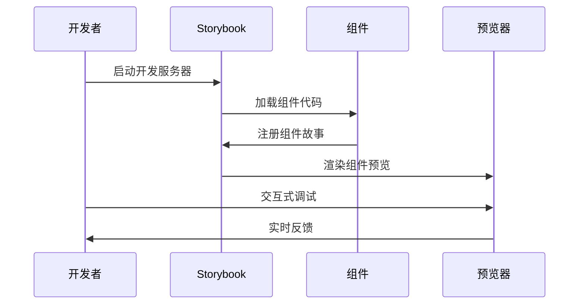
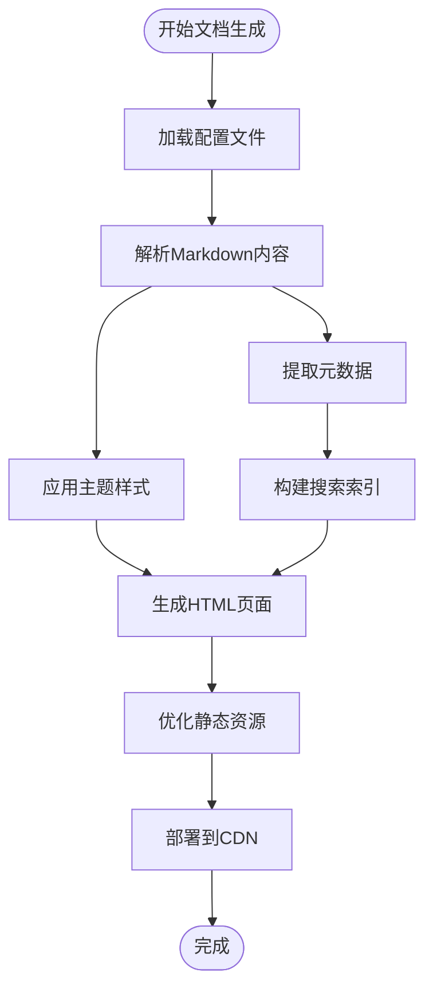
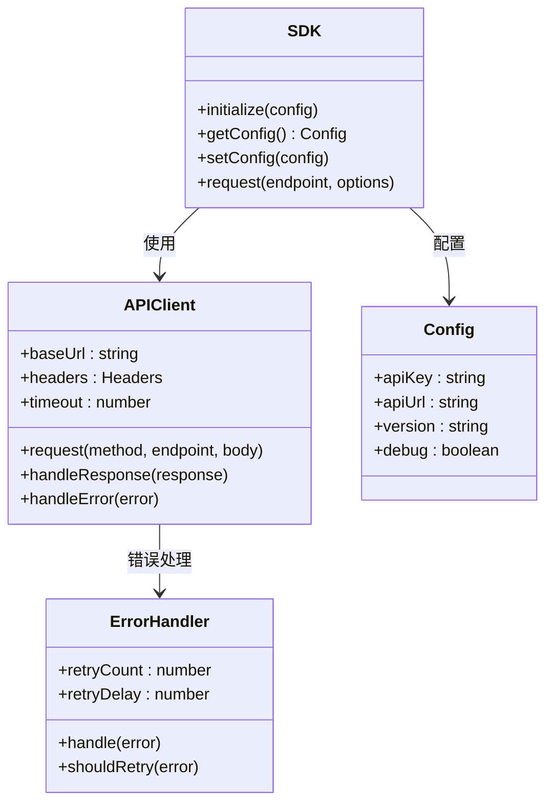

# 开发工具包

<cite>
**本文档引用的文件**
- [packages/storybook/package.json](file://packages/storybook/package.json)
- [packages/storybook/tsconfig.json](file://packages/storybook/tsconfig.json)
- [packages/web/package.json](file://packages/web/package.json)
- [packages/web/tsconfig.json](file://packages/web/tsconfig.json)
- [.github/workflows/publish-python-sdk.yml](file://.github/workflows/publish-python-sdk.yml)
- [CONTRIBUTING.md](file://CONTRIBUTING.md)
- [README.md](file://README.md)
</cite>

## 目录
1. [简介](#简介)
2. [项目结构](#项目结构)
3. [核心组件](#核心组件)
4. [架构概览](#架构概览)
5. [详细组件分析](#详细组件分析)
6. [依赖关系分析](#依赖关系分析)
7. [性能考虑](#性能考虑)
8. [故障排除指南](#故障排除指南)
9. [结论](#结论)
10. [附录](#附录)

## 简介

OpenCode项目包含多个专门的开发工具包，旨在提升开发效率、保证代码质量和促进团队协作。本文档重点介绍四个核心开发工具包：storybook组件开发和展示环境、docs文档生成和维护机制、sdk软件开发工具包和API封装，以及web文档网站实现。

这些工具包通过现代化的开发工具链和标准化的工作流程，为OpenCode项目提供了完整的开发基础设施。每个工具包都有其特定的功能定位和使用场景，共同构成了OpenCode项目的开发生态系统。

## 项目结构

OpenCode项目的开发工具包主要分布在packages目录下，采用Monorepo架构组织：



**图表来源**
- [packages/storybook/package.json:1-30](file://packages/storybook/package.json#L1-L30)
- [packages/web/package.json:1-44](file://packages/web/package.json#L1-L44)

**章节来源**
- [packages/storybook/package.json:1-30](file://packages/storybook/package.json#L1-L30)
- [packages/web/package.json:1-44](file://packages/web/package.json#L1-L44)

## 核心组件

### Storybook组件开发环境

Storybook作为OpenCode项目的核心组件开发和展示环境，提供了以下关键功能：

- **组件开发**：支持React和Solid.js组件的开发和测试
- **可视化文档**：自动生成组件的使用示例和API文档
- **交互式调试**：提供实时预览和状态管理
- **可访问性测试**：内置a11y辅助功能确保组件的可访问性
- **跨框架支持**：同时支持React和Solid.js生态系统的组件

### 文档生成系统

文档系统基于Astro和Starlight构建，提供现代化的文档体验：

- **Markdown支持**：完整的Markdown语法支持和扩展
- **主题定制**：可定制的主题系统和样式方案
- **代码高亮**：集成Shiki实现语法高亮
- **多语言支持**：国际化文档生成能力
- **SEO优化**：自动化的SEO元数据管理和优化

### 软件开发工具包

SDK包提供统一的API封装和工具函数，支持多种编程语言：

- **API抽象层**：统一的接口定义和实现
- **错误处理**：标准化的错误处理和重试机制
- **类型安全**：完整的TypeScript类型定义
- **版本管理**：自动化的版本控制和发布流程
- **多语言支持**：支持Python、JavaScript等多种语言

### 文档网站实现

Web包实现了完整的文档网站解决方案：

- **静态站点生成**：基于Astro的高性能静态站点
- **响应式设计**：适配各种设备和屏幕尺寸
- **搜索功能**：集成的全文搜索和导航
- **版本控制**：多版本文档管理和切换
- **CI/CD集成**：自动化部署和更新流程

**章节来源**
- [packages/storybook/package.json:10-28](file://packages/storybook/package.json#L10-L28)
- [packages/web/package.json:14-36](file://packages/web/package.json#L14-L36)

## 架构概览

OpenCode开发工具包的整体架构采用分层设计，各组件之间通过清晰的接口进行通信：



**图表来源**
- [packages/storybook/package.json:6-8](file://packages/storybook/package.json#L6-L8)
- [packages/web/package.json:6-12](file://packages/web/package.json#L6-L12)

## 详细组件分析

### Storybook组件开发环境

#### 组件开发工作流



**图表来源**
- [packages/storybook/package.json:7](file://packages/storybook/package.json#L7)

#### 技术栈分析

Storybook开发环境采用现代化的技术栈组合：

- **开发服务器**：Vite提供快速的开发体验
- **组件框架**：支持React和Solid.js两种主流框架
- **类型系统**：TypeScript提供完整的类型安全保障
- **样式系统**：TailwindCSS集成实现一致的样式管理
- **构建工具**：Rollup用于生产环境的构建优化

**章节来源**
- [packages/storybook/package.json:10-28](file://packages/storybook/package.json#L10-L28)
- [packages/storybook/tsconfig.json:1-17](file://packages/storybook/tsconfig.json#L1-L17)

### 文档网站实现

#### 文档生成流程



**图表来源**
- [packages/web/package.json:14-36](file://packages/web/package.json#L14-L36)

#### 功能特性

Web包实现了以下核心功能：

- **Astro集成**：利用Astro的静态站点生成功能
- **Starlight主题**：基于Starlight的现代化文档主题
- **Solid.js支持**：集成Solid.js实现动态交互
- **Shiki语法高亮**：提供高质量的代码语法高亮
- **Cloudflare部署**：支持Cloudflare平台的部署优化

**章节来源**
- [packages/web/package.json:14-42](file://packages/web/package.json#L14-L42)
- [packages/web/tsconfig.json:1-10](file://packages/web/tsconfig.json#L1-L10)

### SDK软件开发工具包

#### API封装架构



**图表来源**
- [.github/workflows/publish-python-sdk.yml:1-50](file://.github/workflows/publish-python-sdk.yml#L1-L50)

#### 多语言支持

SDK包支持多种编程语言，每种语言都有其特定的实现特点：

- **Python SDK**：提供完整的Python客户端实现
- **JavaScript SDK**：支持Node.js和浏览器环境
- **TypeScript SDK**：提供强类型的API封装
- **Go SDK**：面向后端服务的高效实现

**章节来源**
- [.github/workflows/publish-python-sdk.yml:1-50](file://.github/workflows/publish-python-sdk.yml#L1-L50)

## 依赖关系分析

### 包依赖图

```mermaid
graph TB
subgraph "外部依赖"
React[React 18.2.0]
Solid[Solid.js]
Astro[Astro 5.7.13]
Storybook[Storybook 10.2.13]
Tailwind[TailwindCSS]
end
subgraph "内部包"
StorybookPkg[@opencode-ai/storybook]
WebPkg[@opencode-ai/web]
UIPkg[@opencode-ai/ui]
UtilPkg[@opencode-ai/util]
end
StorybookPkg --> React
StorybookPkg --> Solid
StorybookPkg --> Storybook
StorybookPkg --> Tailwind
StorybookPkg --> UIPkg
WebPkg --> Astro
WebPkg --> Solid
WebPkg --> UIPkg
StorybookPkg -.-> UtilPkg
WebPkg -.-> UtilPkg
```

**图表来源**
- [packages/storybook/package.json:10-28](file://packages/storybook/package.json#L10-L28)
- [packages/web/package.json:14-36](file://packages/web/package.json#L14-L36)

### 版本管理策略

OpenCode项目采用统一的版本管理策略：

- **语义化版本**：遵循SemVer规范进行版本号管理
- **工作区同步**：通过pnpm工作区实现包版本的一致性
- **自动发布**：CI/CD流水线自动化版本发布流程
- **变更日志**：自动生成详细的版本变更记录

**章节来源**
- [packages/storybook/package.json:1-30](file://packages/storybook/package.json#L1-L30)
- [packages/web/package.json:1-44](file://packages/web/package.json#L1-L44)

## 性能考虑

### 开发环境性能优化

OpenCode开发工具包在性能方面采用了多项优化策略：

- **增量编译**：Vite提供快速的模块热替换和增量编译
- **代码分割**：自动的代码分割和懒加载机制
- **缓存策略**：智能的构建缓存和依赖缓存
- **Tree Shaking**：移除未使用的代码减少包体积
- **压缩优化**：生产环境的代码压缩和优化

### 生产环境优化

文档网站和组件库在生产环境采用以下优化措施：

- **静态资源优化**：图片和字体的自动优化和压缩
- **CDN加速**：通过Cloudflare CDN提供全球加速
- **预渲染**：静态站点的预渲染提高首屏加载速度
- **缓存策略**：合理的HTTP缓存头设置
- **资源预加载**：关键资源的预加载和预连接

## 故障排除指南

### 常见问题解决

#### Storybook开发环境问题

- **组件无法加载**：检查组件导出格式和路径配置
- **样式不生效**：确认TailwindCSS配置和样式导入顺序
- **热重载失效**：重启开发服务器或清理缓存
- **TypeScript错误**：检查tsconfig配置和类型声明

#### 文档网站问题

- **页面空白**：检查Markdown语法和Front Matter配置
- **样式异常**：验证主题配置和CSS变量设置
- **搜索功能失效**：重新生成搜索索引和检查配置
- **部署失败**：查看CI/CD日志和环境变量配置

#### SDK集成问题

- **认证失败**：验证API密钥和权限配置
- **请求超时**：检查网络连接和服务器状态
- **类型错误**：确认SDK版本兼容性和类型定义
- **版本冲突**：清理依赖缓存和重新安装依赖

**章节来源**
- [CONTRIBUTING.md](file://CONTRIBUTING.md)
- [README.md](file://README.md)

## 结论

OpenCode项目的开发工具包通过精心设计的架构和现代化的技术栈，为项目提供了完整的开发基础设施。这些工具包不仅提升了开发效率，还确保了代码质量和团队协作的一致性。

各个工具包之间的协同工作形成了一个高效的开发生态系统，从组件开发到文档生成，从API封装到网站部署，每个环节都经过了优化和标准化。这种架构设计使得新成员能够快速上手，同时也为项目的长期发展奠定了坚实的基础。

随着项目的不断发展，这些开发工具包将继续演进，引入新的功能和技术，以满足日益增长的开发需求。

## 附录

### 最佳实践建议

1. **组件开发**：遵循单一职责原则，保持组件的简洁性和可复用性
2. **文档编写**：使用清晰的示例和完整的API文档
3. **SDK使用**：正确处理错误和边界情况，提供良好的用户体验
4. **代码质量**：定期审查代码，保持一致的编码风格
5. **性能监控**：关注关键指标，持续优化性能表现

### 贡献流程

1. **环境搭建**：克隆仓库并安装依赖
2. **功能开发**：在相应的包中添加新功能
3. **测试验证**：运行测试确保功能正常
4. **文档更新**：更新相关的文档和示例
5. **提交PR**：创建Pull Request并等待审查