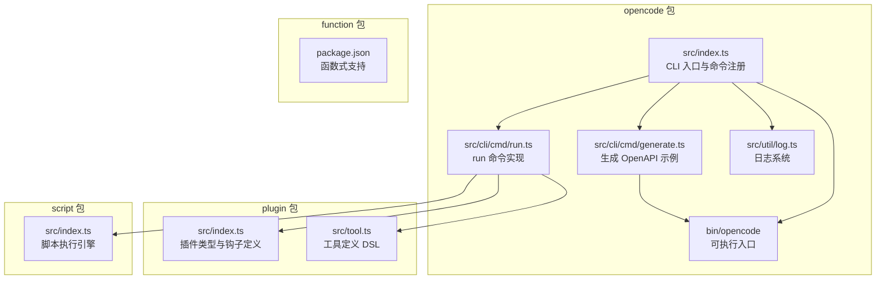
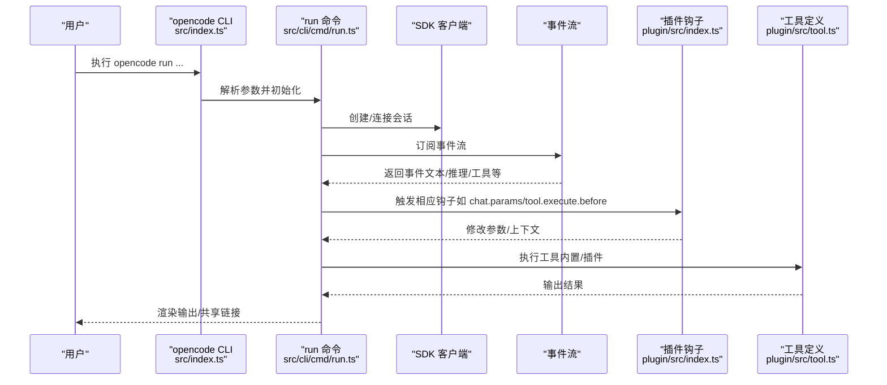
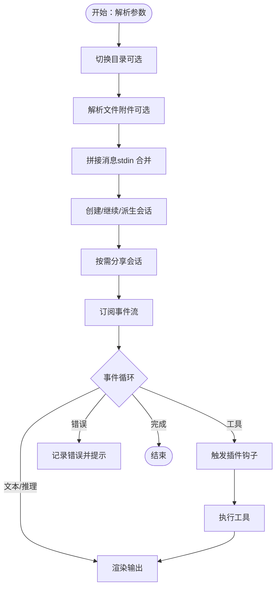
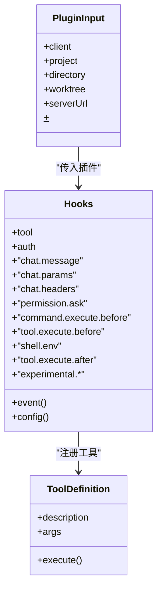
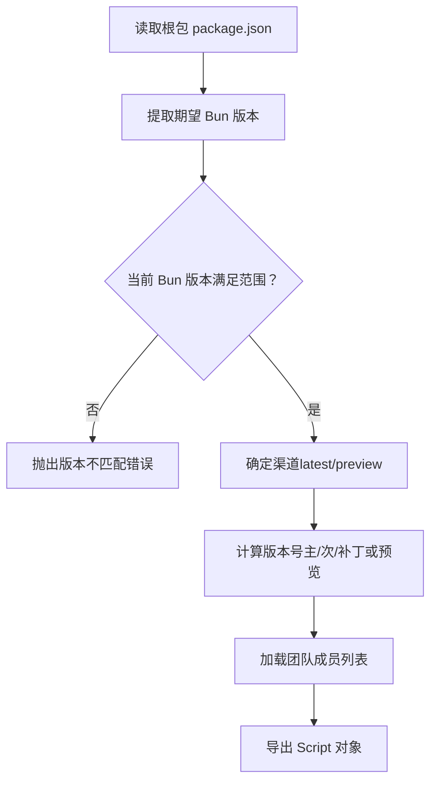
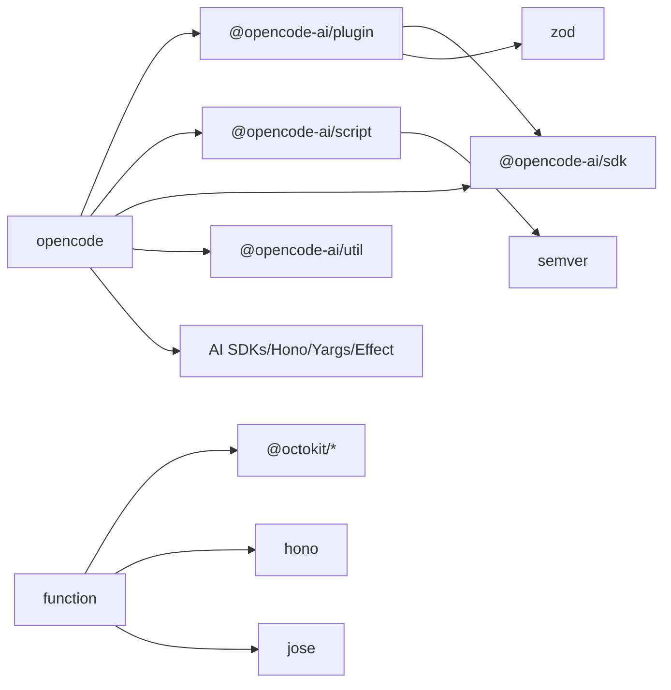

# 核心包

<cite>
**本文引用的文件**
- [packages/opencode/package.json](file://packages/opencode/package.json)
- [packages/opencode/src/index.ts](file://packages/opencode/src/index.ts)
- [packages/opencode/bin/opencode](file://packages/opencode/bin/opencode)
- [packages/opencode/src/cli/cmd/run.ts](file://packages/opencode/src/cli/cmd/run.ts)
- [packages/opencode/src/cli/cmd/generate.ts](file://packages/opencode/src/cli/cmd/generate.ts)
- [packages/opencode/src/util/log.ts](file://packages/opencode/src/util/log.ts)
- [packages/plugin/package.json](file://packages/plugin/package.json)
- [packages/plugin/src/index.ts](file://packages/plugin/src/index.ts)
- [packages/plugin/src/tool.ts](file://packages/plugin/src/tool.ts)
- [packages/script/package.json](file://packages/script/package.json)
- [packages/script/src/index.ts](file://packages/script/src/index.ts)
- [packages/function/package.json](file://packages/function/package.json)
</cite>

## 目录
1. [简介](#简介)
2. [项目结构](#项目结构)
3. [核心组件](#核心组件)
4. [架构总览](#架构总览)
5. [详细组件分析](#详细组件分析)
6. [依赖分析](#依赖分析)
7. [性能考虑](#性能考虑)
8. [故障排查指南](#故障排查指南)
9. [结论](#结论)
10. [附录](#附录)

## 简介
本文件系统性梳理 OpenCode 项目的核心包结构与功能，重点围绕 opencode 主包（核心引擎）、plugin 插件包（插件系统与钩子机制）、script 脚本包（版本与发布脚本执行引擎）与 function 函数包（函数式编程支持）展开。文档解释各包职责、关键数据结构、处理流程、依赖关系与协作方式，并提供使用示例、扩展接口与最佳实践建议。

## 项目结构
OpenCode 采用多包工作区组织，核心包位于 packages 目录下：
- opencode：CLI 引擎与命令入口，负责解析参数、初始化日志、执行会话与事件流、调用 SDK 与工具集。
- plugin：插件系统与钩子定义，提供事件、配置、认证、工具、聊天参数与消息转换等扩展点。
- script：脚本执行引擎，校验运行时环境（如 Bun 版本），并提供通道、预览版、版本号与团队信息等能力。
- function：函数式编程支持相关包（当前为占位或轻量实现）。

图表来源
- [packages/opencode/src/index.ts:1-214](file://packages/opencode/src/index.ts#L1-L214)
- [packages/opencode/src/cli/cmd/run.ts:1-677](file://packages/opencode/src/cli/cmd/run.ts#L1-L677)
- [packages/opencode/src/cli/cmd/generate.ts:1-39](file://packages/opencode/src/cli/cmd/generate.ts#L1-L39)
- [packages/opencode/src/util/log.ts:1-183](file://packages/opencode/src/util/log.ts#L1-L183)
- [packages/opencode/bin/opencode:1-180](file://packages/opencode/bin/opencode#L1-L180)
- [packages/plugin/src/index.ts:1-235](file://packages/plugin/src/index.ts#L1-L235)
- [packages/plugin/src/tool.ts:1-39](file://packages/plugin/src/tool.ts#L1-L39)
- [packages/script/src/index.ts:1-78](file://packages/script/src/index.ts#L1-L78)

章节来源
- [packages/opencode/package.json:1-146](file://packages/opencode/package.json#L1-L146)
- [packages/opencode/src/index.ts:1-214](file://packages/opencode/src/index.ts#L1-L214)
- [packages/opencode/bin/opencode:1-180](file://packages/opencode/bin/opencode#L1-L180)
- [packages/plugin/package.json:1-29](file://packages/plugin/package.json#L1-L29)
- [packages/script/package.json:1-16](file://packages/script/package.json#L1-L16)
- [packages/function/package.json:1-21](file://packages/function/package.json#L1-L21)

## 核心组件
- opencode 主包（核心引擎）
  - CLI 入口与命令注册：通过 yargs 注册大量命令（run、generate、serve、providers、models、stats 等），统一初始化日志、数据库迁移与全局环境变量。
  - 运行命令（run）：负责创建/继续会话、订阅事件流、渲染输出、处理权限请求、支持本地启动或附加到远程服务。
  - OpenAPI 生成：导出 OpenAPI 规范并注入示例代码片段，便于 SDK 使用。
  - 日志系统：支持级别控制、标签化、时间统计与文件落盘，保留最近若干日志文件。
  - 可执行入口：根据平台与架构选择最优二进制分发包，兼容 AVX2、musl 等特性检测。
- plugin 插件包（插件系统）
  - 插件类型与输入：定义 PluginInput（包含客户端、项目、目录、工作树、服务器地址、Bun Shell 环境）。
  - 钩子体系：涵盖事件、配置、工具、认证、聊天参数与头部、权限询问、命令/工具执行前后、Shell 环境、实验性消息与系统提示词转换、会话压缩定制、文本补全、工具定义修改等。
  - 工具定义 DSL：提供 tool 函数与 schema，声明工具描述、参数模式与执行逻辑。
- script 脚本包（脚本执行引擎）
  - 环境校验：读取根包管理器版本要求，校验当前 Bun 版本范围。
  - 渠道与版本：根据环境变量与分支推导渠道（latest/preview），计算版本号（主/次/补丁递增或预览版）。
  - 团队成员：从 TEAM_MEMBERS 文件加载维护者列表，包含机器人账号。
- function 函数包（函数式编程支持）
  - 当前为占位或轻量实现，保留扩展空间。

章节来源
- [packages/opencode/src/index.ts:1-214](file://packages/opencode/src/index.ts#L1-L214)
- [packages/opencode/src/cli/cmd/run.ts:1-677](file://packages/opencode/src/cli/cmd/run.ts#L1-L677)
- [packages/opencode/src/cli/cmd/generate.ts:1-39](file://packages/opencode/src/cli/cmd/generate.ts#L1-L39)
- [packages/opencode/src/util/log.ts:1-183](file://packages/opencode/src/util/log.ts#L1-L183)
- [packages/opencode/bin/opencode:1-180](file://packages/opencode/bin/opencode#L1-L180)
- [packages/plugin/src/index.ts:1-235](file://packages/plugin/src/index.ts#L1-L235)
- [packages/plugin/src/tool.ts:1-39](file://packages/plugin/src/tool.ts#L1-L39)
- [packages/script/src/index.ts:1-78](file://packages/script/src/index.ts#L1-L78)
- [packages/function/package.json:1-21](file://packages/function/package.json#L1-L21)

## 架构总览
OpenCode 的核心引擎以 CLI 为中心，围绕“命令 → 会话/事件 → 工具/插件 → 输出”的闭环构建。运行命令（run）在本地或远程服务间切换，订阅事件流并渲染结果；插件通过钩子参与生命周期；脚本包保障运行环境一致性。

图表来源
- [packages/opencode/src/index.ts:1-214](file://packages/opencode/src/index.ts#L1-L214)
- [packages/opencode/src/cli/cmd/run.ts:1-677](file://packages/opencode/src/cli/cmd/run.ts#L1-L677)
- [packages/plugin/src/index.ts:148-234](file://packages/plugin/src/index.ts#L148-L234)
- [packages/plugin/src/tool.ts:29-35](file://packages/plugin/src/tool.ts#L29-L35)

## 详细组件分析

### opencode 主包（核心引擎）
- CLI 入口与命令注册
  - 初始化日志、设置环境变量、首次运行数据库迁移、注册所有命令并处理异常。
  - 支持 shell 补全、严格模式与帮助输出。
- 运行命令（run）
  - 参数解析：支持消息、命令、会话继续/派生、模型与代理选择、文件附件、目录切换、远程附加、权限规则等。
  - 会话管理：创建/继续/派生会话，自动分享（按配置或标志），处理权限询问。
  - 事件驱动渲染：订阅事件流，按 part 类型渲染文本、推理、工具执行结果；支持 JSON 格式输出。
  - 本地/远程模式：可直接启动本地服务或连接远程服务（带 Basic 认证）。
- OpenAPI 生成
  - 读取服务 OpenAPI 规范，注入 JS 示例代码片段，输出 JSON。
- 日志系统
  - 支持 DEBUG/INFO/WARN/ERROR 级别，标签化记录，时间统计，文件轮转与清理。
- 可执行入口
  - 自动选择平台/架构二进制，兼容 AVX2、musl 等特性；若未找到匹配包则提示手动安装。

图表来源
- [packages/opencode/src/cli/cmd/run.ts:306-677](file://packages/opencode/src/cli/cmd/run.ts#L306-L677)
- [packages/opencode/src/util/log.ts:60-183](file://packages/opencode/src/util/log.ts#L60-L183)

章节来源
- [packages/opencode/src/index.ts:1-214](file://packages/opencode/src/index.ts#L1-L214)
- [packages/opencode/src/cli/cmd/run.ts:1-677](file://packages/opencode/src/cli/cmd/run.ts#L1-L677)
- [packages/opencode/src/cli/cmd/generate.ts:1-39](file://packages/opencode/src/cli/cmd/generate.ts#L1-L39)
- [packages/opencode/src/util/log.ts:1-183](file://packages/opencode/src/util/log.ts#L1-L183)
- [packages/opencode/bin/opencode:1-180](file://packages/opencode/bin/opencode#L1-L180)

### plugin 插件包（插件系统与钩子机制）
- 插件类型与输入
  - PluginInput 提供客户端、项目、目录、工作树、服务器地址与 Bun Shell 环境，便于插件在会话上下文中执行。
- 钩子体系
  - 事件与配置：监听事件、注入配置。
  - 认证：支持 OAuth 与 API 两种授权方式，可自定义提示与回调。
  - 聊天参数与头部：允许修改温度、采样参数与请求头。
  - 权限：拦截权限请求，允许/拒绝/询问。
  - 命令/工具执行前后：可修改参数、输出标题/元数据。
  - Shell 环境：注入环境变量。
  - 实验性扩展：消息转换、系统提示词转换、会话压缩定制、文本补全、工具定义修改。
- 工具定义 DSL
  - tool 函数用于声明工具描述、参数模式与执行逻辑，配合 Zod schema 进行参数校验。

图表来源
- [packages/plugin/src/index.ts:20-235](file://packages/plugin/src/index.ts#L20-L235)
- [packages/plugin/src/tool.ts:29-39](file://packages/plugin/src/tool.ts#L29-L39)

章节来源
- [packages/plugin/src/index.ts:1-235](file://packages/plugin/src/index.ts#L1-L235)
- [packages/plugin/src/tool.ts:1-39](file://packages/plugin/src/tool.ts#L1-L39)

### script 脚本包（脚本执行引擎）
- 环境校验
  - 从根包读取期望的包管理器版本，校验当前 Bun 版本是否满足范围要求。
- 渠道与版本
  - 依据环境变量与分支推断渠道（latest/preview），计算版本号（主/次/补丁递增或预览版）。
- 团队成员
  - 从 TEAM_MEMBERS 文件加载维护者名单，包含机器人账号。

图表来源
- [packages/script/src/index.ts:1-78](file://packages/script/src/index.ts#L1-L78)

章节来源
- [packages/script/src/index.ts:1-78](file://packages/script/src/index.ts#L1-L78)
- [packages/script/package.json:1-16](file://packages/script/package.json#L1-L16)

### function 函数包（函数式编程支持）
- 当前为占位或轻量实现，保留扩展空间，便于后续引入函数式编程范式与工具链。

章节来源
- [packages/function/package.json:1-21](file://packages/function/package.json#L1-L21)

## 依赖分析
- opencode 主包
  - 依赖 @opencode-ai/plugin、@opencode-ai/script、@opencode-ai/sdk、@opencode-ai/util 等工作区包，以及大量 AI 供应商 SDK、Hono、Effect、Yargs 等外部库。
  - 通过 bin/opencode 将用户入口映射到对应平台二进制。
- plugin 包
  - 依赖 @opencode-ai/sdk 与 zod，提供工具定义与钩子类型。
- script 匽数值
  - 依赖 semver，用于版本范围判断。
- function 包
  - 依赖 @octokit、hono、jose 等，为后续函数式能力做准备。

图表来源
- [packages/opencode/package.json:58-141](file://packages/opencode/package.json#L58-L141)
- [packages/plugin/package.json:18-21](file://packages/plugin/package.json#L18-L21)
- [packages/script/package.json:5-7](file://packages/script/package.json#L5-L7)
- [packages/function/package.json:14-19](file://packages/function/package.json#L14-L19)

章节来源
- [packages/opencode/package.json:1-146](file://packages/opencode/package.json#L1-L146)
- [packages/plugin/package.json:1-29](file://packages/plugin/package.json#L1-L29)
- [packages/script/package.json:1-16](file://packages/script/package.json#L1-L16)
- [packages/function/package.json:1-21](file://packages/function/package.json#L1-L21)

## 性能考虑
- 事件流渲染：run 命令按事件类型增量渲染，避免全量重绘；建议在非 TTY 环境直接输出文本，减少格式化开销。
- 日志级别：生产环境建议 INFO 或更高，避免 DEBUG 大量 IO；必要时启用打印到 stderr。
- 数据库迁移：首次运行进行 SQLite 迁移，进度条在 TTY 下更友好；非 TTY 环境使用简单日志输出。
- 平台二进制选择：自动检测 CPU/ABI 特性（AVX2、musl），优先选择优化版本，提升启动与执行性能。

## 故障排查指南
- CLI 异常处理
  - 未捕获异常与未处理拒绝会在进程级监听中记录并退出；建议查看日志文件定位问题。
- 日志定位
  - 日志文件位于全局日志目录，按日期命名并保留最近若干文件；可通过 Log.file() 获取路径。
- 运行时环境
  - 若脚本提示 Bun 版本不匹配，检查根包中的 packageManager 字段与实际运行版本。
- 二进制选择失败
  - 若找不到匹配平台/架构的二进制，CLI 会提示手动安装对应包；确认 OPENCODE_BIN_PATH 或 node_modules 层级结构。

章节来源
- [packages/opencode/src/index.ts:38-48](file://packages/opencode/src/index.ts#L38-L48)
- [packages/opencode/src/util/log.ts:51-90](file://packages/opencode/src/util/log.ts#L51-L90)
- [packages/script/src/index.ts:9-18](file://packages/script/src/index.ts#L9-L18)
- [packages/opencode/bin/opencode:169-179](file://packages/opencode/bin/opencode#L169-L179)

## 结论
OpenCode 的核心包以 opencode 为主引擎，结合 plugin 的钩子扩展、script 的环境与版本管控、以及 function 的函数式支持，形成可扩展、可观测、跨平台的 AI 驱动开发体验。通过事件驱动的 run 命令与 OpenAPI 生成，开发者可以快速接入与扩展系统能力。

## 附录
- 使用示例（路径指引）
  - 运行一次对话：参考 [packages/opencode/src/cli/cmd/run.ts:306-677](file://packages/opencode/src/cli/cmd/run.ts#L306-L677)
  - 生成 OpenAPI 示例：参考 [packages/opencode/src/cli/cmd/generate.ts:1-39](file://packages/opencode/src/cli/cmd/generate.ts#L1-L39)
  - 插件开发：参考 [packages/plugin/src/index.ts:148-234](file://packages/plugin/src/index.ts#L148-L234) 与 [packages/plugin/src/tool.ts:29-35](file://packages/plugin/src/tool.ts#L29-L35)
  - 脚本执行：参考 [packages/script/src/index.ts:1-78](file://packages/script/src/index.ts#L1-L78)
- 扩展接口
  - 在插件中注册 hooks，覆盖 chat.params、tool.execute.before/after、experimental.* 等扩展点。
  - 使用 tool DSL 定义工具，确保参数 schema 与执行逻辑清晰分离。
- 最佳实践
  - 在生产环境降低日志级别，启用文件落盘；在 CI 中使用 JSON 输出便于解析。
  - 通过 OpenAPI 生成的示例代码快速集成 SDK，保持版本与渠道一致。
  - 利用 run 命令的权限规则与分享能力，安全地协作与复现问题。