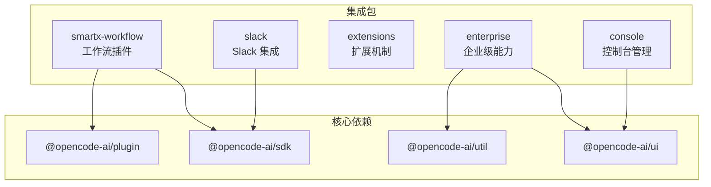
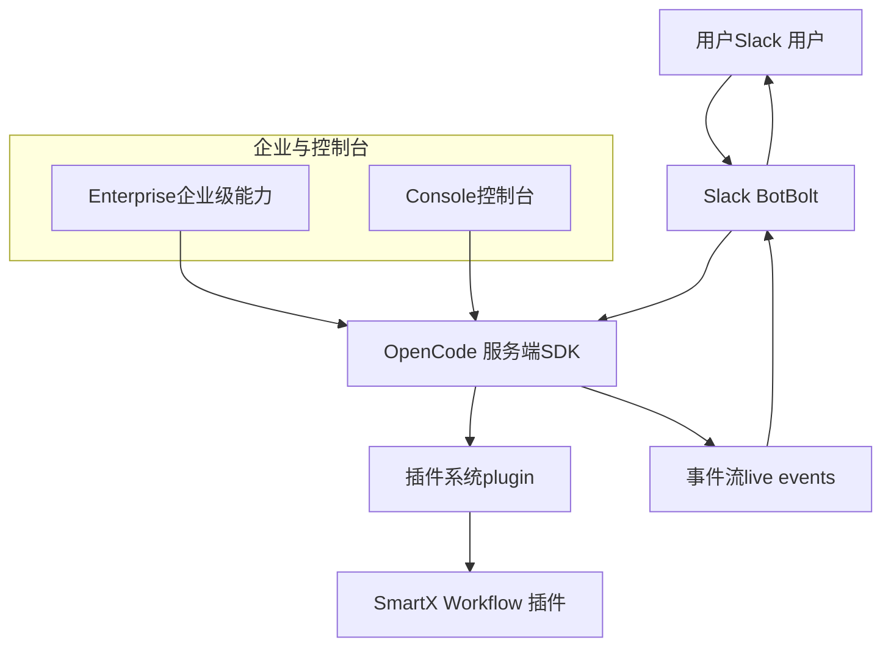
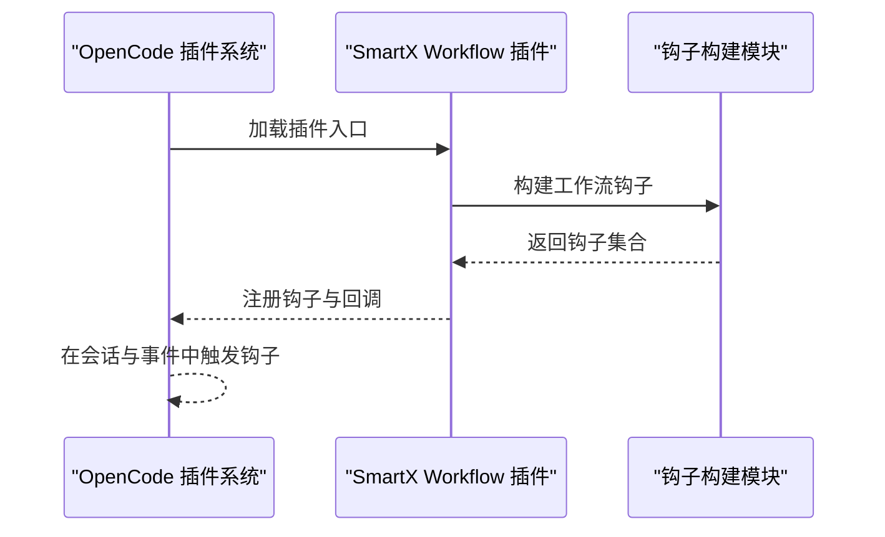
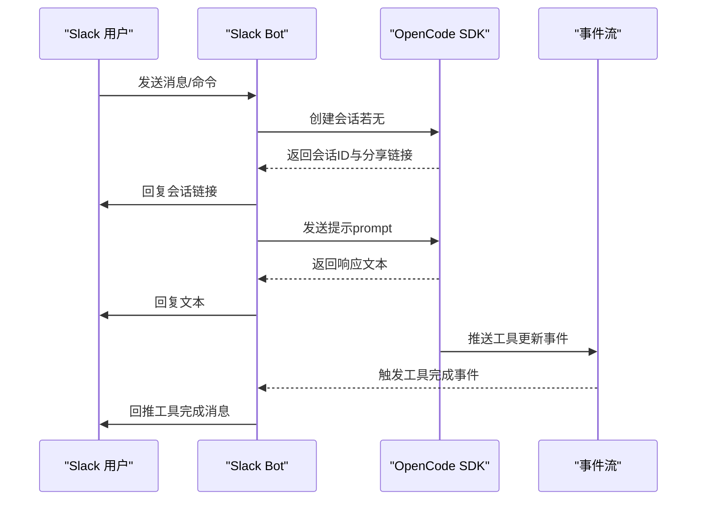
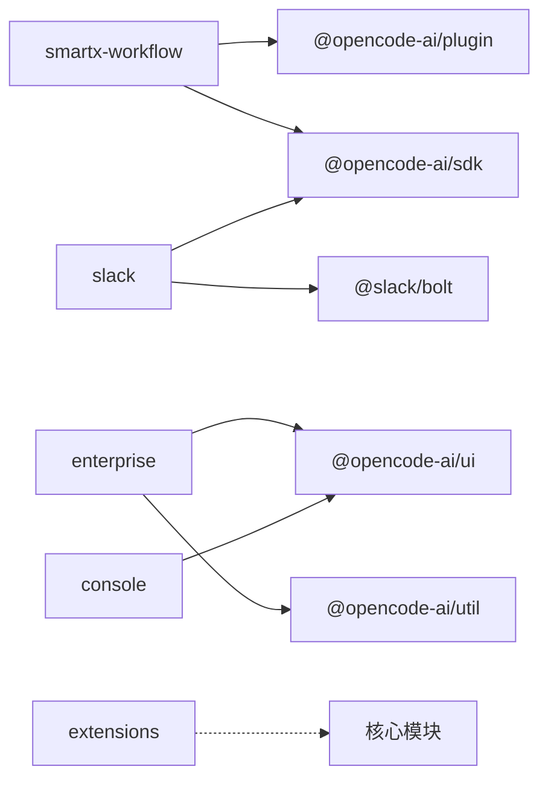

# 集成包

<cite>
**本文引用的文件**
- [packages/smartx-workflow/package.json](file://packages/smartx-workflow/package.json)
- [packages/smartx-workflow/src/index.ts](file://packages/smartx-workflow/src/index.ts)
- [packages/smartx-workflow/src/hooks.ts](file://packages/smartx-workflow/src/hooks.ts)
- [packages/slack/package.json](file://packages/slack/package.json)
- [packages/slack/src/index.ts](file://packages/slack/src/index.ts)
- [packages/enterprise/package.json](file://packages/enterprise/package.json)
- [packages/extensions/package.json](file://packages/extensions/package.json)
- [packages/console/package.json](file://packages/console/package.json)
</cite>

## 目录
1. [简介](#简介)
2. [项目结构](#项目结构)
3. [核心组件](#核心组件)
4. [架构总览](#架构总览)
5. [详细组件分析](#详细组件分析)
6. [依赖关系分析](#依赖关系分析)
7. [性能考量](#性能考量)
8. [故障排除指南](#故障排除指南)
9. [结论](#结论)
10. [附录](#附录)

## 简介
本文件系统性梳理 OpenCode 的第三方集成与企业级功能包，重点覆盖以下模块：
- smartx-workflow 工作流包：将 SmartX 工作流钩子暴露为 OpenCode 插件，实现业务流程自动化能力的统一接入。
- slack 包：通过 Slack Bolt 将 OpenCode 会话能力无缝集成到 Slack，支持消息驱动的对话与工具执行反馈。
- extensions 包：提供扩展机制，允许在不修改核心代码的前提下注入新能力或行为。
- enterprise 包：承载企业级特性与安全能力，面向云原生部署与多运行时适配。
- console 包：提供控制台管理功能，便于运维与可观测性。

这些集成包共同扩展了 OpenCode 的功能边界，满足从即时通讯平台集成、流程编排到企业化部署与管理的多样化场景。

## 项目结构
OpenCode 采用多包（monorepo）组织方式，各集成包位于 packages 目录下，彼此通过工作区依赖协同。核心集成包分布如下：
- smartx-workflow：工作流插件入口与钩子构建逻辑。
- slack：Slack 平台集成，包含 Bolt 应用与 OpenCode SDK 的桥接。
- extensions：扩展机制定义与加载框架。
- enterprise：企业级 UI、路由、安全与云部署相关依赖。
- console：控制台应用与核心模块。

图表来源
- [packages/smartx-workflow/package.json:11-14](file://packages/smartx-workflow/package.json#L11-L14)
- [packages/slack/package.json:10-13](file://packages/slack/package.json#L10-L13)
- [packages/enterprise/package.json:15-29](file://packages/enterprise/package.json#L15-L29)
- [packages/console/package.json:1-44](file://packages/console/package.json#L1-L44)

章节来源
- [packages/smartx-workflow/package.json:1-23](file://packages/smartx-workflow/package.json#L1-L23)
- [packages/slack/package.json:1-20](file://packages/slack/package.json#L1-L20)
- [packages/enterprise/package.json:1-44](file://packages/enterprise/package.json#L1-L44)
- [packages/extensions/package.json:1-44](file://packages/extensions/package.json#L1-L44)
- [packages/console/package.json:1-44](file://packages/console/package.json#L1-L44)

## 核心组件
- smartx-workflow：以插件形式导出 SmartX 工作流钩子，统一接入 OpenCode 的插件体系，实现流程编排与自动化。
- slack：基于 Slack Bolt 构建 Socket Mode 应用，订阅 OpenCode 事件流，将工具执行状态实时回推至 Slack 线程。
- extensions：提供扩展点与加载器，支持按需注入新能力，提升系统的可扩展性与可维护性。
- enterprise：整合企业级 UI、路由、安全与云原生运行时（如 Cloudflare Workers），支撑生产级部署。
- console：提供控制台应用与核心模块，用于系统管理与可观测性。

章节来源
- [packages/smartx-workflow/src/index.ts:1-10](file://packages/smartx-workflow/src/index.ts#L1-L10)
- [packages/slack/src/index.ts:1-146](file://packages/slack/src/index.ts#L1-L146)
- [packages/enterprise/package.json:15-29](file://packages/enterprise/package.json#L15-L29)
- [packages/extensions/package.json:1-44](file://packages/extensions/package.json#L1-L44)
- [packages/console/package.json:1-44](file://packages/console/package.json#L1-L44)

## 架构总览
下图展示了 Slack 集成与 OpenCode 的交互路径，以及工作流插件在系统中的定位。

图表来源
- [packages/slack/src/index.ts:17-146](file://packages/slack/src/index.ts#L17-L146)
- [packages/smartx-workflow/src/index.ts:1-10](file://packages/smartx-workflow/src/index.ts#L1-L10)

## 详细组件分析

### smartx-workflow 工作流包
- 职责与定位：将 SmartX 工作流钩子封装为 OpenCode 插件，使工作流能力可通过统一插件接口被调用与扩展。
- 关键实现要点
  - 插件入口导出：通过插件入口函数将内部钩子构建结果暴露给 OpenCode。
  - 钩子构建：由内部钩子构建模块负责组装工作流所需的生命周期回调与上下文处理。
- 依赖关系
  - 依赖 @opencode-ai/plugin 与 @opencode-ai/sdk，确保与插件体系与 SDK 的兼容。
- 使用建议
  - 在需要将外部工作流能力纳入 OpenCode 生态时，优先考虑通过该插件入口进行集成。
  - 结合事件流与会话管理，实现工作流与用户交互的闭环。

图表来源
- [packages/smartx-workflow/src/index.ts:1-10](file://packages/smartx-workflow/src/index.ts#L1-L10)
- [packages/smartx-workflow/src/hooks.ts:1-200](file://packages/smartx-workflow/src/hooks.ts#L1-L200)

章节来源
- [packages/smartx-workflow/src/index.ts:1-10](file://packages/smartx-workflow/src/index.ts#L1-L10)
- [packages/smartx-workflow/package.json:11-14](file://packages/smartx-workflow/package.json#L11-L14)

### slack 包（Slack 平台集成）
- 职责与定位：将 OpenCode 会话能力集成到 Slack，支持消息驱动的对话、会话创建与工具执行反馈。
- 关键实现要点
  - Slack Bolt 应用：使用 Socket Mode，结合机器人令牌、签名密钥与 App Token 启动应用。
  - 会话管理：根据 Slack 线程创建 OpenCode 会话，记录会话 ID、频道与线程信息。
  - 事件订阅：订阅 OpenCode 客户端事件流，当工具执行完成时推送通知至 Slack 线程。
  - 命令与消息处理：支持 /test 测试命令与普通消息，自动回复文本内容与会话链接。
- 依赖关系
  - 依赖 @opencode-ai/sdk 以连接 OpenCode 服务端；依赖 @slack/bolt 提供 Slack 事件与命令处理。
- 配置与运行
  - 环境变量：SLACK_BOT_TOKEN、SLACK_SIGNING_SECRET、SLACK_APP_TOKEN。
  - 运行脚本：开发模式直接运行入口文件；类型检查脚本用于验证类型。
- 使用建议
  - 在 Slack 中启用 Socket Mode 并正确配置令牌与密钥。
  - 利用线程隔离实现多轮对话与上下文管理。
  - 结合分享链接与事件流，提升工具执行的可见性与用户体验。

图表来源
- [packages/slack/src/index.ts:17-146](file://packages/slack/src/index.ts#L17-L146)

章节来源
- [packages/slack/src/index.ts:1-146](file://packages/slack/src/index.ts#L1-L146)
- [packages/slack/package.json:10-13](file://packages/slack/package.json#L10-L13)

### extensions 包（扩展机制）
- 职责与定位：提供扩展点与加载器，支持在不改动核心代码的情况下注入新能力或行为，增强系统的可扩展性。
- 设计原则
  - 松耦合：通过约定式接口与注册机制，避免对核心模块的直接依赖。
  - 可插拔：允许动态加载与卸载扩展，便于灰度发布与回滚。
- 典型用法
  - 在系统启动阶段扫描扩展目录，注册扩展点与回调。
  - 在关键流程中触发扩展钩子，实现横切关注点（如审计、限流、日志等）。
- 集成建议
  - 明确定义扩展接口与生命周期，确保扩展与核心模块的契约清晰。
  - 提供扩展健康检查与错误隔离，避免单个扩展影响整体稳定性。

章节来源
- [packages/extensions/package.json:1-44](file://packages/extensions/package.json#L1-L44)

### enterprise 包（企业级特性与安全）
- 职责与定位：承载企业级 UI、路由、安全与云原生部署能力，支持多运行时与生产级部署。
- 关键能力
  - UI 与路由：基于 SolidJS 与路由库，提供一致的企业级界面与导航体验。
  - 安全与合规：内置安全工具与合规检查，满足企业安全基线要求。
  - 云原生部署：支持 Cloudflare Workers 等边缘运行时，优化延迟与成本。
- 依赖关系
  - 依赖 @opencode-ai/util 与 @opencode-ai/ui，确保通用工具与 UI 组件的一致性。
  - 引入 Hono、Nitro 等运行时与 Web 框架，支撑高性能与低延迟。
- 部署建议
  - 根据目标运行时选择构建脚本（如 cloudflare 目标）。
  - 结合环境变量与密钥管理，确保敏感配置的安全存储与访问控制。

章节来源
- [packages/enterprise/package.json:15-29](file://packages/enterprise/package.json#L15-L29)
- [packages/enterprise/package.json:40-42](file://packages/enterprise/package.json#L40-L42)

### console 包（控制台管理功能）
- 职责与定位：提供控制台应用与核心模块，用于系统管理、监控与可观测性。
- 功能范围
  - 系统概览：展示关键指标与运行状态。
  - 会话与事件管理：查看与调试会话、事件流与工具执行历史。
  - 用户与权限：提供用户管理与权限控制界面。
- 依赖关系
  - 依赖 UI 组件库与通用工具，保证一致的交互体验与数据处理能力。
- 使用建议
  - 将控制台作为运维与支持团队的统一入口，结合日志与告警实现快速定位问题。
  - 对敏感操作增加二次确认与审计日志，确保变更可追溯。

章节来源
- [packages/console/package.json:1-44](file://packages/console/package.json#L1-L44)

## 依赖关系分析
- smartx-workflow 依赖插件与 SDK，确保与 OpenCode 生态的兼容性。
- slack 依赖 SDK 与 Slack Bolt，实现与 Slack 平台的双向通信。
- enterprise 依赖 UI 与工具库，支撑企业级界面与云原生部署。
- extensions 作为横切模块，与核心模块松耦合，通过接口契约协作。
- console 依赖 UI 组件，提供管理与可观测性界面。

图表来源
- [packages/smartx-workflow/package.json:11-14](file://packages/smartx-workflow/package.json#L11-L14)
- [packages/slack/package.json:10-13](file://packages/slack/package.json#L10-L13)
- [packages/enterprise/package.json:15-29](file://packages/enterprise/package.json#L15-L29)
- [packages/extensions/package.json:1-44](file://packages/extensions/package.json#L1-L44)
- [packages/console/package.json:1-44](file://packages/console/package.json#L1-L44)

章节来源
- [packages/smartx-workflow/package.json:11-14](file://packages/smartx-workflow/package.json#L11-L14)
- [packages/slack/package.json:10-13](file://packages/slack/package.json#L10-L13)
- [packages/enterprise/package.json:15-29](file://packages/enterprise/package.json#L15-L29)
- [packages/extensions/package.json:1-44](file://packages/extensions/package.json#L1-L44)
- [packages/console/package.json:1-44](file://packages/console/package.json#L1-L44)

## 性能考量
- Slack 集成
  - 使用 Socket Mode 降低网络延迟，提高事件响应速度。
  - 合理利用线程隔离减少并发冲突，提升会话处理吞吐。
- 企业级部署
  - 选择边缘运行时（如 Cloudflare Workers）以缩短用户请求路径。
  - 通过缓存与事件流减少重复计算与网络往返。
- 扩展机制
  - 控制扩展数量与复杂度，避免对主流程造成显著开销。
  - 对扩展进行资源限制与超时保护，防止雪崩效应。

## 故障排除指南
- Slack 集成
  - 症状：无法接收消息或命令。
  - 排查：检查机器人令牌、签名密钥与 App Token 是否正确配置；确认 Socket Mode 已启用。
  - 症状：工具执行完成后未收到 Slack 回推。
  - 排查：确认事件流订阅是否正常；检查工具状态是否标记为完成。
- 会话管理
  - 症状：会话创建失败或链接不可用。
  - 排查：检查 OpenCode 服务端可用性与鉴权配置；确认会话创建接口返回状态。
- 企业级部署
  - 症状：构建失败或运行时异常。
  - 排查：核对 Node 版本与运行时依赖；检查目标运行时的兼容性与配置项。
- 控制台与扩展
  - 症状：控制台页面空白或功能异常。
  - 排查：检查 UI 依赖与打包产物；确认扩展加载顺序与接口契约一致。

章节来源
- [packages/slack/src/index.ts:17-146](file://packages/slack/src/index.ts#L17-L146)
- [packages/enterprise/package.json:40-42](file://packages/enterprise/package.json#L40-L42)

## 结论
OpenCode 的集成包体系通过标准化的插件入口、平台桥接与扩展机制，有效扩展了系统的能力边界。smartx-workflow 将外部工作流能力纳入统一生态；slack 实现了与 Slack 的深度集成；extensions 提供了灵活的扩展能力；enterprise 与 console 则分别承担企业级能力与管理界面的职责。通过合理的配置与最佳实践，可在不同场景下实现稳定、可扩展且安全的集成方案。

## 附录
- 集成配置清单（示例）
  - Slack：SLACK_BOT_TOKEN、SLACK_SIGNING_SECRET、SLACK_APP_TOKEN。
  - 企业级部署：根据目标运行时调整构建脚本与环境变量。
- API 使用指引（示例）
  - 通过 OpenCode SDK 创建会话、发送提示与订阅事件流。
  - 在扩展中注册钩子与回调，实现横切关注点。
- 故障排除清单
  - 核对令牌与密钥；检查事件流与会话状态；验证运行时与依赖版本。