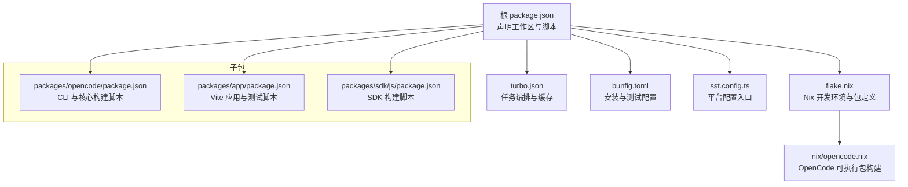
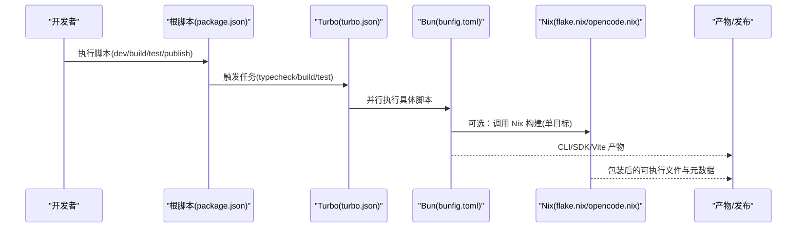
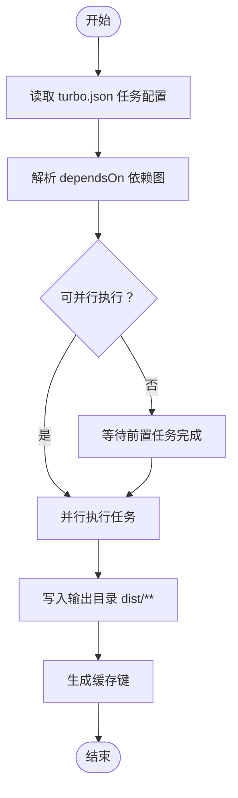
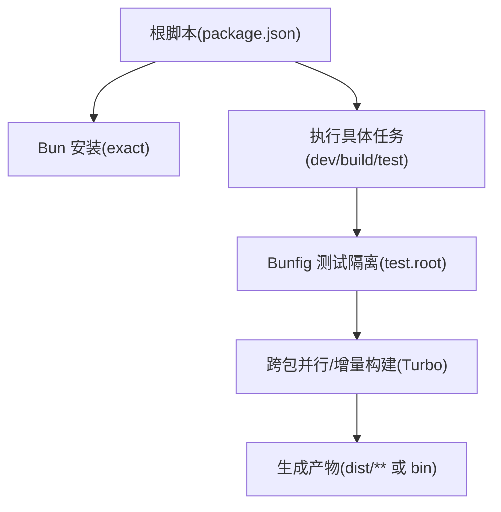
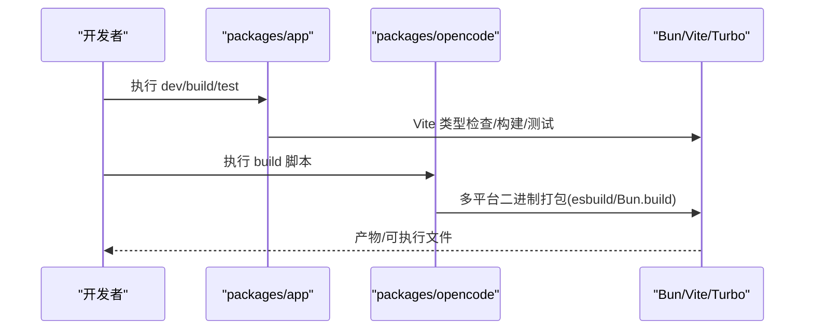
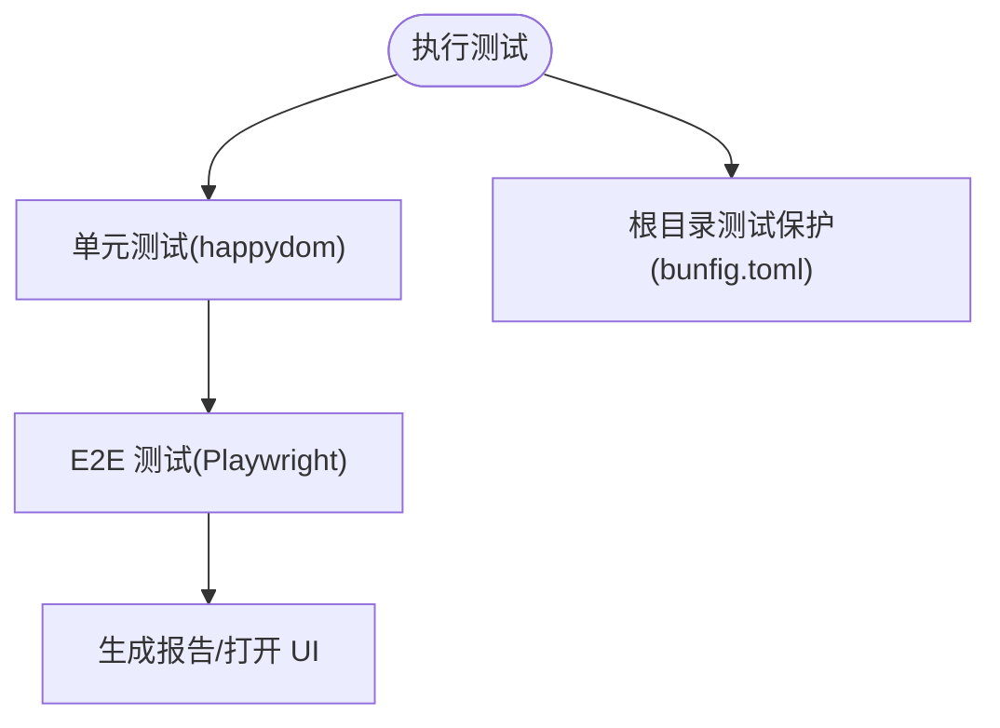
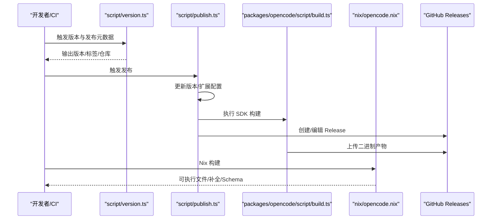
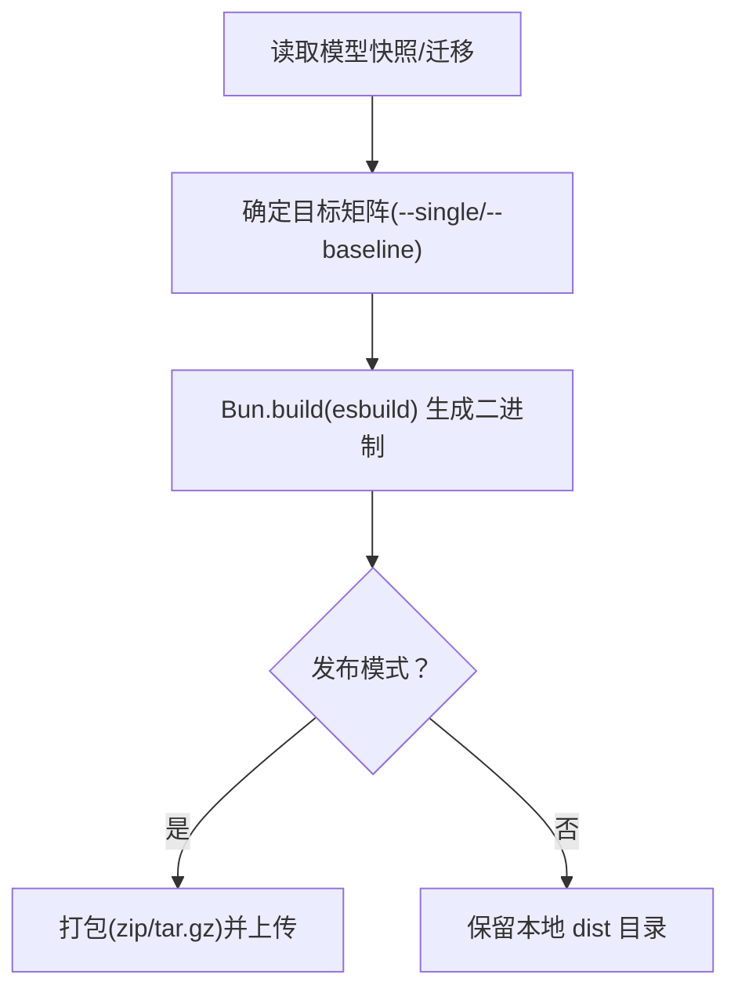
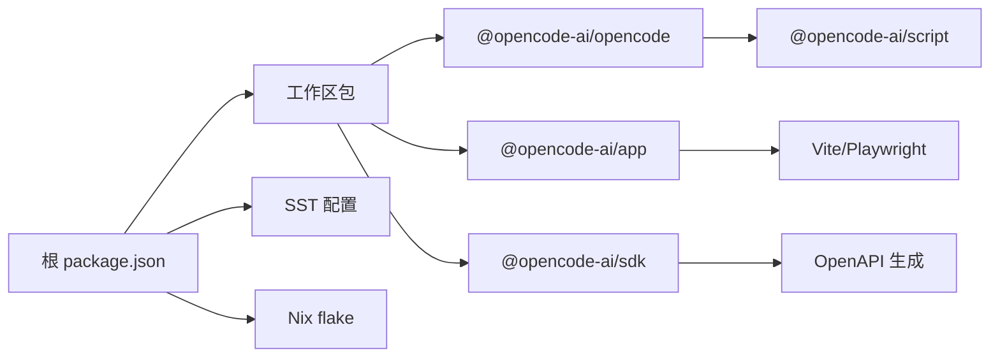

# 构建系统

<cite>
**本文引用的文件**
- [turbo.json](file://turbo.json)
- [package.json](file://package.json)
- [bunfig.toml](file://bunfig.toml)
- [sst.config.ts](file://sst.config.ts)
- [flake.nix](file://flake.nix)
- [nix/opencode.nix](file://nix/opencode.nix)
- [script/publish.ts](file://script/publish.ts)
- [script/version.ts](file://script/version.ts)
- [script/generate.ts](file://script/generate.ts)
- [packages/opencode/package.json](file://packages/opencode/package.json)
- [packages/opencode/script/build.ts](file://packages/opencode/script/build.ts)
- [packages/app/package.json](file://packages/app/package.json)
- [packages/app/vite.js](file://packages/app/vite.js)
- [packages/sdk/js/package.json](file://packages/sdk/js/package.json)
</cite>

## 目录
1. [简介](#简介)
2. [项目结构](#项目结构)
3. [核心组件](#核心组件)
4. [架构总览](#架构总览)
5. [详细组件分析](#详细组件分析)
6. [依赖关系分析](#依赖关系分析)
7. [性能考量](#性能考量)
8. [故障排除指南](#故障排除指南)
9. [结论](#结论)
10. [附录](#附录)

## 简介
本文件系统性梳理 OpenCode 的构建系统与工具链配置，重点覆盖以下方面：
- Turbo 构建系统的任务编排、缓存策略与并行执行机制
- Bun 包管理器与脚本执行策略
- 开发、测试、打包与发布的完整流程与脚本职责
- 构建性能优化技巧与常见问题排查
- 自定义构建任务的开发指南与最佳实践

## 项目结构
OpenCode 采用 Monorepo 结构，根目录通过 package.json 声明工作区与包管理器；Turbo 负责跨包的任务编排；Bun 执行脚本与构建；Nix 提供可复现的本地开发环境与打包产物；部分子包（如 packages/app）使用 Vite 进行前端构建。

图表来源
- [package.json:1-118](file://package.json#L1-L118)
- [turbo.json:1-21](file://turbo.json#L1-L21)
- [bunfig.toml:1-7](file://bunfig.toml#L1-L7)
- [sst.config.ts:1-24](file://sst.config.ts#L1-L24)
- [flake.nix:1-77](file://flake.nix#L1-L77)
- [nix/opencode.nix:1-98](file://nix/opencode.nix#L1-L98)
- [packages/opencode/package.json:1-146](file://packages/opencode/package.json#L1-L146)
- [packages/app/package.json:1-74](file://packages/app/package.json#L1-L74)
- [packages/sdk/js/package.json:1-32](file://packages/sdk/js/package.json#L1-L32)

章节来源
- [package.json:1-118](file://package.json#L1-L118)
- [turbo.json:1-21](file://turbo.json#L1-L21)
- [bunfig.toml:1-7](file://bunfig.toml#L1-L7)
- [sst.config.ts:1-24](file://sst.config.ts#L1-L24)
- [flake.nix:1-77](file://flake.nix#L1-L77)
- [nix/opencode.nix:1-98](file://nix/opencode.nix#L1-L98)

## 核心组件
- 任务编排与缓存：Turbo 在根目录集中声明任务与依赖，支持跨包并行与增量构建。
- 包管理与脚本：Bun 作为包管理器与运行时，统一执行各类脚本；根 package.json 定义常用命令。
- 平台配置：SST 配置应用在 Cloudflare 等提供商上的部署参数。
- 可复现构建：Nix 将 Node 模块与构建步骤封装为可复现的 derivation，确保本地与 CI 一致性。
- 子包构建：各子包按职责使用 Vite 或自定义脚本进行类型检查、测试与打包。

章节来源
- [turbo.json:1-21](file://turbo.json#L1-L21)
- [package.json:8-20](file://package.json#L8-L20)
- [bunfig.toml:1-7](file://bunfig.toml#L1-L7)
- [sst.config.ts:3-23](file://sst.config.ts#L3-L23)
- [nix/opencode.nix:15-98](file://nix/opencode.nix#L15-L98)

## 架构总览
下图展示从开发者到最终产物的关键路径：脚本触发 → Turbo 任务调度 → Bun 执行 → Nix 可复现构建 → 产物分发。

图表来源
- [package.json:8-20](file://package.json#L8-L20)
- [turbo.json:5-19](file://turbo.json#L5-L19)
- [bunfig.toml:1-7](file://bunfig.toml#L1-L7)
- [nix/opencode.nix:41-49](file://nix/opencode.nix#L41-L49)

## 详细组件分析

### Turbo 任务编排与缓存
- 全局环境：通过 globalEnv/globalPassThroughEnv 注入 CI 与开关变量，影响缓存命中与行为。
- 任务定义：
  - typecheck：类型检查任务，无 dependsOn，适合独立运行或被其他任务依赖。
  - build：声明输出目录 dist/**，用于缓存判定与增量构建。
  - 测试任务：opencode#test 与 @opencode-ai/app#test 明确依赖上游 build，避免未构建产物导致的失败。
- 缓存策略：基于任务输入、依赖图与输出目录判断是否命中缓存；输出目录变更会触发重新构建。
- 并行执行：不同包的任务可并行执行，依赖关系由 dependsOn 决定拓扑顺序。

图表来源
- [turbo.json:5-19](file://turbo.json#L5-L19)

章节来源
- [turbo.json:1-21](file://turbo.json#L1-L21)

### Bun 包管理器与脚本执行
- 包管理器版本：根 package.json 指定 packageManager 为 bun@1.3.10，确保团队一致性。
- 安装策略：bunfig.toml 中 install.exact=true，保证锁定依赖版本，减少漂移。
- 测试隔离：test.root 指向一个不存在的路径，防止从根目录误跑测试。
- 根脚本职责：
  - dev：启动 packages/opencode 的浏览器条件入口。
  - dev:desktop：启动桌面端开发（Tauri）。
  - build:strategy-service / build:strategy-desktop：执行特定脚本进行服务或桌面构建。
  - dev:web / dev:storybook：分别启动 Web 应用与 Storybook。
  - typecheck：委托给 turbo typecheck。
  - prepare：初始化 husky 钩子。
  - test：禁止直接在根目录运行测试（通过退出码提示）。

图表来源
- [package.json:7-20](file://package.json#L7-L20)
- [bunfig.toml:1-7](file://bunfig.toml#L1-L7)
- [turbo.json:5-19](file://turbo.json#L5-L19)

章节来源
- [package.json:7-20](file://package.json#L7-L20)
- [bunfig.toml:1-7](file://bunfig.toml#L1-L7)

### 开发流程（Web/桌面/CLI）
- Web 应用：packages/app 使用 Vite，脚本包含 dev、build、serve、单元测试与 E2E 测试。
- 桌面端：通过根脚本 dev:desktop 启动 Tauri 开发。
- CLI：packages/opencode 的脚本负责模型快照生成、迁移加载、多平台二进制打包与发布上传。

图表来源
- [packages/app/package.json:11-24](file://packages/app/package.json#L11-L24)
- [packages/opencode/script/build.ts:177-200](file://packages/opencode/script/build.ts#L177-L200)

章节来源
- [packages/app/package.json:11-24](file://packages/app/package.json#L11-L24)
- [packages/opencode/script/build.ts:1-230](file://packages/opencode/script/build.ts#L1-L230)

### 测试流程
- 单元测试：packages/app 的 test:unit 使用 happydom 预加载，支持 watch 模式。
- E2E 测试：Playwright 测试套件，支持 UI 模式与报告生成。
- 根目录测试：bunfig.toml 将 test.root 设为不可达路径，避免误运行。

图表来源
- [packages/app/package.json:17-24](file://packages/app/package.json#L17-L24)
- [bunfig.toml:4-6](file://bunfig.toml#L4-L6)

章节来源
- [packages/app/package.json:17-24](file://packages/app/package.json#L17-L24)
- [bunfig.toml:4-6](file://bunfig.toml#L4-L6)

### 打包与发布流程
- 版本与发布元数据：script/version.ts 生成版本号与 GitHub Release 元信息，并写入 GITHUB_OUTPUT。
- 发布脚本：script/publish.ts 统一更新所有 package.json 的版本、扩展版本与链接，执行 SDK 构建，必要时提交/打标签/推送，随后依次调用各子包的发布脚本。
- CLI 产物上传：packages/opencode/script/build.ts 在发布模式下将二进制打包为 zip/tar.gz 并上传至 GitHub Releases。
- Nix 包：nix/opencode.nix 在构建阶段调用 OpenCode 的构建脚本，生成可执行文件与 JSON Schema，并对程序进行包装与补全生成。

图表来源
- [script/version.ts:7-32](file://script/version.ts#L7-L32)
- [script/publish.ts:37-87](file://script/publish.ts#L37-L87)
- [packages/opencode/script/build.ts:218-227](file://packages/opencode/script/build.ts#L218-L227)
- [nix/opencode.nix:41-49](file://nix/opencode.nix#L41-L49)

章节来源
- [script/version.ts:1-35](file://script/version.ts#L1-L35)
- [script/publish.ts:1-87](file://script/publish.ts#L1-L87)
- [packages/opencode/script/build.ts:218-227](file://packages/opencode/script/build.ts#L218-L227)
- [nix/opencode.nix:41-49](file://nix/opencode.nix#L41-L49)

### CLI 构建细节（多平台二进制）
- 模型快照与迁移：构建时拉取模型快照并生成源文件，同时扫描迁移目录并排序。
- 目标矩阵：Linux/Darwin/Windows 三平台、arm64/x64 两架构、musl 与 AVX2 变体组合，支持单目标与全量目标。
- esbuild/Bun.build：使用 Bun 的构建 API，设置条件、TS 配置、插件与 define 常量，输出到 dist/<target>/bin。
- 发布上传：发布模式下将产物压缩并上传至 GitHub Releases。

图表来源
- [packages/opencode/script/build.ts:18-57](file://packages/opencode/script/build.ts#L18-L57)
- [packages/opencode/script/build.ts:63-145](file://packages/opencode/script/build.ts#L63-L145)
- [packages/opencode/script/build.ts:177-200](file://packages/opencode/script/build.ts#L177-L200)
- [packages/opencode/script/build.ts:218-227](file://packages/opencode/script/build.ts#L218-L227)

章节来源
- [packages/opencode/script/build.ts:1-230](file://packages/opencode/script/build.ts#L1-L230)

### Vite 配置与别名
- 插件链：packages/app/vite.js 集成 TailwindCSS 与 Solid 插件，并设置 worker 格式为 ES。
- 别名：将 @ 指向 src，便于模块导入。
- 与测试：配合 packages/app/package.json 的测试脚本，happydom 预加载确保 DOM 环境可用。

章节来源
- [packages/app/vite.js:1-27](file://packages/app/vite.js#L1-L27)
- [packages/app/package.json:17-24](file://packages/app/package.json#L17-L24)

### Nix 可复现构建
- 开发 Shell：提供 bun、nodejs、pkg-config、openssl、git 等工具。
- 包装与封装：nix/opencode.nix 将 node_modules 复制到 derivation，设置环境变量（版本、渠道、模型快照），执行 OpenCode 构建脚本，安装并包装可执行文件，生成 shell 补全。
- 安装检查：通过 versionCheckHook 验证版本输出，确保可执行文件正确。

章节来源
- [flake.nix:21-31](file://flake.nix#L21-L31)
- [nix/opencode.nix:15-98](file://nix/opencode.nix#L15-L98)

## 依赖关系分析
- 工作区与依赖：
  - 根 package.json 声明 workspaces 与 catalog 依赖，统一类型与工具链版本。
  - packages/opencode 依赖 @opencode-ai/script 等工作区包，驱动构建与发布。
  - packages/app 依赖 @opencode-ai/sdk、@opencode-ai/ui 等，使用 Vite 与 Playwright。
- 外部依赖：
  - SST 提供平台配置入口，Cloudflare 作为默认 home。
  - Nix 输入 nixpkgs，输出可复现的开发环境与包。

图表来源
- [package.json:21-72](file://package.json#L21-L72)
- [packages/opencode/package.json:32-32](file://packages/opencode/package.json#L32-L32)
- [packages/app/package.json:40-72](file://packages/app/package.json#L40-L72)
- [packages/sdk/js/package.json:7-10](file://packages/sdk/js/package.json#L7-L10)
- [sst.config.ts:3-23](file://sst.config.ts#L3-L23)
- [flake.nix:4-6](file://flake.nix#L4-L6)

章节来源
- [package.json:21-72](file://package.json#L21-L72)
- [packages/opencode/package.json:32-32](file://packages/opencode/package.json#L32-L32)
- [packages/app/package.json:40-72](file://packages/app/package.json#L40-L72)
- [packages/sdk/js/package.json:7-10](file://packages/sdk/js/package.json#L7-L10)
- [sst.config.ts:3-23](file://sst.config.ts#L3-L23)
- [flake.nix:4-6](file://flake.nix#L4-L6)

## 性能考量
- 并行与增量：
  - 使用 Turbo 的并行执行与缓存，优先在变更范围内增量构建。
  - 通过 dependsOn 控制任务拓扑，避免不必要的串行阻塞。
- 依赖锁定：
  - bunfig.toml 的 exact 安装策略减少版本漂移，提升缓存命中率。
- 构建粒度：
  - CLI 构建支持 --single 仅构建当前平台二进制，缩短本地开发时间。
  - 发布模式才进行多平台打包与上传，日常开发可跳过。
- 环境隔离：
  - Nix 将 Node 模块与工具链封装，避免宿主环境差异导致的性能波动。

[本节为通用建议，无需列出章节来源]

## 故障排除指南
- 根目录测试误运行：
  - 现象：在根目录执行测试会失败并提示不要从根目录运行。
  - 排查：确认使用子包脚本（如 packages/app/test:unit）。
  - 参考：[bunfig.toml:5](file://bunfig.toml#L5-L6)
- Turbo 缓存不生效：
  - 现象：修改后未触发重建或缓存命中异常。
  - 排查：检查任务输出目录是否正确（如 dist/**）、依赖图是否合理、globalEnv 是否影响缓存键。
  - 参考：[turbo.json:9](file://turbo.json#L9-L9)
- CLI 二进制缺失或不可执行：
  - 现象：发布后下载的二进制无法运行。
  - 排查：确认构建脚本已生成对应平台产物；发布脚本是否上传 zip/tar.gz；Nix 包是否正确包装。
  - 参考：[packages/opencode/script/build.ts:218-227](file://packages/opencode/script/build.ts#L218-L227)，[nix/opencode.nix:51-69](file://nix/opencode.nix#L51-L69)
- Nix 构建失败：
  - 现象：derivation 构建报错或缺少依赖。
  - 排查：确认 node_modules 来源与版本；检查 makeBinaryWrapper 与 PATH 注入；验证 versionCheckHook 的环境变量。
  - 参考：[nix/opencode.nix:20-26](file://nix/opencode.nix#L20-L26)，[nix/opencode.nix:71-84](file://nix/opencode.nix#L71-L84)

章节来源
- [bunfig.toml:4-6](file://bunfig.toml#L4-L6)
- [turbo.json:9](file://turbo.json#L9-L9)
- [packages/opencode/script/build.ts:218-227](file://packages/opencode/script/build.ts#L218-L227)
- [nix/opencode.nix:51-69](file://nix/opencode.nix#L51-L69)
- [nix/opencode.nix:71-84](file://nix/opencode.nix#L71-L84)

## 结论
OpenCode 的构建体系以 Turbo 为核心实现跨包并行与缓存，结合 Bun 的快速脚本执行与 Nix 的可复现构建，形成从开发到发布的完整闭环。通过合理的任务拓扑、精确的依赖锁定与多平台二进制打包，既保障了开发效率也确保了产物质量与一致性。

[本节为总结，无需列出章节来源]

## 附录

### 常用脚本速览
- 开发
  - 根脚本：dev、dev:desktop、dev:web、dev:storybook
  - 子包：packages/app 的 dev、packages/opencode 的 dev
- 类型检查
  - 根脚本：typecheck（委托 Turbo）
  - 子包：各自 typecheck 脚本
- 测试
  - 根脚本：test（禁止在根目录运行）
  - 子包：packages/app 的 test:unit、test:e2e 等
- 构建
  - 根脚本：build:strategy-service、build:strategy-desktop
  - 子包：packages/opencode 的 build（CLI）、packages/sdk/js 的 build
- 发布
  - 根脚本：publish（调用 script/publish.ts）
  - 版本：script/version.ts 生成版本与元数据

章节来源
- [package.json:8-20](file://package.json#L8-L20)
- [packages/opencode/package.json:8-20](file://packages/opencode/package.json#L8-L20)
- [packages/app/package.json:11-24](file://packages/app/package.json#L11-L24)
- [packages/sdk/js/package.json:7-10](file://packages/sdk/js/package.json#L7-L10)
- [script/publish.ts:37-87](file://script/publish.ts#L37-L87)
- [script/version.ts:7-32](file://script/version.ts#L7-L32)

### 自定义构建任务开发指南与最佳实践
- 任务命名与依赖
  - 使用语义化任务名（如 build、test、typecheck），明确 dependsOn 依赖，避免不必要的串行。
- 输出目录
  - 对于需要缓存的任务，声明明确的输出目录（如 dist/**），确保 Turbo 正确识别增量范围。
- 环境变量
  - 通过 globalEnv/globalPassThroughEnv 注入 CI 与功能开关，避免硬编码。
- 并行与隔离
  - 将 CPU 密集型任务拆分为多个小任务，利用 Turbo 并行；避免共享状态，必要时使用临时目录。
- 跨包脚本
  - 通过根脚本统一入口，子包脚本聚焦自身逻辑；对外暴露稳定接口（如 build.ts）。
- 发布流程
  - 版本与发布元数据集中生成；发布脚本按顺序处理 SDK、CLI、插件等子包；仅在发布模式进行打包与上传。
- Nix 集成
  - 将构建脚本与产物封装为 derivation，设置必要的环境变量与包装逻辑，确保可执行文件可用且具备补全。

[本节为通用指南，无需列出章节来源]