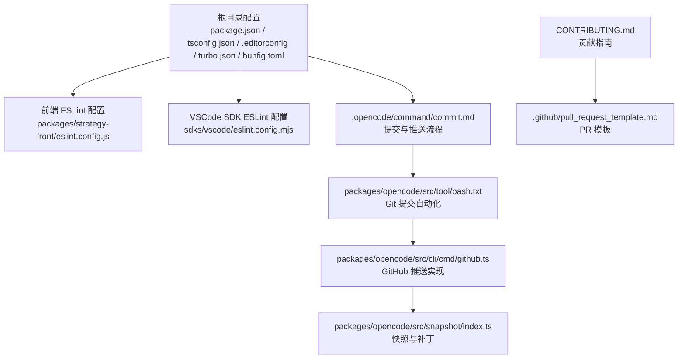
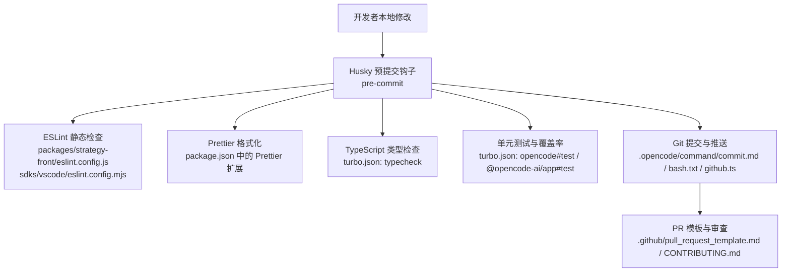
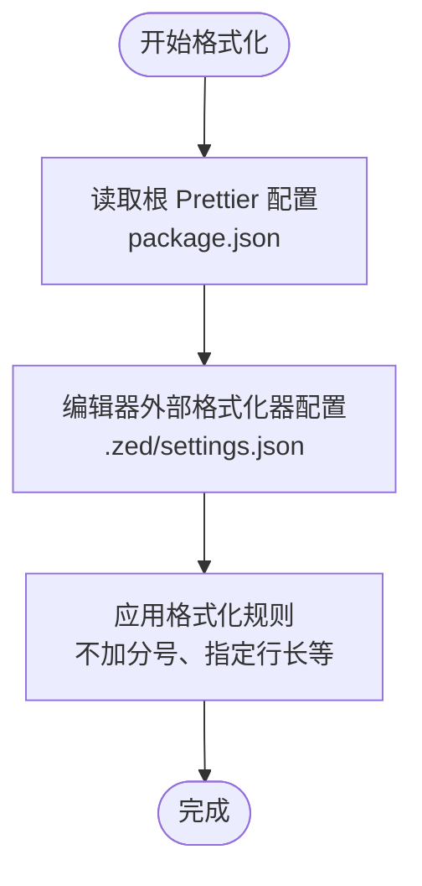
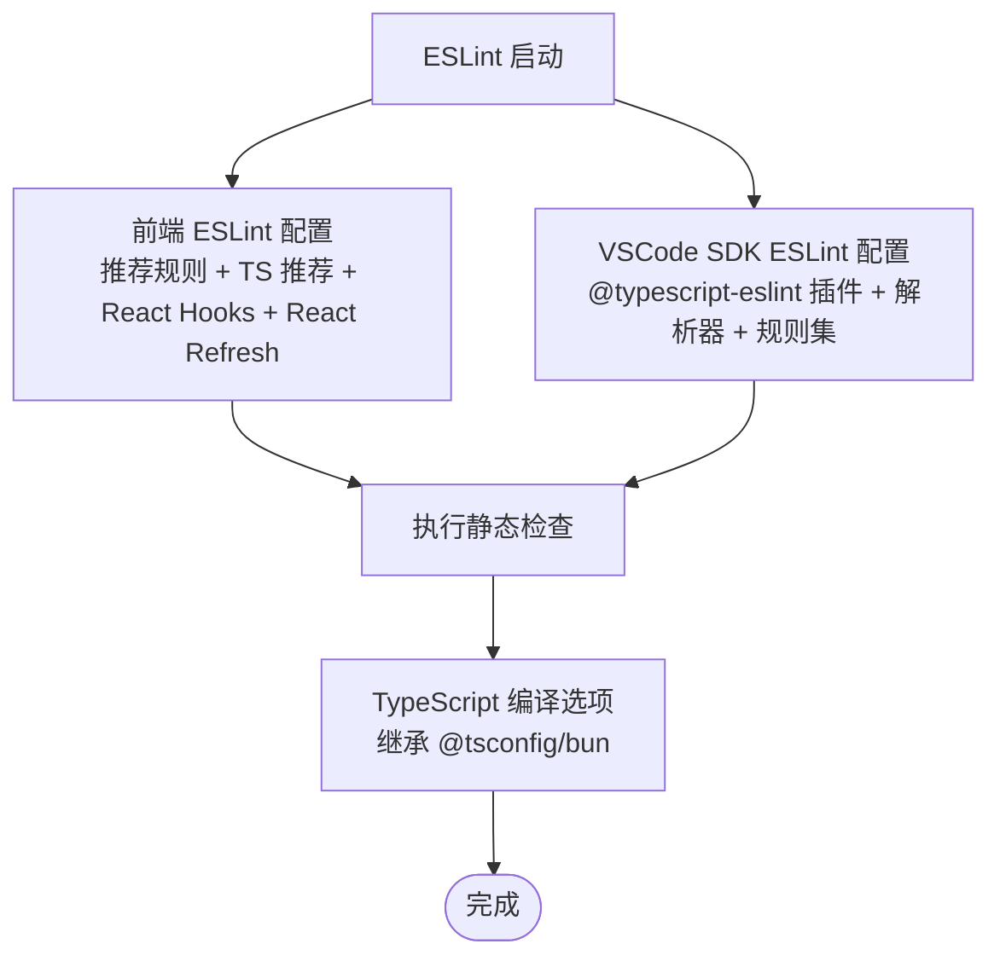
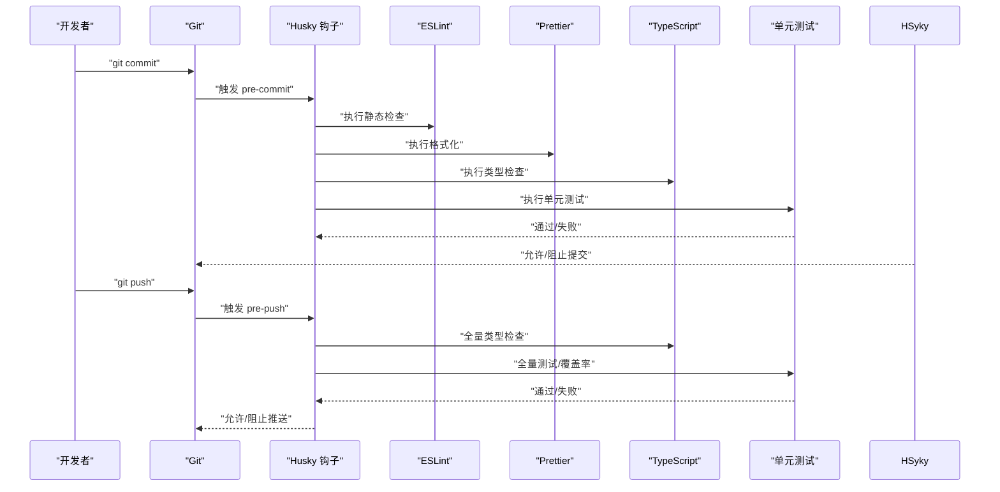
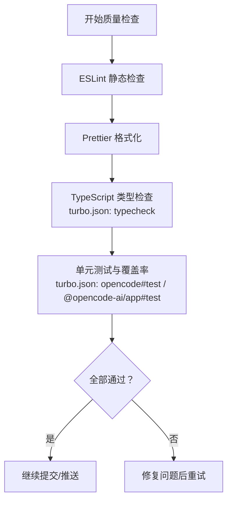
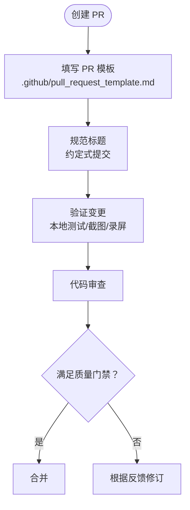
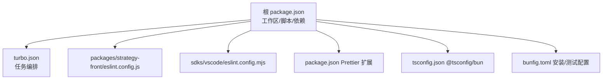
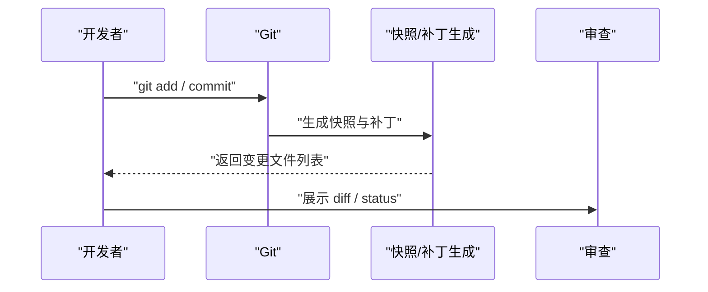

# 代码规范

<cite>
**本文引用的文件**
- [package.json](file://package.json)
- [tsconfig.json](file://tsconfig.json)
- [.editorconfig](file://.editorconfig)
- [packages/strategy-front/eslint.config.js](file://packages/strategy-front/eslint.config.js)
- [sdks/vscode/eslint.config.mjs](file://sdks/vscode/eslint.config.mjs)
- [turbo.json](file://turbo.json)
- [bunfig.toml](file://bunfig.toml)
- [CONTRIBUTING.md](file://CONTRIBUTING.md)
- [.github/pull_request_template.md](file://.github/pull_request_template.md)
- [.opencode/command/commit.md](file://.opencode/command/commit.md)
- [packages/opencode/src/tool/bash.txt](file://packages/opencode/src/tool/bash.txt)
- [packages/opencode/src/cli/cmd/github.ts](file://packages/opencode/src/cli/cmd/github.ts)
- [packages/opencode/src/snapshot/index.ts](file://packages/opencode/src/snapshot/index.ts)
- [packages/web/src/content/docs/formatters.mdx](file://packages/web/src/content/docs/formatters.mdx)
- [.zed/settings.json](file://.zed/settings.json)
</cite>

## 目录
1. [简介](#简介)
2. [项目结构](#项目结构)
3. [核心组件](#核心组件)
4. [架构总览](#架构总览)
5. [详细组件分析](#详细组件分析)
6. [依赖关系分析](#依赖关系分析)
7. [性能考虑](#性能考虑)
8. [故障排查指南](#故障排查指南)
9. [结论](#结论)
10. [附录](#附录)

## 简介
本文件为 OpenCode 项目的代码规范与质量保障文档，覆盖 TypeScript/JavaScript 编码标准、命名约定、代码风格、Git 钩子（Husky）配置、Prettier 格式化、ESLint 规则、TypeScript 编译选项、代码质量检查流程（静态分析、类型检查、单元测试）、以及代码审查与质量门禁要求。内容基于仓库中现有配置与文档进行系统化整理，帮助贡献者在不同包与工具链中保持一致的开发体验与质量标准。

## 项目结构
OpenCode 采用 Monorepo 结构，使用工作区管理多包，统一的脚本、类型检查与 Husky 配置贯穿根目录与部分子包。关键配置文件分布如下：
- 根级配置：package.json（脚本、依赖、Prettier 扩展）、tsconfig.json（TypeScript 基础配置）、.editorconfig（编辑器通用风格）、turbo.json（任务编排）、bunfig.toml（Bun 测试与安装行为）
- 质量工具：packages/strategy-front/eslint.config.js（前端 ESLint 配置）、sdks/vscode/eslint.config.mjs（VSCode SDK ESLint 配置）
- 提交与审查：CONTRIBUTING.md（贡献指南）、.github/pull_request_template.md（PR 模板）、.opencode/command/commit.md（提交命令说明）、packages/opencode/src/tool/bash.txt（自动化脚本中的 Git 提交流程）、packages/opencode/src/cli/cmd/github.ts（GitHub 推送逻辑）、packages/opencode/src/snapshot/index.ts（快照与补丁生成）

**图表来源**
- [package.json:1-118](file://package.json#L1-L118)
- [tsconfig.json:1-6](file://tsconfig.json#L1-L6)
- [.editorconfig:1-10](file://.editorconfig#L1-L10)
- [turbo.json:1-21](file://turbo.json#L1-L21)
- [bunfig.toml:1-7](file://bunfig.toml#L1-L7)
- [packages/strategy-front/eslint.config.js:1-24](file://packages/strategy-front/eslint.config.js#L1-L24)
- [sdks/vscode/eslint.config.mjs:1-35](file://sdks/vscode/eslint.config.mjs#L1-L35)
- [.opencode/command/commit.md:1-38](file://.opencode/command/commit.md#L1-L38)
- [packages/opencode/src/tool/bash.txt:77-93](file://packages/opencode/src/tool/bash.txt#L77-L93)
- [packages/opencode/src/cli/cmd/github.ts:1131-1171](file://packages/opencode/src/cli/cmd/github.ts#L1131-L1171)
- [packages/opencode/src/snapshot/index.ts:77-128](file://packages/opencode/src/snapshot/index.ts#L77-L128)
- [.github/pull_request_template.md:1-30](file://.github/pull_request_template.md#L1-L30)
- [CONTRIBUTING.md:190-312](file://CONTRIBUTING.md#L190-L312)

**章节来源**
- [package.json:1-118](file://package.json#L1-L118)
- [tsconfig.json:1-6](file://tsconfig.json#L1-L6)
- [.editorconfig:1-10](file://.editorconfig#L1-L10)
- [turbo.json:1-21](file://turbo.json#L1-L21)
- [bunfig.toml:1-7](file://bunfig.toml#L1-L7)

## 核心组件
本节概述与代码规范直接相关的配置与工具链组件及其职责：
- 包管理与脚本：根 package.json 定义了开发、构建、类型检查、准备 Husky 等脚本，并通过 Prettier 扩展统一格式化偏好。
- 类型系统：tsconfig.json 继承 @tsconfig/bun 的 TS 配置，确保各包在 Bun 环境下的一致性。
- 编辑器风格：.editorconfig 统一字符集、换行符、缩进与行长等基础风格。
- ESLint：前端与 VSCode SDK 分别提供独立配置，覆盖推荐规则、React Hooks、React Refresh、TypeScript ESLint 等。
- Turborepo：turbo.json 定义 typecheck、build、test 等任务依赖与输出，便于跨包执行与缓存。
- Bun 运行时：bunfig.toml 控制安装精确版本与测试根目录，避免从根运行测试。
- 提交与审查：贡献指南、PR 模板、提交命令文档与自动化脚本共同构成提交与审查流程。

**章节来源**
- [package.json:8-20](file://package.json#L8-L20)
- [package.json:97-100](file://package.json#L97-L100)
- [tsconfig.json:1-6](file://tsconfig.json#L1-L6)
- [.editorconfig:1-10](file://.editorconfig#L1-L10)
- [packages/strategy-front/eslint.config.js:1-24](file://packages/strategy-front/eslint.config.js#L1-L24)
- [sdks/vscode/eslint.config.mjs:1-35](file://sdks/vscode/eslint.config.mjs#L1-L35)
- [turbo.json:1-21](file://turbo.json#L1-L21)
- [bunfig.toml:1-7](file://bunfig.toml#L1-L7)
- [CONTRIBUTING.md:190-312](file://CONTRIBUTING.md#L190-L312)
- [.github/pull_request_template.md:1-30](file://.github/pull_request_template.md#L1-L30)
- [.opencode/command/commit.md:1-38](file://.opencode/command/commit.md#L1-L38)

## 架构总览
下图展示了从本地开发到提交与审查的整体流程，涵盖 Husky 预提交钩子、ESLint/TS 类型检查、Prettier 格式化、以及 PR 审查与模板要求。

**图表来源**
- [package.json:16](file://package.json#L16)
- [packages/strategy-front/eslint.config.js:1-24](file://packages/strategy-front/eslint.config.js#L1-L24)
- [sdks/vscode/eslint.config.mjs:1-35](file://sdks/vscode/eslint.config.mjs#L1-L35)
- [package.json:97-100](file://package.json#L97-L100)
- [turbo.json:5-18](file://turbo.json#L5-L18)
- [.opencode/command/commit.md:1-38](file://.opencode/command/commit.md#L1-L38)
- [packages/opencode/src/tool/bash.txt:77-93](file://packages/opencode/src/tool/bash.txt#L77-L93)
- [packages/opencode/src/cli/cmd/github.ts:1131-1171](file://packages/opencode/src/cli/cmd/github.ts#L1131-L1171)
- [.github/pull_request_template.md:1-30](file://.github/pull_request_template.md#L1-L30)
- [CONTRIBUTING.md:190-312](file://CONTRIBUTING.md#L190-L312)

## 详细组件分析

### TypeScript/JavaScript 编码标准与命名约定
- 类型系统
  - 使用 TypeScript 并继承 @tsconfig/bun 的 TS 配置，确保 Bun 环境下的类型一致性。
  - 建议优先使用精确类型，避免 any；函数尽量无副作用，参数与返回值显式标注。
- 命名约定
  - 变量与函数采用 camelCase；常量采用 UPPER_SNAKE_CASE；类与接口采用 PascalCase。
  - 导出模块与类型建议以功能语义命名，避免缩写，必要时使用清晰的前缀区分作用域。
- 控制流与错误处理
  - 优先使用链式 catch 或 Promise 风格，减少 try/catch 的滥用；避免不必要的 else 分支。
  - 错误信息应包含上下文，便于定位问题。
- 变量与可变性
  - 优先使用不可变模式，减少 let 的使用；对需要更新的状态使用明确的更新策略。
- 工具与运行时 API
  - 在合适场景使用 Bun 的原生 API（如文件操作），提升性能与一致性。

**章节来源**
- [tsconfig.json:1-6](file://tsconfig.json#L1-L6)
- [CONTRIBUTING.md:250-262](file://CONTRIBUTING.md#L250-L262)

### Prettier 格式化配置
- 根 package.json 中定义了 Prettier 扩展偏好：不加分号、最大行长等。
- 编辑器侧（例如 Zed）可通过外部格式化器调用 Prettier，确保保存即格式化。
- 文档中提供了如何禁用或自定义特定格式化器的说明，便于在不同包内灵活配置。

**图表来源**
- [package.json:97-100](file://package.json#L97-L100)
- [.zed/settings.json:1-9](file://.zed/settings.json#L1-L9)
- [packages/web/src/content/docs/formatters.mdx:78-131](file://packages/web/src/content/docs/formatters.mdx#L78-L131)

**章节来源**
- [package.json:97-100](file://package.json#L97-L100)
- [.zed/settings.json:1-9](file://.zed/settings.json#L1-L9)
- [packages/web/src/content/docs/formatters.mdx:78-131](file://packages/web/src/content/docs/formatters.mdx#L78-L131)

### ESLint 规则与 TypeScript 编译选项
- 前端 ESLint（packages/strategy-front/eslint.config.js）
  - 启用推荐规则、TypeScript ESLint 推荐规则、React Hooks 推荐规则、React Refresh 规则。
  - 语言选项设置为浏览器全局与 ECMAScript 2020。
- VSCode SDK ESLint（sdks/vscode/eslint.config.mjs）
  - 使用 @typescript-eslint 插件与解析器，启用命名约定、花括号、严格相等、禁止字面量抛出、分号等规则。
  - 语言选项设置为 ECMAScript 2022，模块化源码。
- TypeScript 编译选项
  - 继承 @tsconfig/bun 的 TS 配置，确保各包在 Bun 环境下一致的编译行为。

**图表来源**
- [packages/strategy-front/eslint.config.js:1-24](file://packages/strategy-front/eslint.config.js#L1-L24)
- [sdks/vscode/eslint.config.mjs:1-35](file://sdks/vscode/eslint.config.mjs#L1-L35)
- [tsconfig.json:1-6](file://tsconfig.json#L1-L6)

**章节来源**
- [packages/strategy-front/eslint.config.js:1-24](file://packages/strategy-front/eslint.config.js#L1-L24)
- [sdks/vscode/eslint.config.mjs:1-35](file://sdks/vscode/eslint.config.mjs#L1-L35)
- [tsconfig.json:1-6](file://tsconfig.json#L1-L6)

### Husky Git 钩子配置（预提交/预推送）
- 预提交（pre-commit）
  - 通过根脚本 prepare 安装 Husky，确保在提交前自动执行静态检查、格式化与类型检查。
  - 建议在 pre-commit 中包含：ESLint 检查、Prettier 格式化、TypeScript 类型检查、单元测试（如适用）。
- 预推送（pre-push）
  - 建议在 pre-push 中执行更严格的检查，如全量类型检查、集成测试、安全扫描等。
- 提交与推送流程
  - 自动化脚本与命令文档明确了提交与推送步骤，包括分支状态检查、冲突处理与推送策略。

**图表来源**
- [package.json:16](file://package.json#L16)
- [packages/strategy-front/eslint.config.js:1-24](file://packages/strategy-front/eslint.config.js#L1-L24)
- [sdks/vscode/eslint.config.mjs:1-35](file://sdks/vscode/eslint.config.mjs#L1-L35)
- [package.json:97-100](file://package.json#L97-L100)
- [turbo.json:5-18](file://turbo.json#L5-L18)
- [packages/opencode/src/tool/bash.txt:77-93](file://packages/opencode/src/tool/bash.txt#L77-L93)
- [packages/opencode/src/cli/cmd/github.ts:1131-1171](file://packages/opencode/src/cli/cmd/github.ts#L1131-L1171)

**章节来源**
- [package.json:16](file://package.json#L16)
- [packages/opencode/src/tool/bash.txt:77-93](file://packages/opencode/src/tool/bash.txt#L77-L93)
- [packages/opencode/src/cli/cmd/github.ts:1131-1171](file://packages/opencode/src/cli/cmd/github.ts#L1131-L1171)

### 代码质量检查流程（静态分析、类型检查、单元测试）
- 静态分析
  - ESLint：前端与 VSCode SDK 各自维护配置，确保语法与风格一致性。
  - Prettier：统一格式化，减少代码风格分歧。
- 类型检查
  - 使用 Turbo 的 typecheck 任务，按需在构建链路中串联类型检查，保证跨包一致性。
- 单元测试与覆盖率
  - turbo.json 定义了 opencode#test 与 @opencode-ai/app#test 任务，建议在 CI 中强制执行并报告覆盖率。
  - 根目录 Bun 配置禁止从根运行测试，避免误用。

**图表来源**
- [packages/strategy-front/eslint.config.js:1-24](file://packages/strategy-front/eslint.config.js#L1-L24)
- [sdks/vscode/eslint.config.mjs:1-35](file://sdks/vscode/eslint.config.mjs#L1-L35)
- [package.json:97-100](file://package.json#L97-L100)
- [turbo.json:5-18](file://turbo.json#L5-L18)
- [bunfig.toml:4-6](file://bunfig.toml#L4-L6)

**章节来源**
- [turbo.json:5-18](file://turbo.json#L5-L18)
- [bunfig.toml:4-6](file://bunfig.toml#L4-L6)

### 代码审查标准与质量门禁
- PR 模板与标题规范
  - PR 必须使用模板，明确变更类型、动机与验证方法；标题遵循约定式提交规范，支持带作用域。
- 贡献指南要点
  - 所有 PR 必须关联现有 Issue；小而聚焦；UI 变更需附截图或录屏；逻辑变更需说明如何验证。
  - 禁止大段 AI 生成文本；鼓励简短、聚焦的描述。
- 提交与推送流程
  - 提交命令文档与自动化脚本明确了提交、推送与冲突处理流程，避免交互式命令导致的问题。

**图表来源**
- [.github/pull_request_template.md:1-30](file://.github/pull_request_template.md#L1-L30)
- [CONTRIBUTING.md:190-312](file://CONTRIBUTING.md#L190-L312)
- [.opencode/command/commit.md:1-38](file://.opencode/command/commit.md#L1-L38)

**章节来源**
- [.github/pull_request_template.md:1-30](file://.github/pull_request_template.md#L1-L30)
- [CONTRIBUTING.md:190-312](file://CONTRIBUTING.md#L190-L312)
- [.opencode/command/commit.md:1-38](file://.opencode/command/commit.md#L1-L38)

## 依赖关系分析
- 包管理与工作区
  - 根 package.json 定义了工作区与 catalog 依赖，确保各包共享一致的类型与工具链版本。
- 脚本与任务编排
  - prepare 脚本用于安装 Husky；turbo.json 将 typecheck、build、test 串联，形成稳定的流水线。
- 工具链耦合
  - ESLint 与 TypeScript 配置相互依赖；Prettier 与编辑器外部格式化器协同；Bun 的安装与测试配置影响整体开发体验。

**图表来源**
- [package.json:21-72](file://package.json#L21-L72)
- [turbo.json:1-21](file://turbo.json#L1-L21)
- [packages/strategy-front/eslint.config.js:1-24](file://packages/strategy-front/eslint.config.js#L1-L24)
- [sdks/vscode/eslint.config.mjs:1-35](file://sdks/vscode/eslint.config.mjs#L1-L35)
- [package.json:97-100](file://package.json#L97-L100)
- [tsconfig.json:1-6](file://tsconfig.json#L1-L6)
- [bunfig.toml:1-7](file://bunfig.toml#L1-L7)

**章节来源**
- [package.json:21-72](file://package.json#L21-L72)
- [turbo.json:1-21](file://turbo.json#L1-L21)

## 性能考虑
- 类型检查与测试并行化
  - 利用 Turbo 的任务依赖与缓存机制，将 typecheck 与 build 串接，减少重复计算。
- 格式化与静态检查
  - 在 pre-commit 中仅执行快速检查，避免阻塞提交；在 pre-push 中执行更全面的检查。
- Bun 运行时
  - 使用 Bun 的原生 API 与精确安装策略，降低启动与安装成本。

[本节为通用指导，无需具体文件分析]

## 故障排查指南
- 从根运行测试被阻止
  - 根因：bunfig.toml 显式禁止从根运行测试，防止误用。
  - 处理：进入具体包目录执行测试命令。
- ESLint/TS 配置不一致
  - 根因：不同包使用不同的 ESLint 配置或 TS 版本。
  - 处理：统一继承 @tsconfig/bun；在各自包内补充最小化配置。
- Prettier 格式化未生效
  - 根因：编辑器外部格式化器未正确指向 Prettier。
  - 处理：检查 .zed/settings.json 或 IDE 设置，确保调用 bunx prettier。
- 提交被钩子阻止
  - 根因：ESLint/Prettier/TS 测试失败或未通过。
  - 处理：先在本地修复问题，再重新提交；必要时查看 Husky 输出日志定位失败原因。

**章节来源**
- [bunfig.toml:4-6](file://bunfig.toml#L4-L6)
- [packages/strategy-front/eslint.config.js:1-24](file://packages/strategy-front/eslint.config.js#L1-L24)
- [sdks/vscode/eslint.config.mjs:1-35](file://sdks/vscode/eslint.config.mjs#L1-L35)
- [package.json:97-100](file://package.json#L97-L100)
- [packages/opencode/src/tool/bash.txt:77-93](file://packages/opencode/src/tool/bash.txt#L77-L93)

## 结论
OpenCode 的代码规范围绕“统一配置、明确流程、严格门禁”展开：通过根级配置与工作区管理确保一致性，借助 ESLint、Prettier、TypeScript 与 Turbo 实现高质量的静态分析与类型检查，结合 Husky 钩子与 PR 模板形成可靠的提交与审查流程。建议在新增包时复用现有配置模板，保持风格与质量标准的统一。

[本节为总结性内容，无需具体文件分析]

## 附录
- 快照与补丁生成（与提交流程相关）
  - 通过 Git 命令生成快照与补丁，用于追踪变更与回滚，辅助提交与审查过程中的变更可视化。

**图表来源**
- [packages/opencode/src/snapshot/index.ts:77-128](file://packages/opencode/src/snapshot/index.ts#L77-L128)

**章节来源**
- [packages/opencode/src/snapshot/index.ts:77-128](file://packages/opencode/src/snapshot/index.ts#L77-L128)