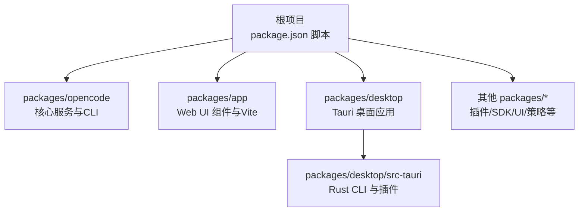
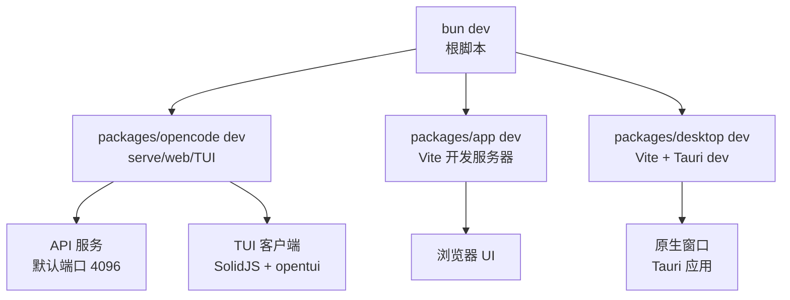
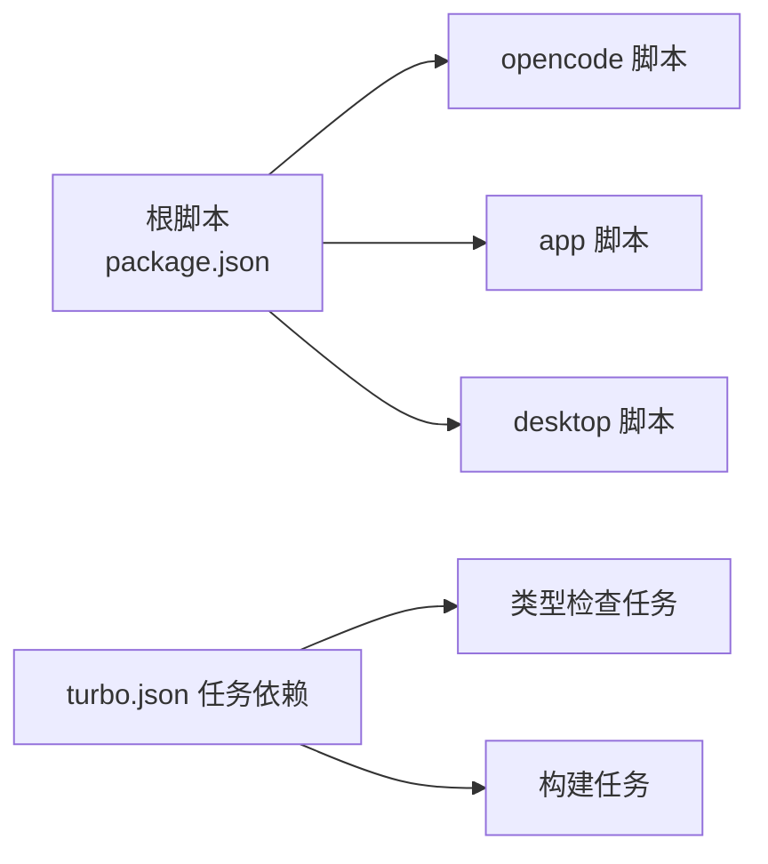

# 开发任务

<cite>
**本文引用的文件**
- [package.json](file://package.json)
- [turbo.json](file://turbo.json)
- [bunfig.toml](file://bunfig.toml)
- [README.md](file://README.md)
- [CONTRIBUTING.md](file://CONTRIBUTING.md)
- [packages/opencode/package.json](file://packages/opencode/package.json)
- [packages/app/package.json](file://packages/app/package.json)
- [packages/desktop/package.json](file://packages/desktop/package.json)
- [packages/opencode/bunfig.toml](file://packages/opencode/bunfig.toml)
- [packages/app/bunfig.toml](file://packages/app/bunfig.toml)
- [packages/desktop/src-tauri/Cargo.toml](file://packages/desktop/src-tauri/Cargo.toml)
</cite>

## 目录
1. [简介](#简介)
2. [项目结构](#项目结构)
3. [核心组件](#核心组件)
4. [架构总览](#架构总览)
5. [详细组件分析](#详细组件分析)
6. [依赖关系分析](#依赖关系分析)
7. [性能考虑](#性能考虑)
8. [故障排查指南](#故障排查指南)
9. [结论](#结论)
10. [附录](#附录)

## 简介
本文件面向OpenCode项目的日常开发与工具使用，覆盖本地环境搭建（Bun安装、依赖安装、开发服务器启动）、bun dev命令的多种运行模式（serve、web、TUI等）、API服务器与Web应用的独立运行方法、桌面应用开发流程与Tauri构建过程，并提供调试技巧、断点设置与远程调试配置，以及常见开发场景的最佳实践。

## 项目结构
OpenCode采用Monorepo结构，根目录通过包管理器脚本统一调度各子包。核心开发相关目录与职责如下：
- 根包：定义全局脚本、工作区与共享配置
- packages/opencode：核心业务逻辑与服务端入口
- packages/app：共享Web UI组件与Vite开发服务器
- packages/desktop：Tauri原生桌面应用包装
- packages/desktop/src-tauri：Tauri后端（Rust）工程配置
- 其他packages/*：插件、SDK、UI、策略等模块

图表来源
- [package.json:8-20](file://package.json#L8-L20)
- [packages/opencode/package.json:8-23](file://packages/opencode/package.json#L8-L23)
- [packages/app/package.json:11-24](file://packages/app/package.json#L11-L24)
- [packages/desktop/package.json:7-14](file://packages/desktop/package.json#L7-L14)

章节来源
- [package.json:8-20](file://package.json#L8-L20)
- [packages/opencode/package.json:8-23](file://packages/opencode/package.json#L8-L23)
- [packages/app/package.json:11-24](file://packages/app/package.json#L11-L24)
- [packages/desktop/package.json:7-14](file://packages/desktop/package.json#L7-L14)

## 核心组件
- 根脚本与工作区
  - 根package.json定义了开发与构建脚本，如dev、dev:web、dev:desktop、dev:storybook等，并声明工作区范围。
  - turbo.json定义了类型检查与构建任务的依赖关系。
  - bunfig.toml在根目录限制测试根目录与安装行为。
- opencode包
  - 提供核心服务与CLI入口，支持浏览器条件加载与本地开发脚本。
  - 包含类型检查、测试、构建、数据库工具等脚本。
- app包
  - 基于Vite的Web应用开发与预览，提供单元测试与端到端测试脚本。
- desktop包
  - Tauri应用的前端包装，提供Vite开发、构建与Tauri CLI集成脚本。
  - src-tauri为Rust后端，包含插件与平台依赖。

章节来源
- [package.json:8-20](file://package.json#L8-L20)
- [turbo.json:5-19](file://turbo.json#L5-L19)
- [bunfig.toml:1-7](file://bunfig.toml#L1-L7)
- [packages/opencode/package.json:8-23](file://packages/opencode/package.json#L8-L23)
- [packages/app/package.json:11-24](file://packages/app/package.json#L11-L24)
- [packages/desktop/package.json:7-14](file://packages/desktop/package.json#L7-L14)
- [packages/opencode/bunfig.toml:1-8](file://packages/opencode/bunfig.toml#L1-L8)
- [packages/app/bunfig.toml:1-4](file://packages/app/bunfig.toml#L1-L4)
- [packages/desktop/src-tauri/Cargo.toml:1-76](file://packages/desktop/src-tauri/Cargo.toml#L1-L76)

## 架构总览
OpenCode的开发与运行由多层组件协同完成：
- 命令层：根脚本统一入口，分发到具体包的开发或构建脚本
- 服务层：opencode核心服务（API + TUI），可独立运行或与Web UI协作
- 前端层：packages/app提供Web UI；packages/desktop包装为原生桌面应用
- 工具层：Vite、Tauri CLI、Turbo、Bun等

图表来源
- [package.json:8-20](file://package.json#L8-L20)
- [packages/opencode/package.json:8-23](file://packages/opencode/package.json#L8-L23)
- [packages/app/package.json:11-24](file://packages/app/package.json#L11-L24)
- [packages/desktop/package.json:7-14](file://packages/desktop/package.json#L7-L14)

## 详细组件分析

### 本地开发环境搭建
- 环境要求
  - 需要Bun 1.3+（根package.json声明）
- 安装步骤
  - 在仓库根目录执行依赖安装
  - 启动开发服务器（见下一节）

章节来源
- [package.json:34-40](file://package.json#L34-L40)
- [CONTRIBUTING.md:32-41](file://CONTRIBUTING.md#L32-L41)

### bun dev命令与运行模式
- 常用模式
  - serve：以无头模式启动API服务（默认端口4096）
  - web：启动API服务并在浏览器中打开Web界面
  - TUI：在指定目录启动终端用户界面（可传入目标路径）
- 运行方式差异
  - serve：仅API服务，适合后端联调与SDK测试
  - web：同时启动API与Web前端，适合全栈联调
  - TUI：直接进入交互式终端界面，适合探索与编辑
- 参考命令
  - 开发帮助与模式：参见贡献指南中的“Understanding bun dev vs opencode”小节
  - 端口自定义：serve模式支持指定端口参数

章节来源
- [CONTRIBUTING.md:79-95](file://CONTRIBUTING.md#L79-L95)
- [CONTRIBUTING.md:97-109](file://CONTRIBUTING.md#L97-L109)

### API服务器与Web应用的独立运行
- API服务器
  - 启动：在根目录执行serve命令
  - 端口：默认4096，可通过参数指定
- Web应用
  - 启动：先确保API服务已运行，再在packages/app目录启动Vite开发服务器
  - 访问：通常为本地端口（输出中可见）
- 注意事项
  - Web应用需要API服务才能获得完整功能

章节来源
- [CONTRIBUTING.md:97-122](file://CONTRIBUTING.md#L97-L122)

### 桌面应用开发流程与Tauri构建
- 开发流程
  - 启动Web开发服务器：在packages/desktop目录执行dev脚本
  - 启动原生窗口：在packages/desktop目录执行tauri dev
  - 若仅需Web开发，不启动原生壳：使用dev脚本即可
- 构建流程
  - 生产构建：在packages/desktop目录执行tauri build
  - 构建前会自动执行build脚本（typecheck + vite build）
- 平台依赖
  - Tauri需要Rust工具链与平台特定库，请参考贡献指南中的前置要求链接

章节来源
- [CONTRIBUTING.md:124-151](file://CONTRIBUTING.md#L124-L151)
- [packages/desktop/package.json:7-14](file://packages/desktop/package.json#L7-L14)
- [packages/desktop/src-tauri/Cargo.toml:20-51](file://packages/desktop/src-tauri/Cargo.toml#L20-L51)

### 调试技巧、断点设置与远程调试
- 推荐方式
  - 使用Bun的inspect能力，手动以指定inspect地址运行并连接调试器
  - 对于TUI断点，可能需要使用spawn变体以避免worker线程导致的断点映射问题
- 分离调试
  - 分别调试服务端与TUI客户端，通过attach方式连接
- 环境变量
  - 可导出BUN_OPTIONS以固定inspect地址，减少每次输入
- VSCode配置
  - 可参考贡献指南提供的示例配置文件进行调试

章节来源
- [CONTRIBUTING.md:158-188](file://CONTRIBUTING.md#L158-L188)

### 常见开发场景与最佳实践
- 快速启动
  - 根据当前任务选择对应脚本：bun dev（TUI）、bun dev:web（Web联调）、bun dev:desktop（桌面）
- 类型检查与测试
  - 使用根级turbo任务与各包内typecheck脚本
  - 单元测试与端到端测试分别在app包中提供脚本
- 生成SDK与相关文件
  - 当API或SDK有变更时，按贡献指南建议运行生成脚本以更新SDK

章节来源
- [package.json:15-19](file://package.json#L15-L19)
- [turbo.json:5-19](file://turbo.json#L5-L19)
- [packages/app/package.json:12-24](file://packages/app/package.json#L12-L24)
- [CONTRIBUTING.md:153-154](file://CONTRIBUTING.md#L153-L154)

## 依赖关系分析
- 根脚本对子包的依赖
  - 根脚本通过工作区与子包脚本解耦，实现按需启动
- 任务依赖
  - turbo定义了类型检查与构建任务的依赖关系
- 包内脚本
  - 各包的dev/build/test等脚本相互独立，便于局部开发与验证

图表来源
- [package.json:8-20](file://package.json#L8-L20)
- [turbo.json:5-19](file://turbo.json#L5-L19)

章节来源
- [package.json:8-20](file://package.json#L8-L20)
- [turbo.json:5-19](file://turbo.json#L5-L19)

## 性能考虑
- 使用Vite作为开发服务器，具备快速热更新与模块预构建优势
- 通过工作区与turbo任务减少重复编译与测试开销
- 在大型monorepo中，合理拆分任务与缓存可显著提升迭代效率

## 故障排查指南
- 测试根目录
  - 根bunfig.toml限制测试根目录，避免从根目录误跑测试
- 测试预加载
  - app包与opencode包分别配置了测试预加载文件，确保测试环境一致性
- Tauri构建失败
  - 检查Rust工具链与平台依赖是否满足src-tauri中的声明
- 断点无效
  - 尝试使用spawn变体或分离调试服务端与TUI客户端

章节来源
- [bunfig.toml:4-5](file://bunfig.toml#L4-L5)
- [packages/app/bunfig.toml:1-4](file://packages/app/bunfig.toml#L1-L4)
- [packages/opencode/bunfig.toml:3-8](file://packages/opencode/bunfig.toml#L3-L8)
- [packages/desktop/src-tauri/Cargo.toml:20-51](file://packages/desktop/src-tauri/Cargo.toml#L20-L51)
- [CONTRIBUTING.md:158-188](file://CONTRIBUTING.md#L158-L188)

## 结论
通过根脚本与工作区的统一调度，OpenCode实现了API服务、Web UI与桌面应用的高效开发与联调。遵循本文档的环境搭建、运行模式与调试实践，可显著提升日常开发效率与稳定性。

## 附录
- 官方文档与社区
  - 文档入口与社区链接详见README
- 贡献指南
  - 详细的开发流程、调试与PR规范详见贡献指南

章节来源
- [README.md:115-118](file://README.md#L115-L118)
- [CONTRIBUTING.md:1-312](file://CONTRIBUTING.md#L1-L312)