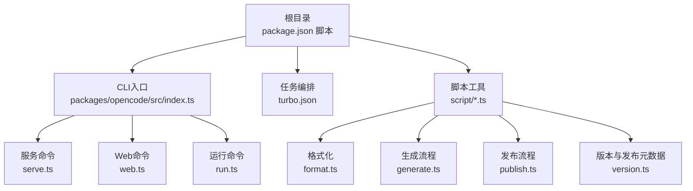
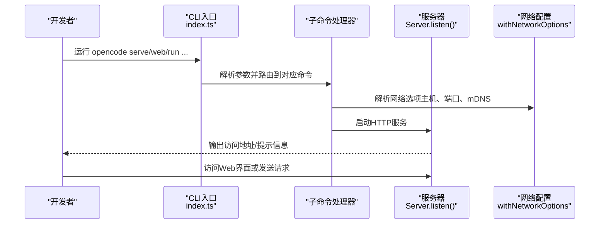
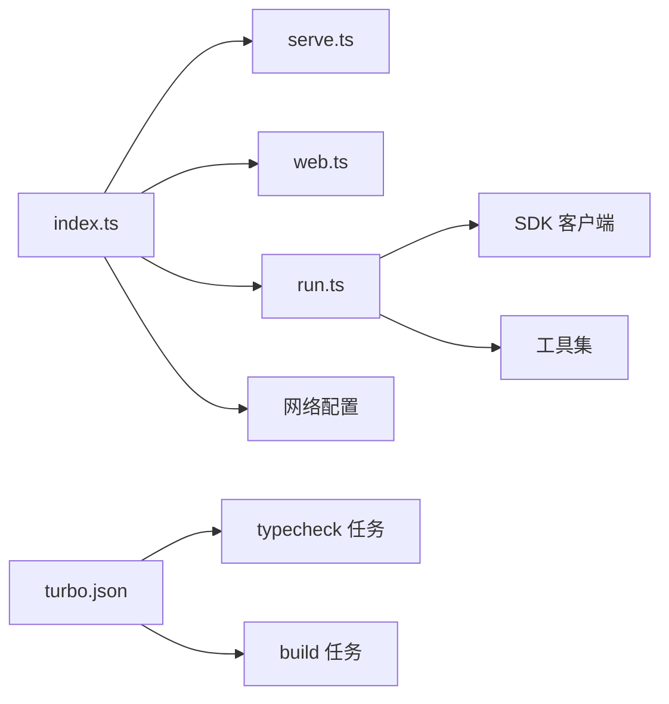

# 开发命令详解

<cite>
**本文引用的文件**
- [package.json](file://package.json)
- [bunfig.toml](file://bunfig.toml)
- [turbo.json](file://turbo.json)
- [packages/opencode/src/index.ts](file://packages/opencode/src/index.ts)
- [packages/opencode/src/cli/cmd/run.ts](file://packages/opencode/src/cli/cmd/run.ts)
- [packages/opencode/src/cli/cmd/serve.ts](file://packages/opencode/src/cli/cmd/serve.ts)
- [packages/opencode/src/cli/cmd/web.ts](file://packages/opencode/src/cli/cmd/web.ts)
- [script/format.ts](file://script/format.ts)
- [script/generate.ts](file://script/generate.ts)
- [script/publish.ts](file://script/publish.ts)
- [script/version.ts](file://script/version.ts)
</cite>

## 目录
1. [简介](#简介)
2. [项目结构](#项目结构)
3. [核心组件](#核心组件)
4. [架构总览](#架构总览)
5. [详细组件分析](#详细组件分析)
6. [依赖分析](#依赖分析)
7. [性能考虑](#性能考虑)
8. [故障排查指南](#故障排查指南)
9. [结论](#结论)
10. [附录](#附录)

## 简介
本文件面向OpenCode项目的开发者与贡献者，系统性梳理并解释各类开发命令与脚本工具，重点覆盖以下方面：
- bun dev命令的多种运行模式：服务模式、Web应用模式、TUI（文本用户界面）模式
- API服务器与Web应用的独立运行方法与配置选项
- 桌面应用开发流程（Tauri）与跨平台打包要点
- 调试命令与测试脚本的使用方法
- 性能监控与日志查看命令
- 批量操作与自动化脚本的使用指南

## 项目结构
OpenCode采用Monorepo组织方式，根目录通过Bun工作区管理多包。开发命令主要集中在根package.json的scripts中，并辅以Turbo进行类型检查与构建任务编排；核心CLI入口位于packages/opencode/src/index.ts，负责解析子命令并分派到具体功能模块。

图表来源
- [package.json:8-20](file://package.json#L8-L20)
- [packages/opencode/src/index.ts:50-167](file://packages/opencode/src/index.ts#L50-L167)
- [turbo.json:1-21](file://turbo.json#L1-L21)

章节来源
- [package.json:8-20](file://package.json#L8-L20)
- [turbo.json:1-21](file://turbo.json#L1-L21)

## 核心组件
- 根脚本与工作区
  - 根package.json定义了开发、构建、类型检查、Storybook、桌面应用等常用脚本，统一通过Bun执行。
  - 工作区配置涵盖多个packages与SDK，便于跨包开发与依赖管理。
- CLI入口与命令体系
  - packages/opencode/src/index.ts作为CLI入口，注册大量子命令，包括run、serve、web、debug、stats等，支持本地数据库迁移、日志初始化、错误处理等。
- 脚本工具
  - script目录提供格式化、生成、发布、版本管理等自动化脚本，贯穿开发到发布的全流程。

章节来源
- [package.json:8-20](file://package.json#L8-L20)
- [packages/opencode/src/index.ts:1-214](file://packages/opencode/src/index.ts#L1-L214)
- [script/format.ts:1-6](file://script/format.ts#L1-L6)
- [script/generate.ts:1-10](file://script/generate.ts#L1-L10)
- [script/publish.ts:1-87](file://script/publish.ts#L1-L87)
- [script/version.ts:1-35](file://script/version.ts#L1-L35)

## 架构总览
下图展示从命令行到具体功能模块的调用链路，以及与服务器、网络配置的关系。

图表来源
- [packages/opencode/src/index.ts:126-147](file://packages/opencode/src/index.ts#L126-L147)
- [packages/opencode/src/cli/cmd/serve.ts:9-24](file://packages/opencode/src/cli/cmd/serve.ts#L9-L24)
- [packages/opencode/src/cli/cmd/web.ts:31-81](file://packages/opencode/src/cli/cmd/web.ts#L31-L81)

## 详细组件分析

### 1) 开发命令与运行模式
- 根脚本
  - dev：在浏览器条件下运行核心CLI入口，适合快速迭代与调试。
  - dev:web：进入packages/app并启动其开发服务器，用于Web应用开发。
  - dev:desktop：使用Tauri在packages/desktop中启动桌面应用开发。
  - dev:storybook：在packages/storybook中启动Storybook文档站点。
  - typecheck：通过Turbo执行全仓库类型检查。
- 运行模式说明
  - 服务模式（serve）：启动无头API服务器，监听指定网络接口与端口，可设置密码保护。
  - Web应用模式（web）：启动API服务器并自动打开浏览器，同时显示本地与网络访问地址，支持mDNS发现。
  - TUI模式（run）：在终端内直接运行与交互，支持会话继续、文件附件、模型选择、权限控制等。

章节来源
- [package.json:8-20](file://package.json#L8-L20)
- [packages/opencode/src/cli/cmd/serve.ts:9-24](file://packages/opencode/src/cli/cmd/serve.ts#L9-L24)
- [packages/opencode/src/cli/cmd/web.ts:31-81](file://packages/opencode/src/cli/cmd/web.ts#L31-L81)
- [packages/opencode/src/cli/cmd/run.ts:221-677](file://packages/opencode/src/cli/cmd/run.ts#L221-L677)

### 2) API服务器与Web应用的独立运行
- 独立运行API服务器
  - 使用opencode serve启动无头服务器，自动解析网络选项（主机、端口、mDNS），若未设置密码则输出安全警告。
  - 可通过环境变量OPENCODE_SERVER_PASSWORD设置密码，增强安全性。
- 独立运行Web应用
  - 使用opencode web启动服务器并在浏览器中打开界面，自动识别本地回环与网络IP，支持mDNS域名展示。
  - 当绑定到0.0.0.0时，优先打开localhost，同时列出其他可用网络IP供远程访问。

章节来源
- [packages/opencode/src/cli/cmd/serve.ts:9-24](file://packages/opencode/src/cli/cmd/serve.ts#L9-L24)
- [packages/opencode/src/cli/cmd/web.ts:31-81](file://packages/opencode/src/cli/cmd/web.ts#L31-L81)

### 3) 桌面应用开发流程（Tauri）
- 开发启动
  - 使用dev:desktop脚本在packages/desktop中启动Tauri开发模式，支持热重载与调试。
- 构建与打包
  - 项目提供策略脚本用于构建策略服务与桌面端构建，结合Nix与脚本实现跨平台打包与签名。
  - 发布流程脚本会更新各包版本、扩展版本、生成SDK并推送标签与发布。

章节来源
- [package.json:10-10](file://package.json#L10-L10)
- [script/publish.ts:57-84](file://script/publish.ts#L57-L84)

### 4) 调试命令与测试脚本
- 调试命令
  - CLI入口支持--print-logs与--log-level选项，按需打印日志到stderr并设置日志级别。
  - 提供debug、stats等命令，便于问题定位与性能分析。
- 测试脚本
  - 根目录禁用了直接在根目录运行测试的行为，避免误触发。
  - 类型检查通过turbo.json配置，按构建依赖顺序执行。

章节来源
- [packages/opencode/src/index.ts:58-86](file://packages/opencode/src/index.ts#L58-L86)
- [packages/opencode/src/index.ts:132-141](file://packages/opencode/src/index.ts#L132-L141)
- [bunfig.toml:4-6](file://bunfig.toml#L4-L6)
- [turbo.json:5-19](file://turbo.json#L5-L19)

### 5) 性能监控与日志查看
- 日志初始化
  - CLI入口在中间件中初始化日志系统，本地开发默认DEBUG级别，非本地为INFO。
  - 支持将日志输出到stderr，便于在容器或CI环境中查看。
- 性能相关
  - stats命令可用于查看统计信息；数据库迁移阶段提供进度反馈，帮助定位性能瓶颈。

章节来源
- [packages/opencode/src/index.ts:67-86](file://packages/opencode/src/index.ts#L67-L86)
- [packages/opencode/src/index.ts:87-122](file://packages/opencode/src/index.ts#L87-L122)
- [packages/opencode/src/index.ts:141-141](file://packages/opencode/src/index.ts#L141-L141)

### 6) 批量操作与自动化脚本
- 格式化
  - format.ts通过Bun的$执行Prettier对项目进行格式化。
- 生成流程
  - generate.ts依次执行SDK构建、生成命令、格式化，形成“生成-校验-美化”的闭环。
- 版本与发布
  - version.ts根据最新release生成变更摘要，创建或更新GitHub Release，并输出元数据。
  - publish.ts遍历所有package.json统一升级版本、更新扩展版本与下载链接、重新安装依赖、构建SDK，并在必要时推送标签与发布。

章节来源
- [script/format.ts:1-6](file://script/format.ts#L1-L6)
- [script/generate.ts:1-10](file://script/generate.ts#L1-L10)
- [script/version.ts:1-35](file://script/version.ts#L1-L35)
- [script/publish.ts:37-58](file://script/publish.ts#L37-L58)
- [script/publish.ts:76-84](file://script/publish.ts#L76-L84)

## 依赖分析
- 命令到模块的依赖关系
  - CLI入口依赖各命令模块（serve、web、run等），并通过网络配置模块解析主机、端口与mDNS。
  - run命令依赖SDK客户端、服务器桥接与工具集，支持文件附件、权限控制与事件流渲染。
- 任务编排
  - turbo.json定义了typecheck、build等任务的依赖与输出，确保类型检查与构建顺序正确。

图表来源
- [packages/opencode/src/index.ts:126-147](file://packages/opencode/src/index.ts#L126-L147)
- [packages/opencode/src/cli/cmd/serve.ts:1-24](file://packages/opencode/src/cli/cmd/serve.ts#L1-L24)
- [packages/opencode/src/cli/cmd/web.ts:1-81](file://packages/opencode/src/cli/cmd/web.ts#L1-L81)
- [packages/opencode/src/cli/cmd/run.ts:1-677](file://packages/opencode/src/cli/cmd/run.ts#L1-L677)
- [turbo.json:5-19](file://turbo.json#L5-L19)

章节来源
- [packages/opencode/src/index.ts:126-147](file://packages/opencode/src/index.ts#L126-L147)
- [turbo.json:5-19](file://turbo.json#L5-L19)

## 性能考虑
- 日志级别与输出
  - 在本地开发启用DEBUG级别，有助于快速定位问题；生产或CI中建议提升至INFO以减少冗余输出。
- 数据库迁移
  - 首次启动会执行SQLite迁移，进度通过终端反馈；建议在CI中关注迁移耗时并优化索引与数据结构。
- 服务器监听
  - serve与web命令均支持mDNS与多网卡IP，合理配置可减少网络层开销与连接失败。

章节来源
- [packages/opencode/src/index.ts:67-86](file://packages/opencode/src/index.ts#L67-L86)
- [packages/opencode/src/index.ts:87-122](file://packages/opencode/src/index.ts#L87-L122)
- [packages/opencode/src/cli/cmd/web.ts:9-29](file://packages/opencode/src/cli/cmd/web.ts#L9-L29)

## 故障排查指南
- 无法在根目录运行测试
  - 根脚本明确禁止在根目录执行测试，应切换到具体包或使用Turbo任务。
- 服务器未设置密码的安全警告
  - 若未设置OPENCODE_SERVER_PASSWORD，服务器将以非安全模式运行；请在生产环境或共享网络中设置密码。
- run命令权限与代理
  - run命令内置权限拒绝规则，如遇权限问题，检查会话权限与代理配置。
- 日志定位
  - 使用--print-logs与--log-level调整日志输出；发生异常时查看日志文件路径并核对堆栈信息。

章节来源
- [bunfig.toml:4-6](file://bunfig.toml#L4-L6)
- [packages/opencode/src/cli/cmd/serve.ts:14-16](file://packages/opencode/src/cli/cmd/serve.ts#L14-L16)
- [packages/opencode/src/cli/cmd/run.ts:357-373](file://packages/opencode/src/cli/cmd/run.ts#L357-L373)
- [packages/opencode/src/index.ts:199-206](file://packages/opencode/src/index.ts#L199-L206)

## 结论
OpenCode的开发命令体系以Bun与Turbo为核心，结合CLI入口与脚本工具，实现了从开发、调试、构建到发布的完整闭环。通过serve、web、run三类运行模式，开发者可在不同场景下高效开展工作；配合版本与发布脚本，可稳定推进迭代节奏。建议在团队协作中统一使用这些命令与脚本，确保一致性与可维护性。

## 附录
- 常用命令速查
  - 开发：bun run dev、bun run dev:web、bun run dev:desktop、bun run dev:storybook
  - 服务器：opencode serve、opencode web
  - 运行：opencode run [message..]（支持会话、文件、模型、权限等选项）
  - 质量：bun run typecheck、./script/format.ts、./script/generate.ts
  - 发布：./script/version.ts、./script/publish.ts