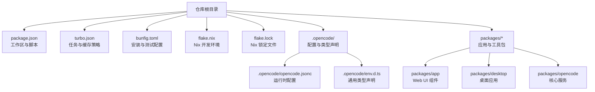
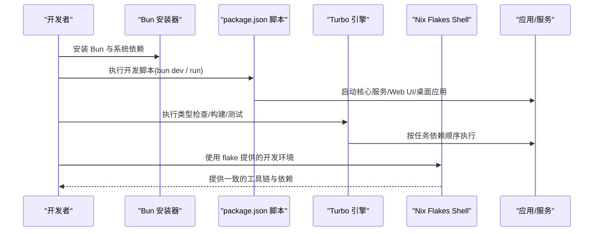
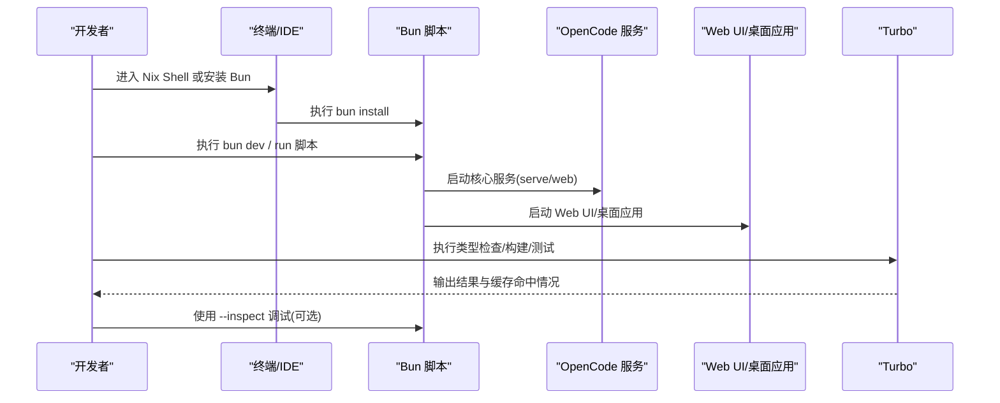
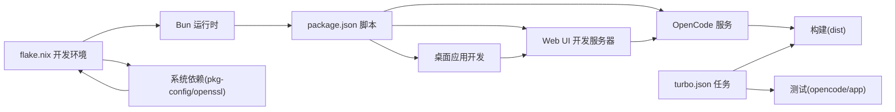

# 本地开发环境搭建

<cite>
**本文档引用的文件**
- [README.md](file://README.md)
- [CONTRIBUTING.md](file://CONTRIBUTING.md)
- [package.json](file://package.json)
- [turbo.json](file://turbo.json)
- [flake.nix](file://flake.nix)
- [flake.lock](file://flake.lock)
- [bunfig.toml](file://bunfig.toml)
- [.opencode/opencode.jsonc](file://.opencode/opencode.jsonc)
- [.opencode/env.d.ts](file://.opencode/env.d.ts)
- [packages/app/src/env.d.ts](file://packages/app/src/env.d.ts)
- [packages/desktop-electron/src/main/env.d.ts](file://packages/desktop-electron/src/main/env.d.ts)
- [packages/desktop-electron/src/renderer/env.d.ts](file://packages/desktop-electron/src/renderer/env.d.ts)
</cite>

## 目录
1. [简介](#简介)
2. [项目结构](#项目结构)
3. [核心组件](#核心组件)
4. [架构总览](#架构总览)
5. [详细组件分析](#详细组件分析)
6. [依赖关系分析](#依赖关系分析)
7. [性能考虑](#性能考虑)
8. [故障排除指南](#故障排除指南)
9. [结论](#结论)
10. [附录](#附录)

## 简介
本指南面向首次参与 OpenCode 项目的开发者，提供从零开始搭建本地开发环境的完整步骤。内容涵盖：
- Bun 运行时与系统依赖要求
- 项目依赖安装（支持 npm/yarn/pnpm 替代）
- 开发服务器启动与常用参数
- Turbo 构建系统配置与使用
- Nix 包管理器与 Flakes 配置
- 环境变量与配置文件准备
- 常见问题排查与解决方案

## 项目结构
OpenCode 采用 Monorepo 结构，根目录包含工作区脚本、Turbo 配置、Nix Flakes、Bun 配置等；各功能模块位于 packages/* 子目录中。

图表来源
- [package.json:1-118](file://package.json#L1-L118)
- [turbo.json:1-21](file://turbo.json#L1-L21)
- [flake.nix:1-77](file://flake.nix#L1-L77)
- [bunfig.toml:1-7](file://bunfig.toml#L1-L7)
- [.opencode/opencode.jsonc:1-19](file://.opencode/opencode.jsonc#L1-L19)
- [.opencode/env.d.ts:1-5](file://.opencode/env.d.ts#L1-L5)

章节来源
- [package.json:1-118](file://package.json#L1-L118)
- [turbo.json:1-21](file://turbo.json#L1-L21)
- [flake.nix:1-77](file://flake.nix#L1-L77)
- [bunfig.toml:1-7](file://bunfig.toml#L1-L7)
- [.opencode/opencode.jsonc:1-19](file://.opencode/opencode.jsonc#L1-L19)
- [.opencode/env.d.ts:1-5](file://.opencode/env.d.ts#L1-L5)

## 核心组件
- Bun 运行时：作为默认包管理器与执行环境，版本要求在 package.json 中声明。
- Turbo：统一的任务编排与缓存，定义 typecheck、build、test 等任务。
- Nix Flakes：提供可复现的开发环境，包含 bun、nodejs、pkg-config、openssl 等依赖。
- 配置与类型：.opencode 目录下的 opencode.jsonc 提供运行时配置，各包内的 env.d.ts 提供类型声明。

章节来源
- [package.json:7-20](file://package.json#L7-L20)
- [turbo.json:3-19](file://turbo.json#L3-L19)
- [flake.nix:21-31](file://flake.nix#L21-L31)
- [.opencode/opencode.jsonc:1-19](file://.opencode/opencode.jsonc#L1-L19)

## 架构总览
下图展示了本地开发的关键流程：从安装依赖到启动开发服务器，再到使用 Turbo 执行任务与 Nix 提供一致的构建环境。

图表来源
- [package.json:8-20](file://package.json#L8-L20)
- [turbo.json:5-19](file://turbo.json#L5-L19)
- [flake.nix:21-31](file://flake.nix#L21-L31)

## 详细组件分析

### 1. Bun 运行时与系统依赖
- 版本要求：package.json 显式声明了推荐的包管理器版本，确保与项目脚本兼容。
- 系统依赖：Nix Flakes 的 devShell 提供了构建所需的系统级依赖（如 pkg-config、openssl），建议优先通过 Nix 获取一致环境。
- 兼容性提示：Bun 在 Windows/Linux/macOS 上均可用，但某些原生依赖可能需要额外系统库或交叉编译工具链。

章节来源
- [package.json:7](file://package.json#L7)
- [flake.nix:23-29](file://flake.nix#L23-L29)

### 2. 项目依赖安装（npm/yarn/pnpm 替代）
- 工作区配置：package.json 定义了多包工作区，支持在根目录统一安装与管理依赖。
- 替代方案：尽管项目以 Bun 为 packageManager，仍可通过 npm/yarn/pnpm 安装依赖（具体行为以各包内 lock 文件为准）。
- 安装建议：若需与 CI 或团队保持一致，建议遵循根目录的 packageManager 字段；否则可按团队习惯选择。

章节来源
- [package.json:21-72](file://package.json#L21-L72)
- [package.json:7](file://package.json#L7)

### 3. 开发服务器启动方法
- 根脚本入口：
  - bun dev：启动 OpenCode 核心服务，默认在 packages/opencode 目录运行。
  - bun run --cwd packages/app dev：启动 Web UI 开发服务器。
  - bun run --cwd packages/desktop tauri dev：启动桌面应用开发（含原生窗口）。
- 常用参数：
  - serve：启动无头 API 服务。
  - web：启动服务并打开 Web 界面。
  - 指定目录：直接传入目标路径以在该目录启动 TUI。
  - 端口：可通过 serve 子命令指定端口。
- 调试：支持 --inspect 系列参数进行调试，建议配合 flake 提供的 Bun 环境。

章节来源
- [package.json:9-14](file://package.json#L9-L14)
- [CONTRIBUTING.md:84-122](file://CONTRIBUTING.md#L84-L122)
- [CONTRIBUTING.md:124-151](file://CONTRIBUTING.md#L124-L151)

### 4. Turbo 构建系统配置与使用
- 全局环境：turbo.json 声明了全局环境变量与透传变量，用于控制任务行为。
- 任务定义：
  - typecheck：类型检查任务。
  - build：构建任务，输出 dist/**。
  - 测试任务：opencode#test 与 @opencode-ai/app#test，按依赖顺序执行。
- 使用方式：通过 bun turbo typecheck 或直接调用 turbo（若已安装）。

章节来源
- [turbo.json:3-19](file://turbo.json#L3-L19)
- [package.json:15](file://package.json#L15)

### 5. Nix 包管理器与 Flakes 配置
- 开发 Shell：devShells.default 提供 bun、nodejs_20、pkg-config、openssl、git 等工具。
- 叠加层与包：overlays 与 packages 输出定义了可复现的 OpenCode 与桌面应用包。
- 使用方式：nix develop 进入开发 Shell；nix build 构建包；nix run 运行可执行程序。
- 锁定文件：flake.lock 确保依赖版本稳定。

章节来源
- [flake.nix:21-31](file://flake.nix#L21-L31)
- [flake.nix:33-51](file://flake.nix#L33-L51)
- [flake.lock:1-28](file://flake.lock#L1-L28)

### 6. 环境变量与配置文件准备
- 运行时配置：.opencode/opencode.jsonc 提供 provider、权限、工具等配置项。
- 类型声明：
  - .opencode/env.d.ts：通用模块类型声明示例。
  - packages/app/src/env.d.ts：VITE_OPENCODE_SERVER_HOST、VITE_OPENCODE_SERVER_PORT 等前端环境变量类型。
  - packages/desktop-electron/src/main/env.d.ts：主进程环境变量类型（如 OPENCODE_CHANNEL）。
  - packages/desktop-electron/src/renderer/env.d.ts：渲染进程全局窗口对象类型。
- 准备步骤：
  - 确认 .opencode 目录存在且配置文件齐全。
  - 在 packages/app 中根据需要创建 .env.development 文件并填充前端变量。
  - 如需桌面应用调试，可在主进程侧设置相关环境变量。

章节来源
- [.opencode/opencode.jsonc:1-19](file://.opencode/opencode.jsonc#L1-L19)
- [.opencode/env.d.ts:1-5](file://.opencode/env.d.ts#L1-L5)
- [packages/app/src/env.d.ts:3-10](file://packages/app/src/env.d.ts#L3-L10)
- [packages/desktop-electron/src/main/env.d.ts:1-7](file://packages/desktop-electron/src/main/env.d.ts#L1-L7)
- [packages/desktop-electron/src/renderer/env.d.ts:1-13](file://packages/desktop-electron/src/renderer/env.d.ts#L1-L13)

### 7. 开发流程与任务序列
以下序列图展示从启动到调试的典型流程：

图表来源
- [package.json:8-20](file://package.json#L8-L20)
- [turbo.json:5-19](file://turbo.json#L5-L19)
- [CONTRIBUTING.md:158-188](file://CONTRIBUTING.md#L158-L188)

## 依赖关系分析
- 脚本耦合：package.json 的 scripts 与各包的 devServer、builder 紧密耦合。
- 任务依赖：turbo.json 定义了测试任务对构建任务的依赖，避免未构建产物导致的失败。
- 环境一致性：flake.nix 将 Bun 与系统依赖打包进开发 Shell，降低跨平台差异。

图表来源
- [package.json:8-20](file://package.json#L8-L20)
- [turbo.json:7-19](file://turbo.json#L7-L19)
- [flake.nix:21-31](file://flake.nix#L21-L31)

章节来源
- [package.json:8-20](file://package.json#L8-L20)
- [turbo.json:7-19](file://turbo.json#L7-L19)
- [flake.nix:21-31](file://flake.nix#L21-L31)

## 性能考虑
- 使用 Turbo 缓存：合理组织任务依赖，避免重复构建；利用增量编译与并行执行提升效率。
- 选择合适的开发模式：仅启动当前关注的子系统（服务/前端/桌面），减少资源占用。
- Nix 环境复用：通过 flake.nix 提供的工具链，避免重复安装与版本冲突带来的性能损耗。

## 故障排除指南
- Bun 版本不匹配
  - 现象：脚本报错或行为异常。
  - 处理：确认 package.json 中声明的 Bun 版本，并在 Nix Shell 中使用 flake.nix 提供的 bun。
  - 参考：[package.json:7](file://package.json#L7)、[flake.nix:24](file://flake.nix#L24)
- 依赖安装失败
  - 现象：安装过程中出现网络或权限错误。
  - 处理：尝试更换镜像源或使用 Nix 安装系统依赖；必要时清理缓存后重试。
  - 参考：[package.json:21-72](file://package.json#L21-L72)
- 端口冲突
  - 现象：服务启动时报端口被占用。
  - 处理：通过 serve 子命令指定不同端口；或关闭占用端口的进程。
  - 参考：[CONTRIBUTING.md:105-109](file://CONTRIBUTING.md#L105-L109)
- 调试困难
  - 现象：断点无法命中或映射错误。
  - 处理：使用 --inspect-wait/--inspect-brk；必要时使用 spawn 模式；或分别调试服务与 TUI。
  - 参考：[CONTRIBUTING.md:158-188](file://CONTRIBUTING.md#L158-L188)
- Nix 环境问题
  - 现象：进入 shell 失败或工具缺失。
  - 处理：更新 flake.lock 并重新 nix develop；检查 nixpkgs 分支是否正确。
  - 参考：[flake.lock:1-28](file://flake.lock#L1-L28)

## 结论
通过 Bun、Turbo 与 Nix Flakes 的组合，OpenCode 提供了高效、可复现且跨平台的本地开发体验。建议优先使用 flake.nix 的开发 Shell，结合 package.json 的脚本与 turbo.json 的任务定义，快速完成从依赖安装到服务启动的全流程。

## 附录
- 快速开始清单
  - 安装 Bun 与系统依赖（推荐使用 Nix Flakes）。
  - 在根目录执行依赖安装。
  - 选择性启动服务/前端/桌面开发服务器。
  - 使用 Turbo 执行类型检查与构建。
  - 需要时启用调试参数进行断点调试。