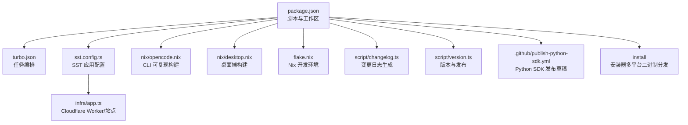
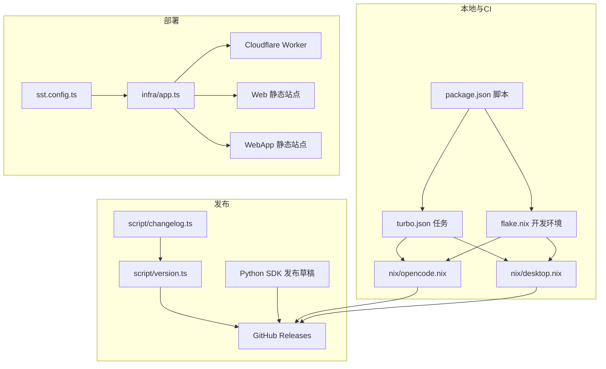
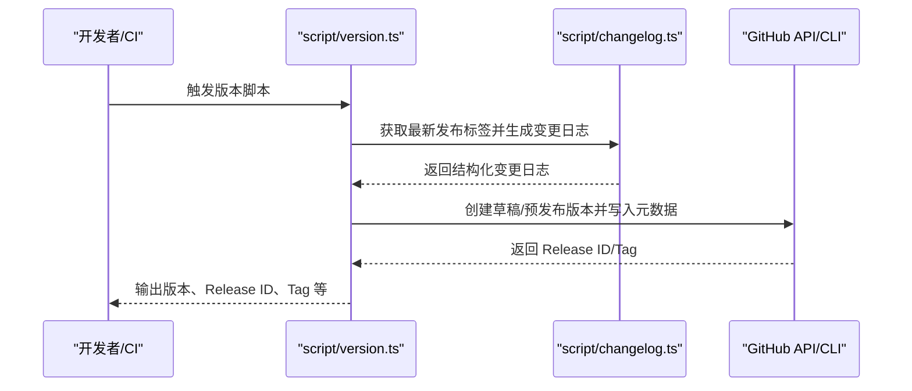
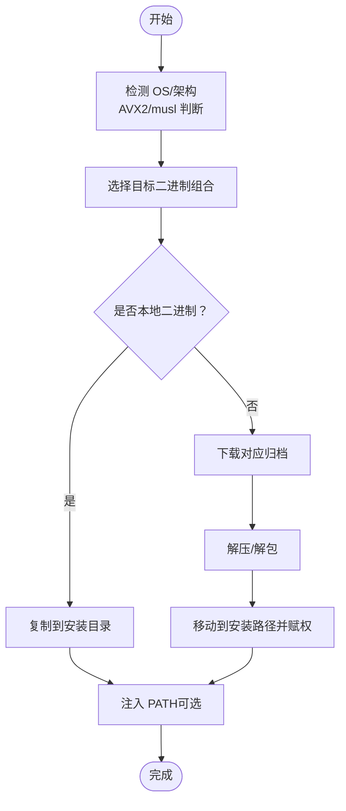
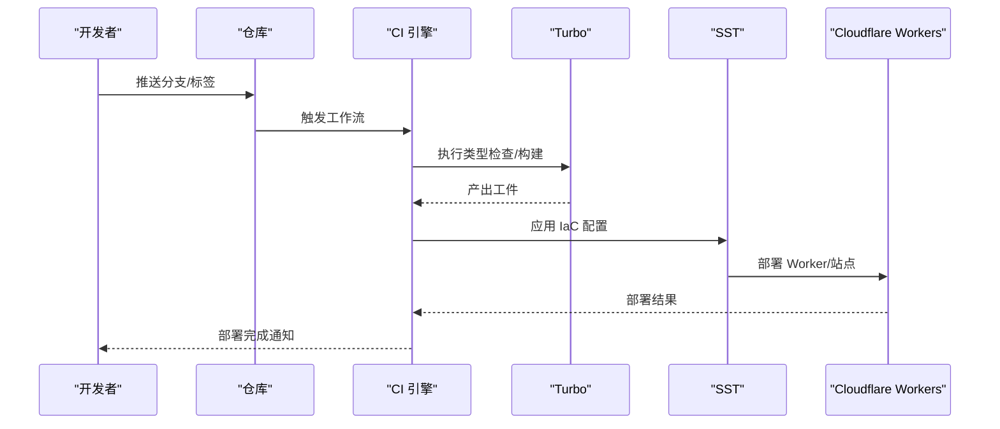
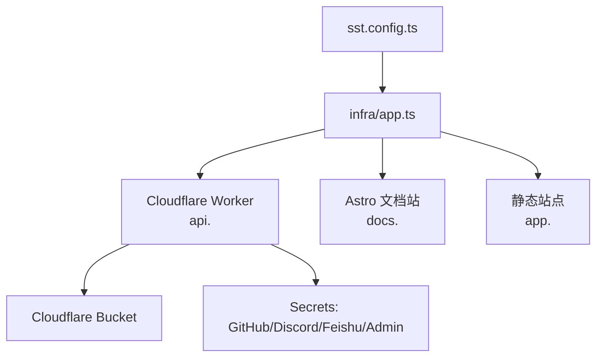
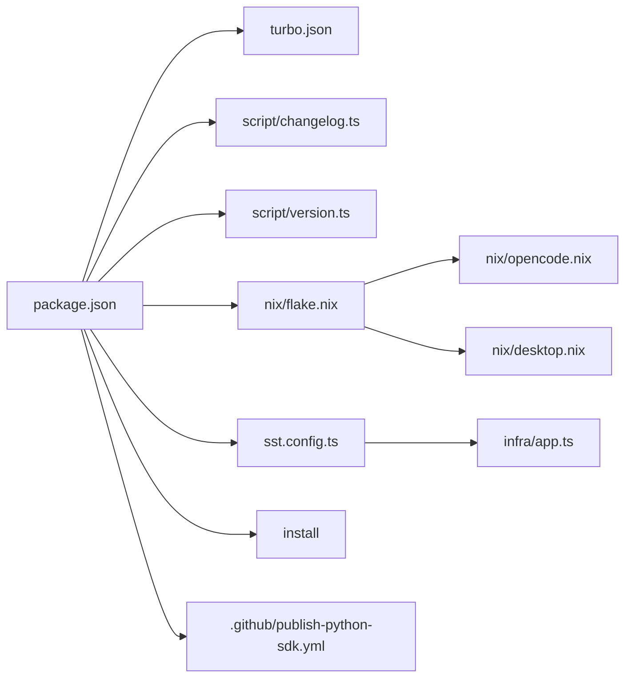

# 构建与部署

<cite>
**本文引用的文件**
- [package.json](file://package.json)
- [turbo.json](file://turbo.json)
- [sst.config.ts](file://sst.config.ts)
- [infra/app.ts](file://infra/app.ts)
- [script/version.ts](file://script/version.ts)
- [script/changelog.ts](file://script/changelog.ts)
- [nix/opencode.nix](file://nix/opencode.nix)
- [nix/desktop.nix](file://nix/desktop.nix)
- [flake.nix](file://flake.nix)
- [.github/publish-python-sdk.yml](file://.github/publish-python-sdk.yml)
- [install](file://install)
</cite>

## 目录
1. [简介](#简介)
2. [项目结构](#项目结构)
3. [核心组件](#核心组件)
4. [架构总览](#架构总览)
5. [详细组件分析](#详细组件分析)
6. [依赖关系分析](#依赖关系分析)
7. [性能考量](#性能考量)
8. [故障排查指南](#故障排查指南)
9. [结论](#结论)
10. [附录](#附录)

## 简介
本文件系统性阐述 OpenCode 的构建与部署体系，覆盖以下主题：
- CI/CD 流水线与自动化部署
- 版本管理与发布策略（含语义化版本与变更日志）
- 多平台构建（Windows、macOS、Linux）
- 容器化与 Kubernetes 部署思路
- 基础设施即代码（IaC）在 Cloudflare Workers 上的应用
- 生产环境监控与日志收集
- 回滚策略与灾难恢复

## 项目结构
OpenCode 采用 Monorepo 结构，以包管理器与任务编排工具为核心，结合 Nix 提供可复现的本地开发与构建环境；通过 SST（Infrastructure as Code）在 Cloudflare Workers 上进行应用与静态站点部署。

图表来源
- [package.json:1-118](file://package.json#L1-L118)
- [turbo.json:1-21](file://turbo.json#L1-L21)
- [sst.config.ts:1-24](file://sst.config.ts#L1-L24)
- [infra/app.ts:1-69](file://infra/app.ts#L1-L69)
- [nix/opencode.nix:1-98](file://nix/opencode.nix#L1-L98)
- [nix/desktop.nix:1-101](file://nix/desktop.nix#L1-L101)
- [flake.nix:1-77](file://flake.nix#L1-L77)
- [script/changelog.ts:1-307](file://script/changelog.ts#L1-L307)
- [script/version.ts:1-35](file://script/version.ts#L1-L35)
- [.github/publish-python-sdk.yml:1-72](file://.github/publish-python-sdk.yml#L1-L72)
- [install:1-461](file://install#L1-L461)

章节来源
- [package.json:1-118](file://package.json#L1-L118)
- [turbo.json:1-21](file://turbo.json#L1-L21)
- [sst.config.ts:1-24](file://sst.config.ts#L1-L24)
- [infra/app.ts:1-69](file://infra/app.ts#L1-L69)
- [nix/opencode.nix:1-98](file://nix/opencode.nix#L1-L98)
- [nix/desktop.nix:1-101](file://nix/desktop.nix#L1-L101)
- [flake.nix:1-77](file://flake.nix#L1-L77)
- [script/changelog.ts:1-307](file://script/changelog.ts#L1-L307)
- [script/version.ts:1-35](file://script/version.ts#L1-L35)
- [.github/publish-python-sdk.yml:1-72](file://.github/publish-python-sdk.yml#L1-L72)
- [install:1-461](file://install#L1-L461)

## 核心组件
- 包与脚本：统一在根级 package.json 中定义脚本与工作区，便于跨包执行与共享依赖。
- 任务编排：turbo.json 定义类型检查、构建等任务及其依赖关系与输出缓存。
- IaC（SST）：sst.config.ts 指定应用名称、清理策略、保护级别与提供商；infra/app.ts 描述 Worker、静态站点与资源链接。
- 变更日志与版本：script/changelog.ts 负责从 Git 提交生成结构化变更日志；script/version.ts 负责版本号与 GitHub Release 创建。
- 多平台构建：nix/opencode.nix 与 nix/desktop.nix 提供可复现的 CLI 与桌面端构建；flake.nix 支持 aarch64/x86_64 Linux/macOS。
- 安装器：install 脚本负责多平台二进制下载、解压与 PATH 注入。
- Python SDK 发布（草稿）：.github/publish-python-sdk.yml 展示了基于 uv 的 Python SDK 生成与发布流程。

章节来源
- [package.json:1-118](file://package.json#L1-L118)
- [turbo.json:1-21](file://turbo.json#L1-L21)
- [sst.config.ts:1-24](file://sst.config.ts#L1-L24)
- [infra/app.ts:1-69](file://infra/app.ts#L1-L69)
- [script/changelog.ts:1-307](file://script/changelog.ts#L1-L307)
- [script/version.ts:1-35](file://script/version.ts#L1-L35)
- [nix/opencode.nix:1-98](file://nix/opencode.nix#L1-L98)
- [nix/desktop.nix:1-101](file://nix/desktop.nix#L1-L101)
- [flake.nix:1-77](file://flake.nix#L1-L77)
- [install:1-461](file://install#L1-L461)
- [.github/publish-python-sdk.yml:1-72](file://.github/publish-python-sdk.yml#L1-L72)

## 架构总览
OpenCode 的运行时与交付由“本地/CI 构建 → 产物分发 → IaC 部署”构成闭环。核心路径如下：
- 本地与 CI：Bun/Turbo/Nix 统一构建与测试。
- 分发：GitHub Releases（二进制与安装器）、PyPI（Python SDK，草稿）。
- 部署：SST 在 Cloudflare Workers 上部署 API Worker、静态站点与相关资源。

图表来源
- [package.json:1-118](file://package.json#L1-L118)
- [turbo.json:1-21](file://turbo.json#L1-L21)
- [nix/opencode.nix:1-98](file://nix/opencode.nix#L1-L98)
- [nix/desktop.nix:1-101](file://nix/desktop.nix#L1-L101)
- [flake.nix:1-77](file://flake.nix#L1-L77)
- [script/version.ts:1-35](file://script/version.ts#L1-L35)
- [script/changelog.ts:1-307](file://script/changelog.ts#L1-L307)
- [sst.config.ts:1-24](file://sst.config.ts#L1-L24)
- [infra/app.ts:1-69](file://infra/app.ts#L1-L69)
- [.github/publish-python-sdk.yml:1-72](file://.github/publish-python-sdk.yml#L1-L72)

## 详细组件分析

### 版本与发布（语义化版本与变更日志）
- 版本号来源：脚本读取内部版本并写入输出变量，随后调用 GitHub CLI 创建草稿或预发布版本。
- 变更日志生成：按提交范围提取相关包变更，过滤无关提交，按模块分组，支持 AI 摘要与回退到原始提交摘要。
- 贡献者统计：基于 GitHub API 比较范围内的提交，汇总社区贡献者列表。

图表来源
- [script/version.ts:1-35](file://script/version.ts#L1-L35)
- [script/changelog.ts:1-307](file://script/changelog.ts#L1-L307)

章节来源
- [script/version.ts:1-35](file://script/version.ts#L1-L35)
- [script/changelog.ts:1-307](file://script/changelog.ts#L1-L307)

### 多平台构建（Windows/macOS/Linux）
- Nix 可复现构建：
  - opencode.nix：在标准构建阶段后安装并包装程序，生成 Shell 补全。
  - desktop.nix：基于 Rust 平台构建 Tauri 桌面应用，按平台注入依赖库。
- flake.nix：声明支持 aarch64/x86_64 Linux/macOS，并提供开发 Shell 与 overlay。
- 安装器 install：自动识别 OS/架构、检测 AVX2 与 musl，选择对应二进制并安装到用户目录，同时维护 PATH。

图表来源
- [install:1-461](file://install#L1-L461)
- [nix/opencode.nix:1-98](file://nix/opencode.nix#L1-L98)
- [nix/desktop.nix:1-101](file://nix/desktop.nix#L1-L101)
- [flake.nix:1-77](file://flake.nix#L1-L77)

章节来源
- [install:1-461](file://install#L1-L461)
- [nix/opencode.nix:1-98](file://nix/opencode.nix#L1-L98)
- [nix/desktop.nix:1-101](file://nix/desktop.nix#L1-L101)
- [flake.nix:1-77](file://flake.nix#L1-L77)

### CI/CD 流水线与自动化部署
- 任务编排：Turbo 作为统一入口，定义类型检查与构建任务，设置输出缓存，减少重复工作。
- IaC 部署：SST 在 Cloudflare Workers 上部署 API Worker 与静态站点，自动绑定存储与密钥，启用日志推送。
- Python SDK 发布（草稿）：展示基于 uv 的生成、同步依赖与发布流程，当前位于非标准目录且为草稿注释状态。

图表来源
- [turbo.json:1-21](file://turbo.json#L1-L21)
- [sst.config.ts:1-24](file://sst.config.ts#L1-L24)
- [infra/app.ts:1-69](file://infra/app.ts#L1-L69)
- [.github/publish-python-sdk.yml:1-72](file://.github/publish-python-sdk.yml#L1-L72)

章节来源
- [turbo.json:1-21](file://turbo.json#L1-L21)
- [sst.config.ts:1-24](file://sst.config.ts#L1-L24)
- [infra/app.ts:1-69](file://infra/app.ts#L1-L69)
- [.github/publish-python-sdk.yml:1-72](file://.github/publish-python-sdk.yml#L1-L72)

### 容器化与 Kubernetes 部署方案
- 当前实现：SST 在 Cloudflare Workers 上部署 API Worker 与静态站点，未见 Docker/Kubernetes 相关配置。
- 方案建议（概念性）：
  - 将 API Worker 适配为容器镜像，暴露健康检查端点与指标端口。
  - 使用 Helm 或 Kustomize 管理 Deployment/Service/Ingress，结合 ConfigMap/Secret 管理环境变量。
  - 通过 Ingress 控制器暴露服务，结合证书管理与灰度发布策略。
  - 使用 Sidecar 注入日志收集与链路追踪代理，集中化采集。

（本节为概念性说明，不直接映射具体源码）

### 基础设施即代码（IaC）与云平台
- Cloudflare Workers：Worker 启用日志推送，绑定对象存储与密钥，按阶段迁移策略配置。
- SST 应用配置：定义应用名、清理与保护策略、提供商（Stripe、PlanetScale），并按阶段运行不同模块。

图表来源
- [sst.config.ts:1-24](file://sst.config.ts#L1-L24)
- [infra/app.ts:1-69](file://infra/app.ts#L1-L69)

章节来源
- [sst.config.ts:1-24](file://sst.config.ts#L1-L24)
- [infra/app.ts:1-69](file://infra/app.ts#L1-L69)

### 生产环境监控与日志收集
- 日志：Worker 已启用日志推送，便于在 Cloudflare 控制台查看与导出。
- 建议增强：
  - 结合 Structured Logging 输出 JSON，便于解析与聚合。
  - 使用日志代理或 Sidecar 收集 stdout/stderr，统一发送至集中式日志系统。
  - 配置告警规则（错误率、延迟、容量）与健康检查端点。

（本节为通用实践说明，不直接映射具体源码）

### 回滚策略与灾难恢复
- 回滚策略：
  - Worker 迁移标签按阶段区分，生产与特定阶段保留旧标签以便回滚。
  - 通过版本标签与 Release 管理快速回滚到上一个稳定版本。
- 灾难恢复：
  - 使用 SST 的保留/保护策略，确保生产资源在删除阶段仍被保留。
  - 通过备份存储与密钥管理，配合多区域部署与蓝绿/金丝雀发布降低风险。

章节来源
- [infra/app.ts:40-48](file://infra/app.ts#L40-L48)
- [sst.config.ts:6-8](file://sst.config.ts#L6-L8)

## 依赖关系分析

图表来源
- [package.json:1-118](file://package.json#L1-L118)
- [turbo.json:1-21](file://turbo.json#L1-L21)
- [script/changelog.ts:1-307](file://script/changelog.ts#L1-L307)
- [script/version.ts:1-35](file://script/version.ts#L1-L35)
- [flake.nix:1-77](file://flake.nix#L1-L77)
- [nix/opencode.nix:1-98](file://nix/opencode.nix#L1-L98)
- [nix/desktop.nix:1-101](file://nix/desktop.nix#L1-L101)
- [sst.config.ts:1-24](file://sst.config.ts#L1-L24)
- [infra/app.ts:1-69](file://infra/app.ts#L1-L69)
- [install:1-461](file://install#L1-L461)
- [.github/publish-python-sdk.yml:1-72](file://.github/publish-python-sdk.yml#L1-L72)

章节来源
- [package.json:1-118](file://package.json#L1-L118)
- [turbo.json:1-21](file://turbo.json#L1-L21)
- [script/changelog.ts:1-307](file://script/changelog.ts#L1-L307)
- [script/version.ts:1-35](file://script/version.ts#L1-L35)
- [flake.nix:1-77](file://flake.nix#L1-L77)
- [nix/opencode.nix:1-98](file://nix/opencode.nix#L1-L98)
- [nix/desktop.nix:1-101](file://nix/desktop.nix#L1-L101)
- [sst.config.ts:1-24](file://sst.config.ts#L1-L24)
- [infra/app.ts:1-69](file://infra/app.ts#L1-L69)
- [install:1-461](file://install#L1-L461)
- [.github/publish-python-sdk.yml:1-72](file://.github/publish-python-sdk.yml#L1-L72)

## 性能考量
- 构建缓存：Turbo 任务输出目录缓存可显著缩短 CI 时间。
- Nix 可复现性：通过固定版本与哈希，避免环境漂移导致的性能波动。
- 二进制分发：安装器按 CPU/ABI/musl 选择最优二进制，减少运行时开销。
- 日志与可观测性：启用 Worker 日志推送，结合结构化日志与采样策略，平衡成本与洞察。

（本节为通用指导，不直接分析具体文件）

## 故障排查指南
- 版本/发布失败
  - 检查版本脚本输出变量与 GitHub CLI 权限。
  - 参考变更日志生成的回退逻辑（超时回退到原始提交摘要）。
- 构建失败
  - 确认 Turbo 任务输出目录与依赖顺序。
  - 使用 Nix 开发 Shell 再现构建问题。
- 部署异常
  - 检查 SST 配置与密钥绑定。
  - 关注 Worker 迁移标签与阶段差异。
- 安装器问题
  - 确认目标平台与二进制匹配，必要时使用本地二进制参数。
  - 检查 PATH 注入与权限。

章节来源
- [script/version.ts:1-35](file://script/version.ts#L1-L35)
- [script/changelog.ts:239-251](file://script/changelog.ts#L239-L251)
- [turbo.json:1-21](file://turbo.json#L1-L21)
- [nix/opencode.nix:1-98](file://nix/opencode.nix#L1-L98)
- [nix/desktop.nix:1-101](file://nix/desktop.nix#L1-L101)
- [sst.config.ts:1-24](file://sst.config.ts#L1-L24)
- [infra/app.ts:1-69](file://infra/app.ts#L1-L69)
- [install:1-461](file://install#L1-L461)

## 结论
OpenCode 的构建与部署以“可复现构建 + IaC + 自动化发布”为核心，结合多平台二进制分发与结构化变更日志，形成从开发到生产的闭环。建议在现有基础上完善容器化与 Kubernetes 部署方案、集中化日志与监控体系，并固化回滚与灾备流程，以进一步提升稳定性与可运维性。

## 附录
- 术语
  - IaC：Infrastructure as Code
  - AVX2：CPU 指令集特性
  - musl：轻量级 C 库
  - Worker：Cloudflare 边缘计算运行时
- 参考路径
  - [package.json](file://package.json)
  - [turbo.json](file://turbo.json)
  - [sst.config.ts](file://sst.config.ts)
  - [infra/app.ts](file://infra/app.ts)
  - [script/changelog.ts](file://script/changelog.ts)
  - [script/version.ts](file://script/version.ts)
  - [nix/opencode.nix](file://nix/opencode.nix)
  - [nix/desktop.nix](file://nix/desktop.nix)
  - [flake.nix](file://flake.nix)
  - [.github/publish-python-sdk.yml](file://.github/publish-python-sdk.yml)
  - [install](file://install)