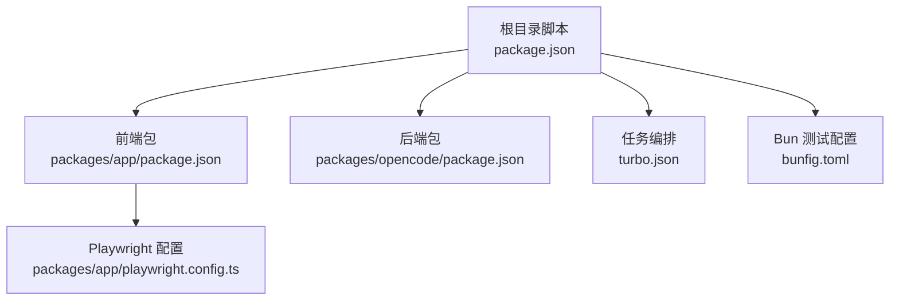
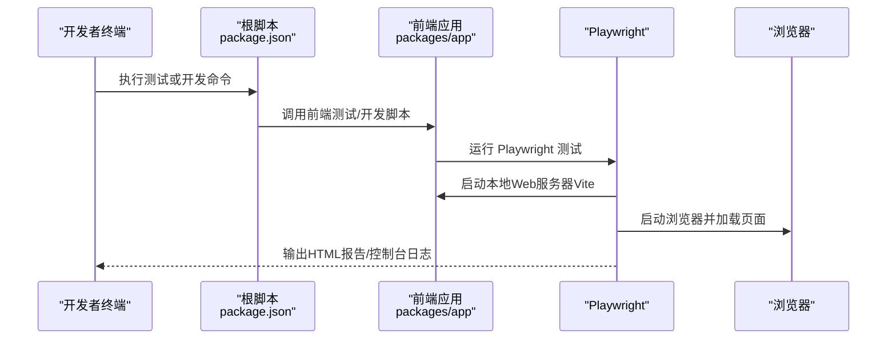
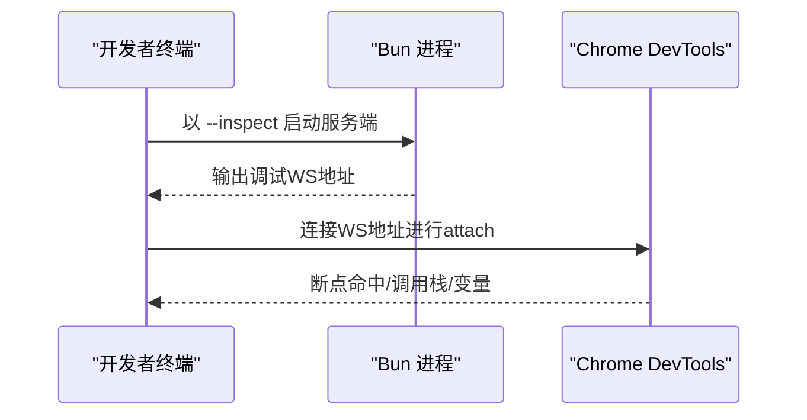
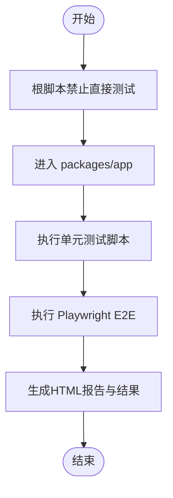
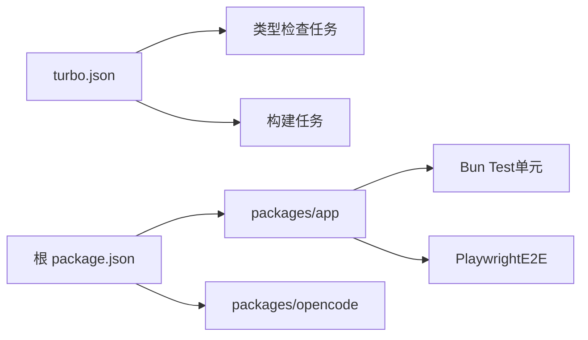

# 调试与测试

<cite>
**本文引用的文件**
- [package.json](file://package.json)
- [turbo.json](file://turbo.json)
- [bunfig.toml](file://bunfig.toml)
- [packages/app/package.json](file://packages/app/package.json)
- [packages/app/playwright.config.ts](file://packages/app/playwright.config.ts)
- [packages/opencode/package.json](file://packages/opencode/package.json)
- [packages/app/AGENTS.md](file://packages/app/AGENTS.md)
- [packages/app/src/i18n/en.ts](file://packages/app/src/i18n/en.ts)
- [packages/opencode/src/cli/cmd/tui/component/tips.tsx](file://packages/opencode/src/cli/cmd/tui/component/tips.tsx)
- [CONTRIBUTING.md](file://CONTRIBUTING.md)
</cite>

## 目录
1. [简介](#简介)
2. [项目结构](#项目结构)
3. [核心组件](#核心组件)
4. [架构总览](#架构总览)
5. [详细组件分析](#详细组件分析)
6. [依赖分析](#依赖分析)
7. [性能考虑](#性能考虑)
8. [故障排查指南](#故障排查指南)
9. [结论](#结论)
10. [附录](#附录)

## 简介
本章节面向OpenCode项目的开发者与贡献者，系统性介绍调试技巧与测试策略，覆盖以下主题：
- 前端调试：断点设置与浏览器开发者工具使用
- Node.js应用远程调试：Bun/Chrome DevTools连接方法
- 单元测试与集成测试：框架选择、配置与运行方式
- GitHub Actions工作流调试：日志分析与排障
- 性能分析：CPU与内存分析器使用
- 常见Bug定位与修复路径
- 使用opencode自身进行调试与问题排查

## 项目结构
OpenCode采用Monorepo结构，根目录通过包管理脚本统一调度各子包的开发与测试；前端应用位于packages/app，后端服务入口位于packages/opencode；测试框架Playwright用于E2E测试。

图表来源
- [package.json:1-118](file://package.json#L1-L118)
- [packages/app/package.json:1-74](file://packages/app/package.json#L1-L74)
- [packages/app/playwright.config.ts:1-46](file://packages/app/playwright.config.ts#L1-L46)
- [turbo.json:1-21](file://turbo.json#L1-L21)
- [bunfig.toml:1-7](file://bunfig.toml#L1-L7)

章节来源
- [package.json:1-118](file://package.json#L1-L118)
- [turbo.json:1-21](file://turbo.json#L1-L21)
- [bunfig.toml:1-7](file://bunfig.toml#L1-L7)

## 核心组件
- 前端应用（packages/app）：基于Vite开发，内置单元测试与Playwright E2E测试脚本，支持本地联调与报告生成。
- 后端服务（packages/opencode）：以Bun为运行时，提供CLI与服务模式，支持远程调试与日志输出。
- 测试框架：Bun Test用于单元测试，Playwright用于端到端测试。
- 工作流与任务：Turbo负责类型检查与构建任务编排；根脚本统一入口。

章节来源
- [packages/app/package.json:1-74](file://packages/app/package.json#L1-L74)
- [packages/opencode/package.json:1-146](file://packages/opencode/package.json#L1-L146)
- [turbo.json:1-21](file://turbo.json#L1-L21)

## 架构总览
下图展示从开发者命令到测试执行与调试的关键路径，以及Playwright如何启动Web服务器并驱动浏览器自动化。

图表来源
- [package.json:8-19](file://package.json#L8-L19)
- [packages/app/playwright.config.ts:23-32](file://packages/app/playwright.config.ts#L23-L32)

章节来源
- [package.json:8-19](file://package.json#L8-L19)
- [packages/app/playwright.config.ts:1-46](file://packages/app/playwright.config.ts#L1-L46)

## 详细组件分析

### 前端调试：断点与浏览器开发者工具
- 断点设置
  - 在浏览器中打开开发者工具，切换到Sources面板，按文件路径或行号添加断点。
  - 对于打包后的代码，建议启用Source Map以便断点映射到源码。
- 调试会话
  - 使用Vite开发服务器启动前端，确保热更新与断点命中正常。
  - 若使用代理或跨域场景，注意在Network面板检查请求是否被正确转发。
- 性能诊断栏
  - 应用内提供“开发性能诊断”相关文案，可用于观察帧率、长任务、输入延迟等指标，辅助定位渲染与交互性能瓶颈。

章节来源
- [packages/app/src/i18n/en.ts:678-694](file://packages/app/src/i18n/en.ts#L678-L694)

### Node.js应用远程调试：Bun与Chrome DevTools
- 远程调试命令
  - 使用Bun的inspect选项启动服务端进程，并指定WebSocket调试地址。
  - 可通过环境变量或导出BUN_OPTIONS简化每次启动的参数输入。
- 调试建议
  - 在VSCode中使用示例配置文件进行attach调试，避免使用launch模式导致断点映射错误。
  - 当使用worker线程运行服务时，断点可能不生效，可改用spawn模式或分离启动服务端与TUI。
- 日志与状态
  - 使用opencode CLI提供的调试提示与系统状态命令，结合详细日志输出定位问题。

图表来源
- [CONTRIBUTING.md:162-188](file://CONTRIBUTING.md#L162-L188)
- [packages/opencode/src/cli/cmd/tui/component/tips.tsx:136-152](file://packages/opencode/src/cli/cmd/tui/component/tips.tsx#L136-L152)

章节来源
- [CONTRIBUTING.md:162-188](file://CONTRIBUTING.md#L162-L188)
- [packages/opencode/src/cli/cmd/tui/component/tips.tsx:136-152](file://packages/opencode/src/cli/cmd/tui/component/tips.tsx#L136-L152)

### 单元测试与集成测试
- 测试框架与脚本
  - 单元测试：Bun Test，支持watch模式与预加载DOM环境。
  - 集成测试：Playwright，支持多浏览器设备、重用服务器、失败截图与视频录制。
- 运行方式
  - 根目录禁止直接运行测试，需进入具体包执行测试脚本。
  - Playwright配置支持通过环境变量调整端口、并发与报告输出。
- 报告与产物
  - Playwright生成HTML报告与测试结果目录，便于回溯失败用例。

图表来源
- [package.json:19](file://package.json#L19)
- [packages/app/package.json:17-24](file://packages/app/package.json#L17-L24)
- [packages/app/playwright.config.ts:11-46](file://packages/app/playwright.config.ts#L11-L46)

章节来源
- [package.json:19](file://package.json#L19)
- [packages/app/package.json:17-24](file://packages/app/package.json#L17-L24)
- [packages/app/playwright.config.ts:11-46](file://packages/app/playwright.config.ts#L11-L46)

### GitHub Actions工作流调试与日志分析
- 调试策略
  - 利用工作流中的步骤输出日志，关注构建、安装与测试阶段的错误堆栈。
  - 对于缓存命中失败或依赖安装异常，优先检查依赖锁定文件与缓存键。
- 日志定位
  - 将关键步骤标记为“step-”，并在失败时开启详细日志级别。
  - 结合仓库中的发布与构建脚本，核对环境变量与工作目录。
- 建议
  - 在本地复现相同环境变量与依赖版本，缩小问题范围。

（本节为通用实践指导，不直接分析具体文件）

### 性能分析：CPU与内存分析器
- CPU分析
  - 使用浏览器开发者工具的Performance面板进行录制，观察主线程耗时、长任务与布局抖动。
  - 结合应用内的性能诊断栏指标，定位渲染与交互热点。
- 内存分析
  - 使用Memory面板采集快照，对比不同时间点的堆内存分布，识别泄漏或异常增长。
  - 注意仅部分浏览器提供内存指标的完整统计，需按平台特性判断。
- Node.js侧
  - 使用Bun的inspect能力配合Chrome DevTools，对服务端逻辑进行CPU与内存采样。

章节来源
- [packages/app/src/i18n/en.ts:678-694](file://packages/app/src/i18n/en.ts#L678-L694)
- [CONTRIBUTING.md:162-188](file://CONTRIBUTING.md#L162-L188)

### 使用opencode自身进行调试与问题排查
- 开发与联调
  - 分离启动后端与前端，确保本地修改能正确反映到浏览器。
  - 使用代理或端口转发时，确认目标主机与端口配置一致。
- CLI调试提示
  - 使用opencode CLI提供的调试命令与系统状态命令，查看权限、日志与连接状态。
- 文档与指南
  - 参考AGENTS.md中的本地开发与SolidJS最佳实践，减少常见问题。

章节来源
- [packages/app/AGENTS.md:1-31](file://packages/app/AGENTS.md#L1-L31)
- [packages/opencode/src/cli/cmd/tui/component/tips.tsx:136-152](file://packages/opencode/src/cli/cmd/tui/component/tips.tsx#L136-L152)

## 依赖分析
- 任务编排
  - Turbo定义了类型检查、构建与测试任务的依赖关系与输出目录，确保测试前构建完成。
- 包级脚本
  - 根脚本统一入口，避免在根目录直接运行测试；各包提供独立测试脚本与配置。
- 测试隔离
  - Bun Test在根目录被限制运行，防止误触发；各包内部通过明确的测试脚本与配置隔离环境。

图表来源
- [turbo.json:5-19](file://turbo.json#L5-L19)
- [package.json:8-19](file://package.json#L8-L19)
- [packages/app/package.json:17-24](file://packages/app/package.json#L17-L24)

章节来源
- [turbo.json:5-19](file://turbo.json#L5-L19)
- [package.json:8-19](file://package.json#L8-L19)
- [packages/app/package.json:17-24](file://packages/app/package.json#L17-L24)

## 性能考虑
- 前端性能
  - 关注帧率、长任务与输入延迟等指标，优化渲染与事件处理。
  - 使用代理与本地服务器时，避免不必要的网络往返与重复渲染。
- 服务端性能
  - 使用inspect与Chrome DevTools对服务端进行CPU与内存采样，定位阻塞与内存泄漏。
- 测试性能
  - Playwright支持并发与重用服务器，合理设置workers与retry次数以平衡速度与稳定性。

（本节为通用指导，不直接分析具体文件）

## 故障排查指南
- 断点映射错误
  - 避免使用launch模式或特定终端进行调试，优先使用attach与正确的WS地址。
- worker线程断点无效
  - 改用spawn模式或分离启动服务端与TUI，确保断点在主进程中命中。
- 测试无法运行
  - 不要在根目录直接运行测试，需进入具体包执行相应脚本。
- 代理与端口
  - 确认代理目标、端口与主机配置一致，避免跨域与连接超时。
- 日志与状态
  - 使用opencode CLI的调试提示与系统状态命令，结合详细日志输出定位问题。

章节来源
- [CONTRIBUTING.md:162-188](file://CONTRIBUTING.md#L162-L188)
- [package.json:19](file://package.json#L19)
- [packages/app/AGENTS.md:1-31](file://packages/app/AGENTS.md#L1-L31)
- [packages/opencode/src/cli/cmd/tui/component/tips.tsx:136-152](file://packages/opencode/src/cli/cmd/tui/component/tips.tsx#L136-L152)

## 结论
通过规范化的调试流程与测试策略，可以显著提升OpenCode的开发效率与质量。建议在日常工作中：
- 使用Bun的inspect能力与Chrome DevTools进行远程调试；
- 采用Bun Test与Playwright分别覆盖单元与端到端场景；
- 借助opencode CLI与文档指南快速定位问题；
- 结合性能诊断工具持续优化前端与服务端表现。

（本节为总结性内容，不直接分析具体文件）

## 附录
- 快速参考
  - 前端开发与测试：在packages/app中执行开发与测试脚本。
  - 后端开发与调试：在packages/opencode中执行服务与调试脚本。
  - Playwright配置：通过环境变量调整端口、并发与报告输出。
  - 根脚本：禁止在根目录直接运行测试，需进入具体包。

章节来源
- [packages/app/package.json:17-24](file://packages/app/package.json#L17-L24)
- [packages/opencode/package.json:8-20](file://packages/opencode/package.json#L8-L20)
- [packages/app/playwright.config.ts:3-9](file://packages/app/playwright.config.ts#L3-L9)
- [package.json:19](file://package.json#L19)