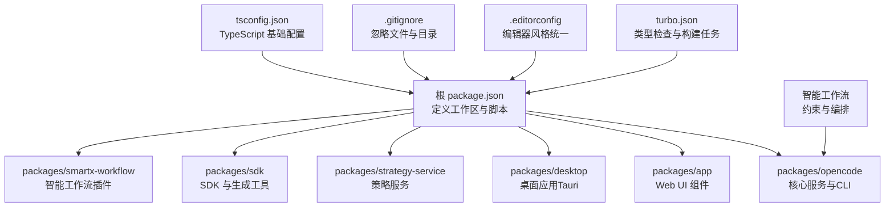
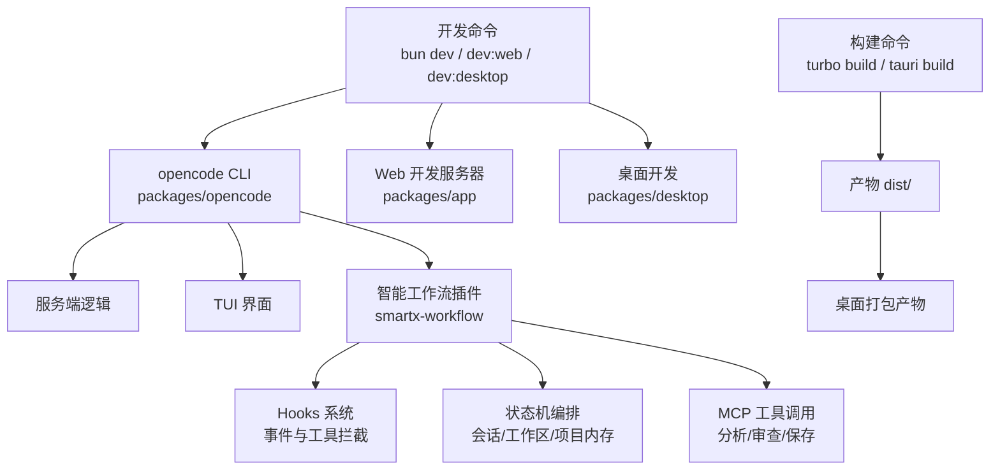
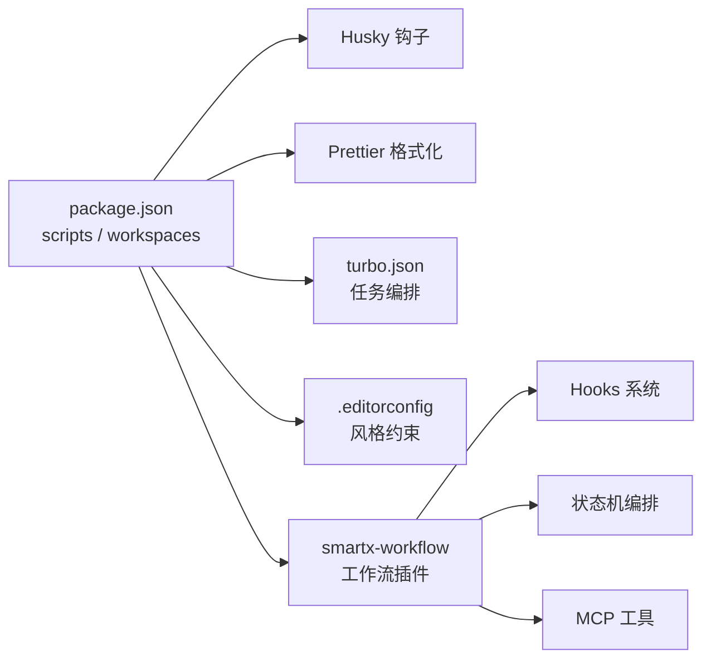

# 开发流程

<cite>
**本文引用的文件**
- [CONTRIBUTING.md](file://CONTRIBUTING.md)
- [.github/pull_request_template.md](file://.github/pull_request_template.md)
- [package.json](file://package.json)
- [turbo.json](file://turbo.json)
- [.editorconfig](file://.editorconfig)
- [.gitignore](file://.gitignore)
- [tsconfig.json](file://tsconfig.json)
- [script/format.ts](file://script/format.ts)
- [script/generate.ts](file://script/generate.ts)
- [packages/smartx-workflow/README.md](file://packages/smartx-workflow/README.md)
- [packages/smartx-workflow/src/hooks.ts](file://packages/smartx-workflow/src/hooks.ts)
- [packages/smartx-workflow/src/workspace.ts](file://packages/smartx-workflow/src/workspace.ts)
- [packages/opencode/src/util/log.ts](file://packages/opencode/src/util/log.ts)
- [memory-bank/decisionLog.md](file://memory-bank/decisionLog.md)
- [docs/plans/2026-06-24-project-manager-smartx-workflow-enforcement.md](file://docs/plans/2026-06-24-project-manager-smartx-workflow-enforcement.md)
- [docs/plans/2026-04-12-workflow-session-agent-model-clarity.md](file://docs/plans/2026-04-12-workflow-session-agent-model-clarity.md)
</cite>

## 目录
1. [简介](#简介)
2. [项目结构](#项目结构)
3. [核心组件](#核心组件)
4. [架构总览](#架构总览)
5. [详细组件分析](#详细组件分析)
6. [依赖分析](#依赖分析)
7. [性能考虑](#性能考虑)
8. [故障排查指南](#故障排查指南)
9. [结论](#结论)
10. [附录](#附录)

## 简介
本文件系统性梳理 OpenCode 项目的开发工作流程与开发规范，覆盖以下主题：
- 代码提交规范、分支策略与合并流程
- Husky 钩子配置、代码格式化与 linting 规则
- 日常开发任务：本地调试、热重载与开发服务器启动
- 代码审查流程、PR 模板与 CI/CD 集成
- 开发工具推荐、IDE 配置与调试技巧
- 常见开发场景处理方案与最佳实践
- **新增** 智能工作流编排功能、改进的错误处理和日志记录能力

## 项目结构
OpenCode 采用多包（monorepo）结构，根目录通过工作区管理各子包，统一脚本、类型检查与构建任务。关键特性如下：
- 根脚本与工作区：通过根级 package.json 统一管理开发脚本与工作区范围
- 类型检查与缓存：通过 turbo.json 定义任务依赖与输出缓存
- 编辑器一致性：通过 .editorconfig 统一换行、缩进与行长
- 提交前格式化：通过根级脚本与 Husky 集成 Prettier
- **新增** 智能工作流插件：通过 smartx-workflow 提供工作流编排与约束

**图示来源**
- [package.json:1-118](file://package.json#L1-L118)
- [turbo.json:1-21](file://turbo.json#L1-L21)
- [.editorconfig:1-10](file://.editorconfig#L1-L10)
- [.gitignore:1-35](file://.gitignore#L1-L35)
- [tsconfig.json:1-6](file://tsconfig.json#L1-L6)
- [packages/smartx-workflow/README.md:1-136](file://packages/smartx-workflow/README.md#L1-L136)

**章节来源**
- [package.json:1-118](file://package.json#L1-L118)
- [turbo.json:1-21](file://turbo.json#L1-L21)
- [.editorconfig:1-10](file://.editorconfig#L1-L10)
- [.gitignore:1-35](file://.gitignore#L1-L35)
- [tsconfig.json:1-6](file://tsconfig.json#L1-L6)

## 核心组件
- 开发脚本与工作区
  - 根脚本集中于 package.json 的 scripts 字段，涵盖开发、构建与工具链命令
  - 工作区通过 workspaces 字段声明，统一管理多包依赖与发布
- 类型检查与构建
  - turbo.json 定义 typecheck、build 等任务，支持跨包依赖与缓存输出
- 编辑器与提交规范
  - .editorconfig 统一编码与排版
  - .gitignore 控制版本控制范围
  - 格式化脚本与 Husky 集成，确保提交质量
- **新增** 智能工作流编排
  - smartx-workflow 插件提供会话级、工作区基线和项目内存三级约束
  - 通过 hooks 系统与 opencode 核心服务深度集成
  - 支持 MCP 工具调用和状态机编排

**章节来源**
- [package.json:8-20](file://package.json#L8-L20)
- [package.json:21-72](file://package.json#L21-L72)
- [turbo.json:5-19](file://turbo.json#L5-L19)
- [.editorconfig:3-9](file://.editorconfig#L3-L9)
- [.gitignore:1-35](file://.gitignore#L1-L35)
- [packages/smartx-workflow/README.md:1-136](file://packages/smartx-workflow/README.md#L1-L136)

## 架构总览
下图展示开发期常用命令与组件交互关系，帮助理解"从本地开发到构建"的整体流程，以及智能工作流的集成位置。

**图示来源**
- [package.json:9-11](file://package.json#L9-L11)
- [package.json:13-14](file://package.json#L13-L14)
- [package.json:10](file://package.json#L10)
- [turbo.json:7-10](file://turbo.json#L7-L10)
- [packages/smartx-workflow/src/hooks.ts:1-162](file://packages/smartx-workflow/src/hooks.ts#L1-L162)

## 详细组件分析

### 代码提交规范与分支策略
- 提交前格式化
  - 通过根级脚本调用 Prettier 对全仓库进行格式化
  - 脚本路径参考：[script/format.ts:1-6](file://script/format.ts#L1-L6)
- 提交钩子（Husky）
  - 在根脚本中注册 prepare 钩子以启用 Husky
  - 参考：[package.json:16](file://package.json#L16)
- 分支与合并
  - 仓库未提供明确分支保护规则与合并策略说明；建议遵循"小步快跑、频繁合并"的原则，并在合并前确保通过类型检查与格式化

**章节来源**
- [script/format.ts:1-6](file://script/format.ts#L1-L6)
- [package.json:16](file://package.json#L16)

### 代码审查流程与 PR 模板
- PR 前置要求
  - 所有 PR 必须关联现有 Issue；PR 描述需清晰说明问题与修复方式
  - 参考：[CONTRIBUTING.md:192-223](file://CONTRIBUTING.md#L192-L223)
- PR 标题规范
  - 遵循约定式提交规范，支持 feat/fix/docs/chore/refactor/test 等类型，并可选作用域
  - 示例与规则参考：[CONTRIBUTING.md:224-249](file://CONTRIBUTING.md#L224-L249)
- PR 模板
  - 使用 GitHub 模板引导 PR 内容，包含变更类型、验证方法、截图等字段
  - 模板内容参考：[pull_request_template.md:1-30](file://.github/pull_request_template.md#L1-L30)

**章节来源**
- [CONTRIBUTING.md:192-249](file://CONTRIBUTING.md#L192-L249)
- [.github/pull_request_template.md:1-30](file://.github/pull_request_template.md#L1-L30)

### 代码格式化与 Linting 规则
- 格式化
  - 通过 Prettier 进行统一格式化，根级脚本负责执行
  - 参考：[script/format.ts:5](file://script/format.ts#L5)
- 编辑器风格
  - .editorconfig 统一字符集、换行符、缩进与行长
  - 参考：[.editorconfig:3-9](file://.editorconfig#L3-L9)
- Linting
  - 仓库未发现显式的 ESLint 配置文件；建议在各包内按需添加 ESLint 配置，并与 Prettier 协同使用

**章节来源**
- [script/format.ts:1-6](file://script/format.ts#L1-L6)
- [.editorconfig:1-10](file://.editorconfig#L1-L10)

### 日常开发任务操作指南
- 启动开发服务器
  - opencode 核心服务：bun dev（或 bun dev serve）
  - Web 应用：先启动 opencode 服务，再在 packages/app 下运行 dev
  - 桌面应用：在 packages/desktop 下运行 tauri dev 或 dev
  - 参考：[CONTRIBUTING.md:81-151](file://CONTRIBUTING.md#L81-L151)
- 热重载与调试
  - 使用 --conditions=browser 运行以适配浏览器环境
  - 参考：[package.json:9](file://package.json#L9)
- 生成 SDK 与相关文件
  - 当 API 或 SDK 发生变更时，运行生成脚本以更新 SDK 与 OpenAPI 文档
  - 参考：[CONTRIBUTING.md:154](file://CONTRIBUTING.md#L154) 与 [script/generate.ts:1-10](file://script/generate.ts#L1-L10)
- **新增** 智能工作流开发
  - 在 packages/smartx-workflow 目录运行：bun typecheck、bun test、bun run build
  - 通过 hooks 系统测试工作流约束和状态机编排
  - 参考：[packages/smartx-workflow/README.md:121-136](file://packages/smartx-workflow/README.md#L121-L136)

**章节来源**
- [CONTRIBUTING.md:81-151](file://CONTRIBUTING.md#L81-L151)
- [package.json:9](file://package.json#L9)
- [script/generate.ts:1-10](file://script/generate.ts#L1-L10)
- [packages/smartx-workflow/README.md:121-136](file://packages/smartx-workflow/README.md#L121-L136)

### CI/CD 集成
- 类型检查与构建
  - turbo.json 中定义 typecheck、build 等任务，支持跨包依赖与缓存
  - 参考：[turbo.json:5-19](file://turbo.json#L5-L19)
- 工作区与依赖
  - 根 package.json 的 workspaces 字段声明了多包范围，便于统一管理
  - 参考：[package.json:21-72](file://package.json#L21-L72)
- 提交钩子
  - prepare 脚本用于初始化 Husky，确保提交前格式化与校验
  - 参考：[package.json:16](file://package.json#L16)

**章节来源**
- [turbo.json:1-21](file://turbo.json#L1-L21)
- [package.json:21-72](file://package.json#L21-L72)
- [package.json:16](file://package.json#L16)

### 开发工具推荐与 IDE 配置
- 编辑器风格
  - 使用 .editorconfig 保持一致的编码风格
  - 参考：[.editorconfig:1-10](file://.editorconfig#L1-L10)
- 调试建议
  - 推荐使用 --inspect-wait 或 --inspect-brk，结合 VSCode 调试器连接
  - 若需要在 TUI 与服务端分别调试，可分进程启动并分别附加调试器
  - 参考：[CONTRIBUTING.md:158-188](file://CONTRIBUTING.md#L158-L188)
- VSCode 配置
  - 可参考仓库提供的示例设置文件（settings.example.json、launch.example.json）
  - 参考：[CONTRIBUTING.md:179-188](file://CONTRIBUTING.md#L179-L188)

**章节来源**
- [.editorconfig:1-10](file://.editorconfig#L1-L10)
- [CONTRIBUTING.md:158-188](file://CONTRIBUTING.md#L158-L188)

### **新增** 智能工作流编排功能
- 工作流约束轴
  - 会话级顺序约束：smartx_start/smartx-start → smartx_logs，skill("smartx-develop") → skill("smartx-debug")
  - 工作区基线约束：workspace-analyzer → smartx_save_analysis → strategy-flowchart-generator → smartx_save_flowchart
  - 项目内存约束：resume_project_state/init_project_state → baseline → develop → debug → save_project_state → final wrap-up
- MCP 工具集成
  - project memory 工具：init_project_state、resume_project_state、get_project_state、save_project_state、validate_project_state
  - workspace baseline 工具：refresh_workspace、save_analysis、save_flowchart、save_review
- 状态机编排
  - 通过 workflow.js 实现步骤化编排，支持 boot、analysis、chart、review、final 等状态转换
  - 支持错误处理和状态回滚机制
- 日志记录与监控
  - 通过 ctx.client.app.log API 将工作流事件写入 opencode 日志系统
  - 支持服务级别标签和额外上下文信息记录

**章节来源**
- [packages/smartx-workflow/README.md:1-136](file://packages/smartx-workflow/README.md#L1-L136)
- [packages/smartx-workflow/src/hooks.ts:46-58](file://packages/smartx-workflow/src/hooks.ts#L46-L58)
- [packages/smartx-workflow/src/workspace.ts:148-200](file://packages/smartx-workflow/src/workspace.ts#L148-L200)

### **新增** 改进的错误处理和日志记录能力
- 统一日志系统
  - 通过 Log.create() 创建带标签的日志器，支持服务级缓存和复用
  - 支持 DEBUG/INFO/WARN/ERROR 级别，通过 Zod 验证日志级别有效性
  - 自动格式化错误信息，支持多层错误链追踪
- 性能监控
  - time() 方法提供计时功能，自动记录开始和结束状态及持续时间
  - 支持符号释放器，确保资源正确清理
- 文件日志管理
  - 自动清理超过保留数量的历史日志文件
  - 支持开发模式和生产模式的不同日志文件命名策略
- 工作流事件记录
  - 智能工作流插件通过统一的 write() 方法记录所有重要事件
  - 包含会话ID、工作区路径、工具调用结果等上下文信息
  - 支持事件类型分类和状态追踪

**章节来源**
- [packages/opencode/src/util/log.ts:1-183](file://packages/opencode/src/util/log.ts#L1-L183)
- [packages/smartx-workflow/src/hooks.ts:46-58](file://packages/smartx-workflow/src/hooks.ts#L46-L58)

## 依赖分析
- 根级依赖与脚本
  - 通过 package.json 的 scripts 字段统一入口，结合工作区实现多包协同
- 类型检查与构建任务
  - turbo.json 将 typecheck、build 等任务标准化，减少重复执行
- 提交前检查
  - 通过 Husky 与 Prettier 实现提交前格式化，降低代码风格分歧
- **新增** 智能工作流依赖
  - smartx-workflow 作为 opencode 插件运行时加载
  - 通过 hooks 系统与核心服务深度集成
  - 依赖 MCP 工具接口和状态管理系统

**图示来源**
- [package.json:8-20](file://package.json#L8-L20)
- [package.json:16](file://package.json#L16)
- [turbo.json:5-19](file://turbo.json#L5-L19)
- [.editorconfig:3-9](file://.editorconfig#L3-L9)
- [packages/smartx-workflow/README.md:1-136](file://packages/smartx-workflow/README.md#L1-L136)

**章节来源**
- [package.json:8-20](file://package.json#L8-L20)
- [turbo.json:5-19](file://turbo.json#L5-L19)
- [.editorconfig:3-9](file://.editorconfig#L3-L9)

## 性能考虑
- 使用 turbo.json 的任务缓存与依赖传递，避免重复构建
- 在本地开发中优先使用浏览器条件运行，减少不必要的环境切换
- 通过 .gitignore 与 .editorconfig 减少无关文件干扰与风格差异带来的额外开销
- **新增** 智能工作流性能优化
  - 通过状态缓存减少重复计算和网络请求
  - 工作流状态机支持增量更新，避免全量重算
  - 日志系统采用异步写入，减少对主线程的影响

## 故障排查指南
- 提交被拒绝或格式化失败
  - 确认已安装 Husky 并执行 prepare 初始化
  - 参考：[package.json:16](file://package.json#L16)
- 调试器断点不生效
  - 尝试使用 --conditions=browser 或分离调试服务端与 TUI
  - 参考：[CONTRIBUTING.md:167-172](file://CONTRIBUTING.md#L167-L172)
- Web 与桌面开发无法联调
  - 确保先启动 opencode 服务，再启动对应前端开发服务器
  - 参考：[CONTRIBUTING.md:111-151](file://CONTRIBUTING.md#L111-L151)
- **新增** 智能工作流问题排查
  - 检查工作流日志：通过 opencode 日志查看 smartx-workflow 事件记录
  - 验证 MCP 工具可用性：确认相关工具已在工作区内正确配置
  - 状态机调试：使用工作流状态检查点验证状态转换是否符合预期
- **新增** 日志记录问题排查
  - 检查日志文件权限和磁盘空间
  - 验证日志级别配置，确保关键信息被正确记录
  - 查看日志轮转机制，确认历史日志文件清理正常

**章节来源**
- [package.json:16](file://package.json#L16)
- [CONTRIBUTING.md:167-172](file://CONTRIBUTING.md#L167-L172)
- [CONTRIBUTING.md:111-151](file://CONTRIBUTING.md#L111-L151)
- [packages/smartx-workflow/src/hooks.ts:46-58](file://packages/smartx-workflow/src/hooks.ts#L46-L58)
- [packages/opencode/src/util/log.ts:60-90](file://packages/opencode/src/util/log.ts#L60-L90)

## 结论
OpenCode 的开发流程以根级脚本与工作区为核心，结合 Husky 与 Prettier 实现提交前质量保障；通过 turbo.json 统一类型检查与构建任务，提升多包协作效率。**最新更新**增加了智能工作流编排功能，通过 smartx-workflow 插件提供三层约束轴（会话级、工作区基线、项目内存），并实现了改进的错误处理和日志记录能力。建议在现有基础上补充 ESLint 配置与分支保护策略，进一步完善 CI/CD 流程与代码审查标准。

## 附录
- 常用命令速查
  - 启动 opencode 服务：bun dev
  - 启动 Web 应用：bun run --cwd packages/app dev
  - 启动桌面应用：bun run --cwd packages/desktop tauri dev
  - 生成 SDK 与 OpenAPI：bun run --cwd packages/opencode dev generate > ../sdk/openapi.json
  - 格式化全仓库：bun run prettier --ignore-unknown --write .
  - **新增** 智能工作流测试：bun run --cwd packages/smartx-workflow test
  - **新增** 智能工作流构建：bun run --cwd packages/smartx-workflow build
- PR 模板字段
  - 关联 Issue、变更类型、验证方法、截图与清单项
  - 参考：[pull_request_template.md:1-30](file://.github/pull_request_template.md#L1-L30)
- **新增** 智能工作流开发指南
  - 工作流约束轴：会话级顺序、工作区基线、项目内存
  - MCP 工具使用：项目状态管理、工作区分析、流程图生成
  - 日志记录：统一事件记录和状态追踪
  - 状态机编排：步骤化工作流和错误处理
- **新增** 错误处理最佳实践
  - 使用统一日志系统记录错误链
  - 实施分级错误处理策略
  - 建立完善的日志轮转和清理机制
  - 通过工作流事件追踪问题根源

**章节来源**
- [packages/smartx-workflow/README.md:121-136](file://packages/smartx-workflow/README.md#L121-L136)
- [packages/opencode/src/util/log.ts:1-183](file://packages/opencode/src/util/log.ts#L1-L183)
- [docs/plans/2026-06-24-project-manager-smartx-workflow-enforcement.md:26-73](file://docs/plans/2026-06-24-project-manager-smartx-workflow-enforcement.md#L26-L73)
- [docs/plans/2026-04-12-workflow-session-agent-model-clarity.md:1-359](file://docs/plans/2026-04-12-workflow-session-agent-model-clarity.md#L1-L359)