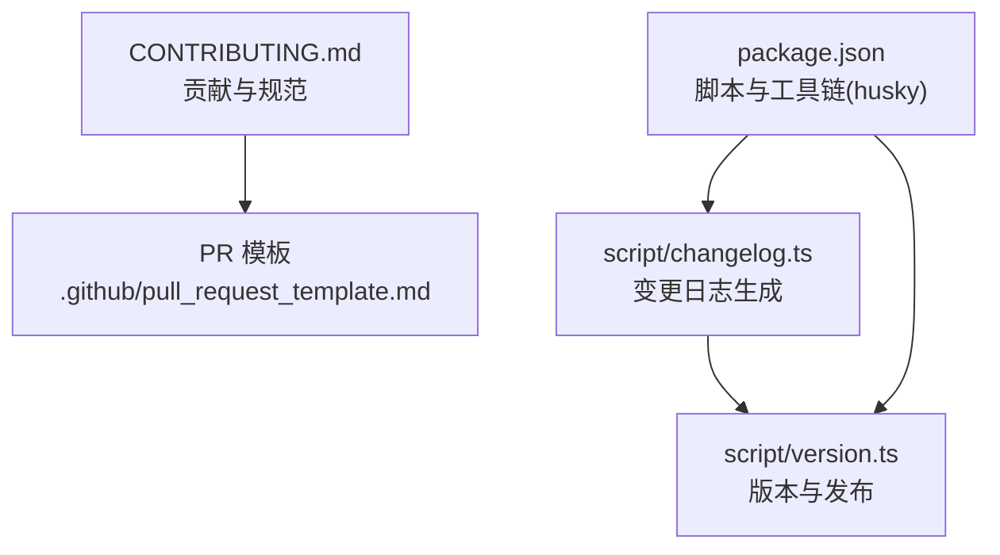
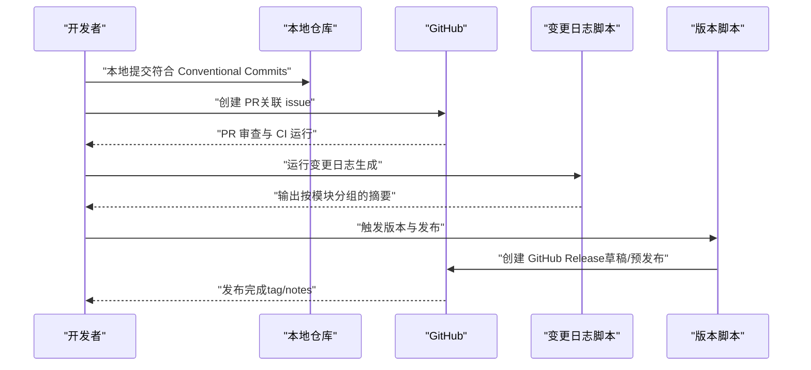
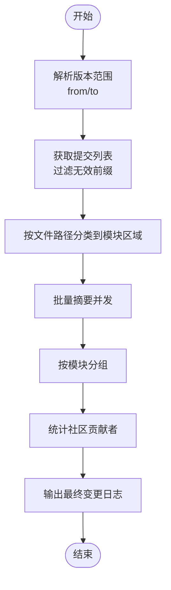
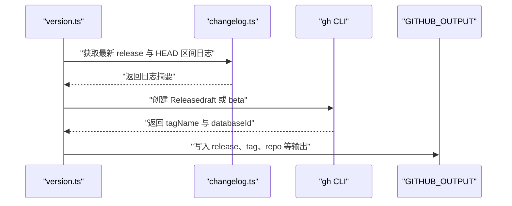
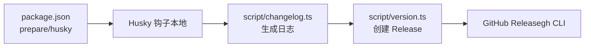

# 提交流程

<cite>
**本文引用的文件**
- [CONTRIBUTING.md](file://CONTRIBUTING.md)
- [.github/pull_request_template.md](file://.github/pull_request_template.md)
- [script/changelog.ts](file://script/changelog.ts)
- [script/version.ts](file://script/version.ts)
- [package.json](file://package.json)
</cite>

## 目录
1. [简介](#简介)
2. [项目结构](#项目结构)
3. [核心组件](#核心组件)
4. [架构总览](#架构总览)
5. [详细组件分析](#详细组件分析)
6. [依赖关系分析](#依赖关系分析)
7. [性能考虑](#性能考虑)
8. [故障排除指南](#故障排除指南)
9. [结论](#结论)
10. [附录](#附录)

## 简介
本文件系统性说明 OpenCode 项目的 Git 提交流程与规范，覆盖以下主题：
- Conventional Commits 标准的使用：feat、fix、docs、chore、refactor、test 等类型及其适用场景
- 分支命名规范、提交信息格式与版本标记规则
- 完整的 PR 创建流程（从 issue 讨论到 PR 合并）
- 变更日志（changelog）自动生成与版本发布策略
- 实际提交示例与常见错误规避建议

## 项目结构
围绕提交与发布相关的关键位置如下：
- 贡献与规范：CONTRIBUTING.md
- PR 模板：.github/pull_request_template.md
- 变更日志生成脚本：script/changelog.ts
- 版本与发布脚本：script/version.ts
- 仓库脚本与工具链：package.json（含 husky 集成）

图表来源
- [CONTRIBUTING.md:190-250](file://CONTRIBUTING.md#L190-L250)
- [.github/pull_request_template.md:1-30](file://.github/pull_request_template.md#L1-L30)
- [script/changelog.ts:1-307](file://script/changelog.ts#L1-L307)
- [script/version.ts:1-35](file://script/version.ts#L1-L35)
- [package.json:16-16](file://package.json#L16-L16)

章节来源
- [CONTRIBUTING.md:190-250](file://CONTRIBUTING.md#L190-L250)
- [.github/pull_request_template.md:1-30](file://.github/pull_request_template.md#L1-L30)
- [script/changelog.ts:1-307](file://script/changelog.ts#L1-L307)
- [script/version.ts:1-35](file://script/version.ts#L1-L35)
- [package.json:16-16](file://package.json#L16-L16)

## 核心组件
- 提交信息规范与类型
  - feat：新增功能或能力
  - fix：缺陷修复
  - docs：文档或 README 的改动
  - chore：维护任务、依赖更新等
  - refactor：重构但不改变行为
  - test：新增或更新测试
  - scope（可选）：限定影响范围，如 app、desktop、opencode 等
- PR 标题遵循 Conventional Commits 格式
- Issue 首策略：所有 PR 必须关联现有 issue
- PR 描述与模板要求：必须填写问题描述、变更内容与验证方法；禁止大段 AI 生成文本
- Husky 集成：通过 prepare 脚本安装钩子，确保提交前校验（具体规则由 husky 配置定义）

章节来源
- [CONTRIBUTING.md:224-249](file://CONTRIBUTING.md#L224-L249)
- [CONTRIBUTING.md:192-198](file://CONTRIBUTING.md#L192-L198)
- [.github/pull_request_template.md:1-30](file://.github/pull_request_template.md#L1-L30)
- [package.json:16-16](file://package.json#L16-L16)

## 架构总览
下图展示从本地提交到版本发布的端到端流程，包括变更日志生成与 GitHub Release 创建。

图表来源
- [script/changelog.ts:221-268](file://script/changelog.ts#L221-L268)
- [script/version.ts:9-26](file://script/version.ts#L9-L26)

## 详细组件分析

### 组件一：变更日志生成（script/changelog.ts）
职责与流程要点：
- 获取指定区间内的提交（支持从最新 release 到 HEAD 或指定版本对）
- 过滤掉特定前缀的提交（如 ignore:、test:、chore:、ci:、release:），避免噪音进入日志
- 基于提交影响的文件路径自动归类到模块区域（core、tui、app、sdk、plugin、extensions 等）
- 对每条提交消息进行并行摘要（最多 10 并发），优先使用 AI 摘要，超时则回退为原始消息
- 输出按模块分组的条目，并在末尾列出社区贡献者清单
- 支持命令行参数：from（起始版本）、to（结束引用，默认 HEAD）、help

图表来源
- [script/changelog.ts:40-94](file://script/changelog.ts#L40-L94)
- [script/changelog.ts:167-198](file://script/changelog.ts#L167-L198)
- [script/changelog.ts:200-219](file://script/changelog.ts#L200-L219)
- [script/changelog.ts:270-306](file://script/changelog.ts#L270-L306)

章节来源
- [script/changelog.ts:14-31](file://script/changelog.ts#L14-L31)
- [script/changelog.ts:40-94](file://script/changelog.ts#L40-L94)
- [script/changelog.ts:167-198](file://script/changelog.ts#L167-L198)
- [script/changelog.ts:200-219](file://script/changelog.ts#L200-L219)
- [script/changelog.ts:221-268](file://script/changelog.ts#L221-L268)
- [script/changelog.ts:270-306](file://script/changelog.ts#L270-L306)

### 组件二：版本与发布（script/version.ts）
职责与流程要点：
- 读取当前版本号（来自脚本工具），非预览版本会生成发布说明文件
- 调用变更日志生成函数构建发布说明正文
- 使用 gh CLI 创建 GitHub Release（草稿或预发布通道）
- 输出关键变量（release ID、tag、repo）供后续工作流使用

图表来源
- [script/version.ts:7-26](file://script/version.ts#L7-L26)
- [script/version.ts:30-32](file://script/version.ts#L30-L32)

章节来源
- [script/version.ts:1-35](file://script/version.ts#L1-L35)

### 组件三：PR 模板与要求（.github/pull_request_template.md 与 CONTRIBUTING.md）
- PR 必须关联一个 issue（Closes #xxx）
- PR 标题需遵循 Conventional Commits（feat/fix/docs/chore/refactor/test）
- 描述中需说明问题、变更内容与验证方式；禁止大段 AI 生成文本
- UI 变更需附截图或录屏；逻辑变更需说明如何复现与验证
- 保持 PR 小而聚焦，避免无关改动

章节来源
- [.github/pull_request_template.md:1-30](file://.github/pull_request_template.md#L1-L30)
- [CONTRIBUTING.md:192-223](file://CONTRIBUTING.md#L192-L223)
- [CONTRIBUTING.md:224-249](file://CONTRIBUTING.md#L224-L249)

### 组件四：提交前钩子与工具链（package.json）
- 通过 prepare 脚本安装 husky 钩子，用于在提交前执行检查（具体规则由 husky 配置定义）
- 提供开发与构建相关脚本，便于本地调试与集成

章节来源
- [package.json:16-16](file://package.json#L16-L16)

## 依赖关系分析
- 脚本依赖关系
  - changelog.ts 作为核心日志生成器，被 version.ts 在发布阶段调用
  - version.ts 依赖 gh CLI 与 GitHub API，用于创建 Release
- 工具链依赖
  - husky 通过 package.json 的 prepare 脚本启用
  - 变更日志生成依赖 GitHub API（gh）与 git log/diff-tree

图表来源
- [package.json:16-16](file://package.json#L16-L16)
- [script/changelog.ts:221-268](file://script/changelog.ts#L221-L268)
- [script/version.ts:9-26](file://script/version.ts#L9-L26)

章节来源
- [package.json:16-16](file://package.json#L16-L16)
- [script/changelog.ts:221-268](file://script/changelog.ts#L221-L268)
- [script/version.ts:9-26](file://script/version.ts#L9-L26)

## 性能考虑
- 变更日志摘要采用最多 10 并发的批量处理，提升长区间日志生成效率
- 对于超时情况自动回退为原始提交消息，保证可用性
- 仅对与核心包路径相关的提交参与日志生成，减少无关文件带来的开销

章节来源
- [script/changelog.ts:167-198](file://script/changelog.ts#L167-L198)
- [script/changelog.ts:239-251](file://script/changelog.ts#L239-L251)

## 故障排除指南
- PR 被拒或关闭
  - 未关联现有 issue：请先开 issue 再提 PR
  - PR 描述为空或为 AI 生成长文：请按模板简明说明问题、变更与验证方法
  - PR 过大或包含无关改动：请拆分为多个小 PR
- 提交信息不符合规范
  - 未使用 Conventional Commits 类型（feat/fix/docs/chore/refactor/test）
  - 缺少 scope 或表达不清：为明确影响范围添加 scope
- 发布失败
  - gh CLI 未正确配置或无权限：确认认证与仓库权限
  - 版本号或 tag 冲突：检查当前 release 与目标 tag 是否已存在
- 日志生成异常
  - AI 摘要超时：脚本会自动回退为原始消息；可稍后重试
  - 无有效提交：确认提交是否被过滤（如 test:、chore: 等前缀会被忽略）

章节来源
- [CONTRIBUTING.md:192-223](file://CONTRIBUTING.md#L192-L223)
- [script/changelog.ts:239-251](file://script/changelog.ts#L239-L251)
- [script/version.ts:16-26](file://script/version.ts#L16-L26)

## 结论
OpenCode 的提交与发布体系以 Conventional Commits 为核心，结合 PR 模板、变更日志自动生成与 GitHub Release 流程，形成从本地提交到版本发布的闭环。遵循本文规范可显著提升协作效率与发布质量。

## 附录

### 提交类型与使用场景速览
- feat：新增功能或能力（如新 UI 组件、新 API）
- fix：缺陷修复（如崩溃、样式错位、逻辑错误）
- docs：文档或 README 的改动（如贡献指南、API 文档）
- chore：维护任务、依赖更新、CI 配置等
- refactor：重构但不改变行为（如代码结构调整）
- test：新增或更新测试（如单元测试、集成测试）

章节来源
- [CONTRIBUTING.md:224-249](file://CONTRIBUTING.md#L224-L249)

### 分支命名规范（建议）
- 功能分支：feature/<issue-id>-短描述
- 修复分支：fix/<issue-id>-短描述
- 文档分支：docs/<issue-id>-短描述
- 预发布分支：release/<版本号>
- 热修复分支：hotfix/<issue-id>-短描述

（本节为通用实践建议，未直接引用具体文件）

### 提交信息格式
- 标准格式：type(scope?): subject
- 示例：
  - feat(app): 新增暗色模式支持
  - fix(desktop): 修复启动崩溃问题
  - docs: 更新贡献指南
  - chore(opencode): 升级依赖版本
  - refactor: 优化服务端初始化流程
  - test: 补充 API 测试用例

章节来源
- [CONTRIBUTING.md:224-249](file://CONTRIBUTING.md#L224-L249)

### 版本标记规则
- 非预览版本：创建正式 GitHub Release（草稿或公开）
- 预览/测试版本：创建预发布（如 beta）Release
- 自动输出：release ID、tag、repo 等变量供工作流使用

章节来源
- [script/version.ts:9-26](file://script/version.ts#L9-L26)

### PR 创建全流程（从 issue 到合并）
- 步骤 1：在 GitHub 开启 issue，选择合适的模板并填写必要字段
- 步骤 2：在 PR 描述中填写“Issue for this PR”并使用“Closes #xxx”
- 步骤 3：PR 标题遵循 Conventional Commits 格式
- 步骤 4：在 PR 中简明说明问题、变更内容与验证方法
- 步骤 5：等待审查与 CI 运行，根据反馈修改
- 步骤 6：审查通过后合并 PR

章节来源
- [CONTRIBUTING.md:192-223](file://CONTRIBUTING.md#L192-L223)
- [.github/pull_request_template.md:1-30](file://.github/pull_request_template.md#L1-L30)

### 变更日志生成自动化流程
- 触发条件：版本发布前或手动运行脚本
- 关键步骤：
  - 解析版本范围（from/to）
  - 获取提交并过滤无效前缀
  - 按模块分类与批量摘要
  - 生成分组条目与贡献者清单
  - 输出最终日志供发布使用

章节来源
- [script/changelog.ts:40-94](file://script/changelog.ts#L40-L94)
- [script/changelog.ts:167-198](file://script/changelog.ts#L167-L198)
- [script/changelog.ts:221-268](file://script/changelog.ts#L221-L268)

### 常见错误与规避指南
- 错误：PR 未关联 issue
  - 规避：先开 issue，PR 描述中填写“Closes #xxx”
- 错误：提交信息不规范
  - 规避：使用 Conventional Commits 类型与 scope
- 错误：PR 描述为 AI 生成长文
  - 规避：简明扼要说明问题、变更与验证方法
- 错误：发布失败
  - 规避：确认 gh CLI 认证、权限与版本号唯一性

章节来源
- [CONTRIBUTING.md:192-223](file://CONTRIBUTING.md#L192-L223)
- [script/version.ts:16-26](file://script/version.ts#L16-L26)