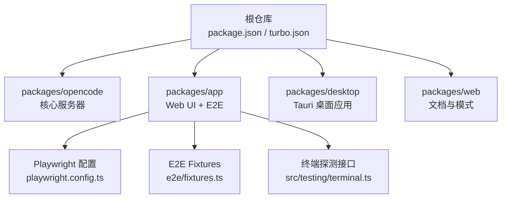
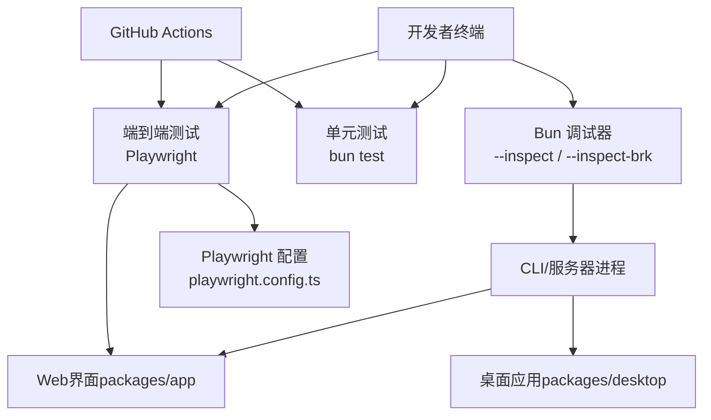
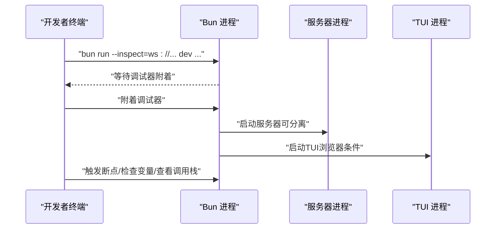
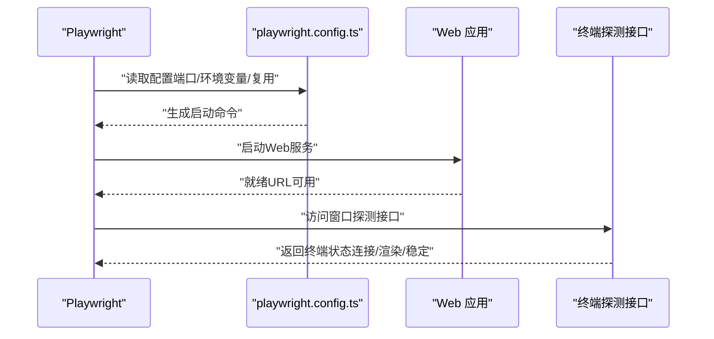
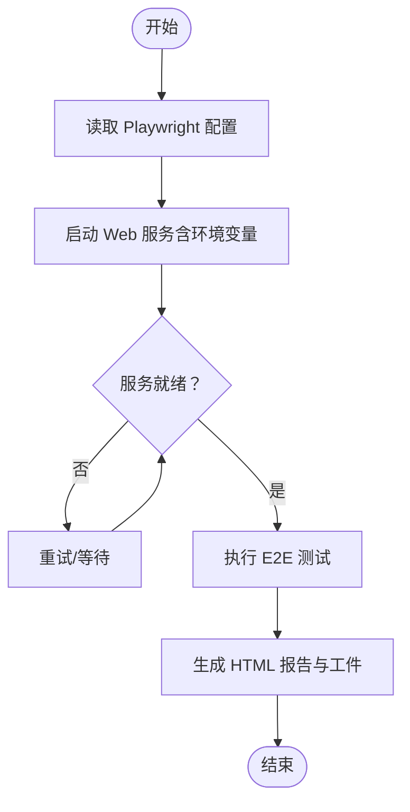
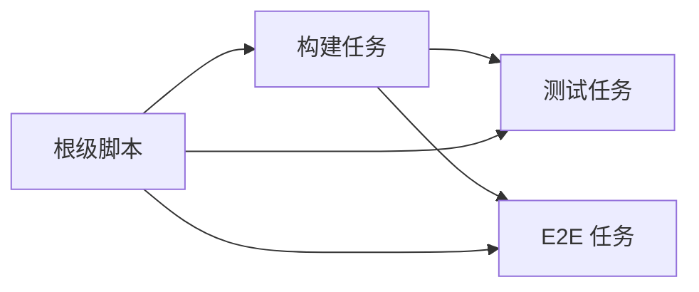

# 调试与测试

<cite>
**本文引用的文件**
- [package.json](file://package.json)
- [turbo.json](file://turbo.json)
- [bunfig.toml](file://bunfig.toml)
- [packages/app/bunfig.toml](file://packages/app/bunfig.toml)
- [packages/opencode/bunfig.toml](file://packages/opencode/bunfig.toml)
- [packages/app/playwright.config.ts](file://packages/app/playwright.config.ts)
- [packages/app/e2e/fixtures.ts](file://packages/app/e2e/fixtures.ts)
- [packages/app/src/testing/terminal.ts](file://packages/app/src/testing/terminal.ts)
- [.github/workflows/test.yml](file://.github/workflows/test.yml)
- [CONTRIBUTING.md](file://CONTRIBUTING.md)
</cite>

## 目录
1. [简介](#简介)
2. [项目结构](#项目结构)
3. [核心组件](#核心组件)
4. [架构总览](#架构总览)
5. [详细组件分析](#详细组件分析)
6. [依赖分析](#依赖分析)
7. [性能考虑](#性能考虑)
8. [故障排查指南](#故障排查指南)
9. [结论](#结论)
10. [附录](#附录)

## 简介
本指南面向OpenCode项目的开发者与贡献者，聚焦于调试与测试实践。内容涵盖：
- 使用Bun调试器进行断点设置、变量检查与调用栈分析
- 针对CLI、API服务器、Web界面与桌面应用的差异化调试策略
- 单元测试与端到端测试的编写要点与覆盖率期望
- 性能分析工具与优化技巧
- 常见问题定位与修复路径，以及测试数据准备与模拟对象使用

## 项目结构
OpenCode采用Monorepo结构，核心开发与测试能力分布如下：
- 根级脚本与工作区：通过根级脚本统一启动各子包服务；Turbo负责任务编排与构建依赖
- 测试配置：根级与子包级bunfig.toml分别控制测试根目录与预加载项；Playwright用于端到端测试
- 包结构概览：
  - packages/opencode：核心业务逻辑与服务器
  - packages/app：共享Web UI组件与E2E测试
  - packages/desktop：基于Tauri的原生桌面应用
  - packages/web：文档与模式说明（含调试模式）

图表来源
- [package.json:1-118](file://package.json#L1-L118)
- [turbo.json:1-21](file://turbo.json#L1-L21)
- [packages/app/playwright.config.ts:1-46](file://packages/app/playwright.config.ts#L1-L46)
- [packages/app/e2e/fixtures.ts:1-45](file://packages/app/e2e/fixtures.ts#L1-L45)
- [packages/app/src/testing/terminal.ts:1-104](file://packages/app/src/testing/terminal.ts#L1-L104)

章节来源
- [package.json:1-118](file://package.json#L1-L118)
- [turbo.json:1-21](file://turbo.json#L1-L21)

## 核心组件
- Bun调试器与VSCode集成：推荐使用手动终端启动并附着调试器的方式，避免断点映射错误
- 测试框架与配置：
  - 根级bunfig.toml限制从根目录直接运行测试
  - 子包bunfig.toml指定测试根目录与预加载（如DOM环境）
  - Turbo任务定义了测试依赖关系
- 端到端测试：Playwright配置自动启动Web服务并注入环境变量，支持并行与重试

章节来源
- [CONTRIBUTING.md:158-188](file://CONTRIBUTING.md#L158-L188)
- [bunfig.toml:1-7](file://bunfig.toml#L1-L7)
- [packages/app/bunfig.toml:1-4](file://packages/app/bunfig.toml#L1-L4)
- [packages/opencode/bunfig.toml:1-8](file://packages/opencode/bunfig.toml#L1-L8)
- [turbo.json:11-18](file://turbo.json#L11-L18)
- [packages/app/playwright.config.ts:11-45](file://packages/app/playwright.config.ts#L11-L45)

## 架构总览
下图展示调试与测试在OpenCode中的整体交互：

图表来源
- [CONTRIBUTING.md:158-188](file://CONTRIBUTING.md#L158-L188)
- [packages/app/playwright.config.ts:11-45](file://packages/app/playwright.config.ts#L11-L45)
- [.github/workflows/test.yml:46-98](file://.github/workflows/test.yml#L46-L98)

## 详细组件分析

### Bun调试器使用指南
- 最可靠方式：在终端中以“手动启动+附着调试器”的形式运行，避免断点映射异常
- 特殊场景：
  - TUI服务器断点：若常规dev在worker线程中无法命中，尝试spawn变体
  - 分离调试：分别启动服务器与TUI，并通过attach连接
- 实用建议：
  - 可使用--inspect-wait或--inspect-brk按需等待断点
  - 将--inspect参数导出到BUN_OPTIONS以减少重复输入
  - VSCode可参考示例配置文件进行调试

图表来源
- [CONTRIBUTING.md:162-177](file://CONTRIBUTING.md#L162-L177)

章节来源
- [CONTRIBUTING.md:158-188](file://CONTRIBUTING.md#L158-L188)

### CLI与API服务器调试策略
- 启动API服务器：使用dev serve或指定端口
- Web联调：先启动服务器，再启动Web开发服务器，确保两者端口一致
- 分离调试：分别启动服务器与TUI，通过attach连接，便于独立断点与变量检查

章节来源
- [CONTRIBUTING.md:97-122](file://CONTRIBUTING.md#L97-L122)
- [CONTRIBUTING.md:167-172](file://CONTRIBUTING.md#L167-L172)

### Web界面调试策略
- 端到端测试：Playwright自动启动Web服务并注入环境变量，支持并行与重试
- 本地开发：通过playwright.config.ts中的webServer配置，可自定义端口与复用策略
- 终端探测：通过E2E窗口暴露的探测接口，验证终端连接、渲染与稳定状态

图表来源
- [packages/app/playwright.config.ts:3-32](file://packages/app/playwright.config.ts#L3-L32)
- [packages/app/src/testing/terminal.ts:16-28](file://packages/app/src/testing/terminal.ts#L16-L28)

章节来源
- [packages/app/playwright.config.ts:1-46](file://packages/app/playwright.config.ts#L1-L46)
- [packages/app/src/testing/terminal.ts:1-104](file://packages/app/src/testing/terminal.ts#L1-L104)

### 桌面应用调试策略
- 开发模式：通过Tauri开发命令启动Web开发服务器并打开原生窗口
- 仅Web开发：可单独启动Web开发服务器，便于快速迭代UI
- 生产构建：通过Tauri构建流程生成打包产物

章节来源
- [CONTRIBUTING.md:124-148](file://CONTRIBUTING.md#L124-L148)

### 单元测试与覆盖率要求
- 测试入口与组织：
  - 根级禁止直接运行测试，需通过工作区或子包执行
  - 子包bunfig.toml指定测试根目录与预加载（如DOM环境）
  - Turbo任务定义了测试依赖（构建前置）
- 编写指南：
  - 针对packages/app的组件与功能，遵循现有测试命名规范（如*.test.ts）
  - 使用fixtures与helpers组织跨测试共享的设置与清理逻辑
  - 对异步与副作用逻辑进行隔离与断言
- 覆盖率要求：
  - 仓库未显式声明覆盖率阈值，建议在团队内约定并逐步提升
  - 可结合Playwright报告与单元测试报告进行综合评估

章节来源
- [bunfig.toml:4-6](file://bunfig.toml#L4-L6)
- [packages/app/bunfig.toml:1-4](file://packages/app/bunfig.toml#L1-L4)
- [turbo.json:11-18](file://turbo.json#L11-L18)
- [packages/app/e2e/fixtures.ts:1-45](file://packages/app/e2e/fixtures.ts#L1-L45)

### 端到端测试（E2E）
- 自动化流程：
  - Playwright根据配置启动Web服务，注入服务器主机与端口等环境变量
  - 支持并行与重试，失败时保留截图与视频
  - GitHub Actions中定义了Linux与Windows两套矩阵，安装浏览器并运行E2E
- 本地开发：
  - 提供交互式UI调试命令，便于逐步定位问题

图表来源
- [packages/app/playwright.config.ts:11-45](file://packages/app/playwright.config.ts#L11-L45)
- [.github/workflows/test.yml:79-98](file://.github/workflows/test.yml#L79-L98)

章节来源
- [packages/app/playwright.config.ts:1-46](file://packages/app/playwright.config.ts#L1-L46)
- [.github/workflows/test.yml:46-98](file://.github/workflows/test.yml#L46-L98)

### 性能分析与优化
- 性能诊断条：Web界面内置性能诊断条，提供导航、帧率、长任务、输入延迟等指标
- 优化建议：
  - 关注长任务与阻塞时间，优先优化路由切换与渲染热点
  - 利用调试器的调用栈分析定位高耗时函数
  - 在E2E中结合Playwright的trace与视频回放，复现并分析性能瓶颈

章节来源
- [packages/app/src/i18n/en.ts:678-694](file://packages/app/src/i18n/en.ts#L678-L694)

## 依赖分析
- 任务依赖：Turbo任务定义了测试依赖构建产物，确保测试在最新构建基础上执行
- 工作区：根级脚本统一管理多包开发与调试命令

图表来源
- [turbo.json:7-18](file://turbo.json#L7-L18)
- [package.json:8-19](file://package.json#L8-L19)

章节来源
- [turbo.json:1-21](file://turbo.json#L1-L21)
- [package.json:1-118](file://package.json#L1-L118)

## 性能考虑
- 断点与调试器：优先使用手动启动+附着的方式，减少断点映射偏差
- 并行与重试：合理利用Playwright并行与重试策略，缩短回归周期
- 观测性：结合性能诊断条与调试器调用栈，定位渲染与路由性能瓶颈

## 故障排查指南
- 断点不命中：
  - 尝试spawn变体或分离调试服务器与TUI
  - 使用--inspect-brk等待断点
- 测试无法从根目录运行：
  - 遵循根级bunfig.toml的限制，改用子包或工作区命令
- E2E不稳定：
  - 检查Playwright配置的端口与复用策略
  - 查看CI日志中的浏览器安装与工件上传情况
- 终端状态异常：
  - 通过E2E窗口探测接口检查连接、渲染与稳定次数

章节来源
- [CONTRIBUTING.md:162-177](file://CONTRIBUTING.md#L162-L177)
- [bunfig.toml:4-6](file://bunfig.toml#L4-L6)
- [packages/app/playwright.config.ts:3-32](file://packages/app/playwright.config.ts#L3-L32)
- [packages/app/src/testing/terminal.ts:58-103](file://packages/app/src/testing/terminal.ts#L58-L103)

## 结论
通过规范的Bun调试器使用、清晰的组件调试策略、完善的单元与E2E测试体系，以及性能观测与优化手段，OpenCode能够高效定位问题并持续改进质量。建议在团队内统一调试与测试流程，并逐步完善覆盖率目标。

## 附录
- 调试器常用参数与建议
  - --inspect、--inspect-brk、--inspect-wait
  - BUN_OPTIONS导出调试参数
- 测试数据与模拟
  - 使用fixtures集中管理测试资源与清理
  - 对外部依赖进行最小化模拟，确保测试可重复