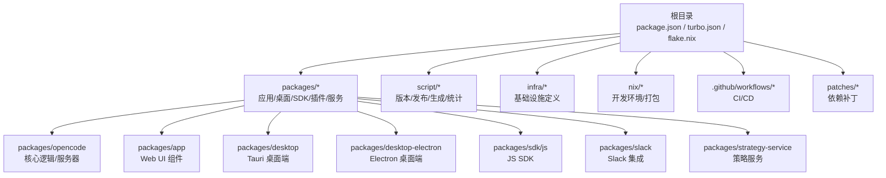
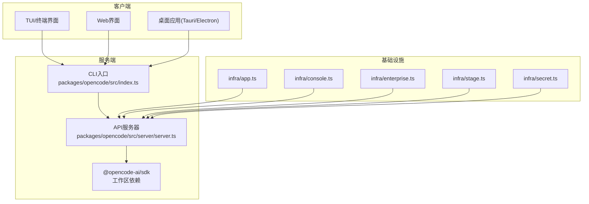
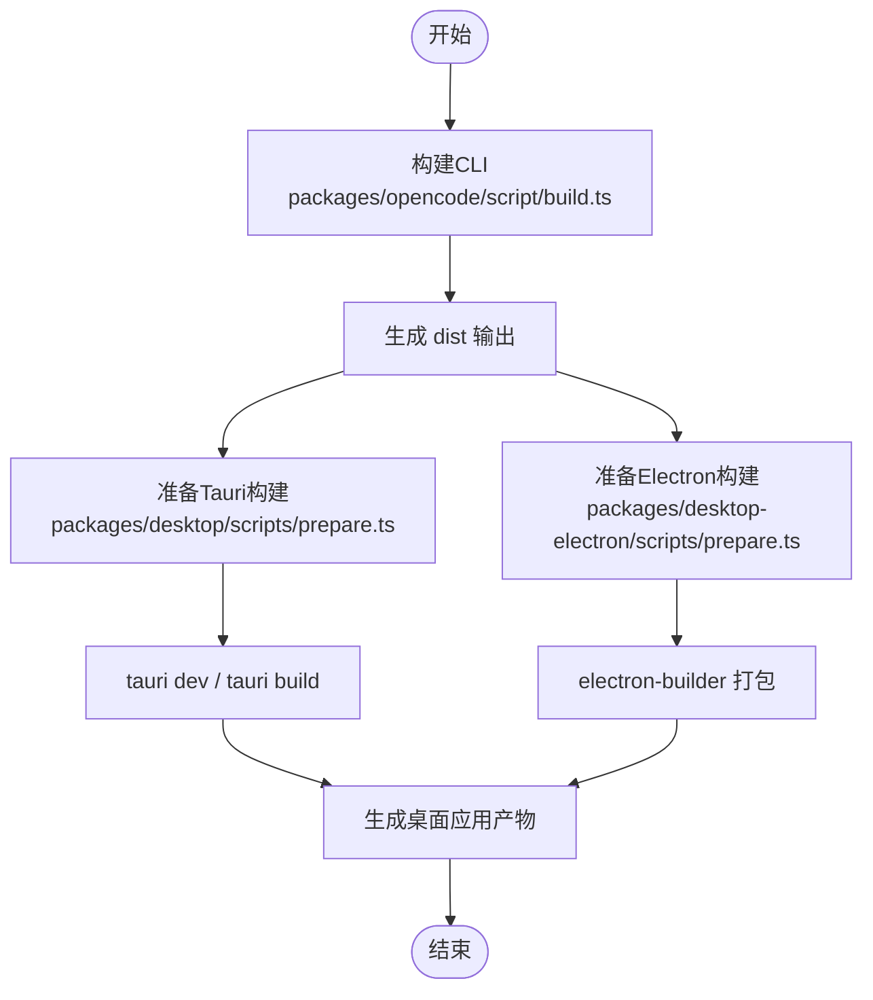
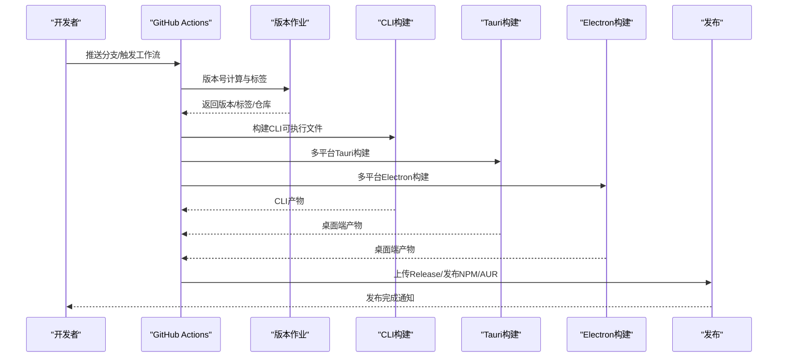
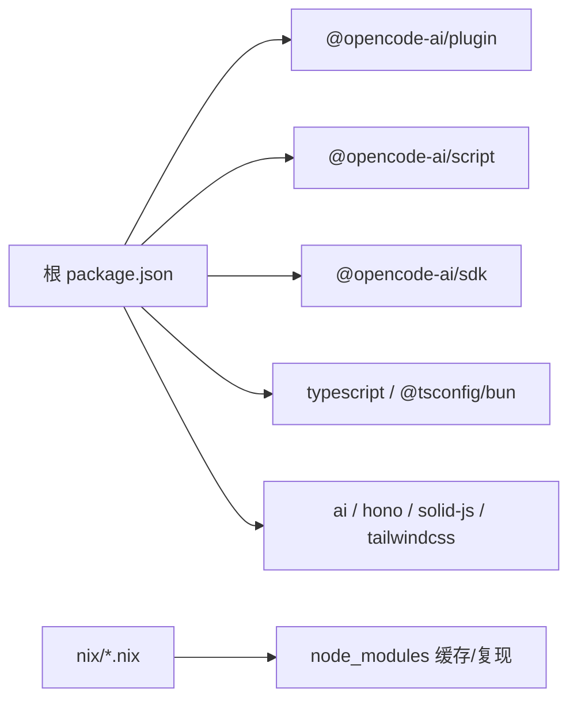

# 开发者指南

<cite>
**本文档引用的文件**
- [README.md](file://README.md)
- [CONTRIBUTING.md](file://CONTRIBUTING.md)
- [package.json](file://package.json)
- [turbo.json](file://turbo.json)
- [flake.nix](file://flake.nix)
- [bunfig.toml](file://bunfig.toml)
- [.github/workflows/publish.yml](file://.github/workflows/publish.yml)
- [.github/pull_request_template.md](file://.github/pull_request_template.md)
- [tsconfig.json](file://tsconfig.json)
- [packages/opencode/script/build.ts](file://packages/opencode/script/build.ts)
- [packages/desktop/scripts/prepare.ts](file://packages/desktop/scripts/prepare.ts)
- [packages/desktop-electron/scripts/prepare.ts](file://packages/desktop-electron/scripts/prepare.ts)
- [packages/opencode/src/index.ts](file://packages/opencode/src/index.ts)
- [packages/opencode/src/server/server.ts](file://packages/opencode/src/server/server.ts)
- [packages/app/package.json](file://packages/app/package.json)
- [packages/desktop/package.json](file://packages/desktop/package.json)
- [packages/desktop-electron/package.json](file://packages/desktop-electron/package.json)
- [packages/sdk/js/package.json](file://packages/sdk/js/package.json)
- [packages/slack/package.json](file://packages/slack/package.json)
- [packages/strategy-service/script/build.ts](file://packages/strategy-service/script/build.ts)
- [packages/strategy-service/script/build-desktop.ts](file://packages/strategy-service/script/build-desktop.ts)
- [script/generate.ts](file://script/generate.ts)
- [script/publish.ts](file://script/publish.ts)
- [script/version.ts](file://script/version.ts)
- [script/stats.ts](file://script/stats.ts)
- [sdks/vscode/package.json](file://sdks/vscode/package.json)
- [infra/app.ts](file://infra/app.ts)
- [infra/console.ts](file://infra/console.ts)
- [infra/enterprise.ts](file://infra/enterprise.ts)
- [infra/secret.ts](file://infra/secret.ts)
- [infra/stage.ts](file://infra/stage.ts)
- [nix/opencode.nix](file://nix/opencode.nix)
- [nix/desktop.nix](file://nix/desktop.nix)
- [nix/node_modules.nix](file://nix/node_modules.nix)
- [nix/scripts/canonicalize-node-modules.ts](file://nix/scripts/canonicalize-node-modules.ts)
- [nix/scripts/normalize-bun-binaries.ts](file://nix/scripts/normalize-bun-binaries.ts)
- [nix/hashes.json](file://nix/hashes.json)
- [patches/@standard-community%2Fstandard-openapi@0.2.9.patch](file://patches/@standard-community%2Fstandard-openapi@0.2.9.patch)
- [patches/@openrouter%2Fai-sdk-provider@1.5.4.patch](file://patches/@openrouter%2Fai-sdk-provider@1.5.4.patch)
</cite>

## 目录
1. [简介](#简介)
2. [项目结构](#项目结构)
3. [核心组件](#核心组件)
4. [架构总览](#架构总览)
5. [详细组件分析](#详细组件分析)
6. [依赖分析](#依赖分析)
7. [性能考虑](#性能考虑)
8. [故障排除指南](#故障排除指南)
9. [结论](#结论)
10. [附录](#附录)

## 简介
本指南面向OpenCode贡献者与开发者，提供从环境搭建、依赖安装到构建与发布的完整开发流程说明；解释Monorepo结构、包管理策略与工具链配置；给出代码规范、测试策略与持续集成流程；包含调试技巧、性能分析与问题排查方法；明确Pull Request流程、代码审查标准与发布流程；并提供贡献指南、社区参与与问题反馈渠道。

## 项目结构
OpenCode采用Monorepo组织方式，根目录通过包管理器与任务编排工具统一管理多个子包与脚本。核心目录与职责概览如下：
- 根配置：package.json（工作区、脚本、依赖）、turbo.json（任务编排）、flake.nix（Nix开发环境）、bunfig.toml（Bun行为配置）
- 包目录：packages/* 下包含应用、桌面端、SDK、插件、服务等模块
- 脚本：script/* 提供版本、发布、生成、统计等自动化脚本
- 基础设施：infra/* 定义基础设施与部署配置
- Nix：nix/* 提供可复现的开发环境与打包
- 工作流：.github/workflows/* 定义CI/CD流水线
- 补丁：patches/* 应用第三方依赖的必要修复

图表来源
- [package.json:21-27](file://package.json#L21-L27)
- [turbo.json:5-19](file://turbo.json#L5-L19)
- [flake.nix:21-51](file://flake.nix#L21-L51)

章节来源
- [package.json:21-27](file://package.json#L21-L27)
- [turbo.json:5-19](file://turbo.json#L5-L19)
- [flake.nix:21-51](file://flake.nix#L21-L51)

## 核心组件
- 核心服务器与CLI：位于 packages/opencode，提供命令行接口与API服务，支持开发模式与生产模式运行
- Web UI组件库：packages/app，基于SolidJS，用于Web界面与桌面端共享
- 桌面端应用：packages/desktop（Tauri）与 packages/desktop-electron（Electron），分别打包为多平台原生应用
- SDK与插件：packages/sdk/js 与 @opencode-ai/sdk 作为工作区依赖，提供对外SDK能力
- 基础设施：infra/* 定义不同环境（app、console、enterprise、stage、secret）的部署配置
- Nix开发环境：flake.nix 提供跨平台可复现的开发环境，内置bun、nodejs、pkg-config、openssl等工具

章节来源
- [package.json:8-19](file://package.json#L8-L19)
- [packages/opencode/src/index.ts](file://packages/opencode/src/index.ts)
- [packages/app/package.json](file://packages/app/package.json)
- [packages/desktop/package.json](file://packages/desktop/package.json)
- [packages/desktop-electron/package.json](file://packages/desktop-electron/package.json)
- [packages/sdk/js/package.json](file://packages/sdk/js/package.json)
- [infra/app.ts](file://infra/app.ts)
- [infra/console.ts](file://infra/console.ts)
- [infra/enterprise.ts](file://infra/enterprise.ts)
- [infra/secret.ts](file://infra/secret.ts)
- [infra/stage.ts](file://infra/stage.ts)
- [flake.nix:21-51](file://flake.nix#L21-L51)

## 架构总览
OpenCode采用客户端/服务器架构，核心逻辑在服务器端运行，通过CLI或Web/TUI界面交互。桌面端应用以Web UI为基础，通过Tauri/Electron进行原生封装与分发。

图表来源
- [packages/opencode/src/index.ts](file://packages/opencode/src/index.ts)
- [packages/opencode/src/server/server.ts](file://packages/opencode/src/server/server.ts)
- [packages/opencode/script/build.ts](file://packages/opencode/script/build.ts)
- [packages/desktop/scripts/prepare.ts](file://packages/desktop/scripts/prepare.ts)
- [packages/desktop-electron/scripts/prepare.ts](file://packages/desktop-electron/scripts/prepare.ts)
- [infra/app.ts](file://infra/app.ts)
- [infra/console.ts](file://infra/console.ts)
- [infra/enterprise.ts](file://infra/enterprise.ts)
- [infra/stage.ts](file://infra/stage.ts)
- [infra/secret.ts](file://infra/secret.ts)

## 详细组件分析

### 本地开发环境搭建
- 系统要求与工具链
  - 必需：Bun 1.3+，Node.js 20，pkg-config，openssl，git
  - 可选：Rust 工具链（桌面端构建）、平台特定系统库（Linux: libwebkit2gtk-4.1-dev, libappindicator3-dev, librsvg2-dev, rpm 等）
- 使用Nix（推荐）
  - flake.nix 提供跨平台开发Shell，自动安装bun、nodejs、pkg-config、openssl等
  - 可通过 nix develop 或 nix run 获取一致的开发环境
- 使用包管理器
  - 根目录提供统一的脚本与工作区配置，直接执行 bun install 与 bun dev 即可启动开发服务器

章节来源
- [CONTRIBUTING.md:34-40](file://CONTRIBUTING.md#L34-L40)
- [flake.nix:21-31](file://flake.nix#L21-L31)
- [package.json:21-27](file://package.json#L21-L27)

### 依赖安装与包管理策略
- 工作区与Catalog
  - 根 package.json 定义工作区范围与catalog依赖版本，确保各包使用一致的类型与工具版本
  - 通过 catalog 引用统一的类型定义与工具集，减少版本漂移
- 信任依赖与覆盖
  - trustedDependencies 列表中的二进制依赖被信任，避免不必要的安全扫描
  - overrides 用于强制某些包的类型版本，保证TypeScript类型一致性
- 本地补丁
  - patches/* 目录存放对第三方依赖的必要修复，确保兼容性与稳定性

章节来源
- [package.json:21-27](file://package.json#L21-L27)
- [package.json:101-117](file://package.json#L101-L117)
- [patches/@standard-community%2Fstandard-openapi@0.2.9.patch](file://patches/@standard-community%2Fstandard-openapi@0.2.9.patch)
- [patches/@openrouter%2Fai-sdk-provider@1.5.4.patch](file://patches/@openrouter%2Fai-sdk-provider@1.5.4.patch)

### 构建与打包流程
- CLI可执行文件
  - 使用 packages/opencode/script/build.ts 进行单文件构建，输出至 dist 目录
  - 支持按平台生成独立可执行文件，便于分发与测试
- 桌面端应用
  - Tauri：packages/desktop/scripts/prepare.ts 准备构建，tauri dev/tauri build 生成原生应用
  - Electron：packages/desktop-electron/scripts/prepare.ts 准备构建，electron-builder 打包多平台安装包
- 任务编排
  - turbo.json 定义 typecheck、build 等任务依赖关系与输出缓存，加速CI/本地构建

图表来源
- [packages/opencode/script/build.ts](file://packages/opencode/script/build.ts)
- [packages/desktop/scripts/prepare.ts](file://packages/desktop/scripts/prepare.ts)
- [packages/desktop-electron/scripts/prepare.ts](file://packages/desktop-electron/scripts/prepare.ts)
- [turbo.json:5-19](file://turbo.json#L5-L19)

章节来源
- [CONTRIBUTING.md:56-71](file://CONTRIBUTING.md#L56-L71)
- [CONTRIBUTING.md:142-148](file://CONTRIBUTING.md#L142-L148)
- [turbo.json:5-19](file://turbo.json#L5-L19)

### 调试与性能分析
- 调试建议
  - 推荐使用 Bun 的 --inspect 参数手动启动并附加调试器，避免断点映射错误
  - 若使用 Worker 线程，优先尝试 spawn 模式或分离调试服务器与TUI
- 性能分析
  - 使用 Bun 内置性能分析工具定位热点函数与内存占用
  - 对大型Monorepo，结合 turbo 的增量构建与缓存策略提升开发效率

章节来源
- [CONTRIBUTING.md:158-178](file://CONTRIBUTING.md#L158-L178)

### 测试策略与持续集成
- 测试位置
  - 根 package.json 中禁止从根目录直接运行测试，应进入具体包执行测试
- CI流水线
  - .github/workflows/publish.yml 定义了版本管理、CLI构建、桌面端构建与发布流程
  - 分阶段作业：version -> build-cli -> build-tauri -> build-electron -> publish
  - 多平台矩阵：macOS (x86_64/aarch64)、Windows (x86_64/aarch64)、Linux (x86_64/aarch64)
  - 发布内容：GitHub Releases、NPM、AUR（Arch Linux）

图表来源
- [.github/workflows/publish.yml:34-69](file://.github/workflows/publish.yml#L34-L69)
- [.github/workflows/publish.yml:70-104](file://.github/workflows/publish.yml#L70-L104)
- [.github/workflows/publish.yml:105-248](file://.github/workflows/publish.yml#L105-L248)
- [.github/workflows/publish.yml:249-360](file://.github/workflows/publish.yml#L249-L360)
- [.github/workflows/publish.yml:372-448](file://.github/workflows/publish.yml#L372-L448)

章节来源
- [package.json:19](file://package.json#L19)
- [.github/workflows/publish.yml:34-448](file://.github/workflows/publish.yml#L34-L448)

### 代码规范与风格
- 通用风格偏好
  - 函数保持内聚，避免过度拆分；优先使用解构但不滥用
  - 控制流尽量避免 else；错误处理倾向使用 .catch 替代 try/catch
  - 类型精确化，避免 any；变量优先不可变模式；命名简洁且描述性强
  - 在合适场景使用 Bun 文件/进程API
- 文档与注释
  - 重要变更与设计决策应记录在 memory-bank 与 docs/plans 中，便于追溯

章节来源
- [CONTRIBUTING.md:250-262](file://CONTRIBUTING.md#L250-L262)

### Pull Request流程与代码审查
- PR前提
  - 必须关联现有Issue；小而聚焦的PR更易评审；UI变更需附截图/录屏
  - 非UI变更需说明验证方式与复现步骤
- 标题规范
  - 遵循约定式提交，支持 feat/fix/docs/chore/refactor/test 等类型，并可带作用域
- 审查标准
  - 严禁AI生成长篇“墙”文本；尊重维护者时间，言简意赅
  - 重大功能需先设计讨论并通过核心团队认可

章节来源
- [CONTRIBUTING.md:190-262](file://CONTRIBUTING.md#L190-L262)
- [.github/pull_request_template.md:1-30](file://.github/pull_request_template.md#L1-L30)

### 发布流程
- 版本管理
  - script/version.ts 计算新版本、标签与发布信息，支持 major/minor/patch 与自定义版本
- 产物发布
  - CLI：上传至GitHub Releases
  - 桌面端：Tauri/Electron分别生成多平台安装包
  - 包管理：NPM发布、AUR同步（Arch Linux）
- 自动化
  - .github/workflows/publish.yml 完整覆盖版本、构建、签名、打包与发布

章节来源
- [script/version.ts](file://script/version.ts)
- [.github/workflows/publish.yml:34-448](file://.github/workflows/publish.yml#L34-L448)

### 贡献指南与社区参与
- 贡献方向
  - 常见合并方向：Bug修复、新增LSP/格式化器、LLM性能优化、新模型提供商支持、环境适配、标准行为补齐、文档改进
- 设计评审
  - 任何UI或核心产品特性变更需经设计评审
- 社区渠道
  - Discord、GitHub Issues、X.com等

章节来源
- [CONTRIBUTING.md:3-25](file://CONTRIBUTING.md#L3-L25)
- [README.md:119-122](file://README.md#L119-L122)

## 依赖分析
- 工作区依赖
  - @opencode-ai/plugin、@opencode-ai/script、@opencode-ai/sdk 作为工作区依赖，实现模块间共享与版本统一
- 类型与工具
  - 通过 @tsconfig/bun、typescript、@types/* 等确保类型安全与一致的编译配置
- 第三方SDK
  - ai、hono、solid-js、tailwindcss 等作为业务与UI相关依赖
- Nix依赖
  - nix/opencode.nix、nix/desktop.nix、nix/node_modules.nix 提供可复现的依赖树与二进制缓存

图表来源
- [package.json:85-91](file://package.json#L85-L91)
- [package.json:28-71](file://package.json#L28-L71)
- [nix/opencode.nix](file://nix/opencode.nix)
- [nix/desktop.nix](file://nix/desktop.nix)
- [nix/node_modules.nix](file://nix/node_modules.nix)

章节来源
- [package.json:28-91](file://package.json#L28-L91)
- [nix/opencode.nix](file://nix/opencode.nix)
- [nix/desktop.nix](file://nix/desktop.nix)
- [nix/node_modules.nix](file://nix/node_modules.nix)

## 性能考虑
- Monorepo构建优化
  - 使用 turbo 的增量构建与任务依赖图，避免重复编译
  - 合理划分包边界，减少无关包的重建
- 依赖管理
  - 通过catalog与overrides固定关键依赖版本，降低CI波动
  - 使用trustedDependencies减少不必要的安全扫描开销
- 开发体验
  - Nix提供可复现环境，减少“在我机器上能跑”的差异
  - Bun的快速运行时与内置打包能力提升迭代速度

章节来源
- [turbo.json:5-19](file://turbo.json#L5-L19)
- [package.json:101-117](file://package.json#L101-L117)
- [flake.nix:21-31](file://flake.nix#L21-L31)

## 故障排除指南
- 断点不生效
  - 尝试使用 --inspect 附加调试器；必要时使用 spawn 模式或分离调试服务器与TUI
- 测试无法从根目录运行
  - 根 package.json 明确禁止从根目录执行测试，请进入具体包执行
- 桌面端构建失败
  - 确认已安装平台所需系统库；检查Rust工具链与签名证书配置
- 依赖冲突
  - 检查 patches/* 是否正确应用；确认 overrides 与 catalog 的版本约束是否合理

章节来源
- [CONTRIBUTING.md:158-178](file://CONTRIBUTING.md#L158-L178)
- [package.json:19](file://package.json#L19)
- [.github/workflows/publish.yml:168-175](file://.github/workflows/publish.yml#L168-L175)
- [patches/@standard-community%2Fstandard-openapi@0.2.9.patch](file://patches/@standard-community%2Fstandard-openapi@0.2.9.patch)
- [patches/@openrouter%2Fai-sdk-provider@1.5.4.patch](file://patches/@openrouter%2Fai-sdk-provider@1.5.4.patch)

## 结论
本指南系统梳理了OpenCode的开发与发布全链路：从环境搭建、依赖管理到构建打包；从调试与性能优化到CI/CD与发布；从代码规范到PR流程与社区协作。遵循上述流程与最佳实践，可显著提升开发效率与质量，保障多平台产物的一致性与可靠性。

## 附录
- 常用脚本与命令
  - 开发：bun install → bun dev
  - 服务器：bun dev serve（默认端口4096）
  - Web：bun run --cwd packages/app dev
  - 桌面端：bun run --cwd packages/desktop tauri dev
  - 本地构建：./packages/opencode/script/build.ts --single
- 关键配置参考
  - TypeScript：tsconfig.json 继承 @tsconfig/bun
  - 任务编排：turbo.json
  - Nix开发环境：flake.nix
  - Bun行为：bunfig.toml

章节来源
- [CONTRIBUTING.md:34-95](file://CONTRIBUTING.md#L34-L95)
- [CONTRIBUTING.md:111-148](file://CONTRIBUTING.md#L111-L148)
- [tsconfig.json:1-6](file://tsconfig.json#L1-L6)
- [turbo.json:1-21](file://turbo.json#L1-L21)
- [flake.nix:1-77](file://flake.nix#L1-L77)
- [bunfig.toml:1-7](file://bunfig.toml#L1-L7)