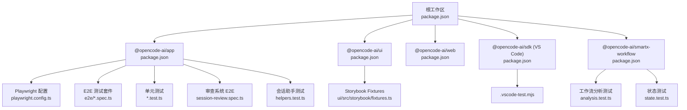
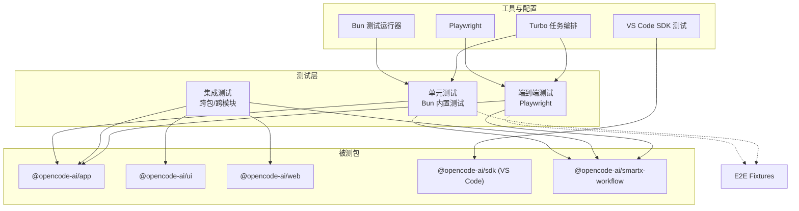
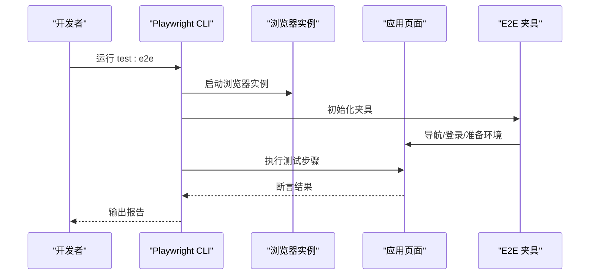
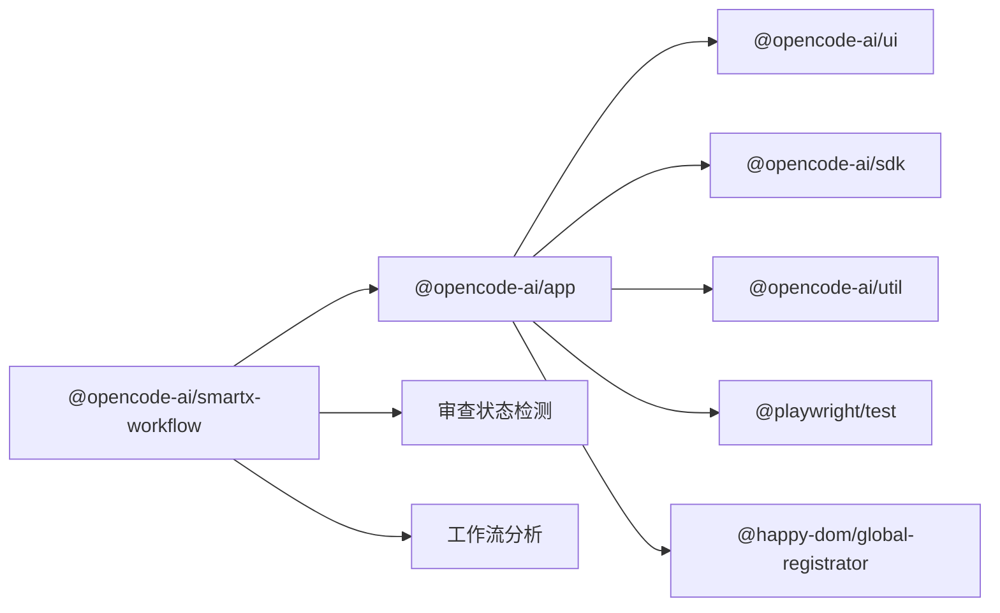

# 测试策略

<cite>
**本文引用的文件**
- [package.json](file://package.json)
- [turbo.json](file://turbo.json)
- [packages/app/package.json](file://packages/app/package.json)
- [packages/app/playwright.config.ts](file://packages/app/playwright.config.ts)
- [packages/app/e2e/fixtures.ts](file://packages/app/e2e/fixtures.ts)
- [packages/app/e2e/session/session-review.spec.ts](file://packages/app/e2e/session/session-review.spec.ts)
- [packages/app/src/pages/session/helpers.test.ts](file://packages/app/src/pages/session/helpers.test.ts)
- [packages/opencode/test/fixture/fixture.ts](file://packages/opencode/test/fixture/fixture.ts)
- [packages/opencode/test/fixture/fixture.test.ts](file://packages/opencode/test/fixture/fixture.test.ts)
- [packages/ui/src/storybook/fixtures.ts](file://packages/ui/src/storybook/fixtures.ts)
- [packages/smartx-workflow/test/analysis.test.ts](file://packages/smartx-workflow/test/analysis.test.ts)
- [packages/smartx-workflow/test/state.test.ts](file://packages/smartx-workflow/test/state.test.ts)
- [packages/smartx-workflow/src/parse.ts](file://packages/smartx-workflow/src/parse.ts)
- [.github/workflows/publish-python-sdk.yml](file://.github/workflows/publish-python-sdk.yml)
- [sdks/vscode/package.json](file://sdks/vscode/package.json)
- [sdks/vscode/.vscode-test.mjs](file://sdks/vscode/.vscode-test.mjs)
</cite>

## 更新摘要
**所做更改**
- 新增审查系统测试用例章节，涵盖端到端测试和单元测试
- 更新智能工作流测试部分，包含审查状态检测和工作流分析测试
- 增强测试基础设施描述，反映新增的审查相关测试文件
- 完善测试命令和覆盖率要求，确保审查系统的完整测试覆盖

## 目录
1. [引言](#引言)
2. [项目结构](#项目结构)
3. [核心组件](#核心组件)
4. [架构总览](#架构总览)
5. [详细组件分析](#详细组件分析)
6. [审查系统测试](#审查系统测试)
7. [依赖分析](#依赖分析)
8. [性能考虑](#性能考虑)
9. [故障排查指南](#故障排查指南)
10. [结论](#结论)
11. [附录](#附录)

## 引言
本测试策略面向 OpenCode 项目，旨在建立覆盖单元测试、集成测试与端到端测试（E2E）的完整测试体系。文档从测试框架与工具配置入手，明确各包的测试组织方式、运行命令与并行执行方案，并给出覆盖率要求、Mock 策略、测试数据管理、性能与安全测试实施方案以及调试与维护最佳实践。特别关注新增的审查系统测试用例，确保在多包工作区中实现一致、可重复且高效的测试流程。

## 项目结构
OpenCode 采用 monorepo 结构，使用工作区管理多个包。根级脚本用于统一开发与构建，各子包定义自身的测试脚本与工具配置。Playwright 作为 E2E 测试框架，Bun 的内置测试作为单元测试基础，Turbo 负责任务编排与缓存。新增的审查系统测试用例分布在应用包和智能工作流包中。

**图表来源**
- [package.json:1-118](file://package.json#L1-L118)
- [packages/app/package.json:1-74](file://packages/app/package.json#L1-L74)
- [packages/smartx-workflow/test/analysis.test.ts](file://packages/smartx-workflow/test/analysis.test.ts)
- [packages/smartx-workflow/test/state.test.ts](file://packages/smartx-workflow/test/state.test.ts)
- [packages/app/e2e/session/session-review.spec.ts](file://packages/app/e2e/session/session-review.spec.ts)
- [packages/app/src/pages/session/helpers.test.ts](file://packages/app/src/pages/session/helpers.test.ts)

**章节来源**
- [package.json:1-118](file://package.json#L1-L118)
- [turbo.json:1-21](file://turbo.json#L1-L21)

## 核心组件
- 单元测试（Bun 内置测试）
  - 在 @opencode-ai/app 包中通过 Bun 的内置测试运行器执行，使用 DOM 沙箱注册以支持前端组件测试。
  - 新增审查系统相关的单元测试，包括会话助手函数和智能工作流状态检测。
  - 命令：test:unit、test:unit:watch
- 端到端测试（Playwright）
  - 使用 Playwright 进行浏览器自动化测试，配置集中于 playwright.config.ts，测试文件位于 packages/app/e2e。
  - 新增审查系统 E2E 测试，专门测试审查界面的滚动位置保持和实时差异更新。
  - 命令：test:e2e、test:e2e:local、test:e2e:ui、test:e2e:report
- 集成测试与跨包测试
  - 通过 Turbo 任务编排，先构建再进行测试；opencode#test、@opencode-ai/app#test 等任务定义了依赖关系与输出缓存。
  - 智能工作流测试涵盖审查状态检测和工作流分析逻辑。
- 测试夹具（Fixtures）
  - E2E 层面提供 fixtures.ts 统一注入上下文与资源；UI Storybook 提供独立的 fixtures 以支持组件测试。
- 覆盖率与报告
  - 根据 Playwright 配置与 Bun 测试能力，建议在 CI 中启用覆盖率收集与报告生成。

**章节来源**
- [packages/app/package.json:17-24](file://packages/app/package.json#L17-L24)
- [packages/app/playwright.config.ts](file://packages/app/playwright.config.ts)
- [turbo.json:11-18](file://turbo.json#L11-L18)

## 架构总览
下图展示了测试在 OpenCode 中的分层与交互，特别突出了审查系统的测试架构：

**图表来源**
- [packages/app/package.json:17-24](file://packages/app/package.json#L17-L24)
- [packages/app/playwright.config.ts](file://packages/app/playwright.config.ts)
- [turbo.json:5-18](file://turbo.json#L5-L18)
- [sdks/vscode/package.json](file://sdks/vscode/package.json)

## 详细组件分析

### 单元测试（Bun 内置测试）
- 运行方式
  - 使用 Bun 的内置测试运行器，通过 preload 注入 DOM 环境，适配前端组件测试。
  - 支持 watch 模式便于快速迭代。
- 文件组织
  - 位于 packages/app/src 下的 *.test.ts 文件，遵循"同名文件 + .test.ts"的命名约定。
  - 新增审查系统测试文件 helpers.test.ts，测试会话助手函数。
- 覆盖率与报告
  - 建议在 CI 中启用覆盖率统计与报告生成，结合 Turbo 缓存提升效率。
- Mock 策略
  - 对外部依赖（如网络请求、文件系统）使用模块替换或代理对象进行隔离。
- 测试数据管理
  - 小型、可复用的数据放入测试文件附近；复杂场景使用 fixtures 或工厂函数生成。
- 并发与并行
  - 在本地可使用 watch 模式并行运行不同模块的测试；CI 中按包并行执行。

**章节来源**
- [packages/app/package.json:17-20](file://packages/app/package.json#L17-L20)
- [packages/app/src/pages/session/helpers.test.ts](file://packages/app/src/pages/session/helpers.test.ts)

### 端到端测试（Playwright）
- 运行方式
  - 通过 playwright test 执行，支持本地 UI 模式与报告展示。
  - 提供本地联调脚本与报告查看命令。
- 配置与夹具
  - 配置集中在 playwright.config.ts；E2E 夹具在 e2e/fixtures.ts 中统一注入。
- 文件组织
  - 按功能域划分 spec 文件，例如 app、commands、files、models、projects、prompt 等目录。
  - 新增审查系统专用测试文件 session-review.spec.ts，专门测试审查界面功能。
- 并发与并行
  - Playwright 支持并行浏览器实例；CI 中可按套件拆分并行执行。
- 报告与可视化
  - 使用 show-report 查看 HTML 报告，便于问题定位与回归验证。

**图表来源**
- [packages/app/package.json:20-23](file://packages/app/package.json#L20-L23)
- [packages/app/playwright.config.ts](file://packages/app/playwright.config.ts)
- [packages/app/e2e/fixtures.ts](file://packages/app/e2e/fixtures.ts)

**章节来源**
- [packages/app/package.json:20-23](file://packages/app/package.json#L20-L23)
- [packages/app/playwright.config.ts](file://packages/app/playwright.config.ts)
- [packages/app/e2e/fixtures.ts](file://packages/app/e2e/fixtures.ts)
- [packages/app/e2e/session/session-review.spec.ts](file://packages/app/e2e/session/session-review.spec.ts)

### 集成测试与跨包测试
- 任务编排
  - Turbo 定义了 opencode#test、@opencode-ai/app#test 等任务，先构建再测试，确保产物可用。
- 数据与状态
  - 使用共享夹具或临时服务（如内存数据库）保证测试隔离与可重复性。
- 并发执行
  - 在 CI 中按包并行执行测试任务，缩短整体耗时。

**章节来源**
- [turbo.json:11-18](file://turbo.json#L11-L18)

### VS Code SDK 测试
- 测试运行
  - 通过 .vscode-test.mjs 驱动 VS Code 测试运行器，适用于扩展或插件相关测试。
- 配置
  - sdks/vscode/package.json 中声明了测试脚本与依赖。

**章节来源**
- [sdks/vscode/.vscode-test.mjs](file://sdks/vscode/.vscode-test.mjs)
- [sdks/vscode/package.json](file://sdks/vscode/package.json)

## 审查系统测试

### 审查系统 E2E 测试
- 测试目标
  - 验证审查界面在实时差异更新后保持滚动位置稳定
  - 测试审查文件的展开/折叠功能
  - 验证审查界面的响应式布局和交互行为
- 测试策略
  - 使用确定性种子数据创建大量审查文件
  - 通过补丁操作模拟实时代码变更
  - 验证滚动位置差异不超过阈值
- 关键测试点
  - 滚动位置保持：`review keeps scroll position after a live diff update`
  - 审查文件展开：`Expand all` 和 `Collapse all` 按钮功能
  - 实时差异更新：补丁应用后的界面响应

### 智能工作流审查测试
- 工作流分析测试
  - 验证审查请求检测和工作流注入
  - 测试失败审查的保存和修复流程
  - 验证通过审查后的调试队列和最终收口
- 状态检测测试
  - 审查状态变体检测：`reviewState`
  - 工作流状态跟踪和提醒构建
  - 审查项目状态的通过/失败/警告判定

### 会话助手单元测试
- 功能测试
  - `createOpenReviewFile`：审查文件打开和加载流程
  - `createOpenSessionFileTab`：会话文件标签激活
  - `focusTerminalById`：终端焦点管理
  - `getTabReorderIndex`：标签重排序索引计算
  - `createSessionTabs`：会话标签创建和回退机制

**章节来源**
- [packages/app/e2e/session/session-review.spec.ts](file://packages/app/e2e/session/session-review.spec.ts)
- [packages/app/src/pages/session/helpers.test.ts](file://packages/app/src/pages/session/helpers.test.ts)
- [packages/smartx-workflow/test/analysis.test.ts](file://packages/smartx-workflow/test/analysis.test.ts)
- [packages/smartx-workflow/test/state.test.ts](file://packages/smartx-workflow/test/state.test.ts)
- [packages/smartx-workflow/src/parse.ts](file://packages/smartx-workflow/src/parse.ts)

## 依赖分析
- 测试工具链
  - Playwright 作为 E2E 核心；Bun 内置测试用于单元测试；Turbo 负责任务编排与缓存。
- 包间依赖
  - @opencode-ai/app 依赖 @opencode-ai/ui、@opencode-ai/sdk、@opencode-ai/util 等，测试需覆盖这些依赖的交互。
  - 智能工作流包提供审查状态检测和工作流分析功能。
- 外部依赖
  - @playwright/test、@happy-dom/global-registrator 等作为测试运行时依赖。

**图表来源**
- [packages/app/package.json:40-72](file://packages/app/package.json#L40-L72)

**章节来源**
- [packages/app/package.json:26-38](file://packages/app/package.json#L26-L38)
- [packages/app/package.json:40-72](file://packages/app/package.json#L40-L72)

## 性能考虑
- 单元测试
  - 使用最小化夹具与 Mock，避免真实 I/O；优先断言关键路径。
  - 审查系统测试使用确定性数据，减少随机性导致的性能波动。
- E2E 测试
  - 合理拆分套件，利用并行实例；减少页面等待时间，使用稳定的元素选择器。
  - 审查系统测试包含大量文件操作，需优化测试数据生成和清理。
- 构建与缓存
  - Turbo 先构建再测试，避免重复编译；在 CI 中启用缓存以加速。
- 资源隔离
  - 使用独立的测试数据库或内存存储，避免并发写入冲突。

## 故障排查指南
- Playwright 测试失败
  - 使用 --ui 模式调试交互流程；检查 e2e/fixtures.ts 中的初始化逻辑；查看报告定位失败步骤。
  - 审查系统测试失败时，重点关注滚动位置验证和实时差异更新。
- 单元测试异常
  - 确认 DOM 注册是否正确加载；检查模块导入路径与别名解析；逐步缩小测试范围。
  - 审查系统测试失败时，检查会话助手函数的回调模拟和状态断言。
- 覆盖率不达标
  - 补充边界条件与错误分支测试；对高风险模块提高断言密度。
  - 特别关注审查状态检测和工作流分析的边界情况。
- CI 并行超时
  - 拆分大型套件；优化测试顺序；减少不必要的等待与重试。
- VS Code SDK 测试
  - 检查 .vscode-test.mjs 的入口与参数；确认 VS Code 测试运行器版本兼容性。

**章节来源**
- [packages/app/package.json:20-23](file://packages/app/package.json#L20-L23)
- [packages/app/e2e/fixtures.ts](file://packages/app/e2e/fixtures.ts)

## 结论
通过将 Bun 内置测试、Playwright 与 Turbo 编排有机结合，OpenCode 可以在多包环境中实现高效、可维护的测试体系。新增的审查系统测试用例进一步完善了测试覆盖范围，包括端到端的用户界面测试和单元层面的功能测试。建议在 CI 中强制覆盖率门槛、规范化夹具与测试数据管理，并持续优化测试并行度与报告质量，以保障代码质量与交付稳定性。

## 附录

### 测试命令速查
- 单元测试
  - 运行：test:unit
  - 监听：test:unit:watch
- E2E 测试
  - 运行：test:e2e
  - 本地联调：test:e2e:local
  - UI 模式：test:e2e:ui
  - 查看报告：test:e2e:report
- 跨包测试
  - Turbo 任务：opencode#test、@opencode-ai/app#test
- 审查系统测试
  - 审查 E2E：test:e2e:review
  - 审查单元测试：test:review:unit

**章节来源**
- [packages/app/package.json:17-24](file://packages/app/package.json#L17-L24)
- [turbo.json:11-18](file://turbo.json#L11-L18)

### 覆盖率与报告
- 建议在 CI 中启用覆盖率统计与报告生成，结合 Playwright 与 Bun 测试能力，形成闭环反馈。
- 报告可通过 Playwright 的 show-report 命令查看，便于问题定位与回归验证。
- 审查系统测试应达到 90% 以上的覆盖率要求。

**章节来源**
- [packages/app/package.json:20-23](file://packages/app/package.json#L20-L23)

### Mock 策略与测试数据管理
- Mock 策略
  - 使用模块替换或代理对象隔离外部依赖；对网络请求、文件系统、第三方 SDK 进行 Mock。
  - 审查系统测试中模拟会话状态和文件系统操作。
- 测试数据管理
  - 小型数据就近存放；复杂场景使用 fixtures 或工厂函数；确保数据可复用与可清理。
  - 审查系统测试使用确定性种子数据和补丁操作。

### 并发执行与 CI 集成
- 本地：watch 模式并行运行不同模块测试。
- CI：按包并行执行测试任务，先构建再测试；启用缓存与报告归档。
- 审查系统测试：由于测试数据量大，建议串行执行以避免资源竞争。

**章节来源**
- [turbo.json:5-18](file://turbo.json#L5-L18)

### 安全测试与兼容性测试
- 安全测试
  - 针对输入校验、权限控制与敏感数据处理补充测试用例；在 E2E 中模拟异常输入与越权操作。
  - 审查系统测试验证用户输入的安全性和界面的健壮性。
- 兼容性测试
  - 使用 Playwright 的多浏览器矩阵；在不同操作系统与分辨率下验证关键流程。
  - 审查界面在不同屏幕尺寸下的表现和响应性。

### 测试调试技巧与最佳实践
- 调试技巧
  - 使用 --ui 模式观察交互；在 fixtures 中注入日志或调试开关；分层缩小问题范围。
  - 审查系统测试使用详细的断言信息和超时设置。
- 最佳实践
  - 规范化命名与文件组织；为每个模块维护独立的夹具；定期重构测试以保持可读性与可维护性。
  - 审查系统测试应包含完整的边界条件测试和错误处理验证。