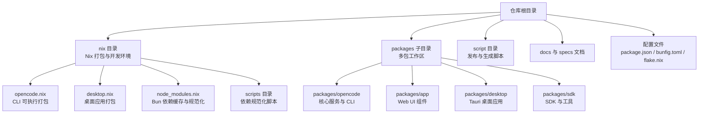
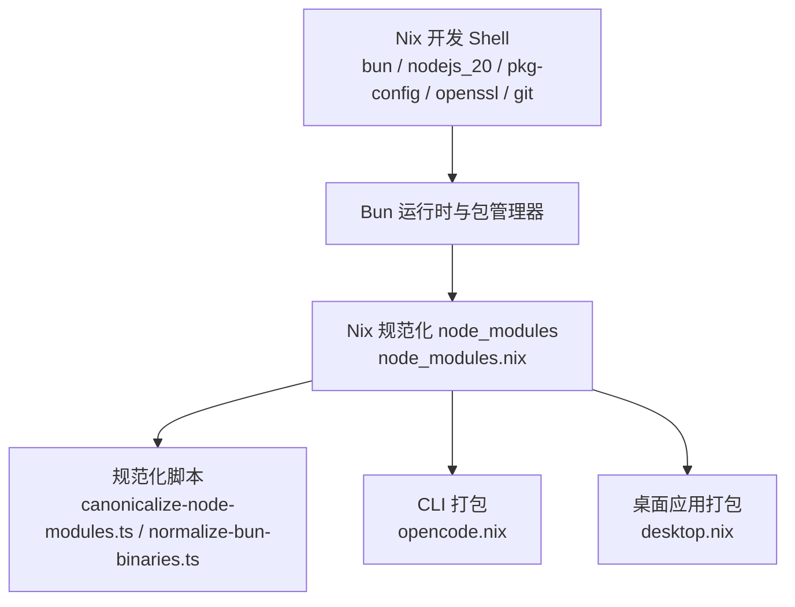
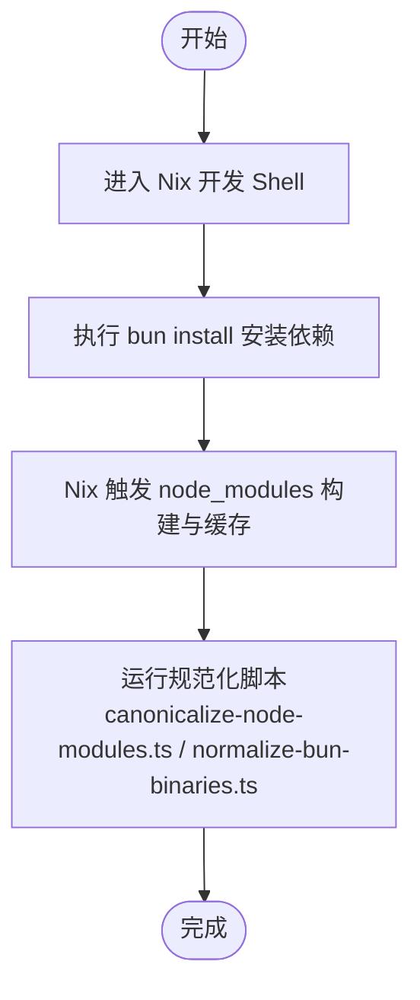
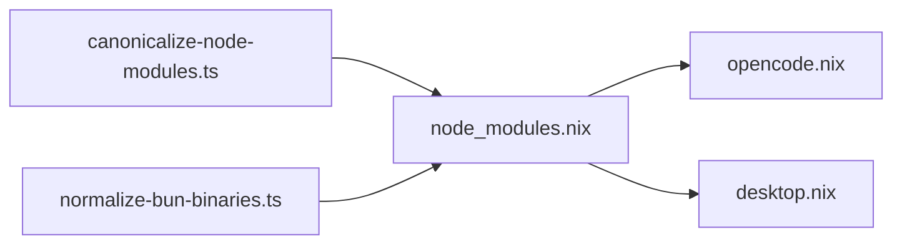

# 环境搭建

<cite>
**本文引用的文件**
- [flake.nix](file://flake.nix)
- [flake.lock](file://flake.lock)
- [package.json](file://package.json)
- [bunfig.toml](file://bunfig.toml)
- [CONTRIBUTING.md](file://CONTRIBUTING.md)
- [README.md](file://README.md)
- [nix/opencode.nix](file://nix/opencode.nix)
- [nix/desktop.nix](file://nix/desktop.nix)
- [nix/node_modules.nix](file://nix/node_modules.nix)
- [nix/scripts/canonicalize-node-modules.ts](file://nix/scripts/canonicalize-node-modules.ts)
- [nix/scripts/normalize-bun-binaries.ts](file://nix/scripts/normalize-bun-binaries.ts)
</cite>

## 目录
1. [简介](#简介)
2. [项目结构](#项目结构)
3. [核心组件](#核心组件)
4. [架构总览](#架构总览)
5. [详细组件分析](#详细组件分析)
6. [依赖分析](#依赖分析)
7. [性能考虑](#性能考虑)
8. [故障排除指南](#故障排除指南)
9. [结论](#结论)
10. [附录](#附录)

## 简介
本指南面向希望在本地搭建 OpenCode 开发环境的开发者，覆盖系统要求、依赖安装、Nix 环境与 Flake 使用、跨平台安装步骤、环境变量与 IDE 设置、验证方法及常见问题排查。OpenCode 采用 Bun 作为包管理与运行时，使用 Nix 进行可复现的开发环境构建，并通过多包工作区组织前端、桌面应用、SDK 等模块。

## 项目结构
OpenCode 仓库采用 monorepo 结构，根目录包含工作区配置、Nix 打包定义、脚本与文档；packages 子目录下包含多个功能包（如 opencode 核心、web 前端、desktop 桌面应用、sdk 等）；nix 目录提供 Nix 包装与开发 Shell 定义。

图示来源
- [flake.nix:1-77](file://flake.nix#L1-L77)
- [package.json:1-118](file://package.json#L1-L118)

章节来源
- [flake.nix:1-77](file://flake.nix#L1-L77)
- [package.json:1-118](file://package.json#L1-L118)

## 核心组件
- 包管理与运行时：Bun（版本要求见贡献指南），使用工作区统一管理依赖与脚本。
- Nix 开发环境：通过 flake.nix 提供 devShell，内置 bun、nodejs_20、pkg-config、openssl、git 等工具。
- 依赖缓存与规范化：nix/node_modules.nix 负责以 Nix 方式安装并规范化 node_modules，nix/scripts 下的两个脚本确保 .bun 缓存与二进制链接一致。
- CLI 与桌面应用：nix/opencode.nix 与 nix/desktop.nix 分别打包命令行工具与桌面应用，支持自动补全与平台依赖注入。

章节来源
- [CONTRIBUTING.md:34-40](file://CONTRIBUTING.md#L34-L40)
- [flake.nix:21-31](file://flake.nix#L21-L31)
- [nix/node_modules.nix:44-76](file://nix/node_modules.nix#L44-L76)
- [nix/opencode.nix:15-89](file://nix/opencode.nix#L15-L89)
- [nix/desktop.nix:26-101](file://nix/desktop.nix#L26-L101)

## 架构总览
下图展示本地开发环境的关键构件及其交互关系：Bun 作为运行时与包管理器，Nix 提供可复现的开发 Shell 与打包；CLI 与桌面应用分别由各自 Nix 表达式构建并注入必要依赖。

图示来源
- [flake.nix:21-31](file://flake.nix#L21-L31)
- [nix/node_modules.nix:44-76](file://nix/node_modules.nix#L44-L76)
- [nix/opencode.nix:15-89](file://nix/opencode.nix#L15-L89)
- [nix/desktop.nix:26-101](file://nix/desktop.nix#L26-L101)
- [nix/scripts/canonicalize-node-modules.ts:1-102](file://nix/scripts/canonicalize-node-modules.ts#L1-L102)
- [nix/scripts/normalize-bun-binaries.ts:1-131](file://nix/scripts/normalize-bun-binaries.ts#L1-L131)

## 详细组件分析

### 系统要求与工具链
- Node.js 版本：flake.nix 中使用 nodejs_20 作为开发 Shell 的一部分，建议在本地也保持 Node.js 20 兼容的环境。
- Bun 运行时：贡献指南要求 Bun 1.3+；package.json 指定 packageManager 为 bun@1.3.10。
- Nix 包管理器：使用 flake.nix 与 flake.lock 管理输入与锁定版本；支持 aarch64-linux、x86_64-linux、aarch64-darwin、x86_64-darwin 四个系统。
- Git：开发 Shell 内置，用于源码与依赖拉取。
- OpenSSL/pkg-config：用于编译与链接依赖。

章节来源
- [CONTRIBUTING.md:34-40](file://CONTRIBUTING.md#L34-L40)
- [package.json:7-7](file://package.json#L7-L7)
- [flake.nix:4-16](file://flake.nix#L4-L16)
- [flake.nix:21-31](file://flake.nix#L21-L31)

### 依赖安装步骤
- 全局依赖（Nix 开发 Shell）
  - 在仓库根目录执行 nix 开发命令，进入包含 bun、nodejs_20、pkg-config、openssl、git 的 Shell。
  - 该 Shell 会自动提供后续开发所需的工具链。
- 项目依赖（Bun 工作区）
  - 在 Shell 内执行 bun install，安装所有工作区包的依赖。
  - 依赖安装由 nix/node_modules.nix 通过 Nix 控制，确保一致性与可复现性。
- 依赖规范化
  - 自动执行规范化脚本，修复 .bun 缓存与二进制链接问题，保证跨平台一致性。

图示来源
- [flake.nix:21-31](file://flake.nix#L21-L31)
- [nix/node_modules.nix:44-76](file://nix/node_modules.nix#L44-L76)
- [nix/scripts/canonicalize-node-modules.ts:1-102](file://nix/scripts/canonicalize-node-modules.ts#L1-L102)
- [nix/scripts/normalize-bun-binaries.ts:1-131](file://nix/scripts/normalize-bun-binaries.ts#L1-L131)

章节来源
- [flake.nix:21-31](file://flake.nix#L21-L31)
- [nix/node_modules.nix:44-76](file://nix/node_modules.nix#L44-L76)
- [nix/scripts/canonicalize-node-modules.ts:1-102](file://nix/scripts/canonicalize-node-modules.ts#L1-L102)
- [nix/scripts/normalize-bun-binaries.ts:1-131](file://nix/scripts/normalize-bun-binaries.ts#L1-L131)

### Nix 环境配置、Flake 系统与包管理器选择
- Flake 输入与系统矩阵
  - 输入 nixpkgs 来自 nixpkgs-unstable；系统矩阵包含 aarch64-linux、x86_64-linux、aarch64-darwin、x86_64-darwin。
- 开发 Shell
  - devShells.default 提供统一工具集，便于在不同平台上获得一致的开发体验。
- 包与叠加层（Overlay）
  - overlays.default 将 node_modules 衍生物注入到最终包中，形成 opencode 与 opencode-desktop。
  - packages.default 为 opencode 主包，同时提供 desktop 包与 node_modules_updater 用于更新哈希。
- 包管理器选择
  - 项目以 Nix 为主进行可复现构建，同时保留 Bun 作为工作区包管理与运行时，二者互补：Nix 确保环境一致性，Bun 确保快速迭代与开发体验。

章节来源
- [flake.nix:4-16](file://flake.nix#L4-L16)
- [flake.nix:21-31](file://flake.nix#L21-L31)
- [flake.nix:33-51](file://flake.nix#L33-L51)
- [flake.nix:53-74](file://flake.nix#L53-L74)
- [flake.lock:1-28](file://flake.lock#L1-L28)

### 不同操作系统（Windows、macOS、Linux）的具体安装步骤
- 通用步骤
  - 安装 Nix（单用户或多用户模式均可）。
  - 在仓库根目录启用 flakes 并进入开发 Shell。
  - 在 Shell 内执行 bun install 安装依赖。
- Windows
  - 推荐使用 WSL2 或 Windows 上的 Nix 安装方式，确保与 Linux 系统兼容。
  - 若直接在 Windows 上使用 Nix，注意路径与权限差异。
- macOS
  - 使用 Homebrew 安装 Nix 后，按通用步骤操作。
  - 如需桌面应用开发，还需满足 Tauri 前置条件（Rust 工具链、平台库等）。
- Linux
  - 使用发行版包管理器安装 Nix，或参考官方安装方式。
  - 注意桌面应用构建可能需要额外系统库（详见贡献指南的 Tauri 前置条件）。

章节来源
- [CONTRIBUTING.md:150-151](file://CONTRIBUTING.md#L150-L151)
- [README.md:46-62](file://README.md#L46-L62)

### 环境变量配置与 IDE 设置
- 环境变量
  - opencode.nix 注入以下变量：MODELS_DEV_API_JSON、OPENCODE_DISABLE_MODELS_FETCH、OPENCODE_VERSION、OPENCODE_CHANNEL。
  - 版本检查相关：versionCheckHook、writableTmpDirAsHomeHook、HOME、OPENCODE_DISABLE_MODELS_FETCH。
- IDE 设置
  - 推荐使用 VSCode，并参考贡献指南中的示例配置文件（settings.example.json、launch.example.json）。
  - 建议启用 Prettier、ESLint、TypeScript 支持，确保格式与类型检查一致。
- 开发工具
  - 使用 Bun 调试时，建议通过 --inspect 参数启动并在调试器中附加，避免断点映射错误。

章节来源
- [nix/opencode.nix:36-40](file://nix/opencode.nix#L36-L40)
- [nix/opencode.nix:78-84](file://nix/opencode.nix#L78-L84)
- [CONTRIBUTING.md:179-188](file://CONTRIBUTING.md#L179-L188)

### 验证环境是否正确搭建
- CLI 验证
  - 在开发 Shell 中运行 opencode --version，应输出版本信息（由 Nix 包装注入）。
- 依赖验证
  - 确认 node_modules 已生成且规范化脚本已执行，避免 .bun 缓存导致的二进制链接问题。
- 桌面应用验证
  - 在 packages/desktop 目录下运行 tauri dev，确认本地窗口与 Web 服务器正常启动。
- Web 应用验证
  - 在 packages/app 目录下运行 dev，访问本地端口查看 UI 是否正常加载。

章节来源
- [nix/opencode.nix:82-84](file://nix/opencode.nix#L82-L84)
- [nix/desktop.nix:139-140](file://nix/desktop.nix#L139-L140)
- [CONTRIBUTING.md:118-122](file://CONTRIBUTING.md#L118-L122)

## 依赖分析
- 组件耦合
  - node_modules.nix 为 opencode.nix 与 desktop.nix 的共同输入，确保 CLI 与桌面应用共享同一套依赖树。
  - 规范化脚本独立于主流程，但对 .bun 缓存与二进制链接进行后处理，降低跨平台差异。
- 外部依赖
  - nixpkgs 提供基础工具链；desktop.nix 在 Linux 上引入 GTK、WebKit、GStreamer 等系统库。
- 可能的循环依赖
  - 当前结构以 node_modules 为中间态，未见直接循环依赖；若自行修改叠加层，需谨慎避免循环。

图示来源
- [nix/node_modules.nix:13-37](file://nix/node_modules.nix#L13-L37)
- [nix/opencode.nix:13-13](file://nix/opencode.nix#L13-L13)
- [nix/desktop.nix:35-36](file://nix/desktop.nix#L35-L36)
- [nix/scripts/canonicalize-node-modules.ts:1-102](file://nix/scripts/canonicalize-node-modules.ts#L1-L102)
- [nix/scripts/normalize-bun-binaries.ts:1-131](file://nix/scripts/normalize-bun-binaries.ts#L1-L131)

章节来源
- [nix/node_modules.nix:13-37](file://nix/node_modules.nix#L13-L37)
- [nix/opencode.nix:13-13](file://nix/opencode.nix#L13-L13)
- [nix/desktop.nix:35-36](file://nix/desktop.nix#L35-L36)
- [nix/scripts/canonicalize-node-modules.ts:1-102](file://nix/scripts/canonicalize-node-modules.ts#L1-L102)
- [nix/scripts/normalize-bun-binaries.ts:1-131](file://nix/scripts/normalize-bun-binaries.ts#L1-L131)

## 性能考虑
- 使用 Nix 构建可复现且可缓存，减少重复安装时间。
- 通过 frozen-lockfile 与忽略脚本安装，加速依赖安装过程。
- 规范化脚本仅在构建阶段运行，避免影响日常开发速度。
- 在大型 monorepo 中，优先使用工作区过滤安装（如仅安装 opencode 与 desktop）以缩短时间。

章节来源
- [nix/node_modules.nix:54-61](file://nix/node_modules.nix#L54-L61)
- [bunfig.toml:1-7](file://bunfig.toml#L1-L7)

## 故障排除指南
- Node 版本不匹配
  - 症状：某些包在非 20.x 环境下无法安装或运行。
  - 解决：使用 Nix 开发 Shell 或在本地切换到 Node.js 20。
- Bun 版本过旧
  - 症状：脚本或类型检查失败。
  - 解决：升级到 Bun 1.3+，并确保 packageManager 与之匹配。
- .bun 缓存导致的二进制链接问题
  - 症状：命令行或桌面应用找不到二进制。
  - 解决：确保规范化脚本执行；必要时清理 .bun 缓存后重新安装。
- 桌面应用构建失败（Linux）
  - 症状：缺少 GTK、WebKit、GStreamer 等系统库。
  - 解决：安装 Tauri 前置依赖；参考贡献指南的 Tauri 前置条件。
- Nix 构建哈希不匹配
  - 症状：node_modules_updater 报告哈希错误。
  - 解决：使用 node_modules_updater 生成新哈希并更新 nix/hashes.json。

章节来源
- [CONTRIBUTING.md:150-151](file://CONTRIBUTING.md#L150-L151)
- [nix/opencode.nix:78-84](file://nix/opencode.nix#L78-L84)
- [nix/desktop.nix:50-64](file://nix/desktop.nix#L50-L64)
- [flake.nix:69-73](file://flake.nix#L69-L73)

## 结论
通过 Nix 与 Bun 的结合，OpenCode 实现了可复现的开发环境与高效的本地迭代能力。遵循本指南的步骤，可在 Windows、macOS、Linux 上快速搭建一致的开发环境，并借助规范化脚本与工作区配置提升稳定性与效率。

## 附录
- 快速命令摘要
  - 进入开发 Shell：nix develop
  - 安装依赖：bun install
  - 启动核心服务：bun dev
  - 启动 Web 应用：bun --cwd packages/app dev
  - 启动桌面应用：bun --cwd packages/desktop tauri dev
- 参考文件
  - flake.nix、flake.lock：Nix 输入与锁定
  - package.json、bunfig.toml：工作区与包管理配置
  - nix/*.nix 与 nix/scripts/*.ts：依赖缓存与打包逻辑